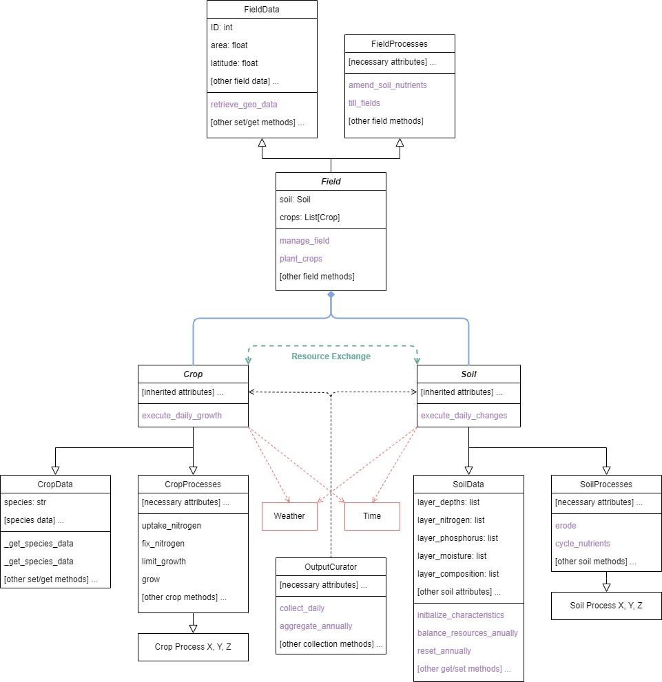
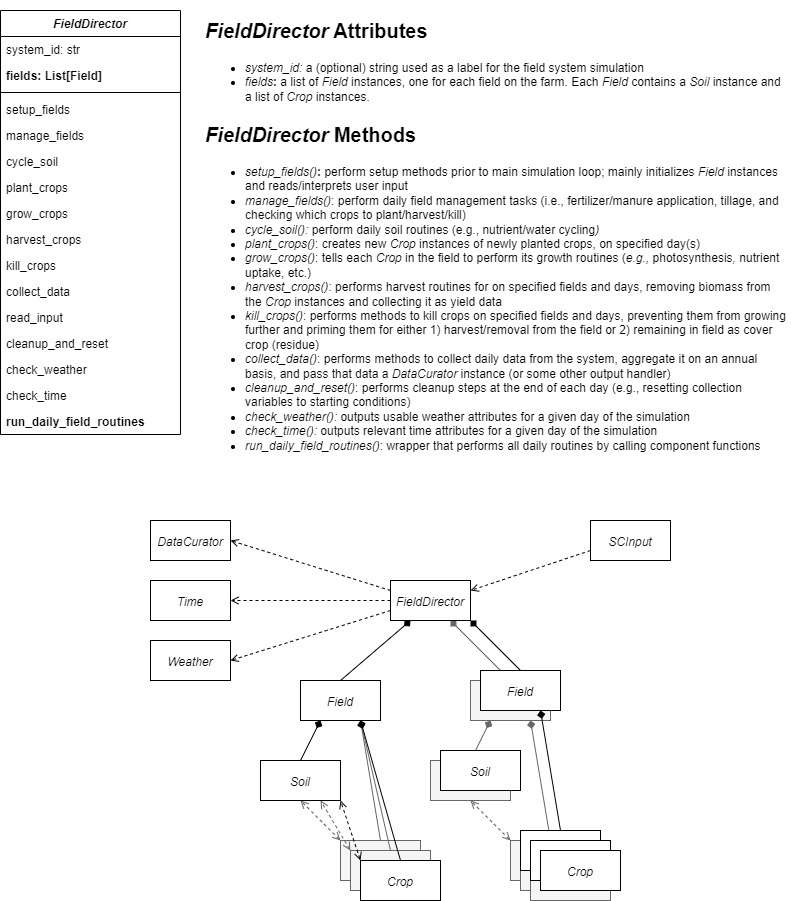
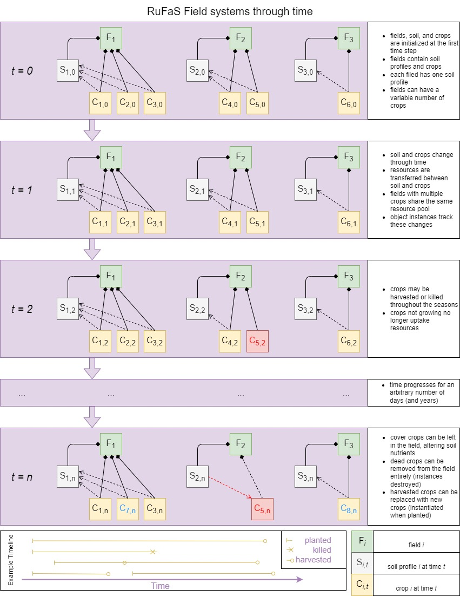

# Design Document: Soil and Crop Module Redesign

Authors: Clay J. Morrow
Date created: 22 Mar 2023
Last updated: 22 Mar 2023
Reviewers: [TBD]

## Contents:
1. [Overview](#overview)
2. [Context](#context)
3. [Requirements](#requirements)  
   a. [Fields](#fields)  
   b. [Crop Species](#crop-species)  
   c. [Crop Rotation](#crop-rotation)  
   d. [Coover Cropping](#cover-cropping)  
   e. [Soil Amendments](#soil-amendments)  
   f. [Tillage Practices](#tillage-practices)  
   g. [Outputs](#outputs)  
   h. [Beyond v1](#beyond-v1)  
4. [Milestones](#milestones) 
5. [Existing Solution](#existing-solution)
6. [Proposed Solution](#proposed-solution--design-details-)
7. [Alternative Solutions](#alternative-solutions)
8. [Testability, etc.](#testability-monitoring-and-alerting)
9. [Cross-Team Impact](#cross-team-impact)
10. [Open Questions](#open-questions)
11. [Details](#detailed-scoping-and-timeline)  
    a. [Module Design and Structure](#module-design-and-structure)  
    b. [Timeline](#timeline)  

---

## Overview

This document will outline the new design for the Soil and Crop submodule of the RuFaS model. It will largely focus
on *redesigning* this module, since the original design had major problems. Here, I will outline the desired structure
of the module and its components, the requirements of the module, the steps taken to achieve those requirement goals 
along with estimated timelines, and the implications for RuFaS. 

Note: that details present in this document are revised version of the files 
[road-map_soil-and-crop.md](road-map_soil-and-crop.md) and 
[functionality-requirements.md](functionality-requirements.md).

---

## Context

As of the conception of this redesign (October 2022) and this writing (March 2023), the Soil and Crop module (SC), 
located primarily in `RUFAS/routines/field/`, is in a state of disarray and bugs are near-impossible to track down. 
Below is a list of the general problems that this redesign aims to address:

* The model returns entirely inaccurate results. For example, Crop yields are much lower than expected and are
inconsistent across years. 

* The components and sub-modules are not independent or isolated. For example Performing tests requires running the
**entire** model and looking through all the output.

* Formal unit tests are not implemented for any of the code, so every component's integrity is suspect.

* Format and structure is not consistent throughout the module

* Documentation, both for the module components and the overall model, is severely lacking and sometimes conflicts
with what the code does in actuality.

* Names of module entities are poorly selected and not intuitive.

For these reasons, RuFaS leadership (Kristan, Pooya, Joe, and I) decided that the est course of action was to rebuild
SC, essentially from the ground up, following improved standards and guidelines for a stable and reliable module.

---

## Requirements

Kristan laid out a series of requirements of the Soil and Crop module for version 1 (v1) and beyond. In general, this
document will focus on v1 requirements, but in planning for future features will also prevent difficult re-writes later
on, so we also describe known requirements for the future as well.

I've broken the requirements into sections based on the hierarchical organization structure present in the model's 
simulated farm systems (and in real systems). These requirements are formatted as checklists so that they can be 
ticked when as requirements are met.

### Fields

Farms should consist of collections of fields and their respective traits:

* [ ] each field has dimensions (i.e., the growing area) and geographic location (lat, long at midpoint)
* [x] each field has soil specifications (or general soil attributes for all fields in an area)
* [ ] multiple fields should grow crops simultaneously
* [x] fields/nutrient pools should be independent of each other (e.g., field $A$ grows crop $X$ with method $M$ 
while field $B$ grows crop $Y$ with method $L$, etc.)

### Crop Species

The module should be able to handle different crop types (species) interchangeably and execute routines based upon 
their attributes. At minimum, the following crops should be handled:

* [x] corn
* [x] alfalfa
* [x] grass - (tall fescue)
* [x] soybeans
* [x] winter wheat
* [x] winter rye
* [ ] triticale
 
All crops need to:

* [x] have species-specific default traits (attributes)
* [ ] be planted on specified days and/or according to a schedule
* [ ] be harvested on specified dates, according to a schedule, or according to a growth metric (i.e., "optimal" 
harvest)
* [ ] grow on a daily basis. During this process:
  - [ ] crop growth depends upon temperature, light, water, and nutrients
  - [ ] crops remove/exchange resources from soil
  - [ ] crops accumulate biomass
* [ ] remain unharvested, if specified
* [ ] leave biomass on field after cut, if specified (cover crop)
* [ ] fix nitrogen, if applicable

### Crop Rotation

Fields should be able to experience rotation schedules, if specified such that the following cases are handled:

* [ ] regular cycles/patterns repeated **across** years (e.g., crop $A$ in first year followed by 3 years of crop $B$)
* [ ] regular cycles/patterns repeated **within** years (e.g., cash crop in summer followed by cover crop in 
fall/winter)

### Cover Cropping

The model should also allow cover cropping, in which cover crop species are:

* [ ] planted on a specified date, typically after harvest of a cash crop
* [ ] grown daily, as in the [Crop Species](#crop-species) section. 
* [ ] optionally cut and left in the field to affect other processes such as:
  - [ ] slow/reduce runoff/erosion
  - [ ] increase/improve water infiltration 
  - [ ] return nutrients to soil (as residue)
  - [ ] improve nutrient retention of soil (trap crop)
  - [ ] reduce/mitigate soil compaction

### Soil Amendments

Nutrient additions to the soil should be handled:

* [x] no nutrient addition
* [x] manure application
* [x] commercial fertilizer application
* [x] both manure and fertilizer application

### Tillage Practices

The following soil tillage practice options should be implemented:

* [x] No-till (no soil tillage) should:
* [x] Standard Tillage (with rates specified; e.g., depth, percentages, etc.)
* [ ] Conservation Tillage

All methods should appropriately account for and/or alter:

* [ ] soil erosion
* [ ] water infiltration
* [ ] nutrient and water cycling/composition
* [ ] leeching
* [ ] soil compaction
* [ ] mixing (e.g., mixing fertilizer/manure into soil profile)

### Outputs

The model should return at least the following outputs **for each year**:

* [ ] emissions (i.e., $N_{2}O$, $NH_3$, $CO_2$)
* [ ] nutrient leaching and runoff (i.e., $N$ and $P$)
* [ ] water use
* [ ] energy usage (i.e., fossil fuels)
* [ ] soil nutrients ($C$, $N$, $P$)
* [ ] crop yields (mass)
* [ ] crop yields (mass)
* [ ] crop composition ($C$, $N$, $P$, $H_{2}O$, etc.)

### Integration

In addition to all these features, SC needs to be properly intergrated both amongst its own sub-modules and with other
RuFaS Modules:
* [ ] Field, Crop, and Soil, processes are connected and integrated (via the field manager). 
* [ ] SC takes, as input, results from the manure module. The manure generated by livestock is used to grow crops
* [ ] SC passes its output as input to the feed storage module
* [ ] SC needs to interact with the animal module once grazing is implemented (post v1)

### Beyond v1

#### Multi-Cropping

The model needs to be able to grow multiple crops at the same time in a single field. Multi-cropping should include:

* [ ] any number of crops grown together
* [ ] all crops drawing from (and limited by) the same resource pools
* [ ] nitrogen fixers and non-fixers grown together
* [ ] daily accumulation of biomass for each species
* [ ] overall biomass yield, in addition to species yields, after harvest

#### Customizable Species

With respect to crop species, users should be able to:

* [x] configure existing species, with alternative attribute values
* [x] create a custom species (e.g., beetroot) by defining all necessary attributes

#### Soil Amendment Options

Manure Application:

* [ ] differentiate between broadcasting (spread onto surface) and injection (knife, sweep, or disk variants)
* [x] nutrient composition of the manure should have sensible defaults **and also** be customizable

---

## Milestones

**Other Note:** Re-review this section and update it according to Pooya's example

Below are measurable components that the module should have, which will be tracked as development
continues. 

* All the main process files (`.py`) need to be reformatted and reorganized to the new design, 
cross-checked with source documentation, tested, and documented (updated pseudocode). 
The original versions should remain in-tact and new versions placed in `SC_redesign/Crop_and_Soil/` until the redesign
is complete. In total, there are:
  - [x] 10 crop files, 2671 lines (`RUFAS/routines/field/crop/`): Done (Feb 2023)
  - [ ] 23 soil files, 2213 lines (`RUFAS/routines/field/soil/`): Approx. 52% finished (Mar 2023), expected April 2023 
  - [ ] 4 field management files, 295 lines (`RUFAS/routines/field/field_management`): 

* The main classes need to be rewritten with new formatting guidelines, and linked to the process classes.
  - [ ] `Soil`: mostly finished, dependent upon refactored soil files above: expected April 2023
  - [x] `Crop`: functionally finished (Mar 2023), minor tweaks likely as other files updated
  - [ ] `Field`: design finished, needs implementation (expected late April/early May 2023)

* [ ] The current `Crop.py` file (`RUFAS/routines/field/crop/`) needs to be re-written and organized 
into the new `FieldManager` class: expected May 2023 

* the new data manager and `SCInput` classes need to be created and utilized: expected May 2023

Here are a general list of things that the module code needs to do:

* [x] `Crop` should be able to initialize with different species-specific attributes and from input data: Feb 2023
* [x] `Crop` component methods should reflect daily crop processes (e.g., SWAT): Feb 2023
* [x] `Soil` should be able to initialize with soil profile attributes from input data: Mar 2023
* [ ] `Soil` component methods should reflect daily soil processes (e.g., SWAT): in progress, expected April 2023
* [x] `Field` should be able to initialize with different dimensions and geography, from input data: Feb 2023
  - should be able to initialize `Crop`(s) and `Soil`, passing them the data they need
  - needs to have one `Soil` and 0-n `Crop`
* [ ] `Field` methods should reflect field management processes (apply manure/fertilizer, plant/harvest crops, 
expected May 2023
  - methods should manage crops one by one 
  - and will often be wrappers that call `Soil` and `Crop` methods
* [ ] `FieldManager` should be able initialized based on input data: expected May 2023
  - should be able to initialize a number of `Fields`, passing them data they need
* [ ] `FieldManager` methods should reflect management of the system: expected May 2023
  - should track which `Field`/`Soil` processes need to run and execute them accordingly, such as: 
    + `Crop` planting/multi-cropping
    + following cropping patterns
    + `Crop` growing season/dormancy
    + `Crop` cutting/harvesting/killing/cover-cropping
    + fertilizer/manure addition to `Soil`
    + `Soil` tillage
  - should manage fields one by one
  - should pass relevant weather and time data to `Field`
  - should accept input from `SCInput` and pass output to output manager

In support of the milestones present in this document, the 
[Soil and Crop Redesign](https://github.com/orgs/RuminantFarmSystems/projects/1/views/2) GitHub Project contains all 
the itemized tasks for this particular project. These tasks are tracked and updated every time our developers work on
these tasks. While we will periodically update this file, the GitHub project is the best way to follow the progress
of this module. In particular, 
[this graphic](https://github.com/orgs/RuminantFarmSystems/projects/1/insights/2) shows the absolute and proportional 
subdivision of tasks between "Todo", "In Progres", and "Done". As seen from this figure, the number of tasks associated
with the project has been increasing (as we find new problems/issues) but the rate at which we complete tasks has grown
at a much greater rate.

---

## Existing Solution

The existing Crop and Soil module exists in 
[RUFAS/routines/field/](https://github.com/RuminantFarmSystems/MASM/tree/SC_redesign/RUFAS/routines/field) but, as
discussed in the [Context](#context) section, this version of the model is poorly implemented.

---

## Proposed Solution (design details)

As stated previously, we have decided to fully redesign the SC module. 

We have chosen to use the [composite class design](https://en.wikipedia.org/wiki/Composite_pattern) as the main 
pattern for this module. This pattern was chosen due to the complex nature of the main entities, each of which 
are governed by many complex processes. Therefore, creating these entities as composite classes and making the 
processes component classes, we are able to organize the complex project across files that each serve a specific 
purpose. The composite contains all the functionality of the component classes, while the code for that class being 
overly complex.

Each method and feature that is re-written or refactored will be fully tested concurrently. This will ensure that
the tests do not fall behind the implementation.

## Alternative Solutions

We considered using an [inheritance pattern](https://en.wikipedia.org/wiki/Inheritance_(object-oriented_programming)), 
but decided against it because the structure of our system does not really lend it self to this design. We also 
considered writing each process method into the class files directly, but this would have led to extremely large
files with many many methods in each class, with a variety of functionality. 

All alternative solutions seemed much less parsimonious than the composite pattern.

We also considered using full test driven development, but decided against it since none of the programmers were
experienced enough to make it an efficient use of time. Rather than writing tests before the implementation,
we settled for writing them concurrently with the implementation (or immediately afterwards). 

---

## Testability, Monitoring, and Alerting

In addition to the tests written with each method implemented in the redesign, we will also write tests that check the
overall functionality of the SC module. We will have formal tests that evaluate and demonstrate the 
[requirements](#requirements). We will also create validation tests (after v1) that check the full model against 
pre-computed results to alert us when updates to the model lead to changes in the output values. This will likely need
to be a project of its own since its scope is so large (likely done in tandem with validation testing, sensitivity
analyses, and mathematical optimization).

---

## Cross-Team Impact

The primary impacts that this redesign will have on the entire RuFaS team is delay of accurate crop and soil
simulations. Because the redesign is such a large undertaking, human resources for the SC team are limited, and
new problems are difficult to anticipate, it is difficult to estimate when this project will be completed. 

However, there are few functional effects on the rest of the team. We have left the original code entirely in-tact
while we work on the redesign, which resides in an entirely separate directory. Once the redesign is complete, it will
replace the old code, but for not the old version is still running.  

We expect the inputs and outputs of the SC module to be roughly the same as they were prior to the redesign: we still
need the same variables and calculate the same quantities. 

---

## Open Questions

* The main open question is when this redesign will be fully completed. At present, we are hopeful to finish by the end
of May. 
* Another question is how to effectively create integration tests and tests to validate that the overall SC model
runs as expected. 

---

## Detailed Scoping and Timeline

### Module Design and Structure

This section will outline, in detail, how the module is/will be organized. An early schematic for the design can be 
seen in the image below: 



#### Basic structure: Field, Soil, and Crop

The three main classes in this module are `Field`, `Soil`, and `Crop`. 

* A `Field` instance represents a single agricultural field on a farm (**or** a management unit: i.e., all fields on a
farm that are exposed to **identical** management practices). 
  - data attributes contain high-level information about the field such as 
  its dimensions and geographic location. 
  - contains a single `Soil` instance, and a variable number of
  `Crop` instances (in a list). 
  - methods pertain to management of the field (e.g., applying fertilizer, 
  planting/harvesting crops, etc.) and often correspond to following a schedule (do x on date Y).
  - initialized at the start of a simulation and persists for the full duration,
  changing as time passes

* A `Soil` instance represents the soil profile of a single agricultural field.
  - built from `SoilData`, whose attributes contain information about the soil such as water and 
  nutrient content. 
  - because a soil profile typically consists of multiple layers, `Soil` has also has a series of `LayerData` components
    (in a list) that track variables for each layer. 
  - component "process classes" contain methods that pertain to soil processes (e.g., nutrient cycling, erosion, etc.)
  - initialized by/with its containing `Field`, changing as time passes

* A `Crop` instance represents a single crop species within an agricultural field.
  - has the component `CropData` whose attributes contain information about the crop such as species-specific
  data values, planting/harvest dates, biomass composition, etc.
  - component "process classes" contain methods pertaining to crop processes such as nutrient uptake, 
  increasing/decreasing biomass, etc.
  - depends upon and interacts with the `Soil` in its `Field` (e.g., exchanging resources)
  - initialized when planted, destroyed when killed (after collecting final 
  data), changes as time passes
  - may coexist with other `Crop` instances within the `Field` at a given time.
  
In pursuit of modularity and isolation, and as stated previously, these classes will follow the "composite" design 
pattern, wherein they are made up of (contain) other classes. The primary component classes are process classes, 
which each house methods for a particular process (biological, management, etc). For example the `Crop` class is a 
composite of `NitrogenIncorporation`, `PhosphorusIncorporation`, `GrowthConstraints`, etc. The main classes 
`Field`, `Crop`, and `Soil` all utilize from such process classes. The benefit of these process superclasses is 
that they can be run/tested in isolation while coming together in the main class to work together for high-level 
processes. It also allows each of the units or classes to be completely agnostic of the other units. 

##### Main (composite) classes

In general, the main composite classes should receive most of their methods and attributes
from their respective components (e.g., `Crop` has an attribute `nitrogen_incorporation` which is an instance
of `NitrogenIncorporation` and `nitrogen_incorporation.incorporate_nitrogen()` is called by the main method). However, 
some features may be implemented directly in the  composite class: 

* class and initialization methods can be kept in base classes, when possible. As an 
example, the class method `Crop.plant_species(species)` initializes a crop with preset data values according to the 
`species` given. 

* Other situations may arise where methods and attributes should be housed in
the base class. Use good judgement, refer to the design principles, and ask
for a second opinion.

##### Data classes

Data class components control the configuration/setup of each composite class and track the relevant state 
variables/attributes. 
For example, the `Crop` class is initialized with a component attribute `data` which is an instance of `CropData`. This
instance contains all the crop's data values and is used and updated by the other components. The starting value of one 
such attribute `data.nitrogen` is used and updated by `nitrogen_incorporation.incorporate_nitrogen()` and the
updated value is used by `growth_constraints.constrain_growth()` to calculate the crop's growth for the day. This 
process is repeated every day that the crop grows and many of the crop variables are utilized in this way.

##### Process classes

The process classes will be utilized by the composite classes. 
They should follow consistent format, structure, and organization:

* they should be kept in separate files, with names referencing the overarching process or system. For
example, `nitrogen_incorporation.py` contains the `NitrogenIncorporation` class and related functionality. 

* they should be responsible for methods related to a single kind of process. For 
example, `NitrogenIncorporation` contains methods and attributes related to a 
crop's demand for, uptake, fixation, and incorporation of nitrogen.

* they have/utilize data class components (e.g., `NitrogenIncorporation` is initialized with `data`, which is an 
instance of `CropData`. It is important that any variables used by multiple process classes are attributes of the data 
* class.

* see the section on [Design Principles](#design-principles) for more details

#### Managing the system: FieldManager

An SC simulation contains many instances of fields and their crops and soil which need to change
independently through time. The `FieldManager` class will be the high-level container that 
initializes and stores all the fields according to user input (from `SCInput`), tracks them 
through time (i.e., checks if the current date/weather should trigger an event), directs 
them to perform their tasks, and pushes their output to the output handler. See [details](#fieldmanager-details) and
[the example below](#fieldmanager-simulation-example)) for more information.

The main method of `FieldManager` (`manage_all_fields()`) will execute every day of the simulation. On each day, 
it will determine which `Fields` need to perform any actions on that day and will instruct those fields to perform
their routines. In most cases, the daily routines of each field will be called each day 
(via a `Field.manage_field()` method) and the individual `Field` will decide what needs to be done locally and perform
any relevant routines (e.g., `grow_crops()`, `till_field()`, `apply_manure()` etc..  

##### Input handling: SCInput

The model's configuration will be handled by the `SCInput` class (or similar), which provides data and 
specifications/configurations to the model (via `FieldManager`):

* the attributes of `SCInput` contain **all** necessary input for the SC module to run and any
optional input values.
  
* needs to be agnostic to the structure of the data and should contain 
`@classmethod` (or `@staticmethod`) functions that take data of different formats and returns the
class. As an example `SCInput.from_json()` would build the class from input
given in a .json file and `SCinput.from_dict()` would build from a dictionary,
etc.
  
* This way, we can change input format without changing the model - this class
will always give data to the module in the same format, regardless of
input format.

##### Data collection: OutputCurator

The `FieldManager` would pass relevant output to another auxiliary class `OutputCurator` (or similar), which collect 
any data generated by the model that needs tracking (e.g., from `Crop`, `Soil`, and `Field`) for output to the user. 
This occurs at the end of each iteration/day of the simulation. Like `SCInput` this class needs to be agnostic to the 
output structure and can have methods that reformat the data to the output desired depending upon interface/View. 

**Note:** this may be redundant with the new `OutputManager` class being developed by Pooya and Niko, so I'll simply 
refer to this as the "output manager" rather than by a class name. No matter what system RuFaS ends up using for output
handling, `FieldMangaer` will be agnostic and will push its output to whoever needs it.

##### FieldManager details

Here are some specifics about how `FieldManager` (and a SC simulation generally) should work:

* the main method `.manage_all_fields()` (or similar), which executes all field events for a day, is called by the
simulation engine every day. It:
  - checks the current date and time, evaluates if any events should be triggered (evaluated for each field) 
  - executes daily routines for each field one at a time (fully manage field `X` before moving on to field `Y`)
  - within a field, it tells the soil to complete all its daily and triggered routines
  - within a field, it tells each crop - one at a time - to complete their daily and triggered routines (remember,
  multiple crops in a field need to share soil resources)
* `FieldManager` handles dependence on temporal variables such as the current day, year, and 
weather and passes the **values** down the stack to entities that need them (e.g., `Crop.is_harvest_day(date)`).

##### FieldManager simulation example

Below is a detailed example of a how a SC simulation, via `FieldManager`, should behave for a system with 3 fields 
over a two-year simulation. **Note:** This example is meant to display the flexibility of the model, not a realistic 
scenario. Some functionality described may be beyond the expectations of v1 (e.g., grazing).

###### Example details (user specification/configuration):

* in the first field: 
  - the soil is fertilized on day 8 of both years.
  - the soil is tilled on day 5 of the second year.
  - corn is planted on day 10 of the first and second year of the simulation
  - corn is cut on day 100 of both years but is only harvested (collected) during the first year. 
  In the second year, the biomass is left in the field.
* in the second field: 
  - no fertilization occurs
  - no tillage occurs
  - no crops are ever planted
  - no grazing occurs
* in the third field:
  - no fertilization occurs
  - alfalfa is planted on day 8 of the first year (perennials only planted once)
  - alfalfa is harvested on day 90 of both years
  - corn is planted on day 10 of the first year
  - corn is never cut
  - grass is planted on day 15 of the second year
  - grazing occurs both years, starting on day 50 and ending day 100. The grazers prefer grass

A user could create the necessary configuration class with something like

```python
config = SCInput.from_dictionary(
    {"fields": {
        "field one": {
            "fertilizer_spec": {"application_day": 8, "application_years": (1, 2)},
            "tillage_spec": {"tillage_day": 5, "tillage_years": 2},
            "crop_spec": {
                "corn one": {"planting_day": 10, "planting_years": (1, 2), "harvest_day": 100, "harvest_years": (1, 2),
                             "collection_years": 1, "species": "corn"}
            },
            "grazing_spec": {}
        },
        "field two": {
            "fertilizer_spec": {},
            "tillage_spec": {},
            "crop_spec": {},
            "grazing_spec": {}
        },
        "field three": {
            "fertilizer_spec": {},
            "tillage_spec": {},
            "crop_spec": {
                "alfalfa three": {"planting_day": 8, "planting_years": 1, "harvest_day": 90, "harvest_years": (1, 2),
                                  "collection_years": (1, 2), "species": "alfalfa"},
                "corn three": {"planting_day": 10, "planting_years": 1, "harvest_day": None, "harvest_years": None,
                               "collection_years": None, "species": "corn"},
                "grass three": {"planting_day": 15, "planting_years": 2, 'harvest_day': None, "harvest_years": None,
                                "colleciton_years": None, "species": "forage grass A"}
            },
            "grazing_spec": {"start_day": 50, "end_day": 100, "grazing_years": 2, 
                             "crop_preferences": {"corn": 0.1, "forage grass A": 0.8}}
        },
    }}
)

FieldManager.setup(config)
```

###### Example steps:

`FieldManager.manage_fields()` is then called every day and does the following over the course of the simulation:

* Year 0, days 0:
  - startup: initializes the first `field` and its `soil`, followed by the second `field` and
  `soil`, and then the third (from specifications contained in `SCInput`)
  - enters first `field`: does (**A**) = applies daily `soil` routines (nutrient cycling, erosion,
  etc.)
  - enters second `field`: does (**A**)
  - enters third `field`:  does (**A**)
  
* Year 0, days 1-7:
  - does (**A**) for all `field`s

* Year 0, day 8:
  - enters first `field`:
    + fertilization triggered: nutrients are added to the `soil`
  - does (**A**) for second `field`
  - enters third `field`:
    + planting triggered = "plants" alfalfa by initializing a new `crop` (i.e.,
    `Crop.plant_species("alfalfa")`)
    + does (**A**)
    + does (**B**) = applies daily `crop` routines for the alfalfa

* Year 0, day 10
  - enters first `field`:
    + planting triggered: initialize a new corn `crop`
    + does (**A**)
  - does (**A**) for second `field`
  - enters third `field`:
    + planting triggered: initialize a new corn `crop`
    + does (**A**)
    + does (**B**) for alfalfa, then corn

* Year 0, days 11-49:
  - does (**A**) for all `field`s and (**B**) for all `crop`s
  
* Year 0, day 50:
  - does (**A**) and (**B**) for all first and second `field`s 
  - enters third `field`:
    + grazing triggered: grazers are released
    + does (**A**)
    + does(**B**)
    + does (**C**) = execute grazing routines (some % of `crop` biomass is removed each day)
    
* Year 0, days 51-89:
  - does (**A**) for all `field`s, (**B**) for all `crop`s, and (**C**) for the third `field`
  
* Year 0, day 90:
  - does (**A**) and (**B**) for first and second fields
  - enters third `field`:
    + harvest triggered: alfalfa `crop` is cut and biomass is collected, (alfalfa is not killed and 
    continues growing)
    + does (**A**)
    + does (**B**) for alfalfa and corn
    + does (**C**)
    
**From here on out, only days when events occur will be shown:**
    
* Year 0, day 100:
  - enters first field:
    + harvest triggered: corn is cut, collected, and killed (the `crop` is destroyed)
    + does (**A**)
  - does (**A**), (**B**), for second and `field`
  - enters third `field`:
    + end grazing triggered: stop grazing routines
    + does (**A**)
    + does (**B**)
  
* Year 1, day 5: tillage routines triggered in first `field`, ...

* Year 1, day 8: fertilization routines triggered in first `field`, ...

* Year 1, day 10: planting triggered - new corn `crop` initialized in first `field`, ...

* Year 1, day 15: planting triggered - new grass `crop` initialized in third `field`, ...

* Year 1, day 50: grazing triggered - grazing routines start again in third `field`, ...

* Year 1, day 90: harvest triggered - alfalfa collected, ...

* Year 1, day 100: 
  - harvest triggered - corn is cut, killed, and left in the first `field`, (**B**) 
  no longer occurs in first `field` since all crops are gone, 
  - end grazing triggered: strop grazing routines in third `field`, 
  - ...

Note that, at the end of each day, `manage_fields()` would also be sending data to the 
output manager. At the end of each year (and the simulation), the output manager would
aggregate/summarize these data.

---

###### Visualization

An old schematic for the `FieldManager` class (aliased "FieldDirector") and its structure is shown by the following
figure:



and the conceptual model for the simulation is shown in this image:




### Timeline

This redesign project is somewhat unpredictable in terms of time. Because we are not the original authors of the code,
we do not fully understand its intricacies and nuances. This means that as we take on new files to refactor and learn
more about the design of the old code, we gain greater insight into what needs to be done and how. New tasks are
created as we learn more and even the code that we've already re-worked my need to be further tweaked once new
information from elsewhere in the model comes to light. With all that said, acknowledging that this is an iterative
process, I will attempt to give an estimate of when the project will be completed. These estimates are based on a few
important factors. 1) experience: based on how long it has taken us to get to where we currently are, we might expect that a similar level
of efficiency will continue for the remaining tasks (per person, per task); 2) resources: as of this writing, I (Clay)
am preparing to leave my position for a new job. That leaves 2 developers on the Crop and Soil team. Ed is working full
time and Matthew is working part-time between classes. 

Here are my estimates:
* Best case scenario: If everything goes right, the project might be finished in **early May**
* Most likely scenario: A more realistic estimate is **mid-late May**
* Worst case scenario: If things take longer than expected, I believe the project could be done **sometime in June**.
