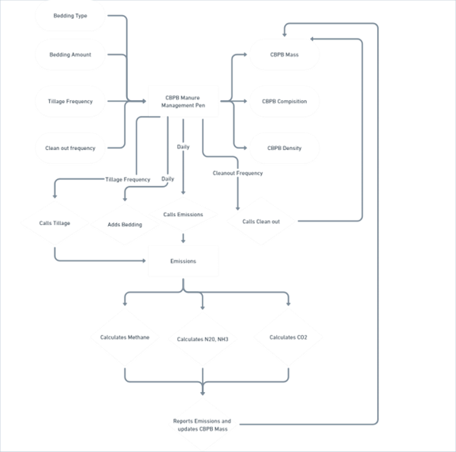
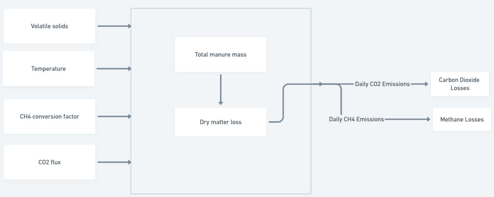
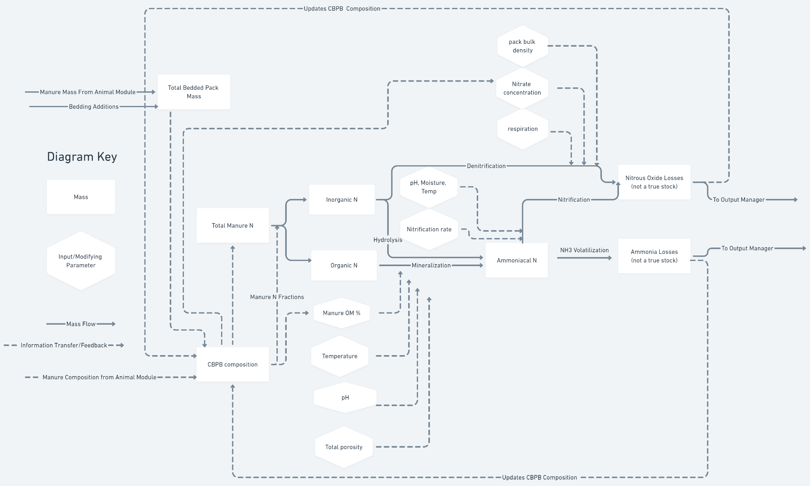

Compost bedded pack barn (CBPB)
===============================

   Compost bedded pack barn (CBPB)

   1. Title and People
   --------------------

   Authors: Varma VS

   Created on: 08, May 2023

   Last edited: 02, June 2023

   Reviewed by: Loi Phan, Kristan Reed

   Last reviewed:

   Status: Draft (R1)

   2. Overview

   ○ CBPB (Compost Bedded Pack Barn) is an alternative loose housing
   system for dairy cows. CBPB offers good comfort for lactating, dry
   and special needs cows. CBPB is also a manure management system that
   involves the addition of organic bedding material to animal pens
   regularly and manure mixture can be tilled to facilitate composting
   processes. The bedding material is added on top of the existing
   manure to maintain a dry and clean environment for the animals.

   ○ The primary objective of CBPB is to create a well-aerated and
   composting bedding pack within the barn. The composting process helps
   in the decomposition of organic matter, including the manure and
   bedding materials, which leads to the production of heat and
   microbial activity. This composting activity contributes to the
   breakdown of organic components and the reduction of moisture
   content, resulting in a drier and more stable bedding pack.

   ○ The composted manure from the CBP in the pens is cleaned out
   infrequently; when it does get cleaned out it is further managed in
   two ways: the composted manure can be moved to a composting facility
   for further storage and composting or it can be land applied. In this
   module we assume the final manure pack is land applied. (In future
   once we have the composting treatment method implemented, we will
   update two options of managing the manure pack)

   3. Context

   Traditional dairy housing systems often involve concrete flooring and
   limited bedding, which can lead to cow discomfort, suboptimal health,
   and laborious manure management etc. CBPB aims to address these
   issues by providing a soft, comfortable, and dry bedding surface for
   the cows, enhancing their comfort and overall well-being. These barns
   may also reduce manure storage costs and space, and save in labor and
   manure handling. CBPB can have significant effects on nutrient
   dynamics and gas

1

   Compost bedded pack barn (CBPB)

   emissions, and various mitigation strategies can be implemented to
   minimize their environmental impacts.

   | CBPB can be modeled using the IFSM and the Daycent model. These
     models utilize
   | process-based interactions to capture the dynamics of the system.
     While the IFSM and Daycent models are valuable tools for simulating
     CBPB and assessing their performance and environmental impacts,
     they do have certain limitations. These include limited user
     flexibility in understanding/changing their structure, inputs, and
     parameters.

   4. Requirements

   A. CBPB should start with acquiring the following information from
   animal module and pen class:

+-----------------------------------+-----------------------------------+
|    | a.                           |    | Pen ID and simulation days   |
|    | b.                           |    | Housing type (CBPB)          |
|    | c.                           |    | Number of animals            |
|                                   |    | Animal types (calf, Heifers, |
|    | d.                           |      lactating and dry cows)      |
|    | e.                           |    | Manure information (Manure   |
|                                   |      Mass (kg), Total Solids      |
|                                   |      (kg), Volatile Solids (kg),  |
|                                   |      Urea                         |
+===================================+===================================+
+-----------------------------------+-----------------------------------+

..

   concentration (gram/L), Urine (kg), Urine TAN (kg), Manure TAN (kg),
   Urine N (kg), Fecal Nitrogen (kg), Inorganic Phosphorus Fraction,
   Organic Phosphorus Fraction, Phosphorus (kg), Potassium (kg), Enteric
   Methane (kg))

+-----------------+-----------------+-----------------+-----------------+
| B.              |    The manure   |                 |                 |
|                 |    pens should  |                 |                 |
| C.              |    accept the   |                 |                 |
|                 |    bedding,     |                 |                 |
|                 |    tillage and  |                 |                 |
|                 |    weather      |                 |                 |
|                 |    information. |                 |                 |
+=================+=================+=================+=================+
|                 | a.              |    Bedding type |                 |
|                 |                 |    (sawdust,    |                 |
|                 |                 |    manure       |                 |
|                 |                 |    solids,      |                 |
|                 |                 |    straw)       |                 |
+-----------------+-----------------+-----------------+-----------------+
|                 | b.              |                 |    Bedding      |
|                 |                 |                 |    amount       |
|                 |                 |                 |                 |
|                 |                 |                 | (kg/animal/day) |
+-----------------+-----------------+-----------------+-----------------+
|                 | c.              |    Tillage      |                 |
|                 |                 |    activity     |                 |
|                 |                 |    (unitless,   |                 |
|                 |                 |    turning      |                 |
|                 |                 |    activity     |                 |
|                 |                 |    each day)    |                 |
+-----------------+-----------------+-----------------+-----------------+
|                 | d.              |                 |    Temperature  |
|                 |                 |                 |    (oC)         |
+-----------------+-----------------+-----------------+-----------------+
|                 |    The above    |                 |                 |
|                 |    information  |                 |                 |
|                 |    is collected |                 |                 |
|                 |    and used to  |                 |                 |
|                 |    calculate    |                 |                 |
|                 |    the manure   |                 |                 |
|                 |    composition  |                 |                 |
|                 |    and          |                 |                 |
+-----------------+-----------------+-----------------+-----------------+

..

   management each day, as follows.

   | a. Total manure mass (kg)
   | b. Density of the manure pack (kg/m3)
   | c. Ambient temperature (T,oC) and manure pack temperature (Tbp,oC)
   | D. Based on the compost bedding mass, composition, and temperature,
     the routine should calculate: (explained in proposed solution)
   | a. Loss of mass/ dry matter through CH4 and CO2 emissions (kg/day)
   | b. Loss of nitrogen through ammonia emissions (kg/day)
   | c. Loss of nitrogen through nitrous oxide emissions (kg/day)
   | The following metrics that describe the mass and composition of the
     compost-bedding material E.

   need to be calculated and updated each day based on additions from
   the bedding and animal manure and losses to emissions:

+-----------------------+-----------------------+-----------------------+
|    | a.               |    | Dry matter       |                       |
|    | b.               |      composition ( kg |                       |
|                       |      dry matter/ kg   |                       |
| c.                    |      total mass)      |                       |
|                       |    | Moisture         |                       |
| d.                    |      composition (kg  |                       |
|                       |      moisture(aka     |                       |
|                       |      water)/kg total  |                       |
|                       |      mass)            |                       |
+=======================+=======================+=======================+
|                       | i.                    |    Note this is equal |
|                       |                       |    to the non dry     |
|                       |                       |    matter fraction    |
+-----------------------+-----------------------+-----------------------+
|                       |    | Total Nitrogen   |                       |
|                       |      (kg N /kg dry    |                       |
|                       |      matter)          |                       |
|                       |    | Organic Nitrogen |                       |
|                       |      (kg organic N/kg |                       |
|                       |      N)               |                       |
+-----------------------+-----------------------+-----------------------+

2

   Compost bedded pack barn (CBPB)

   i. Organic N originates from fecal nitrogen so the initial
   composition can be found

from fecal N/total manure N

+-----------------------+-----------------------+-----------------------+
| e.                    |    Inorganic          |                       |
|                       |    Nitrogen( kg       |                       |
| f.                    |    inorganic N/kg N)  |                       |
|                       |                       |                       |
| g.                    |                       |                       |
+=======================+=======================+=======================+
|                       | i.                    |    Note Organic N +   |
|                       |                       |    Inorganic N =      |
|                       |                       |    total N            |
+-----------------------+-----------------------+-----------------------+
|                       | ii.                   |    Inorganic N        |
|                       |                       |    originates from    |
|                       |                       |    urinary N          |
+-----------------------+-----------------------+-----------------------+
|                       |    Total Ammoniacal   |                       |
|                       |    Nitrogen (kg total |                       |
|                       |    ammoniacal N/kg N) |                       |
+-----------------------+-----------------------+-----------------------+
|                       | i.                    |    Note this is a     |
|                       |                       |    subset of          |
|                       |                       |    Inorganic N        |
+-----------------------+-----------------------+-----------------------+
|             Methane          |    Nitrate            |                       |
|                       |    Composition (kg    |                       |
|                       |    Nitrate N/ **kg    |                       |
|                       |    total mass**)      |                       |
+-----------------------+-----------------------+-----------------------+

..

   5. Existing solution

   There is no CBPB method in RuFaS at this time

   6. Proposed solution

   The input information and the treatment method should work as follow:

❖ The manure method checks if the treatment scenario for a pen is
denoted as CBPB. Then the

   CBPB routine accesses the animal module and pen class for the animal
   and manure information.➢ It should collect the information related to
   animal type, number of animals, manure

   characteristics listed in the requirements.

   ❖ CBPB then accesses the bedding configuration to calculate the
   amount of bedding assigned to

   each animal type and the total mass needed.

   ➢ Example calculations can be found in Bedding calculations.

   ❖ Based on the compost bedding mass, composition, and temperature,
   the routine should

   | calculate the following:
   | ➢ Loss of mass/ dry matter through CH4 and CO2 emissions
   | ➢ Refer to section A and E - Methane and Carbon decomposition ➢
     Loss of nitrogen through nitrous oxide emissions
   | ■ Refer to section B - Nitrous Oxide Emission
   | ➢ Loss of nitrogen through ammonia emissions
   | ■ Refer to section C - ammonia Emission

   The following metrics that describe the mass and composition of the
   compost-bedding material need to

be calculated and updated each day based on additions from the bedding
and animal manure and losses

   to emissions:

   ➢ The dry matter (kg).

3

   Compost bedded pack barn (CBPB)

   The daily dry matter available is calculated from the C losses from
   methane and Carbon.

   | **"DMloss":**
   | To calculate the dry matter loss from compost as (CH4 and C) loss.
     This is done by two steps: (i) methane loss from Volatile solids
     (kg/day) and (ii) Carbon decomposition (kg/day)

   ➢ Mass of phosphorus (kg).

   | The equation for updating the compost composition specifically for
     phosphorus (P) can be expressed as follows:
   | Compost Composition (next day, P) = Compost Composition (current
     day, P) + Incoming Phosphorus - (Phosphorus Losses)
   | ➢ Pool of phosphorus (kg).

   | Water extractable inorganics is 50% of the total P (kg)
   | Water extractable organic P is 5% of the total P (kg)
   | Non-water extractable inorganic P = 11.25% of the total P (kg)
   | Non-water extractable organic P = 33.75% of the total P (kg)

   Mass of nitrogen (kg).

   Example calculations can be found in Section 7- Testing and
   Monitoring: D -Test the gas emissions and manure pack nutrient
   dynamics.

   | ➢ Fraction of Inorganic Nitrogen that is ammonium
   | "ammonium fraction in inorganic nitrogen": 0.3
   | The "ammonium fraction in inorganic nitrogen" refers to the
     proportion or percentage of inorganic nitrogen that is available in
     the form of ammonium.

   | ➢ Fraction of Nitrogen that is organic N
   | "organic nitrogen fraction in nitrogen mass": 0.4
   | The "organic nitrogen fraction in nitrogen mass" refers to the
     proportion or percentage of nitrogen that is available as an
     organic form.

   | ➢ Fraction of Nitrogen that is inorganic N
   | "inorganic nitrogen fraction in nitrogen mass": 0.6
   | The "inorganic nitrogen fraction in nitrogen mass" refers to the
     proportion or percentage of nitrogen that is available as an
     inorganic form

   ➢ Mass of potassium (kg).

   The equation for updating the compost composition specifically for
   potassium (K) can be expressed as follows:

4

   Compost bedded pack barn (CBPB)

   Compost Composition (next day, K) = Compost Composition (current day,
   K) + Incoming Potassium - Potassium Losses.

   | The compost bedded pack barn (CBPB) object structure is shown in
     the diagram below. The
   | manure_management JSON file is used to pass information about the
     CBPB manure management method to the manure management module.
     Manure management practices are assigned to a pen in the animal
     json file (i.e. animal_managment_animal.json). If the CBPB manure
     management method is assigned to a pen, the CBPB class will be
     initialized in manure_treatment_cbpb.py with the inputs provided in
     the relevant json files.

**Methane emissions**

5

   Compost bedded pack barn (CBPB)

   **Nitrogen loss - ammonia volatilization, and nitrous oxide**

6

   Compost bedded pack barn (CBPB)

   | 7. Testing and Monitoring
   | A. Test whether the pen class provides the animal type, number of
     animals, and the manure information.

   B. Test the animal space requirements, bedding added according to the
   animal type and number of animals within the pen.

   i. For example, if the animal type is a cow and the bedding
   Requirement per animal is 12 kg, then the number of Cows in the pen
   is 1000. To calculate the total bedding required: multiply the
   bedding requirement per animal by the number of animals: 12 kg \*
   1000 cows = 12,000 kg. So, the total bedding required would be 12,000
   kg.

+-----------------------+-----------------------+-----------------------+
| C.                    | i.                    |    Test the dry       |
|                       |                       |    matter loss and    |
|                       |                       |    the corresponding  |
|                       |                       |    manure pack        |
|                       |                       |    volume.            |
+=======================+=======================+=======================+
|                       |                       |    For example,       |
|                       |                       |    starting day 1 to  |
|                       |                       |    day 180 if the     |
|                       |                       |    total manure       |
|                       |                       |    (manure and        |
|                       |                       |    bedding            |
+-----------------------+-----------------------+-----------------------+

..

   material) dry solids in the pack is 1000 kg . After composting (180
   days), there is a 20% dry matter loss. Therefore, the amount of
   composted manure on Day 180 would be 800 kg (1000 kg - 20%).

   ii. To calculate the corresponding manure pack volume: Determine the
   remaining solids after the dry matter loss: 800 kg. Account for the
   moisture content: If, for example, the moisture content is 60%, then
   the dry solids would be 40% of the remaining solids: 800 kg / 0.6 =
   1333 kg (total manure). Convert the remaining manure to volume based
   on the density or compaction of the composted manure: If, for
   example, the density is 450 kg/m3, then the corresponding manure pack
   volume would be 1333 kg / 450 kg/m3= 2.96 m3.

   D. Test the gas emissions and manure pack nutrient dynamics.

   | For example, If the daily nitrogen (N) loss due to ammonia N and
     nitrous oxide N is= 0.05 kg, and the total daily N input is 0.5 kg,
     we can calculate the remaining N loss as follows:
   | Remaining N loss = Total daily N input - N loss due to ammonia N -
     N loss due to nitrous oxide N
   | Remaining N loss = 0.5 kg/day - 0.05 kg - 0.05 kg
   | Remaining N loss = 0.4 kg/day

   Therefore, the remaining N loss, excluding the losses from ammonia N
   and nitrous oxide N, is 0.4 kg/day.

   E. Test the pack clean out that removes manure mass from the pen,
   whenever there is a request from the crop and soil module (Example
   calculations in Manure Field connector document).

7

   Compost bedded pack barn (CBPB)

   8. Cross-Team Impact

   The output generated by the CBPB will be accessed and used by the
   Crop and Soil module for land application. The Crop and Soil module
   will rely on the information and data provided by the CBPB module to
   provide the composition of manure used for amendment

   Inputs

   Input Type 1- Manure_management.json:

   **Section 1: manure_management_scenarios section:**

   | Add the following configuration parameters:
   | {
   | "scenario_id": <a unique id>,
   | "bedding_type": "sawdust",
   | "manure_handler": "tillage",
   | "manure_separator": "none",
   | "manure_treatment": "compost bedded pack barn"
   | }

   Explanation:

   | "scenario_id": <a unique id>
   | This refers to the manure treatment scenario that is assigned.

   | "bedding type": “sawdust”
   | *Default:* Sawdust
   | This refers to the material used as bedding for the animals in the
     barn. Common types of bedding include straw, sawdust, and compost.
     Please refer to bedding_configs section for the different bedding
     types and the values.

   | "manure_handler": “tillage”
   | This refers to the process of physically tilling or agitating the
     manure material (compost pack) within the pen.

   To simulate the Composted Bedded Pack Barn (CBPB) system, the
   "manure_handler" input should include the process of tillage.

   When simulating the CBPB system, it is necessary to include the
   "manure_handler" parameter with the value set to "tillage" to ensure
   that the tillage process is taken into account. This will help in
   identifying the number of times the tillage activity is performed and
   the related energy calculations for the EEE team.

8

   Compost bedded pack barn (CBPB)

   | "manure_separator": “none”
   | No separator is considered.

   | "manure_treatment": “compost bedded pack barn”
   | This refers to the process of managing and processing manure by
     composting process within the compost bedded pack barn (CBPB).

   **Section 2: bedding_configs section:**

   | Add the following configuration parameters:
   | {
   | "bedding_type": "sawdust",
   | "bedding_mass_per_day": 12
   | "bedding_density": 210.0,
   | "bedding_dry_matter_content": 1.0
   | "Initial start up bedding": 0
   | }

   Explanation:

   | "bedding type": “sawdust”
   | The "bedding type" mentioned, "sawdust" indicates that sawdust is
     specifically used as the bedding material in a CBPB system. Straw
     and compost are also used in some occasions (refer to
     "bedding_mass_per_day" for the values).

   Note: To ensure accurate bedding type data collection, create user
   input for both bedding type and housing type, allowing users to
   specify the bedding type regardless of the housing type (e.g.,
   freestall or CBPB). Since the bedding type (variable name is shared
   among different housing types), this way even if the sawdust is used
   in different housing types, based on the “freestall” or “CBPB”, we
   can acquire the input value for the bedding.

   | "bedding_mass_per_day": 12
   | This refers to the amount of new bedding added to the pack on a
     regular basis to maintain the desired depth and condition of the
     pack. The amount added will depend on factors such as the number
     and size of the animals, as well as the type of bedding being used:
   | “sawdust” - (min, max, and default; 4.5, 12, and 12 kg/animal/d)
   | “straw” - (min, max, and default; 4.5, 12, and 11.3 kg/animal/d)
   | “compost” - (min, max, and default; 4.5, 12, and 11.3 kg/animal/d)

   "bedding_density": 210

9

   Compost bedded pack barn (CBPB)

   This refers to the bedding density per unit of volume (kg/m^3).

   | "Initial start up bedding": 0
   | This refers to the amount and type of bedding used when starting
     the compost bedded pack barn, (kg).

   | "bedding_dry_matter_content": 1.0
   | This refers to the dry matter content for bedding material, default
     set at 1.0.

   **Section 3: manure_handler_configs section:**

   | Add the following configuration parameters:
   | {
   | "manure_handler_type": "tillage",
   | "daily_tillage_frequency": 1
   | }

   Explanation:

   | "manure_handler_type": "tillage"
   | This refers to the process of physically tilling or agitating the
     manure material (compost pack) within the pen.

   | "daily_tillage_frequency": 1
   | This refers to the frequency of the activity to mix and aerate the
     organic material in the bedded pack, which helps to break down the
     material and create a more uniform bedding surface. The frequency
     of this process can vary depending on the farm practice (min, max;
     1, 3; times/day).

   **Section 4: manure_treatment_configs section:**

   | Add the following configuration parameters:
   | {
   | "total_solids_loss":
   | "nitrogen_loss_emissions":
   | "total_ammoniacal_nitrogen_loss_emissions":
   | "phosphorus_removal_efficiency_for_treatment": 0.0
   | "potassium_removal_efficiency_for_treatment": 0.0
   | }

   Explanation:

   "total_solids_loss":

10

   Compost bedded pack barn (CBPB)

   This refers to the degradation of total solids (dry matter) of the
   compost bedded pack during the composting process, over the storage
   time period .The daily dry matter is calculated from the C losses
   from methane and carbon emissions.

   | "phosphorus_removal_efficiency_for_treatment": 0.0
   | This refers to the percent of phosphorus loss during the process,
     over the storage time period (pack clean out) (min, max; 0, 10%).

   | "potassium_removal_efficiency_for_treatment": 0.0
   | The potassium loss (in the form of ammonia, nitrous oxide) during
     the process,over the storage time period (pack clean out) (min,
     max; 0, 10%).

   | "pH":
   | pH in the bulk of the manure, is calculated from equation
     **[M.1.D.2]**

   | "Pack clean out": 180
   | This refers to the activity of removing the old bedding and manure
     from the pack to create fresh compost. This process can vary
     depending on the specific system being used (min, max; 90, 180;
     days).

   | "moisture content after treatment": 55
   | This refers to the moisture content of the manure pack after the
     treatment, which normally is in the range of (min, max; 55, 65%).
     This is achieved by dividing the final dry weight(total solids) by
     the moisture content.

   Input type 2: Inputs from animal module

   These inputs are passed from animal module to manure module.

   Data type 1: Pen data:

   The "Pen data" refers to a dataset or information source that
   contains details about the type of animals and the corresponding
   number of animals present in the facility.

   | "Animal Type":
   | The specific type of animals housed in the compost bedded pack
     barn, such as calf, heifers, lactating cow, and dry cow.

   | "Number of Animals":
   | The total number of animals present in the barn.

   "Animal spacing": 5

11

   Compost bedded pack barn (CBPB)

   This refers to the amount of space provided per animal in the barn.

   Defaults are 5 m2/cow and 3 m2/growing animal (m2).

   The exact number will be determined based on the current animal
   composition in the pen.

   Data type 2: Manure excretion values calculated daily for each
   animal:

   The manure characteristics are collected from the animal module.

   | "Total Manure":
   | The total amount of manure produced by all animals in the barn,
     typically measured in mass (kg)

   | "Total Solids":
   | The quantity of solids present in the manure (kg).

   | "Degradable_Volatile_Solids" (kg):
   | The quantity of volatile solids in the manure that are
     biodegradable (kg).

   | "Non_Degradable_Volatile_Solids":
   | The quantity of volatile solids in the manure that are
     non-biodegradable and do not readily decompose (kg).

   | "Nitrogen":
   | The quantity of nitrogen in the manure (kg).

   | "Phosphorous":
   | The quantity of phosphorus in the manure (kg).

   | "Potassium":
   | The quantity of potassium in the manure (kg).

   | "Urea":
   | The concentration of urea in the urine (g/L). Also referred to “Cu”
     - Ammonia gas emissions section

   | "Urine":
   | The total amount of urine produced by all animals in the barn (kg).

   | "Urine_Total_Ammoniacal_Nitrogen":
   | The total amount of ammoniacal nitrogen present in the urine (kg).

   | "Manure_Total_Ammoniacal_Nitrogen" (kg):
   | The total amount of ammoniacal nitrogen present in the manure (kg).

12

   Compost bedded pack barn (CBPB)

   "Urine_Nitrogen" (kg):

   The amount of nitrogen contained in the urine (kg).

   "Inorganic_Phosphorus_Fraction":

   The proportion or fraction of inorganic phosphorus present in the
   manure.

   "Organic_Phosphorus_Fraction":

   The proportion or fraction of organic phosphorus present in the
   manure.

   "Phosphorus_Fraction":

   The proportion or fraction of phosphorus present in the manure.

   | Input Type 3: Weather data:
   | For compost barns, temperature at the surface of the bedded pack is
     similar to ambient air temperature.

   "Daily Average Temperature":

   The daily average temperature (oC).

   "Daily Precipitation":

   The daily precipitation (mm/day).

   | Input Type 4: CBPB-related manure constants:
   | These constants will be stored in manure_constants.py

   "Manure pack density": 650

   The initial density of manure and bedding in a compost bedded pack
   barn is in the range of (min,

   max: 600 , 800; default - 650) kg/m3each day before the process.

   "Bedded Pack Density": 350

   This refers to the mass per unit volume of the compost pack after the
   solids loss (kg/m3)(min,

   max; 350, 450)

   "Absorbance capacity":

   The property "Absorbance capacity" refers to the ability of different
   types of materials (sand,

   sawdust, straw, chopped straw) to absorb water. It is measured in
   terms of the ratio of kilograms of

   water absorbed per kilogram of material (kg H2O/kg). The absorbance
   capacity values provided for each

   material are as follows:

   "Sand": 4.22 kg H2O/kg

   "Sawdust": 0.27 kg H2O/kg

13

   Compost bedded pack barn (CBPB)

   "Straw": 2.63 kg H2O/kg

   "Chopped straw": 2.85 kg H2O/kg

   The value will be selected based on the bedding type added to the
   barn.

   Input type 5: CBPB-related gas emission constants:

   The link below leads to an external file that contains a table
   detailing the variable names, their

   corresponding definitions, and any constant values associated with
   the parameters of the Compost

   Bedded Pack Barn.

+-----------------------------------------------------------------------+
+-----------------------------------------------------------------------+

..

   These constants will be stored in gas_emission_constants.py

   "C/N" ratio is set at 15.

   "Bo" = maximum CH4 producing capacity for dairy manure, 0.24 m3CH4/kg
   VS Methane unit conversion factor = 0.67, conversion factor of m3CH4
   to kg CH4

   fnitrified_N_lost_to_N2O = 0.02 g N/g N2O, fraction of nitrified N
   lost as N2O.

   | "FN, conv"= 15.7, nitrification conversion factor, (kg N2O/ ha.
     day) / (g N / m2. day)
   | "Ffraction soil nitrified"= 2.67 x 10-4, maximum fraction of
     ammonium concentration in the soil nitrified.

   | "Ftemp"= 0.1, factor for the effect of temperature, dimensionless
   | "Fwfp"= 0.6, factor for the effect of soil moisture, dimensionless
   | "Fph"= 1, factor for the effect of soil pH, dimensionless
   | "FN,mass" = 0.157 (kg N2O/ha-day) /(µg N/cm2-day) unit conversion
     factor.

   | "fa" = 0.45, air‐filled porosity, fraction
   | "PO" = 0.1005, porosity, fraction.

   "Fr,WFPS = 0.65.

   "Decomp_effect_rate_manure":

14

   Compost bedded pack barn (CBPB)

   The effectiveness of the decomposition rate of manure, dimensionless.

   Manure - 1.35 x 10-3

   "Decomp_effect_rate_bedding":

   The effectiveness of the decomposition rate of bedding,
   dimensionless.

   Bedding - 3.58 x 10-4

   Bedding - 3.58 x 10-4

   "Kmax-nitrification of ammonium" = 2.67 \* 10-4, maximum fraction of
   ammonium concentration in the compost nitrified.

   dcompost = 33.4 cm, active compost depth of layer simulated (default)
   "ρdensity"= 1.25 g/cm3, bulk density of the compost.

   "Tbp"= 30oC, bedded pack temperature.

   | "T"= temperature, K (Use the Tbp value for T here, by converting it
     to K and use it in equation [M.1.C.3 and M.1.C.5] and elsewhere T
     applicable)
   | "U" = 0.028, air friction velocity near surface, m/s
   | "Va "= 2 m/s, ambient air velocity measured at standard anemometer
     height of 10 m.

   | "SC"= 0.57 (related to equation - M.C.1.4)
   | "Rs"= 3 × 105s/m, resistance to mass transfer through the manure.

   The effective resistance of the manure is a function of manure type
   with assigned values of 3 × 105s/m for solid.

   "Rc "= 2 ×105s/m, resistance to mass transfer through a storage
   cover.

   The resistance for covered manure storages is 2 ×105s/m.

   | "Ca" = 0, concentration of ammonia in ambient air, kg/m3
   | "pHf"= 8.0, surface pH of fresh manure.

   "pHn"= 7.5, surface pH of non-fresh manure.

   "Kf"= 10.0 L/kg, reference linear partitioning coefficient for
   ammonium adsorption (Waldrip et al., 2012)

15

   Compost bedded pack barn (CBPB)

   "OM"= 0.38, organic matter content of the manure pack, fraction.

   "Fclay"= 0.06, clay content of the manure pack, fraction.

   "OMref"= 0.70, organic matter.

   | "WFP" = 0.6, manure pack water-filled pores space
   | "ρs,avg"= 1.25 g/cm3, average density of the whole manure pack
     layer.

   | "FINES" = 0.19
   | FINES is calculated from clay and silt contents of the manure pack
     layer, 6 and 32%, respectively. Average of clay and silt contents,
     fraction (default set at 6 and 32%,) "fsur"= 0.4, porosity of the
     surface, fraction
   | "fmp"= 0.1005, porosity of the manure pack, fraction
   | "γ" = 0.1, slope of the logarithmic tension-moisture curve
   | "Fabs,max"= 0.50, maximum fraction of urine that can be absorbed.

   | "Csur"= 30.4 \* 10-3kg/m3
   | "Cair"= 12.8 \* 10-3kg/m3
   | "SCwater"= 7, Schmidt number (dimensionless) default value
   | "Ftemp"= factor for the effect of temperature, (dimensionless, 0.0
     to 1.0)
   | "FpH"= factor for the effect of compost pH, (dimensionless, 0.0 to
     1.0)
   | "Wwfps"= 65%, water filled pore space, percent
   | "MC" = 2, water content of the manure pack, cm H2O/cm compost
   | The formula for calculating moisture content is as follows:
   | Moisture Content (cm H2O/cm compost) = Water Content of Manure Pack
     (cm H2O) / compost Depth (cm)
   | For example, if the water content of the manure pack is 10 cm H2O
     and the soil depth is 5 cm, the moisture content would be:
   | Moisture Content = 10 cm H2O / 5 cm = 2 cm H2O/cm compost

16

   Compost bedded pack barn (CBPB)

   The open lot soil profile is modeled in four layers, with the first 3
   upper layers of 3.0 (surface), 4.5 and 7.5 cm depths representing the
   manure pack and a fourth layer with a 100 cm depth representing the
   underlying soil layer.

   | "D" = depth of the manure pack, 5 cm
   | "Cdry" = 0.50, carbon content of the dry matter (total solids)

   Outputs

   | "Manure Mass":
   | This refers to the wet mass. The mass can be (kg/d).

   | "Total dry mass":
   | This refers to the dry mass of compost (kg/d).

   | "Mass of Nitrogen":
   | This refers to the mass of nitrogen in the compost pack (kg/d).

   | "Mass of Phosphorus":
   | This refers to the phosphorus content in the compost pack (kg/d).

   | "Mass of Potassium":
   | This refers to the potassium content in the compost pack (kg/d).

   | "Organic phosphorus fraction":
   | The "Organic phosphorus fraction" refers to the proportion or
     percentage of phosphorus that is present in an organic form.

   | "Inorganic phosphorus fraction":
   | The "Inorganic phosphorus fraction" refers to the proportion or
     percentage of phosphorus that is present in an In-organic form.

   | "inorganic nitrogen fraction in nitrogen mass":
   | The "inorganic nitrogen fraction in nitrogen mass" refers to the
     proportion or percentage of nitrogen that is available as an
     inorganic form

   | "organic nitrogen fraction in nitrogen mass":
   | The "organic nitrogen fraction in nitrogen mass" refers to the
     proportion or percentage of nitrogen that is available as an
     organic form.

17

   Compost bedded pack barn (CBPB)

   "ammonium fraction in inorganic nitrogen":

   The "ammonium fraction in inorganic nitrogen" refers to the
   proportion or percentage of

   inorganic nitrogen that is available in the form of ammonium

   Existing outputs: (grouped to a pool - output manager)

   "Methane emissions":

   This parameter refers to the total amount of methane emissions (in
   terms of total gas) from CBPB on a daily basis (kg/d). (Equations
   **[M.1.A.1] to [M.1.A.2]**)

   | "CO2 emissions"”
   | This parameter refers to the total amount of Carbon CO2 emissions
     from CBPB on a daily basis (kg/d).

   | "Nitrous Oxide emissions":
   | This parameter refers to the total amount of nitrous oxide (in
     terms of total gas) emitted from the CBPB on a daily basis
     (N2O-Nitrogen kg/d). (Equations **[M.1.B.1] to [M.1.B.15]**)

   | "Ammonia emissions":
   | This parameter represents the total amount of ammonia (in terms of
     total gas) emitted from the CBPB on a daily basis (ammonia N kg/d).
     Simulation of ammonia emissions is done on an hourly time step and
     the daily emission is obtained by summing hourly emissions within
     the day. (Equations **[M.1.C.1][M.1.C.24]**)

   | "Total_Nitrogen_loss":
   | This refers to the nitrogen loss (in the form of ammonia, nitrous
     oxide) during the process. Daily loss of ammonia and nitrous oxide
     is determined from the cumulative loss up to a given date (pack
     clean out). By summing daily emissions over the storage time period
     (pack clean out), the loss is determined.

   Input data collection and processing

   The below sections describes the initial collection of inputs from
   the input sources and preliminary processing and calculations that
   are required before the CBPB composition change and emission
   processes can be calculated

18

   Compost bedded pack barn (CBPB)

   Handler (tillage) calculations

   Bedding calculations

   | "daily_bedding_addition_pen'":
   | Amount of bedding added each day with respect to the number of
     animals in the barn (kg/d). Calculated by multiplying the number of
     animals by the average bedding mass per animal.

   daily_bedding_addition_pens = Nanimals × Beddingmass per animal

   Where,

   | Nanimals= number of animals,
   | Beddingmass per animal = bedding mass per animal per day, kg

   Treatment (CBPB) calculations

   | "Total volatile solids":
   | The sum of degradable and non-degradable volatile solids, during
     the start of each day, over the storage time period, kg/d.

   | "daily_wet_matter_additions":
   | This refers to the amount of manure and bedding added to the barn
     (wet weight basis) (kg/d).

   daily_wet_matter_additions = Total manure mass + Total bedding mass

   | Where,
   | Total manure mass = the amount of manure produced by the animals in
     the barn (kg/d) Total bedding mass = the amount of bedding material
     used in the barn (kg/d)

   | "daily_dry_matter_additions":
   | This refers to the sum of total dry matter solids from the manure
     and bedding added at the start of each day, over the storage time
     period, kg/d.

   | "dry matter content of total compost material":
   | It is expressed as a percentage and represents the proportion of
     dry matter (solid material) within the total weight of the
     "Total_compost_material", %.

   “Daily pack volume":

19

   Compost bedded pack barn (CBPB)

   The initial daily pack volume before treatment can be calculated by
   multiplying the "Total manure generated" i.e
   daily_wet_matter_additions by the manure pack density. The equation
   is as follows:

   Daily pack volume = daily_wet_matter_additions × Manure pack density

   | "pack volume after solids loss":
   | This refers to the volume of the manure pack after the solids loss
     (loss of dry solids) m3. This is achieved by subtracting “pack
     volume after solids loss” from the “Daily pack volume”.

   “pack volume” = Daily pack volume − Treated pack volume

   The “pack volume after solids loss” is calculated by multiplying the
   "wet mass after solid loss" by the “bedded pack density”. Wet mass of
   the manure pack after solid loss is achieved by: The remaining total
   solids multiplied with the final moisture content (moisture content
   after treatment from Section 4: manure_treatment_configs section) of
   the manure pack.

   Treated pack volume = wet mass × Bedded pack density

   | "nitrogen_loss_emissions":
   | Calculated from the ammonia and nitrous oxide loss.

   | "total_ammoniacal_nitrogen_loss_emissions":
   | Calculated from the TAN loss.

   | "NNH4"= ammonium concentration in the compost, g N/m2-day
   | The value of NNH4, which represents the ammonium concentration in
     the compost (in g N/m2-day), can be obtained by calculating the
     total ammonium concentration based on the number of animals and the
     specified area.

   | To calculate NNH4, you would need the following information:
   | Total ammonium production: The total amount of ammonium produced by
     the animals in a given period.

   We have the area of the compost bedded pack (CBPB) where the animals
   are housed.

   Once we have these values, we can calculate NNH4using the formula:

   NNH4 = Total ammonium production / Compost area

   This calculation will give us the ammonium concentration in the
   compost per unit area per day.

   Nitrate to carbon dioxide ratio"r" = ratio NNO3 to CCO2,

20

   Compost bedded pack barn (CBPB)

   The values for NNO3 to CCO2 are available from theModel Assumptions
   and Parameter calculations section. Please convert theCCO2, from μg
   C/g to g C/g compost before performing the ratio calculations.

   r = NNO3 / CCO2 (g N/g C)

   "urea_conc"= urea concentration in urine, kg/m3(obtained from the
   animal module)

   "CTAN"= concentration of TAN in the manure solution, kg/m3

   | We get the concentration of TAN (Total Ammonia Nitrogen) in the
     manure solution from the animal module (g/L)
   | To convert the concentration from grams per liter (g/L) to
     kilograms per cubic meter (kg/m³), use the below calculations.

   CTAN = CTAN_I\* grams_to_kg / liters_to_cubic_meters

   | "Bedded Pack Surface Area" = surface area of the bedded pack, m2
   | Available from “Animal spacing” - Data type 1: Pen data, total
     number of animals in the barn (wrt to animal type) multiplied by
     the respective animal space area.

   Area = Total Number of Animals \* Animal Space Area

   | "Organic N"= organic N in storage is the fecal N, kg
   | No = fecal N, kg
   | The fecal N is available from the animal module - Manure
     information.

   We have the total nitrogen (kg/d) calculated. As a general estimate,
   the organic nitrogen fraction in dairy manure is often reported to be
   around 40-70% of the total nitrogen content.

   Calculations as following:

   | "ha to m2":
   | Area (ha) = Area in square meters (m²) / 10,000.

   | For example, total area of animals occupied in CBPB is 500 m2, then
   | Area (ha) = 500/10000
   | = 0.05 ha

   "Vmax"= maximum rate of urea conversion, kg N/m3wet feces-h
   (substitute the temperature, K value to solve the below equation and
   use the corresponding value in equation [M.1.C.1]) (In the given
   context, the "K" value represents the temperature in Kelvin (K)
   units. Use the compost bedded pack temperature Tbp)

21

   Compost bedded pack barn (CBPB)

   = 3.915 × 109 e-6463/T

   "Kmc"= Michaelis-Menten coefficient, kg N/m3mixture (substitute the
   temperature, K value to solve the below equation and use the
   corresponding value in equation [M.1.C.1]) (In the given context, the
   "K" value represents the temperature in Kelvin (K) units. Use the
   compost bedded pack temperature Tbp) = 3.371 × 108 e(-5914/T)

   Model Assumptions and Parameter calculations:

   This section contains the variables and parameters that need review.

   | "PO" = 0.1005, porosity, fraction
   | Porosity fraction (PO) = (Particle density - Bulk density) /
     Particle density
   | Particle density = 1.89 g/cm3
   | Bulk density = 1.7 g/cm3
   | PO = 0.1005, will be used from the gas emissions constants section.
     (Note: also referred to the total porosity, f)

   | "fa"= 0.45, air-filled porosity, fraction (cm3cm-3)
   | The POair (air-filled porosity also referred as fa) is
     [STRIKEOUT:initially] set to 0.45 as default, which is approximated
     from gas pore space measurements by Ayadi et al. (2015) for
     simulated bedded packs.

   "WFP"= 0.65, manure pack water-filled pores space, fraction

   | "Wwfps" = 65%, water filled pore space, percent
   | Linn, D. M., & Doran, J. W. (1984). Effect of water-filled pore
     space on carbon dioxide and nitrous oxide production in tilled and
     non-tilled soils. Soil Science Society of America Journal, 48(6),
     1267-1272. Table 1 from the above paper - cross reference from
     IFSM.

   "NNO3" is the nitrate concentration in the compost (g N g-1compost)

   On average, the nitrate fraction in nitrogen in compost typically
   ranges from 5% to 30%, we are assuming 10% (since we do not have the
   value for that).

   | To calculate NNO3, we would need the following information:
   | The total nitrogen (TN) in the compost material (kg). Once we have
     the value, we can calculate NNO3 using the formula:

   "NNO3"= 0.1 \* Total Nitrogen / Total dry mass (total solids) of the
   compost

   And the final output is expressed as g N g-1compost.

22

   Compost bedded pack barn (CBPB)

   | "CCO2"= 7,000 carbon dioxide flux, μg C/g compost
   | The total CO2 emission factors were estimated to be 10 g
     kg-1compost, and 7 g kg-1compost. Considering, 7 g C/kg compost is
     equal to 7,000 μg C/g compost.

   (Silver, W. L., Vergara, S. E., & Mayer, A. (2018). Carbon
   sequestration and greenhouse gas mitigation potential of composting
   and soil amendments on California’s rangelands. California Natural
   Resources Agency, 62).

   "U" = 0.028, air friction velocity near surface, m/s

   | = 0.02 \* Va 1.5 (related to equation - M.1.C.4)
   | 1.5
   | = 0.5 \* 0.02 \* Va

   "Va"= ambient air velocity measured at standard anemometer height of
   10 m (related to equation -M.1.C.4)

   Va = 2 m/s (considering a default value)

   Va= ambient air velocity for compost barns from literature range (1.6
   to 3.2 m/s).

   | IFSM reported - Effective air velocity is set to ambient air
     velocity for open conditions, half the ambient air velocity when a
     roof is used, and 0 m/s (i.e., no surface evaporation)
   | with a cover.

   Since, CBPB is roofed we consider half the ambient air velocity.

   "SC"= 0.57, Schmidt number (Perry et al., 1997), dimensionless
   (related to equation - M.C.1.4)

   Gualtieri, Carlo, Athanasios Angeloudis, Fabian Bombardelli, Sanjeev
   Jha, and Thorsten Stoesser. "On the values for the turbulent Schmidt
   number in environmental flows." Fluids 2, no. 2 (2017): 17. Table 1.
   Values of the Schmidt number for different substances in air and
   water. Schmidt number for NH3 = 0.57

   | "Csur"= 30.4 \* 10-3kg/m3
   | Considering the Tbp – temperature of the bedded pack at 30oC
     (Referring from the table- External CBPB document, to be reviewed)

   | "Cair"= 12.8 \* 10-3kg/m3
   | Considering average barn ambient temperature 12.8oC (Referring from
     the table -External CBPB document, to be reviewed)

23

   Compost bedded pack barn (CBPB)

   **Gas Emissions**

   | A. Methane
   | Currently, we use the methane gas emission equation provided by the
     Intergovernmental Panel on Climate Change (IPCC), which is also
     referred to in IFSM.

   Methane Calculation: IFSM (IPCC)

   When manure is allowed to accumulate into a bedded pack, CH4
   emissions are produced. For this management option, an adaptation of
   the tier 2 approach of the IPCC (2006) is used. Emission on a given
   day is determined as a function of the ambient barn temperature and a
   methane conversion factor (MCF).

+-----------------------------------+-----------------------------------+
|    ..                             | **[M.1.A.1]**                     |
| image:: vertopal_e4f80e0dc67749f6 |                                   |
| 89523bc44aca1003/media/image4.png |                                   |
|       :width: 2.78194in           |                                   |
|       :height: 0.34305in          |                                   |
+===================================+===================================+
+-----------------------------------+-----------------------------------+

..

   | where,
   | ECH4,floor = daily CH4 emissions from the floor, kg CH4/day
   | VS = volatile solids excreted in manure, kg VS/day (Please refer to
     "total volatile solids" from

   | the “Treatment CBPB calculations" section)
   | MCF = CH4 conversion factor for the manure management system, %.

   MCF is modeled as an exponential function of ambient barn temperature
   through a regression of the data provided by the IPCC (2006):

   |image1| **[M.1.A.2]**

   | where
   | Tb = ambient barn temperature,oC (Value obtained from - "Daily
     Average Temperature", weather data)

   B. Nitrous Oxide Emission

   To estimate total N2O emissions ( kg N2O/day), we need the toal area
   of the pen and then substitute that value in kg N2O/ha-day to get the
   total kg N2O emissions/day. Example calculation as below:

   For example, let's say the N2O emissions rate is 2 kg N2O/ha-day and
   the total area of the pen is 0.5 hectares (m2to ha conversion can be
   found in MFC constants):

24

   Compost bedded pack barn (CBPB)

   Total N2O emissions per day (kg N2O/day) = N2O emissions rate (kg
   N2O/ha-day) \* Total area of the pen (ha)

   Total N2O emissions = 1 kg N2O/day

   Model routines developed for cropland and open lots (see
   Environmental Information, Nitrous oxide section - IFSM) are adapted
   to represent several N processes for CBPB.

   In the IFSM (Integrated Farm System Model) with reference to N2O
   emissions, all variables are denoted as "soil" instead of "compost"
   where applicable. This means that when considering N2O emissions, the
   model specifically takes into account the composted materials rather
   than focusing on the soil alone.

   Emission of N2O in units of kg/ ha from composts is predicted as the
   sum of nitrification and denitrification losses:

   |image2| **[M.1.B.1]**

   | where
   | EN2O,compost = total emission of N2O from compost, kg N2O/ha-day
   | EN2O,compost,N = emission from compost due to nitrification, kg
     N2O/ha-day EN2O,compost,D = emission from compost due to
     denitrification, kg N2O/ha-day

   Nitrification emission

   Nitrous oxide is a product of nitrification and denitrification
   processes in the compost bedded manure pack. Nitrification is an
   aerobic process that oxidizes NH4 + to NO3, with the production of NO
   and N2O as intermediates. Compost nitrification is influenced by
   various factors such as temperature,moisture, pH, nitrification rate,
   and ammonium concentration etc. The below equations are taken into
   account to calculate the emission during nitrification.

   Emission from nitrification is predicted as:

+-----------------------------------+-----------------------------------+
|    ..                             | **[M.1.B.2]**                     |
| image:: vertopal_e4f80e0dc67749f6 |                                   |
| 89523bc44aca1003/media/image7.png |                                   |
|       :width: 3.61389in           |                                   |
|       :height: 0.16667in          |                                   |
+===================================+===================================+
+-----------------------------------+-----------------------------------+

..

   where

   RNO3 = compost nitrification rate, g N/m2day (RNO3 calculated using
   equation M.1.B.3)

25

   Compost bedded pack barn (CBPB)

   Compost nitrification rate

   The Compost nitrification rate is influenced by NH4 + concentration,
   water content, temperature, and pH. By considering these factors, we
   can simulate the compost nitrification rate. According to the model
   developed by Parton et al. (2001), the equation used for computing
   the compost nitrification rate, RNO3, is:

   |image3| **[M.1.B.3]**

   where

   NNH4 = ammonium concentration in the compost, g N/m2-day (refer to
   Treatment CBPB calculations)

   Denitrification emission

+-----------------------------------+-----------------------------------+
|    ..                             |    **[M.1.B.4]**                  |
| image:: vertopal_e4f80e0dc67749f6 |                                   |
| 89523bc44aca1003/media/image9.png |                                   |
|       :width: 5.29167in           |                                   |
|       :height: 0.40555in          |                                   |
+===================================+===================================+
+-----------------------------------+-----------------------------------+

..

   | where
   | EN2O,compost,D = emission of N2O from compost, kg N2O/ha-day
   | Fd,NO3 = factor for the effect of compost nitrate concentration, µg
     N/g compost-day (derived from the equation **[M.1.B.5]**)
   | Fd,CO2 = factor for the effect of compost respiration, µg C/g
     compost-day (derived from the equation **[M.1.B.6]**)
   | Fd,WFPS = factor for the effect of compost moisture, dimensionless
     (derived from the equation **[M.1.B.7]**)

+-----------------------+-----------------------+-----------------------+
| RNratio               |    = ratio of N2 to   |                       |
|                       |    N2O emission, µg   |                       |
|                       |    N/µg N (derived    |                       |
|                       |    from the equation  |                       |
|                       |    **[M.1.B.11]**)    |                       |
+=======================+=======================+=======================+
|    .. imag            |                       | **[M.1.B.5]**         |
| e:: vertopal_e4f80e0d |                       |                       |
| c67749f689523bc44aca1 |                       |                       |
| 003/media/image10.png |                       |                       |
|                       |                       |                       |
|     :width: 1.86528in |                       |                       |
|                       |                       |                       |
|    :height: 0.19861in |                       |                       |
+-----------------------+-----------------------+-----------------------+

..

   | where
   | NNO3 is the nitrate concentration in the compost (g N g-1compost)
     which is assumed to be 10% of the total N concentration (refer to
     Treatment CBPB calculations - Model Assumptions and Parameter
     calculations).

26

   Compost bedded pack barn (CBPB)

   Compost respiration factor

   The effect of compost respiration on the N2O flux due to
   denitrification, Fd,CO2, is predicted as (Parton et al., 2001):

   |image4| **[M.1.B.6]**

   | where:
   | Fd,CO2 = factor for the effect of compost respiration, μg C/g
     compost . day
   | CCO2 = compost carbon dioxide flux, μg C/g compost (refer to
     Treatment CBPB calculations -Model Assumptions and Parameter
     calculations) which is a function of the total compost organic
     matter

   Compost moisture factor

   The model of Parton et al. (2001) assumes that denitrification does
   not occur at a compost moisture below approximately 55%. Above 55%,
   denitrification increases exponentially and asymptotically approaches
   a maximum as composts approach saturation. This effect is predicted
   as:

+-----------------------------------+-----------------------------------+
|    .. i                           | **[M.1.B.7]**                     |
| mage:: vertopal_e4f80e0dc67749f68 |                                   |
| 9523bc44aca1003/media/image12.png |                                   |
|       :width: 3.38472in           |                                   |
|       :height: 0.36528in          |                                   |
+===================================+===================================+
+-----------------------------------+-----------------------------------+

..

   | where:
   | Fd,WFPS = factor for the effect of compost moisture, dimensionless

   a = factor controlling compost moisture content where denitrification
   is half the maximum rate arctan = arctangent function, radians

   Compost moisture content controlling factor

   |image5| **[M.1.B.8]**

   | where:
   | a = factor controlling compost moisture content where
     denitrification is half the maximum rate M = the interaction
     between compost moisture and respiration, dimensionless (calculated
     from **M.1.B.9**)

   Interaction between compost moisture and respiration

27

   Compost bedded pack barn (CBPB)

   |image6| **[M.1.B.9]**

   where:

   M = the interaction between compost moisture and respiration,
   dimensionless

   Dfc = gas diffusivity coefficient, dimensionless

   |image7| **[M.1.B.10]**

   Where,

   fa and PO (refer to CBPB-related gas constants)

   The ratio of N2 to N2O, RNratio, is predicted as:

   |image8| **[M.1.B.11]**

   where

   Fr,NC = ratio of electron donor (NO3) to substrate (CO2),
   dimensionless (derived from the

   equation **[M.1.B.12]**)

+-----------------------------------+-----------------------------------+
|    .. i                           |    **[M.1.B.12]**                 |
| mage:: vertopal_e4f80e0dc67749f68 |                                   |
| 9523bc44aca1003/media/image17.png |    **[M.1.B.13]**                 |
|       :width: 4.75in              |                                   |
|       :height: 0.20833in          |                                   |
|                                   |                                   |
|    .. i                           |                                   |
| mage:: vertopal_e4f80e0dc67749f68 |                                   |
| 9523bc44aca1003/media/image18.png |                                   |
|       :width: 3.5in               |                                   |
|       :height: 0.16667in          |                                   |
+===================================+===================================+
+-----------------------------------+-----------------------------------+

..

   where

   Dfc = refer to equation [M.1.B.10]

   r = ratio NNO3 to CCO2, g N/g C (refer to Treatment CBPB
   calculations)

   |image9| **[M.1.B.14]**

   For bedded packs, C decomposition is simulated for both manure and
   bedding. Unlike for

   croplands and open lots, Kdecomp for bedded packs is a function of
   temperature:

   |image10| **[M.1.B.15]**

   where,

   decomp_effectiveness_rate = effectiveness of decomposition rate,
   dimensionless (refer to

   CBPB-related gas emission constants)

28

   Compost bedded pack barn (CBPB)

   C. Ammonia (NH3) emissions

   The transformation of urea to TAN is modeled on an hourly time step
   as a function of temperature and urea concentration in manure

   |image11| **[M.1.C.1]**

   | where
   | RUC = rate of urea transformation to TAN, kg/m3-h
   | CU = urea concentration in urine, kg/m3(please refer to Treatment
     CBPB calculations)
   | T = temperature, K (Value obtained from - "Daily Average
     Temperature", weather data) (convertoC to K)

   The ammonia fraction of TAN in a manure solution is a function of pH
   and a dissociation constant (TAN_dissociation) that increases
   exponentially with temperature (Montes et al., 2009):

   |image12| **[M.1.C.2]**

   Where,

   "TAN_dissociation" = 0.74 \* 10(0.05 - 2788/T) **[M.1.C.2.1]**

   pH value is obtained from equation **[M.1.D.2]**

   Since NH3 has no charge, its activity coefficient will be close to
   1.0. To account for activity corrections, TAN_dissociation is
   multiplied by 0.74.

   The Henry’s Law constant, defined as the ratio of ammonia
   concentration in a solution in equilibrium with gaseous ammonia
   concentration in air, is exponentially related to temperature.

+-----------------------------------+-----------------------------------+
|    .. i                           | **[M.1.C.3]**                     |
| mage:: vertopal_e4f80e0dc67749f68 |                                   |
| 9523bc44aca1003/media/image23.png |                                   |
|       :width: 1.83333in           |                                   |
|       :height: 0.34305in          |                                   |
+===================================+===================================+
+-----------------------------------+-----------------------------------+

..

   | where
   | H = Henry’s Law constant for ammonia, dimensionless aqueous:gas.

29

   Compost bedded pack barn (CBPB)

   Equations M.1.C.2 to M.1.C.3 represent ammonia formation in an
   infinitely dilute solution. For a substance such as manure, ions in
   the solution affect the equilibrium of NH3 and NH4 + and thus the
   overall emission rate.The movement of ammonia away from the manure
   surface into the surrounding atmosphere is described in the model
   using a mass transfer coefficient (Eq.

   | M.1.C.8). Further, the rate of transfer is a function of the air
     velocity over the surface,
   | temperature of the manure and air, and the geometry of the surface
     in relation to air movement as described in the below equations.

   [STRIKEOUT:The following empirical relationships have been used to
   predict ammonia transfer from manure but most are based on conditions
   different from that of a flat manure covered surface.]

   |image13| **[M.1.C.4]**

   | where
   | Kg, gaseous layer = mass transfer coefficient through gaseous
     layer, m/s

   The mass transfer coefficient through the liquid film layer (Kl) is
   modeled as:

   |image14| **[M.1.C.5]**

   Kl, liquid film layer = mass transfer coefficient through the liquid
   film layer, m/s

   This coefficient has relatively little effect on the mass transfer of
   ammonia.

   |image15| **[M.1.C.6]**

   | where
   | Rm = resistance to mass transfer, s/m
   | (Rs and Rc refer to CBPB gas related constants)

   The overall mass transfer coefficient is the reciprocal of the sum of
   the three resistances to mass transfer:

   |image16| **[M.1.C.7]**

   | where,
   | Koverall mass transfer= overall mass transfer coefficient, m/s

30

   Compost bedded pack barn (CBPB)

   The values for H, Kg gaseous layer, Kl liquid film layer and Rm are
   derived from the equations (M.1.C.3 to

   M.1.C.6)

   The hourly rate of emission is then a function of the overall mass
   transfer rate and the difference in ammonia concentration between the
   manure and surrounding atmosphere (Datta, 2002):

   |image17| **[M.1.C.8]**

   | where
   | J = ammonia flux, kg/m2-s
   | Cm = concentration of ammonia in manure, kg/m (derived from the
     equation M.1.C.9) The values for H and Koverall mass transfer are
     obtained from the equation [M.1.C.3] and [M.1.C.7].

   The ammonia concentration in the manure is calculated from the bulk
   TAN concentration and F:

   |image18| **[M.1.C.9]**

   | where
   | CTAN = concentration of TAN in the manure solution, kg/m3(refer to
     CBPB treatment calculations)

   The value for F is obtained from equation [M.1.C.2]

   By linking equations **(M.1.C.1 to M.1.C.9)** for the emission of
   ammonia, emission rates are predicted from CBPB. The principles and
   relationships described above are used to predict emissions from each
   with some differences for the below CBPB.

   |image19| **[M.1.C.10]**

   | where
   | Fur = fraction of urine N that hydrolyzed, 0.0 to 1.0

   The fraction of urine infiltrating into the manure pack (IR) is
   computed as a function of the runoff curve number (CN):

+-----------------------------------+-----------------------------------+
|    .. i                           | **[M.1.C.11]**                    |
| mage:: vertopal_e4f80e0dc67749f68 |                                   |
| 9523bc44aca1003/media/image31.png |                                   |
|       :width: 1.125in             |                                   |
|       :height: 0.375in            |                                   |
+===================================+===================================+
+-----------------------------------+-----------------------------------+

31

   Compost bedded pack barn (CBPB)

   CN is derived from the equation M.1.C.13.

+-----------------------------------+-----------------------------------+
|    .. i                           | **[M.1.C.12]**                    |
| mage:: vertopal_e4f80e0dc67749f68 |                                   |
| 9523bc44aca1003/media/image32.png |                                   |
|       :width: 2.21805in           |                                   |
|       :height: 0.17778in          |                                   |
+===================================+===================================+
+-----------------------------------+-----------------------------------+

..

   | where
   | Ia = the initial abstraction for the manure pack
   | FC = field capacity of the manure pack, cm H2O/cm compost (derived
     from solving the equation *[M.1.C.15]*)

   CN is calculated from Ia using:

   |image20| **[M.1.C.13]**

   Ia = Derived from solving [M.1.C.12]

   Equations developed for calculating field capacity and saturation
   moisture content for open lots are:

   |image21| **[M.1.C.14]**

   | SAT = water content at saturation, cm H2O/cm compost
   | (PO and OM are available from the CBPB gas related constants)

   |image22| **[M.1.C.15]**

   FC = field capacity of the manure pack, cm H2O/cm compost (derived
   from solving the equation [M.1.C.15]

   As manure lays on the open lot until manure harvesting, ammonia can
   be emitted from fresh and non-fresh manure areas. Hourly ammonia
   emissions rates from fresh manure are

   determined using equations **[M.1.C.1] to [M.1.C.9]**, with the
   resistance to mass transfer.

   The same equations are used in estimating hourly ammonia emission
   rates from non-fresh manure areas. Ammonium adsorption is considered
   in calculating the ammonia fraction in TAN for non-fresh manure areas
   due to its higher degree of organic matter decomposition. As organic
   matter decomposes, the adsorption capacity of the manure pack
   increases (Bernard et al., 2009; Waldrip et al., 2012), which then
   gives more sites to adsorb cations that can include ammonium.

32

   Compost bedded pack barn (CBPB)

   The ammonia fraction in TAN (F) is computed by:

+-----------------------------------+-----------------------------------+
|    .. i                           | **[M.1.C.16]**                    |
| mage:: vertopal_e4f80e0dc67749f68 |                                   |
| 9523bc44aca1003/media/image36.png |                                   |
|       :width: 3.45833in           |                                   |
|       :height: 0.55139in          |                                   |
+===================================+===================================+
+-----------------------------------+-----------------------------------+

..

   where,

   TAN_dissociation = TAN dissociation constant (refer to equation
   **M.1.C.2.1**)

   Cs = concentration of solids available for ammonium adsorption, kg
   solids/L (derived from

   equation **M.1.C.17**)

   An equation for predicting Cs is derived using the manure pack
   characteristics:

+-----------------------------------+-----------------------------------+
|    .. i                           | **[M.1.C.17]**                    |
| mage:: vertopal_e4f80e0dc67749f68 |                                   |
| 9523bc44aca1003/media/image37.png |                                   |
|       :width: 2.5in               |                                   |
|       :height: 0.44861in          |                                   |
+===================================+===================================+
+-----------------------------------+-----------------------------------+

..

   The saturated hydraulic conductivity is estimated from the clay and
   silt contents using the

   relationship (R2= 0.95) derived by Delgado-Rodriguez et al. (2011):

+-----------------------------------+-----------------------------------+
|    .. i                           | **[M.1.C.18]**                    |
| mage:: vertopal_e4f80e0dc67749f68 |                                   |
| 9523bc44aca1003/media/image38.png |                                   |
|       :width: 2.70833in           |                                   |
|       :height: 0.375in            |                                   |
+===================================+===================================+
+-----------------------------------+-----------------------------------+

..

   where

   Khc,sat = saturated hydraulic conductivity, m/s

+-----------------------------------+-----------------------------------+
|    .. i                           | **[M.1.C.19]**                    |
| mage:: vertopal_e4f80e0dc67749f68 |                                   |
| 9523bc44aca1003/media/image39.png |                                   |
|       :width: 3.79167in           |                                   |
|       :height: 0.46806in          |                                   |
+===================================+===================================+
+-----------------------------------+-----------------------------------+

..

   where,

   Khc,adj = adjusted saturated hydraulic conductivity, m/s

   (fsur and fmp refer to CBPB gas related constants)

33

   Compost bedded pack barn (CBPB)

+-----------------------------------+-----------------------------------+
|    .. i                           | **[M.1.C.20]**                    |
| mage:: vertopal_e4f80e0dc67749f68 |                                   |
| 9523bc44aca1003/media/image40.png |                                   |
|       :width: 2.58333in           |                                   |
|       :height: 0.5in              |                                   |
+===================================+===================================+
+-----------------------------------+-----------------------------------+

..

   where,

   Khc,unsat = unsaturated hydraulic conductivity, m/s

   |image23| **[M.1.C.21]**

   where,

   Fabs = fraction of urine absorbed

   ABStotal = total absorbance capacity of the bedding material on the
   surface, kg H2O

   URINE = daily urine production, kg/day (refer to pen data)

   The ABStotal is given by:

   |image24| **[M.1.C.22]**

   where,

   ABSunit = absorbance per unit mass of bedding, kg H2O/kg bedding
   (refer to "Absorbance

   capacity" - CBPB-related manure constants)

   BEDanimal = mass of bedding per animal per day, kg bedding/animal-day
   (refer to bedding

   calculations - daily_bedding_addition_pen)

   ANIMALS = number of animals kept in the bedded pack barn (refer to
   pen data)

   The BEDanimal is a user-defined parameter.

   Properties, which include ABSunit, for several types of bedding
   materials (Misselbrook and

   Powell, 2005; Bickert et al., 2000) are summarized in Table 11.1
   (IFSM).

   |image25| **[M.1.C.23]**

   where,

   EVAP = amount of water evaporated, kg H2O/day

   Kwater coefficient = overall surface mass transfer coefficient of
   water, m/s (derived from equation

   M.1.C.24)

   (Area = available from CBPB related treatment calculations)

   |image26| **[M.1.C.24]**

34

   Compost bedded pack barn (CBPB)

   D. Total Ammoniacal Nitrogen

   Daily loss of ammonia N is determined such that the cumulative loss
   up to a given date cannot exceed the accumulated TAN loaded into the
   storage.

   | On a given day, the amount of TAN in storage is that accumulated up
     to that day minus that lost from the storage between the date
     loading began and the given date. The accumulated TAN is that
     removed from the barn plus the portion of the organic N that
     mineralizes to an
   | ammoniacal form during long-term storage. Mineralization is
     calculated on a daily time step where the rate of mineralization is
     a function of the manure temperature:

   |image27| **[M.1.D.1]**

   | where,
   | TANo = rate of organic N transformation to TAN, kg/d
   | No = Please refer to CBPB treatment calculations.

   Manure pH is a function of the solids content of the manure.

   |image28| **[M.1.D.2]**

   where

   DMC = dry matter content of the stored manure, fraction (value
   obtained "Initial dry matter content" -

   treatment CBPB calculations, )

   The pH value is used in equation in **[M.1.C.2]**

   Daily loss of ammonia N is determined such that the cumulative loss
   up to a given date cannot exceed the accumulated TAN loaded into the
   storage.

   Carbon decomposition

   Relationships for simulating microbial decomposition, microbial
   consumption, and respiration for composting are as follows:

   |image29| **[M.1.E.1]**

35

   Compost bedded pack barn (CBPB)

   | Cman = available manure organic C (kg C)
   | "Cman" = , carbon content of the manure mass
   | Cdrymatter = available dry material organic C (kg C)
   | "Cdry" = , carbon content of the dry matter (total solids)
   | Carbon decomposition rate = effective microbial decomposition rate
     (d-1)

   Moisture effect on decomposition = 0.65, effect of moisture on
   microbial decomposition (dimensionless,

   0.0 to 1.0)

   Anaerobic effect = effect of presence of anaerobic conditions on
   microbial decomposition

   |image30| **[M.1.E.2]**

   Max decomp rate = maximum microbial decomposition rate (d-1)

   Slow decomp rate = microbial decomposition rate for slowly
   decomposing components (d-1)

   Decaying coefficient = 0.10, first-order decaying coefficient (d-1),
   0.10 per day

   Last turn event = 10, number of days from the start of composting or
   last turning event, d

   lag time = 2, lag time in days (d),

   |image31| **[M.1.E.3]**

   | O2 = 0.15, mole fraction of oxygen in the air within the windrow
     (fraction, 0.0 to 1.0) O2,amb = 0.21, mole fraction of oxygen in
     ambient air (0.21)
   | O2,hsat = 0.02, half-saturation constant (0.02)

+-----------------------------------+-----------------------------------+
|    .. i                           |    **[M.1.E.4]**                  |
| mage:: vertopal_e4f80e0dc67749f68 |                                   |
| 9523bc44aca1003/media/image50.png |    **[M.1.E.5]**                  |
|       :width: 5in                 |                                   |
|       :height: 0.20833in          |                                   |
|                                   |                                   |
|    .. i                           |                                   |
| mage:: vertopal_e4f80e0dc67749f68 |                                   |
| 9523bc44aca1003/media/image51.png |                                   |
|       :width: 4.875in             |                                   |
|       :height: 0.19722in          |                                   |
+===================================+===================================+
+-----------------------------------+-----------------------------------+

..

   eff_decomp_rate = 2.37 x 10-3, effectiveness of the microbial
   decomposition rate (dimensionless)

   | Tbp = compost pack temperature,oC
   | Decomp Temp = 60°C, temperature of the layer simulated (°C); set to
     60°C in computing the maximum

   microbial decomposition

36

   Compost bedded pack barn (CBPB)

   ● Timeline

+-----------------------------------+-----------------------------------+
| ○                                 |    Evaluation -                   |
+===================================+===================================+
+-----------------------------------+-----------------------------------+

+-------------+-------------+-------------+-------------+-------------+
|    D        |             |    Coding   |    Testing  |    Notes    |
| eliverables |             |             |             |             |
+=============+=============+=============+=============+=============+
|    Gas      |             |             |             |             |
|             |             |             |             |             |
|   emissions |             |             |             |             |
|             |             |             |             |             |
|   equations |             |             |             |             |
+-------------+-------------+-------------+-------------+-------------+
|             |    Methane  |             |             |             |
|             |    IFSM     |             |             |             |
+-------------+-------------+-------------+-------------+-------------+
|             |    Nitrous  |             |             |             |
|             |    oxide    |             |             |             |
|             |    -deni    |             |             |             |
|             | trification |             |             |             |
+-------------+-------------+-------------+-------------+-------------+
|             |    Nitrous  |             |             |             |
|             |    oxide    |             |             |             |
|             |    -Ni      |             |             |             |
|             | trification |             |             |             |
+-------------+-------------+-------------+-------------+-------------+
|             |    Ammonia  |             |             |             |
+-------------+-------------+-------------+-------------+-------------+
|             |    TAN      |             |             |             |
+-------------+-------------+-------------+-------------+-------------+
|             |             |             |             |             |
|   | Handler |             |             |             |             |
|    | c      |             |             |             |             |
| alculations |             |             |             |             |
+-------------+-------------+-------------+-------------+-------------+
|             |             |             |             |             |
| | Treatment |             |             |             |             |
|    | c      |             |             |             |             |
| alculations |             |             |             |             |
+-------------+-------------+-------------+-------------+-------------+

37

