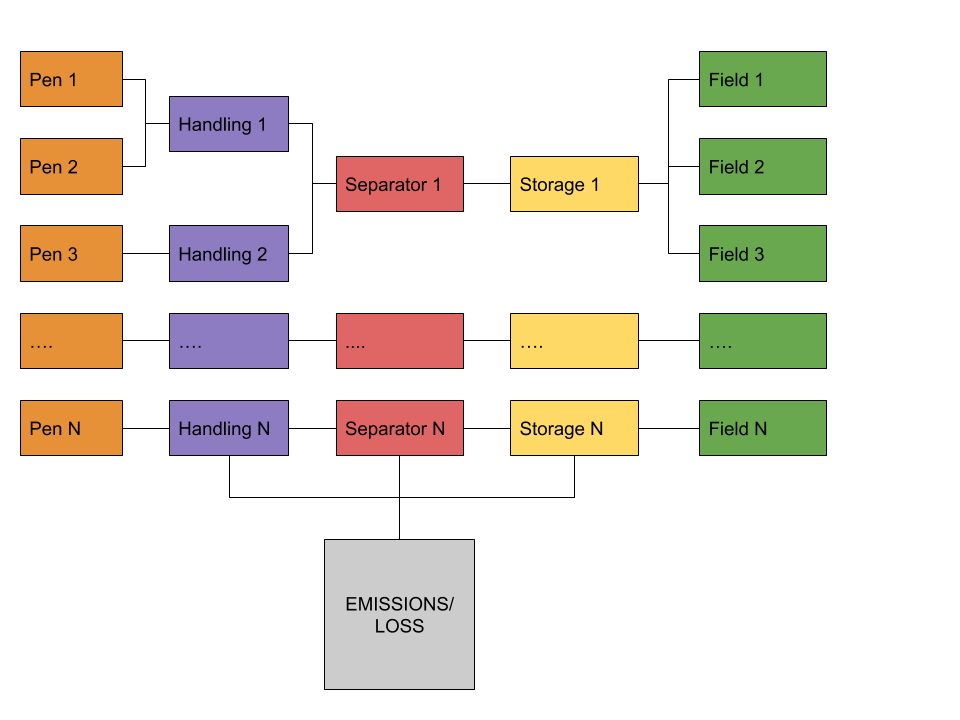
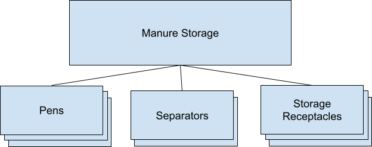
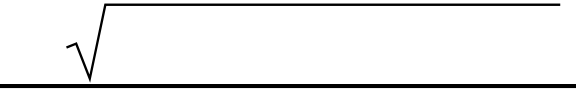

Manure Module Storage 2022 R1
=============================

   | **1. Model Structure**
   | a. Manure collection from pens
   | b. Manure handlers
   | c. Storage/treatment
   | d. Output

   | **2. Calibration**
   | TBC

   | **3. Manure Generation and Handling**
   | Contains equations from:

+-----------------------+-----------------------+-----------------------+
|    | ●                |    | Manure           |                       |
|    | ●                |      collection from  |                       |
|    | ●                |      pens             |                       |
|                       |    | Manure handlers  |                       |
|                       |                       |                       |
|                       |   | Storage/treatment |                       |
+=======================+=======================+=======================+
|                       | ○                     |    Slurry storage -   |
|                       |                       |    Underfloor and     |
|                       |                       |    Outside            |
+-----------------------+-----------------------+-----------------------+
|                       | ○                     |    Anaerobic          |
|                       |                       |    Digestion          |
+-----------------------+-----------------------+-----------------------+
|                       | ○                     |    Lagoon system      |
+-----------------------+-----------------------+-----------------------+

..

   | **A. Pens**
   | 𝑇𝐴 = 𝐴𝑁𝑀𝐴 + 𝐴𝑁𝑀𝐵 + 𝐴𝑁𝑀𝐶 **[MS.3.A.1]**

   | TA = Total Animals
   | ANMi = Animal of type i

𝐶

+-----------------------+-----------------------+-----------------------+
| 𝑅𝑀 =                  |    ∑ 𝐴𝑁𝑀𝑖 \* 𝑀𝑁𝑅𝑖 𝑖=𝐴 | **[MS.3.A.2]**        |
+=======================+=======================+=======================+
+-----------------------+-----------------------+-----------------------+

..

   | RM = Raw Manure
   | MNRi = Manure generated by each animal of type i

𝐶

+-----------------------+-----------------------+-----------------------+
| 𝑇𝑆𝑒𝑥𝑐𝑟𝑒𝑡𝑒𝑑 =          |    ∑ 𝐴𝑁𝑀𝑖 \* 𝑆𝑖 𝑖=𝐴   | **[MS.3.A.3]**        |
+=======================+=======================+=======================+
+-----------------------+-----------------------+-----------------------+

..

   | TSexcreted = Total Solids Excreted
   | Si = Solids excreted by each animal of type i

   1

Manure Module

𝐶

+-----------------------+-----------------------+-----------------------+
| 𝑉𝑆𝑒𝑥𝑐𝑟𝑒𝑡𝑒𝑑 =          |    ∑ 𝐴𝑁𝑀𝑖 \* 𝑉𝑆𝑖 𝑖=𝐴  | **[MS.3.A.4]**        |
+=======================+=======================+=======================+
+-----------------------+-----------------------+-----------------------+

..

   | VSexcreted = Volatile Solids Excreted
   | VSi = Volatile Solids excreted by each animal of type i

   | Nutrients : Nutrient = [N, TAN, P2O5, K2O]
   | 𝐶

+-----------------------------------+-----------------------------------+
| 𝑁𝑢𝑡𝑟𝑖𝑒𝑛𝑡𝑒𝑥𝑐𝑟𝑒𝑡𝑒𝑑 =                |    ∑ 𝐴𝑁𝑀𝑖 \* 𝑁𝑢𝑡𝑟𝑖𝑒𝑛𝑡𝑖 𝑖=𝐴        |
+===================================+===================================+
+-----------------------------------+-----------------------------------+

**[MS.3.A.5]**

   | Nutrientexcreted = Nutrient Excreted
   | Nutrienti = Nutrient excreted by each animal of type i

𝐶

+-------------+-------------+-------------+-------------+-------------+
| 𝑇𝐴𝑁         | 𝑒𝑥𝑐𝑟𝑒𝑡𝑒𝑑 =  |    ∑ 𝐴𝑁𝑀𝑖   |    𝑖        |    **[      |
|             |             |    \* 𝑇𝐴𝑁   |             | MS.3.A.6]** |
|             |             |    𝑖=𝐴      |             |             |
+=============+=============+=============+=============+=============+
+-------------+-------------+-------------+-------------+-------------+

..

   | TANexcreted = TAN Excreted
   | TANi = TAN excreted by each animal of type i

𝐶

+-------------+-------------+-------------+-------------+-------------+
| 𝑃2𝑂5        | 𝑒𝑥𝑐𝑟𝑒𝑡𝑒𝑑 =  |    ∑ 𝐴𝑁𝑀𝑖   |    𝑖        |    **[      |
|             |             |    \* 𝑃2𝑂5  |             | MS.3.A.7]** |
|             |             |    𝑖=𝐴      |             |             |
+=============+=============+=============+=============+=============+
+-------------+-------------+-------------+-------------+-------------+

..

   | P2O5 excreted = P2O5 Excreted
   | P2O5 i = P2O5 excreted by each animal of type i

𝐶

+-------------+-------------+-------------+-------------+-------------+
| 𝐾2𝑂         | 𝑒𝑥𝑐𝑟𝑒𝑡𝑒𝑑 =  |    ∑ 𝐴𝑁𝑀𝑖   |    𝑖        |    **[      |
|             |             |    \* 𝐾2𝑂   |             | MS.3.A.8]** |
|             |             |    𝑖=𝐴      |             |             |
+=============+=============+=============+=============+=============+
+-------------+-------------+-------------+-------------+-------------+

..

   | K2O excreted = K2O Excreted
   | VSi = Volatile Solids excreted by each animal of type i

   **I.** **Milking Center & Holding Pen**

Cleaning Method is always flushing

   𝐹𝑊 = 𝑊𝑉𝑓𝑙𝑢𝑠ℎ𝑖𝑛𝑔 \* 𝑇𝐴 **[MS.3.A.I.1]**

FW = Fresh water volume

WVflushing = Volume of water used in flushing per animal

*Manure Generated*

   2

Manure Module

+-----------------------+-----------------------+-----------------------+
| 𝑇𝑊𝑉𝑚𝑙𝑘 =              |    | 𝑅𝑀               | **[MS.3.A.I.2]**      |
|                       |    | ρ𝑚𝑎𝑢𝑟𝑒\* τ𝑚𝑙𝑘\*  |                       |
|                       |      𝐹𝑊               |                       |
+=======================+=======================+=======================+
+-----------------------+-----------------------+-----------------------+

..

   | TWVmlk = Total waste volume received in milking & holding center
     ϱ𝑚𝑎𝑛𝑢𝑟𝑒 = Density of manure
   | τ𝑚𝑙𝑘 = Percentage daily time spent and milking & holding center FW
     is in m3

   𝑇𝑆𝑚𝑙𝑘 = 𝑇𝑆𝑒𝑥𝑐𝑟𝑒𝑡𝑒𝑑 \* τ𝑚𝑙𝑘 **[MS.3.A.I.3]** TSmlk = Total solids from
   milking and holding center

   𝑉𝑆𝑚𝑙𝑘 = 𝑉𝑆𝑒𝑥𝑐𝑟𝑒𝑡𝑒𝑑 \* τ𝑚𝑙𝑘 **[MS.3.A.I.4]** VSmlk = Volatile solids
   from milking and holding center

+-----------------+-----------------+-----------------+-----------------+
| 𝑁𝑢𝑡𝑟𝑖𝑒𝑛𝑡        | 𝑚𝑙𝑘 = 𝑁𝑢𝑡𝑟𝑖𝑒𝑛𝑡  | 𝑒𝑥𝑐𝑟𝑒𝑡𝑒𝑑\* τ𝑚𝑙𝑘 |    *            |
|                 |                 |                 | *[MS.3.A.I.5]** |
+=================+=================+=================+=================+
+-----------------+-----------------+-----------------+-----------------+

Nutrientmlk = Nutrient from milking and holding center

+-----------------------------------+-----------------------------------+
| **II.**                           |    **Cleaning = Flushing Scrape - |
|                                   |    FreeStall/TieStall**           |
+===================================+===================================+
+-----------------------------------+-----------------------------------+

**Flushing system**

   | 𝐹𝑊𝑉 = 𝑊𝑉𝑓𝑙𝑢𝑠ℎ𝑖𝑛𝑔 \* 𝑇𝐴 **[MS.3.A.II.1]** FWV = Flush water volume
   | WVflushing = Volume of water used in flushing per animal

**Scrape system**

   | 𝑆𝑊𝑉 = 𝑊𝑉𝑆𝑐𝑟𝑎𝑝𝑒 \* 𝑇𝐴 **[MS.3.A.II.2]** SWV = Scrape water volume
   | WVflushing = Volume of water used in scraping per animal

   3

Manure Module

+-----------------------+-----------------------+-----------------------+
| **III.**              |    𝐵𝑒𝑑𝑑𝑖𝑛𝑔 = 𝑆𝐵 \| 𝑂𝐵 |    **-                |
|                       |                       |                       |
|                       |                       |  FreeStall/TieStall** |
+=======================+=======================+=======================+
+-----------------------+-----------------------+-----------------------+

..

   | SB = Sand Bedding
   | SD = Sawdust
   | MS = Manure solids
   | Bedding can be any of the above, not combinations in
   | any of the given pens.

   bedding_mass_per_day: Amount of bedding needed for each animal per
   day, kg/animal/day.

bedding_density: Density of the bedding, kg/m^3.

   bedding_dry_matter_content: Dry matter content of the bedding, [0.7 -
   1.0].

   bedding_cleaned_fraction: Fraction of bedding removed from the barn
   [0.7 - 1.0].

bedding_type: Type of bedding.

   𝐵𝐷𝑀𝑃𝐷 = 𝐵𝐷𝑀𝑃𝐷𝐴 \* 𝑇𝐴 **[MS.3.A.III.1]**

   | BDMPD = Bedding mass per day (depends on selected bedding), Kg
   | BDMPDA = Bedding mass per day per animal, kg

+-----------------------+-----------------------+-----------------------+
|                       | 𝐵𝐷𝑀𝑃𝐷                 |                       |
+=======================+=======================+=======================+
| 𝐵𝐷𝑉𝑃𝐷 =               | ρ𝑏𝑒𝑑𝑑𝑖𝑛𝑔              | **[MS.3.A.III.2]**    |
+-----------------------+-----------------------+-----------------------+

..

   | BDVPD = Bedding Volume per day, m^3
   | ϱ𝑏𝑒𝑑𝑑𝑖𝑛𝑔 = Density of selected bedding

𝐶𝐿𝑀 = 𝐹𝐿𝑆𝐻 \| 𝑆𝐶𝑅𝑃

   | CLM = Cleaning method
   | FLSH = Flushing

   4

Manure Module

   | SCRP = Scraping
   | Cleaning method can either be flushing or scraping

   𝑅𝐹𝑊 = 𝐶𝐿𝑀𝑣𝑜𝑙𝑢𝑚𝑒 \* 𝑇𝐴 **[MS.3.A.III.3]**

   | RFW = Total Volume of water from cleaning
   | CLMvolume = Volume of water per animal used for selected cleaning
     method

   | **IV.** **Sand Separation**
   | **Sand lane** \| **Mechanical Separators (**\ Used if and only if
     the bedding used is SB)
   | **Sand lane**
   | 𝑆𝐷𝑀𝑠𝑒𝑝 = 𝐵𝐷𝑀𝑃𝐷 \* ϵ𝑠𝑎𝑛𝑑−𝑠𝑒𝑝 **[MS.3.A.IV.1]**

   | SDMsep = Mass of sand separated (per day)
   | ϵ𝑠𝑎𝑛𝑑−𝑠𝑒𝑝 = Sand separation efficiency

+-----------------+-----------------+-----------------+-----------------+
|                 |                 | 𝐵𝐷𝑀𝑃𝐷 − 𝑆𝐷𝑀𝑠𝑒𝑝  |                 |
+=================+=================+=================+=================+
| 𝑆𝐷𝑉             | 𝑟𝑒𝑚 =           | ρ𝑏𝑒𝑑𝑑𝑖𝑛𝑔        | **              |
|                 |                 |                 | [MS.3.A.IV.2]** |
+-----------------+-----------------+-----------------+-----------------+

SDVrem = Volume of sand remaining after separation (per day)

+-----------------+-----------------+-----------------+-----------------+
| **V.**          |                 |                 |                 |
|                 | **CONTRIBUTIONS |                 |                 |
|                 |    FROM         |                 |                 |
|                 |    CLEANING     |                 |                 |
|                 |    (RFW)**      |                 |                 |
+=================+=================+=================+=================+
|                 |    𝑇𝑆𝑟𝑓𝑤 =      | 𝑅𝐹𝑊*ε𝑇𝑆−𝑟𝑓𝑤     | *               |
|                 |                 |                 | *[MS.3.A.V.1]** |
+-----------------+-----------------+-----------------+-----------------+
|                 |                 | 1000            |                 |
+-----------------+-----------------+-----------------+-----------------+
|                 |    𝑇𝑆𝑟𝑓𝑤 =      |                 |                 |
|                 |    Total Solids |                 |                 |
|                 |    contribution |                 |                 |
|                 |    from         |                 |                 |
|                 |    cleaning     |                 |                 |
+-----------------+-----------------+-----------------+-----------------+

ε𝑇𝑆−𝑟𝑓𝑤 = Proportion of RFW corresponding to Total solids

+-----------------------+-----------------------+-----------------------+
|                       | 𝑅𝐹𝑊*ε𝑉𝑆−𝑟𝑓𝑤           |                       |
+=======================+=======================+=======================+
| 𝑉𝑆 =                  | 1000                  | **[MS.3.A.V.2]**      |
+-----------------------+-----------------------+-----------------------+
|    𝑉𝑆 = Volatile      |                       |                       |
|    Solids             |                       |                       |
|    contribution from  |                       |                       |
|    cleaning           |                       |                       |
+-----------------------+-----------------------+-----------------------+

ε𝑉𝑆−𝑟𝑓𝑤 = Proportion of RFW corresponding to Volatile solids

   5

Manure Module

+-----------------------+-----------------------+-----------------------+
|                       |                       | 𝑅𝐹𝑊*ε𝑁𝑢𝑡𝑟𝑖𝑒𝑛𝑡−𝑟𝑓𝑤     |
+=======================+=======================+=======================+
| 𝑁𝑢𝑡𝑟𝑖𝑒𝑛𝑡              | 𝑟𝑓𝑤=                  | 1000                  |
+-----------------------+-----------------------+-----------------------+

**[MS.3.A.V.3]**

+-----------------+-----------------+-----------------+-----------------+
| 𝑁𝑢𝑡𝑟𝑖𝑒𝑛𝑡        |    𝑟𝑓𝑤=𝑁𝑢𝑡𝑟𝑖𝑒𝑛𝑡 |    contribution |                 |
|                 |                 |    from         |                 |
|                 |                 |    cleaning     |                 |
+=================+=================+=================+=================+
| ε𝑁𝑢𝑡𝑟𝑖𝑒𝑛𝑡−𝑟𝑓𝑤 = |                 |                 |    𝑁𝑢𝑡𝑟𝑖𝑒𝑛𝑡     |
| Proportion of   |                 |                 |                 |
| RFW             |                 |                 |                 |
| corresponding   |                 |                 |                 |
| to              |                 |                 |                 |
+-----------------+-----------------+-----------------+-----------------+

..

   **TOTAL MANURE GENERATED (FROM PENS)**

+-----------------------------------+-----------------------------------+
| 𝑇𝑊𝑉ℎ𝑠𝑒 = (                        |    | 𝑅𝑀                           |
|                                   |    | ρ𝑚𝑎𝑛𝑢𝑟𝑒\* τ𝑓𝑟𝑠𝑡𝑎𝑙𝑙) + 𝑅𝐹𝑊 +  |
|                                   |      𝑇𝑊𝑉𝑚𝑙𝑘+ 𝑆𝐷𝑉𝑟𝑒𝑚               |
+===================================+===================================+
+-----------------------------------+-----------------------------------+

**[MS.3.A.9]**

TWVhse = Total waste volume generated from housing (both

freestall and milking/holding centres)

τ𝑓𝑟𝑠𝑡𝑎𝑙𝑙 = Percent daily time spent in freestall/tiestall

All volumes in m3.

   𝑇𝑆𝑔𝑒𝑛 = 𝑇𝑆𝑒𝑥𝑐𝑟𝑒𝑡𝑒𝑑 \* τ𝑓𝑟𝑠𝑡𝑎𝑙𝑙 + 𝑇𝑆𝑚𝑙𝑘 + 𝑇𝑆𝑟𝑓𝑤 **[MS.3.A.10]**

TSgen = Total solids generated

   𝑉𝑆𝑔𝑒𝑛 = 𝑉𝑆𝑒𝑥𝑐𝑟𝑒𝑡𝑒𝑑 \* τ𝑓𝑟𝑠𝑡𝑎𝑙𝑙 + 𝑇𝑉 + 𝑉𝑆𝑟𝑓𝑤 **[MS.3.A.11]**

𝑉𝑆𝑔𝑒𝑛 = Total Volatile Solids generated

𝑁𝑢𝑡𝑟𝑖𝑒𝑛𝑡𝑔𝑒𝑛 = 𝑁𝑢𝑡𝑟𝑖𝑒𝑛𝑡𝑒𝑥𝑐𝑟𝑒𝑡𝑒𝑑 \* τ𝑓𝑟𝑠𝑡𝑎𝑙𝑙 + 𝑁𝑢𝑡𝑟𝑖𝑒𝑛𝑡𝑚𝑙𝑘 + 𝑁𝑢𝑡𝑟𝑖𝑒𝑛𝑡𝑟𝑓

**[MS.3.A.12]**

𝑁𝑢𝑡𝑟𝑖𝑒𝑛𝑡𝑔𝑒𝑛 = Total Nutrients generated

   **4. Storage**

**B. Slurry Storage (SS)**

   6

Manure Module

**SS - Underfloor**

   𝑊𝑉𝑠𝑙𝑢𝑟𝑟𝑦 = 𝑊𝑊𝑉𝑠𝑙𝑢𝑟𝑟𝑦 − 𝐹𝑅𝑠𝑡𝑟𝑔 **[MS.4.B.1]**

𝑊𝑉𝑠𝑙𝑢𝑟𝑟𝑦 𝑠𝑡𝑟𝑔 = Waste Volume of Slurry storage (includes manure

and bedding)

𝑊𝑊𝑉𝑠𝑙𝑢𝑟𝑟𝑦 𝑠𝑡𝑟𝑔 = Waste Water Volume loaded into Slurry storage

used for cleaning

𝐹𝑅𝑠𝑙𝑢𝑟𝑟𝑦 𝑠𝑡𝑟𝑔 = Flushing Volume Recycled to Slurry storage

   𝑇𝑉𝑠𝑡𝑟𝑔 = 𝑊𝑊𝑉𝑠𝑡𝑟𝑔 + 𝑊𝑉𝑠𝑡𝑟𝑔 \* ℎ𝑟𝑡𝑠𝑡𝑟𝑔 **[MS.4.B.2]**

𝑇𝑉𝑠𝑡𝑟𝑔 = Total Volume of Slurry storage

ℎ𝑟𝑡𝑠𝑡𝑟𝑔 = Hydraulic Retention Time of Slurry storage, days

**SS - Outdoor**

   𝑊𝑉𝑠𝑙𝑢𝑟𝑟𝑦 = 𝑊𝑊𝑉𝑠𝑙𝑢𝑟𝑟𝑦 − 𝐹𝑅𝑠𝑡𝑟𝑔 **[MS.4.B.3]**

𝑊𝑉𝑠𝑙𝑢𝑟𝑟𝑦 𝑠𝑡𝑟𝑔 = Waste Volume of Slurry storage (includes manure

and bedding)

𝑊𝑊𝑉𝑠𝑙𝑢𝑟𝑟𝑦 𝑠𝑡𝑟𝑔 = Waste Water Volume loaded into Slurry storage

used for cleaning

+-----------------------+-----------------------+-----------------------+
| 𝐹𝑅𝑠𝑙𝑢𝑟𝑟𝑦 𝑠𝑡𝑟𝑔 =       |    Flushing Volume    |                       |
|                       |    Recycled to Slurry |                       |
|                       |    storage            |                       |
+=======================+=======================+=======================+
|    𝑇𝑉𝑠𝑡𝑟𝑔 = 𝑊𝑊𝑉𝑠𝑡𝑟𝑔 + |                       |    **[MS.4.B.4]**     |
|    𝑊𝑉𝑠𝑡𝑟𝑔 \* ℎ𝑟𝑡𝑠𝑡𝑟𝑔  |                       |                       |
|    + 𝑅𝐹 + 𝐹𝐵          |                       |                       |
+-----------------------+-----------------------+-----------------------+
|    𝑇𝑉𝑠𝑡𝑟𝑔 = Total     |                       |                       |
|    Volume of Slurry   |                       |                       |
|    storage            |                       |                       |
+-----------------------+-----------------------+-----------------------+

ℎ𝑟𝑡𝑠𝑡𝑟𝑔 = Hydraulic Retention Time of Slurry storage, days

+-----------------------------------+-----------------------------------+
|    | 𝑅𝐹 =                         |    Total Rainfall Volume added,   |
|    | 𝐹𝐵 =                         |    m^3 Free Board volume, m^3     |
+===================================+===================================+
+-----------------------------------+-----------------------------------+

..

   7

Manure Module

**C. Anaerobic Digestion**

+-----------------+-----------------+-----------------+-----------------+
|                 | 𝑉𝑆𝑎𝑛𝑑𝑖𝑔−𝑙𝑑      |                 |                 |
+=================+=================+=================+=================+
| 𝑆𝐴𝑉𝑎𝑛𝑑𝑖𝑔 =      | ρ𝑤𝑎𝑡𝑒𝑟          |    \* δ𝑠𝑙𝑑 \*   |                 |
|                 |                 |    τ𝑠𝑙𝑑 \* 𝐷𝑦𝑟  |  **[MS.4.C.1]** |
+-----------------+-----------------+-----------------+-----------------+
|    𝑆𝐴𝑉𝑎𝑛𝑑𝑖𝑔 =   |                 |                 |                 |
|    Sludge       |                 |                 |                 |
|    accumulation |                 |                 |                 |
|    volume of    |                 |                 |                 |
|    anaerobic    |                 |                 |                 |
|    digester     |                 |                 |                 |
+-----------------+-----------------+-----------------+-----------------+

𝑉𝑆𝑎𝑛𝑑𝑖𝑔−𝑙𝑑 = Volatile solids loaded (into Anaerobic Digester)

δ𝑠𝑙𝑑 = Sludge accumulation rate (in anaerobic digester)

τ𝑠𝑙𝑑 = Sludge accumulation period ( in anaerobic digester)

+-----------------------+-----------------------+-----------------------+
| ρ𝑤𝑎𝑡𝑒𝑟 = Density of   |                       | **[MS.4.C.2]**        |
| water (in kg/m3)      |                       |                       |
+=======================+=======================+=======================+
| 𝐷𝑦𝑟 = Days in a year  |    ≈ 365              |                       |
+-----------------------+-----------------------+-----------------------+
| 𝑀𝑉𝑇𝑎𝑛𝑑𝑖𝑔 = 𝑊𝑊𝑉𝑎𝑛𝑑𝑖𝑔   |                       |                       |
| \* ℎ𝑟𝑡𝑎𝑛𝑑𝑖𝑔           |                       |                       |
+-----------------------+-----------------------+-----------------------+

𝑀𝑉𝑇𝑎𝑛𝑑𝑖𝑔 = Minimum Volume Treatment (in anaerobic digester)

𝑊𝑊𝑉𝑎𝑛𝑑𝑖𝑔 = Waste water volume loaded into anaerobic digester

ℎ𝑟𝑡𝑎𝑛𝑑𝑖𝑔 = Hydraulic Retention Time anaerobic digester

   𝑇𝐶𝑉𝑎𝑛𝑑𝑖𝑔 = ε𝑇𝐶𝑉 \* 𝑀𝑉𝑇𝑎𝑛𝑑𝑖𝑔 **[MS.4.C.3]**

𝑇𝐶𝑉𝑎𝑛𝑑𝑖𝑔 = Top cover volume

ε𝑇𝐶𝑉 = Percentage of MVT corresponding to TCV

   𝑉𝑎𝑛𝑑𝑖𝑔 = 𝑀𝑉𝑇𝑎𝑛𝑑𝑖𝑔 + 𝑇𝐶𝑉𝑎𝑛𝑑𝑖𝑔 + 𝑆𝐴𝑉𝑎𝑛𝑑𝑖𝑔 **[MS.4.C.4]**

𝑉𝑎𝑛𝑑𝑖𝑔 = Digester Volume of anaerobic lagoon

+-----------------------------------+-----------------------------------+
|                                   | 𝑉𝑆𝑎𝑛𝑑𝑖𝑔−𝑙𝑑                        |
+===================================+===================================+
| δ𝑣𝑠𝑙−𝑎𝑛𝑑𝑖𝑔 =                      | 𝑉𝑎𝑛𝑑𝑖𝑔                            |
+-----------------------------------+-----------------------------------+

..

   **[MS.3.C.5]**

δ𝑣𝑠𝑙−𝑎𝑛𝑑𝑖𝑔 = VS loading rate for andig

   8

Manure Module

+-----------------------+-----------------------+-----------------------+
| 𝐵𝐺𝑔𝑒𝑛 = ε 𝑏𝑔𝑔𝑒𝑛       |    \* 𝑉𝑆𝑎𝑛𝑑𝑖𝑔−𝑙𝑑      | **[MS.4.C.6]**        |
+=======================+=======================+=======================+
+-----------------------+-----------------------+-----------------------+

𝐵𝐺𝑔𝑒𝑛 = Biogas generated in anaerobic lagoon

ε𝑏𝑔𝑔𝑒𝑛 = Biogas generation rate (percentage)

𝐶𝐻4𝑔𝑒𝑛 = ϵ𝐶𝐻4𝑔𝑒𝑛 \* 𝐵𝐺𝑔𝑒𝑛

   **[MS.4.C.7]**

𝐶𝐻4𝑔𝑒𝑛 = Methane generated in anaerobic digester

ε𝐶𝐻4𝑔𝑒𝑛 = Methane generation rate (percentage)

**EFFLUENT FROM ANAEROBIC DIGESTER**

   𝑊𝑊𝑉𝑒𝑓𝑓−𝑎𝑛𝑑𝑖𝑔 = 𝑊𝑊𝑉𝑎𝑛𝑑𝑖𝑔 **[MS.4.C.8]**

𝑊𝑊𝑉𝑒𝑓𝑓−𝑎𝑛𝑑𝑖𝑔 = Effluent Waste Volume

𝑇𝑆𝑒𝑓𝑓−𝑎𝑛𝑑𝑖𝑔 = 𝑇𝑆𝑎𝑛𝑑𝑖𝑔 \* (1 − ε𝑇𝑆𝑙𝑜𝑠𝑠−𝑎𝑛𝑑𝑖𝑔)

   𝑇𝑆𝑒𝑓𝑓−𝑎𝑛𝑑𝑖𝑔 = Effluent Total Solid **[MS.4.C.9]**

𝑇𝑆𝑎𝑛𝑑𝑖𝑔 = Total solids loaded into Anaerobic Digester

ε𝑇𝑆𝑙𝑜𝑠𝑠−𝑎𝑛𝑑𝑖𝑔 = Percentage of loaded TS lost

+-----------------+-----------------+-----------------+-----------------+
| 𝑉𝑆              | 𝑒𝑓𝑓−𝑎𝑛𝑑𝑖𝑔= 𝑉𝑆   |    𝑎𝑛𝑑𝑖𝑔\* (1 − |                 |
|                 |                 |                 | **[MS.4.C.10]** |
|                 |                 |  ε𝑉𝑆𝑙𝑜𝑠𝑠−𝑎𝑛𝑑𝑖𝑔) |                 |
+=================+=================+=================+=================+
+-----------------+-----------------+-----------------+-----------------+

𝑉𝑆𝑒𝑓𝑓−𝑎𝑛𝑑𝑖𝑔 = Effluent Volatile Solid

𝑉𝑆𝑎𝑛𝑑𝑖𝑔 = Total volatile solids loaded into Anaerobic Digester

ε𝑉𝑆𝑙𝑜𝑠𝑠−𝑎𝑛𝑑𝑖𝑔 = Percentage of loaded VS lost

+-----------------------+-----------------------+-----------------------+
| 𝑁𝑢𝑡𝑟𝑖𝑒𝑛𝑡              | 𝑒𝑓𝑓−𝑎𝑛𝑑𝑖𝑔= 𝑁𝑢𝑡𝑟𝑖𝑒𝑛𝑡   |    𝑎𝑛𝑑𝑖𝑔\* (1 −       |
|                       |                       |    ε𝑇𝑆𝑙𝑜𝑠𝑠−𝑎𝑛𝑑𝑖𝑔)     |
+=======================+=======================+=======================+
+-----------------------+-----------------------+-----------------------+

**[MS.4.C.11]**

+---------+---------+---------+---------+---------+---------+---------+
| 𝑁       | 𝑒𝑓𝑓     |         |    𝑁    |         |         |         |
| 𝑢𝑡𝑟𝑖𝑒𝑛𝑡 | −𝑎𝑛𝑑𝑖𝑔= |         | 𝑢𝑡𝑟𝑖𝑒𝑛𝑡 |         |         |         |
|         | E       |         |         |         |         |         |
|         | ffluent |         |         |         |         |         |
+=========+=========+=========+=========+=========+=========+=========+
| 𝑁       | 𝑎𝑛𝑑𝑖𝑔=  | 𝑁       |         |         |         |         |
| 𝑢𝑡𝑟𝑖𝑒𝑛𝑡 | Total   | 𝑢𝑡𝑟𝑖𝑒𝑛𝑡 |         |  loaded |         |         |
|         |         |         |         |    into |         |         |
|         |         |         |         |    An   |         |         |
|         |         |         |         | aerobic |         |         |
|         |         |         |         |    D    |         |         |
|         |         |         |         | igester |         |         |
+---------+---------+---------+---------+---------+---------+---------+
| ε𝑁𝑢𝑡𝑟   |         |         |         |         | 𝑁       |    lost |
| 𝑖𝑒𝑛𝑡𝑙𝑜𝑠 |         |         |         |         | 𝑢𝑡𝑟𝑖𝑒𝑛𝑡 |         |
| 𝑠−𝑎𝑛𝑑𝑖𝑔 |         |         |         |         |         |         |
| =       |         |         |         |         |         |         |
| Per     |         |         |         |         |         |         |
| centage |         |         |         |         |         |         |
| of      |         |         |         |         |         |         |
| loaded  |         |         |         |         |         |         |
+---------+---------+---------+---------+---------+---------+---------+

..

   9

Manure Module

   Contains equations from:

   **D. Anaerobic Lagoon**

   𝑅𝑉𝑙𝑎𝑔 = 𝑊𝑊𝑉𝑙𝑎𝑔 − 𝐹𝑅𝑙𝑎𝑔 **[MS.4.D.1]**

𝑅𝑉𝑙𝑎𝑔 = Reduced Volume of Anaerobic Lagoon

+-----------------------+-----------------------+-----------------------+
|    𝑊𝑊𝑉𝑙𝑎𝑔 = Waste     |                       |                       |
|    Water Volume       |                       |                       |
|    loaded into        |                       |                       |
|    Anaerobic Lagoon   |                       |                       |
+=======================+=======================+=======================+
| 𝐹𝑅𝑙𝑎𝑔 =               |    Flushing Volume    |                       |
|                       |    Recycled to        |                       |
|                       |    Anaerobic Lagoon   |                       |
+-----------------------+-----------------------+-----------------------+
| 𝑉𝐿𝑅 =                 | 𝑉𝑆𝑙𝑜𝑎𝑑𝑖𝑛𝑔−𝑙𝑎𝑔         | **[MS.4.D.2]**        |
+-----------------------+-----------------------+-----------------------+
|                       | 𝑊𝑊𝑉𝑙𝑎𝑔\* ℎ𝑟𝑡𝑙𝑎𝑔       |                       |
+-----------------------+-----------------------+-----------------------+
|    𝑉𝐿𝑅 = Volumetric   |                       |                       |
|    Loading Rate of    |                       |                       |
|    Anaerobic Lagoon   |                       |                       |
+-----------------------+-----------------------+-----------------------+

𝑉𝑆𝑙𝑜𝑎𝑑𝑖𝑛𝑔−𝑙𝑎𝑔 = Volume Volatile Solids loaded into Anaerobic Lagoon

ℎ𝑟𝑡𝑙𝑎𝑔 = Hydraulic Retention Time of Anaerobic Lagoon

+-----------------------------------+-----------------------------------+
| 𝑀𝑇𝑉𝑙𝑎𝑔 = 𝑊𝑊𝑉𝑙𝑎𝑔 + (𝑅𝑉𝑙𝑎𝑔 \*       | **[MS.4.D.4]**                    |
| ℎ𝑟𝑡𝑙𝑎𝑔)                           |                                   |
+===================================+===================================+
|    𝑀𝑇𝑉𝑙𝑎𝑔 = Minimum Treatment     |                                   |
|    Volume of Anaerobic Lagoon     |                                   |
+-----------------------------------+-----------------------------------+
| 𝑆𝐴𝑉𝑙𝑎𝑔 = 𝑇𝑆𝑙𝑎𝑔 \* 𝑆𝑙𝑑𝑝𝑇𝑆 \* τ𝑆𝑙𝑑  | **[MS.4.D.5]**                    |
| \* τ𝑦𝑟                            |                                   |
+-----------------------------------+-----------------------------------+

𝑆𝐴𝑉𝑙𝑎𝑔 = Sludge Accumulation Volume of Anaerobic Lagoon

𝑇𝑆𝑙𝑎𝑔 = Total Solids loaded into Anaerobic Lagoon

𝑆𝑙𝑑𝑝𝑇𝑆 = Sludge per Total Solids

τ𝑆𝑙𝑑 = Sludge Accumulation Period in years

τ𝑦𝑟 = Number of days in a year

𝑇𝑉𝑙𝑎𝑔 = 𝑀𝑇𝑉𝑙𝑎𝑔 + 𝑆𝐴𝑉𝑙𝑎𝑔

**[MS.4.D.6]**

𝑇𝑉𝑙𝑎𝑔 = Total Lagoon Volume

**GAS EMISSION**

   10

Manure Module

+-----------------------------------+-----------------------------------+
|                                   | 𝑁𝑖𝑛𝑝−𝑙𝑎𝑔                          |
+===================================+===================================+
| ∆𝑁−𝑒𝑥𝑐𝑟−𝑑𝑎𝑖𝑙𝑦 =                   | 𝑇𝐴                                |
+-----------------------------------+-----------------------------------+

∆𝑁−𝑒𝑥𝑐𝑟−𝑑𝑎𝑖𝑙𝑦 = Daily Nitrogen Excretion Rate

𝑁𝑖𝑛𝑝−𝑙𝑎𝑔 = Total Nitrogen produced

+-----------------------------------+-----------------------------------+
| **I.**                            |    | **DIRECT**                   |
|                                   |    | **INDIRECT**                 |
| **II.**                           |                                   |
+===================================+===================================+
+-----------------------------------+-----------------------------------+

**LAGOON EFFLUENT**

𝑊𝑊𝑉𝑒𝑓𝑓−𝑙𝑎𝑔 = 𝑀𝑉𝑇𝑙𝑎𝑔

+-----------------------------------+-----------------------------------+
| 𝑇𝑆𝑒𝑓𝑓−𝑙𝑎𝑔 =                       |    | 𝑇𝑆𝑙𝑎𝑔                        |
|                                   |    | 𝑊𝑊𝑉(1 − ε𝑇𝑆−𝑒𝑓𝑓−𝑙𝑎𝑔)         |
+===================================+===================================+
+-----------------------------------+-----------------------------------+

𝑇𝑆𝑒𝑓𝑓−𝑙𝑎𝑔 = Total Solid Effluent from Anaerobic Lagoon, in g/L

ε𝑇𝑆−𝑒𝑓𝑓−𝑙𝑎𝑔 = Total Solid effluent rate Anaerobic Lagoon

+-----------------------+-----------------------+-----------------------+
|                       | 𝑉𝑆𝑙𝑜𝑎𝑑𝑖𝑛𝑔−𝑙𝑎𝑔         |                       |
+=======================+=======================+=======================+
| 𝑉𝑆𝑒𝑓𝑓−𝑙𝑎𝑔 =           | 𝑊𝑊𝑉                   |    (1 − ε𝑉𝑆−𝑒𝑓𝑓−𝑙𝑎𝑔)  |
+-----------------------+-----------------------+-----------------------+

𝑉𝑆𝑒𝑓𝑓−𝑙𝑎𝑔 = Total Volatile Solid Effluent from Anaerobic Lagoon, in g/L

ε𝑉𝑆−𝑒𝑓𝑓−𝑙𝑎𝑔 = Volatile Solid effluent rate in Anaerobic Lagoon

+------+------+------+------+------+------+------+------+------+------+
|      | 𝑒𝑓𝑓− |      | 𝑁𝑢𝑡𝑟 |      |      | 𝑙𝑎𝑔  |      |      |      |
|      | 𝑙𝑎𝑔= |      | 𝑖𝑒𝑛𝑡 |      |      |      |   (1 |      |      |
|      |      |      |      |      |      |      |    − |      |      |
|      |      |      |      |      |      |      |      |      |      |
|      |      |      |      |      |      |      |   ε𝑁 |      |      |
|      |      |      |      |      |      |      | 𝑢𝑡𝑟𝑖 |      |      |
|      |      |      |      |      |      |      | 𝑒𝑛𝑡− |      |      |
|      |      |      |      |      |      |      | 𝑒𝑓𝑓− |      |      |
|      |      |      |      |      |      |      | 𝑙𝑎𝑔) |      |      |
+======+======+======+======+======+======+======+======+======+======+
| 𝑁𝑢𝑡𝑟 |      |      | 𝑊𝑊𝑉  |      |      |      |      |      |      |
| 𝑖𝑒𝑛𝑡 |      |      |      |      |      |      |      |      |      |
+------+------+------+------+------+------+------+------+------+------+
| 𝑁𝑢𝑡𝑟 | 𝑒𝑓𝑓− |      |      |      | 𝑁𝑢𝑡𝑟 |      |      |      |      |
| 𝑖𝑒𝑛𝑡 | 𝑙𝑎𝑔= |      |      |      | 𝑖𝑒𝑛𝑡 |      |      |      | from |
|      | T    |      |      |      |      |      |      |      |    A |
|      | otal |      |      |      |      |      |      |      | naer |
|      |      |      |      |      |      |      |      |      | obic |
|      |      |      |      |      |      |      |      |      |      |
|      |      |      |      |      |      |      |      |      |  Lag |
|      |      |      |      |      |      |      |      |      | oon, |
|      |      |      |      |      |      |      |      |      |      |
|      |      |      |      |      |      |      |      |      |   in |
|      |      |      |      |      |      |      |      |      |      |
|      |      |      |      |      |      |      |      |      |  g/L |
+------+------+------+------+------+------+------+------+------+------+
| ε    |      |      |      | 𝑁𝑢𝑡𝑟 |      |      |      |      |      |
| 𝑁𝑢𝑡𝑟 |      |      |      | 𝑖𝑒𝑛𝑡 |      |      |      | effl |      |
| 𝑖𝑒𝑛𝑡 |      |      |      |      |      |      |      | uent |      |
| −𝑒𝑓𝑓 |      |      |      |      |      |      |      |      |      |
| −𝑙𝑎𝑔 |      |      |      |      |      |      |      | rate |      |
| =    |      |      |      |      |      |      |      |      |      |
| T    |      |      |      |      |      |      |      |      |      |
| otal |      |      |      |      |      |      |      |      |      |
+------+------+------+------+------+------+------+------+------+------+
| 𝑁𝑢𝑡  |      |      |      |      |      |      |      |      |      |
| 𝑟𝑖𝑒𝑛 |      | 𝑁𝑢𝑡𝑟 |      |      |      |      |      |      |      |
| 𝑡𝑙𝑎𝑔 |      | 𝑖𝑒𝑛𝑡 |      |      |      |      |      |      |      |
| =    |      |      |      |      |      |      |      |      |      |
| T    |      |   Lo |      |      |      |      |      |      |      |
| otal |      | aded |      |      |      |      |      |      |      |
|      |      |      |      |      |      |      |      |      |      |
|      |      | into |      |      |      |      |      |      |      |
|      |      |      |      |      |      |      |      |      |      |
|      |      |  the |      |      |      |      |      |      |      |
|      |      |    A |      |      |      |      |      |      |      |
|      |      | naer |      |      |      |      |      |      |      |
|      |      | obic |      |      |      |      |      |      |      |
|      |      |      |      |      |      |      |      |      |      |
|      |      |   La |      |      |      |      |      |      |      |
|      |      | goon |      |      |      |      |      |      |      |
+------+------+------+------+------+------+------+------+------+------+

**LAGOON SLUDGE NUTRIENT VALUE**

𝑇𝑆𝑙𝑎𝑔−𝑣𝑎𝑙 = δ𝑇𝑆−𝑙𝑎𝑔 \* 𝑆𝐴𝑉𝑙𝑎𝑔

𝑇𝑆𝑙𝑎𝑔−𝑣𝑎𝑙 **=** Nutrient Value of Total Solid

δ𝑇𝑆−𝑙𝑎𝑔 = Value of Total Solids in grams, per liter of TS

   11

Manure Module

+-----------+-----------+-----------+-----------+-----------+-----------+
| 𝑁𝑢𝑡𝑟𝑖𝑒𝑛𝑡  |           |           |           |           |           |
|           |   𝑙𝑎𝑔−𝑣𝑎𝑙 |           |           |           |  𝑁𝑢𝑡𝑟𝑖𝑒𝑛𝑡 |
|           |    =      |           |           |           |           |
|           |    δ𝑁𝑢𝑡𝑟𝑖 |           |           |           |           |
|           | 𝑒𝑛𝑡−𝑙𝑎𝑔\* |           |           |           |           |
|           |    𝑆𝐴𝑉𝑙𝑎𝑔 |           |           |           |           |
+===========+===========+===========+===========+===========+===========+
| 𝑁𝑢𝑡𝑟𝑖𝑒𝑛𝑡  |    **=**  |           |           |           |           |
|           |           |           |           |  𝑁𝑢𝑡𝑟𝑖𝑒𝑛𝑡 |           |
|           |  Nutrient |           |           |           |           |
|           |    Value  |           |           |           |           |
|           |    of     |           |           |           |           |
|           |           |           |           |           |           |
|           |   𝑙𝑎𝑔−𝑣𝑎𝑙 |           |           |           |           |
+-----------+-----------+-----------+-----------+-----------+-----------+
| δ𝑁𝑢𝑡      |           | 𝑁𝑢𝑡𝑟𝑖𝑒𝑛𝑡  | in grams, |           |           |
| 𝑟𝑖𝑒𝑛𝑡−𝑙𝑎𝑔 |           |           | per liter |           |           |
| = Value   |           |           | of        |           |           |
| of        |           |           |           |           |           |
+-----------+-----------+-----------+-----------+-----------+-----------+

..

   **5. Separator (MECHANICAL SEPARATOR)**

   Contains equations from Solid Liquid Separation

**A. REMOVAL**

   𝑇𝑆𝑟𝑒𝑚−𝑠𝑙𝑠 = 𝑇𝑆𝑠𝑙𝑠 \* ε𝑇𝑆−𝑠𝑙𝑠 **[MS.5.A.1]**

𝑇𝑆𝑟𝑒𝑚−𝑠𝑙𝑠 = Total Solids removed in Solid Liquid Separator (SLS)

𝑇𝑆𝑠𝑙𝑠 = Total solids put into Solid Liquid Separator

ε𝑇𝑆−𝑠𝑙𝑠 = Total Solids separation efficiency

   𝑉𝑆 𝑟𝑒𝑚−𝑠𝑙𝑠= 𝑉𝑆 𝑠𝑙𝑠\* ε𝑉𝑆−𝑠𝑙𝑠 **[MS.5.A.2]**

   𝑉𝑆 𝑟𝑒𝑚−𝑠𝑙𝑠= Volatile Solids removed in Solid Liquid Separator (SLS)

𝑉𝑆𝑠𝑙𝑠 = Volatile solids put into Solid Liquid Separator

ε𝑉𝑆−𝑠𝑙𝑠 = Volatile Solids separation efficiency

+-----------------------+-----------------------+-----------------------+
| 𝑁𝑢𝑡𝑟𝑖𝑒𝑛𝑡              | 𝑟𝑒𝑚−𝑠𝑙𝑠= 𝑁𝑢𝑡𝑟𝑖𝑒𝑛𝑡     |    𝑠𝑙𝑠\*              |
|                       |                       |    ε𝑁𝑢𝑡𝑟𝑖𝑒𝑛𝑡−𝑠𝑙𝑠      |
+=======================+=======================+=======================+
+-----------------------+-----------------------+-----------------------+

**[MS.5.A.3]**

+-----------------------+-----------------------+-----------------------+
| 𝑁𝑢𝑡𝑟𝑖𝑒𝑛𝑡              | 𝑟𝑒𝑚−𝑠𝑙𝑠=𝑁𝑢𝑡𝑟𝑖𝑒𝑛𝑡      |    removed in Solid   |
|                       |                       |    Liquid Separator   |
+=======================+=======================+=======================+
+-----------------------+-----------------------+-----------------------+

(SLS)

   𝑁𝑢𝑡𝑟𝑖𝑒𝑛𝑡 𝑠𝑙𝑠=𝑁𝑢𝑡𝑟𝑖𝑒𝑛𝑡 put into Solid Liquid Separator

ε𝑁𝑢𝑡𝑟𝑖𝑒𝑛𝑡−𝑠𝑙𝑠 =𝑁𝑢𝑡𝑟𝑖𝑒𝑛𝑡 separation efficiency

**B. EFFLUENT SOLID**

   𝑇𝑆𝑒𝑓𝑓−𝑠−𝑠𝑙𝑠 = 𝑇𝑆𝑟𝑒𝑚−𝑠𝑙𝑠 **[MS.5.B.1]**

𝑇𝑆𝑒𝑓𝑓−𝑠−𝑠𝑙𝑠 = Effluent Dry Total Solid from Solid Liquid Separator

   12

Manure Module

+-----------------------+-----------------------+-----------------------+
| 𝑉𝑆                    |    𝑒𝑓𝑓−𝑠−𝑠𝑙𝑠=         | **[MS.5.B.2]**        |
|                       |    𝑉𝑆𝑟𝑒𝑚−𝑠𝑙𝑠          |                       |
+=======================+=======================+=======================+
+-----------------------+-----------------------+-----------------------+

𝑉𝑆𝑒𝑓𝑓−𝑠−𝑠𝑙𝑠 = Effluent Dry Volatile Solid from Solid Liquid Separator

+-----------------+-----------------+-----------------+-----------------+
| 𝑁𝑢𝑡𝑟𝑖𝑒𝑛𝑡        |    𝑒𝑓𝑓−𝑠−𝑠𝑙𝑠=   |                 | **[MS.5.B.3]**  |
|                 |                 |                 |                 |
|                 | 𝑁𝑢𝑡𝑟𝑖𝑒𝑛𝑡𝑟𝑒𝑚−𝑠𝑙𝑠 |                 |                 |
+=================+=================+=================+=================+
| 𝑁𝑢𝑡𝑟𝑖𝑒𝑛𝑡        | 𝑒𝑓𝑓−𝑠−𝑠𝑙𝑠=      | 𝑁𝑢𝑡𝑟𝑖𝑒𝑛𝑡        |    from Solid   |
|                 | Effluent Dry    |                 |    Liquid       |
+-----------------+-----------------+-----------------+-----------------+

Separator

𝑊𝑊𝑀𝑒𝑓𝑓−𝑠−𝑠𝑙𝑠 = =

**C. EFFLUENT LIQUID**

   𝑉𝑜𝑙𝑒𝑓𝑓 = 𝐹𝑅 − 𝑊𝑊𝑀𝑒𝑓𝑓−𝑠−𝑠𝑙𝑠 **[MS.5.C.1]**

𝑉𝑜𝑙𝑒𝑓𝑓 = Effluent Volume

𝐹𝑅 = Flow rate into SLS which is equal to the total volume fed into

the SLS per day

𝑊𝑊𝑀𝑒𝑓𝑓−𝑠−𝑠𝑙𝑠 : 1kg is equivalent to 1 liter

𝑇𝑆𝑒𝑓𝑓−𝑙−𝑠𝑙𝑠 = 𝑇𝑆𝑠𝑙𝑠 − 𝑇𝑆𝑒𝑓𝑓−𝑠−𝑠𝑙𝑠

**[MS.5.C.2]**

𝑇𝑆𝑒𝑓𝑓−𝑙−𝑠𝑙𝑠 = Effluent Wet Total Solid from Solid Liquid Separator

𝑉𝑆𝑒𝑓𝑓−𝑙−𝑠𝑙𝑠 = 𝑉𝑆𝑠𝑙𝑠 − 𝑉𝑆𝑒𝑓𝑓−𝑠−𝑠𝑙𝑠

**[MS.5.C.3]**

𝑉𝑆𝑒𝑓𝑓−𝑙−𝑠𝑙𝑠 = Effluent Wet Volatile Solid from Solid Liquid Separator

+-----------------+-----------------+-----------------+-----------------+
| 𝑁𝑢𝑡𝑟𝑖𝑒𝑛𝑡        | 𝑒𝑓𝑓−𝑙−𝑠𝑙𝑠 =     | 𝑠𝑙𝑠− 𝑁𝑢𝑡𝑟𝑖𝑒𝑛𝑡   |    𝑒𝑓𝑓−𝑠−𝑠𝑙𝑠    |
|                 | 𝑁𝑢𝑡𝑟𝑖𝑒𝑛𝑡        |                 |                 |
+=================+=================+=================+=================+
+-----------------+-----------------+-----------------+-----------------+

**[MS.5.C.4]**

+-----------------+-----------------+-----------------+-----------------+
| 𝑁𝑢𝑡𝑟𝑖𝑒𝑛𝑡        | 𝑒𝑓𝑓−𝑙−𝑠𝑙𝑠=      | 𝑁𝑢𝑡𝑟𝑖𝑒𝑛𝑡        |    from Solid   |
|                 | Effluent Wet    |                 |    Liquid       |
+=================+=================+=================+=================+
+-----------------+-----------------+-----------------+-----------------+

Separator

   13

Manure Module

**GAS EMISSIONS**

+-----------------+-----------------+-----------------+-----------------+
| **I.**          | **METHANE**     | 𝑉𝑆𝑠𝑡𝑟𝑔          |                 |
+=================+=================+=================+=================+
|                 |                 |                 |                 |
+-----------------+-----------------+-----------------+-----------------+
|                 |    𝑉𝑆𝑠𝑡𝑟𝑔−𝑝𝑎 =  | 𝑇𝐴              | *               |
|                 |                 |                 | *[MS.5.B.I.1]** |
+-----------------+-----------------+-----------------+-----------------+

𝑉𝑆𝑠𝑡𝑟𝑔−𝑝𝑎 = Volatile Solids per Animal

𝑉𝑆𝑠𝑡𝑟𝑔 = Total Volatile Solids loaded into Storage Pond

𝐶𝐻4𝑠𝑡𝑟𝑔−𝑑𝑎𝑖𝑙𝑦 = 𝑉𝑆𝑠𝑡𝑟𝑔−𝑝𝑎 \* 𝐵0 \* 𝑀𝐶𝐹 \* 𝑀𝑆 \* 𝐶𝐻4𝑚3/𝑘𝑔

**[MS.5.B.I.2]**

𝐶𝐻4𝑠𝑡𝑟𝑔−𝑑𝑎𝑖𝑙𝑦 = Methane Emitted Daily from Storage Pond

𝐵0 = Maximum Methane Producing Capacity

𝑀𝐶𝐹 = Methane Conversion Factor= 0.79 Default

𝑀𝑆 = Percentage manure handled in system=0.9 Default

𝐶𝐻4𝑚3/𝑘𝑔 = kg Methane per m3 of Methane = 0.67 Default

   𝐶𝑂2𝑠𝑡𝑟𝑔−𝐶𝐻4−𝑑𝑎𝑖𝑙𝑦 = 𝐶𝐻4𝑠𝑡𝑟𝑔−𝑑𝑎𝑖𝑙𝑦 \* ε𝐶𝐻4−𝐶𝑂2 **[MS.5.B.I.3]**

𝐶𝑂2𝑠𝑡𝑟𝑔−𝐶𝐻4−𝑑𝑎𝑖𝑙𝑦 = Carbon DiOxide generated in Storage

Pond with Methane

ε𝐶𝐻4−𝐶𝑂2 = Methane to Carbon DiOxide Conversion Factor = 30

Default

+-----------------+-----------------+-----------------+-----------------+
| Obtain Yearly   | 𝐶𝐻4𝑠𝑡𝑟𝑔−𝑑𝑎𝑖𝑙𝑦   | and             |    𝐶𝑂           |
| Values for      |                 |                 | 2𝑠𝑡𝑟𝑔−𝐶𝐻4−𝑑𝑎𝑖𝑙𝑦 |
|                 |                 |                 |    by           |
+=================+=================+=================+=================+
+-----------------+-----------------+-----------------+-----------------+

multiplying each value by 365, the number of days in a year.

+-------------+-------------+-------------+-------------+-------------+
| **II.**     |    *        | 𝑁           | 𝑠𝑡𝑟𝑔        |             |
|             | *NITROGEN** |             |             |             |
+=============+=============+=============+=============+=============+
|             |             |             |             |             |
+-------------+-------------+-------------+-------------+-------------+
|             |    𝑁𝑠𝑡𝑟𝑔−𝑝𝑎 | 𝑇𝐴          |             | **[MS.      |
|             |    =        |             |             | 5.B.II.1]** |
+-------------+-------------+-------------+-------------+-------------+

𝑁𝑠𝑡𝑟𝑔−𝑝𝑎 = Nitrogen Per Animal

𝑁𝑠𝑡𝑟𝑔 = 𝑇𝑜𝑡𝑎𝑙 𝑁𝑖𝑡𝑟𝑜𝑔𝑒𝑛 𝐿𝑜𝑎𝑑𝑒𝑑 𝑖𝑛𝑡𝑜 𝑆𝑡𝑜𝑟𝑎𝑔𝑒 𝑃𝑜𝑛𝑑

**a. Direct Nitrous Oxide**

   14

Manure Module

𝑁2𝑂𝑠𝑡𝑟𝑔−𝑑𝑖𝑟−𝑑𝑎𝑖𝑙𝑦 = 𝑁𝑠𝑡𝑟𝑔−𝑝𝑎 \* ε𝑀𝑀𝑆 \* ϵ𝑁20−𝑑𝑖𝑟 \* σ𝑁−𝑁2𝑂

**[MS.5.B.II.a.1]**

𝑁2𝑂𝑠𝑡𝑟𝑔−𝑑𝑖𝑟−𝑑𝑎𝑖𝑙𝑦 = Direct Nitrous produced Daily in

Storage Pond

ε𝑀𝑀𝑆 = fraction MMS

ϵ𝑁20−𝑑𝑖𝑟 = Direct Nitrous Emission Factor

σ𝑁−𝑁2𝑂 = kg Nitrous Oxide generated per kg Nitrogen

𝐶𝑂2𝑠𝑡𝑟𝑔−𝑑𝑖𝑟𝑁2𝑂−𝑑𝑎𝑖𝑙𝑦 = 𝑁2𝑂𝑠𝑡𝑟𝑔−𝑑𝑖𝑟−𝑑𝑎𝑖𝑙𝑦 \* ε𝑁2𝑂−𝐶𝑂2

**[MS.5.B.II.a.2]**

𝐶𝑂2𝑠𝑡𝑟𝑔−𝑑𝑖𝑟𝑁2𝑂−𝑑𝑎𝑖𝑙𝑦 = Carbon DiOxide generated in

Storage Pond with Direct Nitrous Oxide

ε𝐶𝐻4−𝐶𝑂2 = kg Carbon DiOxide generated per kg Nitrous

Oxide Conversion Factor = 130 (default)

**b. Indirect Nitrous Oxide**

𝑁2𝑂𝑠𝑡𝑟𝑔−𝑖𝑛𝑑𝑖𝑟−𝑑𝑎𝑖𝑙𝑦 = 𝑁𝑠𝑡𝑟𝑔−𝑝𝑎 \* ε𝑁−𝑁𝐻3/𝑁𝑂𝑥 \* ϵ𝑁20−𝑖𝑛𝑑𝑖𝑟 \* σ𝑁−𝑁2𝑂

**[MS.5.B.II.b.1]**

𝑁2𝑂𝑠𝑡𝑟𝑔−𝑖𝑛𝑑𝑖𝑟−𝑑𝑎𝑖𝑙𝑦 = Indirect Nitrous produced Daily

in Storage Pond

ε𝑁−𝑁𝐻3/𝑁𝑂𝑥 = Fraction of Nitrogen that Volatizes to

NH3 or NOx

ϵ𝑁20−𝑖𝑛𝑑𝑖𝑟 = Indirect Nitrous Emission Factor

𝐶𝑂2𝑠𝑡𝑟𝑔−𝑖𝑛𝑑𝑁2𝑂−𝑑𝑎𝑖𝑙𝑦 = 𝑁2𝑂𝑠𝑡𝑟𝑔−𝑖𝑛𝑑𝑖𝑟−𝑑𝑎𝑖𝑙𝑦 \* ε𝑁2𝑂−𝐶𝑂2

**[MS.5.B.II.b.2]**

𝐶𝑂2𝑠𝑡𝑟𝑔−𝑖𝑛𝑑𝑁2𝑂−𝑑𝑎𝑖𝑙𝑦 = Carbon DiOxide generated in

Storage Pond with Indirect Nitrous Oxide

NB: Yearly values of all daily measured quantities can be

obtained by multiplying corresponding daily values by 365,

the number of days in a year

   15

Manure Module

**STORAGE POND EFFLUENTS**

   𝑊𝑊𝑉𝑒𝑓𝑓−𝑠𝑡𝑟𝑔 = 𝑊𝑊𝑉𝑠𝑡𝑟𝑔 **[MS.5.B.3]**

𝑊𝑊𝑉𝑒𝑓𝑓−𝑠𝑡𝑟𝑔 = Effluent Waste Water Volume from Storage Pond

+-----------------------+-----------------------+-----------------------+
| 𝑇𝑆𝑒𝑓𝑓−𝑠𝑡𝑟𝑔 =          |    | 𝑇𝑆𝑠𝑡𝑟𝑔           | **[MS.5.B.4]**        |
|                       |    | 𝑊𝑊𝑉(1 −          |                       |
|                       |      ε𝑇𝑆−𝑒𝑓𝑓−𝑠𝑡𝑟𝑔)    |                       |
+=======================+=======================+=======================+
+-----------------------+-----------------------+-----------------------+

𝑇𝑆𝑒𝑓𝑓−𝑠𝑡𝑟𝑔 = Total Solid Effluent from Storage Pond, in g/L

ε𝑇𝑆−𝑒𝑓𝑓−𝑠𝑡𝑟𝑔 = Total Solid effluent rate in Storage Pond

+-----------------+-----------------+-----------------+-----------------+
| 𝑇𝑆              |    𝑠𝑡𝑟𝑔= Total  |                 |                 |
|                 |    Solids       |                 |                 |
|                 |    Loaded into  |                 |                 |
|                 |    the Storage  |                 |                 |
|                 |    Pond         |                 |                 |
+=================+=================+=================+=================+
| 𝑉𝑆𝑒𝑓𝑓−𝑠𝑡𝑟𝑔 =    |                 | 𝑉𝑆𝑙𝑜𝑎𝑑𝑖𝑛𝑔−𝑠𝑡𝑟𝑔  |                 |
+-----------------+-----------------+-----------------+-----------------+
|                 |                 | 𝑊𝑊𝑉             |    (1 −         |
|                 |                 |                 |                 |
|                 |                 |                 |   ε𝑉𝑆−𝑒𝑓𝑓−𝑠𝑡𝑟𝑔) |
+-----------------+-----------------+-----------------+-----------------+

**[MS.5.B.5]**

𝑉𝑆𝑒𝑓𝑓−𝑠𝑡𝑟𝑔 = Total Volatile Solid Effluent from Storage Pond, in g/L

ε𝑉𝑆−𝑒𝑓𝑓−𝑠𝑡𝑟𝑔 = Volatile Solid effluent rate in Storage Pond

+-------------+-------------+-------------+-------------+-------------+
|             |             | 𝑁𝑢𝑡𝑟𝑖𝑒𝑛𝑡    | 𝑠𝑡𝑟𝑔        |             |
+=============+=============+=============+=============+=============+
| 𝑁𝑢𝑡𝑟𝑖𝑒𝑛𝑡    | 𝑒𝑓𝑓−𝑠𝑡𝑟𝑔=   | 𝑊𝑊𝑉         |             |    (1 −     |
|             |             |             |             |    ε𝑁𝑢𝑡𝑟𝑖𝑒𝑛 |
|             |             |             |             | 𝑡−𝑒𝑓𝑓−𝑠𝑡𝑟𝑔) |
+-------------+-------------+-------------+-------------+-------------+

**[MS.5.B.6]**

+---------+---------+---------+---------+---------+---------+---------+
| 𝑁       | 𝑒𝑓      |         |         | 𝑁       |         |    from |
| 𝑢𝑡𝑟𝑖𝑒𝑛𝑡 | 𝑓−𝑠𝑡𝑟𝑔= |         |         | 𝑢𝑡𝑟𝑖𝑒𝑛𝑡 |         |         |
|         | Total   |         |         |         |         | Storage |
|         |         |         |         |         |         |         |
|         |         |         |         |         |         |   Pond, |
|         |         |         |         |         |         |    in   |
|         |         |         |         |         |         |    g/L  |
+=========+=========+=========+=========+=========+=========+=========+
| ε𝑁𝑢𝑡    |         |         | 𝑁       |         |    e    |         |
| 𝑟𝑖𝑒𝑛𝑡−𝑒 |         |         | 𝑢𝑡𝑟𝑖𝑒𝑛𝑡 |         | ffluent |         |
| 𝑓𝑓−𝑠𝑡𝑟𝑔 |         |         |         |         |    rate |         |
| = Total |         |         |         |         |    in   |         |
|         |         |         |         |         |         |         |
|         |         |         |         |         | Storage |         |
|         |         |         |         |         |    Pond |         |
+---------+---------+---------+---------+---------+---------+---------+
| 𝑁𝑢𝑡𝑟𝑖   |         |    𝑁    |         |         |         |         |
| 𝑒𝑛𝑡𝑠𝑡𝑟𝑔 |         | 𝑢𝑡𝑟𝑖𝑒𝑛𝑡 |         |         |         |         |
| = Total |         |         |         |         |         |         |
|         |         |  Loaded |         |         |         |         |
|         |         |    into |         |         |         |         |
|         |         |    the  |         |         |         |         |
|         |         |         |         |         |         |         |
|         |         | Storage |         |         |         |         |
|         |         |    Pond |         |         |         |         |
+---------+---------+---------+---------+---------+---------+---------+

..

   16

Manure Module

   | **1. Model Structure**
   | Implemented in **manure_storage.py**

   The following diagram conceptually demonstrates the existing link
   from animal (pens) to soil and crop (fields) through the manure
   module. At present, the manure module only simulates basic handling,
   separation, and storage. The path manure takes is specified by pen in
   the json file and includes a handling, separator, and storage
   mechanism. Multiple pens can be funnelled

   17

Manure Module

   into the same path, but multiple paths cannot be specified for one
   pen at present. Storage is emptied sequentially as manure is applied
   to each field and no preference is made for storage or for
   application.

   **[MS.1.1]** Structurally, ManureStorage maintains separate
   dictionaries of pens, separators, and storage.

   Excreted manure is introduced into the model by pen on a daily basis
   by referencing the pen.manure{} dictionary maintained for each pen in
   the animal model. Each pen is uniquely associated with a manure
   collection method, but each separator and storage receptacle can
   process manure from multiple pens, so the separator and storage
   dictionaries are initialized by iterating over the list of pens and
   go through the list of pens and retaining only those that are
   uniquely identified.

   For example, the following conceptual diagram represents the model
   structure in a situation in which the user specified 3 pens, 2
   separators, and 3 storage receptacles

   18

Manure Module

   .. image:: vertopal_228d05d7fd8146bc96e1b4fdd5eb8c8a/media/image3.png
      :width: 6.5in
      :height: 3.90694in

**[MS.1.2]**

   Once the model structure is established, the link between handling,
   separation, and storage is sequential. Handling is called for each
   pen, and within that method, the associated separator is updated,
   then separation is called for each separator and storage is updated
   from within that

   19

Manure Module

   method, then storage is called for each storage receptacle. In this
   way, we can maintain the association between each pen and its
   specified processing path without creating duplicate separator and
   storage objects.

   | **2. Calibration**
   | Implemented in **manure_storage.py**

   Manure storage is currently an empirical, daily reduction model
   broken that calculates losses, transformations, and emissions from
   handling, separation, and storage on a daily basis. Each section of
   the model (handling, separator, storage) is calibrated in accordance
   with provided by Greg Thoma of the University of Arkansas.

   | **3. Handling**
   | Implemented in **manure_handling.py**
   | **A. Flush Water**
   | 𝐹𝑊𝑉 = 𝐹𝑊𝑉 + 𝑟𝑎𝑤 𝑚𝑎𝑛𝑢𝑟𝑒 + 𝐹𝑊𝑑𝑎𝑖𝑙𝑦 + 𝑏𝑒𝑑𝑑𝑖𝑛𝑔 𝑤𝑎𝑠ℎ𝑒𝑑 **[MS.3.A.1]**

+-----------------------+-----------------------+-----------------------+
| FWV                   |    =                  |    Total Flush Water  |
|                       |                       |    Volume in the      |
|                       |                       |    separator          |
+=======================+=======================+=======================+
| raw manure            |    =                  |    Daily excreted raw |
|                       |                       |    manure (kg)        |
+-----------------------+-----------------------+-----------------------+
| FWdaily               |    =                  |    Daily Flush Water  |
+-----------------------+-----------------------+-----------------------+
| bedding washed        |    =                  |    Daily mass of      |
|                       |                       |    washed bedding     |
+-----------------------+-----------------------+-----------------------+

..

   **B. N Loss**

+-----------------+-----------------+-----------------+-----------------+
|    𝑁 = 𝑁 +      |                 |                 | **[MS.3.B.1]**  |
|    𝑁𝑒𝑥𝑐𝑟𝑒𝑡𝑒𝑑    |                 |                 |                 |
+=================+=================+=================+=================+
| N               | =               |    Total        |                 |
|                 |                 |    Nitrogen     |                 |
|                 |                 |    mass in the  |                 |
|                 |                 |    separator    |                 |
|                 |                 |    (kg)         |                 |
+-----------------+-----------------+-----------------+-----------------+
| Nexcreted       | =               |    Daily        |                 |
|                 |                 |    excreted     |                 |
|                 |                 |    Nitrogen     |                 |
|                 |                 |    from the pen |                 |
|                 |                 |    (kg)         |                 |
+-----------------+-----------------+-----------------+-----------------+

..

   **C. P Loss**

+-----------------+-----------------+-----------------+-----------------+
|    𝑃 = 𝑃 +      |                 |                 | **[MS.3.C.1]**  |
|    𝑃𝑒𝑥𝑐𝑟𝑒𝑡𝑒𝑑    |                 |                 |                 |
+=================+=================+=================+=================+
| P               | =               |    Total        |                 |
|                 |                 |    Phosphorus   |                 |
|                 |                 |    mass in the  |                 |
|                 |                 |    separator    |                 |
|                 |                 |    (kg)         |                 |
+-----------------+-----------------+-----------------+-----------------+
| Pexcreted       | =               |    Daily        |                 |
|                 |                 |    excreted     |                 |
|                 |                 |    Phosphorus   |                 |
|                 |                 |    from the pen |                 |
|                 |                 |    (kg)         |                 |
+-----------------+-----------------+-----------------+-----------------+

..

   20

Manure Module

   **D. K Loss**

+-----------------+-----------------+-----------------+-----------------+
|    𝐾 = 𝐾 +      |                 |                 | **[MS.3.D.1]**  |
|    𝐾𝑒𝑥𝑐𝑟𝑒𝑡𝑒𝑑    |                 |                 |                 |
+=================+=================+=================+=================+
| K               | =               |    Total        |                 |
|                 |                 |    Potassium    |                 |
|                 |                 |    mass in the  |                 |
|                 |                 |    separator    |                 |
|                 |                 |    (kg)         |                 |
+-----------------+-----------------+-----------------+-----------------+
| Kexcreted       | =               |    Daily        |                 |
|                 |                 |    excreted     |                 |
|                 |                 |    Potassium    |                 |
|                 |                 |    from the pen |                 |
|                 |                 |    (kg)         |                 |
+-----------------+-----------------+-----------------+-----------------+

..

   **E. Solids**

+-------------+-------------+-------------+-------------+-------------+
|    𝑇𝑆 = 𝑇𝑆  |             |             |             | **[         |
|    + 𝐹𝑊𝑉 ×  |             |             |             | MS.3.E.1]** |
|    𝑇𝑆𝑙𝑜𝑠𝑠   |             |             |             |             |
|             |             |             |             | **[         |
|             |             |             |             | MS.3.E.2]** |
+=============+=============+=============+=============+=============+
| TS          | =           |             |    Total    |             |
|             |             |             |    Solids   |             |
|             |             |             |    in the   |             |
|             |             |             |             |             |
|             |             |             |   separator |             |
|             |             |             |    (kg)     |             |
+-------------+-------------+-------------+-------------+-------------+
| TSloss      | =           |             |             |             |
|             |             |             | Empirically |             |
|             |             |             |             |             |
|             |             |             |  calibrated |             |
|             |             |             |    Total    |             |
|             |             |             |    Solids   |             |
|             |             |             |    loss (%) |             |
+-------------+-------------+-------------+-------------+-------------+
|    𝑉𝑆 = 𝑉𝑆  |             |             |             |             |
|    + 𝑇𝑆 ×   |             |             |             |             |
|    𝑉𝑆𝑙𝑜𝑠𝑠   |             |             |             |             |
+-------------+-------------+-------------+-------------+-------------+
| VS          | =           |             |    Total    |             |
|             |             |             |    Volatile |             |
|             |             |             |    Solids   |             |
|             |             |             |    in the   |             |
|             |             |             |             |             |
|             |             |             |   separator |             |
|             |             |             |    (kg)     |             |
+-------------+-------------+-------------+-------------+-------------+
| VSloss      |             | =           |             |             |
|             |             |             | Empirically |             |
|             |             |             |             |             |
|             |             |             |  calibrated |             |
|             |             |             |    Volatile |             |
|             |             |             |    Solids   |             |
|             |             |             |    loss (%) |             |
+-------------+-------------+-------------+-------------+-------------+

..

   | **4. Separator**
   | Implemented in **manure_separator.py**

   **A. Effluent Liquid**

   The liquid nutrient content of the separator for TS, VS, N, P, and K
   are updated:

   𝑁𝑢𝑡𝑟𝑖𝑒𝑛𝑡𝑙𝑖𝑞𝑢𝑖𝑑 = 𝑁𝑢𝑡𝑟𝑖𝑒𝑛𝑡 − 𝑁𝑢𝑡𝑟𝑖𝑒𝑛𝑡 × 𝑁𝑢𝑡𝑟𝑖𝑒𝑛𝑡𝑟𝑒𝑚𝑜𝑣𝑎𝑙 𝑒𝑓𝑓𝑖𝑐𝑖𝑒𝑛𝑐𝑦
   **[MS.4.A.1]**

+-----------------------+-----------------------+-----------------------+
| Nutrientliquid        | =                     |    Liquid mass of a   |
|                       |                       |    given nutrient in  |
|                       |                       |    the separator (kg) |
+=======================+=======================+=======================+
|                       | =                     |    Mass of a given    |
|                       |                       |    nutrient in the    |
|                       |                       |    separator (kg)     |
+-----------------------+-----------------------+-----------------------+
| Nutrient              |                       |                       |
+-----------------------+-----------------------+-----------------------+
| Nutrientremoval       | =                     |    Empirically        |
| efficiency            |                       |    calibrated removal |
|                       |                       |    efficiency of the  |
|                       |                       |    separator          |
+-----------------------+-----------------------+-----------------------+

for the given nutrient (kg)

   **B. Effluent Solid**

   The nutrient content of the separator is reduced by the separated
   liquid

   21

Manure Module

   | 𝑁𝑢𝑡𝑟𝑖𝑒𝑛𝑡 = 𝑁𝑢𝑡𝑟𝑖𝑒𝑛𝑡 − 𝑁𝑢𝑡𝑟𝑖𝑒𝑛𝑡𝑙𝑖𝑞𝑢𝑖𝑑
   | **[MS.4.B.1]**

   | **C. Update Storage**
   | The nutrient content of the storage receptacle is updated

   | 𝑁𝑢𝑡𝑟𝑖𝑒𝑛𝑡𝑠𝑡𝑜𝑟𝑎𝑔𝑒 = 𝑁𝑢𝑡𝑟𝑖𝑒𝑛𝑡𝑠𝑡𝑜𝑟𝑎𝑔𝑒 + 𝑁𝑢𝑡𝑟𝑖𝑒𝑛𝑡
   | **[MS.4.C.1]**

+-----------------------+-----------------------+-----------------------+
| Nutrientstorage       | =                     |    Mass of a given    |
|                       |                       |    nutrient in        |
|                       |                       |    storage (kg)       |
+=======================+=======================+=======================+
+-----------------------+-----------------------+-----------------------+

..

   𝑁𝑢𝑡𝑟𝑖𝑒𝑛𝑡𝑙𝑖𝑞𝑢𝑖𝑑 𝑠𝑡𝑜𝑟𝑎𝑔𝑒 = 𝑁𝑢𝑡𝑟𝑖𝑒𝑛𝑡𝑙𝑖𝑞𝑢𝑖𝑑 𝑠𝑡𝑜𝑟𝑎𝑔𝑒 + 𝑁𝑢𝑡𝑟𝑖𝑒𝑛𝑡𝑙𝑖𝑞𝑢𝑖𝑑

   **[MS.4.C.2]**

   Nutrientliquid storage = Liquid mass of a given nutrient in storage
   (kg)

   | **5. Storage**
   | Implemented in **manure_emissions.py**

   | **A. Methane**
   | 𝐶𝐻4 = 𝐶𝐻4 + 𝑉𝑆 × 𝐵𝑜 × 𝑀𝐶𝐹 × 𝑀𝑆 × 𝑚3 × 𝐶𝐻4𝑐𝑜𝑙𝑙𝑒𝑐𝑡𝑖𝑜𝑛 𝑒𝑓𝑓𝑖𝑐𝑖𝑒𝑛𝑐𝑦
     **[MS.5.A.1]**

+-----------------------+-----------------------+-----------------------+
| CH4                   | =                     |    Total Methane      |
|                       |                       |    emissions from     |
|                       |                       |    storage (kg)       |
+=======================+=======================+=======================+
| VS                    | =                     |    Mass of Volatile   |
|                       |                       |    Solids in storage  |
|                       |                       |    (kg)               |
+-----------------------+-----------------------+-----------------------+
| Bo                    | =                     |    Empirically        |
|                       |                       |    calibrated         |
|                       |                       |    parameter of       |
|                       |                       |    manure storage     |
+-----------------------+-----------------------+-----------------------+

(m3CH4 / kg of VS)

+-----------------------+-----------------------+-----------------------+
| MCF                   | =                     |    Empirically        |
|                       |                       |    calibrated Methane |
|                       |                       |    Conversion Factor  |
|                       |                       |    (%)                |
+=======================+=======================+=======================+
| MS                    | =                     |    Manure Handled in  |
|                       |                       |    the system (%)     |
+-----------------------+-----------------------+-----------------------+
| m3                    | =                     |    Empirically        |
|                       |                       |    calibrated Factor  |
|                       |                       |    CH4 to kg /        |
|                       |                       |    m3(kg/m3)          |
+-----------------------+-----------------------+-----------------------+
| CH4collection         | =                     |    Empirically        |
| efficiency            |                       |    calibrated Methane |
|                       |                       |    collection         |
|                       |                       |    efficiency (%)     |
+-----------------------+-----------------------+-----------------------+

..

   22

Manure Module

   \***The following models were developed by Osama Ben Omran while he
   was a Computer Science PhD candidate at the University of Arkansas in
   collaboration with Greg Thoma. None of them are currently
   implemented**\*

   The Manure Module was developed by Osama Ben Omran, Computer Science
   PhD candidate from the University of Arkansas, as well as the Manure
   Management researcher Greg Thoma in collaboration with the RuFaS
   project. Osama developed models for manure emissions from a number of
   different papers. His work is broken up into the following categories
   which run separately in the existing code. The data in the weather
   file is taken hourly using Kelvin for temperature and kg/m2/s for
   precipitation.

   The model runs on a daily time scale, but some of the modules
   currently utilize a sub-daily time step. We may be interested in
   integrating them into a single model when they are transferred into
   RuFaS.

   | **1. AMOCO**
   | This code was developed from an analysis of the AMOCO model in the
     paper “Anaerobic Digestion Models: a Comparative Study”. It
     calculates Methane (CH4) and Carbon Dioxide (CO2) emissions. AMOCO
     is run using differential equations. Osama’s
   | implementation involved 8 iterations per day, corresponding to a
     3hr time step.

   | **A. Organic Substrate**
   | Calculate difference in organic substrate over time:

+-----------------+-----------------+-----------------+-----------------+
|    𝑑𝑡= 𝑞𝑖𝑛 𝑉𝐿×  |                 |                 |    | 𝑆1         |
|    𝑆1𝑖𝑛− 𝑆1 (   |                 |                 |    | 𝑆1+𝐾𝑆1× 𝑋1 |
|    )− 𝑘1×       |                 |                 |                 |
|    𝑀1𝑚𝑎𝑥×𝑑𝑆1    |                 |                 |                 |
+=================+=================+=================+=================+
| dS1/dt          | =               |    Difference   |                 |
|                 |                 |    in organic   |                 |
|                 |                 |    substrate    |                 |
|                 |                 |    over time    |                 |
+-----------------+-----------------+-----------------+-----------------+
| qin             | =               |    Volumetric   |                 |
|                 |                 |    flowrate     |                 |
+-----------------+-----------------+-----------------+-----------------+
| VL              | =               |    Liquid       |                 |
|                 |                 |    volume       |                 |
+-----------------+-----------------+-----------------+-----------------+
| S1in            | =               |    Initial      |                 |
|                 |                 |    organic      |                 |
|                 |                 |    substrate    |                 |
|                 |                 |    (initialized |                 |
|                 |                 |    as S1) (g VS |                 |
|                 |                 |    L-1)         |                 |
+-----------------+-----------------+-----------------+-----------------+
| S1              | =               |    Organic      |                 |
|                 |                 |    substrate (g |                 |
|                 |                 |    VS L-1)      |                 |
+-----------------+-----------------+-----------------+-----------------+
| k1              | =               |    Yield for    |                 |
|                 |                 |    substrate    |                 |
|                 |                 |    degradation  |                 |
|                 |                 |    (g COD)      |                 |
+-----------------+-----------------+-----------------+-----------------+
| M1max           | =               |    Maximum      |                 |
|                 |                 |    acidogenic   |                 |
|                 |                 |    bacteria     |                 |
|                 |                 |    growth rate  |                 |
|                 |                 |    (d-1)        |                 |
+-----------------+-----------------+-----------------+-----------------+
| KS1             | =               |    Half         |                 |
|                 |                 |    saturation   |                 |
|                 |                 |    constant (4) |                 |
|                 |                 |    (g VS L-1)   |                 |
+-----------------+-----------------+-----------------+-----------------+
| X1              | =               |    Acidogenic   |                 |
|                 |                 |    bacteria     |                 |
+-----------------+-----------------+-----------------+-----------------+

..

   Calculate organic substrate

+-----------------------------------------------------------------------+
|    𝑆1 = 𝑡𝑖𝑚𝑒𝑁 − 𝑀𝑡 ) ×𝑑𝑆1 𝑑𝑡+ 𝑆1                                      |
+=======================================================================+
+-----------------------------------------------------------------------+

..

   23

Manure Module

   timeN and Mt are counters for time. All of the code in this module is
   contained in a loop that runs 8 times with values of timeN
   incrementing from 2-9. Mt is initialized at 0 and then set to timeN
   at the end of each loop such that timeN - Mt = 2 for the first
   iteration, and 1 every time after that. The purpose of this loop is
   unknown.

   | **B. Volatile Fatty Acids**
   | Calculate Volatile Fatty Acids

+-------------+-------------+-------------+-------------+-------------+
|    𝑑𝑡= 𝑞𝑖𝑛  |             |             |    𝑆1       | 𝑆2          |
|    𝑉𝐿×      |             |             |             |             |
|    𝑆2𝑖𝑛− 𝑆2 |             |             |             |             |
|    ( )+ 𝑘2× |             |             |             |             |
|             |             |             |             |             |
|   𝑀1𝑚𝑎𝑥×𝑑𝑆2 |             |             |             |             |
+=============+=============+=============+=============+=============+
|             |             |             | 𝑆1+𝐾𝑆1× 𝑋1− |    𝑆2+𝐾𝑆2+  |
|             |             |             | 𝑘3× 𝑀2𝑚𝑎𝑥×  |             |
+-------------+-------------+-------------+-------------+-------------+
| dS2/dt      | =           |             |             |             |
|             |             |  Difference |             |             |
|             |             |    in       |             |             |
|             |             |    volatile |             |             |
|             |             |    fatty    |             |             |
|             |             |    acids    |             |             |
|             |             |    over     |             |             |
|             |             |    time     |             |             |
+-------------+-------------+-------------+-------------+-------------+
| S2in        | =           |    Initial  |             |             |
|             |             |    volatile |             |             |
|             |             |    fatty    |             |             |
|             |             |    acids    |             |             |
|             |             |    (mmol    |             |             |
|             |             |    L-1)     |             |             |
+-------------+-------------+-------------+-------------+-------------+
| S2          | =           |    Volatile |             |             |
|             |             |    fatty    |             |             |
|             |             |    acids    |             |             |
|             |             |    (mmol    |             |             |
|             |             |    L-1)     |             |             |
+-------------+-------------+-------------+-------------+-------------+
| k2          | =           |    Yield    |             |             |
|             |             |    for VFA  |             |             |
|             |             |             |             |             |
|             |             |  production |             |             |
|             |             |    (mmol/g) |             |             |
+-------------+-------------+-------------+-------------+-------------+
| k3          | =           |    Yield    |             |             |
|             |             |    for VFA  |             |             |
|             |             |             |             |             |
|             |             | consumption |             |             |
|             |             |    (mmol/g) |             |             |
+-------------+-------------+-------------+-------------+-------------+
| M2max       | =           |    Maximum  |             |             |
|             |             |    m        |             |             |
|             |             | ethanogenic |             |             |
|             |             |    bacteria |             |             |
|             |             |    growth   |             |             |
|             |             |    rate     |             |             |
|             |             |    (d-1)    |             |             |
+-------------+-------------+-------------+-------------+-------------+
| KS2         | =           |    Half     |             |             |
|             |             |             |             |             |
|             |             |  saturation |             |             |
|             |             |             |             |             |
|             |             |   constants |             |             |
|             |             |    (mmol    |             |             |
|             |             |    L-1)     |             |             |
+-------------+-------------+-------------+-------------+-------------+
| KI2         | =           |             |             |             |
|             |             |   Inibition |             |             |
|             |             |    constant |             |             |
|             |             |    (mmol    |             |             |
|             |             |    L-1)     |             |             |
+-------------+-------------+-------------+-------------+-------------+
| X2          | =           |    M        |             |             |
|             |             | ethanogenic |             |             |
|             |             |    bacteria |             |             |
|             |             |    (g VS    |             |             |
|             |             |    L-1)     |             |             |
+-------------+-------------+-------------+-------------+-------------+

..

   Update volatile fatty acids

+-----------------------------------+-----------------------------------+
| 𝑆2 = 𝑡𝑖𝑚𝑒𝑁 − 𝑀𝑡 ) ×𝑑𝑆2 𝑑𝑡         |    + 𝑆2                           |
+===================================+===================================+
+-----------------------------------+-----------------------------------+

..

   This structure is common to the AMOCO model section. A derivative is
   calculated and then applied to the running sum 8 times with the first
   rate being scaled by two.

   | **C. Acidogenic Bacteria**
   | Calculate Acidogenic Bacteria

+-----------+-----------+-----------+-----------+-----------+-----------+
|    | 𝑑𝑡=− |           |           | (         | 𝑆1        |    )− 𝑘𝑑  |
|      𝑞𝑖𝑛  |           |           |           |           |    )× 𝑋1  |
|      𝑉𝐿×  |           |           |           |           |           |
|      𝑋1+  |           |           |           |           |           |
|           |           |           |           |           |           |
|   𝑀1𝑚𝑎𝑥×( |           |           |           |           |           |
|    | 𝑑𝑋1  |           |           |           |           |           |
+===========+===========+===========+===========+===========+===========+
|           |           |           |           | ( 𝑆1+𝐾𝑆1  |           |
|           |           |           |           | )         |           |
+-----------+-----------+-----------+-----------+-----------+-----------+
| dX1/dt    | =         |    D      |           |           |           |
|           |           | ifference |           |           |           |
|           |           |    in     |           |           |           |
|           |           |    a      |           |           |           |
|           |           | cidogenic |           |           |           |
|           |           |           |           |           |           |
|           |           |  bacteria |           |           |           |
|           |           |    over   |           |           |           |
|           |           |    time   |           |           |           |
+-----------+-----------+-----------+-----------+-----------+-----------+

..

   24

Manure Module

+-----------------------+-----------------------+-----------------------+
| kd                    | =                     |    Decay constant     |
+=======================+=======================+=======================+
+-----------------------+-----------------------+-----------------------+

..

   Update Acidogenic Bacteria

+-----------------------------------+-----------------------------------+
| 𝑋1 = 𝑡𝑖𝑚𝑒𝑁 − 𝑀𝑡 ) ×               |    | 𝑑𝑋1                          |
|                                   |    | 𝑑𝑡+ 𝑋1                       |
+===================================+===================================+
+-----------------------------------+-----------------------------------+

..

   | **D. Methanogenic Bacteria**
   | Methanogenic Bacteria

+-----+-----+-----+-----+-----+-----+-----+-----+-----+-----+-----+
|     |     |     | ⎛𝑀2 |     | ⎛   | 𝑆2  |     | ⎞   | ⎞   |     |
|  |  |     |     | 𝑚𝑎𝑥 |     |     |     |     |     |     |     |
| 𝑑𝑋2 |     |     | ×   |     |     |     |     |     |     |     |
|     |     |     |     |     |     |     |     |     |     |     |
| | 𝑑 |     |     |     |     |     |     |     |     |     |     |
| 𝑡=− |     |     |     |     |     |     |     |     |     |     |
|     |     |     |     |     |     |     |     |     |     |     |
|     |     |     |     |     |     |     |     |     |     |     |
| 𝑞𝑖𝑛 |     |     |     |     |     |     |     |     |     |     |
|     |     |     |     |     |     |     |     |     |     |     |
|     |     |     |     |     |     |     |     |     |     |     |
| 𝑉𝐿× |     |     |     |     |     |     |     |     |     |     |
|     |     |     |     |     |     |     |     |     |     |     |
|     |     |     |     |     |     |     |     |     |     |     |
| 𝑋2+ |     |     |     |     |     |     |     |     |     |     |
+=====+=====+=====+=====+=====+=====+=====+=====+=====+=====+=====+
|     |     |     |     |     |     |     | )   |     |     |     |
|     |     |     |     |     |     |   ( |     |     |   − |   × |
|     |     |     |     |     |     |     |     |     |     |     |
|     |     |     |     |     |     | 𝑆2+ |     |     |  𝑘𝑑 |  𝑋2 |
|     |     |     |     |     |     | 𝐾𝑆2 |     |     |     |     |
|     |     |     |     |     |     | +𝑆2 |     |     |     |     |
|     |     |     |     |     |     |     |     |     |     |     |
|     |     |     |     |     |     | 𝐾𝐼2 |     |     |     |     |
|     |     |     |     |     |     |     |     |     |     |     |
|     |     |     |     |     |     |   2 |     |     |     |     |
+-----+-----+-----+-----+-----+-----+-----+-----+-----+-----+-----+
|     |     |     |     |     | ⎝   |     |     | ⎠   | ⎠   |     |
|     |     |     |   ⎝ |     |     |     |     |     |     |     |
+-----+-----+-----+-----+-----+-----+-----+-----+-----+-----+-----+
| dX2 | =   |     |     |     |     |     |     |     |     |     |
| /dt |     |   D |     |     |     |     |     |     |     |     |
|     |     | iff |     |     |     |     |     |     |     |     |
|     |     | ere |     |     |     |     |     |     |     |     |
|     |     | nce |     |     |     |     |     |     |     |     |
|     |     |     |     |     |     |     |     |     |     |     |
|     |     |  in |     |     |     |     |     |     |     |     |
|     |     |     |     |     |     |     |     |     |     |     |
|     |     |  vo |     |     |     |     |     |     |     |     |
|     |     | lat |     |     |     |     |     |     |     |     |
|     |     | ile |     |     |     |     |     |     |     |     |
|     |     |     |     |     |     |     |     |     |     |     |
|     |     |  fa |     |     |     |     |     |     |     |     |
|     |     | tty |     |     |     |     |     |     |     |     |
|     |     |     |     |     |     |     |     |     |     |     |
|     |     |  ac |     |     |     |     |     |     |     |     |
|     |     | ids |     |     |     |     |     |     |     |     |
|     |     |     |     |     |     |     |     |     |     |     |
|     |     |   o |     |     |     |     |     |     |     |     |
|     |     | ver |     |     |     |     |     |     |     |     |
|     |     |     |     |     |     |     |     |     |     |     |
|     |     |   t |     |     |     |     |     |     |     |     |
|     |     | ime |     |     |     |     |     |     |     |     |
+-----+-----+-----+-----+-----+-----+-----+-----+-----+-----+-----+
| 𝑋2  |     |     |     |     |     |     |     |     |     |     |
| =   |     |     |     |  |  |     |     |     |     |     |     |
| 𝑡𝑖  |     |     |     | 𝑑𝑋2 |     |     |     |     |     |     |
| 𝑚𝑒𝑁 |     |     |     |     |     |     |     |     |     |     |
| −   |     |     |     |  |  |     |     |     |     |     |     |
| 𝑀𝑡  |     |     |     | 𝑑𝑡+ |     |     |     |     |     |     |
| ) × |     |     |     |     |     |     |     |     |     |     |
|     |     |     |     |     |     |     |     |     |     |     |
|     |     |     |     |  𝑋2 |     |     |     |     |     |     |
+-----+-----+-----+-----+-----+-----+-----+-----+-----+-----+-----+

..

   | **E. Inorganic Nitrogen**
   | Inorganic Nitrogen

   The equation for calculating the change in inorganic nitrogen over
   time is quite long

   and has been broken into parts to fit the page.

+-----------+-----------+-----------+-----------+-----------+-----------+
|    𝑝𝑎𝑟𝑡1  |           |           |           |           |    | 𝑆1   |
|    =𝑞𝑖𝑛   |           |           |           |           |           |
|    𝑉𝐿×    |           |           |           |           | | 𝑆1+𝐾𝑆1× |
|    𝑁𝑖𝑛− 𝑁 |           |           |           |           |      𝑋1   |
|    ( )+   |           |           |           |           |           |
|    𝑘1×    |           |           |           |           |           |
|    𝑁𝑆1−   |           |           |           |           |           |
|    𝑁𝑏𝑎𝑐   |           |           |           |           |           |
|    )×     |           |           |           |           |           |
|    𝑀1𝑚𝑎𝑥× |           |           |           |           |           |
+===========+===========+===========+===========+===========+===========+
| 𝑝𝑎𝑟𝑡2 =   |           |           | 𝑆2        | × 𝑋2 + 𝑘𝑑 |           |
| 𝑁𝑏𝑎𝑐 ×    |           |           |           | × 𝑁𝑏𝑎𝑐 ×  |           |
| 𝑀2𝑚𝑎𝑥 ×   |           |           |           | 𝑀1𝑚𝑎𝑥 ×   |           |
|           |           |           |           | 𝑋1 + 𝑘𝑑 × |           |
|           |           |           |           | 𝑁𝑏𝑎𝑐 ×    |           |
|           |           |           |           | 𝑀2𝑚𝑎𝑥 × 𝑋 |           |
+-----------+-----------+-----------+-----------+-----------+-----------+
|           |           |           | 𝑆2+𝐾𝑆2    |           |           |
+-----------+-----------+-----------+-----------+-----------+-----------+
| N         | =         |           |           |           |           |
|           |           | Inorganic |           |           |           |
|           |           |           |           |           |           |
|           |           |  nitrogen |           |           |           |
|           |           |    (k mol |           |           |           |
|           |           |    m-3)   |           |           |           |
+-----------+-----------+-----------+-----------+-----------+-----------+
| NS1       | =         |           |           |           |           |
|           |           |  Nitrogen |           |           |           |
|           |           |           |           |           |           |
|           |           |   content |           |           |           |
|           |           |    of     |           |           |           |
|           |           |           |           |           |           |
|           |           | substrate |           |           |           |
|           |           |    S1     |           |           |           |
|           |           |           |           |           |           |
|           |           | dependent |           |           |           |
|           |           |    on its |           |           |           |
|           |           |           |           |           |           |
|           |           |   protein |           |           |           |
|           |           |           |           |           |           |
|           |           |   content |           |           |           |
+-----------+-----------+-----------+-----------+-----------+-----------+
| Nbac      | =         |           |           |           |           |
|           |           |  Nitrogen |           |           |           |
|           |           |           |           |           |           |
|           |           |   content |           |           |           |
|           |           |    in the |           |           |           |
|           |           |           |           |           |           |
|           |           |   biomass |           |           |           |
+-----------+-----------+-----------+-----------+-----------+-----------+

..

   𝑑𝑁

   𝑑𝑡= 𝑝𝑎𝑟𝑡1 − 𝑝𝑎𝑟𝑡2

+-----------------------------------------------------------------------+
|    𝑁 = 𝑡𝑖𝑚𝑒𝑁 − 𝑀𝑡 ) ×𝑑𝑁 𝑑𝑡+ 𝑁                                         |
+=======================================================================+
+-----------------------------------------------------------------------+

..

   25

Manure Module

   **F. Alkalinity**

   Alkalinity

+-----------------------+-----------------------+-----------------------+
|    𝑑𝑡= 𝑞𝑖𝑛 𝑉𝐿× 𝑍𝑖𝑛− 𝑍 |                       |                       |
|    ( )                |                       |                       |
+=======================+=======================+=======================+
| Z                     |    =                  |    Total alkalinity   |
|                       |                       |    (mmol L-1)         |
+-----------------------+-----------------------+-----------------------+
|    𝑍 = 𝑡𝑖𝑚𝑒𝑁 − 𝑀𝑡 )   |                       |                       |
|    ×𝑑𝑍 𝑑𝑡+ 𝑍          |                       |                       |
+-----------------------+-----------------------+-----------------------+

..

   **G. Inorganic Carbon**

   Inorganic Carbon

+-------------+-------------+-------------+-------------+-------------+
|    𝑑𝑡= 𝑞𝑖𝑛  |             |             |    𝑆1       | 𝑆2          |
|    𝑉𝐿× 𝐶𝑖𝑛− |             |             |             |             |
|    𝐶 ( )+   |             |             |             |             |
|    𝑘4×      |             |             |             |             |
|    𝑀1𝑚𝑎𝑥×   |             |             |             |             |
+=============+=============+=============+=============+=============+
|             |             |             | 𝑆1+𝐾𝑆1× 𝑋1+ |    2        |
|             |             |             | 𝑘5× 𝑀2𝑚𝑎𝑥×  |             |
|             |             |             |             |   𝑆2+𝐾𝑆2+𝑆2 |
|             |             |             |             |    𝐾𝐼2      |
+-------------+-------------+-------------+-------------+-------------+
| C           |    =        |             |             |             |
|             |             |   Inorganic |             |             |
|             |             |    carbon   |             |             |
|             |             |    (mmol    |             |             |
|             |             |    L-1)     |             |             |
+-------------+-------------+-------------+-------------+-------------+
| k4 =        |             |    Yield    |             |             |
|             |             |    for CO2  |             |             |
|             |             |             |             |             |
|             |             |  production |             |             |
|             |             |    (mmol/g) |             |             |
+-------------+-------------+-------------+-------------+-------------+
| k5 =        |             |    Yield    |             |             |
|             |             |    for CO2  |             |             |
|             |             |             |             |             |
|             |             |  production |             |             |
|             |             |    (mmol/g) |             |             |
+-------------+-------------+-------------+-------------+-------------+
| rC =        |             |    The      |             |             |
|             |             |    carbon   |             |             |
|             |             |    dioxide  |             |             |
|             |             |             |             |             |
|             |             |  production |             |             |
|             |             |    rate     |             |             |
|             |             |    (mmol    |             |             |
|             |             |    L-1d-1)  |             |             |
+-------------+-------------+-------------+-------------+-------------+
|    𝐶 =      |             |             |             |             |
|    𝑡𝑖𝑚𝑒𝑁 −  |             |             |             |             |
|    𝑀𝑡 ) ×𝑑𝐶 |             |             |             |             |
|    𝑑𝑡+ 𝐶    |             |             |             |             |
+-------------+-------------+-------------+-------------+-------------+

..

   **H. CO2 Production Rate**

   𝑍' = 𝑁 + 𝑍

+-----------+-----------+-----------+-----------+-----------+-----------+
| Z’ =      |           |    ???    |    𝑘6     | 𝑆2        |           |
+===========+===========+===========+===========+===========+===========+
|    α = 𝐶  |           |           |           |           |           |
|    + 𝑆2 − |           |           |           |           |           |
|    𝑍' +   |           |           |           |           |           |
|    𝐾𝐻 ×   |           |           |           |           |           |
|    𝑃𝑇 +   |           |           |           |           |           |
+-----------+-----------+-----------+-----------+-----------+-----------+
|           |           |           | 𝑘𝐿𝑎×      |    2      |    × 𝑋2   |
|           |           |           | 𝑀2𝑚𝑎𝑥×    |           |           |
|           |           |           |           | 𝑆2+𝐾𝑆2+𝑆2 |           |
|           |           |           |           |    𝐾𝐼2    |           |
+-----------+-----------+-----------+-----------+-----------+-----------+
| A         |    =      |    ???    |           |           |           |
+-----------+-----------+-----------+-----------+-----------+-----------+
| KH =      |           |           |           |           |           |
|           |           |   Henry’s |           |           |           |
|           |           |           |           |           |           |
|           |           |  constant |           |           |           |
|           |           |    for    |           |           |           |
|           |           |    CO2    |           |           |           |
|           |           |    (5)    |           |           |           |
+-----------+-----------+-----------+-----------+-----------+-----------+

..

   26

Manure Module

   | PT = Atmospheric pressure (1)
   | k6 = Yield for CH4 production (mmol/g)
   | kLa = Liquid gas transfer coefficient (d-1)

   Carbon dioxide production rate

   α− α 2−4×𝐾𝐻×𝑃𝑇× 𝐶+𝑆2−𝑍' ) 𝑟𝐶 = 𝑘𝐿𝑎 × 𝐶 + 𝑆2 − 𝑍' ( )− 𝑘𝐿𝑎× 2

   rC = Carbon dioxide (CO2) production rate (mmol L-1d-1)

   | **I. CH4 Production Rate**
   | Methane production rate

+-------------+-------------+-------------+-------------+-------------+
|    𝑟𝐶𝐻4 =   |             |             | 𝑆2          |             |
|    𝑘6 ×     |             |             |             |             |
|    𝑀2𝑚𝑎𝑥 ×  |             |             |             |             |
+=============+=============+=============+=============+=============+
|             |             |             |    2        |    × 𝑋2     |
|             |             |             |             |             |
|             |             |             |   𝑆2+𝐾𝑆2+𝑆2 |             |
|             |             |             |    𝐾𝐼2      |             |
+-------------+-------------+-------------+-------------+-------------+
| rCH4        | =           |    Methane  |             |             |
|             |             |    (CH4)    |             |             |
|             |             |             |             |             |
|             |             |  production |             |             |
|             |             |    rate     |             |             |
|             |             |    (mmol    |             |             |
|             |             |    L-1d-1)  |             |             |
+-------------+-------------+-------------+-------------+-------------+

..

   | **2. IPCC Guidelines for National Greenhouse Gas Inventories**
   | This code was developed from chapter 10 of the Draft Report 2019
     Refinement to the 2006 IPCC Guidelines for National Greenhouse Gas
     Inventories. It calculates Methane and Nitrous Oxide Emissions from
     digesters. This paper analyzed country level emissions from Manure
     Management.

   Some values are constants while others are varied across a range of
   factors indicated by subscript: type of animal (T), management system
   (S), and productivity system (P). The use in the code/pseudocode is
   inconsistent and the logic is not immediately obvious.

   **A. Methane (CH4)**

+-----------------------+-----------------------+-----------------------+
|                       |    𝑉𝐶𝐻4, 𝑝𝑟𝑜𝑑 − 𝑉𝐶𝐻4, |                       |
|                       |    𝑢𝑠𝑒𝑑 − 𝑉𝐶𝐻4,       |                       |
|                       |    𝑓𝑙𝑎𝑟𝑒𝑑 + 𝑀𝐶𝐹𝑟𝑒𝑠 ×  |                       |
|                       |    𝐵0− 𝑉𝐶𝐻4, 𝑝𝑟𝑜𝑑 ( ) |                       |
+=======================+=======================+=======================+
| 𝑀𝐶𝐹 =                 | 𝐵0, 𝑇                 |                       |
|                       |                       |                       |
|    | MCF              |                       |                       |
|    | VCH4, prod VCH4, |                       |                       |
|      used VCH4,       |                       |                       |
|      flared MCFres    |                       |                       |
+-----------------------+-----------------------+-----------------------+
|                       | =                     |    Methane Conversion |
|                       |                       |    Factor for         |
|                       |                       |    combination        |
|                       |                       |    digester and       |
|                       |                       |    storage            |
+-----------------------+-----------------------+-----------------------+
|                       | =                     |    Volume of methane  |
|                       |                       |    produced in the    |
|                       |                       |    digester (m3CH4    |
|                       |                       |    kg-1VS)            |
+-----------------------+-----------------------+-----------------------+
|                       | =                     |    Volume of methane  |
|                       |                       |    used for energy    |
|                       |                       |    production (m3CH4  |
|                       |                       |    kg-1VS)            |
+-----------------------+-----------------------+-----------------------+
|                       | =                     |    Volume of methane  |
|                       |                       |    flared (m3CH4      |
|                       |                       |    kg-1VS)            |
+-----------------------+-----------------------+-----------------------+
|                       | =                     |    Methane Conversion |
|                       |                       |    Factor for the     |
|                       |                       |    storage of         |
|                       |                       |    digested manure %  |
+-----------------------+-----------------------+-----------------------+

..

   27

Manure Module

+-----------------------+-----------------------+-----------------------+
| Bo                    | =                     |    Maximum methane    |
|                       |                       |    production         |
|                       |                       |    capacity for       |
|                       |                       |    manure produced by |
+=======================+=======================+=======================+
+-----------------------+-----------------------+-----------------------+

the current livestock category (m3CH4 kg-1VS)

   𝐸𝐹𝑇 = 𝑉𝑆𝑇 × 𝐵0, 𝑇 × 0. 67 × 𝑀𝐶𝐹 × 𝐴𝑊𝑀𝑆𝑇𝑆

+-----------------------+-----------------------+-----------------------+
| EFT                   | =                     |    Methane Emissions  |
|                       |                       |    from manure        |
|                       |                       |    management for     |
|                       |                       |    species T          |
+=======================+=======================+=======================+
| VST                   | =                     |    Annual average VS  |
|                       |                       |    excretion per head |
|                       |                       |    of species T       |
+-----------------------+-----------------------+-----------------------+
| AWMSTS                | =                     |    Fraction of total  |
|                       |                       |    annual VS for      |
|                       |                       |    livestock category |
|                       |                       |    T and manure       |
+-----------------------+-----------------------+-----------------------+

system S

+-----------------+-----------------+-----------------+-----------------+
| 𝐶𝐻4 =           |                 |    | 𝐸𝐹𝑇𝑆       |    | #𝑇         |
|                 |                 |    | 1000×      |    | ∑ 𝑁𝑇 × 𝑉𝑆𝑇 |
|                 |                 |                 |      × 𝐴𝑊𝑀𝑆𝑇𝑆 ( |
|                 |                 |                 |      )          |
|                 |                 |                 |    | 𝑇=0        |
+=================+=================+=================+=================+
| EFTS            | =               |    Emission     |                 |
|                 |                 |    Factor for   |                 |
|                 |                 |    direct CH4   |                 |
|                 |                 |    emissions    |                 |
|                 |                 |    from manure  |                 |
|                 |                 |    management   |                 |
+-----------------+-----------------+-----------------+-----------------+

system S

+-----------------------+-----------------------+-----------------------+
| #T                    | =                     |    Number of          |
|                       |                       |    livestock types    |
+=======================+=======================+=======================+
| NT                    | =                     |    Number of          |
|                       |                       |    livestock of type  |
|                       |                       |    T                  |
+-----------------------+-----------------------+-----------------------+

..

   **B. Nitrous Oxide (N2O)**

+-----------------+-----------------+-----------------+-----------------+
|                 | 44×𝐸𝐹3𝑆         |                 |    #𝑇           |
+=================+=================+=================+=================+
| 𝑁2𝑂𝐷 =          | 28              | ×               |    ∑ 𝑁𝑇𝑃 ×      |
|                 |                 |                 |    𝑁𝑒𝑥𝑇𝑃 ×      |
|                 |                 |                 |    𝐴𝑊𝑀𝑆𝑇𝑆𝑃 ( )  |
|                 |                 |                 |                 |
|                 |                 |                 |    𝑇=0          |
+-----------------+-----------------+-----------------+-----------------+
| N2OD            | =               |    Direct       |                 |
|                 |                 |    Nitrous      |                 |
|                 |                 |    Oxide N2O    |                 |
|                 |                 |    emissions    |                 |
|                 |                 |    from Manure  |                 |
|                 |                 |    Management   |                 |
+-----------------+-----------------+-----------------+-----------------+

(mm)

+-----------------------+-----------------------+-----------------------+
| EF3S                  | =                     |    Emissions factor   |
|                       |                       |    for direct CH4     |
|                       |                       |    emissions from     |
|                       |                       |    manure             |
+=======================+=======================+=======================+
+-----------------------+-----------------------+-----------------------+

management system S (kg N2O - N / kg N)

+-----------------------+-----------------------+-----------------------+
| NTP                   | =                     |    Number of          |
|                       |                       |    livestock of type  |
|                       |                       |    T in the country   |
|                       |                       |    for productivity   |
+=======================+=======================+=======================+
+-----------------------+-----------------------+-----------------------+

system P

+-----------------------+-----------------------+-----------------------+
| NexTP                 | =                     |    Annual average     |
|                       |                       |    Nitrogen excretion |
|                       |                       |    per head of        |
|                       |                       |    livestock T for    |
|                       |                       |    the                |
+=======================+=======================+=======================+
+-----------------------+-----------------------+-----------------------+

productivity system P (kg N / animal / year)

+-----------------------+-----------------------+-----------------------+
| AWMSTSP               | =                     |    Fraction of total  |
|                       |                       |    annual VS for      |
|                       |                       |    species T managed  |
|                       |                       |    in system S for    |
+=======================+=======================+=======================+
+-----------------------+-----------------------+-----------------------+

productivity system P

+-----------------+-----------------+-----------------+-----------------+
|                 | %𝐺𝑎𝑠𝑇𝑆          |                 | +---+---+---+   |
|                 |                 |                 | | # |   | ) |   |
|                 |                 |                 | | 𝑇 |   |   |   |
|                 |                 |                 | |   |   |   |   |
|                 |                 |                 | |   | ( |   |   |
|                 |                 |                 | +===+===+===+   |
|                 |                 |                 | +---+---+---+   |
+=================+=================+=================+=================+
| 𝑁𝑣𝑜𝑙 =          | 100             | ×               |    ∑ 𝑁𝑇𝑃 ×      |
|                 |                 |                 |    𝑁𝑒𝑥𝑇𝑃 ×      |
|                 |                 |                 |    𝐴𝑊𝑀𝑆𝑇𝑆𝑃 𝑇=0  |
+-----------------+-----------------+-----------------+-----------------+

..

   28

Manure Module

+-----------------------+-----------------------+-----------------------+
| Nvol                  | =                     |    | Nitrogen lost    |
|                       |                       |      due to           |
|                       |                       |      volatilization   |
|                       |                       |      of NH3 and NOx   |
|                       |                       |      (mm)             |
|                       |                       |    | Percent of       |
|                       |                       |      manure for       |
|                       |                       |      category T that  |
|                       |                       |      volatilizes in   |
|                       |                       |      the manure       |
|                       |                       |      system S         |
+=======================+=======================+=======================+
| %GasTS =              |                       |                       |
+-----------------------+-----------------------+-----------------------+

..

   𝑁2𝑂𝐺 = 𝑁𝑣𝑜𝑙 × 𝐸𝐹4 ×44

+-----------------------+-----------------------+-----------------------+
| N2OG                  |    =                  |    Indirect N2O       |
|                       |                       |    emissions due to   |
|                       |                       |    volatilization of  |
|                       |                       |    N from manure      |
+=======================+=======================+=======================+
+-----------------------+-----------------------+-----------------------+

management (mm)

+-----------------------+-----------------------+-----------------------+
| EF4                   | =                     |    Emissions factor   |
|                       |                       |    for N2O emissions  |
|                       |                       |    from atmospheric   |
|                       |                       |    deposition         |
+=======================+=======================+=======================+
+-----------------------+-----------------------+-----------------------+

(kg N2O - N / (kg NH3 - N + NOx - N volatilized) )

+-----------------+-----------------+-----------------+-----------------+
|                 | %𝑙𝑒𝑎𝑐ℎ𝑇𝑆        |                 | +---+---+---+   |
|                 |                 |                 | | # |   | ) |   |
|                 |                 |                 | | 𝑇 |   |   |   |
|                 |                 |                 | |   |   |   |   |
|                 |                 |                 | |   | ( |   |   |
|                 |                 |                 | +===+===+===+   |
|                 |                 |                 | +---+---+---+   |
+=================+=================+=================+=================+
| 𝑁𝑙𝑒𝑎𝑐ℎ =        | 100             | ×               |    | ∑ 𝑁𝑇 ×     |
|                 |                 |                 |      𝑁𝑒𝑥𝑇 ×     |
|                 |                 |                 |      𝐴𝑊𝑀𝑆𝑇𝑆     |
|                 |                 |                 |    | 𝑇=0        |
+-----------------+-----------------+-----------------+-----------------+
| Nleach          | =               |    Manure       |                 |
|                 |                 |    nitrogen     |                 |
|                 |                 |    leached from |                 |
|                 |                 |    manure       |                 |
|                 |                 |    management   |                 |
|                 |                 |    systems      |                 |
+-----------------+-----------------+-----------------+-----------------+

(mm)

+-----------------------+-----------------------+-----------------------+
| %leachTS              | =                     |    % manure N lost    |
|                       |                       |    for category T due |
|                       |                       |    to runoff and      |
|                       |                       |    leaching during    |
+=======================+=======================+=======================+
+-----------------------+-----------------------+-----------------------+

..

   solid and liquid storage. (Derived from country specific data, to be
   developed specifically for regions with high rainfall rates and
   outdoor, uncovered manure pens.)

   𝑁2𝑂𝐿 = 𝑁𝑙𝑒𝑎𝑐ℎ × 𝐸𝐹5 ×44

+-----------------------+-----------------------+-----------------------+
| N2OL                  |    =                  |    Indirect N2O       |
|                       |                       |    emissions from     |
|                       |                       |    leaching and       |
|                       |                       |    runoff             |
+=======================+=======================+=======================+
|                       |    =                  |                       |
+-----------------------+-----------------------+-----------------------+
| EF5                   |                       |    Emissions factor   |
|                       |                       |    for N2O emissions  |
|                       |                       |    from nitrogen      |
|                       |                       |    leaching and       |
|                       |                       |    runoff             |
+-----------------------+-----------------------+-----------------------+

(kg N2O - N / kg N)

   **3. Proposed Rule for Mandatory Reporting of Greenhouse Gases** This
   code was developed from a Technical Support Document for Manure
   Management Systems. This module takes number of days as an input, but
   the weather data purports to be hourly. It looks like Osama attempted
   to deal with this by running the code for each hour in each day, but
   the way the weather file is being read has the function of reading
   the first 10 hours and reporting it as 10 days. Part of this is going
   to be switching the weather file from txt to csv and adjusting the
   way it is read, the other solution may simply be running the code
   with a daily interval weather file.

   29

Manure Module

   | **A. Methane (CH4)**
   | Total Methane (CH4) generated from the digester

+-----------------+-----------------+-----------------+-----------------+
| 𝐶𝐻4 = 𝑉𝑛 ×      |                 |    | 𝐶𝑛         |    | 1          |
|                 |                 |    | 100× 0.    |    | 2.20462×   |
|                 |                 |      0423 × 520 |      𝐷𝑎𝑦𝑠       |
|                 |                 |      𝑇𝑅× 𝑃𝑛×    |                 |
|                 |                 |      1440 ×     |                 |
+=================+=================+=================+=================+
| Vn              | =               |    | Daily      |                 |
|                 |                 |      average    |                 |
|                 |                 |      volumetric |                 |
|                 |                 |      flow rate  |                 |
|                 |                 |      for day n  |                 |
|                 |                 |      (acfm)     |                 |
|                 |                 |    | Daily      |                 |
|                 |                 |      average    |                 |
|                 |                 |      CH4        |                 |
|                 |                 |                 |                 |
|                 |                 |   concentration |                 |
|                 |                 |      for        |                 |
|                 |                 |      digester   |                 |
|                 |                 |      gas for    |                 |
|                 |                 |      day n (%,  |                 |
|                 |                 |      wet        |                 |
+-----------------+-----------------+-----------------+-----------------+
| Cn              | =               |                 |                 |
+-----------------+-----------------+-----------------+-----------------+

basis)

+-----------------------+-----------------------+-----------------------+
| TR                    | =                     |    Read temperature   |
|                       |                       |    (ºK)               |
+=======================+=======================+=======================+
| Pn                    | =                     |    Pressure at which  |
|                       |                       |    flow is measured   |
|                       |                       |    for day n (atm)    |
+-----------------------+-----------------------+-----------------------+
| Days                  | =                     |    Number of days in  |
|                       |                       |    the reporting year |
|                       |                       |    (days/yr)          |
+-----------------------+-----------------------+-----------------------+

..

   Methane destruction of Digesters

+-----------------------+-----------------------+-----------------------+
|    𝐶 =𝐶𝐻4×𝐷𝐸×𝑂𝐻 𝐻𝑜𝑢𝑟𝑠 |                       |                       |
+=======================+=======================+=======================+
| C                     | =                     |    Methane            |
|                       |                       |    destruction of     |
|                       |                       |    digesters (kg/day) |
+-----------------------+-----------------------+-----------------------+
| DE                    | =                     |    CH4 destruction    |
|                       |                       |    efficiency from    |
|                       |                       |    flaring or burning |
|                       |                       |    in engine          |
+-----------------------+-----------------------+-----------------------+
| OH                    | =                     |    Number of hours    |
|                       |                       |    destruction device |
|                       |                       |    is functioning     |
+-----------------------+-----------------------+-----------------------+
| Hours                 | =                     |    Total hours in     |
|                       |                       |    reporting          |
+-----------------------+-----------------------+-----------------------+

..

   Methane leakage at digesters

+-----------------+-----------------+-----------------+-----------------+
| 𝐷 = 𝐶𝐻4 ×       |                 |                 |    1            |
+=================+=================+=================+=================+
|                 |                 |                 |    𝐶𝐸−1         |
+-----------------+-----------------+-----------------+-----------------+
| D               |    =            |    Methane      |                 |
|                 |                 |    leakage at   |                 |
|                 |                 |    digesters    |                 |
+-----------------+-----------------+-----------------+-----------------+
| CE =            |                 |    CH4          |                 |
|                 |                 |    collection   |                 |
|                 |                 |    efficiency   |                 |
|                 |                 |    of anaerobic |                 |
|                 |                 |    digester     |                 |
+-----------------+-----------------+-----------------+-----------------+

..

   **B. Nitrous Oxide (N2O)**

   USCIS

+-----------------------+-----------------------+-----------------------+
|    𝐸 =44 28× 𝑁𝑒𝑥× 𝐸𝐹  |                       |                       |
|    × 𝐷𝑎𝑦𝑠             |                       |                       |
+=======================+=======================+=======================+
| E                     | =                     |    Direct Nitrous     |
|                       |                       |    Oxide emissions    |
|                       |                       |    from MMS (kg/day)  |
+-----------------------+-----------------------+-----------------------+

..

   30

Manure Module

+-----------------------+-----------------------+-----------------------+
| Nex                   | =                     |    Total nitrogen     |
|                       |                       |    excreted per       |
|                       |                       |    animal type        |
|                       |                       |    (kg/day)           |
+=======================+=======================+=======================+
| EF                    | =                     |    Emissions Factor   |
|                       |                       |    for the given MMS  |
|                       |                       |    (kg N2O-N/kg N)    |
+-----------------------+-----------------------+-----------------------+
| Days                  | =                     |    Days in the        |
|                       |                       |    reporting year     |
+-----------------------+-----------------------+-----------------------+

..

   Greenhouse gas generated by the MMS

   𝐺𝐺𝐺 = 𝐵 + 𝐸

+-----------------------+-----------------------+-----------------------+
| GGG                   | =                     |    Generated          |
|                       |                       |    Greenhouse Gas     |
|                       |                       |    (kg/day)           |
+=======================+=======================+=======================+
+-----------------------+-----------------------+-----------------------+

..

   Total greenhouse gas emissions from the MMS

   𝐺𝐺𝐸 = 𝐵 − 𝐶 + 𝐷 + 𝐸 )

+-----------------------+-----------------------+-----------------------+
| GGE                   | =                     |    Greenhouse Gas     |
|                       |                       |    Emissions (kg/day) |
+=======================+=======================+=======================+
+-----------------------+-----------------------+-----------------------+

..

   | **4. Manure Production and Emissions from Pigs**
   | This module suffers the same timestep / weather file confusion
     detailed above. It is

   developed from the paper “Modelling of manure production by pigs and
   NH3, N2O, Ch4

   emissions. Part II: effect of animal housing, manure storage, and
   treatment practices.”

   | **A. Ammonia (NO3)**
   | Calculate NO3 from the outdoor slurry tank

   | 𝐸𝑓𝑓𝑙𝑢𝑒𝑛𝑡𝑇𝑒𝑚𝑝 = 0. 9614 × 𝑇𝑅 + 1. 6889
   | EffluentTemp= No description is given, I am hoping the name is
     sufficiently

descriptive

+-----------------------+-----------------------+-----------------------+
| TR                    | =                     |    Read temperature   |
|                       |                       |    (currently in ºK   |
|                       |                       |    taken hourly)      |
+=======================+=======================+=======================+
|                       |                       |                       |
|   | 0.08×𝐸𝑓𝑓𝑙𝑢𝑒𝑛𝑡𝑇𝑒𝑚𝑝 |                       |                       |
|    | 𝑉𝐹𝑇𝑒𝑚𝑝 =𝑒 2.612  |                       |                       |
+-----------------------+-----------------------+-----------------------+
| VFTemp                | =                     |    Temperature        |
|                       |                       |    variation factor   |
+-----------------------+-----------------------+-----------------------+

..

   𝑉𝐹𝑁𝐷𝑖𝑙𝑢𝑡𝑖𝑜𝑛 =𝑇𝐴𝑁

+-----------------------+-----------------------+-----------------------+
| VFNDilution           |    =                  |    “A correction      |
|                       |                       |    factor”            |
+=======================+=======================+=======================+
+-----------------------+-----------------------+-----------------------+

..

   31

Manure Module

+-----------------------+-----------------------+-----------------------+
| TAN                   | =                     |    Ammoniacal N       |
|                       |                       |    concentration      |
|                       |                       |    (mg/kg)            |
+=======================+=======================+=======================+
+-----------------------+-----------------------+-----------------------+

..

   𝑁𝐻3𝑜𝑢𝑡𝑑𝑜𝑜𝑟 = 1. 57 × 𝑉𝐹𝑇𝑒𝑚𝑝 × 𝑉𝐹𝑁𝐷𝑖𝑙𝑢𝑡𝑖𝑜𝑛 × 𝑉𝐹𝐶𝑜𝑣𝑒𝑟 × 𝑆𝐴 × 𝑆𝑇

+-----------------------+-----------------------+-----------------------+
| NH3outdoor =          |                       |    | Ammonia from the |
|                       |                       |      outdoor slurry   |
|                       |                       |      tank (g NH3/m2)  |
|                       |                       |      Cover variation  |
|                       |                       |      factor (???)     |
|                       |                       |    | Surface Area of  |
|                       |                       |      the tank (m2)    |
|                       |                       |    | Storage Time     |
|                       |                       |      (days)           |
+=======================+=======================+=======================+
| VFCover               | =                     |                       |
+-----------------------+-----------------------+-----------------------+
| SA                    | =                     |                       |
+-----------------------+-----------------------+-----------------------+
| ST                    | =                     |                       |
+-----------------------+-----------------------+-----------------------+

..

   Total N losses for the building

   𝑁𝐿𝑜𝑠𝑠 = 0. 64 × 𝑁𝑖𝑛𝑖𝑡𝑖𝑎𝑙 × 𝑉𝐹𝐵𝑀 × 𝑉𝐹𝐿𝑆 × 𝑉𝐹𝑀 × 𝑉𝐹𝐵𝐴 × 𝑉𝐹𝑀𝑖𝑥𝑖𝑛𝑔

+-----------------------+-----------------------+-----------------------+
| NLoss                 | =                     |    Total N lost from  |
|                       |                       |    the building       |
+=======================+=======================+=======================+
| Ninitial              | =                     |    Initial Nitrogen   |
|                       |                       |    (kg/kg)            |
+-----------------------+-----------------------+-----------------------+
| VFBM                  | =                     |    Variation factor   |
|                       |                       |    for the bedding    |
|                       |                       |    material type      |
|                       |                       |    (kg/pig)           |
+-----------------------+-----------------------+-----------------------+
| VFLS                  | =                     |    Variation factor   |
|                       |                       |    for the Litter     |
|                       |                       |    Surface (m2/pig)   |
+-----------------------+-----------------------+-----------------------+
| VFM                   | =                     |    Variation factor   |
|                       |                       |    for Maintenance    |
+-----------------------+-----------------------+-----------------------+
| VFBA                  | =                     |    Variation factor   |
|                       |                       |    for bedding amount |
|                       |                       |    (kg/pig)           |
+-----------------------+-----------------------+-----------------------+
| VFMixing              | =                     |    Variation factor   |
|                       |                       |    for mixing         |
+-----------------------+-----------------------+-----------------------+

..

   Calculate NH3 emissions

+-----------------------+-----------------------+-----------------------+
|    𝑁𝐻3𝐸 =17 14× 0. 2  |                       |                       |
|    × 𝑁𝑖𝑛𝑖𝑡𝑖𝑎𝑙× 𝑉𝐹𝐿𝑆×  |                       |                       |
|    𝑉𝐹𝑀× 𝑉𝐹𝐵𝐴          |                       |                       |
+=======================+=======================+=======================+
| NH3E                  | =                     |    Ammonia emissions  |
|                       |                       |    from the building  |
+-----------------------+-----------------------+-----------------------+

..

   | **B. Methane (CH4)**
   | Calculate Methane Emissions

   𝐶𝐻4𝐸 = 𝑉𝑆 × 𝐵𝑜 × 𝑀𝐶𝐹

+-----------------------+-----------------------+-----------------------+
| CH4E                  | =                     |    Methane emissions  |
|                       |                       |    from the building  |
+=======================+=======================+=======================+
| VS                    | =                     |    Total Volatile     |
|                       |                       |    Solids (kg)        |
+-----------------------+-----------------------+-----------------------+
| Bo                    | =                     |    Maximum Methane    |
|                       |                       |    producing capacity |
|                       |                       |    (m3/kg)            |
+-----------------------+-----------------------+-----------------------+
| MCF                   | =                     |    Methane Conversion |
|                       |                       |    Factor             |
+-----------------------+-----------------------+-----------------------+

..

   32

Manure Module

   **C. Nitrous Oxide (N2O)**

   Calculate Nitrous Oxide Emissions

+-----------------------+-----------------------+-----------------------+
|    𝑁2𝑂𝐸 =44 28× 0. 06 |                       |                       |
|    × 𝑁𝑖𝑛𝑖𝑡𝑖𝑎𝑙× 𝑉𝐹𝐵𝑀×  |                       |                       |
|    𝑉𝐹𝐿𝑆× 𝑉𝐹𝑀× 𝑉𝐹𝐵𝐴×   |                       |                       |
|    𝑉𝐹𝑀𝑖𝑥𝑖𝑛𝑔           |                       |                       |
+=======================+=======================+=======================+
| N2OE                  | =                     |    Nitrous Oxide      |
|                       |                       |    emissions from the |
|                       |                       |    building           |
+-----------------------+-----------------------+-----------------------+

..

   **D. Solid Manure Composting**

   𝑋𝐸𝑚𝑖𝑡𝑡𝑒𝑑𝐶𝑜𝑚𝑝𝑜𝑠𝑡𝑖𝑛𝑔 = 𝐸𝐹 × 𝑉𝐹𝑀𝑇 × 𝑉𝐹𝑇𝑁 × 𝑉𝐹𝑂𝑇 × 𝑉𝐹𝐶𝐷

+-----------------------+-----------------------+-----------------------+
| XEmittedComposting    | =                     |    Emitted Composting |
|                       |                       |    (no idea where the |
|                       |                       |    X comes from??)    |
+=======================+=======================+=======================+
| EF                    | =                     |    Emission Factor    |
+-----------------------+-----------------------+-----------------------+
| VFMT                  | =                     |    Variation Factor   |
|                       |                       |    manure type (kg)   |
+-----------------------+-----------------------+-----------------------+
| VFTN                  | =                     |    Variation Factor   |
|                       |                       |    Turning Number     |
|                       |                       |    (kg)               |
+-----------------------+-----------------------+-----------------------+
| VFOT                  | =                     |    Variation Factor   |
|                       |                       |    Outside            |
|                       |                       |    Temperature (ºC)   |
+-----------------------+-----------------------+-----------------------+
| VFCD                  | =                     |    Variation Factor   |
|                       |                       |    Composting         |
|                       |                       |    Duration (months)  |
+-----------------------+-----------------------+-----------------------+

..

   | **5. System Management**
   | **A. Methane (CH4)**

   Methane emissions produced from unprocessed manure on the
   ground/floor are

   calculated

   𝑀𝑒𝑡ℎ𝑎𝑛𝑒𝑓𝑙𝑜𝑜𝑟 = 𝑚𝑎𝑥 0, 0. 13 × 𝑇𝑅 ) × 𝐴𝑓𝑙𝑜𝑜𝑟

+-----------------------+-----------------------+-----------------------+
| Methanefloor          | =                     |    Methane produced   |
|                       |                       |    from unprocessed   |
|                       |                       |    manure on the      |
|                       |                       |    floor              |
+=======================+=======================+=======================+
+-----------------------+-----------------------+-----------------------+

(g CH4/day)

+----+----+----+----+----+----+----+----+----+----+----+----+----+
| TR | =  | ⎡  |    |    |    |    |    |    |    |    |    |    |
|    |    |    |    |    |    |    |    |    |    |    |    |  ⎤ |
|    |    |    | Re |    |    |    |    |    |    |    |    |    |
|    |    |    | ad |    |    |    |    |    |    |    |    |    |
|    |    |    |    |    |    |    |    |    |    |    |    |    |
|    |    |    |  t |    |    |    |    |    |    |    |    |    |
|    |    |    | em |    |    |    |    |    |    |    |    |    |
|    |    |    | pe |    |    |    |    |    |    |    |    |    |
|    |    |    | ra |    |    |    |    |    |    |    |    |    |
|    |    |    | tu |    |    |    |    |    |    |    |    |    |
|    |    |    | re |    |    |    |    |    |    |    |    |    |
|    |    |    |    |    |    |    |    |    |    |    |    |    |
|    |    |    |    |    |    |    |    |    |    |    |    |    |
|    |    |    | (º |    |    |    |    |    |    |    |    |    |
|    |    |    | K) |    |    |    |    |    |    |    |    |    |
+====+====+====+====+====+====+====+====+====+====+====+====+====+
| Af | =  |    |    |    |    |    |    |    |    |    |    |    |
| lo |    |    |    |    |    |    |    |    |    |    |    |    |
| or |    |    | Ar |    |    |    |    |    |    |    |    |    |
|    |    |    | ea |    |    |    |    |    |    |    |    |    |
|    |    |    |    |    |    |    |    |    |    |    |    |    |
|    |    |    |  c |    |    |    |    |    |    |    |    |    |
|    |    |    | ov |    |    |    |    |    |    |    |    |    |
|    |    |    | er |    |    |    |    |    |    |    |    |    |
|    |    |    | ed |    |    |    |    |    |    |    |    |    |
|    |    |    |    |    |    |    |    |    |    |    |    |    |
|    |    |    |    |    |    |    |    |    |    |    |    |    |
|    |    |    | by |    |    |    |    |    |    |    |    |    |
|    |    |    |    |    |    |    |    |    |    |    |    |    |
|    |    |    |    |    |    |    |    |    |    |    |    |    |
|    |    |    | ma |    |    |    |    |    |    |    |    |    |
|    |    |    | nu |    |    |    |    |    |    |    |    |    |
|    |    |    | re |    |    |    |    |    |    |    |    |    |
|    |    |    |    |    |    |    |    |    |    |    |    |    |
|    |    |    |    |    |    |    |    |    |    |    |    |    |
|    |    |    | (m |    |    |    |    |    |    |    |    |    |
|    |    |    | 2) |    |    |    |    |    |    |    |    |    |
+----+----+----+----+----+----+----+----+----+----+----+----+----+
|    |    |    | 2  | 𝑙𝑛 | 𝐸  | ⎤  |    | ⎡  | 24 | 𝑙𝑛 | 𝐸  |    |
|    |    |    | 4× | 𝐴  |    |    |    |    | ×𝑉 | 𝐴  |    |    |
|    |    |    | 𝑉𝑆 | (  |    |    |    |    | 𝑆𝑛 | (  |    |    |
|    |    |    | 𝑑× | )− |    |    |    |    | 𝑑× | )− |    |    |
|    |    |    | 𝑏1 |    |    |    |    |    | 𝑏2 |    |    |    |
+----+----+----+----+----+----+----+----+----+----+----+----+----+
| 𝑀  |    |    |    |    | 𝑅× |    |    |    |    |    | 𝑅× |    |
| 𝑒𝑡 |    |    |    |    | 𝑇𝑅 |    |    |    |    |    | 𝑇𝑅 |    |
| ℎ𝑎 |    |    |    |    |    |    |    |    |    |    |    |    |
| 𝑛𝑒 |    |    |    |    |    |    |    |    |    |    |    |    |
| 𝑙𝑖 |    |    |    |    |    |    |    |    |    |    |    |    |
| 𝑞𝑢 |    |    |    |    |    |    |    |    |    |    |    |    |
| 𝑖𝑑 |    |    |    |    |    |    |    |    |    |    |    |    |
| =  |    |    |    |    |    |    |    |    |    |    |    |    |
+----+----+----+----+----+----+----+----+----+----+----+----+----+
|    |    | ⎢⎣ | 10 |    |    | ⎥⎦ | +  | ⎢⎣ | 10 |    |    |    |
|    |    |    | 00 |  × |    |    |    |    | 00 |  × |    |    |
|    |    |    |    |    |    |    |    |    |    |    |    | ⎥⎦ |
|    |    |    |    |  𝑒 |    |    |    |    |    |  𝑒 |    |    |
+----+----+----+----+----+----+----+----+----+----+----+----+----+
| M  | =  |    | M  |    |    |    |    |    |    |    |    |    |
| et |    |    | et |    |    |    |    |    |    |    |    |    |
| ha |    |    | ha |    |    |    |    |    |    |    |    |    |
| ne |    |    | ne |    |    |    |    |    |    |    |    |    |
| li |    |    | pr |    |    |    |    |    |    |    |    |    |
| qu |    |    | od |    |    |    |    |    |    |    |    |    |
| id |    |    | uc |    |    |    |    |    |    |    |    |    |
|    |    |    | ed |    |    |    |    |    |    |    |    |    |
|    |    |    | fr |    |    |    |    |    |    |    |    |    |
|    |    |    | om |    |    |    |    |    |    |    |    |    |
|    |    |    | st |    |    |    |    |    |    |    |    |    |
|    |    |    | or |    |    |    |    |    |    |    |    |    |
|    |    |    | ed |    |    |    |    |    |    |    |    |    |
|    |    |    | li |    |    |    |    |    |    |    |    |    |
|    |    |    | qu |    |    |    |    |    |    |    |    |    |
|    |    |    | id |    |    |    |    |    |    |    |    |    |
|    |    |    | ma |    |    |    |    |    |    |    |    |    |
|    |    |    | nu |    |    |    |    |    |    |    |    |    |
|    |    |    | re |    |    |    |    |    |    |    |    |    |
|    |    |    | (g |    |    |    |    |    |    |    |    |    |
|    |    |    | CH |    |    |    |    |    |    |    |    |    |
|    |    |    | 4/ |    |    |    |    |    |    |    |    |    |
|    |    |    | da |    |    |    |    |    |    |    |    |    |
|    |    |    | y) |    |    |    |    |    |    |    |    |    |
+----+----+----+----+----+----+----+----+----+----+----+----+----+

..

   33

Manure Module

+-----------------------+-----------------------+-----------------------+
| +------------------+  | =                     |    Degradable         |
| | VSd              |  |                       |    volatile solids    |
| +==================+  |                       |    (g)                |
| +------------------+  |                       |                       |
+=======================+=======================+=======================+
|                       | =                     |    Rate correcting    |
|                       |                       |    factor 1           |
+-----------------------+-----------------------+-----------------------+
| b1                    |                       |                       |
+-----------------------+-----------------------+-----------------------+
| A                     | =                     |    Arrhenius          |
|                       |                       |    parameter (g       |
|                       |                       |    CH4/(kg VS)/h)     |
+-----------------------+-----------------------+-----------------------+
| E                     | =                     |    Apparent           |
|                       |                       |    activation energy  |
|                       |                       |    (j/mol)            |
+-----------------------+-----------------------+-----------------------+
| R                     | =                     |    Constant (J/K/mol) |
+-----------------------+-----------------------+-----------------------+
| +------------------+  | =                     |    Nondegradable      |
| | VSnd             |  |                       |    volatile solids    |
| +==================+  |                       |    (g)                |
| +------------------+  |                       |                       |
+-----------------------+-----------------------+-----------------------+
|                       | =                     |    Rate correcting    |
|                       |                       |    factor 2           |
+-----------------------+-----------------------+-----------------------+
| b2                    |                       |                       |
+-----------------------+-----------------------+-----------------------+

..

   The methane conversion factor

+-----------------------+-----------------------+-----------------------+
|    𝑀𝐶𝐹 = 0. 201 × 𝑇𝑅  |                       |                       |
|    − 273 ) − 0. 29    |                       |                       |
+=======================+=======================+=======================+
| MCF                   | =                     |    Methane Conversion |
|                       |                       |    Factor (%)         |
+-----------------------+-----------------------+-----------------------+

..

   Methane produced from stored solid manure

+-----------------------+-----------------------+-----------------------+
| 𝑀𝑒𝑡ℎ𝑎𝑛𝑒𝑠𝑜𝑙𝑖𝑑 =        |                       |    𝑉𝑆×𝐵𝑜×0.68×𝑀𝐶𝐹     |
+=======================+=======================+=======================+
|                       |                       |    100                |
+-----------------------+-----------------------+-----------------------+
| VS =                  |    Total volatile     |                       |
|                       |    solids (g)         |                       |
+-----------------------+-----------------------+-----------------------+
| Bo =                  |    Maximum methane    |                       |
|                       |    producing capacity |                       |
|                       |    (m3CH4/g VS)       |                       |
+-----------------------+-----------------------+-----------------------+

..

   Total methane emissions from the manure management system is just the
   sum of these different components

   𝑇𝑜𝑡𝐶𝐻4 = 𝑀𝑒𝑡ℎ𝑎𝑛𝑒𝑓𝑙𝑜𝑜𝑟 + 𝑀𝑒𝑡ℎ𝑎𝑛𝑒𝑙𝑖𝑞𝑢𝑖𝑑 + 𝑀𝑒𝑡ℎ𝑎𝑛𝑒𝑠𝑜𝑙𝑖𝑑

+-----------------------+-----------------------+-----------------------+
| TotCH4                | =                     |    Total methane      |
|                       |                       |    emissions from the |
|                       |                       |    manure management  |
|                       |                       |    system             |
+=======================+=======================+=======================+
+-----------------------+-----------------------+-----------------------+

(g CH4/day)

   | **B. Nitrous Oxide (N2O)**
   | Nitrous Oxide emissions from the puddle

+-----------------------+-----------------------+-----------------------+
| (                     |                       |    )                  |
| 77.345+0.0057×𝑇𝑅−7235 |                       |                       |
| 𝑇𝑅                    |                       |                       |
|                       |                       |                       |
|    𝑃𝑠𝑎𝑡 =𝑒 𝑇𝑅 8.2     |                       |                       |
+=======================+=======================+=======================+
| Psat =                |    Saturation         |                       |
|                       |    pressure of water  |                       |
|                       |    (no units)         |                       |
+-----------------------+-----------------------+-----------------------+
| TR =                  |    Temperature (ºK)   |                       |
+-----------------------+-----------------------+-----------------------+

..

   34

Manure Module

+-----------------+-----------------+-----------------+-----------------+
|                 |    𝑃𝑠𝑎𝑡×18      |                 |                 |
+=================+=================+=================+=================+
| ρ𝑣 =            |    10           |                 |                 |
|                 | 0000×𝑇𝑅×0.08315 |                 |                 |
+-----------------+-----------------+-----------------+-----------------+
| Pv =            |                 |    Density of   |                 |
|                 |                 |    vapor of the |                 |
|                 |                 |    puddle (no   |                 |
|                 |                 |    units)       |                 |
+-----------------+-----------------+-----------------+-----------------+
|    𝑘𝐻2𝑂 = 0.    |                 |                 |                 |
|    0821 × 𝑇𝑅    |                 |                 |                 |
|    0.7 × 𝑉𝑅 0.5 |                 |                 |                 |
|    × 𝐷𝑃−0.5 ×   |                 |                 |                 |
|    𝐷𝐻2𝑂,𝐴𝑖𝑟     |                 |                 |                 |
|                 |                 |                 |                 |
| 0.666           |                 |                 |                 |
+-----------------+-----------------+-----------------+-----------------+
| kH2O            |                 | =               |    Convective   |
|                 |                 |                 |    mass         |
|                 |                 |                 |    transfer     |
|                 |                 |                 |    coefficient  |
|                 |                 |                 |    for water    |
|                 |                 |                 |    (no units)   |
+-----------------+-----------------+-----------------+-----------------+
| VR              |                 | =               |    Air velocity |
|                 |                 |                 |    (m/s)        |
+-----------------+-----------------+-----------------+-----------------+
| DP              |                 | =               |    Diameter of  |
|                 |                 |                 |    the puddle   |
|                 |                 |                 |    (m)          |
+-----------------+-----------------+-----------------+-----------------+
| DH2O,Air        |                 | =               |    Not listed   |
|                 |                 |                 |    as an input  |
|                 |                 |                 |    or           |
|                 |                 |                 |    calculated   |
|                 |                 |                 |    in the       |
|                 |                 |                 |    pseudocode,  |
|                 |                 |                 |    calculated   |
+-----------------+-----------------+-----------------+-----------------+

in the code as a constant as below.

−4

   𝐷𝐻2𝑂,𝐴𝑖𝑟 = 0. 26 × 10

   Calculate change in the volume of the puddle

+-------------+-------------+-------------+-------------+-------------+
|             | 𝑘𝐻2𝑂×𝐴𝑃     |             |             |    𝑅𝐻       |
+=============+=============+=============+=============+=============+
| 𝑑𝑉𝑃 =       | ρ𝑃          | × 1000 × ρ𝑣 |             |    100− 1 ) |
|             |             | ×           |             |             |
| dVP=        |             |             |             |             |
|             |             |             |             |             |
|    | AP =   |             |             |             |             |
|    | PP =   |             |             |             |             |
|    | RH =   |             |             |             |             |
+-------------+-------------+-------------+-------------+-------------+
|             |    | Change |             |             |             |
|             |      in     |             |             |             |
|             |      volume |             |             |             |
|             |      of the |             |             |             |
|             |      puddle |             |             |             |
|             |      (no    |             |             |             |
|             |      units) |             |             |             |
|             |      Area   |             |             |             |
|             |      of the |             |             |             |
|             |      puddle |             |             |             |
|             |      (m2)   |             |             |             |
|             |             |             |             |             |
|             |   | Density |             |             |             |
|             |      of the |             |             |             |
|             |      puddle |             |             |             |
|             |             |             |             |             |
|             |     (kg/m3) |             |             |             |
|             |             |             |             |             |
|             |    Relative |             |             |             |
|             |    humidity |             |             |             |
|             |    (%)      |             |             |             |
+-------------+-------------+-------------+-------------+-------------+

..

   Calculate the change in Urea concentration, first by calculating
   Urease activity.

+-----------------------------------+-----------------------------------+
|                                   |    𝑆𝑚𝑙                            |
+===================================+===================================+
| 𝑆𝑚 =                              |    ( )×𝐶𝐹                         |
|                                   |                                   |
|    | Sm =                         |    | Urease activity (no units)   |
|    | Sml =                        |    | Urease activity (g NH3 / m2/ |
|    | CF =                         |      h)                           |
|                                   |                                   |
| VP =                              |    Correction Factor for unit     |
|                                   |    conversion Volume of the       |
|                                   |    puddle (m3)                    |
+-----------------------------------+-----------------------------------+

..

   35

Manure Module

+-----------+-----------+-----------+-----------+-----------+-----------+
| 𝑑𝑈 =−     |           | (         | 𝑆𝑚×𝑈      |           |    𝑈      |
|           |           |           |           |           |           |
| dU =      |           |           |           |           |           |
|           |           |           |           |           |           |
| Km =      |           |           |           |           |           |
+===========+===========+===========+===========+===========+===========+
|           |           |           | 𝐾𝑚+𝑈      | −         |    𝑉𝑃×    |
|           |           |           |           |           |    𝑑𝑉𝑃    |
+-----------+-----------+-----------+-----------+-----------+-----------+
|           |           |    Change |           |           |           |
|           |           |    in     |           |           |           |
|           |           |    Urea   |           |           |           |
|           |           |    conc   |           |           |           |
|           |           | entration |           |           |           |
|           |           |    (no    |           |           |           |
|           |           |    units) |           |           |           |
|           |           |           |           |           |           |
|           |           | Michaelis |           |           |           |
|           |           |           |           |           |           |
|           |           |  constant |           |           |           |
|           |           |           |           |           |           |
|           |           |   (mol/L) |           |           |           |
+-----------+-----------+-----------+-----------+-----------+-----------+
| U         | +------+  |    Urea   |           |           |           |
|           | |    = |  |    conc   |           |           |           |
|           | +======+  | entration |           |           |           |
|           | +------+  |           |           |           |           |
|           |           |   (mol/L) |           |           |           |
+-----------+-----------+-----------+-----------+-----------+-----------+

..

   Calculate the convective mass transfer coefficient for ammonia

+-----------------------+-----------------------+-----------------------+
|    𝑘𝑁𝐻3 = 0. 0821 ×   |                       |                       |
|    𝑇𝑅 0.7 × 𝑉𝑅 0.5 ×  |                       |                       |
|    𝐷𝑃−0.5 × 𝐷𝑁𝐻3,𝐴𝑖𝑟  |                       |                       |
|                       |                       |                       |
| 0.666                 |                       |                       |
+=======================+=======================+=======================+
| kNH3                  | =                     |    Convective mass    |
|                       |                       |    transfer           |
|                       |                       |    coefficient of     |
|                       |                       |    ammonia (no units) |
+-----------------------+-----------------------+-----------------------+
| DNH3,Air              | =                     |    Similar to         |
|                       |                       |    DH20,Air above     |
|                       |                       |    this is neither    |
|                       |                       |    listed as an input |
|                       |                       |    nor                |
+-----------------------+-----------------------+-----------------------+

..

   | calculated in the pseudocode. It is calculated in the code as a
   | constant as below.

   | −4
   | 𝐷𝑁𝐻3,𝐴𝑖𝑟 = 0. 28 × 10

   The fraction of TAN (Total Ammonical Nitrogen in the puddle) in
   ammonia form is calculated as

+-------------+-------------+-------------+-------------+-------------+
| 𝑓𝑃 = 𝑚𝑎𝑥⎛   |             |             |    | 𝑝𝐻𝑃    |    ⎞        |
|             |             |             |    | 10     |             |
+=============+=============+=============+=============+=============+
|             |             |             |    | 𝑝𝐻     |    | ), 0.  |
|             |             |             |    | 𝑃+5×10 |      05     |
|             |             |             |      (      |    | ⎠      |
|             |             |             |             |             |
|             |             |             |     0.0897+ |             |
|             |             |             |      2729   |             |
|             |             |             |      𝑇𝑅 10  |             |
+-------------+-------------+-------------+-------------+-------------+
| ⎝           |             |             |             |             |
+-------------+-------------+-------------+-------------+-------------+
| fP          |    =        |    Fraction |             |             |
|             |             |    of TAN   |             |             |
|             |             |    in       |             |             |
|             |             |    ammonia  |             |             |
|             |             |    form in  |             |             |
|             |             |    the      |             |             |
|             |             |    puddle   |             |             |
|             |             |    (no      |             |             |
|             |             |    units)   |             |             |
+-------------+-------------+-------------+-------------+-------------+
| pHP=        |             |    pH of    |             |             |
|             |             |    the      |             |             |
|             |             |    puddle   |             |             |
+-------------+-------------+-------------+-------------+-------------+

..

   The dimensionless Henry Constant for ammonia in the puddle is

   | ( 293−𝑇𝑅 )
   | 𝐻𝑃 = 1431 × 1. 053

   HP = Dimensionless Henry Constant for ammonia in the puddle

   The change in total ammoniacal nitrogen concentration in the puddle
   is calculated

   36

Manure Module

+-----+-----+-----+-----+-----+-----+-----+-----+-----+-----+-----+-----+
| 𝑑𝑇  |     |     |     | −𝑆  |     | 𝑘𝑁  | 𝑓   | −𝐶𝑅 |     | 𝑇   |     |
| 𝐴𝑁𝑃 |     |     |     | 𝑚×𝑈 |     | 𝐻3× | 𝑃×𝑇 | )   |     | 𝐴𝑁𝑃 |     |
| =−  |     |     |     |     |     | 𝐴𝑃× | 𝐴𝑁𝑃 |     |     |     |     |
| 2 × |     |     |     |     |     | 100 |     |     |     |     |     |
|     |     |     |     |     |     | 0×( |     |     |     |     |     |
+=====+=====+=====+=====+=====+=====+=====+=====+=====+=====+=====+=====+
|     |     |     |     |     |     |     | 𝐻𝑃  |     |     |     |     |
+-----+-----+-----+-----+-----+-----+-----+-----+-----+-----+-----+-----+
|     |     |     |     | 𝐾   | −   | 𝑉𝑃  |     |     | −   | 𝑉𝑃  |     |
|     |     |     |     | 𝑚+𝑈 |     |     |     |     |     |     |   × |
|     |     |     |     |     |     |     |     |     |     |     |     |
|     |     |     |     |     |     |     |     |     |     |     | 𝑑𝑉𝑃 |
+-----+-----+-----+-----+-----+-----+-----+-----+-----+-----+-----+-----+
| dT  | =   |     |     |     |     |     |     |     |     |     |     |
| ANP |     | Cha |     |     |     |     |     |     |     |     |     |
|     |     | nge |     |     |     |     |     |     |     |     |     |
|     |     |     |     |     |     |     |     |     |     |     |     |
|     |     |  in |     |     |     |     |     |     |     |     |     |
|     |     |     |     |     |     |     |     |     |     |     |     |
|     |     |  to |     |     |     |     |     |     |     |     |     |
|     |     | tal |     |     |     |     |     |     |     |     |     |
|     |     |     |     |     |     |     |     |     |     |     |     |
|     |     |   a |     |     |     |     |     |     |     |     |     |
|     |     | mmo |     |     |     |     |     |     |     |     |     |
|     |     | nia |     |     |     |     |     |     |     |     |     |
|     |     | cal |     |     |     |     |     |     |     |     |     |
|     |     |     |     |     |     |     |     |     |     |     |     |
|     |     |  ni |     |     |     |     |     |     |     |     |     |
|     |     | tro |     |     |     |     |     |     |     |     |     |
|     |     | gen |     |     |     |     |     |     |     |     |     |
|     |     |     |     |     |     |     |     |     |     |     |     |
|     |     |   c |     |     |     |     |     |     |     |     |     |
|     |     | onc |     |     |     |     |     |     |     |     |     |
|     |     | ent |     |     |     |     |     |     |     |     |     |
|     |     | rat |     |     |     |     |     |     |     |     |     |
|     |     | ion |     |     |     |     |     |     |     |     |     |
|     |     |     |     |     |     |     |     |     |     |     |     |
|     |     |  in |     |     |     |     |     |     |     |     |     |
|     |     |     |     |     |     |     |     |     |     |     |     |
|     |     | the |     |     |     |     |     |     |     |     |     |
|     |     |     |     |     |     |     |     |     |     |     |     |
|     |     | pud |     |     |     |     |     |     |     |     |     |
|     |     | dle |     |     |     |     |     |     |     |     |     |
+-----+-----+-----+-----+-----+-----+-----+-----+-----+-----+-----+-----+

(no units)

+-----------------------+-----------------------+-----------------------+
| TANP                  | =                     |    Total ammoniacal   |
|                       |                       |    nitrogen           |
|                       |                       |    concentration in   |
|                       |                       |    the puddle (mol/L) |
+=======================+=======================+=======================+
|                       | =                     |    Concentration of   |
|                       |                       |    ammonia already    |
|                       |                       |    present in the air |
|                       |                       |    (mol/L)            |
+-----------------------+-----------------------+-----------------------+
| CR                    |                       |                       |
+-----------------------+-----------------------+-----------------------+

..

   The change in the concentration of the pH of the buddle is calculated

   | 𝑑𝑝𝐻𝑃 =− 0. 75 × 𝑑𝑇𝐴𝑁𝑃, 𝑑𝑇𝐴𝑁𝑃 > 0
   | 𝑑𝑝𝐻𝑃 = 6 × 𝑑𝑇𝐴𝑁𝑃, 𝑑𝑇𝐴𝑁𝑃 < 0

   And finally, Nitrous Oxide emission from the puddle is calculated

+-------------+-------------+-------------+-------------+-------------+
| 𝐸𝑃 = 𝑘𝑁𝐻3 × |             | (           | 𝑓𝑃×𝑇𝐴𝑁𝑃     |    )        |
| 𝐴𝑃 × 1000 × |             |             |             |             |
+=============+=============+=============+=============+=============+
|             |             |             | 𝐻𝑃          | − 𝐶𝑅        |
+-------------+-------------+-------------+-------------+-------------+
| EP =        |    Nitrous  |             |             |             |
|             |    Oxide    |             |             |             |
|             |             |             |             |             |
|             |   emissions |             |             |             |
|             |    from the |             |             |             |
|             |    puddle   |             |             |             |
|             |    (mol/s)  |             |             |             |
+-------------+-------------+-------------+-------------+-------------+

..

   The next 5 equations are used to calculate Nitrous Oxide (N2O)
   emissions from Feces

   (Slurry).

+-----------------------------------+-----------------------------------+
|                                   |    ( 𝑇𝑅+𝑇𝑆 )                      |
+===================================+===================================+
| 𝑇𝑓𝑖𝑙𝑚 =                           |    2                              |
|                                   |                                   |
| Tfilm=                            |    | No description or units      |
|                                   |      given                        |
| TR =                              |    | Read temperature (ºK)        |
|                                   |    | Temperature of the slurry    |
| TS =                              |      (no units given)             |
+-----------------------------------+-----------------------------------+

..

   The Convective mass transfer coefficient for ammonia is calculated

+-----------------------+-----------------------+-----------------------+
| 𝑘𝑁𝐻3,𝑆 = 0. 0821 ×    |                       |                       |
| 𝑇𝑓𝑖𝑙𝑚 0.7 × 𝑉𝐻 0.5 ×  |                       |                       |
| 𝐿𝑆𝑙𝑎𝑡−0.5 × 𝐷𝑁𝐻3,𝐴𝑖𝑟  |                       |                       |
| 0.666                 |                       |                       |
+=======================+=======================+=======================+
| kNH3,S                | =                     |    Convective mass    |
|                       |                       |    transfer           |
|                       |                       |    coefficient for    |
|                       |                       |    ammonia (no units) |
+-----------------------+-----------------------+-----------------------+
| VH                    | =                     |    Velocity over the  |
|                       |                       |    slurry surface     |
|                       |                       |    (m/s)              |
+-----------------------+-----------------------+-----------------------+

..

   37

Manure Module

+-----------------------+-----------------------+-----------------------+
| LSlat                 | =                     |    Slatted floor      |
|                       |                       |    length (m)         |
+=======================+=======================+=======================+
| DNH3,Air              | =                     |    See previous note  |
|                       |                       |    re: this parameter |
+-----------------------+-----------------------+-----------------------+

..

   The dimensionless fraction of TAN in ammonia form from the slurry is
   calculated

+-------------+-------------+-------------+-------------+-------------+
| 𝑓𝑆 =        |             |    | 𝑝𝐻𝑆    |             |             |
|             |             |    | 10     |             |             |
+=============+=============+=============+=============+=============+
|             |             |    10 𝑝𝐻𝑆+  |    1        |             |
+-------------+-------------+-------------+-------------+-------------+
| fS          | =           |    −        |             |    | ⎞      |
|             |             |    0.0897+  |             |    | ⎠      |
|             |             |    2729     |             |             |
|             |             |             |             |             |
|             |             |   9.245×10⎝ |             |             |
|             |             |    𝑇𝑓𝑖𝑙𝑚    |             |             |
+-------------+-------------+-------------+-------------+-------------+
|             |             |    Fraction |             |             |
|             |             |    of TAN   |             |             |
|             |             |    in       |             |             |
|             |             |    ammonia  |             |             |
|             |             |    form     |             |             |
|             |             |    from the |             |             |
|             |             |    slurry   |             |             |
|             |             |    (dim     |             |             |
|             |             | ensionless) |             |             |
|             |             |    pH level |             |             |
|             |             |    of the   |             |             |
|             |             |    slurry   |             |             |
+-------------+-------------+-------------+-------------+-------------+
| pHS=        |             |             |             |             |
+-------------+-------------+-------------+-------------+-------------+

The dimensionless Henry Constant for ammonia in the slurry is calculated

+-----------------------------------+-----------------------------------+
| ( 293−𝑇𝑓𝑖𝑙𝑚 )                     |                                   |
|                                   |                                   |
|    𝐻𝑆 = 1431 × 1. 053             |                                   |
+===================================+===================================+
| HS =                              |    Dimensionless Henry Constant   |
|                                   |    for ammonia (slurry)           |
+-----------------------------------+-----------------------------------+

..

   Nitrous Oxide emissions from the Slurry are calculated

+-----------+-----------+-----------+-----------+-----------+-----------+
| 𝐸𝑆 = 𝑘𝑁𝐻3 |           |           | (         | 𝑓𝑆×𝑇𝐴𝑁𝑆   |    )      |
| × 𝐴𝑆 ×    |           |           |           |           |           |
| 1000 ×    |           |           |           |           |           |
+===========+===========+===========+===========+===========+===========+
|           |           |           |           | 𝐻𝑆        |    − 𝐶𝑅   |
+-----------+-----------+-----------+-----------+-----------+-----------+
| ES        | =         |           |           |           |           |
|           |           |   Nitrous |           |           |           |
|           |           |    Oxide  |           |           |           |
|           |           |           |           |           |           |
|           |           | emissions |           |           |           |
|           |           |    from   |           |           |           |
|           |           |    the    |           |           |           |
|           |           |    slurry |           |           |           |
|           |           |           |           |           |           |
|           |           |   (mol/s) |           |           |           |
+-----------+-----------+-----------+-----------+-----------+-----------+
| kNH3      | =         |    I      |           |           |           |
|           |           |           |           |           |           |
|           |           |   believe |           |           |           |
|           |           |    this   |           |           |           |
|           |           |    should |           |           |           |
|           |           |    be     |           |           |           |
|           |           |           |           |           |           |
|           |           |   kNH3,S, |           |           |           |
|           |           |    c      |           |           |           |
|           |           | alculated |           |           |           |
|           |           |    above  |           |           |           |
+-----------+-----------+-----------+-----------+-----------+-----------+
| AS        | =         |    Area   |           |           |           |
|           |           |    of the |           |           |           |
|           |           |    slurry |           |           |           |
+-----------+-----------+-----------+-----------+-----------+-----------+
| TANS      | =         | +------+  |           |           |           |
|           |           | |    T |  |           |           |           |
|           |           | | otal |  |           |           |           |
|           |           | |      |  |           |           |           |
|           |           | |   Am |  |           |           |           |
|           |           | | moni |  |           |           |           |
|           |           | | acal |  |           |           |           |
|           |           | |      |  |           |           |           |
|           |           | | Nitr |  |           |           |           |
|           |           | | ogen |  |           |           |           |
|           |           | |    c |  |           |           |           |
|           |           | | once |  |           |           |           |
|           |           | | ntra |  |           |           |           |
|           |           | | tion |  |           |           |           |
|           |           | |      |  |           |           |           |
|           |           | |   in |  |           |           |           |
|           |           | |      |  |           |           |           |
|           |           | |  the |  |           |           |           |
|           |           | |      |  |           |           |           |
|           |           | |   ma |  |           |           |           |
|           |           | | nure |  |           |           |           |
|           |           | |      |  |           |           |           |
|           |           | |  (mo |  |           |           |           |
|           |           | | l/L) |  |           |           |           |
|           |           | +======+  |           |           |           |
|           |           | +------+  |           |           |           |
+-----------+-----------+-----------+-----------+-----------+-----------+
| CR        | =         | Conc      |           |           |           |
|           |           | entration |           |           |           |
|           |           | of        |           |           |           |
|           |           | ammonia   |           |           |           |
|           |           | already   |           |           |           |
|           |           | present   |           |           |           |
|           |           | in the    |           |           |           |
|           |           | air       |           |           |           |
|           |           | (mol/L)   |           |           |           |
+-----------+-----------+-----------+-----------+-----------+-----------+

..

   Total Nitrous Oxide produced during the “time step” from the puddle
   and slurry is

   calculated

+-------------+-------------+-------------+-------------+-------------+
|    𝑇𝑜𝑡𝑁2𝑂 = |             | 𝑚𝑜𝑙 𝑁𝐻3× 0. | ⎤⎥⎦ + 0.    |    | 𝑔 𝑁2𝑂  |
|    3600 ×   |             | 01 𝑔 𝑁2𝑂    | 005         |    | 𝑔      |
|    𝐸𝑆 +     |             |             |             |      𝑚𝑎𝑛𝑢𝑟𝑒 |
|    𝐸𝑃⎡⎢⎣ (  |             |             |             |      𝑁×     |
|    )× 17    |             |             |             |             |
+=============+=============+=============+=============+=============+
|    | −5     |    | 𝑔 𝑁2𝑂  |             |             |             |
|    | + 5. 4 |    | 𝑘𝑔     |             |             |             |
|      ×      |             |             |             |             |
|      10⎡⎢⎣  |     𝑚𝑎𝑛𝑢𝑟𝑒× |             |             |             |
|             |      𝑀𝑘𝑔⎤⎥⎦ |             |             |             |
+-------------+-------------+-------------+-------------+-------------+

..

   38
