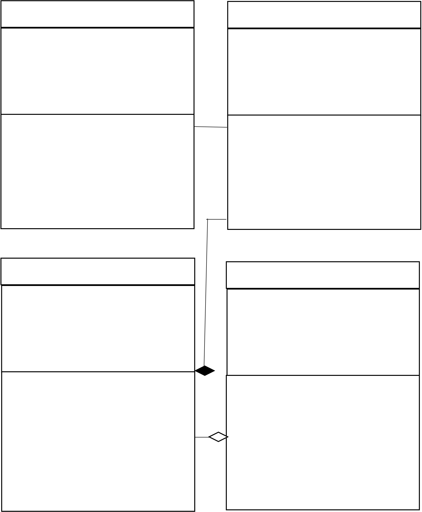

+-----------------------+-----------------------+-----------------------+
| +farm_no              |    Housing Floor      | Collection            |
+=======================+=======================+=======================+
|                       |                       |    -q                 |
|                       |                       | uantity_of_collection |
+-----------------------+-----------------------+-----------------------+
|    -loss              |                       |    -loss              |
+-----------------------+-----------------------+-----------------------+

..

   | -get_type_housing_floor() -compute_loss()
   | -read_weathe_data()
   | -read_animal_data()
   | -get_farm_data()

Simulation_Manure_System

   -quantity_of_manure

   | -get_type_collection()
   | -compute_loss()
   | -read_weathe_data()
   | -read_animal_data()
   | -read_place_storage_treatment()
   | -get_amount_manure_Housing_floor()

Export_Field_Application

+-----------------------------------+-----------------------------------+
|    -storage_treatment_no -loss    |    | -quantity_of_export          |
|                                   |    | -type_of_export              |
+===================================+===================================+
+-----------------------------------+-----------------------------------+

..

   | -get_storage_treatment_name()
   | -get_storage_treatment_size()
   | -read_weathe_data()
   | -read_animal_data()
   | +daily_simulation()
   | +annual_simulation()
   | +write_emissions_data()
   | +update_manure_property_data()
   | +generate_emissions_report()

   **Class and Data Dependency Diagram for Manure Management Systems**
