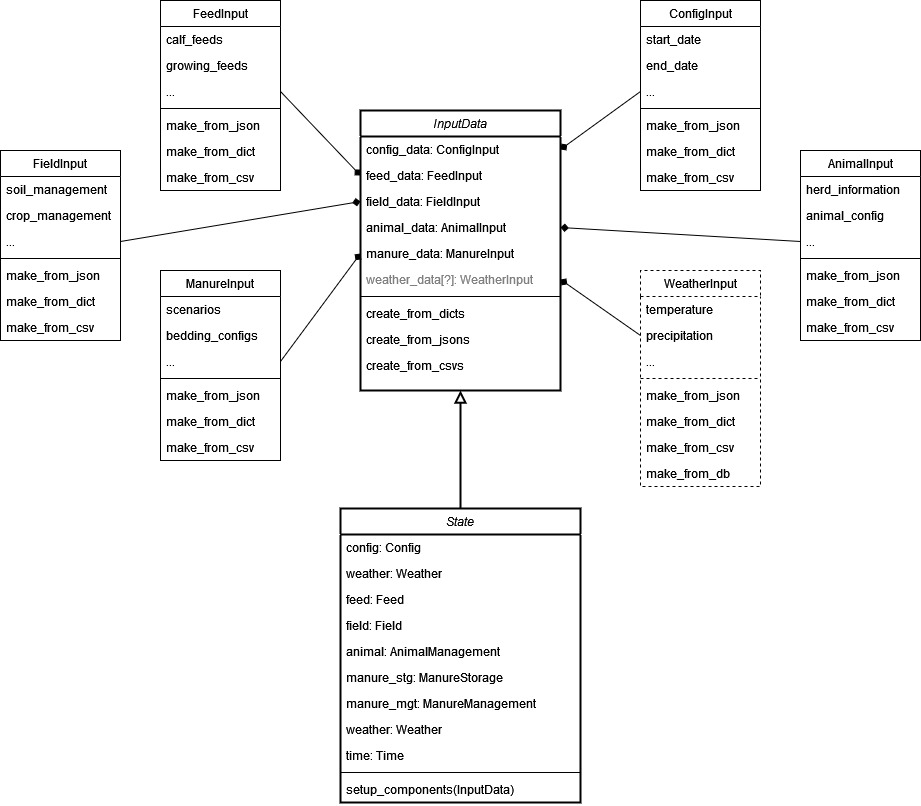

# RuFaS Input Redesign
Authors: Clay J. Morrow
Created: 11, April 2023
Last Edited: 11, April 2023
Reviewed by: [TBA]
Status: Draft

## Contents
1. [Overview](#overview)
2. [Context](#context)  
3. [Requirements](#requirements)
4. [Milestones](#milestones)
5. [Existing Solutions](#existing-solution)
6. [Proposed Solution](#proposed-solution)
7. [Alternative Solutions](#alternative-solutions)
8. [Testability, Monitoring and Alerting](#testability-monitoring-and-alerting)
9. [Cross-Team Impact](#cross-team-impact)
10. [Open Questions](#open-questions)
11. [Detailed Scoping and Timeline](#detailed-scoping-and-timeline)

---

## Overview

The way that RuFaS handles user input, at the time of this document's creation, is not ideal for many applications of 
the model. This document discusses how to update that functionality to allow RuFaS to be more modular and versatile. 

---

## Context

Currently, RuFaS takes its input from a series of json files. This poses a number of challenges for running the model
under different scenarios or starting conditions. To do so, users must either 1) overwrite the input files or 2) 
write multiple input files (RuFaS does handle running multiple input files sequentially). This is further complicated by
the fact that the primary input file contains path references to *other* input files of the various sub-categories of
input, which are handled separately and inconsistently by the submodules. This design is especially problematic when 
trying to run many instances of RuFaS in parallel; creating thousands of input files that differ by only a few values 
value is inefficient and altering a single file on multiple threads is not safe. For further details about the current 
structure, see the [Existing Solution](#existing-solution) section.

Because of these challenges, a redesign and refactor of the input manager is warranted. 

---

## Requirements

RuFaS should handle input such that:
* files (e.g., JSONs) containing user-specified input can be used to setup the simulation (current functionality)
* alternative input methods can also be handled (e.g., dictionaries or other user-initialized data objects)
* external methods (e.g., sensitivity analysis, validation, and mathematical optimization) can execute RuFaS by altering
the input values automatically
* parallel or distributed evaluation of multiple RuFaS instances can be done in a thread safe way, with many alternative
starting conditions.
* the actual model and submodules are agnostic to the structure of the input that the user specified.
* The input manager should conduct input validation, ensuring that the structure of the data is usable. If the checks
are not passed, the model/simulation will not be run. This will need to account for necessary inputs and advanced 
inputs. For the latter case, default values can be supplied when advanced options aren't given.

---

## Milestones

**TBD**

---

## Existing Solution

The main method of the model `run_rufas()` accepts a path to a JSON file or a directory of JSON files, via the 
`input_path` argument. The file path(s) are passed to `execute_simulations_from_files()` (and `SimulationEngine`) 
which runs RuFaS model using input specified in the files. The input files are located in the [input/](../../input) 
directory by default and have two main components: 
* overall configuration data (the "config" field) such as the time periods to be simulated, the random seed, the 
location to which output files should be saved, etc.
* and references to *other* input files to use. 

Take, for example, the following input file `ARL.json`:

```json
{
    "config":
    {
        "start_date" : "1990:1",
        "end_date" : "2019:365",
        "csv_dir": "output/CSVs/",
        "graphic_dir": "output/graphics/",
        "set_seed": false,
        "seed": 0,
        "simulate_animals": false
    },
    "weather": "ARL_weather.csv",
    "output": "field_report.json",
    "farm":
    {
        "fields": {
            "field_1": {
                "soil": "ARL_soil.json",
                "crop": "ARL_rotation.json",
                "field_management": "ARL_no_fert_field_management.json"
            }
        },
        "animal": "barnyard_animal.json",
        "feed": "purchased_feed.json",
        "manure": "manure_management.json"
    }
}
```

The "config" field specifies the configuration information and the remaining fields are paths to other files. The 
"weather" field points to a csv file containing weather data and the others point to additional json files. 
Importantly, these referenced files are required to be in specific sub-directories of [input/](../../input): the 
soil file [ARL_soil.json](../../input/soil/ARL_soil.json) is located at [input/soil/](../../input/soil), and must be 
for the model to work properly. The Soil and Crop module locates and parses this file to get the data it needs, once 
the program enters this module. 

### Set-up Details

The `SimulationEngine` class handles the set-up of the objects needed for the simulation (and submodules) through its
`_initialize_simulation()` method:
* the main input file is converted to a dictionary called `data` (with a convoluted method: why not just use 
`json.load()` directly?)    
* the `Config` class is initialized with `Config(data['config'], data['weather'])`, which creates the `self.config`
attribute and uses the contained path to the weather file 
(by prepending "~/input/weather" to the string) to parse the file **for dates ranges only**.
* the `Weather` class is initialized with `Weather(data['weather'], self.config)`, which *again* reads the
weather file (using similar code to `Config`).
* the `Time` class is initialized with `Time(self.config)`
* the `State` class is the main container class where the simulation variables are tracked and 
is initialized with `State(data['farm'], self.config, self.weather, self.time)`, 
which initializes the required objects for each of the modules (simplified below):
    - Crop and Soil: `Fields(data['fields'], time)`
    - Feed: `Feed(feed_path)` - where `feed_path` is an expanded path to the `data['feed']` json file
    - Animal: `AnimalManagement(animal_config, config, self.feed, weather, time)` - where `animal_config` is a modified
      version of the dictionary created from the `data['animal']` json file, with the addition of a sub-dictionary 
      created from the 'data['manure']` json file
    - Manure: `ManureStorage(self.animal_management)` and `ManureManagement` - where `self.animal_management` is the 
      instance of `AnimalManagement` referenced previously and `manure_management_config` is the dictionary created from
      `data['manure']`

---

## Proposed Solution

A better solution would be to have an `InputData` class, upon which `State` depends. `InputData` would contain *all*
the data needed to set up the simulation: all user-given input (required and optional). `State` then would use this
class to set up the objects needed for the simulation. A series of methods would be needed to create the `InputData`
object from different input streams (e.g, json files vs user-created dictionaries vs csv config files). 
Fig. 1 shows the proposed structure of this `InputData` class. The main `run_rufas()` method would handle this setup,
taking `InputData` as a parameter.

{#fig_one}
*Fig. 1: Class relationship diagram of the proposed input system for RuFaS. `InputData` is a composite class that
contains other dataclasses, built from user input. Each of these classes has methods for creating instances from
different types of input data (the examples given are dictionaries, json files, csv files, and an internal database).
The `State` class depends upon `InputData` to create its own component classes (`Config`, `Weather`, `Field`, 
`AnimalManagement`, `ManureStorage`, `ManureManagement`, `Weather`, and `Time`), which are the main objects
tracked throughout the simulation for each module of RuFaS.* 

Then, another set of methods would be needed to parse the current input JSON files (those that contain path references
and not actual data) and create the dictionaries or input formats needed to create `InputData`.

Note: the conceptual model (*Fig. 1*) only demonstrates a finite number of component classes for which we currently
know input data will be needed. However, this input class may have many yet-unknown components. So, it may be useful
to have a template for adding new component input objects.

With this design, the current method of running RuFaS would remain intact and additional paths would also open up, by
allowing users to create the `InputData` class by whatever means suit their needs. With this single input object, a full
RuFaS simulation can be executed.

---

## Alternative Solutions

One intermediate solution would be to simply expand all the JSON files into the usable data dictionaries in a single 
class, in a uniform way, and then pass those dictionaries to `run_rufas()`, which would in turn pass them to the
`State` call to initialize the set-up objects. This would be simpler but not as versatile - and it is structurally
similar to the proposed solution.

---

## Testability, Monitoring and Alerting

Unit tests need to ensure that:
* `InputData` can be properly created from any of the supported input structures
* optional/advanced options are set to default values when not specified by users and set to user-specified vallues
otherwise. 
* `State` can properly initialize all simulation objects given a properly formatted `InputData` instance
* `run_rufas()` correctly can execute a full simulation given a properly formatted `InputData` instance
* an external method sets up `InputData` from the default JSON files prior to calling `run_rufas()` during a standard 
(legacy) execution of RuFaS. 

The model should alert users if a proper `InputData` instance cannot be created with the inputs given.  

---

## Cross-Team Impact

This change may have a moderate impact across RuFaS teams. Since the full model would depend upon `InputData`, each
module must be aware of it and make any updates to how their module handles input in the setup method 
(e.g., `State.setup_components()` from Fig. 1). Modules would also be responsible for maintaining their module-specific
input data component classes (`FeedInput`, `AnimalInput`, etc.). Overall, the expected impact is positive, as it 
will standardize and localize how the model accepts input and make the simulations more flexible.

These changes will also positively affect the validation team, as it will facilitate sensitivity analyses, model 
validation testing, and mathematical optimization of RuFaS parameters. 

---

## Open Questions

Here is a list of potential questions that should be considered:
* Should we (now or in the future) standardize the structure of the module-specific components of the input classes 
(`FeedInput`, `AnimalInput`, etc.).
* Should we switch to using full paths to files rather than relying on strict directory structures? Similarly, we could
use `json.load()` instead of our wrappers in the `Utility` class. 
* Should we also reformat the structure of the input files to better fit this design? One example would be to have all
the components in separate files: a config.json would configure the general simulation parameters, an animal.json would 
contain the animal management data (as it does now), etc. Then the user would need to give paths to each of these
files during the main execution of the model. 

---

## Detailed Scoping and Timeline

**TBD**