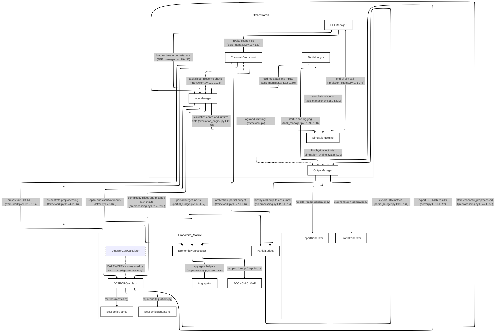

```mermaid
---
config:
  layout: elk
  theme: neo
---
flowchart TB
 subgraph Orchestration["Orchestration"]
        TM["TaskManager"]
        IM["InputManager"]
        OM["OutputManager"]
        SE["SimulationEngine"]
        EEE["EEEManager"]
        EF["EconomicFramework"]
  end
 subgraph Economics_Module["Economics_Module"]
        EP["EconomicPreprocessor"]
        DCFROR["DCFRORCalculator"]
        PB["PartialBudget"]
        MAP["ECONOMIC_MAP"]
        AGG["Aggregator"]
        EQ["Economics Equations"]
        MET["EconomicMetrics"]
        DCC["DigesterCostCalculator"]
  end
    TM -- "load metadata and inputs (task_manager.py:L72-L150)" --> IM
    TM -- "startup and logging (task_manager.py:L109-L138)" --> OM
    TM -- "launch simulations (task_manager.py:L150-L210)" --> SE
    IM -- "simulation config and runtime data (simulation_engine.py:L49-L58)" --> SE
    SE -- "biophysical outputs (simulation_engine.py:L59-L79)" --> OM
    SE -- "end-of-sim call (simulation_engine.py:L71-L78)" --> EEE
    EEE -- "load runtime econ metadata (EEE_manager.py:L29-L36)" --> IM
    EEE -- "invoke economics (EEE_manager.py:L37-L39)" --> EF
    IM -- "commodity prices and mapped econ inputs (preprocessing.py:L217-L238)" --> EP
    IM -- "capital and cashflow inputs (dcfror.py:L23-L63)" --> DCFROR
    IM -- "partial budget inputs (partial_budget.py:L68-L94)" --> PB
    EF -- "orchestrate preprocessing (framework.py:L124-L136)" --> EP
    EF -- "orchestrate DCFROR (framework.py:L131-L136)" --> DCFROR
    EF -- "orchestrate partial budget (framework.py:L127-L136)" --> PB
    EF -. "capital cost presence check (framework.py:L21-L123)" .-> IM
    EF -. "logs and warnings (framework.py)" .-> OM
    OM -- "biophysical outputs consumed (preprocessing.py:L196-L215)" --> EP
    EP -- "store economic_preprocessed (preprocessing.py:L347-L353)" --> IM
    EP -- "mapping lookup (mapping.py)" --> MAP
    EP -- "aggregate helpers (preprocessing.py:L180-L215)" --> AGG
    DCFROR -- "equations (equations.py)" --> EQ
    DCFROR -- "metrics (metrics.py)" --> MET
    DCFROR -- "export DCFROR results (dcfror.py:L359-L392)" --> OM
    PB -- "export PBA metrics (partial_budget.py:L99-L144)" --> OM
    DCC -. "CAPEX/OPEX curves used by DCFROR (digester_costs.py)" .-> DCFROR
    OM -- "reports (report_generator.py)" --> RG["ReportGenerator"]
    OM -- "graphs (graph_generator.py)" --> GG["GraphGenerator"]

     DCC:::aux
    classDef aux fill:#eef,stroke:#666,stroke-dasharray: 5 5
```
