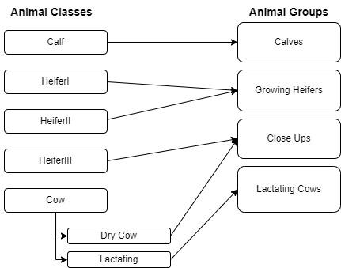

.. _animal_grouping_and_pen_allocation :

Animal Grouping and Pen Allocation
==================================

**Overview:**

The purpose of this part of the model is to group instances of the
animal classes together first based on their animal group (see Figure 1)
and then based on their nutritional requirements if there are sufficient
pens for lactating cows. These methods are part of the Animal Management
sub-module and implemented in animal_management.py and
clustering_pen_grouping.py. In addition to grouping and moving animals
between pens on a daily basis, these methods also assign new animals to
pens based on their life cycle stage and the stocking density of the
pen. Furthermore, prior to the main algorithm being executed, it first
runs through all pens input in the simulation and checks if there is a
sufficient number of stalls. If not, default pens will be created prior
to initial grouping.

Figure 1. An illustration of how the Animal Groups used to assign
animals to pens, relate to the Animal Classes.

**Inputs:**

Animal_Management – there is one instance of the Animal_Management class
and the attributes of this class contain most of the information
required for the animal grouping. Specific attributes used by these
functions include:

-  Several lists containing the instances of each animal class (see :ref:`animal-module-background`
   for more information). Important attributes of the Cow animal class include 
   whether or not they are lactating and their nutrient requirements.

-  The list of the instances of the Pen class. Important attributes of
   the Pen class include the number of stalls, the animal groups that
   can be assigned to that pen, the current stocking density, and the
   maximum stocking density for each pen.

Animals_added – a list of replacement animals purchased to maintain herd
size. Includes animals of class Calf and HeiferIII.

Ids_removed – a list of animals removed from the herd. Includes animals
of all classes

Calves_born – a list of all the calves born and added to the herd (i.e.
calves that are born and not culled).

**Flow of Information**

Initialization:

1. The init_pens() function initializes the pens based on the number and
   attributes provided by the user in the animal management json. If
   there are no or not enough stalls for the the number of animals
   initialized in each animal group, this function will initialize
   additional pens based on default inputs. (note, currently hardcoded)

Daily Updates:

2. The daily_update_pen_id function:

   a. Adds animal to a pen of their according group (‘calf’, ‘growing’,
      ‘close-up’, ‘l_cow’)

   b. Tracks pens that have lost cows and have a low stocking density.

   c. Assigns new animals to pens according to their group and the ones
      with the lowest stocking density.

Regrouping that occurs at the beginning of every ration formulation
interval:

3. The pen_allocation() function:

   a. loops through all pens in the simulation and checks if there is a
      sufficient number of stalls based on the total number of
      animals in that group, the total number of stalls summed over
      the pens available for that group, and the maximum stocking
      density set by the user. If there are not enough stalls,
      default pens will be created prior to grouping. 

   b. Assigns all groups except for lactating cows to pens based on
      their stocking density.

      i.  This is done by first getting a total stocking density for
          the whole group of animals across all pens: len(animals in
          group)/ total number of stalls across all pens in group.

      ii.  Then the algorithm loops through each animal group and checks
           the pens sequentially to see if the stocking density in
           that pen is less than the group density. If the density of
           the current pen is less than the group density, the animal
           is allocated to that pen.

      iii. If not, it moves to the next pen and repeats

   c. Passes the lactating cow list, lactating cow pens, and the density
      of lactating cows to the lactating cow grouping algorithm

4.  Lactating cows are grouped by the grouping() function in
    clustering_pen_grouping.py. This algorithm groups lactating cows
    according to their milk production level and nutrient
    requirements, specifically according to their Metabolizable
    protein (MP), and Metabolizable energy (ME) requirements. The
    objective of the algorithm is to place cows with similar nutrient
    requirements in the same pen when there are multiple lactating cow
    pens. The flow of information of this algorithm is:

    a.  Access nutrient requirements and milk production for each cow:

        i.  DNED_req – is the required net energy density of the diet

        ii.  NMPD_req – is the required metabolizable protein density of
             the diet

        iii.  Milk_avg – is the average milk produced by the cow on that day

These 3 values are normalized and then summed together according to the
following equation:

+-------------------------------------------------------------------------------------+
| :math:`{norm}_{i} = \left( \frac{{NE}_{i} - min\left( {NE}_{} \right)}{\max\left( {N|
| E}_{} \right) - min\left( {NE}_{} \right)} \right) +`\ :math:`\left( \frac{{MP}_{i} |
| - min\left( {MP}_{} \right)}{\max\left( {MP}_{} \right) - min\left( {MP}_{} \right)}|
| \right) +`\ :math:`\left( \frac{{MY}_{i} - min\left( {MY}_{} \right)}{\max\left( {M |
| Y}_{} \right) - min\left( {MY}_{} \right)} \right)`                                 |
+-------------------------------------------------------------------------------------+
[A.#.D.3]

   :math:`i` = Cow

   :math:`{MP}_{i}` = Metabolizable protein density in g/kg DM/day

   :math:`{NE}_{i}` = Net energy in Mcal/kg DM/day

   :math:`{MY}_{i}` = Milk yield in Kg/cow/day

b.  The normalized sums are then ranked and assigned a percentile rank according 
    to the following equation:

..

   :math:`p_{i} = 100 \times \left( \frac{f_{b} + 0.5f_{w}}{N} \right)`
   [A.#.D.4]

   :math:`i` = Cow

   :math:`p_{i}` = Percentile rank of cow :math:`i`.

   :math:`f_{b}` = Number of scores which are less than the score value
   of the percentile rank.

   :math:`f_{w}` = Number of scores that have the same value as the
   score value of the percentile rank.

   :math:`N` = Number of scores
