.. _animal-life-cycle-pseudocode :

Animal Life Cycle Pseudocode
============================

   | Date Created: June 6, 2023

   | Last Updated: June 6, 2023

**Animal life cycle:** This is a simulating process that simulates
individual animals’ life events and herd dynamics. This simulation is a
Monte Carlo stochastic process that simulates the growth, production,
reproduction, and culling of individual dairy cattle animals and overall
herd dynamics on a daily basis. The herd dynamics, an aggregation of
individual animals, are then transferred to other submodels for further
modeling. This simulation aims to provide animal and herd information to
other submodels and modules with animal and herd dynamics.

**Flow of information**

 A. Animal information is carried in the **animal base** file

 B. Animal events record life stories of animals with the **animal event** file

 C. Animal individual daily update: animal goes through life stage as the **calf** 
    (from the day of birth until weaning), **Heifer I** (from weaning until 
    the breeding process starts), **Heifer II** (from breeding until close to 
    calving), **Heifer III** (close to calving until calving), **Cow** (from 
    the beginning of the first calving till culling)

 D. Animal database is generated and stored with the **animal initialization** file

 E. Integrates groups of animals from each stage is in **life cycle** file

Function numbering convention: **[A.1A.A.1]**: A: animal module in RuFaS
model, 1A: life cycle submodel in the animal module, A: 1st type of
information flow in lifecycle submodel, 1:1st function in the code

**Monte Carlo Simulation:**

 The life cycle module represents the variation in animal performance
 through the use of Monte Carlo Simulation methods. (Reuven et al.,
 2016). Monte Carlo simulation relies on random draws from probability
 distributions rather than assigning fixed values. In this model, two
 main strategies are used:

 1. Comparing a random draw from U(0,1) {ρ\ :sub:`Uniform`} to the
    probability of an event occurring to simulate if that event occurs or
    did not. (*RandomUni* in this document representing a random draw
    from U(0,1) {ρ\ :sub:`Uniform`})

 2. Selecting a random draw from a known distribution of animal
    attributes and assigning that value to the instantiation of an
    individual animal. (*Random ~* in this document representing a random
    draw from the following distribution) Probability distributions used
    are:

   a. Normal Gaussian: N(μ, σ) where μ is the distribution means, and σ
      is the standard deviation.

   b. Empirical:
      :math:`F(x)\  = \frac{1}{n}\sum_{i = 1}^{n}{}1_{\{ x_{i} \leq x\}}`:
      where x is the observations from the sample and an indicator
      function equal to if and otherwise.

**A. Animal Base**

 Implemented in animal_base.py

 Set standard parameters to follow each individual during the simulation
 process. It initializes:

 -  Animal identity info, which would be constant for each animal and
    carried with the particular animal through its life: Animal ID,
    breed, birth date, mature body weight (potential genetic information)

 -  Animal status info, which updates animal status such as culling and
    breeding constraints

 -  Animal historical records, including bodyweight and pen

 -  Animal output variables, such as nutrient requirements, nutrient
    balance, manure excretion, ration formulation settings

   [A.1A.A.1]

**B. Animal Events**

 Implemented in animal_events.py

 Set functions for adding events and searching for the last record of a
 specific event. Work with animal_event_constants.py (string list of all
 events) and serve as animal history recording. Animal events are events
 like birth, reproduction actions, dry, and culling that happens to the
 animals according to the scheduled time, always with a change in status.

 -  Add event function: add animal events to the animal’s records with
    animal age, actual simulation day, and event description.

   Events include:

   (1) Milestones of the animal lives, which could lead to changes in
   animal life status in the simulation, like birth, wean, artificial
   inseminations (AI), calving, do not breed, dry, and culling reasons.
   For example, AI would happen at the AI-day determined by the
   reproductive program at the start day of that reproductive program,
   and if it gets pregnant at this AI, the gestation length, preg check
   dates, and calving date would be scheduled; otherwise, the next
   reproductive events would be scheduled.

   (2) Records of animal lives history, which record events related to
   the indications of the animal description (like entering the herd,
   mature bodyweight reached)

   [A.1A.B.1]

 -  Get the most recent event function: fitch the most recent age for
    specific events to identify animals’ status.

   [A.1A.B.2]

**C. Individual animal daily update**

 Individual animals update daily with the event scheduling process. The
 variables like daily body weight change estimates and nutrient
 requirement calculations for all stages, targeted production for
 lactating cows are updated with equations every day. At the same time,
 other variables such as pan allocation, reproductive events, and culling
 are updated upon the scheduled status change date.

(1) **Calves**

 Implemented in calf.py

 Simulation of calves begins when the calf is born on Day 1 and ends on
 weaning day. A calf’s birth is simulated by initializing an instance of
 a calf class object on day 1. Five main attributes of the calf are
 determined at birth: (1) if the calf was stillborn, (2) the calf’s
 gender, (3) the calf’s birth weight, (4) if it was sold as a calf, and
 (5) mature bodyweight of this animal.

 Input:

   - Stillbirth rate: the rate of stillbirth happens

   - Male calf rate: the rate of male calf based on semen type used to the dam

   - Keep the female calf rate: the rate of female calf kept on the farm

 Birth weight distribution: breed-specific normal distribution with
 average and standard deviation

 Mature body weight distribution: breed-specific normal distribution with
 average and standard deviation

 Wean day: the time before weaning for calves

 **1.1 initial calf**

   **1.1.1 Stillbirth**

      *Determine whether the calf was a stillbirth*

      If RandomUni < stillbirth rate:

         Still Birth = True

      Else:

         Still Birth = False

      [A.1A.C.1]

   **1.1.2 Gender**

      *Determine the gender of the calf*

      If RandomUni < male calf rate:

         Gender = male

      Else:

         Gender = female

      [A.1A.C.2]

   **1.1.3 Sold as calf**

      *Determine whether to sell the calf; all male calves and some female
      calves are sold as a calf*

      If gender = male or gender = female and RandomUni < keep female
      calf rate:

         Sold = True

      Else:

         Sold = False

      [A.1A.C.3]

   **1.1.4 Birth weight**

      *Determine the birthweight of the calf based on breed-specific
      distributions*

      Birth weight = Random ~ N (avg, std) of birth weight distribution

      [A.1A.C.4]

   **1.1.5 Mature body weight**

      *Determine the target mature body weight*

      Mature body weight = Random ~ N (avg, std) of mature body
      distribution

      [A.1A.C.5]

 **1.2 update calf**

   *Calves are updated on a daily basis*

   **1.2.1 bodyweight change**

      *After birth, a calf’s growth is stimulated daily until the day they
      are weaned. Bodyweight changes every day based on the targeted
      average daily gain(ADG), targeting at doubling the birth weight by
      wean.*

      :math:`{Bodyweight}_{i}` = :math:`{Bodyweight}_{i - 1} +\ calf\ targeted\ ADG`

      Where calf targeted ADG = birth weight/wean day

      [A.1A.C.6]

   **1.2.2** **Wean**

      *Calves are weaned as scheduled, leaving the calf stage and entering
      the heifer stage.*

      If days born = wean day:

         Wean day = True

      [A.1A.C.5]

(2) **Heifers I**

 Implemented in heiferI.py

 Heifer I simulation starts when the calf is weaned and ends when the
 heifer starts breeding programs.

 Input:

 Target heifer pregnant day: the target age of the heifer’s first
 pregnancy

 Breeding start day for heifers: the schedule of time for the heifers to
 start the breeding program

 **2.1 Nonpregnant heifer body weight change**

   *Heifers are targeted to grow 55% of their mature body weight until
   pregnant. A targeted heifer pregnant time is set through the user input.
   The ADG of nonpregnant heifers is calculated based on the target
   heifer's pregnancy time and body weight.*

   Nonpregnant heifer ADG = :math:`\frac{0.55 \times MSBW - SBW}{abs({target\ heifer\ pregnant\ age - age})}`

   Where MSBW is shrunk mature bodyweight (0.96*mature bodyweight) and
   SBW is shrunk bodyweight (0.96*bodyweight)

   [A.1A.C.6]

 **2.2 update heiferI**

   *Heifers are updated on a daily basis*

   **2.2.1 bodyweight change**

      :math:`Bodyweight_{i}` =
      :math:`Bodyweight_{i - 1}` *+ non pregnant heifer*
      ADG

      [A.1A.C.7]

   **2.2.2 move to the next stage**

      *Heifers are moved to the next stage as scheduled*

      If days born = Breeding start day for heifers:

      Second stage = True

      [A.1A.C.8]

(3) **Heifers II**

 Implemented in heiferII.py

 Heifer II simulation starts when heifers enter into breeding programs
 and proceed through the first pregnancy until calving. Three processes
 are simulated during this animal class: (1) Growth, (2) Breeding, (3)
 Pregnancy Detection

 Input:

 - Gestation length distribution: normal distribution with average and standard deviation
 -  Heifer reproduction method: heifer reproduction method set in the input file
 - Prefresh day: the time before first calving when the heifer is moved to the next stage
 - Heifer reproductive cull time: the age of heifer to be culled when not pregnant
 - Heifer estrus cycle: the estrus cycle of heifers in the ED program
 - Estrus detection rate: the chance of the estrus to be detected
 - ED conception rate: the conception rate of the estrus detection method
 - TAI method for heifer: the user input of protocol picked for the TAI method
 - 5dCGP conception rate: the conception rate when apply 5dCGP protocol
 - 5dCG2P conception rate: the conception rate when apply 5dCG2P protocol
 - User define TAI length: the length of the user define TAI protocol
 - User define conception rate: the conception rate when apply User define TAI protocol
 - Synch ED method: the user input of the protocol picked for the synch ED method
 - Pregnancy check day 1/ 2/ 3: days in pregnancy of doing pregnant checks
 - Pregnancy loss rate 1/ 2/ 3: pregnancy loss rate between pregnant checks

 **3.1 pregnant heifer body weight change**

   **3.1.1 average daily gain of the pregnant heifer**

      *Heifers are targeted to grow 82% of their mature body weight until
      first calving. A gestation length is set at conception. The ADG of
      pregnant heifers is calculated based on the target heifer's body
      weight, gestation length, and days in pregnancy.*

      Pregnant heifer ADG =
      :math:`\frac{0.82 \times MSBW - SBW}{gestation\ length - \ days\ in\ pregnancy}`

      Where MSBW is shrunk mature bodyweight (0.96*mature bodyweight) and
      SBW is shrunk bodyweight (0.96*bodyweight)

      [A.1A.C.9]

   **3.1.2 conceptus growth of pregnant heifer**

      *The conceptus weight change along gestation*

      When DIP < 50,

         conceptus growth = 0;

      When 50 < DIP < gestation length,

         conceptus growth =
         :math:`3 \times {conceptus\ parameter}^{3} \times (DIP - 50)^{2}`

      When DIP = gestation length,

         conceptus growth = - total conceptus weight

      Where

         :math:`total\ conceptus\ weight\  = 0.0148 \times gestation\ length\  - \ 2.408 \times calf\ birth\ weight`

         :math:`conceptus\ parameter\  = \ {total\ conceptus\ weight}^{1/3}/gestation\ length\  - \ 50`

      [A.1A.C.10]

 **3.2 update heiferII**

   *heifers are updated on a daily basis*

   **3.2.1 bodyweight change**

      *From the start of breeding until close to calving, the Heifer II
      class is increasing its body weight in addition to weight gain for
      pregnancy.*

      When DIP = 0 and bodyweight < mature body weight,

      :math:`{Bodyweight}_{{i}}` *=*
      :math:`{Bodyweight}_{{i - 1}}` *+ non pregnant heifer
      ADG*

      When DIP > 0 and bodyweight < mature body weight,

      :math:`{Bodyweight}_{{i}}` *=*
      :math:`{Bodyweight}_{{i - 1}}` *+ pregnant heifer
      ADG*

      When bodyweight = mature body weight,

      :math:`{Bodyweight}_{{i}}` *= mature bodyweight*

      [A.1A.C.11]

   **3.2.2 breeding program assignment**

      *Breeding program is assigned to heifers when they reach breedingstart day.*

      If days born >= breeding start day for heifers,

         reproduction method = Heifer reproduction method

         Pregnancy updates follow the reproduction method

      [A.1A.C.12]

   
   **3.2.3 move to the next stage**

      *Heifers are moved to the next stage as scheduled*

      When DIP = gestation length - prefresh day,

         Third stage = True

      [A.1A.C.13]

   **3.2.4 heifer reproduction culling**

      *Heifer who failed in reproductive are culled after certain age*

      When days born > heifer repro cull time,

         Cull stage = True

      [A.1A.C.14]

 **3.3 heifer reproductive programs**

   *There are three methods recommended by the Dairy Cattle Reproduction
   Council (DCRC) implemented in the code, they are (1) estrus detection
   (ED),(2) timed artificial insemination (TAI), and (3) synchronized
   estrus detection (synch-ED).*

   **3.3.1 estrus detection method (ED)**

      *It does not require the use of hormones but is based on watching for
      animal expression of heat. To represent this, the model simulates
      estrus occurrence and the probability of detecting the estrus event.*

      **3.3.1.1 estrus day determination**

         *Determines the estrus day of each cycle for natural estrus after
         breeding start day, detection failure, or AI failure.*

         Estrus day = estrus start date + Random ~ N (avg, std) of heifer
         estrus cycle

         Where estrus start date is the day, the heifer first enters or
         re-enters the breeding program after failed estrus detection, failed
         conception, or an aborted pregnancy. In the case of re-entry, the
         start date is set equal to the last day of estrus if estrus detection
         or conception failed; otherwise, it is set to the abortion day for a
         failed pregnancy.

         [A.1A.C.15]

      **3.3.1.2 estrus detection update**

         *Update estrus, estrus detection, service upon detection with
         conception rate specifically related to this method.*

         When days born = estrus day:

            Estrus count += 1

            If RandomUni < estrus detection rate

               Estrus Detection = True,

               if RandomUni < estrus insemination rate

                  AI day = estrus day +1

                  conception rate = estrus conception rate

            Else, return estrus

         [A.1A.C.16]

   **3.3.2 Timed Artificial Insemination (TAI)**

      *Uses a series of hormonal injections to synchronize the estrus cycle
      and perform AI to heifers at the set time from the protocol’s start.*

      **3.3.2.1 Program start day determination**

         *Determines the program start day of each synchronized cycle TAI
         program after breeding start day and AI failure.*

         For heifers entering the breeding program for the first time

            TAI program start day for heifer = breeding start day h

         For heifers that did not conceive or lost a pregnancy restart the TAI program

            TAI program start day for heifer = abortion day + 1

         [A.1A.C.17]

      **3.3.2.2 Heifer TAI programs**

         *There are 3 options for TAI programs for heifers. They are
         5dCGP, 5dCG2P, and a user-defined option. Each program consists of a
         series of hormonal injections and has an associated cost and
         conception rate.*

         |image6|

         **Define user-defined tai program:** *user defines variables*

            *Variables from input: Tai program length, Defined conception rate*

            AI day = tai program start day h + tai program length

            Conception rate = defined conception rate

            [A.1A.C.18]

      **3.3.2.3 TAI update**

      *Assign TAI programs to the heifer*

      When days born = TAI program start day for heifer

         Call TAI method for heifer

      [A.1A.C.19]

   **3.3.3 Synch - estrus detection (synch-ED)**

      *Uses hormones to synchronize groups of animals in their cycles and
      then watches for heat expression after.*

      **3.3.3.1 Synch ED estrus day determination**

         *Determines the estrus day of each cycle for synched estrus after
         breeding start day or conception failure. Estrus day is determined by
         adding a normal random variable to the start day.*

         Synch estrus day = estrus start date + Random ~ N (avg, std) of estrus cycle

         Synch estrus day < program length

         [A.1A.C.20]

         Where estrus start date is the day of breed start day for heifers,
         the stop day is the last day of the program length (allowed estrus
         period), and abortion day. And the estrus cycle distribution is
         method-specific. The stop day of the last estrus period is defined in
         the protocol; without detected estrus, the heifer will return to the
         next round of synch ED. For heifers who experienced abortion and
         identified in pregnancy checks, the synch restart at the pregnancy
         check day marked as abortion day.

      **3.3.3.2 synch ED programs**

         *There are two Synch ED programs for a heifer. They are 2P and CP.
         Estrus happens on estrus day, with detection rate, whether this
         estrus is detected can be determined.*

         -  **2P:** *two injections of PGF, watch for estrus after the second
            injection, and inseminate upon heat detection.*

            |image7|

               - When days born = synch-ED program start day: inject PGF.
               
               - When days born = synch-ED program start day + 14: inject PGF.

            Synch ED estrus day = synch ED estrus day with estrus cycle Random ~ N (4,1.5), and max = 7

            When days born = Synch ED estrus day:

               Estrus count += 1

               if RandomUni < estrus detection rate

                  Estrus Detection = True,

                  if RandomUni < estrus insemination rate

                     AI day = estrus day + 1

                     conception rate = estrus conception rate

                  Else:

                     synch ED stop day = synch-ED program 
                     
                     start day + 21

                     TAI start day = synch ED stop day

                     Finish up with TAI

               Else:

                  synch ED stop day = synch-ED program start day + 21

                  TAI start day = synch ED stop day

                  Finish up with TAI

            [A.1A.C.21]

         -  **CP:** *CIDR implements for 7 days, upon removal, inject PGF, then
            watch for estrus after injection with N (3,2), and inseminate upon
            heat detection*
            
            |image8|
               
               - When days born = synch-ED program start day for heifer: implement CIDR
               
               - When days born = synch-ED program start day for heifer + 7: inject PGF

            Synch ED estrus day = synch ED estrus day with estrus cycle Random ~ N (3,2), and program length = 7

            When days born = Synch estrus day:

               Estrus count += 1

               if RandomUni < estrus detection rate

                  Estrus Detection = True

                  if RandomUni < estrus insemination rate

                     AI day = estrus day +1

                     conception rate = estrus conception rate

               Else: synch ED stop day = Synch ED estrus day + 7
         
            [A.1A.C.22]

      **3.3.3.3 synch ED update**

         *Assign synch ED programs to the heifer*

         When days born = TAI program start day for heifer

            Call synch ED method for heifer

         [A.1A.C.23]

 **3.4 Heifer pregnancy update**

   *On the day of AI, the success of conception is determined. There are
   3 subsequent pregnancy checks at designated time points after AI, at
   which time the continued success of the pregnancy is determined.*

   **3.4.1 Conception**

      When days born = AI day:

         If RandomUni < conception rate: 
            
            Preg = True

            Days in preg = 1

            Gestation length = Random ~ N (avg, std) of heifer gestation length

         Else: Preg = False

      [A.1A.C.24]

   **3.4.2 Pregnancy checks**

      *If the heifer’s age (days born) reaches the AI date + preg check day
      1/ 2/ 3, compare a random U(0,1) draw with the pregnancy loss rate 1/
      2/ 3 set in the input to determine whether the pregnancy is lost. The
      reproductive program will resume on the pregnancy check day.*

      If heifer pregnant = True

         When days born = AI day + pregnancy check day 1:

            If RandomUni > preg loss rate 1:

               Days in preg = preg check day 1

            Else:

               Preg = False

               Abortion day = days born

       [A.1A.C.25]

      If heifer pregnant = True

         When days born = AI day + pregnancy check day 2:

            If RandomUni > preg loss rate 2:

               Days in preg = preg check day 2

            Else:

               Preg = False

               Abortion day = days born

       [A.1A.C.26]

      If heifer pregnant = True

         When days born = AI day + pregnancy check day 3:

         If RandomUni > preg loss rate 3:

            Days in preg = preg check day 3

         Else:

            Preg = False

            Abortion day = days born
      
       [A.1A.C.27]

   **3.4.3 Heifer repro culling**

      *If the heifer does not have a successful conception or pregnancy and
      age (days born) exceeds heifer repro cull time, set at 650 days, this
      heifer is culled*

      If heifer pregnant = false and days born > heifer repro cull
      time:

         Cull stage = True

      [A.1A.C.28]

(4) **Heifers III**

 Implemented in heiferIII.py

 The Heifer III class simulates heifers from close to calving until the
 start of milking. No breeding is involved. Heifers continue to grow, and
 the ranking of replacements can happen here.

 **4.1 update heiferIII**

   *heifers are updated on a daily basis*

   **4.1.1 bodyweight change**

      *The Heifer III class is increasing its body weight with ADG in
      addition to weight gain for pregnancy.*

      When bodyweight < mature body weight,

         :math:`{Bodyweight}_{{i}}` =
         :math:`{Bodyweight}_{{i - 1}}` *+ pregnant heifer ADG*

      When bodyweight = mature body weight,

         :math:`{Bodyweight}_{{i}}` *= mature bodyweight*

      [A.1A.C.29]

   **4.1.2 move to the next stage**

      *Heifers are moved to the next stage when reach the end of gestation*

      When DIP = gestation length

         Cow stage = True

      [A.1A.C.30]

(5) **Cow**

 Implemented in cow.py

 Simulate cows when they start lactating until they leave the herd. With
 calving, lactating, breeding, and culling.

 Inputs:

   - Cow repro method: the reproductive method used for the cows

   - Semen type: semen used in the inseminations

   - Days in pregnancy when dry: days of scheduled dry time for lactating
     cows

   - Lactation curve: lactation curve models for an estimate the targeted
     milk production

   - Repro cull time: days in pregnancy when mark as do not breed and
     terminate breeding practices

   - Cull milk production: milk production threshold for low production
     culling

   - Cow estrus cycle: the estrus cycle of cows in the ED program

   - Estrus detection rate: the chance of the estrus to be detected

   - Estrus insemination rate: the chance of a detected estrus to be serviced

   - ED conception rate: the conception rate of the estrus detection method

   - TAI method for cow: the user input of protocol picked for the TAI method

   - Ovsynch56 conception rate: the conception rate when applying Ovsynch56
     protocol

   - Ovsynch48 conception rate: the conception rate when applying Ovsynch48
     protocol

   - Cosynch72 conception rate: the conception rate when applying Cosynch72
     protocol

   - Cosynch5d conception rate: the conception rate when applying Cosynch5d
     protocol

   - User define TAI length: the length of the user define TAI protocol

   - User define conception rate: the conception rate when apply User define
     TAI protocol

   - Cow resynch protocol: the resynch protocol picked for the TAI method

   - Voluntary waiting period: time after calving before starting breeding

   - Tai program start day: days in milk for the ED-TAI program to start the
     TAI program

   - Conception rate decrease: conception rate decrease by this much
     percentage points for each AI after the first

   - Gestation length distribution: the average and std length for the
     gestation period
 
   - Lactation curve parameters distribution: the average and std for
     lactation curve parameters

   - Pregnancy check day 1/ 2/ 3: days in pregnancy of doing pregnant checks

   - Pregnancy loss rate 1/ 2/ 3: pregnancy loss rate between pregnant checks

 Thresholds of culling reasons:

+--------+------------+------------+------------+-------------+-------+
|Lameness| Injury     | Mastitis   | Disease    | Udder       |Unknown|
+--------+------------+------------+------------+-------------+-------+
| 0 -    | 16.33% -   | 45.16% -   | 69.55% -   | 83.46% -    | 89.91%|
| 16.33% | 45.16%     | 69.55%     | 83.46%     | 89.91%      | - 1   |
+--------+------------+------------+------------+-------------+-------+

   Thresholds of this culling time:

+-----------+----+----+----+----+----+----+----+----+----+----+----+----+----+----+
| Days      | 0  | 5  | 15 | 45 | 90 | 135| 180| 225| 270| 330| 380| 430| 280| 530|
+-----------+----+----+----+----+----+----+----+----+----+----+----+----+----+----+
| Mastitis  | 0  |0.06|0.12|0.19|0.30|0.43|0.56|0.68|0.78|0.85|0.90|0.94|0.97| 1  |
| CDF       |    |    |    |    |    |    |    |    |    |    |    |    |    |    |    
+-----------+----+----+----+----+----+----+----+----+----+----+----+----+----+----+
| Lameness  | 0  |0.03|0.08|0.16|0.25|0.36|0.48|0.59|0.69|0.78|0.85|0.90|0.95| 1  |
| CDF       |    |    |    |    |    |    |    |    |    |    |    |    |    |    |    
+-----------+----+----+----+----+----+----+----+----+----+----+----+----+----+----+
| Injury CDF| 0  |0.08|0.18|0.28|0.38|0.47|0.56|0.64|0.71|0.78|0.85|0.90|0.95| 1  |
|           |    |    |    |    |    |    |    |    |    |    |    |    |    |    |    
+-----------+----+----+----+----+----+----+----+----+----+----+----+----+----+----+
| Disease   | 0  |0.04|0.12|0.24|0.34|0.42|0.50|0.57|0.64|0.72|0.81|0.89|0.95| 1  |
| CDF       |    |    |    |    |    |    |    |    |    |    |    |    |    |    |     
+-----------+----+----+----+----+----+----+----+----+----+----+----+----+----+----+
| Udder CDF | 0  |0.12|0.24|0.33|0.41|0.48|0.55|0.62|0.68|0.76|0.82|0.89|0.95| 1  |
|           |    |    |    |    |    |    |    |    |    |    |    |    |    |    |     
+-----------+----+----+----+----+----+----+----+----+----+----+----+----+----+----+
| Unknown   | 0  |0.05|0.11|0.18|0.27|0.37|0.45|0.54|0.62|0.70|0.77|0.84|0.92| 1  |
| CDF       |    |    |    |    |    |    |    |    |    |    |    |    |    |    |     
+-----------+----+----+----+----+----+----+----+----+----+----+----+----+----+----+
| Death     | 0  |0.18|0.32|0.42|0.48|0.54|0.60|0.65|0.70|0.77|0.83|0.89|0.95| 1  |
| CDF       |    |    |    |    |    |    |    |    |    |    |    |    |    |    |     
+-----------+----+----+----+----+----+----+----+----+----+----+----+----+----+----+

 **5.1 Update status**

   *For cow’s status to be updated on a daily basis.*

   **5.1.1 Calving**

      *When days in preg reach the expected gestation length, calving
      happens, pregnancy terminates, lactations start, and the estrus cycle
      restarts.*

      When preg = True and days in preg = gestation length,

         Calves += 1

         Milking = True; Days in milk initialized as 0

         Preg = False; Days in preg = 0; Gestation length = 0

         Call restart estrus, if repro program involves ED

         Lactation curve parameters are selected based on breed and parity
         specific distributions (Random ~ N (avg, std) of parameters l, m, n)

      [A.1A.C.31]

   **5.1.2 Breeding protocols assign to cows**

      *Breeding protocol for this lactation would be selected among ED,
      ED-TAI, or TAI.*

      If repro program == ‘ED’, call ed update

      If repro program == ‘ED-TAI’, call ed-tai update

      If repro program == ‘TAI’, call tai update

      [A.1A.C.32]

   **5.1.3 Bodyweight change**

      *Cow BW change is composed of 3 sources: growth, conceptus, and
      lactation. The growth rate is represented by ADG until the end of the
      2nd lactation, Conceptus growth for cows is modeled the same as for
      heifers. The BW change due to tissue mobilization is modeled with a
      parametric equation of DIM.*

     | :math:`Bodyweight_{i} = Bodyweight_{i - 1} + average\ daily\ gain\ `
      
                  | :math:`+\ conceptus\ growth\ + lactation\ body\ weight\ change`

      [A.1A.C.33]

 **5.2 Lactating**

   *When the cow starts lactating, she produces milk from the calving
   day until dry or culled according to the assigned lactation curve
   model.*

   **5.2.1 Milking update**

      *Daily expected milk production updates every day from calving to
      dry, according to breed and parity specific parameters with wood’s
      curve model, settled at the lactation (Three wood’s model parameters:
      wood_l, wood_m, wood_n,). For each breed (Holstein, Jersey), each
      parity group (1\ st, 2\ nd, and 3+). The targeted lactation curve is
      set at the beginning of each lactation, and the variance can be added
      after adjusted by the nutrition submodel. The single animal
      accumulated milk production is calculated here.*

      If milking = True:

         Estimated daily milk production
         :math:`{= l}{t}^{{m}}{e}^{{- nt}}`

         Single accumulated milk production += estimated daily milk production

      [A.1A.C.33]

   **5.2.2 Dry**

      *Cows are dry when they reach a dry off time before the end of
      gestation length. They stop milking and often change their pen and
      diet.*

      When days in preg = days in preg when dry

         Milking = False

         Days in milk = 0

         Estimated daily milk production = 0

      [A.1A.C.34]

 **5.3 cow reproductive programs**

   When the cow passes the voluntary waiting period (VWP) and before AI.
   It is under breeding programs from one of TAI, ED, or ED-TAI
   (suggested by DCRC 2018) assigned to her. The voluntary waiting
   period is the period after pregnancy that the breeders choose not to
   breed the cow even if it enters estrus again.

   **5.3.1 Estrus detection method (ED)**

      *It does not require the use of hormones but is based on watching for
      animal expression of heat. To represent this, the model simulates
      estrus occurrence and the probability of detecting the estrus event.*

      **5.3.1.1 Estrus Day Determination**

         *Determines the estrus day of each cycle for nature estrus after
         calving, detection failure, and AI failure.*

         Estrus day = estrus start date + Random ~ N (avg, std) of cow estrus cycle

         Where For the first estrus cycle occurs after calving: restart estrus function

            Estrus start day = days born when days in milk = 1

            estrus cycle follows estrus cycle return

         For the first estrus cycle occurs after calving: return estrus function

            Start day = estrus day

            estrus cycle follows estrus cycle cow

         For the first estrus cycle occurs after calving: after ai estrus function

            Start day = estrus day

            estrus cycle follows the estrus cycle cow

         For the first estrus cycle occurs after calving: after abortion estrus fuction

            Start day = estrus day

            estrus cycle follows estrus cycle cow

         [A.1A.C.35]

      **5.3.1.2 Estrus detection update**

         *Update estrus, estrus detection, service upon detection with
         conception rate specifically related to this method.*

         When days born = estrus day:

            If days in milk >1 and days in milk < VWP:

               Call later estrus

            Else: Estrus count += 1

               If RandomUni < estrus detection rate

                  Estrus Detection = True,

                     if RandomUni < estrus detection rate

                        AI day = estrus day +1

                        conception rate = estrus conception rate

               Else, return estrus

         [A.1A.C.36]

   **5.3.2 Timed Artificial Insemination (TAI)**

      *uses a series of hormonal injections to synchronize the estrus cycle
      and perform AI to cows at the set time from the start of the
      protocol.*

      **5.3.2.1 Program start day determination**

         *Determines the program start day of each synchronized cycle TAI
         program after the voluntary waiting period and pregnancy checks.*

            Tai program start day for cow = tai protocol start date

         Where after passing the voluntary waiting period:

            Tai program start day for cow = call presynch function

         For the first tai after pregcheck:

            Tai program start day for cow = call resynch function

         [A.1A.C.37]

      **5.3.2.2 TAI programs**

         *We have reproduction programs for cows from DCBC recommendations.
         For TAI programs, there are OvSynch56, OvSynch48, CoSynch72,
         5dCoSynch, and user defined.*

         |Image9|

         [A.1A.C.38]

   **5.3.3 TAI presynch programs**

      *Presynch protocols that could be connected with TAI programs to help
      with the conception rate of the TAI programs. The protocols are
      Presynch, Double Ovsynch, and G6G.*

      **5.3.3.1 Program start day determination**

         *Presynch starts when the cow reaches the end of the VWP*

         If days in milk = vwp:

            Presynch start day = days born

         [A.1A.C.39]

      **5.3.3.2 Presynch protocols**

         |image10|

         [A.1A.C.40]

   **5.3.4 TAI resynch programs**

      *There are 3 ways of resynch after diagnosis open at preg check. They
      are called resynch, and they are TAI after Pregnancy Check, TAI
      before Pregnancy Check, and PGF at Pregnancy Check. The conception
      rate would decrease at the rate of reducing.*

      **5.3.4.1 TAI after Pregnancy Check:**

         |image11|

      **5.3.4.2 TAI before Pregnancy Check:**

         |image12|

         If tai method for cow is one of ‘OvSynch 56’, ‘OvSynch 48’, or ‘CoSynch 72.’:
             Event (inject PGF)

      **5.3.4.3 PGF at Pregnancy Check:**

         |image13|

         [A.1A.C.41]

   **5.3.5 Estrous Detection - Timed Artificial Insemination (ED-TAI)**

      In the ED-TAI programs, ED methods are combined with TAI programs. ED
      happens during the resynch stage; the ED process will be happening
      before TAI starts, with natural estrus.

      **5.3.5.1 Estrus detection update**

         *Update estrus, estrus detection, service upon detection with
         conception rate specifically related to this method. Estrus detection
         only happens when days in milk pass VWP and before tai start time.*

         *Estrus happens on estrus day, with detection rate, whether this
         estrus is detected can be determined.*

         When days born = estrus day and days in milk < tai program start day

            Estrus count += 1

            If days in milk >1 and days in milk < VWP:

               Call later estrus

            Else:

               If RandomUni < estrus detection rate

                  Estrus Detection = True,

                     if RandomUni < estrus detection rate

                        AI day = estrus day + 1

                        conception rate = estrus conception rate

               Else, call return estrus function

         [A.1A.C.42]

         *If estrus is not detected during the detecting time, tai program
         starts at user-determined days in milk.*

         If days in milk = tai program start the day and ai day = 0

            Estrus day = 0

            call determine tai program day function

            call tai method update according to user input

         [A.1A.C.43]

         When TAI programs start, the process would be like in the tai method,
         included 4 methods recommended by CDCB (OvSynch56, OvSynch48,
         CoSynch72, and 5dCoSynch) and user-defined.

         [A.1A.C.44]

         In the ED-TAI method, resynch process mix with estrus detection:

      **5.3.5.2 TAI after Pregnancy Check:**

         |image14|
      
         | Tai program start day for cow = abortion day +1
         | Conception rate -= conception rate decrease

      **5.3.5.3 TAI before Pregnancy Check:**

         |image15|

         |image16|

         [A.1A.C.45]

   **5.3.6 adjust conception rate**

      *Adjust conception rate based on the parity of the cow*

      If lactation = 1, conception rate = conception rate,

      If lactation = 2, conception rate = conception rate - 0.05,

      If lactation > 2, conception rate = conception rate - 0.1.

      [A.1A.C.46]

   **5.3.7 open cow update**

      *Assign breeding method for open cows after spot open at pregnancy checks*

      If repro program = ED: call after abortion estrus,

      If repro program = TAI: call tai program after preg check,

      If repro program = ED: call resynch ed tai.

      [A.1A.C.47]

 **5.4 Cow pregnancy update**

   *On the day of AI, the success of conception is determined. There are
   3 subsequent pregnancy checks at designated time points after AI, at
   which time the continued success of the pregnancy is determined.*

   **5.4.1 Conception**

      When days born = AI day:

         If RandomUni < conception rate: Preg = True

            Days in preg = 1

            Gestation length = Random ~ N (avg, std) of cow gestation length

         Else: Preg = False

      [A.1A.C.48]

   **5.4.2 Pregnancy checks**

      *If the cow’s age (days born) reaches the AI date + preg check day 1/
      2/ 3, compare a random U(0,1) draw with the pregnancy loss rate 1/ 2/
      3 set in the input to determine whether pregnancy is lost. The
      reproductive program will resume on the pregnancy check day.*

      If cow pregnant = True

         When days born = AI day + pregnancy check day 1:

            If RandomUni > preg loss rate 1:

               Days in preg = preg check day 1

            Else:

               Preg = False
         
               Abortion day = days born

               Call open cow update

      [A.1A.C.49]

      If cow pregnant = True

         When days born = AI day + pregnancy check day 2:

         If RandomUni > preg loss rate 2:

            Days in preg = preg check day 2

         Else:

            Preg = False

            Abortion day = days born

            Call open cow update

      [A.1A.C.50]

      If cow pregnant = True

         When days born = AI day + pregnancy check day 3:

            If RandomUni > preg loss rate 3:

               Days in preg = preg check day 3

            Else:

               Preg = False

               Abortion day = days born

               open cow update

      [A.1A.C.51]

 **5.5 Culling**

   **5.5.1 Cull update**

      *Record culling time and reason:*

      If days born = future cull date:

         Cull = True

      [A.1A.C.52]

   **5.5.2 Low production Culling**

      *If the cow is unable to be pregnant (marked as do not breed), and
      her milk production drops lower than ‘cull milk production’ from the
      input, it will be culled for low production.*

      **5.5.2.1 do not breed**

         *The cow is marked as do not breed when not pregnant for a period
         determined by the user input*

         If preg = False and days in milk > do not breed time

            Do not breed = True

      **5.5.2.5 cull for low production**

         *Do not breed cows are culled when their milk production is below the
         threshold*

         If do not breed and days in milk > 80, and estimated daily milk
         produced < cull milk production:

            Future cull date = day born

            Cull reason = ‘low production’

         [A.1A.C.53]

   **5.5.3 Health issue Culling**

      *The reason and date of culling a cow for health reasons other than
      reproduction and production. It has a different culling rate for each
      parity and six reasons for health culling with a different
      probability. First, it will determine whether this cow will be culled
      for health reasons in this parity. If it is culled in this parity,
      then the culling reason for this culled is determined by a random
      draw. If the reason is specified, then an empirical CDF is used to
      determine which day it will be culled in this parity.*

      **5.5.3.1**
        
         *determine whether culled because of health issue in this parity
         based on the parity cull probability from the input*

         cull rate for this parity = parity cull probability

         If RandomUni < cull rate for this parity

            Cull reason random = RandomUni

            If cull reason random is between thresholds of two health culling reasons:

               Cull reason = health culling reason

               Where Cull reason = lameness/Injury/ Mastitis/Disease/Udder/Unknown

            Cull time random = RandomUni

            If cull time random is between thresholds of two culling probabilities thresholds of this culling reason:

               Future cull date = :math:`{x}_{{i - 1}}{+}{a}_{{i}}{*(R -}{c}_{{i - 1}}{)}`

         Where put date random to the CDF function of the reason

         get :math:`c_{i - 1},c_{i}`\ (the upper and lower number around R),
         :math:`x_{i - 1},x_{i}`\ (days, correspond to :math:`c_{i - 1},c_{i}`),

         compute :math:`a_{i}`. Empirical CDF: :math:`a_{i} = \frac{x_{i} - x_{i - 1}}{c_{i} - c_{i - 1}}`

         Compute the cull day of this cow\ :math:`X = x_{i - 1} + a_{i}*(R - c_{i - 1})`

       [A.1A.C.54]

   **5.5.4 Death Culling**

      *The reason and date of culling a cow for death other than health
      reasons and reproduction and production. It has a different culling
      rate for each parity. First, it will determine whether this cow will
      be culled for death in this parity. If it is culled for death in this
      parity, then an empirical CDF is used to determine which day it will
      be culled for death in this parity.*

      **5.5.4.1**
         *determine whether culled because of health issue in this parity
         based on the parity cull probability from the input*

         Death cull rate for this parity = parity death probability

         If RandomUni < death cull rate for this parity

            Death cull time random = RandomUni

            If death cull time random is between thresholds of two culling
            probabilities thresholds of this culling reason:

            Future cull date = :math:`{x}_{{i - 1}}{+}{a}_{{i}}{*(R -}{c}_{{i - 1}}{)}`

         Where put date random to the CDF function of the reason

         get :math:`c_{i - 1},c_{i}`\ (the upper and lower number around R),
         :math:`x_{i - 1},x_{i}`\ (days, correspond to
         :math:`c_{i - 1},c_{i}`),

         compute :math:`a_{i}`. Empirical CDF:
         :math:`a_{i} = \frac{x_{i} - x_{i - 1}}{c_{i} - c_{i - 1}}`

         Compute the cull day of this cow\ :math:`X = x_{i - 1} + a_{i}*(R - c_{i - 1})`

         [A.1A.C.55]

 **5.6 Cow body weight change**

   **5.6.1 average daily gain**

      *Cows are targeted to grow to their mature body weight until the end
      of the 2nd lactation. A calving interval is in either from the user
      input or the herd average . The ADG of cows is calculated based on
      the target of reaching 0.92 of the mature body weight by the end of
      the 1st lactation, and full mature body weight at the end of the 2nd
      lactation. Before pregnancy, the ADG is estimated based on the
      calving interval, otherwise the ADG is calculated based on days until
      calving.*

      If days in pregnancy = 0:

      .. image:: ../media/lcimage1.png
         :width: 4.42415in
         :height: 1.20505in

      If days in pregnancy > 0:

      .. image:: ../media/lcimage2.png
         :width: 4.36928in
         :height: 0.98215in

      Where MSBW is shrunk mature bodyweight (0.96*mature bodyweight), MBW
      is mature bodyweight, and DIP is days in pregnancy

      [A.1A.C.56]

   **5.6.2 conceptus growth**

      *The conceptus weight change along gestation, the same as for heifers*

      When DIP < 50,

         conceptus growth = 0;

      When 50 < DIP < gestation length,

         conceptus growth = :math:`{3 \times}{{conceptus\ parameter}^{{3}}{\times (DIP - 50}{)}^{{2}}}^{}`

      When DIP = gestation length,

         conceptus growth = - total conceptus weight

      Where :math:`total\ conceptus\ weight\  = 0.0148 \times gestation\ length\  - \ 2.408 \times calf\ birth\ weight`

      :math:`conceptus\ parameter\  = \ {total\ conceptus\ weight}^{1/3} / gestation\ length\  - \ 50`

      [A.1A.C.57]

   **5.6.3 Lactation body weight change**

      *Lactation related body weight changes are counting the tissue change
      due to lactation. It follows a equation of changing for lactating
      cows and is assumed to restore lost weight due to lactation during
      the dry period.*

      During lactation:

   .. image:: ../media/lcimage3.png
      :width: 6.5in
      :height: 0.68056in

   .. image:: ../media/lcimage4.png
      :width: 4.35901in
      :height: 0.64128in

   During dry period:

   .. image:: ../media/lcimage5.png
      :width: 3.89322in
      :height: 0.6401in

   Where :math:`P_{1}`\ is the the maximum decrease of BW during lactation,
   :math:`P_{2}` is the time during the lactation with minimum BW,
   :math:`{DIM}_{last}` is the days in milk of the last day of this
   lactation, :math:`{DIP}_{dry}` is the days in pregnancy of the first day
   of dry period.

   [A.1A.C.58]

**D. animal initialization**

   Implemented in animal_initilization.py

   A database of animals in different statuses and replacement market is
   generated as an initialization database in this file. The initialization
   database simulation is simulated similarly to the regular life cycle
   simulation process, but with an extended period and with a large number
   of animals.

   The core status information and its life history of each animal are
   stored in the database at the end of the simulation process.

   (1) **Initialize animals**

      For days in range of simulating days

         For calf in calves: calf update

            If wean = true,

               remove(calf)

               append(heiferI)

         For heiferI in heiferIs:

            If second stage = true,

               remove(heiferI)

               append(heiferII)

               Update heifer reproductive program

         For heiferII in heiferIIs:

            If third stage = true,

               remove(heiferII)

               append(heiferIII)

         For heiferIII in heiferIIIs:

            If cow stage = true,

               remove(heiferIII)

               append(cow)

               Update cow reproductive program

            If simulation day > replacement not recording length

               append(replacement)

         For cow in cows:

            If culled = true,

               remove(cow)

            If new born:

               append(calf)

      [A.1A.D.1]

   (2) **Write information to the database**

      For the last day of simulation:

         Write animal information of each group to sqlite file

      [A.1A.D.2]

**E. life cycle**

   Implemented in life_cycle.py

   *Simulate the herd with an initial number of each animal group. To make
   animals be updated with their daily updating.*

   Inputs:

      - calf_num: number of animals in the calf when the initial herd

      - heiferI num: number of animals in heiferI when the initial herd

      - heiferII num: number of animals in heiferII when the initial herd

      - heiferIII num: number of animals in heiferIII when the initial herd

      - Cow num: number of animals in cow when the initial herd

      - Replace num: number of animals in the replacement market when the
        initial herd

      - Herd num: number of animals in the cow for the simulation

      - Herd init: whether to have herd initialization running

      - breed: the breed of the simulating herd

   (1) **Initialize herd**

      Initiate herd with herd number, calf number, heifers number, cow
      number, replacement number, and simulation length in days in this
      function as the starting stage of the simulation.

      Animals in each group are initial by random drawings from the
      initial herd to meet the number of animals needed for the initial
      herd.

      [A.1A.E.1]

   (2) **Daily update**

      This function updates the herd and individual animals with a daily
      step. Each animal group is updated sequentially, starting with calves
      and ending with cows. If an animal reaches the point in their
      life-cycle when they are ready to move to a different animal class,
      they are added to the next animal class and removed from their
      previous animal class. For example, when a calf reaches weaning, that
      instance of the calf class is removed, and a new instance of the
      HeiferI class is initiated.

      Reproduction methods are assigned to heifers and cows when they move
      to the heifer II and cow group.

      If the number of the heifers is more than the herd needs, the heifers
      in the heifer III group would be sold. While if the number of heifers
      III is less than the herd needs, a replacement would be bought from
      the market.

      [A.1A.E.2]

Updates to Functionality:

- :ref:`Update-method-of-maintaining-herd-size`

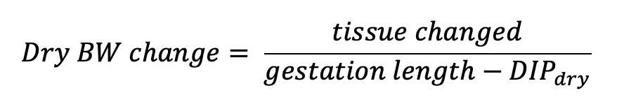
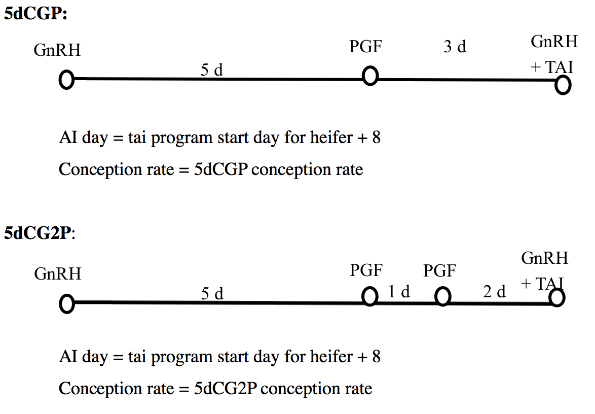
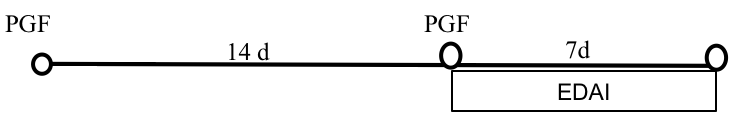
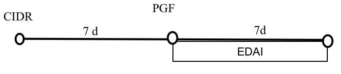
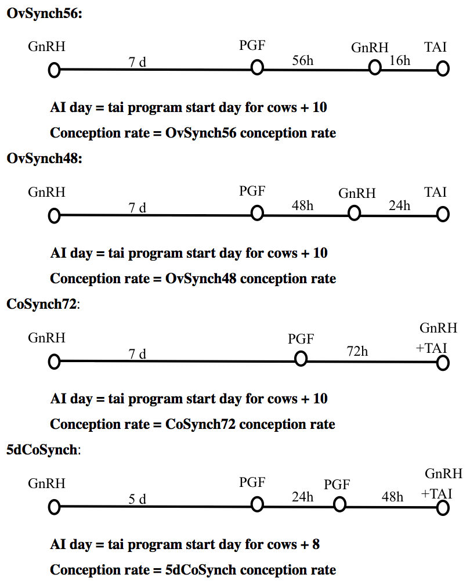
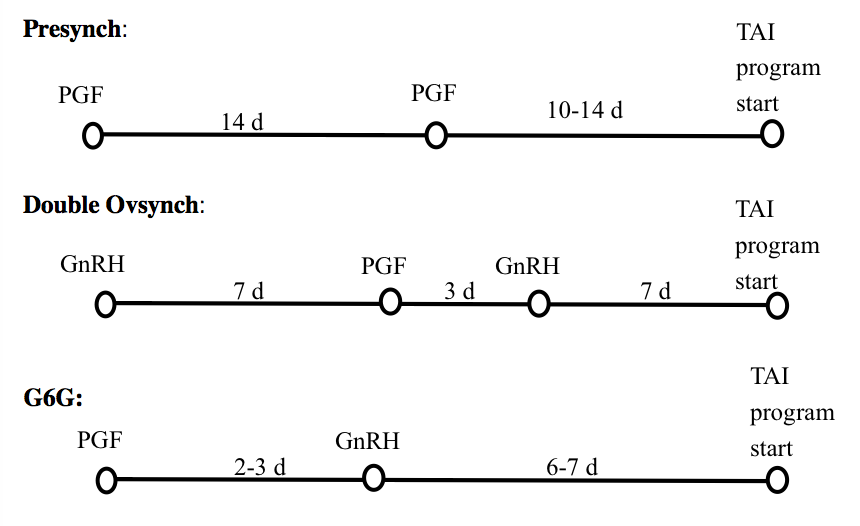
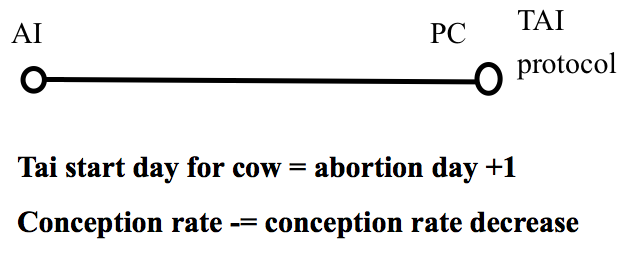
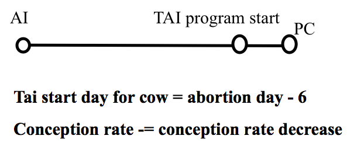
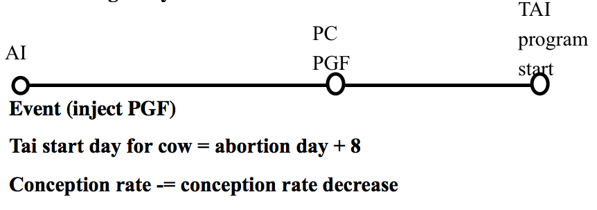
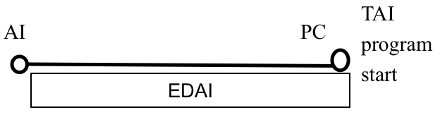
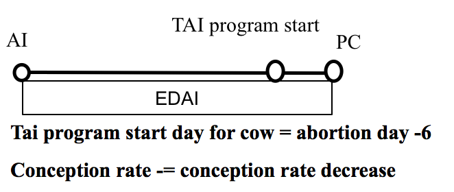
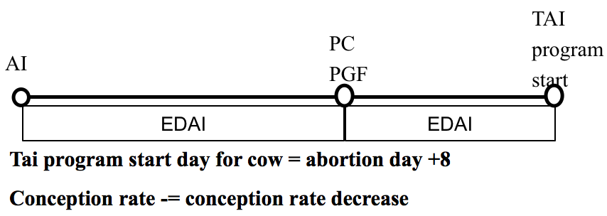