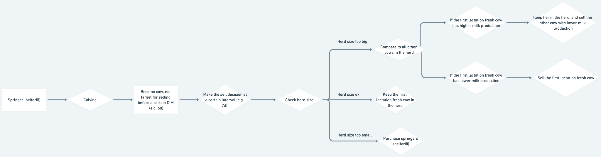

.. _Update-method-of-maintaining-herd-size :

Update method of maintaining herd size
======================================

**People**

   -  Subject expert: Kristan, Kaitlyn, Yijing

   -  Software developer: Loi

**Overview**

   -  This design doc aims to provide some guide to update the current
      method of maintaining herd size, specifically how we decide to
      sell heifers (or potentially cows). We aim to achieve a closer
      representation of how farmers do in reality.

**Context**

   -  Current method for maintaining herd size (written in
      life_cycle.py): On a daily basis, if the herd size is larger
      than a user-defined threshold, the program will sell springers
      (heiferIII); if the herd size is smaller than a user-defined
      threshold, the program will buy springers (heiferIII).

   -  Problem of the current method is that in reality, 1) farmers do
      not do purchase and sell on a daily basis 2) farmers are not
      necessarily willing to sell their springers, they can
      potentially sell some cows to make room for the springers.

**Requirements**

   -  the herd size must be maintained within a user-defined range
      through purchase/sell of springers and/or cows

   -  purchase/sell of springers and/or cows is done at a user-input
      interval (e.g. 7 days or 30 days)

   -  we have the ability to compare the performance (i.e. the total
      milk production of the current lactation) of springers
      (heiferIII) and cows to decide which ones to sell

   -  no side effects

**Milestones**

   -  We are able to buy/sell animals at a user-input interval (e.g. 7
      days or 30 days) - let’s call it sell day.

   -  We are able to keep the springers (heiferIII) in the herd for
      longer time (e.g. 60 days) after they calve. This time period
      is a user input and is in the units of days in milk

   -  We create a method for comparing animals based on a common
      performance metric

      -  We establish a method for calculating the first (MVP)
         performance metric

      -  First lactation fresh cows (i.e. the cows that have recently
         calved and also in their first lactation, which are the
         animals that we keep in the herd in the Milestone point 2)
         have a judgment day. This is their day of reckoning when
         they are compared to all other cows through their common
         performance attribute and we decide if they are good enough
         to stay in our herd (can you imagine if you had to
         outperform your peers or risk losing your job to the next
         generation??).

   -  On days designated for buying or selling, we can purchase animals
      from the market or sell underperforming animals (via the
      comparison method mentioned earlier) to maintain the herd size
      within the desired range.

**Existing Solution**

   -  Mentioned above as current method

**Proposed Solution**
      | |image1|

Text explanation:

  1. When springers (heiferIII) calve, we will keep them in the herd.

  2. When 1st lactation cows reach the day of reckoning, they are compared
     with their peers through a common performance metric

  3. At a sell/purchase day, we will make the decisions of selling or
     buying the animals.

   a. If the herd size is too small, we will buy animals from the market
      until our herd size is within our desired range.

   b. If the herd size is within our desired range, we are happy and do
      nothing

   c. If the herd size is too large, we will sell animals from our herd
      until our herd size is within our desired range. In this case,
      we will need to decide which animals to sell.

      i.  Candidate animals to sell: cows in parity 1 and have days in
          milk (DIM) >= 60, and cows in higher parities

      ii. We will sell the animal with the lowest performance metric of
          their current lactation until our herd size is within our
          desired range.

**Alternative Solutions**

   -  There are a variety of different performance metrics that can be
      used. One example would be to compare animals based on their
      genetic net merit and sell animals with lower genetic net
      merit, but this has not been deployed in our model.

   -  We could make the decision to sell heiferIIIs before they calve (this is 
      the current method) but this would be less representative of what happens on farms

   -  We could choose to always keep the younger animals and sell animals based on their age alone.

**Testability, Monitoring, and Alerting**

   -  Test whether the herd size is within the range that the user
      defined when we need to sell animals. Because now we only sell
      on sell days, there might be days between sell days when the
      herd size is larger than the upper limit. Only need to check
      whether the herd size is controlled on sell days.

   -  Test whether the herd size is within the range that user defined
      when we need to buy animals. Animals bought are springers
      (heiferIII).

   -  Test whether the performance attribute (i.e. the total milk
      production of the current lactation) is assigned correctly.

      -  MVP performance metric is their 305 day milk production
         according to their lactation curve parameters.

   -  Test the performance attribute ranking.

   -  Test the selling decision process - does the animal that is sold
      have a lower performance attribute (i.e. have lower milk
      production).

   -  Test overall herd demographic outcomes. Does the selling and
      buying interfere with the current culling method for cows? (in
      cow.py, cows can be culled because of some empirical
      distributions for 7 reasons).

**Cross-Team Impact**

   -  This update should not have impact on other modules

**Open Questions**

**Detailed Scoping and Timeline**

   -  1-2 weeks of developing

   -  1-2 weeks of testing

   -  Loi: Review the design doc and ask questions about requirements by
      Apr. 4

   -  Loi: Start coding and make first PR by Apr. 18

