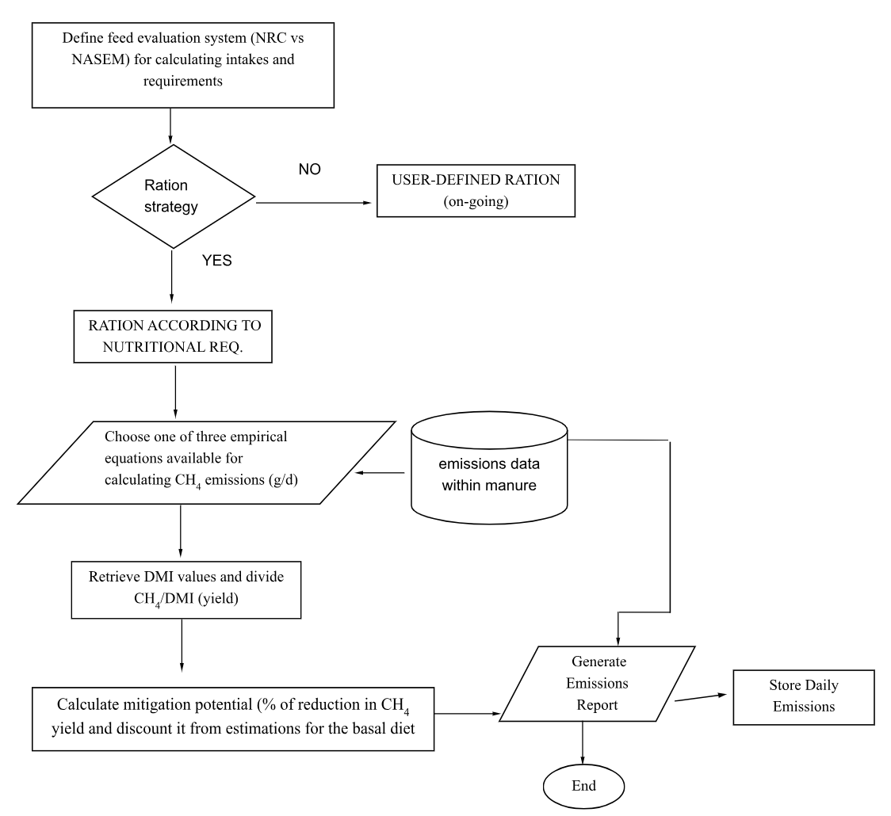

.. _3NOP_design :

Enteric Methane Mitigation: 3-Nitrooxypropanol
==============================================

Date created: May 4, 2023

Last updated: June 15, 2023

**People**
----------

-  Subject experts: Edward, Joseph, Haowen, Kristan

-  Software developer: Loi

**Overview**
------------

This design doc aims to implement an empirical equation recently
developed by Kebreab et al. (2023) for predicting the mitigation
potential of 3-nitrooxypropanol (3-NOP) on methane yield
(CH\ :sub:`4`/DMI) emissions within the programming context of RuFaS.
Despite that the original equation was developed from lactating cows,
the advantage of selecting this metric is that CH\ :sub:`4` emissions
are already scaled on DMI basis with this allowing a fairer comparison
among animal different animal groups such as growing animals (calves and
heifers), dry and lactating cows. However, in the near future, caution
should be exercised for adjusting a “recommended dose” of this FA for
non-lactating animal categories as their DMI is lower than for the
lactating cows.

**Context**
-----------

Different strategies have been proposed to mitigate the CH\ :sub:`4`
emissions from ruminants and thus reducing their impact on climate
change. Although both dry matter intake (DMI) and diet composition are
the main factors driving emissions, the use of 3-NOP as a feed additive
(FA), have gained attention in recent years due to their efficacy
reducing enteric CH\ :sub:`4` formation without significative
deleterious effects on animal performance, when added to the diet at the
recommended dose. Despite the scientific evidence recommending its use,
this FA is still not allowed to be used in the United States for
practical dairy diets’ formulation since it is pending approval from the
U.S. Food and Drug Administration (FDA). This design doc is the first of
several mitigation supplements that will be represented within RuFaS
(e.g., monensin, essential oils, algae).

In the context of evaluating the enteric CH\ :sub:`4` mitigation
potential of feed additives within the RuFaS model, a method for
accounting the mitigation potential of 3-NOP, as the % of reduction in
enteric CH\ :sub:`4` emissions will be beneficial for modeling carbon
footprint reduction in dairy operations when this strategy is corrected
implemented with this allowing beforehand estimating the impacts prior
implementation in farms. In addition to 3-NOP dose (mg/kg DM diet),
empirical equations include key nutritional composition parameters
driving CH\ :sub:`4` emissions as mentioned below.

**The successful implementation of 3-NOP as an enteric CH\ 4 mitigation within RuFaS may allow:** 

a. Evaluating diets that may favor decreased CH\ :sub:`4` production
   while maintaining an adequate performance according to nutritional
   requirements (NRC vs NASEM).

b. Improve our understanding of the relationships between variables
   driving CH\ :sub:`4` emissions especially across animal inventories
   (pens) towards reducing carbon footprint of the dairy operation.

c. In the future, calculate the monetary cost of the addition of 3-NOP
   to the diet in a long-term perspective (animal cycles).

**Definitions**
---------------

**Methane metrics.** For accounting the mitigation potential of enteric
CH\ :sub:`4` emissions at an individual animal level (per cow), the
following metrics are considered:

a. Methane yield: It is the arithmetic ratio between daily CH\ :sub:`4`
   production (g/day; output) related to the DMI (kg/day; input):
   CH\ :sub:`4`/DMI, g/kg).

Additional metrics such as total CH\ :sub:`4` emissions (g/d) or
CH\ :sub:`4` intensity (g per kg of energy corrected milk), might be
considered as optional.

**Definition of variables.** For accounting the mitigation potential of
enteric CH\ :sub:`4` emissions at an individual animal level (per cow),
the following metrics are considered:

b. Estimation of total CH\ :sub:`4` emissions: From empirical equations
   built from animal and diet-related factors which are set within the
   RuFaS platform. Selected models were thought to be representative of
   US dairy feeding conditions. At present, there are three equations
   for this: IPCC-Tier 2 (2007), Mills et al. (2003), and Niu et al.
   (2018).

c. Arithmetic ratios for accounting emissions as described in the
   previous section.

d. Dry matter intake: estimated using either equations by NRC (2001) or
   NASEM (2021) feeding systems as specified by the user.

**Requirements**
----------------

   a. Predicted CH\ :sub:`4` emissions are linked to estimation of dry
      matter intake (DMI). Therefore, estimations may differ depending
      on the feeding system chosen by the user (NRC vs NASEM).

   b. Total CH\ :sub:`4` emissions (g/d) are calculated according to
      empirical equations mentioned in definition 4b. The RuFaS user
      defines which of the available equations wants to set for
      calculations.

   c. Set the dietary dose of 3-NOP (mg per kg of DMI) to be added to
      the diet. This should be within the range specified in Table 1.

   d. Retrieve nutrient composition of the diet for calculating
      CH\ :sub:`4` yield mitigation potential according to equation 1.
      Specifically: neutral detergent fiber, ether extract and starch
      (as a % on a DM basis) Diet composition may change within each pen
      upon feeding interval set (i.e., every 30 days).

   e. Calculate total CH\ :sub:`4` emissions (g/d) **without 3-NOP
      supplementation** and then divide it by DMI for obtaining
      CH\ :sub:`4` yield values.

   f. Calculate mitigation potential of 3-NOP for decreasing
      CH\ :sub:`4` yield (% of reduction in CH\ :sub:`4` yield related
      to the basal diet) using Eq. 1 listed in this design document.

   g. Subtract the obtained value (% of reduction) from the initial
      estimated CH\ :sub:`4` yield emission for accounting the reduction
      at an individual animal level in terms of g of methane per kg of
      DMI and then replicate this calculation for all animals within
      each pen on a daily basis.

   h. Calculate total CH\ :sub:`4` emissions (g/d) **with 3-NOP
      supplementation** by multiplying the adjusted yield by DMI.

**Milestones**
--------------

   a. We are able to calculate mitigation potential for CH\ :sub:`4`
      yield of 3-NOP at a given dose in the diet at an individual animal
      level.

   b. By summing the calculated mitigation potential (% of reduction)
      from the estimated emissions obtained from the basal diet (no
      supplementation) for each individual, we are able to estimate both
      CH\ :sub:`4` emissions and reduction of carbon footprint at an
      animal group level (pen, herd, etc.).

   c. We are able to calculate the effectiveness of 3-NOP as an enteric
      CH\ :sub:`4` yield mitigation strategy for each animal group
      (e.g., calves, heifers, lactating cows) with this allowing
      adjusting diet composition if needed.

   d. With the proposed empirical equation for CH\ :sub:`4` yield, we
      are able to account for the effects of changes in both DMI and
      diet composition (specifically: NDF, Starch, and EE) thus
      obtaining realistic predictions at a given dose of 3-NOP in the
      diet.

**Existing solution**
---------------------

There is no solution already implemented for this issue in the current
version of RuFaS.

**Proposed solution**
---------------------

Kebreab et al. (2023) have recently built three empirical equations for
accounting the mitigation potential (% of reduction) of 3-NOP for
reducing CH\ :sub:`4` yield emissions CH\ :sub:`4`/DMI; g/kg).

 :math:`Change\ in\ {CH}_{4}\ yield\ (\%) = - 30.8 - 0.226 \times (3NOP - 70.5)` 
     
       | :math:`+ 0.906 \times (NDF - 32.9) + 3.871 \times (EE - 4.2) - 0.337`  
      
       | :math:`\times\ Starch - 21.1`     

   Eq. 1

Where, 3NOP = 3-nitroxypropanol dose (mg/kg of DM), and NDF, EE, and
Starch, refer to variables of feed composition of the diet (all of them
as a % of DM), specifically: NDF = neutral detergent fiber; EE = ether
extract; Starch = starch.

According to the original publication (Kebreab et al., 2023), data from
14 experiments conducted with lactating cows were collected to build the
empirical equations (48 treatment means). Caution should be exercised
when aiming to estimate the CH\ :sub:`4` mitigation potential of 3-NOP
either for growing animals (calves and heifers) or dry cows when using
these empirical equations for these animal categories. A preliminary
flow chart is presented for implementing 3-NOP as mitigation strategy
for reducing CH\ :sub:`4` yield in Figure 1.

**Table 1.** Limits to applying the proposed solution (Kebreab et al.
2023).

+------------------+-----------+-------+-------+-----------+---------+
| Variable         | units     | Mean  | SD    | Minimum   | Maximum |
+==================+===========+=======+=======+===========+=========+
| DMI              | kg/d      | 22.8  | 2.9   | 18.2      | 28.0    |
+------------------+-----------+-------+-------+-----------+---------+
| NDF              | % of DM   | 32.9  | 3.8   | 26.5      | 43.5    |
+------------------+-----------+-------+-------+-----------+---------+
| Starch           | % of DM   | 21.1  | 4.8   | 9.8       | 30.5    |
+------------------+-----------+-------+-------+-----------+---------+
| EE               | % of DM   | 4.2   | 1.0   | 2.8       | 5.8     |
+------------------+-----------+-------+-------+-----------+---------+
| 3-NOP daily dose | mg/kg DM  | 70.5  | 25.9  | 37.0      | 137     |
+------------------+-----------+-------+-------+-----------+---------+

DMI= dry matter intake; NDF= neutral detergent fiber; Starch, EE= ether
extract in % of DM of the diet. The 3-NOP dose is in g/kg of diet DM per
individual animal.

Suggested levels of monensin in diets when using the proposed equation for CH4 yield.
-------------------------------------------------------------------------------------

A range between **40 to 100 mg/kg DMI** is recommended to be used for
typical dairy cattle rations.

Two hypothetical test cases (examples) are presented as a test case for
calculating CH\ :sub:`4` yield mitigation potential at an individual
animal level:

Example 1.
----------

Animal group = dry cows

Average daily DMI per cow consuming a diet (70:50 ratio on a DM basis) =
12 kg

\*Diet composition of the diet containing corn silage and legume hay as
the forage components of the diet yields: *45.4 % NDF, 11.1 % starch,
and 4.00% ether extract*.

Total CH\ :sub:`4` WITHOUT 3-NOP addition as estimated by Niu et al.
(2018) = 250 g/d

CH\ :sub:`4` yield WITHOUT 3-NOP addition, g/kg DMI = 20.8

3-NOP dose = 70 mg/kg DMI

By applying Eq. 1, we get: *-16.8 % reduction in CH\ 4 yield emissions.*

:math:`CH4\ yield\ red.\ (\%) = - 30.8 - 0.226 \times (70 - 70.5) + 0.906`\

   | :math:`\times (45.4\ \%\ NDF - 32.9) + 3.871 \times (4.00\ \%\ EE - 4.2) - 0.337`
   
   | :math:`\times (11.1\ \%\ Starch - 21.1) =  -16.8%`

Then, 20.8 – (20.8 × 16.8%) = 3.49 → 17.3 g/kg (CH\ :sub:`4` yield
emission WITH 3-NOP added to the diet).

And to obtain the mitigation potential for total CH\ :sub:`4` emissions
= >

   17.3 g/kg × 12 kg = **208 g/d** - Total CH\ :sub:`4` emissions WITH
   3-NOP added to the diet.

Example 2.
----------

Animal group = lactating cows

Average daily DMI per cow consuming a diet (50:50 ratio on a DM basis) =
24 kg

\*Diet composition of the diet containing corn silage, alfalfa and grass
as the forage components of the diet yields: *36.7 % NDF, 19.7 % starch,
and 4.49% ether extract*.

Total CH\ :sub:`4` WITHOUT 3-NOP addition as estimated by Niu et al.
(2018) = 400 g/d

CH\ :sub:`4` yield WITHOUT -NOP addition, g/kg DMI = 16.7

3-NOP dose = 70 mg/kg DMI

By applying Eq. 1, we get: *-25.6% reduction in CH\ 4 yield emissions.*

:math:`CH4\ yield\ red.\ (\%) = - 30.8 - 0.226 \times (70 - 70.5) + 0.906`

   | :math:`\times (36.7\ \%\ NDF - 32.9) + 3.871 \times (4.49\ \%\ EE - 4.2) - 0.337`
   
   | :math:`\times (19.7\ \%\ Starch - 21.1) = -25.6%`                            

Then, 16.7 - (16.7 × 25.6%) = 4.28 → 12.4 g/kg (CH\ :sub:`4` yield
emission WITH 3-NOP added to the diet).

And to obtain the mitigation potential for total CH\ :sub:`4` emissions
= >

12.4 g/kg × 24 kg = **298 g/d** - Total CH\ :sub:`4` emissions WITH
3-NOP added to the diet.

**Alternative solutions**
-------------------------

   a.  **Use other metrics for accounting the CH\ :sub:`4` mitigation potential of 3-NOP**:
       In the same article by Kebreab et al. (2023), two additional empirical
       equations are available for calculating mitigation potential (% of
       reduction) in terms of total CH\ :sub:`4` emissions (g/d) and
       CH\ :sub:`4` intensity (g per kg of milk produced). The metric for
       CH\ :sub:`4` intensity for carbon footprint estimations is only
       applicable for lactating cows.

:math:`Change\ in\ Total\ {CH}_{4}\ production\ (\%) = \  - 32.4 - 0.282 \times (3NOP - 70.5)`
 
   | :math:`+ 0.915 \times (NDF - 32.9) + 3.080 \times (EE - 4.2)`                                                   

   Eq. 2

:math:`Change\ in\ {CH}_{4}\ intensity\ (\%) = \  - 33.0 - 0.275 \times (3NOP - 70.5) + 0.723 \times (NDF - 32.9)`

   Eq. 3

       Where, 3NOP = 3-nitrooxypropanol dose (mg/kg of DM), and NDF, EE, refer
       to variables of feed composition of the diet (all of them as a % of DM),
       specifically: NDF = neutral detergent fiber; EE = ether extract.

   b.  **Assume fixed values for accounting enteric CH\ 4 mitigation potential of 3-NOP:**
       The user might consider using fixed values instead. This solution
       retrieves values from literature reviews and meta-analysis from
       peer-review papers. In the meta-analysis by Melgar et al. (2021), the
       addition of 3-NOP to the diet (60 mg/kg DMI) decreased daily enteric
       methane emission by 24% and both methane yield and intensity by 25%
       without affecting dry matter intake and milk yield and increased milk
       fat concentration in lactating dairy cows. Conversely, expected
       reductions in CH\ :sub:`4` emissions based on results shown by van
       Gastelen et al. (2022) for lactating cows fed three contrasting diets in
       terms of forage composition (on average 70% of the total diet on a DM
       basis): 1. Corn silage based, 2. Grass-silage based and 3. Combinations
       of 1 and 2, are presented in Table 2.

       **Table 2.** Estimated enteric CH\ :sub:`4` mitigation effect in
       lactating cows fed silage-based diets at two given doses of 3-NOP
       supplementation in the diet. Source: van Gastelen et al. (2022)

+---------------------------------+-------------+---------------------+
|                                 |             |                     |
+=================================+=============+=====================+
| CH\ :sub:`4` Metric             | 3-NOP dose, |                     |
|                                 | mg/kg DMI   |                     |
+---------------------------------+-------------+---------------------+
|                                 | 60          | 80                  |
+---------------------------------+-------------+---------------------+
| Total CH\ :sub:`4`, g/d\*       | 35.1%       | 40.0%               |
+---------------------------------+-------------+---------------------+
| CH\ :sub:`4` yield, g/kg DMI    | 32.8%       | 36.0%               |
+---------------------------------+-------------+---------------------+
| CH\ :sub:`4` yield, g/kg ECM    | 33.3%       | 36.7%               |
+---------------------------------+-------------+---------------------+

\*\ *In vivo* CH\ :sub:`4` emissions were measured with the GreenFeed
method (C-Lock Incorporated, SD)

   b.  **A novel on-going method for estimating in vivo CH\ 4 emissions from daily feed intake and rumen fermentation pattern:**
       From treatments means data taken from peer-review articles, we developed
       a procedure to estimate *in vivo* enteric CH\ :sub:`4` emissions from
       volatile fatty acids (VFA) fermentation as well as diet and
       animal-related factors. Initial tests performed with a literature
       dataset testing monensin as a feed additive, indicates that even though
       this approach slightly underpredicted total CH\ :sub:`4` emissions in
       dairy and beef cattle, when the mitigation potential (% of reduction in
       emissions) is compared against observed *in vivo* values (measured),
       values were similar. The last gave us confidence for expanding further
       our approach to a larger VFA and animal-factors dataset, also including
       studies not reporting in vivo methane emissions (e.g., respiration
       chambers, SF\ :sub:`6` gas-tracer technique, GreenFeed, etc.).
       
       At the end, similar to the approach by Kebreab et al. (2023) the final
       aim is to produce empirical equations built from nutritional composition
       of the diet as that information is available within the RuFaS model. In
       the case of 3-NOP, as much as literature data is available, we could
       replicate replicated our approach undertaken for monensin and thus
       obtaining specific mitigation equations customized for both growing
       animals (Heifer I, II, III) and dry cows and thus fine-tuning
       carbon-footprint estimates at a large scale within RuFaS.

| |image1|
**Figure 1.** Proposed flowchart for implementing 3-NOP as CH\ :sub:`4`
mitigation strategy within the RuFaS model.

**Testability, Monitoring, and Alerting**
-----------------------------------------

    a. Methane mitigation equations listed above should work for
       lactating cow data within the limits set in Table 1.

    b. Upper limit: According to literature review, it is recommended
       not to exceed a maximum dose of 100 mg/kg as it may have a
       significant effect on DMI and consequently on animal performance.

    c. Lower limit: Addition of 3-NOP to the diet below 40 g/kg DMI may
       compromise enteric CH\ :sub:`4` mitigation targets.

**Cross-Team Impact**
---------------------

    a. As presented in this design doc, it is expected that the proposed
       solution should not impact on the other modules within RuFaS.
       This proposal is considered as a further development within both
       animal and feed formulation modules.

**Open Questions**
------------------

**Detailed Scoping and Timeline**
---------------------------------

    a. 4-6 weeks of developing

    b. 1-2 weeks of testing

**References**
--------------

Kebreab E., Bannink A., Pressman E. M., Walker N., Karagiannis A., van
   Gastelen S., Dijkstra J. 2023. A meta-analysis of effects of
   3-nitrooxypropanol on methane production, yield, and intensity in dairy
   cattle. J. Dairy Sci.106:927–936. https://doi.org/10.3168/jds.2022-22211

Melgar, A., Lage, C. F. A., Nedelkov, K., Räisänen, S. E., Stefenoni,
   H., Fetter, M. E., Chen, X., Oh, J., Duval, S., Kindermann, M., Walker,
   N. D., Hristov, A. N. 2021. Enteric methane emission, milk production,
   and composition of dairy cows fed 3-nitrooxypropanol. J. Dairy Sci.
   104:357–366. https://doi.org/10.3168/jds.2020-18908

NASEM (National Academies of Sciences, Engineering, and Medicine). 2021.
   Nutrient Requirements of Dairy Cattle. 8th rev. ed. The National
   Academies Press. https://doi.org/10.17226/25806.

NRC (National Research Council). 2001. Nutrient Requirements of Dairy
   Cattle. 7th rev. ed. Natl. Acad. Sci., Washington, DC.

van Gastelen, S., Dijkstra, J., Heck, J. M. L., Kindermann, M., Klop,
   A., de Mol, R., Rijnders, D., Walker, N., Bannink, A. 2022. Methane
   mitigation potential of 3-nitrooxypropanol in lactating cows is
   influenced by basal diet composition. J. Dairy Sci. 105:4064–4082.
   https://doi.org/10.3168/jds.2021-20782

   