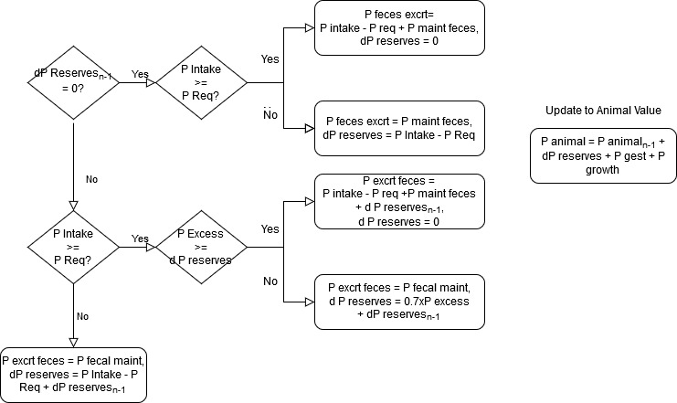

Phosphorus tracking
===================

**Integrated phosphorus balance equations in animal module:**
Description of equations to track phosphorus within the animal module.

Implemented in pen.py; animal_base.py; general_manure.py

Animal calculations implemented in calf.py; heiferI.py; heiferII.py;
heiferIII.py; cow.py

**Flow of Information:**

A. Calculate the amount of phosphorus in an animal’s diet

B. Calculate the amount of phosphorus used by the animal

   -  Net retained P is small. Gestating cows and growing heifers will
      retain more P.

C. Calculate the amount of phosphorus excreted by the animal

   -  Phosphorus is excreted primarily in feces and milk. A small amount
      of P is excreted in urine.

   -  Fecal P is equivalent to the difference between P intake and P
      retained and P excreted in milk and urine.

D. Animal phosphorus balance is calculated based on requirements and
   dietary intake. The animal can pull P from body reserves if dietary
   intake is adequate.

Arguments

i.   Feed library

     i. Nutrient composition of feeds

ii.  Dry matter intake of each ingredient (kg; from ration formulation)

iii. Mature body weight (kg; from animal life cycle)

iv.  Body weight (kg; from animal life cycle)

v.   Weight gain (kg, from animal life cycle)

Outputs

i.    P intake (g)

ii.   P concentration of diet (%)

iii.  Animal P requirements (g)

      i.   Maintenance

      ii.  Growth

      iii. Gestation

      iv.  Lactation

iv.   P excreted by the animal (g)

      i.   Milk

      ii.  Urine

      iii. Feces

v.    Manure P fractions

      i.   P fraction

      ii.  Water extractable inorganic P (unit less)

      iii. Water extractable organic P (unit less)

vi.   Initial animal P amount (g)

vii.  Change in animal P reserves (g)

viii. Animal P amount (g)

A. **Daily phosphorus intake from ration**

..

   Calculates the amount of phosphorus provided by the diet at the
   specified intake from the ration formulation routine. The amount of
   phosphorus from each feed in the ration is summed to determine a
   total P intake (g P/d per animal). TODO: These calculations could be
   placed in a ration subfolder.

1. Phosphorus intake from feed

..

   Calculates the amount of P (g) provided by a feed used in the ration.

+--------------------------------+----------------------------+-----------+
| :math:`P\_ feed_{i}\_ intake =`| :math:`P\_ feed_{i}\_ conc | [A.4.A.1] |
|                                | \ 100 * dmi\_ feed_{i} *   |           |
|                                | 1000 g/kg`                 |           |
+--------------------------------+----------------------------+-----------+

..

   P feed\ :sub:`i` intake = amount of P from feed at specified dry
   matter intake (g)

   P feed\ :sub:`i` conc = concentration of P in the feed (% dry matter)

   dmi feed\ :sub:`i` = dry matter intake of the feed (kg)

2. Phosphorus intake from ration

..

   Summation of P amounts provided from specific feeds to calculate the
   total amount of P provided in the ration (g P/d per animal).

+----------------------------------------------------+-----------+
| :math:`P\_ intake = \sum_{i} P\_ feed_{i}\_ intake`| [A.4.A.2] |
+----------------------------------------------------+-----------+

..

   P intake = amount of P in the formulated ration (g)

   P feed\ :sub:`i` intake = amount of P from feed at specified dry
   matter intake (g)

3. Phosphorus concentration ration

..

   Summation of P amounts provided from specific feeds to calculate the
   total amount of P provided in the ration (g P/d per animal).

+-------------------------------------------------------------------------+-----------+
| :math:`P\_ conc = \frac{P\_ intake}{DMI} * \frac{1 kg}{1000 g} * 100\%` | [A.4.A.3] |
+-------------------------------------------------------------------------+-----------+

..

   P conc = concentration of P in the formulated ration (%)

   P intake = amount of P in the formulated ration (g)

   DMI = dry matter intake from the ration (kg)

B. **Phosphorus requirements for the animal**

..

   Equations to calculate the amount of P required by the animal each
   day based on P requirements for maintenance, gestation, and growth (g
   P/d per animal). Equations are calculated in the animal life cycle
   files.

1. P for maintenance

..

   Amount of P required for maintenance (g/d).

   Fecal maintenance P requirement depends on animal class.

+----------------------------+-------------------------------------------+-------------+
| :math:`P\_ maint\_ feces =`| :math:`0.0008 * dm\_ intake * 1000 g/kg\ `|[A.1A-D.E.1] |
|                            | :math:`if\ class\ \neq cow`               |             |
+----------------------------+-------------------------------------------+-------------+
|                            | :math:`0.001 * dm\_intake * 1000\ g/kg\ ` |[A..1E-F.E.1]|
|                            | :math:`if\ class\ =\ cow`                 |             |                             
+----------------------------+-------------------------------------------+-------------+

..

   P maint feces = amount of P required for endogenous losses (g)

   dm intake = dry matter intake (kg)

   Maintenance P requirement for urine excretion (g/d).

+----------------------------------------------+--------------+
| :math:`P\_ urine = 0.000002 * bw * 1000 g/kg`| [A.1A-F.E.2] |
+----------------------------------------------+--------------+

..

   P urine = amount of P required for urine production (g)

   bw = animal body weight (kg)

3. Phosphorus for growth

..

   Amount of P required by calves or heifers for growth (g/d).

+---------------------+--------------------------------------------------+---------------+
| :math:`P\_ growth = (0.0012 + 0.004635 * mature\_ weight^{0.22}*b      | [A.1A -F.E.3] |
| w^{-0.22})*(\frac{weight\_ gain}{0.96}* 1000 \frac{g}{kg})`            |               |
+---------------------+--------------------------------------------------+---------------+

..

   P growth = absorbed P retained for growth (g)

   mature weight = estimated mature of the animal (kg)

   body weight = current body weight of the animal (kg)

   weight gain = weight gain (kg/d)

4. Phosphorus for gestation

..

   Amount of P required by the heifer or cow for growth of a fetus
   (g/d).

+--------------------+--------------------------------------+--------------+
| :math:`P\_ gest =` | :math:`(0.00002743 * e^{(( 0.05527   | [A.1C-F.E.4] |
|                    | - 0.000075 * gest\_ day) * gest\_ da |              |
|                    | y)} - 0.00002743 * e^{(( 0.05527 - 0 |              |
|                    | .000075 * (gest\_ day - 1)) * (gest\ |              |
|                    | _ day - 1))}) * 1000 \frac{g}{kg}\ if|              |
|                    | \ gestation\ day\ \geq 190\ days`    |              |
+--------------------+--------------------------------------+--------------+

..

   P gest = absorbed P retained for fetal growth (g)

   gest day = day of gestation (d)

5. Milk phosphorus

..

   Calculation of the daily amount of P in milk from a cow (g/d).

+------------------------------------------------------------+------------+
| :math:`P\_ milk = 0.0009 * milk\_ prod * 1000 \frac{g}{kg}`| [A.1E.E.5] |
+------------------------------------------------------------+------------+

..

   P milk = amount of P in milk per animal (g/d)

   milk prod = daily milk production of the cow (kg)

6. Phosphorus Requirement

..

   Absorbed P Requirement

   The absorbed P requirement is the sum of P requirements (g/d).

+----------------------------------------------------------------+------------+
| :math:`P\_ absorb = P\_ urine + P\_ maint\_ feces + P\_ growth |[A.1A-F.E.6]|
| + P\_ gest + P\_ milk`                                         |            |
+----------------------------------------------------------------+------------+

   P absorb = absorbed P required by the animal (g)

   P urine = amount of P required for urine production (g)

   P maint feces = amount of P required for endogenous losses (g)

   P growth = absorbed P retained for growth (g)

   P gest = absorbed P retained for fetal growth (g)

   P milk = amount of P in milk per animal (g/d)

   The absorbed P requirement is divided by a coefficient for
   digestibility to determine the amount of P needed in the ration.
   Digestibility coefficients vary for each animal class. For heifers
   and dry cows, we assumed the ration was 60% forage (64% absorption
   coefficient) and 40% concentrate (70% absorption coefficient). The
   absorption coefficient for lactating cows is calculated from a
   regression equation of 20 studies (r\ :sup:`2` = 0.7) (NRC, 2001).

+------------------+---------------------------------------------------+--------------+
|:math:`P\_ req =` | :math:`\frac{P\_ absorb}{0.90}\ if\ class = calf` | [A.1A-F.E.7] |
+------------------+---------------------------------------------------+--------------+
|                  | :math:`\frac{P\_ absorb}{0.664}\ if\ class = heif |              |
|                  | er,\ dry\ cow`                                    |              |
+------------------+---------------------------------------------------+--------------+
|                  | :math:`\frac{P\_ absorb}{1.86696 - 5.01238 * P\_  |              |
|                  | conc + 5.12286 * P\_ conc^{2}}\ if\ class =       |              |
|                  | lactating\ cow`                                   |              |
+------------------+---------------------------------------------------+--------------+

..

   P req = Requirement of P from the ration (g)

   P absorb = absorbed P required by the animal (g)

   P conc = concentration of P in the formulated ration (%)

C. **Phosphorus excreted by the animal**

..

   Equations to calculate the daily amount P excreted in manure and milk
   from an animal (g P/d per animal).

1. Phosphorus excreted in manure

..

   Urinary and fecal P excreted by a cow (g/d).

   Phosphorus in urine

+--------------------------------------------------------------+-----------+
| :math:`P\_ urine = 0.000002 \times bw \times 1000\ g/kg\ `   | [A.1G.B.1]|
+--------------------------------------------------------------+-----------+

..

   P urine = amount of P excreted in the urine of an animal (g)

   bw = animal body weight (kg)

   Fecal phosphorus

   Excess dietary phosphorus is mainly excreted in feces. The minimum
   quantity of P excreted in feces is the maintenance requirement of
   fecal P.

   The quantity of P excreted in P is determined from decision related
   to dietary P intake and fecal P maintenance requirements (g/d per
   cow). The animal can draw from its body reserves if dietary P is
   adequate to meet requirements.

   If dietary P intake is greater than the animal requirements, then
   there is excess P in the diet.

+--------------------------------------------+------------+
| :math:`P\_ excess = P\_ intake - P\_ req`  | [A.1G.A.1] |
+--------------------------------------------+------------+

..

   P excess = excess P in the diet (g)

   P intake = amount of P in the formulated ration (g)

   P req = requirement of P from the ration (g)

   Different methods calculate fecal phosphorus excretion based on if
   the animal has used body reserves to meet P requirements and dietary
   P intake. Efficiency of P absorption for bone development is 0.7 (Wan
   Zahari et al., 1994).

+------------------------------------------------------------+----------+
| :math:`P\_ feces\_ excrt = \left\{ \begin{matrix}          |[A.1G.B.2]|
| P\_ intake - P\_ req + P\_ maint\_ feces\ if\ dP\_ reserve |          |
| s_{n - 1} = 0\  \\                                         |          |
| and\ P\_ intake\  \geq P\_ req \\                          |          |
| P\_ intake - P\_ req + P\_ maint\_ feces + \frac{dP\_ rese |          |
| rves_{n - 1}}{0.7}\ if\ dP\_ reserves_{n - 1} < 0, \\      |          |
| P\_ intake\  \geq P\_ req,\ and\ P\_ excess\  \geq \ \     |          |
| frac{- 1\ * dP\_ reserves_{n - 1}}{0.7} \\                 |          |
| P\_ maint\_ feces\ otherwise \\                            |          |
| \end{matrix} \right.\ `                                    |          |
+------------------------------------------------------------+----------+

..

   P feces excrt = amount of P excreted by an animal (g/d)

   P intake = amount of P in the formulated ration (g)

   P req = Requirement of P from the ration (g)

   P maint feces = amount of P required for endogenous losses (g)

   dP reserves\ :sub:`n-1` = change in body P reserves on the previous
   day (g)

   P req = total dietary requirement of P by the animal (g)

1. Phosphorus excreted in manure

..

   Phosphorus fractions of manure

   Fraction of total P that is water extractable inorganic/organic P.
   (Vadas et al., 2007)

   Total phosphorus fraction of feces.

+-------------------------------------------------------------------------------+-----------+
| :math:`P\_ frac = \frac{P\_ feces\_ excrt + P\_ urine}{total\_ manure * 1000}`| [A.3.A.1] | 
+-------------------------------------------------------------------------------+-----------+

..

   P frac = fraction of manure that is P

   P feces excrt = amount of P in the feces (g)

   P urine = amount of P excreted in urine

   total manure = amount of manure excreted by the animal (kg)

   Water extractable inorganic P.

+------------------------------------------------------+-----------+
| :math:`WIP\_ frac = 0.50 * \frac{P\_ feces\_ excrt + | [A.3.A.2] |
| P\_ urine}{total\_ manure * 1000}`                   |           |
+------------------------------------------------------+-----------+

..

   WIP frac = fraction of manure compromised of inorganic water
   extractable P

   P feces excrt = amount of P in the feces (g)

   P urine = amount of P excreted in urine (g)

   total manure = amount of manure excreted by the animal (kg)

   Water extractable organic P.

+--------------------------------------------------------------+---------+
| :math:`WOP\_ frac = 0.05 * \frac{P\_ feces\_ excrt + P\_ uri |[A.3.A.3]|
| ne} {total\_ manure * 1000}`                                 |         |
+--------------------------------------------------------------+---------+

..

   WOP frac = fraction of manure compromised of organic water
   extractable P

   P feces excrt = amount of P in the feces (g)

   P urine = amount of P excreted in urine (g)

   total manure = amount of manure excreted by the animal (kg)

2. Phosphorus excreted by the cow

..

   Milk phosphorus

   Calculation of the daily amount of P in milk from a cow (g/d) (NRC,
   2001).

+-------------------------------------------------------+------------+
| :math:`P\_ milk = 0.0009 * milk\_ prod * 1000\ g/kg`  | [A.3E.B.1] |
+-------------------------------------------------------+------------+

..

   P milk = amount of P in milk per animal (g/d)

   milk prod = daily milk production of the cow (kg)

   Phosphorus excreted in manure by the cow

   Manure P excreted by a cow (g/d).

+------------------------------------------------------------+----------+
| :math:`P\_ excrt\_ manure = P\_ feces\_ excrt + P\_ urine` | [A.3.B.2]|
+------------------------------------------------------------+----------+

..

   P excrt = amount of P excreted by an animal (g)

   P milk = amount of P excreted in the milk of an animal (g)

   P feces excrt = amount of P in the feces (g)

   P urine = amount of P excreted in urine (g)

   P excreted by a cow (g/d).

+------------------------------------------------------------+-----------+
|:math:`P\_ excrt = P\_ milk + P\_ feces\_ excrt + P\_ urine`| [A.3.B.3] |
+------------------------------------------------------------+-----------+

..

   P excrt = amount of P excreted by an animal (g)

   P milk = amount of P excreted in the milk of an animal (g)

   P feces excrt = amount of P in the feces (g)

   P urine = amount of P excreted in urine (g)

D. **Phosphorus in the animal**

..

   Tracking the P in the animal (g) from start of life (or purchase)
   through culling. The animal P amount is updated daily.

1. Daily update of P in the animal (g)

..

   If dietary P intake is greater than the animal requirements, then
   there is excess P in the diet.

+--------------------------------------------+------------+
| :math:`P\_ excess = P\_ intake - P\_ req`  | [A.1G.A.1] |
+--------------------------------------------+------------+

..

   P excess = excess P in the diet (g)

   P intake = amount of P in the formulated ration (g)

   P req = requirement of P from the ration (g)

   When dietary P intake is deficient, the animal can use P reserves
   from it’s body to meet requirements. The change in P reserves is
   calculated daily.

+--------------------------------------------------------+------------+
| :math:`dP\_ reserves = \left\{ \begin{matrix}          | [A.1G.A.2] |
| P\_ intake - P\_ req + dP\_ reserves_{n - 1}\ if\ P\_i |            |
| ntake < P\_ req \\ 0.7 * P\_ excess = dp\_ reserv      |            |
| es_{n - 1}\ if\ P\_ intake \geq P\_ req\ and\ dP\_ res |            |
| erves_{n - 1} < 0 \\  0 if\ P\_ intake \geq P\_ req\ an|            |
| d\ dP\_ reserves_{n - 1} = 0 \\ \end{matrix} \right.\ `|            |
+--------------------------------------------------------+------------+

..

   dP reserves = change in body P reserves (g), must be ≤ 0

   P intake = amount of P in the formulated ration (g)

   P req = requirement of P from the ration (g)

   dP reserves\ :sub:`n-1` = change in body P reserves on the previous
   day (g)

   P excess = excess P in the diet (g)

+-----------------------------------------------------+------------+
| :math:`P\_ animal = P\_ animal_{n - 1} + P\_ gest + | [A.1G.A.3] |
| P\_ growth + dP\_ reserves`                         |            |
+-----------------------------------------------------+------------+

..

   P animal = amount of P in animal (g)

   P animal\ :sub:`n-1` = amount of P in animal on the prior day (g)

   P growth = absorbed P retained for growth (g)

   P gest = absorbed P retained for fetal growth (g)

   dP reserves = change in body P reserves (g)

   At parturition, the sum of P absorbed for gestation requirements is
   subtracted from the animal value. The sum of P absorbed for gestation
   is equal to the initial animal P value for the calf.

+---------------------------------------------------+-----------+
| :math:`P\_ animal = P\_ animal_{n - 1} - \sum_{i} |[A.1G.A.4] |
| P\_ gest + P\_ growth + dP\_ reserves`            |           |
+---------------------------------------------------+-----------+

..

   P animal = amount of P in animal (g)

   P animal\ :sub:`n-1` = amount of P in animal on the prior day (g)

   P gest = absorbed P retained for fetal growth (g)

   P growth = absorbed P retained for growth (g)

   dP reserves = change in body P reserves (g)

2. Initial amount of P in animal (g).

..

   Based on the amount of P used for fetal growth or a value for
   purchased animals (Williams, 1978).

+----------------------------------------------------------+----------+
| :math:`P\_ animal\_ initial = \left\{ \begin{matrix}     |[A.1G.C.1]|
| \sum_{i} P_{gest_{i}}\ if\ calved\ during\ simulation \\ |          |
| 0.0072\ * bw\ * 1000\ g/kg\ if\ purchased \\             |          |
| \end{matrix} \right.\ `                                  |          |
+----------------------------------------------------------+----------+

..

   P animal initial = amount of P in the animal at the start of life
   cycle (g)

   P gest = absorbed P retained for fetal growth during *i* days of
   gestation (g)

   bw = animal body weight (kg)

**Figure**. Diagram of fecal P excretion and change in animal P
reserves.\ **
**

**References**

NRC. 2001. Nutrient Requirements of Dairy Cattle. National Academies,
Washington, D.C.

Vadas, P. A., W. J. Gburek, A. N. Sharpley, P. J. Kleinman, P. A. Moore,
Jr., M. L. Cabrera, and R. D. Harmel. 2007. A model for phosphorus
transformation and runoff loss for surface-applied manures. J Environ
Qual 36(1):324-332.

Wan Zahari, M., D. Scott, N. Loveridge, W. Buchan, and J. Milne. 1994.
The effect of high phosphorus intake on calcium and phosphorus retention
and bone turnover in growing lambs. Exp Physiol 79(2):175-181.

Williams, A. P. 1978. The amino acid, collagen and mineral composition
of preruminant calves. The Journal of Agricultural Science
90(3):617-624.
