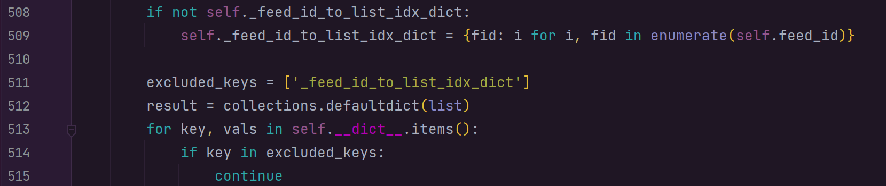

.. _ration_driver_logic :

Ration Driver Logic
===================

   | Last Updated: October 19, 2022

**Ration Driver**

**Overview**: This serves as the primary file in the entire animal
module’s ration formulation process. Other files within the ration
folder (such as the nonlinear programming file ‘ration_NLP.py’) interact
with this central file to formulate animal rations for the cows
simulated by the model. The ration driver also relies on the larger Feed
and Animal modules for certain passed-in values and variables.

**get_feed_data_from_feed_id() pseudocode/explanation**:

This pseudocode/explanation was added to remove blocky comments within
the function. A step-by-step explanation of the function’s logic is
given below, spaced into three divided sections with accompanying code
block screenshots. For reference, the text explaining the code snippet
will always be found beneath the accompanying screenshot.

The get_feed_data_from_feed_id() function returns the relevant subset of
feeds based on the given set of feed ids passed in as input to the
function. Below are three screenshots of the function body with
accompanying explanations:

Block 1:

The code seen above constructs a dictionary that keeps track of the list
index of each feed_id. Since attributes within the AvailableFeeds class
are mainly stored as lists, knowing the index of a feed_id allows for
the quick retrieval of the corresponding value of the attribute in
question. As an example, if we know that the feed_id #26 is stored at
index 1 in the self.feed_id list, we then also know that the price of
this feed_id is also stored at index 1 in the self.price list.

Block 2:

If the value of an attribute is an empty list, we will maintain it as an
empty list in the returned data.

Block 3:

For the specific attributes that are lists of numbers (e.g., CP, DE, EE,
etc.), we only want to select the numbers at the same indices as given
feed ids. We will do this by getting the list index of the feed_id in
self.feed_id list.
