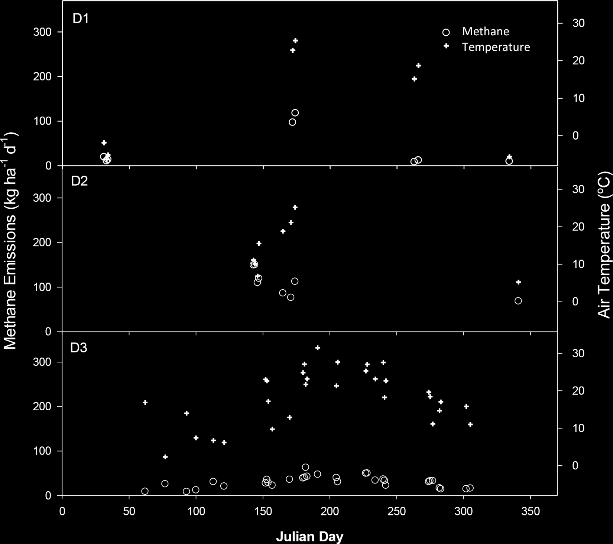
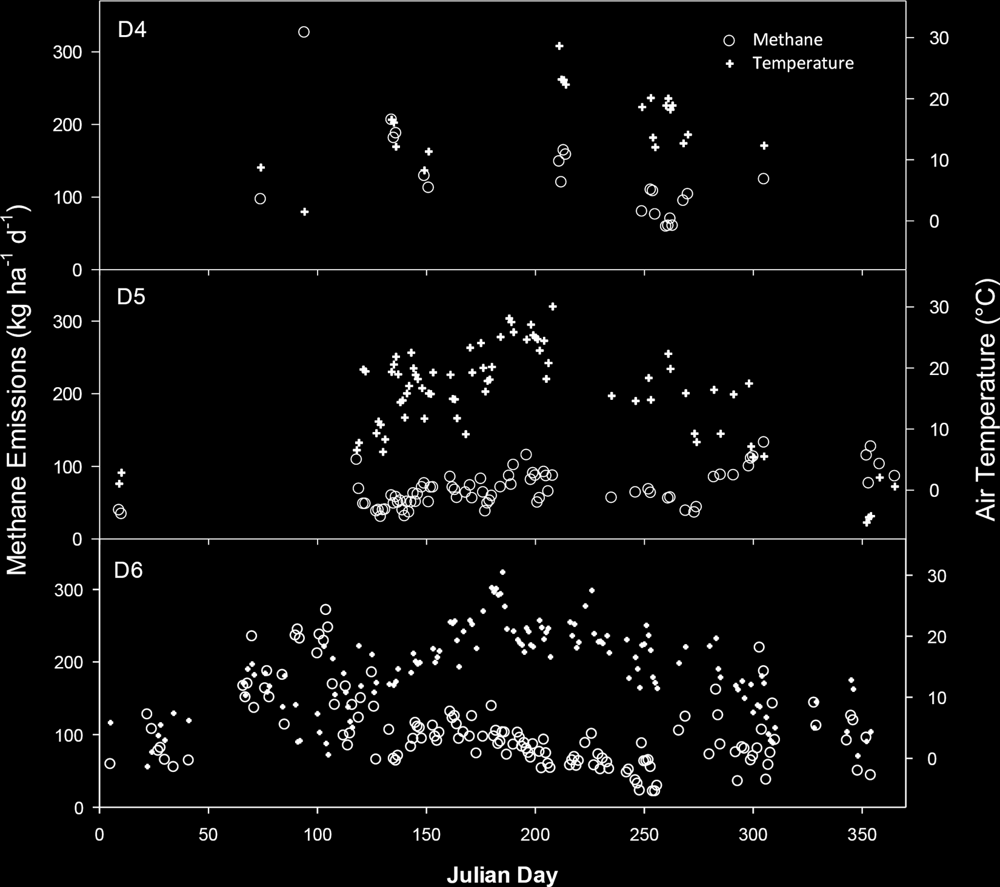
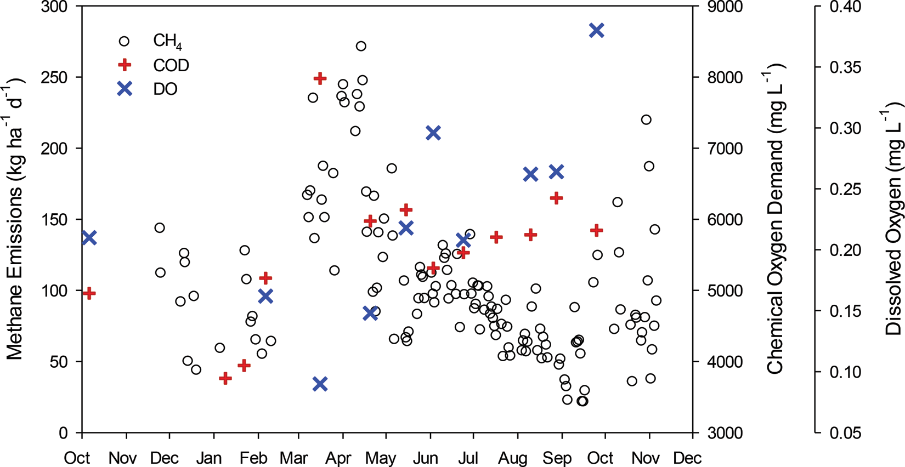
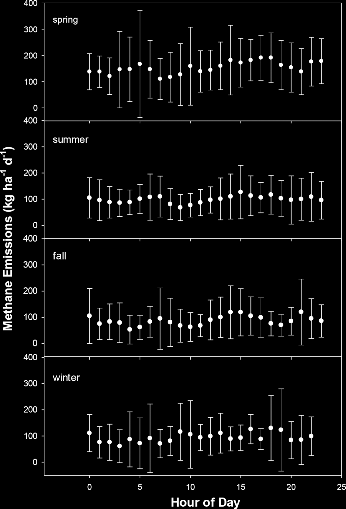
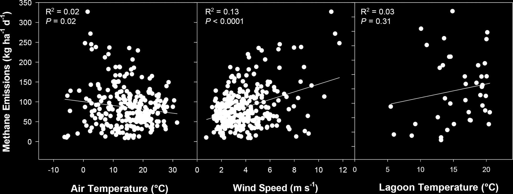
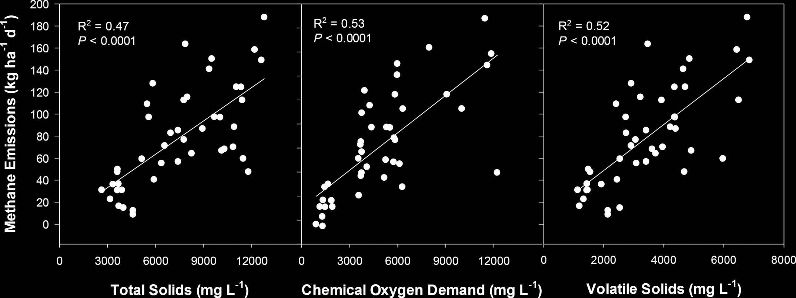
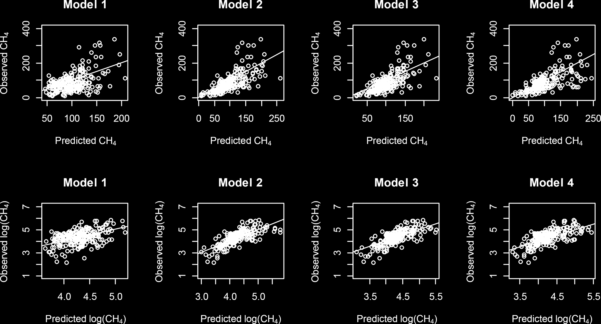
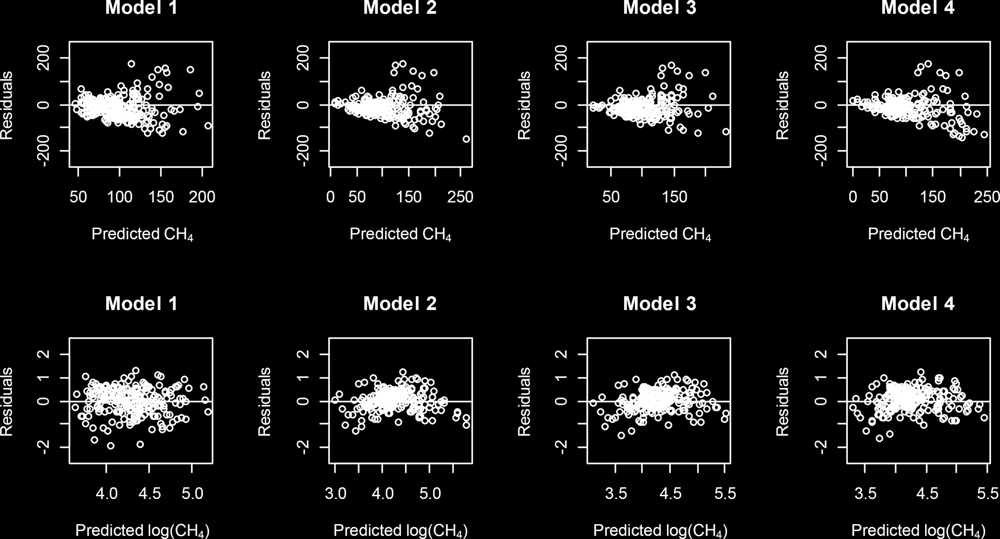
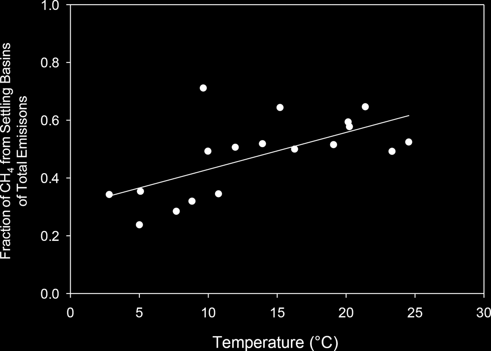

+-----------------------------------+-----------------------------------+
| |image1|                          |    | **J. Dairy Sci.              |
|                                   |      100:6785–6803**              |
|                                   |    | **https:/                    |
|                                   | /doi.org/10.3168/jds.2017-12777** |
|                                   |    | © 2017, THE AUTHORS.         |
|                                   |      Published by FASS and        |
|                                   |      Elsevier Inc. on behalf of   |
|                                   |      the American Dairy Science   |
|                                   |      Association®. This is an     |
|                                   |      open access article under    |
|                                   |      the CC BY-NC-ND license      |
|                                   |      (http://creativecom          |
|                                   | mons.org/licenses/by-nc-nd/3.0/). |
+===================================+===================================+
+-----------------------------------+-----------------------------------+

..

   **Methane emissions from dairy lagoons in the western United States**

   | **A. B. Leytem,*1 D. L. Bjorneberg,\* A. C. Koehn,\* L. E. Moraes,†
     E. Kebreab,‡ and R. S. Dungan\*** \*USDA-Agricultural Research
     Service, Northwest Irrigation and Soils Research Laboratory,
     Kimberly, ID 83341
   | †Department of Animal Sciences, The Ohio State University, Columbus
     43210
   | ‡Department of Animal Science, University of California–Davis,
     Davis 95616

**ABSTRACT**

   Methane generation from dairy liquid storage sys-tems is a major
   source of agricultural greenhouse gas emissions. However, little
   on-farm research has been conducted to estimate and determine the
   factors that may affect these emissions. Six lagoons in south-central
   Idaho were monitored for 1 yr, with CH4 emissions estimated by
   inverse dispersion modeling. Lagoon char-acteristics thought to
   contribute to CH4 emissions were also monitored over this time
   period. Average emis-sions from the lagoons ranged from 30 to 126
   kg/ha per day or 22 to 517 kg/d. Whereas we found a general trend for
   greater emissions during the summer, when temperatures were greater,
   events such as pumping, rainfall, freeze or thaw of lagoon surfaces,
   and wind sig-nificantly increased CH4 emissions irrespective of
   tem-perature. Lagoon physicochemical characteristics, such as total
   solids, chemical oxygen demand, and volatile solids, were highly
   correlated with emission. Methane prediction models were developed
   using volatile solids, wind speed, air temperature, and pH as
   independent variables. The US Environmental Protection Agency
   methodology for estimating CH4 emissions from ma-nure storage was
   used for comparison of on-farm CH4 emissions from 1 of the lagoon
   systems. The US Envi-ronmental Protection Agency method
   underestimated CH4 emissions by 48%. An alternative methodology,
   us-ing volatile solids degradation factor, provided a more accurate
   estimate of annual emissions from the lagoon system and may hold
   promise for applicability across a range of dairy lagoon systems in
   the United States. **Key words:** emission, methane, manure, inverse
   dispersion

**INTRODUCTION**

   The latest US Environmental Protection Agency (**USEPA**) greenhouse
   gas (**GHG**) inventory (USEPA,

   Received February 21, 2017.

   Accepted April 9, 2017.

   **1** Corresponding author: April.leytem@ars.usda.gov

   2016b) estimates that agriculture accounts for 9% of total GHG
   emissions in the United States. The per-centage of agricultural GHG
   emissions from enteric CH4 production and manure management are 28.6
   and 13.7%, respectively. The majority of enteric CH4 pro-duced is
   estimated to be from beef cattle (71%), whereas dairy cattle
   contributed 26%; however, CH4 production from dairy manure management
   is estimated to be the largest fraction of CH4 produced from manure
   at 53%, followed by swine at 37%. The majority of these ma-nure
   emissions are generated from the storage of liquid manures in
   anaerobic lagoons.

   A large body of work exists related to estimation of enteric CH4
   production by cattle and potential mitiga-tion strategies (e.g.,
   Kebreab et al., 2008; Sejian et al., 2011; Powers et al., 2014);
   however, CH4 production from manure storage is not well studied and
   there may be large discrepancies between inventory estimates and
   actual on-farm emissions. Some research indicates that the USEPA and
   Intergovernmental Panel on Climate Change methodologies may be
   underestimating CH4 contributions from liquid dairy manure storage by
   up to 130% (Lory et al., 2010; Baldé et al., 2016). One of the
   reasons for these large discrepancies is that the emission factors
   developed for inventory purposes were based on limited data that may
   not represent the va-riety of manure storage conditions found on US
   dairies (Bryant et al., 1976; Morris 1976; Mangino et al., 2001).
   Approximately 17 on-farm studies (21 lagoons) have been published
   related to CH4 production from dairy liquid manure storage (Table 1).
   Only 8 of these studies were conducted on dairies located in the
   United States, and another 4 were on Canadian dairies, which could
   represent both weather characteristics and manage-ment practices in
   certain regions of US dairy produc-tion. Approximately half of the
   studies have provided an annual average CH4 emission factor, whereas
   the re-maining studies only looked at emissions during shorter
   intervals. The emission rates reported in the literature vary widely,
   with a range of 12 to 2,030 kg of CH4/ha per day and 4.7 to 1,028
   g/head per day. This range in values indicates the diversity of the
   different ma-nure-management systems that can be found in dairy

6785

6786 LEYTEM ET AL.

   production and originates from factors such as fraction of manure
   stored as a liquid, effects of enhanced solid separation, length of
   storage, temperature, agitation, and crust formation. In addition,
   the influence of cattle diets, the addition of materials such as
   spilled feed, milk, and cleaning agents that are washed into storage
   areas, and the amount of inoculum remaining in stor-age may have an
   effect.

   The goal of the current study was to add to the body of knowledge
   related to CH4 emissions from storage of liquid manure on dairy
   production facilities in the western United States. In particular, we
   aimed to study seasonal trends in emissions, relate emissions
   measured on the farm with lagoon liquid characteristics, and compare
   these emissions with estimates derived with current inventory
   methodology.

   **MATERIALS AND METHODS**

   **Farm Descriptions**

   During September 2010 to November 2015, 6 dairy lagoons were selected
   for monitoring of CH4 emissions (Table 2). These farms were selected
   to represent ma-nure-handling techniques typically found on a western
   US dairy and based on farm layout and the ability to separate the
   lagoon emissions from the rest of the farm. They were also situated
   in areas where no other upwind CH4 sources could contribute to
   measured CH4 concen-trations. This enabled us to select lagoons that
   would not have any interference from internal or external CH4
   sources. In addition, farms were selected to represent a variety of
   sizes, ranging from less than 1,000 cows to greater than 5,000 cows.
   Five of the dairies were dry lot dairies where cows were housed in
   pens and the major-ity of manure was stored as a solid. In these
   systems, manure from the milking parlor and holding areas flowed into
   a lagoon system, which typically consisted of 1 or more settling
   basins to separate out some of the solids followed by a larger
   lagoon. These lagoons were typically pumped out in the spring and
   fall onto the surrounding cropland; however, the sludge remaining in
   the ponds was typically not removed. The settling basins were cleaned
   out on an infrequent basis, but in many cases they were not cleaned
   out more than once a year at the most. One dairy was a freestall
   dairy where the lactating cows were housed in naturally ventilated
   barns and the manure from the barns was cleaned out by flushing the
   alleyways behind the freestalls. The wash water from the milking
   parlor and holding area on this dairy also flowed into the lagoon
   system. The dairy manure-handling systems varied by farm and are
   described below.

   Journal of Dairy Science Vol. 100 No. 8, 2017

   • D1: A dry lot dairy with manure storage com-prised of 3 settling
   basins and a main lagoon. The main lagoon was monitored.

   • D2: A dry lot dairy with manure storage com-prised of 4 settling
   basins and a main lagoon. The main lagoon was monitored.

   • D3: A dry lot dairy that was recently converted to a heifer
   operation; however, during the last quarter of the study lactating
   animals were on the farm. The lagoon system consisted of 5 settling
   basins and a main lagoon. The main lagoon and settling basins were
   monitored.

   • D4: A freestall dairy utilizing a flush system with the
   manure-storage system consisting of a screen separator, 3 settling
   basins, 3 main lagoons, and a satellite lagoon. The satellite lagoon
   was moni-tored.

   • D5: A dry lot dairy composed of a concrete set-tling cell and 3
   lagoons. The final lagoon in the series was monitored.

   • D6: A dry lot dairy comprised of 1 settling basin and a main
   lagoon. The main lagoon and settling basin were monitored.

   **Methane Concentration and Wind Measurements**

   Initially, lagoons were monitored seasonally (D1 and D2), but as more
   resources became available monitor-ing times were increased to better
   capture annual varia-tions in emissions (D3–D6). The concentration of
   CH4 was measured using open-path Fourier transform infra-red
   spectrometry (**OP/FTIR**; Griffiths et al., 2009; Shao et al.,
   2010). One OP/FTIR (Air Sentry, Cerex Monitoring Solutions, Atlanta,
   GA, or ABB-Bomem MB-100, MDA, Atlanta, GA) was located either across
   the downwind edge/corner (D1, D3, D4) or on the downwind bank (D2,
   D5, D6) of the lagoon, with a sensor height at 1.7 m and path lengths
   ranging from 130 to 240 m. On D3 and D6, the position of the OP/ FTIR
   enabled monitoring of either the settling basins or the lagoons
   depending on wind direction. Spectra were acquired continuously and
   averaged over 5-min intervals. Background concentrations were
   measured at each dairy for several days at the onset of the study as
   well as at a remote (nonagricultural affected) location for
   comparison. Experiments performed with the OP/ FTIR units
   demonstrated that background concentra-tions were very stable and did
   not fluctuate daily (CV = 4% over a 4-d period with 1,049
   measurements and a change in background concentration of ≤0.3 ppm).
   In addition, the on-farm concentration data at each loca-tion was
   filtered for wind directions to isolate times when no upwind source
   of CH4 was present to verify

+-------+-------+-------+-------+-------+-------+-------+-------+-------+
|    ** | CH4   |    ME |       |       |       |       |       | 6787  |
| Table | (g    | THANE |       |       |       |       |       |       |
|       | /head |       |       |       |       |       |       |       |
|  1**. | per   |  EMIS |       |       |       |       |       |       |
|    Su | day)  | SIONS |       |       |       |       |       |       |
| mmary |       |       |       |       |       |       |       |       |
|    of |       |  FROM |       |       |       |       |       |       |
|    on |       |    LA |       |       |       |       |       |       |
| -farm |       | GOONS |       |       |       |       |       |       |
|       |       |       |       |       |       |       |       |       |
|   CH4 |       |       |       |       |       |       |       |       |
|       |       |       |       |       |       |       |       |       |
|  emis |       |       |       |       |       |       |       |       |
| sions |       |       |       |       |       |       |       |       |
|       |       |       |       |       |       |       |       |       |
|  from |       |       |       |       |       |       |       |       |
|       |       |       |       |       |       |       |       |       |
| dairy |       |       |       |       |       |       |       |       |
|       |       |       |       |       |       |       |       |       |
| waste |       |       |       |       |       |       |       |       |
| water |       |       |       |       |       |       |       |       |
|    st |       |       |       |       |       |       |       |       |
| orage |       |       |       |       |       |       |       |       |
|       |       |       |       |       |       |       |       |       |
|   rep |       |       |       |       |       |       |       |       |
| orted |       |       |       |       |       |       |       |       |
|    in |       |       |       |       |       |       |       |       |
|       |       |       |       |       |       |       |       |       |
|   the |       |       |       |       |       |       |       |       |
|       |       |       |       |       |       |       |       |       |
| liter |       |       |       |       |       |       |       |       |
| ature |       |       |       |       |       |       |       |       |
+=======+=======+=======+=======+=======+=======+=======+=======+=======+
|       |       | 42    |       |       |       |       |       |       |
|       |       |       | | 833 |       |       |       |       |       |
|       |       |       |       |       |       |       |       |       |
|       |       |       |  | 13 |       |       |       |       |       |
|       |       |       |       |       |       |       |       |       |
|       |       |       |  | 42 |       |       |       |       |       |
|       |       |       |       |       |       |       |       |       |
|       |       |       | | 325 |       |       |       |       |       |
|       |       |       |    |  |       |       |       |       |       |
|       |       |       |  14.2 |       |       |       |       |       |
|       |       |       |       |       |       |       |       |       |
|       |       |       | | 666 |       |       |       |       |       |
|       |       |       |       |       |       |       |       |       |
|       |       |       | | 141 |       |       |       |       |       |
|       |       |       |       |       |       |       |       |       |
|       |       |       | | 166 |       |       |       |       |       |
|       |       |       |       |       |       |       |       |       |
|       |       |       |  | 85 |       |       |       |       |       |
|       |       |       |       |       |       |       |       |       |
|       |       |       | | 4.7 |       |       |       |       |       |
|       |       |       |       |       |       |       |       |       |
|       |       |       |  | 31 |       |       |       |       |       |
|       |       |       |       |       |       |       |       |       |
|       |       |       |  | 10 |       |       |       |       |       |
|       |       |       |    |  |       |       |       |       |       |
|       |       |       | 1,028 |       |       |       |       |       |
|       |       |       |       |       |       |       |       |       |
|       |       |       | | 211 |       |       |       |       |       |
|       |       |       |       |       |       |       |       |       |
|       |       |       |  | 19 |       |       |       |       |       |
|       |       |       |       |       |       |       |       |       |
|       |       |       | | 361 |       |       |       |       |       |
|       |       |       |       |       |       |       |       |       |
|       |       |       |   | 9 |       |       |       |       |       |
|       |       |       | 4–152 |       |       |       |       |       |
|       |       |       |       |       |       |       |       |       |
|       |       |       |  | 24 |       |       |       |       |       |
|       |       |       | 9–673 |       |       |       |       |       |
|       |       |       |       |       |       |       |       |       |
|       |       |       |   | 1 |       |       |       |       |       |
|       |       |       | 2–295 |       |       |       |       |       |
|       |       |       |       |       |       |       |       |       |
|       |       |       |  | 40 |       |       |       |       |       |
|       |       |       | 0–510 |       |       |       |       |       |
+-------+-------+-------+-------+-------+-------+-------+-------+-------+
|       |       | 970   |    |  |       |    |  |       | 58    |       |
|       | | CH4 |       | 12–14 | | 170 | 1,030 |       | 0–740 |       |
|       |       |       |    |  |    |  |       |       |       |       |
|       |   | ( |       | 2,030 |  23.7 | | 400 |       |       |       |
|       | kg/ha |       |       |       |       |       |       |       |
|       |       |       |       |       |  | 43 |       |       |       |
|       |   per |       |       |       |       |       |       |       |
|       |       |       |       |       | | 220 |       |       |       |
|       |  day) |       |       |       |       |       |       |       |
|       |       |       |       |       |  | 34 |       |       |       |
|       |       |       |       |       | 0–550 |       |       |       |
|       |       |       |       |       |       |       |       |       |
|       |       |       |       |       |  | 13 |       |       |       |
|       |       |       |       |       | 0–340 |       |       |       |
+-------+-------+-------+-------+-------+-------+-------+-------+-------+
|       | Type  | S     |       |       |       |       |       |       |
|       | of    | lurry |       |       |       |       |       |       |
|       | st    | tank  |       |       |       |       |       |       |
|       | orage | S     |       |       |       |       |       |       |
|       |       | lurry |       |       |       |       |       |       |
|       |       | tank  |       |       |       |       |       |       |
|       |       | S     |       |       |       |       |       |       |
|       |       | lurry |       |       |       |       |       |       |
|       |       | pond  |       |       |       |       |       |       |
|       |       | S     |       |       |       |       |       |       |
|       |       | lurry |       |       |       |       |       |       |
|       |       | tank  |       |       |       |       |       |       |
|       |       | Co    |       |       |       |       |       |       |
|       |       | vered |       |       |       |       |       |       |
|       |       | basin |       |       |       |       |       |       |
|       |       | L     |       |       |       |       |       |       |
|       |       | agoon |       |       |       |       |       |       |
|       |       | L     |       |       |       |       |       |       |
|       |       | agoon |       |       |       |       |       |       |
|       |       | Set   |       |       |       |       |       |       |
|       |       | tling |       |       |       |       |       |       |
|       |       | basin |       |       |       |       |       |       |
|       |       | Pr    |       |       |       |       |       |       |
|       |       | imary |       |       |       |       |       |       |
|       |       | l     |       |       |       |       |       |       |
|       |       | agoon |       |       |       |       |       |       |
|       |       | Seco  |       |       |       |       |       |       |
|       |       | ndary |       |       |       |       |       |       |
|       |       | l     |       |       |       |       |       |       |
|       |       | agoon |       |       |       |       |       |       |
|       |       | Set   |       |       |       |       |       |       |
|       |       | tling |       |       |       |       |       |       |
|       |       | basin |       |       |       |       |       |       |
|       |       | Pr    |       |       |       |       |       |       |
|       |       | imary |       |       |       |       |       |       |
|       |       | l     |       |       |       |       |       |       |
|       |       | agoon |       |       |       |       |       |       |
|       |       | Set   |       |       |       |       |       |       |
|       |       | tling |       |       |       |       |       |       |
|       |       | basin |       |       |       |       |       |       |
|       |       | Pr    |       |       |       |       |       |       |
|       |       | imary |       |       |       |       |       |       |
|       |       | l     |       |       |       |       |       |       |
|       |       | agoon |       |       |       |       |       |       |
|       |       | Seco  |       |       |       |       |       |       |
|       |       | ndary |       |       |       |       |       |       |
|       |       | l     |       |       |       |       |       |       |
|       |       | agoon |       |       |       |       |       |       |
|       |       | L     |       |       |       |       |       |       |
|       |       | agoon |       |       |       |       |       |       |
|       |       | L     |       |       |       |       |       |       |
|       |       | agoon |       |       |       |       |       |       |
|       |       | S     |       |       |       |       |       |       |
|       |       | lurry |       |       |       |       |       |       |
|       |       | tank  |       |       |       |       |       |       |
|       |       | L     |       |       |       |       |       |       |
|       |       | agoon |       |       |       |       |       |       |
|       |       | S     |       |       |       |       |       |       |
|       |       | lurry |       |       |       |       |       |       |
|       |       | tank  |       |       |       |       |       |       |
|       |       | S     |       |       |       |       |       |       |
|       |       | lurry |       |       |       |       |       |       |
|       |       | tank  |       |       |       |       |       |       |
|       |       | L     |       |       |       |       |       |       |
|       |       | agoon |       |       |       |       |       |       |
|       |       | S     |       |       |       |       |       |       |
|       |       | lurry |       |       |       |       |       |       |
|       |       | tank  |       |       |       |       |       |       |
+-------+-------+-------+-------+-------+-------+-------+-------+-------+
|       | S     | A     |       |       |       |       |       |       |
|       | eason | nnual |       |       |       |       |       |       |
|       |       | A     |       |       |       |       |       |       |
|       |       | nnual |       |       |       |       |       |       |
|       |       | W     |       |       |       |       |       |       |
|       |       | inter |       |       |       |       |       |       |
|       |       | S     |       |       |       |       |       |       |
|       |       | ummer |       |       |       |       |       |       |
|       |       | /fall |       |       |       |       |       |       |
|       |       | A     |       |       |       |       |       |       |
|       |       | nnual |       |       |       |       |       |       |
|       |       | A     |       |       |       |       |       |       |
|       |       | nnual |       |       |       |       |       |       |
|       |       | A     |       |       |       |       |       |       |
|       |       | nnual |       |       |       |       |       |       |
|       |       | S     |       |       |       |       |       |       |
|       |       | ummer |       |       |       |       |       |       |
|       |       | S     |       |       |       |       |       |       |
|       |       | ummer |       |       |       |       |       |       |
|       |       | S     |       |       |       |       |       |       |
|       |       | ummer |       |       |       |       |       |       |
|       |       | S     |       |       |       |       |       |       |
|       |       | ummer |       |       |       |       |       |       |
|       |       | S     |       |       |       |       |       |       |
|       |       | ummer |       |       |       |       |       |       |
|       |       | W     |       |       |       |       |       |       |
|       |       | inter |       |       |       |       |       |       |
|       |       | W     |       |       |       |       |       |       |
|       |       | inter |       |       |       |       |       |       |
|       |       | W     |       |       |       |       |       |       |
|       |       | inter |       |       |       |       |       |       |
|       |       | A     |       |       |       |       |       |       |
|       |       | nnual |       |       |       |       |       |       |
|       |       | S     |       |       |       |       |       |       |
|       |       | ummer |       |       |       |       |       |       |
|       |       | Win   |       |       |       |       |       |       |
|       |       | ter–s |       |       |       |       |       |       |
|       |       | ummer |       |       |       |       |       |       |
|       |       | A     |       |       |       |       |       |       |
|       |       | nnual |       |       |       |       |       |       |
|       |       | A     |       |       |       |       |       |       |
|       |       | nnual |       |       |       |       |       |       |
|       |       | S     |       |       |       |       |       |       |
|       |       | pring |       |       |       |       |       |       |
|       |       | /fall |       |       |       |       |       |       |
|       |       | F     |       |       |       |       |       |       |
|       |       | all/w |       |       |       |       |       |       |
|       |       | inter |       |       |       |       |       |       |
|       |       | A     |       |       |       |       |       |       |
|       |       | nnual |       |       |       |       |       |       |
+-------+-------+-------+-------+-------+-------+-------+-------+-------+
|       |    M  | Flo   |       |       | Flux  | In    |       |       |
|       | ethod | ating |       |       | ch    | verse |       |       |
|       |       | cover |       |       | amber | dispe |       |       |
|       |       | Dy    |       |       |       | rsion |       |       |
|       |       | namic |       |       |       | In    |       |       |
|       |       | ch    |       |       |       | verse |       |       |
|       |       | amber |       |       |       | dispe |       |       |
|       |       | Micr  |       |       |       | rsion |       |       |
|       |       | omete |       |       |       | Micr  |       |       |
|       |       | orolo |       |       |       | omete |       |       |
|       |       | gical |       |       |       | orolo |       |       |
|       |       | mass  |       |       |       | gical |       |       |
|       |       | ba    |       |       |       | mass  |       |       |
|       |       | lance |       |       |       | ba    |       |       |
|       |       | T     |       |       |       | lance |       |       |
|       |       | racer |       |       |       | In    |       |       |
|       |       | Mass  |       |       |       | verse |       |       |
|       |       | ba    |       |       |       | dispe |       |       |
|       |       | lance |       |       |       | rsion |       |       |
|       |       | Flo   |       |       |       | Flo   |       |       |
|       |       | ating |       |       |       | ating |       |       |
|       |       | cover |       |       |       | ch    |       |       |
|       |       | In    |       |       |       | amber |       |       |
|       |       | verse |       |       |       | In    |       |       |
|       |       | dispe |       |       |       | verse |       |       |
|       |       | rsion |       |       |       | dispe |       |       |
|       |       | Flux  |       |       |       | rsion |       |       |
|       |       | ch    |       |       |       | In    |       |       |
|       |       | amber |       |       |       | verse |       |       |
|       |       |       |       |       |       | dispe |       |       |
|       |       |       |       |       |       | rsion |       |       |
|       |       |       |       |       |       | In    |       |       |
|       |       |       |       |       |       | verse |       |       |
|       |       |       |       |       |       | dispe |       |       |
|       |       |       |       |       |       | rsion |       |       |
+-------+-------+-------+-------+-------+-------+-------+-------+-------+
|       | Co    | U     |       |       | U     | U     |       |       |
|       | untry | nited |       |       | nited | nited |       |       |
|       |       | S     |       |       | S     | S     |       |       |
|       |       | tates |       |       | tates | tates |       |       |
|       |       | De    |       |       |       | U     |       |       |
|       |       | nmark |       |       |       | nited |       |       |
|       |       | New   |       |       |       | S     |       |       |
|       |       | Ze    |       |       |       | tates |       |       |
|       |       | aland |       |       |       | C     |       |       |
|       |       | C     |       |       |       | anada |       |       |
|       |       | anada |       |       |       | U     |       |       |
|       |       | T     |       |       |       | nited |       |       |
|       |       | aiwan |       |       |       | S     |       |       |
|       |       | New   |       |       |       | tates |       |       |
|       |       | Ze    |       |       |       | Japan |       |       |
|       |       | aland |       |       |       | C     |       |       |
|       |       | U     |       |       |       | anada |       |       |
|       |       | nited |       |       |       | U     |       |       |
|       |       | S     |       |       |       | nited |       |       |
|       |       | tates |       |       |       | S     |       |       |
|       |       | U     |       |       |       | tates |       |       |
|       |       | nited |       |       |       | C     |       |       |
|       |       | S     |       |       |       | anada |       |       |
|       |       | tates |       |       |       |       |       |       |
+-------+-------+-------+-------+-------+-------+-------+-------+-------+
|       |       |       |       |       |    B  |       |       |       |
|       |  Refe |   | S |       |       | orhan |   | L |       |       |
|       | rence | afley |       |       |    et | eytem |       |       |
|       |       |       |       |       |       |       |       |       |
|       |       |   and |       |       |  al., |    et |       |       |
|       |       |       |       |       |       |       |       |       |
|       |       | Weste |       |       | 2011b |  al., |       |       |
|       |       | rman, |       |       |       |       |       |       |
|       |       |       |       |       |       |  2011 |       |       |
|       |       |  1992 |       |       |       |    |  |       |       |
|       |       |       |       |       |       |  Todd |       |       |
|       |       |  | Hu |       |       |       |       |       |       |
|       |       | sted, |       |       |       |    et |       |       |
|       |       |       |       |       |       |       |       |       |
|       |       |  1994 |       |       |       |  al., |       |       |
|       |       |    |  |       |       |       |       |       |       |
|       |       |  Khan |       |       |       |  2011 |       |       |
|       |       |       |       |       |       |    |  |       |       |
|       |       |    et |       |       |       | Vande |       |       |
|       |       |       |       |       |       | rZaag |       |       |
|       |       |  al., |       |       |       |       |       |       |
|       |       |       |       |       |       |    et |       |       |
|       |       |  1997 |       |       |       |       |       |       |
|       |       |    |  |       |       |       |  al., |       |       |
|       |       | Kahar |       |       |       |       |       |       |
|       |       | abata |       |       |       |  2011 |       |       |
|       |       |       |       |       |       |       |       |       |
|       |       |   and |       |       |       |   | L |       |       |
|       |       |       |       |       |       | eytem |       |       |
|       |       |   Sch |       |       |       |       |       |       |
|       |       | uepp, |       |       |       |    et |       |       |
|       |       |       |       |       |       |       |       |       |
|       |       |  1998 |       |       |       |  al., |       |       |
|       |       |       |       |       |       |       |       |       |
|       |       |  | Su |       |       |       |  2013 |       |       |
|       |       |       |       |       |       |       |       |       |
|       |       |    et |       |       |       |   | M |       |       |
|       |       |       |       |       |       | inato |       |       |
|       |       |  al., |       |       |       |       |       |       |
|       |       |       |       |       |       |    et |       |       |
|       |       |  2003 |       |       |       |       |       |       |
|       |       |       |       |       |       |  al., |       |       |
|       |       |   | C |       |       |       |       |       |       |
|       |       | raggs |       |       |       |  2013 |       |       |
|       |       |       |       |       |       |    |  |       |       |
|       |       |    et |       |       |       | Vande |       |       |
|       |       |       |       |       |       | rZaag |       |       |
|       |       |  al., |       |       |       |       |       |       |
|       |       |       |       |       |       |    et |       |       |
|       |       |  2008 |       |       |       |       |       |       |
|       |       |    |  |       |       |       |  al., |       |       |
|       |       | Bjorn |       |       |       |       |       |       |
|       |       | eberg |       |       |       |  2014 |       |       |
|       |       |       |       |       |       |    |  |       |       |
|       |       |    et |       |       |       | Grant |       |       |
|       |       |       |       |       |       |       |       |       |
|       |       |  al., |       |       |       |    et |       |       |
|       |       |       |       |       |       |       |       |       |
|       |       |  2009 |       |       |       |  al., |       |       |
|       |       |       |       |       |       |       |       |       |
|       |       |   | B |       |       |       |  2015 |       |       |
|       |       | orhan |       |       |       |    |  |       |       |
|       |       |       |       |       |       | Baldé |       |       |
|       |       |    et |       |       |       |       |       |       |
|       |       |       |       |       |       |    et |       |       |
|       |       |  al., |       |       |       |       |       |       |
|       |       |       |       |       |       |  al., |       |       |
|       |       | 2011a |       |       |       |       |       |       |
|       |       |       |       |       |       |  2016 |       |       |
+-------+-------+-------+-------+-------+-------+-------+-------+-------+

Journal of Dairy Science Vol. 100 No. 8, 2017

6788 LEYTEM ET AL.

   that background concentrations were consistent over time.
   Quantitative determinations of CH4 concentra-tions were performed by
   partial least squares regression of the OP/FTIR spectra (Griffiths et
   al., 2009; Shao et al., 2011, 2013), and the detection limit of CH4
   was less than 0.01 ppm. Concentration data were processed to produce
   15-min average mixing-ratio concentrations at the source areas
   (**C**).

   The wind environment at the dairy was described by simple
   Monin-Obukhov similarity theory relationships defined by *u*\ \*,
   *L*, *z*\ 0, and β, as provided by 3-dimen-sional sonic anemometers
   (RM Young Model 81000 ultrasonic anemometer, Traverse City, MI),
   where *u*\ \* is the friction velocity, *L* is the Obukhov stability
   length, *z*\ 0 is the surface roughness length, and β is wind
   direc-tion. Flesch et al. (2004) details how these parameters were
   calculated from a sonic anemometer. The sonic anemometer was located
   on a 3-m tower at each lagoon, where there were minimal flow
   disturbances from struc-tures upwind, to capture a more idealized
   wind flow of the area, as suggested by Flesch et al. (2005a). Wind
   parameters were calculated for each 15-min period (corresponding to
   *C* observations). A meteorological station was also located at each
   lagoon to record baro-metric pressure, air temperature, wind
   direction, and wind speed (all at 2 m) during the experimental
   period.

   **Emissions Calculations**

   We used WindTrax 2.0 software (Thunder Beach Scientific, Nanaimo,
   Canada) to determine lagoon emission rates, which combines the
   backward Lagrang-ian stochastic inverse-dispersion technique
   described by Flesch et al. (2004), with an interface allowing sources
   and sensors to be conveniently mapped. This technique has been used
   in several controlled-release studies to determine emissions from
   barn and lagoon source areas and was shown to provide estimates of
   emissions within 15% of actual emissions (McGinn et al., 2009; Gao et
   al., 2010; Ro et al., 2013). For a detailed description of the
   backward Lagrangian stochastic technique, see

   Flesch et al. (2005a,b, 2007). The lagoons and settling basins were
   mapped using available satellite imagery and on-farm global
   positioning system data. Emission estimates (kg/ha per day and kg/d)
   were calculated using n = 50,000 trajectories and fixed background
   concentrations. Emissions from the settling basins were determined
   using the method stated above; however, the lagoons at both dairies
   (D3 and D6) and the cattle housing at D6 were also included as source
   areas in the model and set at an average emission rate to account for
   any CH4 contributions from those sources (Flesch et al., 2009). The
   lagoon emission rates were determined from the data generated during
   the same time periods, and the emission rates from the housing, which
   would be mainly enteric CH4 production from the cattle, were
   calculated using the approach of Rotz and Chianese (2009) and set at
   100 kg/d for the housing area.

   As good emissions estimates are dependent on uti-lizing data that do
   not violate the Monin-Obukhov similarity theory assumptions (i.e.,
   low winds, extreme stabilities, wind profile errors), data were
   filtered. We (1) removed periods where *u*\ \* ≤0.10 m/s (low wind
   con-ditions), (2) removed periods where \|\ *L*\ \| ≤5 m (strongly
   stable/unstable atmosphere;), and (3) removed periods where *z*\ 0 ≥1
   m (associated with errors in wind profile; Ro et al., 2013; Flesch et
   al., 2014).

   Due to the location of the concentration sensors and other source
   areas on the site, for some wind directions, measurements of the
   downwind concentrations may not sample enough of the farm plume,
   which can lead to uncertainty in emission estimates (Flesch et al.
   2005b). Additionally, cross contamination might occur due to
   emissions from other source areas on the farm. There-fore, we
   filtered out data when the wind was either not within ±40°
   perpendicular to the OP/FTIR path length or from areas where there
   could be other CH4 sources (such as cattle pens, manure piles) to
   ensure that the concentration sensors were measuring gases from the
   source areas of interest only. The 15-min emis-sion estimates were
   then averaged for each hour, with hourly values averaged over a day.
   Monthly averages

   **Table 2**. Characteristics of the dairies used to determine on-farm
   lagoon methane emissions in south-central Idaho

+---------+---------+---------+---------+---------+---------+---------+
|         | Housing |    Size |         | Surface | Depth   | Mon     |
|   Dairy |         |         |  Lagoon | area    | (m)     | itoring |
|         |         |   class |         | (m2)    |         |         |
|         |         |    of   |   water |         |         |         |
|         |         |         |         |         |         |         |
|         |         |         |  source |         |         |         |
+=========+=========+=========+=========+=========+=========+=========+
|         |         |    op   |         |         |         |         |
|         |         | eration |         |         |         |         |
|         |         |    (no. |         |         |         |         |
|         |         |    of   |         |         |         |         |
+---------+---------+---------+---------+---------+---------+---------+
|         |         |         |         |         |         | periods |
|         |         | cattle) |         |         |         | (mo/d)  |
+---------+---------+---------+---------+---------+---------+---------+
|    D1   | Dry lot |    1,00 |         |         | 2.4–2.7 | 9/      |
|         |         | 0–5,000 |  Parlor |  26,628 |         | 10–6/11 |
|         |         |         |    wash |         |         |         |
|         |         |         |         |         |         |         |
|         |         |         |   water |         |         |         |
+---------+---------+---------+---------+---------+---------+---------+
|    D2   | Dry lot |         |         |         | 1.5     |    12/  |
|         |         |   5,000 |  Parlor |  47,398 |         | 10–6/11 |
|         |         | –10,000 |    wash |         |         |         |
|         |         |         |         |         |         |         |
|         |         |         |   water |         |         |         |
+---------+---------+---------+---------+---------+---------+---------+
|    D3   | Dry lot |    1,00 |         | 19,621  | 1.2–1.9 | 6/      |
|         |         | 0–5,000 |  Parlor | –23,237 |         | 12–5/13 |
|         |         |         |    wash |         |         |         |
|         |         |         |         |         |         |         |
|         |         |         |   water |         |         |         |
+---------+---------+---------+---------+---------+---------+---------+
|    D4   | Fr      |         |         | 4,005   | 0.9–1.6 | 5/      |
|         | eestall |   5,000 |   Flush | –13,220 |         | 12–5/13 |
|         |         | –10,000 |         |         |         |         |
|         |         |         |  system |         |         |         |
|         |         |         |    from |         |         |         |
|         |         |         |    barn |         |         |         |
|         |         |         |    and  |         |         |         |
|         |         |         |         |         |         |         |
|         |         |         |  parlor |         |         |         |
+---------+---------+---------+---------+---------+---------+---------+
|    D5   | Dry lot |    1,00 |    wash | 1,30    | 0.3–1.3 |    7/1  |
|         |         | 0–5,000 |         | 0–3,373 |         | 3–11/14 |
|         |         |         |   water |         |         |         |
+---------+---------+---------+---------+---------+---------+---------+
|         |         |         |         |         |         |         |
|         |         |         |  Parlor |         |         |         |
|         |         |         |    wash |         |         |         |
|         |         |         |         |         |         |         |
|         |         |         |   water |         |         |         |
+---------+---------+---------+---------+---------+---------+---------+
|    D6   | Dry lot |         |         |         | 0.3–0.9 | 11/1    |
|         |         |  <1,000 |  Parlor |   2,101 |         | 4–11/15 |
|         |         |         |    wash |         |         |         |
|         |         |         |         |         |         |         |
|         |         |         |   water |         |         |         |
|         |         |         |    and  |         |         |         |
|         |         |         |         |         |         |         |
|         |         |         |  runoff |         |         |         |
+---------+---------+---------+---------+---------+---------+---------+

..

   Journal of Dairy Science Vol. 100 No. 8, 2017

   METHANE EMISSIONS FROM LAGOONS 6789

were determined by averaging all available daily emis-sion values
collected during that month.

**Lagoon Sampling and Analyses**

An intensive lagoon sampling campaign was con-ducted simultaneously with
the emissions monitoring to determine spatial and temporal changes in
lagoon properties that could be associated with CH4 emis-sions.
Measurements included chemical oxygen demand (**COD**), TS, volatile
solids (**VS**), pH, temperature, dissolved oxygen (**DO**), and
specific conductivity. A detailed description of the study can be found
in Ley-tem et al. (2017), a brief description follows.

Lagoons were sampled (500 mL) every 2 to 3 wk on a grid with the number
of sampling points (4 to 10) re-lated to the size of the lagoon and
distributed as evenly as possible across the lagoon surface. Lagoon
depth was determined with a sampling rod that was marked for depth. The
rod was allowed to sit on the top of the sludge layer at the bottom of
the lagoon to determine the depth of the water column. This rod was
connected to a container with a retractable lid to collect samples at
specific depths. When lagoons were deeper than 1 m (D1–D4), samples were
collected from the surface (0.15 m below surface) and 0.3 m above the
top of the sludge layer at each sampling location; otherwise only
surface samples were collected.

Immediately after collection, a 125-mL subsample was taken and mixed
with 1 mL of concentrated sulfu-ric acid to stabilize the sample for COD
analysis. All samples were transferred to the laboratory in coolers,
then stored under refrigeration at 5°C and processed within 36 h. In
addition to collecting samples for analysis, the lagoon temperature, pH,
DO, and specific conductivity were determined in situ with a YSI 556
Multiprobe System (YSI Inc., Yellow Springs, OH) at each sampling
location and depth; these measurements were typically made in late
morning or early afternoon. All samples were allowed to come to room
temperature and thoroughly mixed before subsampling and analy-sis.
Analyses were performed for TS and VS according to standard methods
2540B and 2540E, respectively (Eaton et al., 2005), and COD according to
USEPA method 410.4 (USEPA, 1993). As we found no signifi-cant
differences spatially or with depth at each lagoon (Leytem et al.,
2017), the data were averaged (across location and depth) to produce 1
daily value. The co-efficient of variation in COD at each sampling time
ranged from 1 to 110, with 62% of values being less than 10% and only 1
value over 40%. The coefficient of variation of TS ranged from 1 to 46%,
with 87% being less than 10%; for VS the coefficient of variation ranged

   from 1 to 49%, with 90% being less than 10%. The higher coefficient
   of variation values were association with time periods when the
   lagoons were being pumped out or agitated in some other way (filling,
   irrigation, and so on).

   **USEPA CH4 Emissions Estimates**

   We calculated the USEPA estimated emissions for D6 based on the
   “Methodology for estimating CH4 and N2O emissions from manure
   management” (USEPA, 2016a) to determine how well on-farm measurements
   compared with calculated inventory estimates. This was done only for
   D6, as we had the most continu-ous emissions data from this dairy and
   we were able to obtain measurements from all of the stored liquid
   generated on the farm. The CH4 generated each month was calculated as

   CH4 = VS × Bo × MCF × 0.662 × MDP, [1]

   where CH4 is emissions in kilograms per month, VS is the amount of VS
   entering the lagoon each month (kg), Bo is the maximum CH4-producing
   capacity of the manure (m3 of CH4/kg of VS), MCF is the methane
   conversion factor, 0.662 is the density of CH4 at 25°C (kg of CH4/m3
   of CH4), and the MDP is the manage-ment and design practices factor
   (0.8). The estimated VS excreted for dairy cows in Idaho were
   obtained from Table A-206 (USEPA, 2016a; 2,902 kg/cow per year) and
   Bo for dairy cows was obtained from Table A-204 (USEPA, 2016a; 0.24
   m3 of CH4/kg of VS). The MCF was calculated each month based on
   average ambient air temperature measured at the lagoon for the month
   with the equation:

   MCF = exp[E(T2 − T1)/RT1T2], [2]

   where E is the activation energy constant (15,175 cal/ mol), T2 is
   the average ambient air temperature (K) for the month, T1 is 303.15
   K, and R is the ideal gas constant (1.987 cal/K per mole). A minimum
   tempera-ture of 5°C was used due to the biological activity in the
   lagoon which keeps the temperature above freezing. The USEPA
   calculation assumes that lagoons are fully emptied in October of each
   year and start ac-cumulating VS in November; thus, we started the
   calculation in November and ran it through the follow-ing November
   and compared this with on-farm data from December through November.
   The VS consumed during each month were subtracted from total
   avail-able VS for the next month’s calculation according to Mangino
   et al. (2001). We assumed that 10% of VS

Journal of Dairy Science Vol. 100 No. 8, 2017

6790 LEYTEM ET AL.

   generated by the lactating cattle on the farm went to the lagoon,
   based on estimates of Saggar et al. (2004), along with an estimate of
   the time that the cattle spent in the holding area and milking parlor
   each day. As the USEPA does not account for the use of settling
   basins, all the liquid was assumed to go into the lagoon for
   calculation purposes, and this was compared with the combined
   measured emissions from the settling basin and lagoon. We also
   calculated an annual CH4 emis-sion estimate based on equation 1 and
   using the values stated above with the exception of the MCF, which we
   obtained from Table A-210 (USEPA, 2016a) for an anaerobic lagoon in
   Idaho (69%).

   **Emissions Estimate Using Lory et al.**

   **(2010) Methodology**

   Lory et al. (2010) argued that the USEPA method would likely
   underestimate actual emissions from un-covered anaerobic dairy
   lagoons, particularly in colder climates. Those authors concluded
   that a large part of the discrepancy would be related to the Bo
   factor that had been derived from anaerobic digesters, which would
   not necessarily reflect the VS degradation found in uncovered
   anaerobic lagoons, coupled with a flawed MCF calculation. They
   instead proposed using a vola-tile solids degradation factor
   (**VSDF**) that was based on published research from uncovered
   anaerobic dairy lagoons coupled with a factor estimating the amount
   of CH4 produced from the VS destroyed. We estimated CH4 emissions
   from D6 based on this methodology as

   CH4 = VS × VSDF × B′ × 0.662, [3]

   where CH4 is the emissions in kilograms per year, VS is the total
   volatile solids excreted going to the lagoon (kg), VSDF is the
   fraction of VS broken down in storage (kg of VS destroyed/kg of VS
   added; 0.57), B′ is the volume of CH4 generated on a VS destroyed
   basis for the lagoon (m3 of CH4/kg of VS destroyed; 0.45–0.85), and
   0.662 is the density of CH4 at 25°C (kg of CH4/m3 of CH4). The
   estimated VS excreted for dairy cows in Idaho were obtained from
   Table A-206 (USEPA, 2016a), as described above (2,902 kg/cow per
   year), and we assumed 10% of excreted VS went to the lagoon system.

   **Statistical Analysis**

   Linear regression was performed with SAS (ver. 9.3; SAS Institute
   Inc., Cary, NC) to relate daily CH4 emis-sions estimates to both
   meteorological parameters and

   Journal of Dairy Science Vol. 100 No. 8, 2017

   lagoon physicochemical characteristics. As lagoon char-acteristics
   changed predictably and slowly over time (Leytem et al., 2017), daily
   lagoon physicochemical characteristics were calculated by linear
   interpolation between sampled days.

   Mixed effects models were developed to predict CH4 emissions (kg/ha
   per day) using independent variables describing lagoon and
   meteorological characteristics: lagoon-specific conductivity (mS/cm),
   VS (mg/L), TS (mg/L), COD (mg/L), lagoon pH, wind speed (m/s), and
   mean air temperature (°C). To avoid multicol-linearity, 4 pools of
   independent variables were created for which the correlation of any
   pair of independent variables, within a pool, was smaller than 0.5.
   For each of the 4 pools, all possible models (i.e., models resulting
   from all combinations of independent variables) were fitted and the
   model with the smallest Akaike informa-tion criterion (**AIC**;
   Sakamoto et al., 1986) was se-lected. The final selected models (the
   best model from each pool) were subjected to a 10-fold cross
   validation for the determination of the mean square prediction error
   (**MSPE**) with independent data (Hastie et al., 2009). In short, the
   data were randomly divided into 10 folds of similar size. Ten
   training sets were created by leaving each 1 of the 10 folds out. The
   10 testing sets were the folds that were left out of each of the 10
   training sets. The following linear mixed effects model was used as
   the framework:

+--------+--------+--------+--------+--------+--------+--------+--------+
| *yij*  | =      | **x    | +      | *α i*  | +      |    *ε* | [4]    |
|        |        | β**    |        |        |        |    ,   |        |
|        |        | *T*    |        |        |        |        |        |
|        |        |        |        |        |        |   *ij* |        |
|        |        | *ij*   |        |        |        |        |        |
+========+========+========+========+========+========+========+========+
+--------+--------+--------+--------+--------+--------+--------+--------+

..

   where *yij* is the *j*\ th record (*j* = 1, …, *mi*) of CH4
   emis-sions in the *i*\ th dairy (*i* = 1, …, 6), **x**\ *ij* is the
   corre-sponding vector of independent variables to be selected, **β**
   is the vector of fixed regression coefficients, *αi* is the random
   effect of the *i*\ th dairy [assumed *N*\ (0,τ)], and *εij* is the
   error [assumed *N*\ (0,σ2)] with *N* denoting the nor-mal
   distribution, τ and σ2 variance components. Ran-dom effects were
   assumed to be mutually independent and independent of errors. All
   models were fitted with the lme4 package in the R statistical
   software (Bates et al., 2015). Predictions used to calculate the
   MSPE, in each fold of the 10-fold cross validation, were computed
   only with the fixed regression coefficients, that is,

+---------+---------+---------+---------+---------+---------+---------+
| **y**   | **f**   | =       | **X**   | **f**   |         |    ,    |
|         |         |         |         |         |   **β** |         |
|         |         |         |         |         |    ˆ    |         |
|         |         |         |         |         |         |         |
|         |         |         |         |         | −       |         |
|         |         |         |         |         | \ **f** |         |
+=========+=========+=========+=========+=========+=========+=========+
+---------+---------+---------+---------+---------+---------+---------+

..

   where ˆ\ **yf** is a vector of predictions in the *f*\ th fold,
   **Xf** is corresponding matrix of independent variables in the
   *f*\ th fold and ˆ\ **β**\ −\ **f** is the vector of regression
   coefficients estimated with a data set without the *f*\ th fold.

   METHANE EMISSIONS FROM LAGOONS 6791

   **Table 3**. Average wind speed, air temperature, and emission rates
   (±SD) from 6 lagoons located in south-central Idaho1

+-----------+-----------+-----------+-----------+-----------+-----------+
|    Dairy  |    Wind   | Air       |    Number |           |           |
|           |    speed  | te        |    of     |   Average |   Average |
|           |           | mperature |    15-min |    CH4    |    CH4    |
|           |           |           |    data   |           |           |
|           |           |           |           | emissions | emissions |
|           |           |           |   points1 |    (kg/ha |    (kg/d) |
|           |           |           |           |    per    |           |
|           |           |           |           |    day)   |           |
+===========+===========+===========+===========+===========+===========+
|           | (m/s)     | (°C)      |           |           |           |
+-----------+-----------+-----------+-----------+-----------+-----------+
|    D1     | 4.3 ± 2.3 | 7.9 ±     | 346       | 36 ± 44   | 96 ± 118  |
|           |           | 13.9      |           |           |           |
+-----------+-----------+-----------+-----------+-----------+-----------+
|    D2     | 5.3 ± 1.4 |    14.2 ± | 575       | 109 ± 31  | 517 ± 146 |
|           |           |    7.1    |           |           |           |
+-----------+-----------+-----------+-----------+-----------+-----------+
|    D3     | 4.0 ± 1.8 |    18.3 ± | 1,060     | 30 ± 13   | 66 ± 28   |
|           |           |    7.4    |           |           |           |
+-----------+-----------+-----------+-----------+-----------+-----------+
|    D4     | 4.3 ± 2.4 |    16.0 ± | 1,342     | 126 ± 62  | 160 ± 83  |
|           |           |    6.0    |           |           |           |
+-----------+-----------+-----------+-----------+-----------+-----------+
|    D5     | 4.3 ± 1.5 |    15.7 ± | 4,382     | 68 ± 19   | 24 ± 7    |
|           |           |    7.9    |           |           |           |
+-----------+-----------+-----------+-----------+-----------+-----------+
|    D6     | 3.6 ± 2.0 |    14.5 ± | 7,219     | 103 ± 51  | 22 ± 11   |
|           |           |    6.9    |           |           |           |
+-----------+-----------+-----------+-----------+-----------+-----------+

..

   1The number of valid 15-min emissions values used to calculate the
   average emission rate for each lagoon.

   **RESULTS AND DISCUSSION**

   **Average Lagoon Emissions and Temporal**

   **Variation in Emissions**

   The 6 lagoons ranged in size from 1,300 to 47,398 m2, with depths
   ranging from 0.3 to 2.7 m (Table 2). The average wind speed ranged
   from 3.6 to 5.3 m/s, whereas the overall range in wind speed at the
   dairies was from 1.4 to 10.9 m/s (Table 3). Average ambi-ent air
   temperatures ranged from 7.9 to 18.3°C, with an overall range of −1.4
   to 31.5°C. The lagoons had a fairly wide range of physicochemical
   characteristics expected to drive CH4 emissions, which are presented
   in Table 4. Average COD, TS, and VS ranged from 1,456 to 11,171,
   3,400 to 11,892, and 1,581 to 6,224 mg/L, respectively. Average pH
   ranged from 7.7 to 8.3, whereas average lagoon temperatures ranged
   from 15 to 17°C. None of the lagoons had crust formation during any
   time of the year, whereas settling basins typically had a crust over
   the surface.

   Figures 1 and 2 present the CH4 emissions and ambi-ent air
   temperature over time for each lagoon. In gen-eral, emissions from
   lagoons D1 to D4 had greater emis-sions during summer months when
   temperatures were greater. This overall trend has been documented in
   the literature (Borhan et al., 2011b; Minato et al., 2013; Baldé et
   al., 2016); however, there were time periods, particularly at D5 and
   D6, when we saw large emissions spikes at times of the year when
   temperatures were cooler (early spring and late fall to winter). At
   D5, we saw spikes at or around d 118, 305, and 354. On d 118,

   we noted a very strong wind event with an average wind speed of 8.3
   m/s; these high winds tend to agitate the lagoons similar to a
   pumping or rainfall event and, therefore, could cause an enhanced
   release of CH4. We also saw this same effect on D4 at d 94, when a
   spike in emissions was noted on a day with a very high wind event
   (11.1 m/s). Around d 305 at D5, the lagoon was being pumped out,
   which not only causes agitation of the lagoon waters but also exposes
   the sludge at the bottom of the lagoon that could enhance transfer of
   CH4 to the atmosphere. Days 352 to 354 at D5 had very cold
   temperatures, and the surface of the lagoon was freezing and thawing;
   we suspect that this freeze/ thaw action also enhanced the release of
   built up CH4 (trapped under the ice sheets) to the atmosphere when
   the surface would thaw.

   At D6, we noted spikes in emissions during the spring peaking on d
   104 as well as spikes in the fall and winter centered on d 304 and
   345. In the spring at D6, several factors that, when combined, likely
   caused high emis-sion rates. We observed a large number of windy days
   between d 77 and 105, with several days of wind speeds that were
   above 5 m/s. In addition, some rain fell dur-ing this time period,
   which would cause perturbation of the lagoon surface. In addition,
   during this time period we found a 60% increase in COD (compared with
   previ-ous sampling date) with a concomitant 56% decrease in DO
   (Figure 3). These changes in chemical charac-teristics of the lagoon
   suggest that not only was there greater substrate present, but there
   were greater reduc-ing conditions as well, which combined would
   enhance

   **Table 4**. Average concentrations (±SD) of lagoon characteristics
   measured over time at 6 dairies monitored for methane in southern
   Idaho1

+-----------+-----------+-----------+-----------+-----------+-----------+
|    Dairy  | COD       | TS (mg/L) |    VS     | pH        | Temp (°C) |
|           | (mg/L)    |           |    (mg/L) |           |           |
+===========+===========+===========+===========+===========+===========+
|    D1     | 3,868 ±   | 5,410 ±   | 2,648 ±   | 7.7 ± 0.3 | 16 ± 2    |
|           | 745       | 529       | 299       |           |           |
+-----------+-----------+-----------+-----------+-----------+-----------+
|    D2     | 6,057 ±   |    8,941  | 4,419 ±   | 7.9 ± 0.1 | 16 ± 2    |
|           | 1,111     |    ±      | 522       |           |           |
|           |           |    1,063  |           |           |           |
+-----------+-----------+-----------+-----------+-----------+-----------+
|    D3     | 1,456 ±   | 3,400 ±   | 1,581 ±   | 8.2 ± 0.2 | 15 ± 5    |
|           | 411       | 429       | 468       |           |           |
+-----------+-----------+-----------+-----------+-----------+-----------+
|    D4     |    11,171 | 11,892 ±  | 6,224 ±   | 7.9 ± 0.2 | 17 ± 3    |
|           |    ±      | 1,223     | 767       |           |           |
|           |    1,124  |           |           |           |           |
+-----------+-----------+-----------+-----------+-----------+-----------+
|    D5     | 4,711 ±   |    8,756  | 3,349 ±   | 8.3 ± 0.3 | 16 ± 4    |
|           | 1,353     |    ±      | 720       |           |           |
|           |           |    2,843  |           |           |           |
+-----------+-----------+-----------+-----------+-----------+-----------+
|    D6     | 5,758 ±   |    9,855  | 4,050 ±   | 8.2 ± 0.4 | 15 ± 4    |
|           | 910       |    ±      | 680       |           |           |
|           |           |    1,964  |           |           |           |
+-----------+-----------+-----------+-----------+-----------+-----------+

..

   1COD = chemical oxygen demand; VS = volatile solids; Temp = lagoon
   water temperature.

Journal of Dairy Science Vol. 100 No. 8, 2017

6792 LEYTEM ET AL.

   **Figure 1**. Measured on-farm methane emissions and air temperature
   over time from farms D1 to D3 located in south-central Idaho.

   CH4 production. Later in the year, the D6 lagoon was being pumped out
   around d 304 and 345 along with some freezing and thawing of the
   lagoon surface around d 345. We suspect that these factors are
   responsible for the spikes that were seen in emissions during these
   time periods.

   Methane fluxes were strongly influenced by short-term events, similar
   to those which have been noted previously in the literature (Husted,
   1994; Kaharabata and Schuepp, 1998; VanderZaag et al., 2009).
   Vander-Zaag et al. (2010b) reported that CH4 flux trends from dairy
   slurry in tanks consisted of 2 main components: baseline fluxes due
   to diffusion and intermittent bursts due to bubble flux (ebullition).
   Therefore, events that either promote or interfere with these
   processes are likely to affect emission rates. Agitation of slurry
   tanks, with and without crusts or covers, has been shown to generate
   spikes in CH4 emissions, caused by the en-hanced diffusion of CH4 and
   the release of trapped CH4 bubbles (Kaharabata and Schuepp, 1998;
   VanderZaag

   Journal of Dairy Science Vol. 100 No. 8, 2017

et al., 2014; Baldé et al., 2016). Rainfall events have also been shown
to generate spikes in CH4 emissions due to surface disturbances
(VanderZaag et al., 2010a; Minato et al., 2013; Baldé et al., 2016). In
fact, Kaha-rabata and Schuepp (1998) reported that two-thirds of rainy
days showed concentration increases by factors of 1.2 to 4 during the
sampling interval compared with the surrounding days. Those authors
surmised that the mechanical agitation of the slurry surface increased
the exchange of CH4 through increased liquid surface area via the
creation of ripples and through the augmenta-tion of the ebullition
process. Ice formation occurring at the surface of a lagoon or slurry
tank can inhibit loss of CH4 via diffusion or ebullition, and upon
thaw-ing this trapped gas can be released, causing increased trends in
emissions (VanderZaag et al., 2010b, 2011). VanderZaag et al. (2011)
reported that spring thaw of a dairy slurry tank coincided with the
highest CH4 flux measured during the entire study. A second spring thaw
coincided with the second highest CH4 flux rate, sug-

   METHANE EMISSIONS FROM LAGOONS 6793

   **Figure 2**. Measured on-farm methane emissions and air temperature
   over time from farms D4 to D6 located in south-central Idaho.

   **Figure 3**. Methane emissions and lagoon characteristics (D6)
   measured over time at a dairy lagoon in south-central Idaho. Color
   version

available online.

Journal of Dairy Science Vol. 100 No. 8, 2017

6794 LEYTEM ET AL.

   gesting that the quantity of dissolved CH4 and bubbles were
   decreasing with each thaw. Following these flux events, CH4 emissions
   tended to decrease significantly until more CH4 built up in the
   system. Grant et al. (2015) reported a positive relationship between
   wind speed and CH4 flux at dairy lagoons during certain times of the
   year. It is thought that wind shear at the surface promotes the
   emission of CH4 through turbu-lent diffusion of the gases released
   from solution at the surface (Ro and Hunt, 2006).

   We binned the hourly data together by season; an example is seen in
   Figure 4 for D6, to look for diel patterns in emissions. The daily
   variability in emissions was larger than diel trends in emissions.
   This is con-trary to the diel trend found by Todd et al. (2011), who
   reported a spike in CH4 flux early in the morning each day,
   corresponding to the formation and dissipation of a bubble scum on
   the surface of the lagoon. However, the Todd et al. (2011) study was
   only conducted for 7 d in the summer and, therefore, less daily
   variation was captured in that study compared with the pres-ent
   study. Baldé et al. (2016) also reported the same increases in CH4
   flux from a dairy slurry tank in the early morning during July and
   August. Although, in the present study, the variability in emissions
   each hour is quite large, in the spring and summer there appeared to
   be a peak in emissions in the early morning at D2 to D6 (not all data
   shown); in some cases this was fol-lowed by a second peak later in
   the day as temperatures increased.

   As the variation in emissions over a 24-h period ap-peared to be less
   than the daily variation in emissions, annual emissions were
   calculated by averaging all of the available data from each lagoon.
   The number of 15-min data points that went into each average ranged
   from 346 to 7,219 (Table 3). When compared on an area basis, average
   CH4 emissions ranged from 30 to 126 kg/ha per day. The greatest
   emissions were from D4, which was expected, as this lagoon system
   received all of the manure solids from the lactating herd and had the
   highest COD, TS, and VS concentrations. The lowest average emissions
   were from D3, which received very few inputs into the system as the
   dairy switched from a lactating to a heifer operation. However, even
   with little added manure, this lagoon still produced significant
   quantities of CH4, which was similar to one of the active dairies.
   The areal emissions in our study fall within the range reported in
   the literature (Table 1). On a daily basis, CH4 production ranged
   from 22 to 517 kg/d, with the greatest emissions from D2. As the
   lagoons monitored did not capture emissions from the entire liquid
   storage, in many cases it is not possible to make meaningful
   comparisons of daily emissions between the different manure storage
   systems.

   Journal of Dairy Science Vol. 100 No. 8, 2017

   **Correlation of CH4 with Meteorological Conditions and Lagoon
   Characteristics**

   Linear regression revealed very weak trends between CH4 emissions and
   meteorological conditions (Figure 5). We observed little relationship
   between CH4 emis-sions and ambient air temperature (R2 = 0.02; *P* =
   0.02). This demonstrates that, although temperature certainly drives
   the chemical and biological activity that generates CH4, other
   conditions can have a large effect on these emissions, such as
   agitation of the surface, pumping, and freezing and thawing. We found
   a strong relationship between wind speed and CH4 emissions (R2 =
   0.13, *P* < 0.001). The effect of high wind events on mixing of the
   lagoons and agitation of lagoon surfaces seemed to drive high flux
   events in addition to enhanc-ing CH4 transport. No significant
   relationship was ob-

   **Figure 4**. Hourly emissions of methane binned over each season
   (spring, summer, fall, winter) at a dairy lagoon (D6) in
   south-central Idaho. Error bars represent the SD of the mean hourly
   average over the season.

   METHANE EMISSIONS FROM LAGOONS 6795

   **Figure 5**. Linear regression of average daily emissions measured
   at dairy lagoons in south-central Idaho with meteorological
   conditions.

served between lagoon temperature and emissions (R2 = 0.03, *P* = 0.31).
Safley and Westerman (1992) also found weak relationships between CH4
generation and temperature in a dairy lagoon, and in fact reported a
negative relationship between sludge temperature and CH4 concentration.

Because of large range in the physicochemical proper-ties of the lagoons
in our study, the effects of temperature were likely confounded by other
lagoon characteristics as well as other events that affected CH4
emissions. The relationships between lagoon physicochemical proper-ties
and CH4 emissions were much stronger than those with meteorological
conditions (Figure 6). Methane

   emissions were positively related to TS, COD, and VS, with R2 ranging
   from 0.47 to 0.52 (*P* < 0.0001) and COD having the highest R2 value.
   This suggests that, overall, lagoon properties may be a larger factor
   in de-termining emissions than temperature.

   One additional factor that could be affecting emis-sions on these
   dairies is the presence of purple sulfur bacteria (**PSB**) and other
   microorganisms in the la-goons. All but D2 and D4 had a strong pink
   coloration of the lagoon, indicating the presence of PSB, which is
   common for lagoons in this region (Dungan and Leytem, 2015). The
   proliferation of the PSB tend to increase with temperature;
   therefore, the ponds tend to

**Figure 6**. Linear regression of average daily emissions measured at
dairy lagoons in south-central Idaho with lagoon physicochemical
char-acteristics.

Journal of Dairy Science Vol. 100 No. 8, 2017

6796 LEYTEM ET AL.

   not express signs of the presence of PSB in early spring and winter
   but will become a pink/purple color starting in late April to early
   May and reach peak color by July. Holm and Vennes (1970) also found
   that PSB in sew-age treatment lagoons reached maximal concentrations
   in the warmest part of the summer, with laboratory studies indicating
   that the bacteria grew over the tem-perature range of 16 to 30°C,
   with optimal temperature at 25 to 30°C. As CH4 is a good electron
   donor, some sulfate-reducing bacteria may play a role in the
   anaero-bic oxidation of CH4 (Barton and Fauque, 2009) via the
   following reaction:

   CH4 + SO4 2– → HCO3− + HS− + H2O. [5]

   Barton and Fauque (2009) also noted that the biological oxygen demand
   in a wastewater lagoon decreased with PSB growth. It is possible
   that, as lagoon temperature increases in the summer and PSB
   populations increase, they oxidize some CH4 in the lagoons;
   therefore, the peak emissions expected during high temperatures in
   the summer could be counteracted by the utiliza-tion of CH4 by the
   PSB population. The presence of purple nonsulfur bacteria has also
   been detected in swine lagoons (Okubo et al., 2006); purple nonsulfur
   bacteria also have the capacity to reduce CH4 emissions (Nunkaew et
   al., 2015). More research would need to be done to test this
   hypothesis.

   **Predicting CH4 Based on Meteorological Conditions and Lagoon
   Properties**

   As it may be difficult to determine actual VS loading rates at any
   given lagoon and several meteorological and management factors appear
   to be driving emis-sions, we wanted to determine if there was a way
   to estimate emissions from these lagoons using simple characteristics
   that would either be publically available (meteorological) or could
   be easily measured. Whereas we fully understand that the lagoon
   samples themselves do not measure the total amount of COD, TS, and VS
   in the lagoon system, we wanted to test if they could be used as a
   proxy for estimating the CH4 emissions from the lagoons. Therefore,
   we tested models that included ambient air temperature, wind speed,
   lagoon specific conductivity, VS, TS, COD, and pH to determine if we
   could estimate lagoon CH4 emissions.

   The selected models (i.e., the models with smallest AIC in each 1 of
   the 4 pools of independent variables) are presented in Table 5. The
   square root of the MSPE for each model, determined through a 10-fold
   cross validation, are also presented in Table 5. The model with the
   smallest prediction error (Model 2) included

   Journal of Dairy Science Vol. 100 No. 8, 2017

   VS, wind speed, mean air temperature, and pH as inde-pendent
   variables. The model with the second smallest prediction error (Model
   3) included TS instead of VS as an independent variable. A third
   model (Model 4) with similar prediction error had COD, wind speed,
   mean air temperature, and pH as independent variables (Table 5).
   Model 4 had the smallest AIC, although the AIC of the 3 previously
   described models were very similar (Table 5). These results suggest
   that lagoon TS, VS, COD, and pH, as well as mean air temperature and
   wind speed, may be useful for estimating lagoon CH4 emissions.

   The prediction errors were substantially large when compared with the
   mean of the CH4 emissions. In par-ticular, the square root of the
   MSPE ranged from 48.7 to 58.4% of the observed CH4 emission mean.
   Diagnos-tic plots (Figure A1) suggested considerable variation in the
   predictions, especially in predictions of high CH4 emission rates. In
   particular, analysis of residuals suggested large variation in
   predictions and possible heterogeneity in the data (i.e., a variance
   that increases with the predicted values). Therefore, the same models
   described in the previous section were fitted with CH4 emissions
   transformed with a natural logarithm opera-tion (Kutner at al.,
   2004). In essence, the dependent variable is now *y*\ ′ = log(*y*),
   and the model selection, fit-ting, and cross-validation procedures
   were reconducted with CH4 in the natural logarithmic scale. The
   fitted models, with associated AIC and MSPE are presented in Table 5.
   The selection of variables was unchanged and the ranking of models,
   based on both AIC and prediction error, were also the same as when
   using CH4 in the original scale (i.e., in kg/ha per day). Model 2 had
   the smallest prediction error and had lagoon VS, pH, mean air
   temperature, and wind speed as indepen-dent variables. The prediction
   error, obtained through cross validation, ranged from 9.66 to 13.1%
   of the mean of the calculated natural logarithm of CH4 emissions.
   Analysis of residuals suggested a better ability of the model in
   describing the data when compared with the models fitted in the
   original scale, especially for predic-tions of large CH4 emissions
   (Figure A2). The predicted versus on-farm measurements using model 2
   (Table 5) are presented in Figure 7. Even given the large range in
   weather conditions and lagoon characteristics, the model did a good
   job of predicting emissions across farms; however, these equations
   may only be useful for farms in this region.

   **CH4 Emissions from the Settling Basins**

   The emissions from the settling basins on 2 dairies (D3, D6) were
   also estimated to determine the con-

   METHANE EMISSIONS FROM LAGOONS 6797

   .. image:: vertopal_b7be3d8bda494277afb176098f977918/media/image8.png
      :width: 7.16667in
      :height: 3.08333in

   **Figure 7**. On-farm methane emissions for all lagoons monitored in
   the study compared with estimated emissions predicted using model 2

   (Table 5).

tribution of these basins to the overall lagoon system emissions. These
dairies had either one (D6) or a series of settling basins (D3) in
addition to a primary lagoon, which allowed us to examine the relative
contribution of the settling basins to the overall liquid-storage system
(Figure 8). We did not expect to observe high levels of CH4 emissions
from the settling basins, as they are smaller than the lagoons and tend
to be covered by a thick crust, which has been shown to inhibit CH4
emis-sions (Husted, 1994; Sommer et al., 2000). At D3 the

   proportion of total CH4 emissions originating from the settling basin
   ranged from 0.34 to 0.71 with an average of 0.52, whereas at D6 the
   proportion ranged from 0.13 to 0.65 with an average of 0.44. The CH4
   emissions from the settling basins seemed to be more affected by air
   temperature than the lagoons, and we noted a strong relationship
   between fraction of CH4 generated from the settling basins versus
   ambient air temperature (R2 = 0.40; Figure A3). This sensitivity to
   temperature is likely due to the smaller size of the basins, which

   **Table 5**. Methane prediction models and associated Akaike
   information criteria (AIC) and square root of the mean square
   prediction error (RMSPE) obtained through cross validation1

+-------------+-------------+-------------+-------------+-------------+
|    Model2   |             | AIC         | RMSPE4      | RMSPE4      |
|             |  Prediction |             |             |             |
|             |             |             |             |             |
|             |   equation3 |             |             |             |
+=============+=============+=============+=============+=============+
|             |             |             | (kg/ha per  | (% of mean) |
|             |             |             | day)        |             |
+-------------+-------------+-------------+-------------+-------------+
|    Original |    | CH4 =  |    2,361    | 50.7        | 58.4        |
|    scale    |      479.3  |             |             |             |
|             |      + 14.5 |             |             |             |
|             |      × Wind |             |             |             |
|             |      + 1.78 |             |             |             |
|             |      × Tm − |             |             |             |
|             |      57.2 × |             |             |             |
|             |      pH     |             |             |             |
|             |    | CH4 =  |             |             |             |
|             |      556.6  |             |             |             |
|             |      +      |             |             |             |
|             |      0.023  |             |             |             |
|             |      × VS + |             |             |             |
|             |      13.6 × |             |             |             |
|             |      Wind + |             |             |             |
|             |      1.31 × |             |             |             |
|             |      Tm −   |             |             |             |
|             |      76.1 × |             |             |             |
|             |      pH CH4 |             |             |             |
|             |      =      |             |             |             |
|             |      593.4  |             |             |             |
|             |      +      |             |             |             |
|             |      0.006  |             |             |             |
|             |      × TS + |             |             |             |
|             |      14.6 × |             |             |             |
|             |      Wind + |             |             |             |
|             |      1.48 × |             |             |             |
|             |      Tm −   |             |             |             |
|             |      77.2 × |             |             |             |
|             |      pH CH4 |             |             |             |
|             |      =      |             |             |             |
|             |      365.5  |             |             |             |
|             |      +      |             |             |             |
|             |      0.014  |             |             |             |
|             |      × COD  |             |             |             |
|             |      + 13.8 |             |             |             |
|             |      × Wind |             |             |             |
|             |      + 1.51 |             |             |             |
|             |      × Tm − |             |             |             |
|             |      51.7 × |             |             |             |
|             |      pH     |             |             |             |
+-------------+-------------+-------------+-------------+-------------+
|    1        |             |             |             |             |
+-------------+-------------+-------------+-------------+-------------+
|    2        |             |    2,354    | 42.3        | 48.7        |
+-------------+-------------+-------------+-------------+-------------+
|    3        |             |    2,360    | 43.5        | 50.1        |
+-------------+-------------+-------------+-------------+-------------+
|    4        |             |    2,349    | 45.3        | 52.2        |
+-------------+-------------+-------------+-------------+-------------+
|    Log      |             |             |             |             |
|    scale    |             |             |             |             |
+-------------+-------------+-------------+-------------+-------------+
|    1        |             | 206.3       | 0.56        | 13.1        |
|             |  | log(CH4) |             |             |             |
|             |      = 9.19 |             |             |             |
|             |      +      |             |             |             |
|             |      0.138  |             |             |             |
|             |      × Wind |             |             |             |
|             |      +      |             |             |             |
|             |      0.034  |             |             |             |
|             |      × Tm − |             |             |             |
|             |      0.743  |             |             |             |
|             |      × pH   |             |             |             |
|             |             |             |             |             |
|             |  | log(CH4) |             |             |             |
|             |      = 10.1 |             |             |             |
|             |      +      |             |             |             |
|             |      0.0003 |             |             |             |
|             |      × VS + |             |             |             |
|             |      0.128  |             |             |             |
|             |      × Wind |             |             |             |
|             |      +      |             |             |             |
|             |      0.029  |             |             |             |
|             |      × Tm − |             |             |             |
|             |      0.966  |             |             |             |
|             |      × pH   |             |             |             |
+-------------+-------------+-------------+-------------+-------------+
|    2        |             | 193.2       | 0.41        | 9.66        |
+-------------+-------------+-------------+-------------+-------------+
|    3        |    log(CH4) | 203.9       | 0.42        | 9.74        |
|             |    = 10.8 + |             |             |             |
|             |    0.0001 × |             |             |             |
|             |    TS +     |             |             |             |
|             |    0.139 ×  |             |             |             |
|             |    Wind +   |             |             |             |
|             |    0.031 ×  |             |             |             |
|             |    Tm −     |             |             |             |
|             |    1.031 ×  |             |             |             |
|             |    pH       |             |             |             |
+-------------+-------------+-------------+-------------+-------------+
|    4        |    log(CH4) | 200.8       | 0.46        | 10.7        |
|             |    = 8.51 + |             |             |             |
|             |    0.0001 × |             |             |             |
|             |    COD +    |             |             |             |
|             |    0.134 ×  |             |             |             |
|             |    Wind +   |             |             |             |
|             |    0.033 ×  |             |             |             |
|             |    Tm −     |             |             |             |
|             |    0.719 ×  |             |             |             |
|             |    pH       |             |             |             |
+-------------+-------------+-------------+-------------+-------------+

..

   1Emissions are either expressed in kg/ha per day or in a natural
   logarithm scale.

   2Models 1, 2, 3, and 4 are the models with smallest AIC in pools of
   independent variables 1, 2, 3, and 4.

   3Wind is the wind speed (m/s), Tm is the mean air temperature (°C),
   VS is the volatile solids (mg/L), TS is the total solids (mg/L), COD
   is the chemical oxygen demand (mg/L), TKN is the total Kjeldahl
   nitrogen (mg/L), and the TAN is the total ammonia nitrogen (mg/L).
   4With a 10-fold cross-validation and using only fixed regression
   coefficients.

Journal of Dairy Science Vol. 100 No. 8, 2017

6798 LEYTEM ET AL.

   .. image:: vertopal_b7be3d8bda494277afb176098f977918/media/image9.png
      :width: 3.5in
      :height: 3.81389in

   **Figure 8**. Emissions of methane from the primary lagoons and
   set-tling basins of 2 dairies (D3, D6) in south-central Idaho.

   could inhibit their ability to buffer against tempera-ture changes as
   well as the crusting. As temperatures increase and the crusts dry
   out, the crust permeability likely increased along with crust
   porosity, which could reduce the effectiveness of the crusts to
   inhibit CH4 emissions during warmer temperatures (Husted, 1994).
   Borhan et al. (2011b) also found that the settling basin of a dairy
   was producing nearly twice as much CH4 as the primary lagoon in the
   summer, yet in the winter the primary lagoon was producing 6.5 times
   as much CH4 as the settling basin.

   **On-Farm Versus Predicted Emissions**

   We estimated the monthly and annual emissions from the lagoon system
   at D6 using the USEPA inven-tory methodology to see how closely they
   compared (Figure 9). The cumulative emissions estimated with the
   USEPA inventory method were 48% lower than the actual measured
   on-farm emissions (combining the lagoon and settling basin
   emissions). Baldé et al. (2016) reported that the USEPA estimate for
   a dairy slurry tank was 48 to 59% lower than measured emissions. As
   seen in Figure 9, the inventory model appears to be highly dependent
   on temperature (Figure 9b), with a large peak in July and low
   emissions in late fall through

   Journal of Dairy Science Vol. 100 No. 8, 2017

   spring. The emissions from the settling basin tended to follow this
   trend with temperature, although the model underestimated CH4
   emissions in late fall. This trend of higher fall emissions has also
   been reported by VanderZaag et al. (2009). In contrast, the emissions
   from the primary lagoon were much higher throughout the late fall
   through spring, with peak emissions in the spring. This led to total
   CH4 emissions (lagoon + set-tling basins) that were greater than
   estimated with the USEPA model for all but 2 mo (July and August).

   Several factors could account for these large discrep-ancies between
   estimated and measured emissions. The inventory method assumes a
   complete cleanout of the lagoon systems in October; however, the
   water in la-goon D6 (and all of the lagoons studied) was regularly
   pumped out in late fall and spring, but the sludge at the bottom was
   not removed. In addition, the settling basins may be cleaned out very
   infrequently, with the settling basin at D6 not having been cleaned
   out during the 2-yr period that we worked at this dairy. Therefore,
   there is likely unaccounted VS remaining in the system available for
   breakdown over time as well as serving as a constant inoculum, which
   maintains high levels of CH4 generation even after the lagoons are
   pumped out. A lag phase in CH4 emissions of up to 50 d has been noted
   in the literature when manure is stored in clean tanks, after which
   CH4 emissions increase exponentially (VanderZaag et al., 2010a).

   The Bo values used in the USEPA emissions estimates were derived from
   research on the biological activity of CH4 digesters (Bryant et al.,
   1976; Morris, 1976; Hashimoto et al., 1981; Hashimoto, 1983), which
   may not represent the lagoons monitored in our study. The broader
   microbial community, longer residence times, and lower loading rates
   of uncovered anaerobic lagoons may lead to higher VS degradation
   rates than those found in anaerobic digesters (Lory et al., 2010).
   The Bo value only estimates the CH4 production based on VS added, it
   does not estimate the total amount of VS that can be degraded in a
   digester or lagoon. According to a review of the literature, Lory et
   al. (2010) surmised that a properly operating uncovered anaerobic
   lagoon can break down solids to a higher degree than is pre-dicted
   using anaerobic digester models. Therefore, Bo may underestimate the
   potential amount of CH4 gener-ated from these lagoons and thus
   underestimate overall CH4 emissions.

   We estimated the annual CH4 emissions from the la-goon at D6 using
   the methodology of Lory et al. (2010) to see how closely they
   compared (Table 6). This meth-od uses a VSDF to estimate the
   potential VS degrada-tion from uncovered anaerobic dairy lagoons
   coupled with the amount of CH4 generated from the destruction of
   these VS (B′) to estimate an annual CH4 emission

   METHANE EMISSIONS FROM LAGOONS 6799

factor. The value of VSDF (0.57) was calculated as an average of
reported literature values, whereas a range of B′ (0.45–0.85) was used
because of uncertainty in the correct estimate of this parameter.
Utilizing this equa-tion, the range in estimated emissions at D6 was
10,495 to 19,824 kg of CH4/yr, which encompassed the value measured on
the farm (14,594 kg of CH4/yr). Using the on-farm measured CH4
emissions, we calculated a value of 0.63 for B′.

As we were only able to make this comparison on 1 dairy lagoon, we used
the data of Baldé et al. (2016), who monitored annual emissions from a
dairy slurry tank to calculate the annual emissions using the Lory et
al. (2010) methodology. In this comparison, we used the reported annual
VS loading rate of 294,000 kg/yr and the VSDF and B′ values stated
above. This estimate provided a range in emissions of 49,922 to 94,297
kg of CH4/yr, whereas the measured on-farm emissions were

42,000 kg of CH4/yr (Table 6). The estimates generated from the Lory et
al. (2010) methodology were much closer than that estimated using the
USEPA methodol-ogy (17,000 kg of CH4/yr). Baldé et al. (2016) reported
emissions from a slurry tank that, due to the frequency of cleanouts,
may operate more like a batch reactor than a typical anaerobic lagoon
where the sludge is rarely removed from the system. Therefore, we might
expect less CH4 produced from these systems than from an anaerobic
lagoon system and perhaps perform more like an anaerobic digester. We
repeated the calculation above, but used the VSDF factor for anaerobic
digest-ers (0.42) reported by Lory et al. (2010). This provided an
estimate of 36,784 to 69,482 kg of CH4/yr, encom-passing the on-farm
measured value. Using this value for VSDF (0.42) we calculated a B′
value of 0.51 for this slurry tank. Craggs et al. (2008) also reported a
VS removal rate of 59% from an anaerobic dairy lagoon in

   .. image:: vertopal_b7be3d8bda494277afb176098f977918/media/image10.png
      :width: 5.5in
      :height: 5.13611in

**Figure 9**. Cumulative on-farm emissions of methane from a dairy
lagoon in south-central Idaho (D6) and emissions estimates calculated
using the US Environmental Protection Agency (EPA) methodology (USEPA,
2016a) for estimating methane emissions from manure storage.

Journal of Dairy Science Vol. 100 No. 8, 2017

6800 LEYTEM ET AL.

   **Table 6**. On-farm and estimated methane (CH4) emissions calculated
   for lagoon D6 and data from Baldé et al. (2016) using the USEPA
   methodology and the methodology proposed by Lory et al. (2010)

+-------------+-------------+-------------+-------------+-------------+
|    Data set |             | VSDF1       | B' 2        |    Annual   |
|             | Methodology |             |             |    CH4      |
|             |             |             |             |             |
|             |             |             |             |   emissions |
|             |             |             |             |    (kg of   |
|             |             |             |             |    CH4/yr)  |
+=============+=============+=============+=============+=============+
|    Present  |             | 0.57        | 0.45        | 14,594      |
|    study    |   | On-farm |             |             |             |
|             |             |             |             |             |
|             | measurement |             |             |             |
|             |      USEPA  |             |             |             |
|             |      –      |             |             |             |
|             |             |             |             |             |
|             |    monthly3 |             |             |             |
|             |    | USEPA  |             |             |             |
|             |      –      |             |             |             |
|             |             |             |             |             |
|             |     annual4 |             |             |             |
+-------------+-------------+-------------+-------------+-------------+
|             |             |             |             | 8,187       |
+-------------+-------------+-------------+-------------+-------------+
|             |             |             |             | 6,776       |
+-------------+-------------+-------------+-------------+-------------+
|             |    Lory et  |             |             | 10,495      |
|             |    al.      |             |             |             |
|             |    (2010)   |             |             |             |
+-------------+-------------+-------------+-------------+-------------+
|    Baldé et |    Lory et  | 0.57        | 0.85        | 19,824      |
|    al.,     |    al.      |             |             |             |
|    2016     |    (2010)   |             |             |             |
+-------------+-------------+-------------+-------------+-------------+
|             | On-farm     |             |             | 42,000      |
|             | measurement |             |             |             |
+-------------+-------------+-------------+-------------+-------------+
|             |    USEPA –  | 0.57        | 0.45        | 17,000      |
|             |    monthly  |             |             |             |
+-------------+-------------+-------------+-------------+-------------+
|             |    Lory et  |             |             | 49,922      |
|             |    al.      |             |             |             |
|             |    (2010)   |             |             |             |
+-------------+-------------+-------------+-------------+-------------+
|             |    Lory et  | 0.57        | 0.85        | 94,297      |
|             |    al.      |             |             |             |
|             |    (2010)   |             |             |             |
+-------------+-------------+-------------+-------------+-------------+
|             |    Lory et  | 0.42        | 0.45        | 36,784      |
|             |    al.      |             |             |             |
|             |    (2010)   |             |             |             |
+-------------+-------------+-------------+-------------+-------------+
|             |    Lory et  | 0.42        | 0.85        | 69,482      |
|             |    al.      |             |             |             |
|             |    (2010)   |             |             |             |
+-------------+-------------+-------------+-------------+-------------+

..

   1VSDF = volatile solids destroyed during storage, based on literature
   value of 0.57 for uncovered anaerobic lagoons and 0.42 for anaerobic
   digesters.

   2B' = conversion of destroyed volatile solids to methane, with values
   ranging from 0.45 to 0.85.

   3Emissions calculated using a monthly time step, with monthly average
   air temperature accounting for volatile solids added and destroyed
   each month.

   4Emissiosn calculated using the annual volatile solids produced and
   an annual reported methane conversion factor.

   New Zealand and a biogas production rate of 0.44 (m3/ kg of VS
   removed), which is very similar to those esti-mated by Lory et al.
   (2010) and determined with the present data. Although these are only
   2 comparisons, it appears that the methodology proposed by Lory et
   al. (2010) may provide better estimates of CH4 emissions from stored
   dairy liquid than the current USEPA inven-tory methods, at least in
   regions with colder climates.

**CONCLUSIONS**

   Average CH4 emissions measured from lagoons in southern Idaho ranged
   from 30 to 126 kg/ha per d (22–517 kg/d). The factors having the
   greatest effects on emissions were lagoon physicochemical
   character-istics, such as VS, pH, and COD, along with events such as
   pumping, rainfall, high winds, and freezing and thawing, which
   affected both the rates of diffusion as well as ebullition of CH4
   from the lagoons. It was demonstrated that CH4 emissions from these
   lagoons could be predicted using easily obtained weather data
   (temperature, wind speed) along with easily determined lagoon
   characteristics (VS and pH), which could enable producers in the
   region to estimate CH4 emissions from their lagoons. Settling basins,
   which are commonly used in dairy manure management systems, may
   pro-duce 50% of the total lagoon system CH4 emissions and should be
   accounted for in overall CH4 emissions estimates. The USEPA
   methodology for estimating CH4 emissions from manure storage
   underestimated on-farm emissions by 48%. We believe that this is
   likely due to an underestimation of VS destruction in uncovered
   anaerobic lagoons. The pattern of seasonal

   Journal of Dairy Science Vol. 100 No. 8, 2017

   variation in emissions also differed significantly from that
   estimated with the USEPA methodology; in par-ticular, spring and fall
   emissions were underestimated with the USEPA method. This seasonality
   in emissions also underlines the importance of obtaining yearlong
   data to determine annual emissions estimates and for comparison with
   inventory methods, as there were times where the USEPA methodology
   both over- and underestimated emissions. Alternatively, the proposed
   estimation methodology of Lory et al. (2010) provided a better
   estimate of on-farm emissions. More work with this alternative
   methodology should be performed to determine its applicability across
   a larger range of dairy liquid-storage systems.

**ACKNOWLEDGMENTS**

   Funding was provided, in part, by the Independent Dairymen’s
   Environmental Action League, Twin Falls, Idaho.

**REFERENCES**

   Baldé, H., A. C. Vander Zaag, S. Burtt, L. Evans, C. Wagner-Riddle,
   R. L. Desjardins, and J. D. MacDonald. 2016. Measured versus modeled
   methane emissions from separated liquid dairy ma-nure show large
   model underestimates. Agric. Ecosyst. Environ. 230:261–270.

   Barton, L. L., and G. D. Fauque. 2009. Biochemistry, physiology and
   biotechnology of sulfate reducing bacteria. Adv. Appl. Microbiol.
   68:41–98.

Bates, D. B., M. Maechler, B. Bolker, and S. Walker. 2015. Fitting
linear mixed-effects models using lme4. J. Stat. Softw. 67:1–48.

   Bjorneberg, D. L., A. B. Leytem, D. T. Westermann, P. R. Griffiths,
   L. Shao, and M. J. Pollard. 2009. Measurement of atmospheric ammonia,
   methane, and nitrous oxide at a concentrated dairy pro-

   METHANE EMISSIONS FROM LAGOONS 6801

   duction facility in southern Idaho using open-path FITR
   spec-trometry. Trans. ASABE 52:1749–1756.

Borhan, M. S., S. C. Capareda, S. Mukhtar, W. B. Faulkner, R. Mc-Gee,
and C. B. Parnell. 2011a. Greenhouse gas emissions from ground level
area sources in dairy and cattle feedyard operations. Atmosphere
2:303–329.

Borhan, M. S., S. C. Capareda, S. Mukhtar, W. B. Faulkner, R. Mc-Gee,
and C. B. Parnell. 2011b. Determining seasonal greenhouse gas emissions
from ground-level area sources in a dairy operation in Central Texas. J.
Air Waste Manag. Assoc. 61:786–795.

Bryant, M. P., V. H. Varel, R. A. Frobish, and H. R. Isaacson. 1976.

   Biological potential of thermophilic methanogenesis from cattle
   wastes. In Seminar on Microbial Energy Conversion. H. G. Schle-gel,
   ed. E. Goltze KG, Gottingen, Germany.

Craggs, R., J. Park, and S. Heubeck. 2008. Methane emissions from
anaerobic ponds on a piggery and a dairy farm in New Zealand. Aust. J.
Exp. Agric. 48:142–146.

Dungan, R. S., and A. B. Leytem. 2015. Detection of purple sulfur
bacteria in purple aniron. Qual. 44:1550–1555. .

Eaton, A. D., L. S. Cle, ed.

   2005. Standard Methods for the Examination of Water & Waste-water.
   21st ed. American Public Health Association, American Water Works
   Association, Water Environment Federation. Port City Press,
   Baltimore, MD.

Flesch, T. K., L. A. Harper, J. M. Powell, and J. D. Wilson. 2009.

   Inverse-dispersion calculation of ammonia emissions from Wiscon-sin
   dairy farms. Trans. ASAE 52:253–265.

Flesch, T. K., S. M. McGinn, D. Chen, J. D. Wilson, and R. L.
Des-jardins. 2014. Data filtering for inverse dispersion emission
calcula-tions. Agric. For. Meteorol. 198–199:1–6.

Flesch, T. K., J. D. Wilson, and L. A. Harper. 2005a. Deducing
ground-to-air emissions from observed trace gas concentrations: A .
Appl. Meteorol. 44:475–484. .

Fleser, and B. P. Crenna. 2005b.

   Estimating gas emissions from a farm with an inv. 39:4863–4874. .

Flesarper, B. P. Crenna, and R.

   R. Sharpe. 2004. Deducing ground-to-air emissions from observed trace
   gas concentrations: A field trial. J. Appl. Meteorol. 43:487–502.

Flesch, T. K., J. D. Wilson, L. A. Harper, R. W. Todd, and N. A. Cole.

   2007. Determining ammonia emissions from a cattle feedlot with an
   inrol. 144:139–155. .

Gao, Z.,ssessment of the uncertainty of using an inverse-dispersion
technique to mea-sure methane emissions from animals n. 44:3128–3134. .

Grahm, and B. W. Bogan. 2015. Methane and carbon dioxide emissions from
storage facilities at two free-stall dairies. Agric. For. Meteorol.
213:102–113.

Griffiths, P. R., L. Shao, and A. B. Leytem. 2009. Completely au-tomated
oanal. Chem. 393:45–50. .

Hashimoto, A.aerobic fer- mentation of swine manure. Agric. Wastes
6:175–191.

Hashimoto, A. G., Y. R. Chen, and V. H. Varel. 1981. Theoretical aspects
of methane production: State of the art. Pages 86–91, 95 in Livestock
Waste: A Renewable Resource. Proc. Int. Symp. Liv-est. Wastes, 4th ed.
Amarillo, TX. Apr. 15–17, 1980. ASAE, St. Joseph, MI.

Hastie, T., R. Tibshirani, and J. Friedman. 2009. Elements of
Statis-tical Learning: Data Mining, Inference, and Prediction. 2nd. ed.
Springer-Verlag, New York, NY.

Holm, H. W., and J. W. Vennes. 1970. Occurrence of purple sulfur bac-
teria in a sewage treatment lagoon. Appl. Microbiol. 19:988–996.

   Husted, S. 1994. Seasonal variation in methane emission from stored
   slurry and solid manures. J. Environ. Qual. 23:585–592.

   Kaharabata, S. K., and P. H. Schuepp. 1998. Methane emissions from
   aboveground open manure slurry tanks. Global Biogeochem. Cy-cles
   12:545–554.

Kebreab, E., K. A. Johnson, S. L. Archibeque, D. Pape, and T. Wirth.

   2008. Model for estimating enteric methane emissions from United
   States dairy and feedlot cattle. J. Anim. Sci. 86:2738–2748.

   Khan, R. Z., C. Müller, and S. G. Sommer. 1997. Micrometeorological
   mass balance technique for measuring CH4 emissions from stored cattle
   slurry. Biol. Fertil. Soils 24:442–444.

   Kutner, M., C. Nachtsheim, J. Neter, and W. Li. 2004. Applied Linear
   Statistical Models. 5th ed. McGraw Hill/Irwin, Chicago, IL.

   Leytem, A. B., R. S. Dungan, and D. L. Bjorneberg. 2017. Spatial and
   temporal variation in physicochemical properties of dairy lagoons in
   south-central Idaho. Trans. ASABE. In press.

Leytem, A. B., R. S. Dungan, D. L. Bjorneberg, and A. C. Koehn.

   2011. Emissions of ammonia, methane, carbon dioxide and nitrous oxide
   from dairy cattle housing and manure management systems. J. Environ.
   Qual. 40:1383–1394.

Leytem, A. B., R. S. Dungan, D. L. Bjorneberg, and A. C. Koehn.

   2013. Greenhouse gas and ammonia emissions from an open-freestall
   dairy in southern Idaho. J. Environ. Qual. 42:10–20.

   Lory, J. A., R. E. Massey, and J. M. Zulovich. 2010. An evaluation of
   the USEPA calculations of greenhouse gas emissions from anaero-bic
   lagoons. J. Environ. Qual. 39:776–783.

   Mangino, J., D. Bartram, and A. Brazy. 2001. Development of a
   meth-ane conversion factor to estimate emissions fro

   Mc2009. Perfor-mance of a dispersion model to estimate methane loss
   from cattle in pens. J. Environ. Qual. 38:1796–1802.

Minato, K., Y. Kouda, M. Yamakawa, S. Hara, T. Tamura, and T.

   Osada. 2013. Determination of GHG and ammonia emissions from stored
   dairy cattle slurry by using a floating dynamic chamber. Anim. Sci.
   J. 84:165–177.

   Morris, G. R. 1976. Anaerobic fermentation of animal wastes. MS
   Thesis. Cornell University, Ithaca, NY.

   Nunkaew, T., D. Kantachote, T. Nitoda, and H. Kanzaki. 2015.
   Selec-tion of salt tolerant purple nonsulfur bacteria producing
   5-ami-nolevulinic acid (ALA) and reducing methane emissions from
   mi-crobial rice straw degradation. Appl. Soil Ecol. 86:113–120.

   Okubo, Y., H. Futamata, and A. Hiraishi. 2006. Characterization of
   phototrophic purple nonsulfur bacteria forming colored microbi-al
   mats in a swine wastewater ditch. Appl. Environ. Microbiol.
   72:6225–6233.

   Powers, W., B. Auvermann, N. A. Cole, C. Gooch, R. Grant, J. Hat-
   field, P. Hunt, K. Johnson, A. Leytem, W. Liao, and J. M. Powell.

   2014. Chapter 5: Quantifying greenhouse gas sources and sinks in
   animal production systems. In Quantifying Greenhouse Gas Fluxes in
   Agriculture and Forestry: Methods for Entity-Scale Inventory.

   Technical Bulletin Number 1939. M. Eve, D. Pape, M. Flugge, R.

   Steele, D. Man, M. Riley-Gilbert, and S. Biggar, ed. Office of the
   Chief Economist, USDA, Washington, DC.

   Ro, K. S., and P. G. Hunt. 2006. A new unified equation for
   wind-driv-en surficial oxygen transfer into stationary water bodies.
   Trans. ASABE 49:1615–1622.

   Ro, K. S., M. H. Johnson, K. C. Stone, P. G. Hunt, T. Flesch, and R.
   W. Todd. 2013. Measuring gas emissions from animal waste lagoons with
   an inverse dispersion technique. Atmos. Environ. 66:101–106.

   Rotz, C. A., and D. S. Chianese. 2009. The Dairy Greenhouse Gas
   Model: Reference Manual. Ver. 1.2. Pasture Systems and Water-shed
   Management Research Unit, Agricultural Research Service, USDA,
   Washington, DC.

   Safley, L. M., Jr., and P. W. Westerman. 1992. Performance of a diary
   manure anaerobic lagoon. Bioresour. Technol. 42:43–52.

Saggar, S., N. S. Bolan, R. Bhandral, C. B. Hedley, and J. Luo. 2004.

   A review of emissions of methane, ammonia, and nitrous oxide

Journal of Dairy Science Vol. 100 No. 8, 2017

6802 LEYTEM ET AL.

   from animal excreta deposition and farm effluent application in
   grazed pastures. N. Z. J. Agric. Res. 47:513–544.

   Sakamoto, Y., M. Ishiguro, and G. Kitagawa. 1986. Akaike Informa-
   tion Criterion Statistics. KTK Scientific Publishers, Tokyo, Japan.
   Sejian, V., R. Lal, J. Larkritz, and T. Ezeji. 2011. Measurement and
   prediction of enteric methane emission. Int. J. Biometeorol. 55:1–
   16.

   Shao, L., P. R. Griffiths, and A. B. Leytem. 2010. Advances in data
   processing for open-path fourier transform infraredes. Anal. Chem.
   82:8027–8033. .

   Shaffiths, and A. B. Leytem. 2011. Using mul-tiple calibration sets
   to improve the quantitative accuracy of par-tial least squares (PLS)
   regression on open-path fourier transform infrared (OP/FT-IR) spectra
   of ammonia over wide concentration ranges. Appl. Spectrosc.
   65:820–824.

   Shao, L., W. Wang, P. R. Griffiths, and A. B. Leytem. 2013.
   Increas-ing the quantitative credibility of open-path Fourier
   transform in-frared (FT-IR) spectroscopic data, with focus on several
   properties of the background spectrum. Appl. Spectrosc. 67:335–341.

   Sommer, S. G., S. O. Petersen, and H. T. Sogaard. 2000. Greenhouse
   gas emissions from stored livestock slurry. J. Environ. Qual.
   29:744–751.

   Su, J. J., B. Y. Liu, and Y. C. Chang. 2003. Emission of greenhouse
   gas from livestock waste and wastewater treatment in Taiwan. Agric.
   Ecosyst. Environ. 95:253–263.

   Todd, R. W., N. A. Cole, K. D. Casey, R. Hagevoort, and B. W.

   Auvermann. 2011. Methane emissions from southern High Plains dairy
   wastewater lagoons in the summer. Anim. Feed Sci. Technol.
   166–167:575–580.

   USEPA. 1993. Method 410.4, Revision 2.0: The determination of
   chemical oxy

   USEy for estimating CH4 and N2O emissions from manure management.
   Inventory of U.S. greenhouse gas emissions and sinks: 1990–2014.

   USE

Vanand T.

   Wright. 2014. Measuring methane emissions from two dairy farms:
   Seasonal and manure-management effects. Agric. For. Meteorol.
   194:259–267.

   VanderZaag, A. C., R. J. Gordon, R. C. Jamieson, D. L. Burton, and G.
   W. Stratton. 2009. Gas emissions from straw covered liquid dairy
   manure during summer storage and autum agitation. Trans. ASABE
   52:599–608.

   VanderZaag, A. C., R. J. Gordon, R. C. Jamieson, D. L. Burton, and G.
   W. Stratton. 2010a. Permeable synthetic covers for controlling
   emissions from liquid dairy manure. Appl. Eng. Agric. 26:287–297.
   VanderZaag, A. C., R. J. Gordon, R. C. Jamieson, D. L. Burton, and G.
   W. Stratton. 2010b. Effects of winter storage conditions and
   subsequent agitation on gaseous emissions from liquid dairy ma- nure.
   Can. J. Soil Sci. 90:229–239.

VanderZaag, A. C., C. Wagner-Riddle, K. H. Park, and R. J. Gordon.

   2011. Methane emissions from stored liquid dairy manure in a cold
   climate. Anim. Feed Sci. Technol. 166–167:581–589.

**Appendix**

   **Figure A1**. Observed versus predicted values for the selected
   methane prediction models in each of the 4 pools of independent
   variables. The first row has models in the original scale (methane
   emissions expressed in kg/ha × d) and the second row has models
   fitted with methane emissions in a natural logarithm scale.

   Journal of Dairy Science Vol. 100 No. 8, 2017

   METHANE EMISSIONS FROM LAGOONS 6803

**Figure A2**. Residuals versus predicted values for the selected
methane prediction models in each of the 4 pools of independent
variables. The first row has models in the original scale (methane
emissions expressed in kg/ha × d) and the second row the models fitted
with methane emissions in a natural logarithm scale.

| **Figure A3**. The relationship between the fraction of total methane
| (CH4) produced by the liquid handling system originating from the
| settling basins and temperature for D3 and D6.

Journal of Dairy Science Vol. 100 No. 8, 2017

