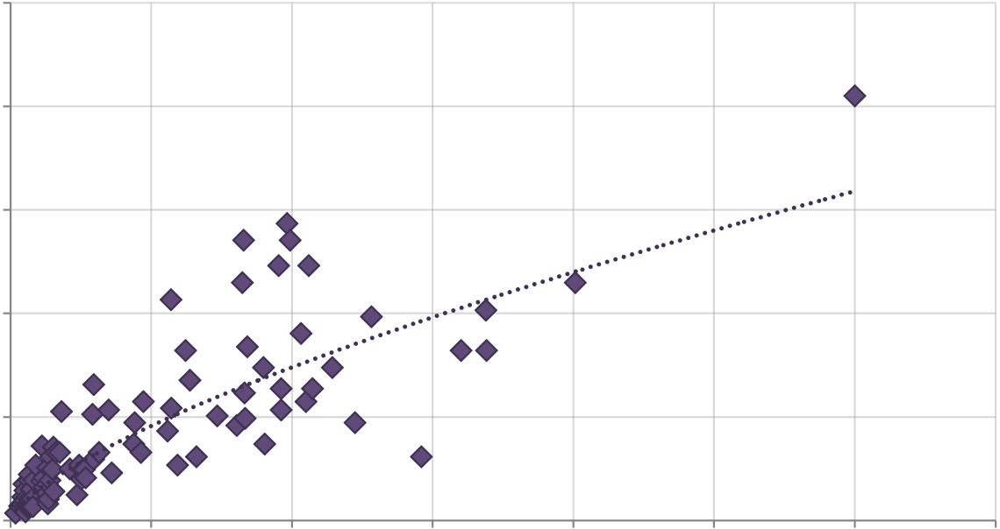
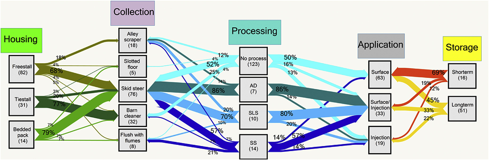
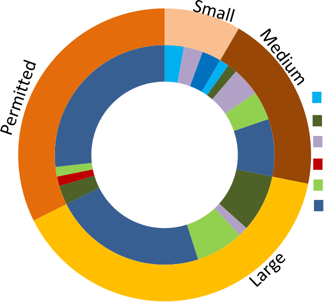
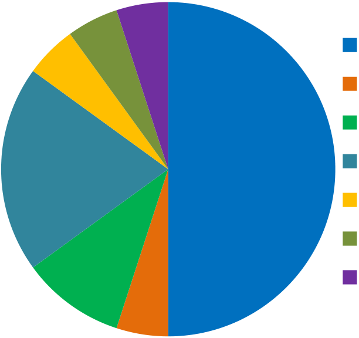
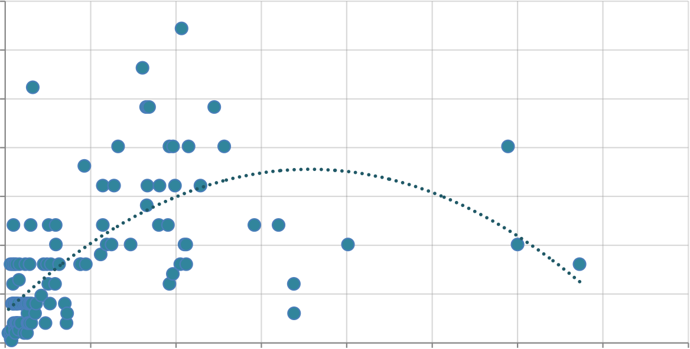

Ammonia barn floor
==================

|image1|\ |image2|

e

+-----------------------+-----------------------+-----------------------+
| |image3|              | Contents lists        |    .. ima             |
|                       | available at          | ge:: vertopal_dcfd979 |
|                       | ScienceDirect         | 257b249ffa73b2616c05b |
|                       |                       | 7255/media/image2.png |
|                       |                       |                       |
|                       |                       |     :width: 0.79028in |
|                       |                       |                       |
|                       |                       |    :height: 0.99306in |
+-----------------------+-----------------------+-----------------------+
|                       | Journal of Cleaner    |                       |
|                       | Production            |                       |
+-----------------------+-----------------------+-----------------------+
|                       | journal homepage:     |                       |
+-----------------------+-----------------------+-----------------------+
|                       |                       |                       |
+-----------------------+-----------------------+-----------------------+

..

   Evaluating greenhouse gas emissions from dairy manure management
   practices using survey data and lifecycle tools

   Horacio A. Aguirre-Villegas*, Rebecca A. Larson

   Department of Biological Systems Engineering, University of
   Wisconsin-Madison, 460 Henry Mall, Madison, WI 53706, United States

+-----------------------------------+-----------------------------------+
| a r t i c l e i n f o             |    a b s t r a c t                |
+===================================+===================================+
| Article history:                  |    Manure is the second largest   |
| Received 28 June 2016             |    source of greenhouse gas (GHG) |
| Received in revised form          |    emissions from dairy farms.    |
| 23 November 2016                  |    Detailed data for              |
| Accepted 23 December 2016         |    representative manure systems  |
| Available online 27 December 2016 |    are needed to guide climate    |
|                                   |    change mitigation strategies.  |
|                                   |    This study uses surveys sent   |
|                                   |    to WI dairies to identify      |
|                                   |    current farm and manure        |
|                                   |    management practices, collect  |
|                                   |    in-ventory data on manure      |
|                                   |    handling and energy            |
|                                   |    consumption, compare practices |
|                                   |    based on farm size, and relate |
|                                   |    these practices to GHG         |
|                                   |    emissions. Results show that   |
|                                   |    manure systems and management  |
|                                   |    practices vary significantly   |
|                                   |    with farm size. For example,   |
|                                   |    larger farms handle liquid     |
|                                   |    manure and have long term      |
+-----------------------------------+-----------------------------------+
| Keywords:                         |    storage while small farms      |
| Dairy manure                      |    handle solid manure and        |
| Survey                            |    land-apply daily. Sand         |
| GHG emissions                     |    separation, solid-liquid       |
| NH3 emissions                     |    sep-aration (SLS), and         |
| Life cycle assessment             |    anaerobic digestion (AD) are   |
| Manure processing                 |    implemented only by the        |
|                                   |    surveyed facilities that are   |
|                                   |    large enough to require        |
|                                   |    permitting. Ammonia, biotic,   |
|                                   |    and fossil GHG emissions from  |
|                                   |    archetypes small, large, and   |
|                                   |    permitted facilities are       |
|                                   |    estimated using modeling       |
|                                   |    tools. For this, the most      |
|                                   |    common manure man-agement      |
|                                   |    practices identified by the    |
|                                   |    survey are analyzed. Results   |
|                                   |    (per cow, kg of milk, and ton  |
|                                   |    of manure) show that storing   |
|                                   |    liquid manure for long periods |
|                                   |    of time without processing     |
|                                   |    contributes the most to GHG    |
|                                   |    emissions. When implementing   |
|                                   |    manure processing, permitted   |
|                                   |    facilities are able to reduce  |
|                                   |    emissions                      |
+-----------------------------------+-----------------------------------+

..

   significantly, mostly through AD. Small farms keep their emissions
   lower than large farms as they mostly handle solid manure and
   land-apply manure daily. Depending on the practice and farm size, GHG
   emissions per ton of manure range from 2200 to 12,000 g CO2-eq for
   collection, 200 to 2400 g CO2-eq for transportation, 16,000 to 84,000
   g CO2-eq for storage, and 16,400 to 33,500 g CO2-eq for
   land-application.

   Published by Elsevier Ltd. This is an open access article under the
   CC BY-NC-ND license ().

+-----------------------------------+-----------------------------------+
| 1. Introduction                   | Controlling the amount and timing |
|                                   | of manure application to          |
+===================================+===================================+
+-----------------------------------+-----------------------------------+

croplands prevents nutrient buildup and posterior contamination

   Manure is the second largest source of greenhouse gas (GHG) emissions
   on a dairy farm after enteric methane (CH4) and is responsible for 7%
   of both agricultural CH4 and nitrous oxide (N2O) emissions (USEPA,
   2006). Volatilized ammonia (NH3) from manure, which can reach up to
   70% of excreted nitrogen (N), can travel long distances and deposit
   into water and terrestrial ecosystems or transform into N2O
   emissions, contributing to both eutrophication and climate change
   (Hristov et al., 2002). Over application of manure can lead to water
   contamination due to nutrient buildup and subsequent loss and
   transportation to groundwater or surface water (Burkholder et al.,
   2007).

   Proper design, siting, and sizing of storage structures help pre-vent
   manure losses to the environment (Krapac et al., 2002).

   \* Corresponding author.

   E-mail address: (H.A. Aguirre-Villegas).

   of water streams (Gonzalez et al., 2009). NH3 losses can be
   mini-mized by covering storage systems (Rotz and Oenema, 2006) and by
   injecting manure, reducing NH3 emissions by more than 70% after
   land-application (Hristov et al., 2011). Manure processing such as
   solid-liquid separation (SLS) and anaerobic digestion (AD) can
   increase the value of manure streams. SLS effectively removes
   nu-trients, particularly phosphorus (P), along with the manure solids
   that can be used as fertilizer or bedding (Hjorth et al., 2009). AD
   can reduce GHG emissions related to manure management by more than
   50%, mostly in the form of CH4 during storage (Amon et al., 2006).
   When producing electricity through AD, GHG emissions can be further
   reduced by replacing on-farm fossil fuel-based processes
   (Aguirre-Villegas et al., 2015a).

   Due to their large size and increased manure production, permitted
   farms (concentrated animal operations that are regu-lated due to
   their size >1000 animal units, AU) have a greater

   0959-6526/Published by Elsevier Ltd. This is an open access article
   under the CC BY-NC-ND license ().

170 H.A. Aguirre-Villegas, R.A. Larson / Journal of Cleaner Production
143 (2017) 169e179

potential to cause environmental problems than smaller farms. However,
some studies suggested that economies of scale and efficient management
could put large farms in a better environ-mental position (Saam et al.,
2005). Regardless of size, it is evident that regions with high animal
populations, such as Wisconsin (WI), play an important role in
protecting the environment from air and water pollution. It is important
to understand the representative

   specific information on machinery power and time of operation has
   been collected to determine electricity and fuel consumption. To
   standardize responses, density of manure is assumed to be 1000 kg/
   m3for liquid manure, and calculated at 20%, 15%, and 10% total solids
   (TS) for solid, semi-solid, and slurry manure respectively (Equation
   A.1 in the Appendices). The manure characteristics used in this study
   are presented in Table C.1 (Aguirre-Villegas et al.,

characteristics of the variety of dairy farms and link the adopted
2015b).

manure management practices to GHG emissions to develop rec- A total of
143 dairy farmers provided information for analysis.

ommendations and policies that limit environmental risks The majority of
respondents were distributed across the North East

(McCann et al., 2015).

Dairy farm surveys concerning management practices have been conducted
in the U.S. Meyer et al. (2011) found that most farms have freestalls
for housing and collect manure thorough daily scraping in California.
Dou et al. (2001) reported different fre-quency and manure collection
methods among animal types in Pennsylvania. As one of the most important
dairy producing states in the U.S., WI has been proactive in conducting
surveys. Bewley et al. (2001) targeted freestall dairies and focused on
manure collection, bedding, and feed delivery. Cabot et al. (2004)
explored the impact of cattle operations on odor and traffic. Powell et
al. (2005) surveyed 54 dairy farms across the major soil types to
determine the amount of excreted, collected, and uncollected manure N
and P. Rowbotham and Ruegg (2015) surveyed 325 dairy farms to identify
associations between bedding and milk quality.

Dairy farm practices have been studied, but still, there is a need to
develop more specific and detailed up-to-date data. These data are
fundamental for lifecycle assessment (LCA) studies and process models
that guide policy targets. Specific information, not only regarding
manure practices, but other variables such as energy, are needed for
these studies as they are responsible for on-farm fossil GHG emissions.
The dairy industry is changing fast. Larger and more technological farms
are being created in response to market and environmental challenges.
Policymakers need updated and representative information related to farm
practices to adjust to these changes. This study has the objectives of
i) identifying current manure management practices through a survey sent
to WI dairy farms; ii) collecting inventory data on energy, and
machinery use; iii) comparing practices based on farm size; and iv)
relating prac-tices to GHG emissions.

   (35%) and West Central regions of WI (30%) (Fig. B1). The response
   rate was 21% and 5% for permitted and non-permitted facilities,
   respectively. The low response rate for the latter could be explained
   by limited internet access and the fact that postcards were sent to
   dairy farms only once (Buttel et al., 2000). For analysis, farms are
   classified according to their size in terms of AU into small (1-99
   AU), medium (100-199 AU), large (200-999 AU) and permitted facilities
   (�1000 AU), based on the reported body weight and animal pop-ulation
   (Table C.2). Median values are reported throughout the text as it
   provides a better estimate of the central tendency than the mean due
   to the relatively small sample size and skewness of the data; and
   mean, median, minimum, and maximum values are reported in the survey
   result tables (Tables C2 to C7). Both the Pearson chi-squared and the
   continuity corrected Pearson chi-squared tests (StataCorp, 2011) are
   conducted for each survey question (see notes of Tables C2 to C.7) to
   evaluate if the medians across farm size groups are statistically
   different (p < 0.005) from each other. This statistical analysis is
   most representative for permitted facilities given that 21% of the
   population of 240 facilities responded to the survey. Responses
   reached 5%, 2%, and 0.2% of the 962 large farms, 1584 medium farms,
   and 8277 farms small farms in WI respectively (USDA-NASS, 2012).
   Results are presented for all four groups of farms but inferences for
   small and medium farms have to be made with caution due to the small
   sample size.

   2.2. Estimation of GHG and NH3 emissions from manure management
   practices using partial LCA tools

   A partial LCA model, outlined in detail in Aguirre-Villegas et al.

+-----------------------------------+-----------------------------------+
| 2. Methods                        |    (2014), was used to estimate   |
|                                   |    GHG and NH3 emissions from     |
|                                   |    biotic and fossil sources      |
|                                   |    during manure collection,      |
|                                   |    transportation, pro-           |
+===================================+===================================+
+-----------------------------------+-----------------------------------+

cessing, storage, and land-application. This model encompasses all

Two steps are adopted to relate GHG emissions to manure management
practices. First, a survey sent to WI dairy farms was used to collected
primary data on manure handling, machinery power, and time of operation.
Second, modeling tools were used to estimate NH3 and GHG emissions based
on these survey data and the equations related to manure presented in
the Integrated Farm System Model (IFSM) (Rotz et al., 2015).

2.1. Farm selection and survey description

An anonymous online survey consisting of 106 questions divided into
general farm and manure management practices was sent to: i) permitted
facilities housing more than 1000 AU (1 AU ¼ 1000 pounds ¼ 454 kg) and,
ii) non-permitted facilities. The entire permitted facility population
(240 farms) was invited to participate in the study (DNR, 2012). Nearly
2000 non-permitted facilities, out of the 11,063 registered at DATCP
(2012), were randomly selected and invited to participate in the study.
General farm practices include housing, land for manure application, and
milk production. The manure section includes collection,
trans-portation, storage, and land application; anaerobic digestion
(AD), solid-liquid separation (SLS), and sand separation (SS). Finally,

   unit-processes from manure excretion to land-application. The model
   applies literature emission factors and equations related to manure
   presented in Rotz et al. (2015) to estimate biotic CH4, N2O and NH3
   from manure and relates energy consumption to estimate fossil GHG
   emissions. By using the equations related to manure in this study,
   the specificities of each manure management practice and the local
   conditions of WI are captured, facilitating the com-parisons among
   farm sizes and practices.

   A detailed explanation of the factors and assumptions used to
   estimate GHG and NH3 emissions is presented in Table 1. During
   collection, CH4 emissions from manure in the barn depend on ambient
   temperature and surface area exposed to manure. N2O emissions are
   estimated with experimental emission factors. NH3 emissions depend on
   ammoniacal N, pH, temperature, and surface area. For manure storage,
   CH4 emissions are differentiated for solid and liquid manure. A
   natural crust is assumed to form on top of the storage for
   unprocessed manure, but no crust is formed with pro-cessed manure as
   TS are reduced (Rotz et al., 2015). When no crust is formed, no N2O
   emissions from liquid manure are assumed (IPCC, 2006a). NH3 emissions
   are also affected by this crust formation and depend on the
   ammoniacal N content in manure. Mineralization rates of 5.2% and
   16.5% for solid and liquid manure are assumed

   H.A. Aguirre-Villegas, R.A. Larson / Journal of Cleaner Production
   143 (2017) 169e179 171

Table 1

Description of emission factors from biotic and fossil sources.

+-----------------------+-----------------------+-----------------------+
|    Emission and       |    Equation           |    Reference          |
|    Source             |                       |                       |
+=======================+=======================+=======================+
|    CH4                |    | CH4 ¼ maxð0;     |    (Chianese et al.,  |
|                       |      0:13*TÞ*Abarn    |    2009)              |
|                       |    | CH4 ¼ methane    |                       |
|                       |      emissions from   |                       |
|                       |      barn (kg         |                       |
|                       |      CH4/day); Abarn  |                       |
|                       |      ¼ area exposed   |                       |
|                       |      to manure (m2)   |                       |
|                       |                       |                       |
|                       |    CH4 ¼��24*VSd*b1   |                       |
|                       |                       |                       |
|                       |    1000 �*e�lnðAÞ�E   |                       |
|                       |    RT ��þ��24*VSnd*b2 |                       |
|                       |                       |                       |
|                       |    1000 �*e�lnðAÞ�E   |                       |
|                       |    RT ��              |                       |
|                       |                       |                       |
|                       |    | CH4 ¼ methane    |                       |
|                       |      emissions from   |                       |
|                       |      storage (g       |                       |
|                       |      CH4/day); VSd ¼  |                       |
|                       |      degradable VS    |                       |
|                       |      (g); VSnd ¼ non  |                       |
|                       |      degradable VS    |                       |
|                       |      (g); b1 and b2 ¼ |                       |
|                       |      rate correcting  |                       |
|                       |    | factors (b1 ¼ 1, |                       |
|                       |      b2 ¼ 0.01); A ¼  |                       |
|                       |      Arrhenius        |                       |
|                       |      parameter (g     |                       |
|                       |      CH4/kgVS/h);     |                       |
|                       |      ln(A) ¼ 43.33; E |                       |
|                       |      ¼ Apparent       |                       |
|                       |      activation       |                       |
|                       |      energy (112,700  |                       |
|                       |      J/mol);          |                       |
|                       |    | R ¼ constant     |                       |
|                       |      (8.314 J/K/mol); |                       |
|                       |      T ¼ Temperature  |                       |
|                       |      (K)              |                       |
|                       |                       |                       |
|                       |    | CH4              |                       |
|                       |                       |                       |
|                       |   ¼\ *VS*Bo*0:68*MCF* |                       |
|                       |    | CH4 ¼ methane    |                       |
|                       |      emissions from   |                       |
|                       |      manure solids    |                       |
|                       |      (kg CH4/day);    |                       |
|                       |    | Bo ¼ maximum     |                       |
|                       |      methane          |                       |
|                       |      producing        |                       |
|                       |      capacity (0.23   |                       |
|                       |      m3CH4/kg VS);    |                       |
|                       |    | 0.67 ¼           |                       |
|                       |      conversion       |                       |
|                       |      factor; MCF ¼    |                       |
|                       |      CH4 conversion   |                       |
|                       |      factor (0.201 �  |                       |
|                       |      Tm e 0.29, %),   |                       |
|                       |      Tm ¼ temperature |                       |
|                       |      (�C) CH4 ¼       |                       |
|                       |      ½ð0:17*FVFAÞ þ   |                       |
|                       |                       |                       |
|                       |    0:026�*Acrop*0:032 |                       |
|                       |    | CH4 ¼ methane    |                       |
|                       |      from application |                       |
|                       |      (kg CH4/day);    |                       |
|                       |    | FVFA ¼ volatile  |                       |
|                       |      fatty acids      |                       |
|                       |      (mmol/kg         |                       |
|                       |      manure); Acrop ¼ |                       |
|                       |      area of          |                       |
|                       |      application (Ha) |                       |
+-----------------------+-----------------------+-----------------------+
|    Manure on barn     |                       |                       |
|    floora,b           |                       |                       |
+-----------------------+-----------------------+-----------------------+
|    Manure storage     |                       |    (Chianese et al.,  |
|    liquida            |                       |    2009)              |
+-----------------------+-----------------------+-----------------------+
|    Manure storage     |                       |    (Rotz et al.,      |
|    solida             |                       |    2015)              |
+-----------------------+-----------------------+-----------------------+
|    Manure             |                       |    (Chianese et al.,  |
|    applicationc       |                       |    2009)              |
+-----------------------+-----------------------+-----------------------+
|    N2O direct         |                       |                       |
+-----------------------+-----------------------+-----------------------+
|    Manure on barn     |    5.4E�5g N2O/kg of  |    (Wheeler et al.,   |
|    floor              |    manure             |    2008)              |
+-----------------------+-----------------------+-----------------------+
|    Manure storage     |    0.005 kg N2OeN/kg  |    (IPCC, 2006a)      |
|                       |    of N solid and     |                       |
|                       |    liquid manure      |                       |
+-----------------------+-----------------------+-----------------------+
|    Manure application |    0.01 kg N2OeN/kg   |    (IPCC, 2006b)      |
|                       |    of N applied after |                       |
|                       |    NH3 losses         |                       |
+-----------------------+-----------------------+-----------------------+
|    N2O indirect       |                       |    (IPCC, 2006a)      |
+-----------------------+-----------------------+-----------------------+
|                       |    0.01 kg N2OeN/kg   |                       |
|                       |    NH3eN              |                       |
+-----------------------+-----------------------+-----------------------+
|    Ammonia            |                       |                       |
|    volatilization     |                       |                       |
+-----------------------+-----------------------+-----------------------+
|    Leached nitrogend  |    0.0075 kg N2OeN/kg |    (IPCC, 2006b)      |
|                       |    of leached N       |                       |
+-----------------------+-----------------------+-----------------------+

..

   NH3

+-----------------------+-----------------------+-----------------------+
|    Manure on barn     |    | TAN*c*y          |    (Rotz and Oenema,  |
|                       |    | NH3              |    2006)              |
|                       |      volatilization ¼ |                       |
|                       |      r*M*Q            |                       |
|                       |                       |                       |
|                       |    | NH3 ¼ ammonia    |                       |
|                       |      emissions NH3eN  |                       |
|                       |      (kg/m2/d); TAN ¼ |                       |
|                       |      total ammonia    |                       |
|                       |      nitrogen in      |                       |
|                       |      manure (kg       |                       |
|                       |      N/m2); c ¼ time  |                       |
|                       |      conversion       |                       |
|                       |      (86,400 s/d);    |                       |
|                       |    | y ¼ manure       |                       |
|                       |      density (kg/m3); |                       |
|                       |      r ¼ resistance   |                       |
|                       |      of NH3 transport |                       |
|                       |      to the           |                       |
|                       |      atmosphere       |                       |
|                       |      (s/m),           |                       |
|                       |    | r barn ¼ HSC     |                       |
|                       |      [1e0.027         |                       |
|                       |      (20-T)],         |                       |
|                       |    | HSC ¼ housing    |                       |
|                       |      specific         |                       |
|                       |      constant (260    |                       |
|                       |      s/m), r storage  |                       |
|                       |      ¼ 75 (manure     |                       |
|                       |      with crust),     |                       |
|                       |    | 19 (manure       |                       |
|                       |      without crust),  |                       |
|                       |      10 (solid        |                       |
|                       |      manure);         |                       |
+=======================+=======================+=======================+
|    floor/storage      |                       |                       |
+-----------------------+-----------------------+-----------------------+
|    Manure application |    | M ¼ manure urine |    (Jokela et al.,    |
|                       |      per area of      |    2004)              |
|                       |      exposed surface  |                       |
|                       |      (kg/m2); Q ¼     |                       |
|                       |      equilibrium      |                       |
|                       |      coefficient ¼ Kh |                       |
|                       |      � Ka, Kh ¼ 10    |                       |
|                       |      [1478/(T þ 273)  |                       |
|                       |      � 1.69],         |                       |
|                       |    | Ka ¼ 1 þ 10      |                       |
|                       |      [0.09018 þ       |                       |
|                       |      2729.9/(T þ 273) |                       |
|                       |      e pH], T ¼       |                       |
|                       |      manure           |                       |
|                       |      temperature      |                       |
|                       |      (�C), pH ¼       |                       |
|                       |      manure acidity   |                       |
|                       |                       |                       |
|                       |    NH3 ¼              |                       |
|                       |    TAN*��20þ5*TSÞ\*   |                       |
|                       |                       |                       |
|                       |    100�daysþ0:3 days  |                       |
|                       |    ��*ð17 14Þ         |                       |
|                       |                       |                       |
|                       |    | NH3 ¼ emissions  |                       |
|                       |      after            |                       |
|                       |      application (kg  |                       |
|                       |      NH3); TAN ¼      |                       |
|                       |      total ammonia N  |                       |
|                       |      in manure (kg    |                       |
|                       |      NH3eN); TS ¼     |                       |
|                       |      total solids in  |                       |
|                       |      manure (%);      |                       |
|                       |    | days ¼ to        |                       |
|                       |      incorporate      |                       |
|                       |      manure (if not   |                       |
|                       |      incorporated,    |                       |
|                       |      days >7)         |                       |
+-----------------------+-----------------------+-----------------------+
|    CO2-eq             |                       |    (PE International, |
|                       |                       |    2012)              |
+-----------------------+-----------------------+-----------------------+
|    Electricity        |    0.84 kg CO2-eq/kWh |                       |
+-----------------------+-----------------------+-----------------------+
|    Diesel fuel        |    0.45 kg CO2-eq/l   |    (PE International, |
|                       |    for production     |    2012)              |
|                       |    2.69 kg CO2-eq/l   |                       |
|                       |    for combustion     |                       |
+-----------------------+-----------------------+-----------------------+

..

   a Average daily temperatures for WI were used for the years
   2007e2014.

   b Alley area is 2.5 m2 for growing heifers and 3.5 m2 for milking
   cows and mature animals (Rotz et al., 2015a,b).

   c 0.14 Ha/day for small farms, 0.54 Ha/day for large farms, and 2.02
   Ha/day for permitted facilities.

   d 30% of applied N is leached in WI (IPCC, 2006b).

during storage (Rotz et al., 2015). For manure application, CH4
emissions occur primarily during the first days after application (Rotz
et al., 2015). N2O is emitted directly from manure and indi-rectly from
N volatilization and leaching (IPCC, 2006a; 2006b) and NH3 emissions are
highly dependent on the time of incorporation (Jokela et al., 2004).
Finally, fossil emissions come from electricity and diesel fuel
production and consumption, which are estimated based on the
quantitative data on power and operation time collected in the survey.
The electricity matrix of WI was modeled using the LCA software GaBi (PE
International, 2012).

GHG emissions are characterized for a 100-year time horizon and measured
in kilograms of carbon dioxide equivalents (kg CO2-eq). Characterization
factors are 264 kg CO2-eq for N2O and 28 kg CO2-eq for biotic CH4 based
on the latest Intergovernmental Panel on Climate Change (IPCC) report
(Myhre et al., 2013). Biotic CO2 is not quantified as it is assumed that
the carbon contained in manure has been previously captured by the crops
that are part of the dairy diet. In addition, emissions and energy
related to fertilizers and bedding production and use are not included
in the analysis. GHG

   and NH3 emissions are reported per ton (1000 kg) of manure, per AU,
   and per kg of milk and are related to the most common manure
   management practices reported in the survey. Three representative
   farms were modeled: a small farm (75 AU) handling 1.8 ton solid
   manure/day, a large farm (425 AU) handling 21.7 ton liquid manure/
   day, and a permitted facility (2000 AU) handling 140 ton liquid
   manure/day to compare impacts at each scale. Emissions are aggregated
   for the most representative practices to determine total NH3 and GHG
   emissions for each farm size (reference scenario). In addition, two
   scenarios with low and high GHG emitting practices for each farm size
   are modeled to analyze potential mitigation strategies (high and low
   emitting scenarios).

   3. Results and discussion

   3.1. Survey results

   Survey results and statistical analyses among farm groups are
   summarized in the Appendices section (Tables C2 to C.7) and are

172 H.A. Aguirre-Villegas, R.A. Larson / Journal of Cleaner Production
143 (2017) 169e179

expressed as a total and per AU when possible.

| 3.1.1. Housing, land, and milk production
| Small and medium farms handle mostly solid manure and have tiestalls
  for housing, whereas large and permitted facilities handle slurry and
  liquid manure and have freestalls (Fig. B2). Number of animals per
  barn and barn characteristics are presented in Table C.3. In terms of
  land, results for manure applied in owned and rented land suggest that
  smaller farms have more land per AU than larger farms (Table C.4).
  According to Powell et al. (2001), 0.71 Ha/ cow are required for
  recycling manure P excreted by a cow. As re-ported, neither large
  farms nor permitted facilities have the suffi-

+-----------+-----------+-----------+-----------+-----------+-----------+
| cient     | to        | recycle   | excreted  | (Table    | C.4),     |
| land      | agro      |           | P         |           |           |
|           | nomically |           |           |           |           |
+===========+===========+===========+===========+===========+===========+
+-----------+-----------+-----------+-----------+-----------+-----------+

suggesting that land is not increasing proportionally to the number of
cows as farms grow (Fig. 1). Finally, milk production increases with
farm size with an overall median of 36.3 kg/cow/day (Table C.4). The
difference is significant among farm size groups and can be explained by
the diverse feeding strategies, where larger farms usually benefit from
the advice of a nutritionist. Knowing milk production rates and
characteristics is important as it is often used as a functional unit in
dairy modeling studies.

3.1.2. Manure management

+---------+---------+---------+---------+---------+---------+---------+
| Handled | manure  | in      | consi   | with    | farm    | size    |
|         |         | creases | derably |         |         |         |
+=========+=========+=========+=========+=========+=========+=========+
+---------+---------+---------+---------+---------+---------+---------+

(Table C.5). One of the drivers for this difference is the TS content of
manure at each farm size group as there is more opportunity for runoff
or additional waste water to be mixed with manure at larger farms.
Nearly 80% of permitted facilities handle liquid manure while 70% of
small farms handle solid manure (Fig. 2). Both manure form and volume
have direct implications on GHG emissions. For example, solid manures
have less available water and are usually stored in stock piles that
promote aeration, which reduces CH4 emissions. Liquid manures are stored
on pits that promote anaer-obic conditions, increasing CH4 emissions.
Larger dilutions of manure imply larger manure volumes to be handled,
which affects GHG emissions due to increased energy consumption.

3.1.2.1. Manure collection. Manure is mostly collected from the barn on
a daily basis and continuous collection is more common as farm size
increases (Table C.5). Gutter and barn cleaners are more often found at
small and medium farms; while skid steers are preferred by large farms
and permitted facilities (Fig. 4a). The di-versity of manure collection
methods increases with farm size, as the costs of more automated
systems, such as alley scrapers, is

2500

2000

   likely justifiable in larger farms. The housing type also impacts the
   manure collection method, as there is a 70% probability that those
   with a freestall barn collect manure with a skid steer, while 77% of
   those with tiestall barns collect manure with a barn cleaner (Fig.
   3). Median results for collection frequency, skid steer power size,
   and diesel efficiency are consistent among farm sizes, but as
   expected, operation time significantly increases as farm size
   increases when results are expressed at a farm-level (Table C.5). At
   an AU-level, skid steer time of operation is consistent among farms
   groups, but there is a significant difference in terms of power and
   energy consump-tion, suggesting higher energy efficiencies in larger
   farms due to economies of scale (Table C.6). Alley scrapers show
   longer opera-tion times but smaller power capacities and overall
   energy con-

+--------+--------+--------+--------+--------+--------+--------+--------+
| su     | AU     | than   | skid   | steer  | sy     | sugg   | that   |
| mption |        |        |        |        | stems, | esting |        |
| per    |        |        |        |        |        |        |        |
+========+========+========+========+========+========+========+========+
+--------+--------+--------+--------+--------+--------+--------+--------+

..

   mechanical systems are more energy efficient than diesel tractor
   systems as the former can adjust their power size requirements more
   easily. Higher energy efficiencies of the collection system result in
   lower GHG emissions from fossil fuel combustion.

   3.1.2.2. On-farm manure transportation. Thirty-four facilities store
   manure temporarily in reception pits, with shorter retention times
   for permitted facilities (Table C.5). After collection or temporary
   storage, manure is mostly transported to processing and long term
   storage in permitted facilities, to long term storage in large and
   medium farms, and directly to land application in small farms (Fig.
   4b). These practices suggest that investment in storage
   infra-structure and manure processing are more common in larger
   farms. A description of the transportation method and frequency per
   farm size is presented in Fig. 5a and b. Even though frequency
   increases with farm size, operation time and energy consumption per
   AU are lower for large and permitted facilities suggesting economies
   of scale in energy consumption (Table C.6).

   3.1.2.3. Manure storage. Below ground concrete and clay lined earthen
   basins are the most common systems among the farms that reported
   having long term storage (Fig. 4c). Larger surface areas have direct
   implications on NH3 emissions as there is more op-portunity for
   volatilization. Storage measurements (Table C.5) show that even
   though there are statistical differences in width and length, surface
   area and depth are consistent across farm sizes. Permitted facilities
   have multiple storage systems, a wider variety of system types, and
   higher storage adoption rates than small farms. Even though larger
   farms handle larger manure volumes, this difference reinforces the
   economic barriers that small farms

+-----------------------+-----------------------+-----------------------+
| **Land (Ha)**         |    1500               | y = 3.6971x0.6971     |
+=======================+=======================+=======================+
|                       |    1000               |                       |
+-----------------------+-----------------------+-----------------------+
|                       |                       | R² = 0.7945           |
+-----------------------+-----------------------+-----------------------+

..

   500

   0

+--------+--------+--------+--------+--------+--------+--------+--------+
| 0      | 1000   | 2000   |        | 4000   | 5000   | 6000   |        |
|        |        |        | | 3000 |        |        |        |   7000 |
|        |        |        |    |   |        |        |        |        |
|        |        |        | **AU** |        |        |        |        |
+========+========+========+========+========+========+========+========+
+--------+--------+--------+--------+--------+--------+--------+--------+

Fig. 1. Total farm land area per animal unit (AU).

|image4|\ |image5|\ |image6|\ |image7|\ |image8|\ |image9|\ |image10|\ |image11|

+-------+-------+-------+-------+-------+-------+-------+-------+-------+
|       |       |       |       |       |       |       |       | 173   |
|  H.A. |       |       |       |       |       |       |       |       |
|    Ag |       |       |       |       |       |       |       |       |
| uirre |       |       |       |       |       |       |       |       |
| -Vill |       |       |       |       |       |       |       |       |
| egas, |       |       |       |       |       |       |       |       |
|       |       |       |       |       |       |       |       |       |
|  R.A. |       |       |       |       |       |       |       |       |
|    L  |       |       |       |       |       |       |       |       |
| arson |       |       |       |       |       |       |       |       |
|    /  |       |       |       |       |       |       |       |       |
|    Jo |       |       |       |       |       |       |       |       |
| urnal |       |       |       |       |       |       |       |       |
|    of |       |       |       |       |       |       |       |       |
|    Cl |       |       |       |       |       |       |       |       |
| eaner |       |       |       |       |       |       |       |       |
|       |       |       |       |       |       |       |       |       |
| Produ |       |       |       |       |       |       |       |       |
| ction |       |       |       |       |       |       |       |       |
|       |       |       |       |       |       |       |       |       |
|   143 |       |       |       |       |       |       |       |       |
|    (  |       |       |       |       |       |       |       |       |
| 2017) |       |       |       |       |       |       |       |       |
|    16 |       |       |       |       |       |       |       |       |
| 9e179 |       |       |       |       |       |       |       |       |
+=======+=======+=======+=======+=======+=======+=======+=======+=======+
| +---+ |       |       | +---+ |       | 4%    |       |    *  |       |
| | 1 | |       |       | | 2 | |       |       |       | *Mul� |       |
| | 8 | |       |       | | 6 | |       |       |       | ple** |       |
| | % | |       |       | | % | |       |       |       |       |       |
| +===+ |       |       | +===+ |       |       |       |       |       |
| +---+ |       |       | +---+ |       |       |       |       |       |
+-------+-------+-------+-------+-------+-------+-------+-------+-------+
| 13%   |       | +---+ | 30%   |       | 80%   |       |       |       |
|       |       | | 1 | |       |       |       |       | **Liq |       |
|       |       | | 8 | |       |       |       |       | uid** |       |
|       |       | | % | |       |       |       |       |       |       |
|       |       | +===+ |       |       |       |       |       |       |
|       |       | +---+ |       |       |       |       |       |       |
+-------+-------+-------+-------+-------+-------+-------+-------+-------+
|       |       |       |       |       |       |       |    ** |       |
|       |       |       |       |       |       |       | (1-7% |       |
|       |       |       |       |       |       |       |       |       |
|       |       |       |       |       |       |       | TS)** |       |
+-------+-------+-------+-------+-------+-------+-------+-------+-------+
| 6%    |       | +---+ | 30%   |       | 13%   |       |       |       |
|       |       | | 1 | |       |       |       |       | **Slu |       |
|       |       | | 8 | |       |       |       |       | rry** |       |
|       |       | | % | |       |       |       |       |       |       |
|       |       | +===+ |       |       |       |       |       |       |
|       |       | +---+ |       |       |       |       |       |       |
+-------+-------+-------+-------+-------+-------+-------+-------+-------+
|       |       |       |       |       |       |       |       |       |
|       |       |       |       |       |       |       |   **( |       |
|       |       |       |       |       |       |       | 8-12% |       |
|       |       |       |       |       |       |       |       |       |
|       |       |       |       |       |       |       | TS)** |       |
+-------+-------+-------+-------+-------+-------+-------+-------+-------+
| 13%   |       | +---+ | 13%   |       |       |       |       |       |
|       |       | | 3 | |       |       |       |       |  **Se |       |
|       |       | | 9 | |       |       |       |       | mi-so |       |
|       |       | | % | |       |       |       |       | lid** |       |
|       |       | +===+ |       |       |       |       |       |       |
|       |       | +---+ |       |       |       |       |       |       |
+-------+-------+-------+-------+-------+-------+-------+-------+-------+
|       |       |       |       |       |       |       |       |       |
|       |       |       |       |       |       |       |   **1 |       |
|       |       |       |       |       |       |       | 3-19% |       |
|       |       |       |       |       |       |       |       |       |
|       |       |       |       |       |       |       | TS)** |       |
+-------+-------+-------+-------+-------+-------+-------+-------+-------+
| 69%   |       | +---+ | 2%    |       | .. i  |       |       |       |
|       |       | | 7 | |       |       | mage: |       |  **So |       |
|       |       | | % | |       |       | : ver |       | lid** |       |
|       |       | +===+ |       |       | topal |       |       |       |
|       |       | +---+ |       |       | _dcfd |       |       |       |
|       |       |       |       |       | 97925 |       |       |       |
|       |       |       |       |       | 7b249 |       |       |       |
|       |       |       |       |       | ffa73 |       |       |       |
|       |       |       |       |       | b2616 |       |       |       |
|       |       |       |       |       | c05b7 |       |       |       |
|       |       |       |       |       | 255/m |       |       |       |
|       |       |       |       |       | edia/ |       |       |       |
|       |       |       |       |       | image |       |       |       |
|       |       |       |       |       | 6.png |       |       |       |
|       |       |       |       |       |    :w |       |       |       |
|       |       |       |       |       | idth: |       |       |       |
|       |       |       |       |       |  0.13 |       |       |       |
|       |       |       |       |       | 889in |       |       |       |
|       |       |       |       |       |       |       |       |       |
|       |       |       |       |       |   :he |       |       |       |
|       |       |       |       |       | ight: |       |       |       |
|       |       |       |       |       |  0.13 |       |       |       |
|       |       |       |       |       | 889in |       |       |       |
|       |       |       |       |       |       |       |       |       |
|       |       |       |       |       | 2%    |       |       |       |
+-------+-------+-------+-------+-------+-------+-------+-------+-------+
|       |       |       |       |       |       |       |    ** |       |
|       |       |       |       |       |       |       | (>20% |       |
|       |       |       |       |       |       |       |       |       |
|       |       |       |       |       |       |       | TS)** |       |
+-------+-------+-------+-------+-------+-------+-------+-------+-------+
| Small | M     |       |       | Large |       | Per   |       |       |
|       | edium |       |       |       |       | mi�ed |       |       |
+-------+-------+-------+-------+-------+-------+-------+-------+-------+
| (     | (100  |       |       | (200  |       | (>=   |       |       |
| 1-99) | -199) |       |       | -999) |       | 1000) |       |       |
+-------+-------+-------+-------+-------+-------+-------+-------+-------+
| **n = |       | **n = | **n = |       | **n = |       |       |       |
| 16**  |       | 28**  | 47**  |       | 45**  |       |       |       |
+-------+-------+-------+-------+-------+-------+-------+-------+-------+

Fig. 2. Type of manure being handled at small, medium, large, and
permitted dairy facilities.

Fig. 3. Probabilities (%) of adopting a manure management practice
(rectangular boxes) given the adoption of another practice. Values in
parenthesis represent number of farms. Totals <100% indicate missing
values.

face to invest in infrastructure. Agitation was reported by 77 farms
that mostly use PTO tractors, pumps and boats (Table C.6). Energy
consumption for agitation per AU is lower in larger farms and pump
systems are more energy efficient than PTO in small and medium farms.
However, the energy consumption of these systems is similar as farms get
larger. Using storage covers was not reported, but 25 farms reported
natural crust formation, which has direct implications on GHG and NH3
emissions. None of the farms with processing systems described crust
formation as TS are reduced with AD, SLS, and SS.

3.1.2.4. Manure application. Permitted facilities land-apply manure in
spring and fall, whereas daily or weekly application is more common in
smaller farms (Fig. 6a). Hauling distance increases with farm size until
a point in the permitted facility group where it decreases (Fig. 7).
This decrease might be explained by larger farms having less land than
small farms per AU, which impacts hauling distance. Annual duration of
manure application increases signifi-cantly in larger farms as they deal
with larger manure volumes and

   crop planted areas (Table C.5). Surface broadcast is the most com-mon
   application method, followed by injection, and a combination of both
   methods (Fig. 4d). More specifically, tankers or broadcast spreaders
   are mostly used across all farm sizes with the exception of permitted
   facilities that use multiple application technologies simultaneously.
   Manure is incorporated at 24 farms immediately after or during
   application and at 43 farms after two days of application, which has
   proven to have direct implications on emissions (i.e. rapid
   incorporation reduces NH3 but increases N2O emissions). It is 12%
   probable that injection is used by farms adopting short-term storage
   versus a 69% probability of surface application (Fig. 3). Moreover,
   the probability of combining injec-tion and surface application in
   farms with processing is higher than the probability of adopting a
   single technology. A reduced number of producers (mostly large and
   permitted facilities) provided detailed information on power,
   application time, and energy con-sumption rates (Table C.6).
   Regardless of the application method or technology, the majority of
   farms combine pump and tractor/PTO systems.

+---+---+---+---+---+---+---+---+---+---+---+---+---+---+---+---+---+---+---+---+---+
| 1 | * | H |   |   |   |   |   |   |   |   |   |   |   |   |   |   |   |   |   |   |
| 7 | * | . |   |   |   |   |   |   |   |   |   |   |   |   |   |   |   |   |   |   |
| 4 | a | A |   |   |   |   |   |   |   |   |   |   |   |   |   |   |   |   |   |   |
|   | ) | . |   |   |   |   |   |   |   |   |   |   |   |   |   |   |   |   |   |   |
|   | * | A |   |   |   |   |   |   |   |   |   |   |   |   |   |   |   |   |   |   |
|   | * | g |   |   |   |   |   |   |   |   |   |   |   |   |   |   |   |   |   |   |
|   |   | u |   |   |   |   |   |   |   |   |   |   |   |   |   |   |   |   |   |   |
|   |   | i |   |   |   |   |   |   |   |   |   |   |   |   |   |   |   |   |   |   |
|   |   | r |   |   |   |   |   |   |   |   |   |   |   |   |   |   |   |   |   |   |
|   |   | r |   |   |   |   |   |   |   |   |   |   |   |   |   |   |   |   |   |   |
|   |   | e |   |   |   |   |   |   |   |   |   |   |   |   |   |   |   |   |   |   |
|   |   | - |   |   |   |   |   |   |   |   |   |   |   |   |   |   |   |   |   |   |
|   |   | V |   |   |   |   |   |   |   |   |   |   |   |   |   |   |   |   |   |   |
|   |   | i |   |   |   |   |   |   |   |   |   |   |   |   |   |   |   |   |   |   |
|   |   | l |   |   |   |   |   |   |   |   |   |   |   |   |   |   |   |   |   |   |
|   |   | l |   |   |   |   |   |   |   |   |   |   |   |   |   |   |   |   |   |   |
|   |   | e |   |   |   |   |   |   |   |   |   |   |   |   |   |   |   |   |   |   |
|   |   | g |   |   |   |   |   |   |   |   |   |   |   |   |   |   |   |   |   |   |
|   |   | a |   |   |   |   |   |   |   |   |   |   |   |   |   |   |   |   |   |   |
|   |   | s |   |   |   |   |   |   |   |   |   |   |   |   |   |   |   |   |   |   |
|   |   | , |   |   |   |   |   |   |   |   |   |   |   |   |   |   |   |   |   |   |
|   |   | R |   |   |   |   |   |   |   |   |   |   |   |   |   |   |   |   |   |   |
|   |   | . |   |   |   |   |   |   |   |   |   |   |   |   |   |   |   |   |   |   |
|   |   | A |   |   |   |   |   |   |   |   |   |   |   |   |   |   |   |   |   |   |
|   |   | . |   |   |   |   |   |   |   |   |   |   |   |   |   |   |   |   |   |   |
|   |   | L |   |   |   |   |   |   |   |   |   |   |   |   |   |   |   |   |   |   |
|   |   | a |   |   |   |   |   |   |   |   |   |   |   |   |   |   |   |   |   |   |
|   |   | r |   |   |   |   |   |   |   |   |   |   |   |   |   |   |   |   |   |   |
|   |   | s |   |   |   |   |   |   |   |   |   |   |   |   |   |   |   |   |   |   |
|   |   | o |   |   |   |   |   |   |   |   |   |   |   |   |   |   |   |   |   |   |
|   |   | n |   |   |   |   |   |   |   |   |   |   |   |   |   |   |   |   |   |   |
|   |   | / |   |   |   |   |   |   |   |   |   |   |   |   |   |   |   |   |   |   |
|   |   | J |   |   |   |   |   |   |   |   |   |   |   |   |   |   |   |   |   |   |
|   |   | o |   |   |   |   |   |   |   |   |   |   |   |   |   |   |   |   |   |   |
|   |   | u |   |   |   |   |   |   |   |   |   |   |   |   |   |   |   |   |   |   |
|   |   | r |   |   |   |   |   |   |   |   |   |   |   |   |   |   |   |   |   |   |
|   |   | n |   |   |   |   |   |   |   |   |   |   |   |   |   |   |   |   |   |   |
|   |   | a |   |   |   |   |   |   |   |   |   |   |   |   |   |   |   |   |   |   |
|   |   | l |   |   |   |   |   |   |   |   |   |   |   |   |   |   |   |   |   |   |
|   |   | o |   |   |   |   |   |   |   |   |   |   |   |   |   |   |   |   |   |   |
|   |   | f |   |   |   |   |   |   |   |   |   |   |   |   |   |   |   |   |   |   |
|   |   | C |   |   |   |   |   |   |   |   |   |   |   |   |   |   |   |   |   |   |
|   |   | l |   |   |   |   |   |   |   |   |   |   |   |   |   |   |   |   |   |   |
|   |   | e |   |   |   |   |   |   |   |   |   |   |   |   |   |   |   |   |   |   |
|   |   | a |   |   |   |   |   |   |   |   |   |   |   |   |   |   |   |   |   |   |
|   |   | n |   |   |   |   |   |   |   |   |   |   |   |   |   |   |   |   |   |   |
|   |   | e |   |   |   |   |   |   |   |   |   |   |   |   |   |   |   |   |   |   |
|   |   | r |   |   |   |   |   |   |   |   |   |   |   |   |   |   |   |   |   |   |
|   |   | P |   |   |   |   |   |   |   |   |   |   |   |   |   |   |   |   |   |   |
|   |   | r |   |   |   |   |   |   |   |   |   |   |   |   |   |   |   |   |   |   |
|   |   | o |   |   |   |   |   |   |   |   |   |   |   |   |   |   |   |   |   |   |
|   |   | d |   |   |   |   |   |   |   |   |   |   |   |   |   |   |   |   |   |   |
|   |   | u |   |   |   |   |   |   |   |   |   |   |   |   |   |   |   |   |   |   |
|   |   | c |   |   |   |   |   |   |   |   |   |   |   |   |   |   |   |   |   |   |
|   |   | t |   |   |   |   |   |   |   |   |   |   |   |   |   |   |   |   |   |   |
|   |   | i |   |   |   |   |   |   |   |   |   |   |   |   |   |   |   |   |   |   |
|   |   | o |   |   |   |   |   |   |   |   |   |   |   |   |   |   |   |   |   |   |
|   |   | n |   |   |   |   |   |   |   |   |   |   |   |   |   |   |   |   |   |   |
|   |   | 1 |   |   |   |   |   |   |   |   |   |   |   |   |   |   |   |   |   |   |
|   |   | 4 |   |   |   |   |   |   |   |   |   |   |   |   |   |   |   |   |   |   |
|   |   | 3 |   |   |   |   |   |   |   |   |   |   |   |   |   |   |   |   |   |   |
|   |   | ( |   |   |   |   |   |   |   |   |   |   |   |   |   |   |   |   |   |   |
|   |   | 2 |   |   |   |   |   |   |   |   |   |   |   |   |   |   |   |   |   |   |
|   |   | 0 |   |   |   |   |   |   |   |   |   |   |   |   |   |   |   |   |   |   |
|   |   | 1 |   |   |   |   |   |   |   |   |   |   |   |   |   |   |   |   |   |   |
|   |   | 7 |   |   |   |   |   |   |   |   |   |   |   |   |   |   |   |   |   |   |
|   |   | ) |   |   |   |   |   |   |   |   |   |   |   |   |   |   |   |   |   |   |
|   |   | 1 |   |   |   |   |   |   |   |   |   |   |   |   |   |   |   |   |   |   |
|   |   | 6 |   |   |   |   |   |   |   |   |   |   |   |   |   |   |   |   |   |   |
|   |   | 9 |   |   |   |   |   |   |   |   |   |   |   |   |   |   |   |   |   |   |
|   |   | e |   |   |   |   |   |   |   |   |   |   |   |   |   |   |   |   |   |   |
|   |   | 1 |   |   |   |   |   |   |   |   |   |   |   |   |   |   |   |   |   |   |
|   |   | 7 |   |   |   |   |   |   |   |   |   |   |   |   |   |   |   |   |   |   |
|   |   | 9 |   |   |   |   |   |   |   |   |   |   |   |   |   |   |   |   |   |   |
+===+===+===+===+===+===+===+===+===+===+===+===+===+===+===+===+===+===+===+===+===+
|   |   | * |   |   |   |   |   |   |   |   |   |   |   |   |   |   |   |   |   |   |
|   |   | * |   |   |   |   |   |   |   |   |   |   |   |   |   |   |   |   |   |   |
|   |   | b |   |   |   |   |   |   |   |   |   |   |   |   |   |   |   |   |   |   |
|   |   | ) |   |   |   |   |   |   |   |   |   |   |   |   |   |   |   |   |   |   |
|   |   | * |   |   |   |   |   |   |   |   |   |   |   |   |   |   |   |   |   |   |
|   |   | * |   |   |   |   |   |   |   |   |   |   |   |   |   |   |   |   |   |   |
+---+---+---+---+---+---+---+---+---+---+---+---+---+---+---+---+---+---+---+---+---+
|   | 1 | * | * |   | * | * |   |   |   |   | 1 |   |   |   |   |   |   |   |   |   |
|   |   | * | * |   | * | * |   |   |   |   | 0 |   |   |   |   |   |   |   |   |   |
|   |   | n | n |   | n | n |   |   |   |   | 0 |   |   |   |   |   |   |   |   |   |
|   |   | = | = |   | = | = |   | * | x |   | % | * |   |   |   |   |   |   |   |   |
|   |   | 1 | 2 |   | 4 | 4 |   | * |   |   |   | * |   |   |   |   |   |   |   |   |
|   |   | 4 | 7 |   | 7 | 4 |   | n |   |   |   | n |   |   |   |   |   |   |   |   |
|   |   | * | * |   | * | * |   |   |   |   |   |   |   |   |   |   |   |   |   |   |
|   |   | * | * |   | * | * |   |   |   |   |   |   |   |   |   |   |   |   |   |   |
|   |   |   |   |   |   |   |   |   |   |   |   |   |   |   |   |   |   |   |   |   |
|   |   |   |   |   |   |   |   | = |   |   |   | = |   |   |   |   |   |   |   |   |
|   |   |   |   |   |   |   |   |   |   |   |   |   |   |   |   |   |   |   |   |   |
|   |   |   |   |   |   |   |   |   |   |   |   |   |   |   |   |   |   |   |   |   |
|   |   |   |   |   |   |   |   |   |   |   |   |   |   |   |   |   |   |   |   |   |
|   |   |   |   |   |   |   |   | 5 |   |   |   | 1 |   |   |   |   |   |   |   |   |
|   |   |   |   |   |   |   |   | * |   |   |   | 5 |   |   |   |   |   |   |   |   |
|   |   |   |   |   |   |   |   | * |   |   |   | * |   |   |   |   |   |   |   |   |
|   |   |   |   |   |   |   |   |   |   |   |   | * |   |   |   |   |   |   |   |   |
|   |   |   |   |   |   |   |   |   |   |   |   |   |   |   |   |   |   |   |   |   |
|   |   |   |   |   |   |   |   |   |   |   |   |   |   |   |   |   |   |   |   |   |
|   |   |   |   |   |   |   |   |   |   |   |   |   |   |   |   |   |   |   |   |   |
|   |   |   |   |   |   |   |   |   |   |   |   | * |   |   |   |   |   |   |   |   |
|   |   |   |   |   |   |   |   |   |   |   |   | * |   |   |   |   |   |   |   |   |
|   |   |   |   |   |   |   |   |   |   |   |   | n |   |   |   |   |   |   |   |   |
|   |   |   |   |   |   |   |   |   |   |   |   |   |   |   |   |   |   |   |   |   |
|   |   |   |   |   |   |   |   |   |   |   |   |   |   |   |   |   |   |   |   |   |
|   |   |   |   |   |   |   |   |   |   |   |   |   |   |   |   |   |   |   |   |   |
|   |   |   |   |   |   |   |   |   |   |   |   | = |   |   |   |   |   |   |   |   |
|   |   |   |   |   |   |   |   |   |   |   |   |   |   |   |   |   |   |   |   |   |
|   |   |   |   |   |   |   |   |   |   |   |   |   |   |   |   |   |   |   |   |   |
|   |   |   |   |   |   |   |   |   |   |   |   |   |   |   |   |   |   |   |   |   |
|   |   |   |   |   |   |   |   |   |   |   |   | 2 |   |   |   |   |   |   |   |   |
|   |   |   |   |   |   |   |   |   |   |   |   | 6 |   |   |   |   |   |   |   |   |
|   |   |   |   |   |   |   |   |   |   |   |   | * |   |   |   |   |   |   |   |   |
|   |   |   |   |   |   |   |   |   |   |   |   | * |   |   |   |   |   |   |   |   |
|   |   |   |   |   |   |   |   |   |   |   |   |   |   |   |   |   |   |   |   |   |
|   |   |   |   |   |   |   |   |   |   |   |   |   |   |   |   |   |   |   |   |   |
|   |   |   |   |   |   |   |   |   |   |   |   |   |   |   |   |   |   |   |   |   |
|   |   |   |   |   |   |   |   |   |   |   |   | * |   |   |   |   |   |   |   |   |
|   |   |   |   |   |   |   |   |   |   |   |   | * |   |   |   |   |   |   |   |   |
|   |   |   |   |   |   |   |   |   |   |   |   | n |   |   |   |   |   |   |   |   |
|   |   |   |   |   |   |   |   |   |   |   |   |   |   |   |   |   |   |   |   |   |
|   |   |   |   |   |   |   |   |   |   |   |   |   |   |   |   |   |   |   |   |   |
|   |   |   |   |   |   |   |   |   |   |   |   |   |   |   |   |   |   |   |   |   |
|   |   |   |   |   |   |   |   |   |   |   |   | = |   |   |   |   |   |   |   |   |
|   |   |   |   |   |   |   |   |   |   |   |   |   |   |   |   |   |   |   |   |   |
|   |   |   |   |   |   |   |   |   |   |   |   |   |   |   |   |   |   |   |   |   |
|   |   |   |   |   |   |   |   |   |   |   |   |   |   |   |   |   |   |   |   |   |
|   |   |   |   |   |   |   |   |   |   |   |   | 4 |   |   |   |   |   |   |   |   |
|   |   |   |   |   |   |   |   |   |   |   |   | 3 |   |   |   |   |   |   |   |   |
|   |   |   |   |   |   |   |   |   |   |   |   | * |   |   |   |   |   |   |   |   |
|   |   |   |   |   |   |   |   |   |   |   |   | * |   |   |   |   |   |   |   |   |
|   |   |   |   |   |   |   |   |   |   |   |   |   |   |   |   |   |   |   |   |   |
|   |   |   |   |   |   |   |   |   |   |   |   |   |   |   |   |   |   |   |   |   |
|   |   |   |   |   |   |   |   |   |   |   |   |   |   |   |   |   |   |   |   |   |
|   |   |   |   |   |   |   |   |   |   |   |   | * |   |   |   |   |   |   |   |   |
|   |   |   |   |   |   |   |   |   |   |   |   | * |   |   |   |   |   |   |   |   |
|   |   |   |   |   |   |   |   |   |   |   |   | n |   |   |   |   |   |   |   |   |
|   |   |   |   |   |   |   |   |   |   |   |   |   |   |   |   |   |   |   |   |   |
|   |   |   |   |   |   |   |   |   |   |   |   |   |   |   |   |   |   |   |   |   |
|   |   |   |   |   |   |   |   |   |   |   |   |   |   |   |   |   |   |   |   |   |
|   |   |   |   |   |   |   |   |   |   |   |   | = |   |   |   |   |   |   |   |   |
|   |   |   |   |   |   |   |   |   |   |   |   |   |   |   |   |   |   |   |   |   |
|   |   |   |   |   |   |   |   |   |   |   |   |   |   |   |   |   |   |   |   |   |
|   |   |   |   |   |   |   |   |   |   |   |   |   |   |   |   |   |   |   |   |   |
|   |   |   |   |   |   |   |   |   |   |   |   | 4 |   |   |   |   |   |   |   |   |
|   |   |   |   |   |   |   |   |   |   |   |   | 1 |   |   |   |   |   |   |   |   |
|   |   |   |   |   |   |   |   |   |   |   |   | * |   |   |   |   |   |   |   |   |
|   |   |   |   |   |   |   |   |   |   |   |   | * |   |   |   |   |   |   |   |   |
|   |   |   |   |   |   |   |   |   |   |   |   |   |   |   |   |   |   |   |   |   |
|   |   |   |   |   |   |   |   |   |   |   |   |   |   |   |   |   |   |   |   |   |
|   |   |   |   |   |   |   |   |   |   |   |   |   |   |   |   |   |   |   |   |   |
|   |   |   |   |   |   |   |   |   |   |   |   | * |   |   |   |   |   |   |   |   |
|   |   |   |   |   |   |   |   |   |   |   |   | * |   |   |   |   |   |   |   |   |
|   |   |   |   |   |   |   |   |   |   |   |   | n |   |   |   |   |   |   |   |   |
|   |   |   |   |   |   |   |   |   |   |   |   |   |   |   |   |   |   |   |   |   |
|   |   |   |   |   |   |   |   |   |   |   |   |   |   |   |   |   |   |   |   |   |
|   |   |   |   |   |   |   |   |   |   |   |   |   |   |   |   |   |   |   |   |   |
|   |   |   |   |   |   |   |   |   |   |   |   | = |   |   |   |   |   |   |   |   |
|   |   |   |   |   |   |   |   |   |   |   |   |   |   |   |   |   |   |   |   |   |
|   |   |   |   |   |   |   |   |   |   |   |   |   |   |   |   |   |   |   |   |   |
|   |   |   |   |   |   |   |   |   |   |   |   |   |   |   |   |   |   |   |   |   |
|   |   |   |   |   |   |   |   |   |   |   |   | 5 |   |   |   |   |   |   |   |   |
|   |   |   |   |   |   |   |   |   |   |   |   | * |   |   |   |   |   |   |   |   |
|   |   |   |   |   |   |   |   |   |   |   |   | * |   |   |   |   |   |   |   |   |
|   |   |   |   |   |   |   |   |   |   |   |   |   |   |   |   |   |   |   |   |   |
|   |   |   |   |   |   |   |   |   |   |   |   | + |   |   |   |   |   |   |   |   |
|   |   |   |   |   |   |   |   |   |   |   |   | - |   |   |   |   |   |   |   |   |
|   |   |   |   |   |   |   |   |   |   |   |   | - |   |   |   |   |   |   |   |   |
|   |   |   |   |   |   |   |   |   |   |   |   | - |   |   |   |   |   |   |   |   |
|   |   |   |   |   |   |   |   |   |   |   |   | + |   |   |   |   |   |   |   |   |
|   |   |   |   |   |   |   |   |   |   |   |   | | |   |   |   |   |   |   |   |   |
|   |   |   |   |   |   |   |   |   |   |   |   |   |   |   |   |   |   |   |   |   |
|   |   |   |   |   |   |   |   |   |   |   |   |   |   |   |   |   |   |   |   |   |
|   |   |   |   |   |   |   |   |   |   |   |   |   |   |   |   |   |   |   |   |   |
|   |   |   |   |   |   |   |   |   |   |   |   | | |   |   |   |   |   |   |   |   |
|   |   |   |   |   |   |   |   |   |   |   |   | + |   |   |   |   |   |   |   |   |
|   |   |   |   |   |   |   |   |   |   |   |   | - |   |   |   |   |   |   |   |   |
|   |   |   |   |   |   |   |   |   |   |   |   | - |   |   |   |   |   |   |   |   |
|   |   |   |   |   |   |   |   |   |   |   |   | - |   |   |   |   |   |   |   |   |
|   |   |   |   |   |   |   |   |   |   |   |   | + |   |   |   |   |   |   |   |   |
|   |   |   |   |   |   |   |   |   |   |   |   | | |   |   |   |   |   |   |   |   |
|   |   |   |   |   |   |   |   |   |   |   |   |   |   |   |   |   |   |   |   |   |
|   |   |   |   |   |   |   |   |   |   |   |   |   |   |   |   |   |   |   |   |   |
|   |   |   |   |   |   |   |   |   |   |   |   |   |   |   |   |   |   |   |   |   |
|   |   |   |   |   |   |   |   |   |   |   |   | | |   |   |   |   |   |   |   |   |
|   |   |   |   |   |   |   |   |   |   |   |   | + |   |   |   |   |   |   |   |   |
|   |   |   |   |   |   |   |   |   |   |   |   | - |   |   |   |   |   |   |   |   |
|   |   |   |   |   |   |   |   |   |   |   |   | - |   |   |   |   |   |   |   |   |
|   |   |   |   |   |   |   |   |   |   |   |   | - |   |   |   |   |   |   |   |   |
|   |   |   |   |   |   |   |   |   |   |   |   | + |   |   |   |   |   |   |   |   |
|   |   |   |   |   |   |   |   |   |   |   |   | | |   |   |   |   |   |   |   |   |
|   |   |   |   |   |   |   |   |   |   |   |   |   |   |   |   |   |   |   |   |   |
|   |   |   |   |   |   |   |   |   |   |   |   |   |   |   |   |   |   |   |   |   |
|   |   |   |   |   |   |   |   |   |   |   |   |   |   |   |   |   |   |   |   |   |
|   |   |   |   |   |   |   |   |   |   |   |   | | |   |   |   |   |   |   |   |   |
|   |   |   |   |   |   |   |   |   |   |   |   | + |   |   |   |   |   |   |   |   |
|   |   |   |   |   |   |   |   |   |   |   |   | - |   |   |   |   |   |   |   |   |
|   |   |   |   |   |   |   |   |   |   |   |   | - |   |   |   |   |   |   |   |   |
|   |   |   |   |   |   |   |   |   |   |   |   | - |   |   |   |   |   |   |   |   |
|   |   |   |   |   |   |   |   |   |   |   |   | + |   |   |   |   |   |   |   |   |
|   |   |   |   |   |   |   |   |   |   |   |   | | |   |   |   |   |   |   |   |   |
|   |   |   |   |   |   |   |   |   |   |   |   |   |   |   |   |   |   |   |   |   |
|   |   |   |   |   |   |   |   |   |   |   |   |   |   |   |   |   |   |   |   |   |
|   |   |   |   |   |   |   |   |   |   |   |   |   |   |   |   |   |   |   |   |   |
|   |   |   |   |   |   |   |   |   |   |   |   | | |   |   |   |   |   |   |   |   |
|   |   |   |   |   |   |   |   |   |   |   |   | + |   |   |   |   |   |   |   |   |
|   |   |   |   |   |   |   |   |   |   |   |   | - |   |   |   |   |   |   |   |   |
|   |   |   |   |   |   |   |   |   |   |   |   | - |   |   |   |   |   |   |   |   |
|   |   |   |   |   |   |   |   |   |   |   |   | - |   |   |   |   |   |   |   |   |
|   |   |   |   |   |   |   |   |   |   |   |   | + |   |   |   |   |   |   |   |   |
|   |   |   |   |   |   |   |   |   |   |   |   | | |   |   |   |   |   |   |   |   |
|   |   |   |   |   |   |   |   |   |   |   |   |   |   |   |   |   |   |   |   |   |
|   |   |   |   |   |   |   |   |   |   |   |   |   |   |   |   |   |   |   |   |   |
|   |   |   |   |   |   |   |   |   |   |   |   |   |   |   |   |   |   |   |   |   |
|   |   |   |   |   |   |   |   |   |   |   |   | | |   |   |   |   |   |   |   |   |
|   |   |   |   |   |   |   |   |   |   |   |   | + |   |   |   |   |   |   |   |   |
|   |   |   |   |   |   |   |   |   |   |   |   | - |   |   |   |   |   |   |   |   |
|   |   |   |   |   |   |   |   |   |   |   |   | - |   |   |   |   |   |   |   |   |
|   |   |   |   |   |   |   |   |   |   |   |   | - |   |   |   |   |   |   |   |   |
|   |   |   |   |   |   |   |   |   |   |   |   | + |   |   |   |   |   |   |   |   |
|   |   |   |   |   |   |   |   |   |   |   |   | | |   |   |   |   |   |   |   |   |
|   |   |   |   |   |   |   |   |   |   |   |   |   |   |   |   |   |   |   |   |   |
|   |   |   |   |   |   |   |   |   |   |   |   |   |   |   |   |   |   |   |   |   |
|   |   |   |   |   |   |   |   |   |   |   |   |   |   |   |   |   |   |   |   |   |
|   |   |   |   |   |   |   |   |   |   |   |   | | |   |   |   |   |   |   |   |   |
|   |   |   |   |   |   |   |   |   |   |   |   | + |   |   |   |   |   |   |   |   |
|   |   |   |   |   |   |   |   |   |   |   |   | - |   |   |   |   |   |   |   |   |
|   |   |   |   |   |   |   |   |   |   |   |   | - |   |   |   |   |   |   |   |   |
|   |   |   |   |   |   |   |   |   |   |   |   | - |   |   |   |   |   |   |   |   |
|   |   |   |   |   |   |   |   |   |   |   |   | + |   |   |   |   |   |   |   |   |
|   |   |   |   |   |   |   |   |   |   |   |   | | |   |   |   |   |   |   |   |   |
|   |   |   |   |   |   |   |   |   |   |   |   |   |   |   |   |   |   |   |   |   |
|   |   |   |   |   |   |   |   |   |   |   |   |   |   |   |   |   |   |   |   |   |
|   |   |   |   |   |   |   |   |   |   |   |   |   |   |   |   |   |   |   |   |   |
|   |   |   |   |   |   |   |   |   |   |   |   | | |   |   |   |   |   |   |   |   |
|   |   |   |   |   |   |   |   |   |   |   |   | + |   |   |   |   |   |   |   |   |
|   |   |   |   |   |   |   |   |   |   |   |   | - |   |   |   |   |   |   |   |   |
|   |   |   |   |   |   |   |   |   |   |   |   | - |   |   |   |   |   |   |   |   |
|   |   |   |   |   |   |   |   |   |   |   |   | - |   |   |   |   |   |   |   |   |
|   |   |   |   |   |   |   |   |   |   |   |   | + |   |   |   |   |   |   |   |   |
|   |   |   |   |   |   |   |   |   |   |   |   | | |   |   |   |   |   |   |   |   |
|   |   |   |   |   |   |   |   |   |   |   |   |   |   |   |   |   |   |   |   |   |
|   |   |   |   |   |   |   |   |   |   |   |   |   |   |   |   |   |   |   |   |   |
|   |   |   |   |   |   |   |   |   |   |   |   |   |   |   |   |   |   |   |   |   |
|   |   |   |   |   |   |   |   |   |   |   |   | | |   |   |   |   |   |   |   |   |
|   |   |   |   |   |   |   |   |   |   |   |   | + |   |   |   |   |   |   |   |   |
|   |   |   |   |   |   |   |   |   |   |   |   | - |   |   |   |   |   |   |   |   |
|   |   |   |   |   |   |   |   |   |   |   |   | - |   |   |   |   |   |   |   |   |
|   |   |   |   |   |   |   |   |   |   |   |   | - |   |   |   |   |   |   |   |   |
|   |   |   |   |   |   |   |   |   |   |   |   | + |   |   |   |   |   |   |   |   |
|   |   |   |   |   |   |   |   |   |   |   |   | | |   |   |   |   |   |   |   |   |
|   |   |   |   |   |   |   |   |   |   |   |   |   |   |   |   |   |   |   |   |   |
|   |   |   |   |   |   |   |   |   |   |   |   |   |   |   |   |   |   |   |   |   |
|   |   |   |   |   |   |   |   |   |   |   |   |   |   |   |   |   |   |   |   |   |
|   |   |   |   |   |   |   |   |   |   |   |   | | |   |   |   |   |   |   |   |   |
|   |   |   |   |   |   |   |   |   |   |   |   | + |   |   |   |   |   |   |   |   |
|   |   |   |   |   |   |   |   |   |   |   |   | - |   |   |   |   |   |   |   |   |
|   |   |   |   |   |   |   |   |   |   |   |   | - |   |   |   |   |   |   |   |   |
|   |   |   |   |   |   |   |   |   |   |   |   | - |   |   |   |   |   |   |   |   |
|   |   |   |   |   |   |   |   |   |   |   |   | + |   |   |   |   |   |   |   |   |
+---+---+---+---+---+---+---+---+---+---+---+---+---+---+---+---+---+---+---+---+---+
|   |   |   |   |   |   |   |   |   |   |   |   |   |   |   |   |   |   |   |   |   |
+---+---+---+---+---+---+---+---+---+---+---+---+---+---+---+---+---+---+---+---+---+
|   |   |   |   |   |   |   |   |   |   |   |   |   |   |   |   |   |   |   |   |   |
+---+---+---+---+---+---+---+---+---+---+---+---+---+---+---+---+---+---+---+---+---+
|   |   |   |   |   |   |   |   |   |   |   |   |   |   |   |   |   |   |   |   |   |
+---+---+---+---+---+---+---+---+---+---+---+---+---+---+---+---+---+---+---+---+---+
|   |   |   |   |   |   |   |   |   |   |   |   |   |   |   |   |   |   |   |   |   |
+---+---+---+---+---+---+---+---+---+---+---+---+---+---+---+---+---+---+---+---+---+
|   |   |   |   |   |   |   |   |   |   |   |   |   |   |   |   |   |   |   |   |   |
+---+---+---+---+---+---+---+---+---+---+---+---+---+---+---+---+---+---+---+---+---+
|   |   |   |   |   |   |   |   |   |   |   |   |   |   |   |   |   |   |   |   |   |
+---+---+---+---+---+---+---+---+---+---+---+---+---+---+---+---+---+---+---+---+---+
|   |   |   |   |   |   |   |   |   |   |   |   |   |   |   |   |   |   |   |   |   |
+---+---+---+---+---+---+---+---+---+---+---+---+---+---+---+---+---+---+---+---+---+
|   |   |   |   |   |   |   |   |   |   |   |   |   |   |   |   |   |   |   |   |   |
+---+---+---+---+---+---+---+---+---+---+---+---+---+---+---+---+---+---+---+---+---+
|   |   |   |   |   |   |   |   |   |   |   |   |   |   |   |   |   |   |   |   |   |
+---+---+---+---+---+---+---+---+---+---+---+---+---+---+---+---+---+---+---+---+---+
|   |   |   |   |   |   |   |   |   |   |   |   |   |   |   |   |   |   |   |   |   |
+---+---+---+---+---+---+---+---+---+---+---+---+---+---+---+---+---+---+---+---+---+
|   |   |   |   |   |   |   |   |   |   |   |   |   |   |   |   |   |   |   |   |   |
+---+---+---+---+---+---+---+---+---+---+---+---+---+---+---+---+---+---+---+---+---+
|   |   |   |   |   |   |   |   |   |   |   |   |   |   |   |   |   |   |   |   |   |
+---+---+---+---+---+---+---+---+---+---+---+---+---+---+---+---+---+---+---+---+---+
|   |   |   |   |   |   |   |   |   |   |   |   |   |   |   |   |   |   |   |   |   |
+---+---+---+---+---+---+---+---+---+---+---+---+---+---+---+---+---+---+---+---+---+
|   |   |   |   |   |   |   |   |   |   |   |   |   |   |   |   |   |   |   |   |   |
+---+---+---+---+---+---+---+---+---+---+---+---+---+---+---+---+---+---+---+---+---+
|   |   |   |   |   |   |   |   |   |   |   |   |   |   |   |   |   |   |   |   |   |
+---+---+---+---+---+---+---+---+---+---+---+---+---+---+---+---+---+---+---+---+---+
|   |   |   |   |   |   |   |   |   |   |   |   |   |   |   |   |   |   |   |   |   |
+---+---+---+---+---+---+---+---+---+---+---+---+---+---+---+---+---+---+---+---+---+
|   |   |   |   |   |   |   |   |   |   |   |   |   |   |   |   |   |   |   |   |   |
+---+---+---+---+---+---+---+---+---+---+---+---+---+---+---+---+---+---+---+---+---+
|   |   |   |   |   |   |   |   |   |   |   |   |   |   |   |   |   |   |   |   |   |
+---+---+---+---+---+---+---+---+---+---+---+---+---+---+---+---+---+---+---+---+---+
|   |   |   |   |   |   |   |   |   |   |   |   |   |   |   |   |   |   |   |   |   |
+---+---+---+---+---+---+---+---+---+---+---+---+---+---+---+---+---+---+---+---+---+
|   |   |   |   |   |   |   |   |   |   |   |   |   |   |   |   |   |   |   |   |   |
+---+---+---+---+---+---+---+---+---+---+---+---+---+---+---+---+---+---+---+---+---+
|   |   |   |   |   |   |   |   |   |   |   |   |   |   |   |   |   |   |   |   |   |
+---+---+---+---+---+---+---+---+---+---+---+---+---+---+---+---+---+---+---+---+---+
|   |   |   |   |   |   |   |   |   |   |   |   |   |   |   |   |   |   |   |   |   |
+---+---+---+---+---+---+---+---+---+---+---+---+---+---+---+---+---+---+---+---+---+
|   |   |   |   |   |   |   |   |   |   |   |   |   |   |   |   |   |   |   |   |   |
+---+---+---+---+---+---+---+---+---+---+---+---+---+---+---+---+---+---+---+---+---+
|   |   |   |   |   |   |   |   |   |   |   |   |   |   |   |   |   |   |   |   |   |
+---+---+---+---+---+---+---+---+---+---+---+---+---+---+---+---+---+---+---+---+---+
|   |   |   |   |   |   |   |   |   |   |   |   |   |   |   |   |   |   |   |   |   |
+---+---+---+---+---+---+---+---+---+---+---+---+---+---+---+---+---+---+---+---+---+
|   |   |   |   |   |   |   |   |   |   |   |   |   |   |   |   |   |   |   |   |   |
+---+---+---+---+---+---+---+---+---+---+---+---+---+---+---+---+---+---+---+---+---+
|   |   |   |   |   |   |   |   |   |   |   |   |   |   |   |   |   |   |   |   |   |
+---+---+---+---+---+---+---+---+---+---+---+---+---+---+---+---+---+---+---+---+---+
|   |   |   |   |   |   |   |   |   |   |   |   |   |   |   |   |   |   |   |   |   |
+---+---+---+---+---+---+---+---+---+---+---+---+---+---+---+---+---+---+---+---+---+
|   |   |   |   |   |   |   |   |   |   |   |   |   |   |   |   |   |   |   |   |   |
+---+---+---+---+---+---+---+---+---+---+---+---+---+---+---+---+---+---+---+---+---+
|   |   |   |   |   |   |   |   |   |   |   |   |   |   |   |   |   |   |   |   |   |
+---+---+---+---+---+---+---+---+---+---+---+---+---+---+---+---+---+---+---+---+---+
|   |   |   |   |   |   |   |   |   |   |   |   |   |   |   |   |   |   |   |   |   |
+---+---+---+---+---+---+---+---+---+---+---+---+---+---+---+---+---+---+---+---+---+
|   |   |   |   |   |   |   |   |   |   |   |   |   |   |   |   |   |   |   |   |   |
+---+---+---+---+---+---+---+---+---+---+---+---+---+---+---+---+---+---+---+---+---+
|   |   |   |   |   |   |   |   |   |   |   |   |   |   |   |   |   |   |   |   |   |
+---+---+---+---+---+---+---+---+---+---+---+---+---+---+---+---+---+---+---+---+---+
|   |   |   |   |   |   |   |   |   |   |   |   |   |   |   |   |   |   |   |   |   |
+---+---+---+---+---+---+---+---+---+---+---+---+---+---+---+---+---+---+---+---+---+
|   |   |   |   |   |   |   |   |   |   |   |   |   |   |   |   |   |   |   |   |   |
+---+---+---+---+---+---+---+---+---+---+---+---+---+---+---+---+---+---+---+---+---+
|   |   |   |   |   |   |   |   |   |   |   |   |   |   |   |   |   |   |   |   |   |
+---+---+---+---+---+---+---+---+---+---+---+---+---+---+---+---+---+---+---+---+---+
|   |   |   |   |   |   |   |   |   |   |   |   |   |   |   |   |   |   |   |   |   |
+---+---+---+---+---+---+---+---+---+---+---+---+---+---+---+---+---+---+---+---+---+
|   |   |   |   |   |   |   |   |   |   |   |   |   |   |   |   |   |   |   |   |   |
+---+---+---+---+---+---+---+---+---+---+---+---+---+---+---+---+---+---+---+---+---+
|   |   |   |   |   |   |   |   |   |   |   |   |   |   |   |   |   |   |   |   |   |
+---+---+---+---+---+---+---+---+---+---+---+---+---+---+---+---+---+---+---+---+---+

|image12|\ |image13|\ |image14|

+---+---+---+---+---+---+---+---+---+---+---+---+---+---+---+---+---+---+---+---+---+
| * |   | * | * | * | * |   |   |   |   |   |   |   |   |   |   |   |   |   |   | 1 |
| * |   | * | * | * | * |   |   |   |   |   |   |   |   |   |   |   |   |   |   | 7 |
| a |   | 2 | 1 | 2 | 1 |   |   |   |   |   |   |   |   |   |   |   |   |   |   | 5 |
| * | * | 3 | 1 | * | 9 | * | H |   |   |   |   |   |   |   |   |   |   | * | S |   |
| * | * | * | * | * | * | * | . |   |   |   |   |   |   |   |   |   |   | * | S |   |
|   | ) | * | * |   | * | 1 | A |   |   |   |   |   |   |   |   |   |   | 5 |   |   |
|   | * |   |   |   |   | 6 | . |   |   |   |   |   |   |   |   |   |   | 0 |   |   |
|   | * |   |   |   |   | * |   |   |   |   |   |   |   |   |   |   |   | % |   |   |
|   |   |   |   |   |   | * |   |   |   |   |   |   |   |   |   |   |   | * |   |   |
|   |   |   |   |   |   |   |   |   |   |   |   |   |   |   |   |   |   | * |   |   |
|   |   |   |   |   |   |   | A |   |   |   |   |   |   |   |   |   |   |   |   |   |
|   |   |   |   |   |   |   | g |   |   |   |   |   |   |   |   |   |   |   |   |   |
|   |   |   |   |   |   |   | u |   |   |   |   |   |   |   |   |   |   |   |   |   |
|   |   |   |   |   |   |   | i |   |   |   |   |   |   |   |   |   |   |   |   |   |
|   |   |   |   |   |   |   | r |   |   |   |   |   |   |   |   |   |   |   |   |   |
|   |   |   |   |   |   |   | r |   |   |   |   |   |   |   |   |   |   |   |   |   |
|   |   |   |   |   |   |   | e |   |   |   |   |   |   |   |   |   |   |   |   |   |
|   |   |   |   |   |   |   | - |   |   |   |   |   |   |   |   |   |   |   |   |   |
|   |   |   |   |   |   |   | V |   |   |   |   |   |   |   |   |   |   |   |   |   |
|   |   |   |   |   |   |   | i |   |   |   |   |   |   |   |   |   |   |   |   |   |
|   |   |   |   |   |   |   | l |   |   |   |   |   |   |   |   |   |   |   |   |   |
|   |   |   |   |   |   |   | l |   |   |   |   |   |   |   |   |   |   |   |   |   |
|   |   |   |   |   |   |   | e |   |   |   |   |   |   |   |   |   |   |   |   |   |
|   |   |   |   |   |   |   | g |   |   |   |   |   |   |   |   |   |   |   |   |   |
|   |   |   |   |   |   |   | a |   |   |   |   |   |   |   |   |   |   |   |   |   |
|   |   |   |   |   |   |   | s |   |   |   |   |   |   |   |   |   |   |   |   |   |
|   |   |   |   |   |   |   | , |   |   |   |   |   |   |   |   |   |   |   |   |   |
|   |   |   |   |   |   |   |   |   |   |   |   |   |   |   |   |   |   |   |   |   |
|   |   |   |   |   |   |   |   |   |   |   |   |   |   |   |   |   |   |   |   |   |
|   |   |   |   |   |   |   |   |   |   |   |   |   |   |   |   |   |   |   |   |   |
|   |   |   |   |   |   |   | R |   |   |   |   |   |   |   |   |   |   |   |   |   |
|   |   |   |   |   |   |   | . |   |   |   |   |   |   |   |   |   |   |   |   |   |
|   |   |   |   |   |   |   | A |   |   |   |   |   |   |   |   |   |   |   |   |   |
|   |   |   |   |   |   |   | . |   |   |   |   |   |   |   |   |   |   |   |   |   |
|   |   |   |   |   |   |   |   |   |   |   |   |   |   |   |   |   |   |   |   |   |
|   |   |   |   |   |   |   |   |   |   |   |   |   |   |   |   |   |   |   |   |   |
|   |   |   |   |   |   |   |   |   |   |   |   |   |   |   |   |   |   |   |   |   |
|   |   |   |   |   |   |   | L |   |   |   |   |   |   |   |   |   |   |   |   |   |
|   |   |   |   |   |   |   | a |   |   |   |   |   |   |   |   |   |   |   |   |   |
|   |   |   |   |   |   |   | r |   |   |   |   |   |   |   |   |   |   |   |   |   |
|   |   |   |   |   |   |   | s |   |   |   |   |   |   |   |   |   |   |   |   |   |
|   |   |   |   |   |   |   | o |   |   |   |   |   |   |   |   |   |   |   |   |   |
|   |   |   |   |   |   |   | n |   |   |   |   |   |   |   |   |   |   |   |   |   |
|   |   |   |   |   |   |   |   |   |   |   |   |   |   |   |   |   |   |   |   |   |
|   |   |   |   |   |   |   |   |   |   |   |   |   |   |   |   |   |   |   |   |   |
|   |   |   |   |   |   |   |   |   |   |   |   |   |   |   |   |   |   |   |   |   |
|   |   |   |   |   |   |   | / |   |   |   |   |   |   |   |   |   |   |   |   |   |
|   |   |   |   |   |   |   |   |   |   |   |   |   |   |   |   |   |   |   |   |   |
|   |   |   |   |   |   |   |   |   |   |   |   |   |   |   |   |   |   |   |   |   |
|   |   |   |   |   |   |   |   |   |   |   |   |   |   |   |   |   |   |   |   |   |
|   |   |   |   |   |   |   | J |   |   |   |   |   |   |   |   |   |   |   |   |   |
|   |   |   |   |   |   |   | o |   |   |   |   |   |   |   |   |   |   |   |   |   |
|   |   |   |   |   |   |   | u |   |   |   |   |   |   |   |   |   |   |   |   |   |
|   |   |   |   |   |   |   | r |   |   |   |   |   |   |   |   |   |   |   |   |   |
|   |   |   |   |   |   |   | n |   |   |   |   |   |   |   |   |   |   |   |   |   |
|   |   |   |   |   |   |   | a |   |   |   |   |   |   |   |   |   |   |   |   |   |
|   |   |   |   |   |   |   | l |   |   |   |   |   |   |   |   |   |   |   |   |   |
|   |   |   |   |   |   |   |   |   |   |   |   |   |   |   |   |   |   |   |   |   |
|   |   |   |   |   |   |   |   |   |   |   |   |   |   |   |   |   |   |   |   |   |
|   |   |   |   |   |   |   |   |   |   |   |   |   |   |   |   |   |   |   |   |   |
|   |   |   |   |   |   |   | o |   |   |   |   |   |   |   |   |   |   |   |   |   |
|   |   |   |   |   |   |   | f |   |   |   |   |   |   |   |   |   |   |   |   |   |
|   |   |   |   |   |   |   |   |   |   |   |   |   |   |   |   |   |   |   |   |   |
|   |   |   |   |   |   |   |   |   |   |   |   |   |   |   |   |   |   |   |   |   |
|   |   |   |   |   |   |   |   |   |   |   |   |   |   |   |   |   |   |   |   |   |
|   |   |   |   |   |   |   | C |   |   |   |   |   |   |   |   |   |   |   |   |   |
|   |   |   |   |   |   |   | l |   |   |   |   |   |   |   |   |   |   |   |   |   |
|   |   |   |   |   |   |   | e |   |   |   |   |   |   |   |   |   |   |   |   |   |
|   |   |   |   |   |   |   | a |   |   |   |   |   |   |   |   |   |   |   |   |   |
|   |   |   |   |   |   |   | n |   |   |   |   |   |   |   |   |   |   |   |   |   |
|   |   |   |   |   |   |   | e |   |   |   |   |   |   |   |   |   |   |   |   |   |
|   |   |   |   |   |   |   | r |   |   |   |   |   |   |   |   |   |   |   |   |   |
|   |   |   |   |   |   |   |   |   |   |   |   |   |   |   |   |   |   |   |   |   |
|   |   |   |   |   |   |   |   |   |   |   |   |   |   |   |   |   |   |   |   |   |
|   |   |   |   |   |   |   |   |   |   |   |   |   |   |   |   |   |   |   |   |   |
|   |   |   |   |   |   |   | P |   |   |   |   |   |   |   |   |   |   |   |   |   |
|   |   |   |   |   |   |   | r |   |   |   |   |   |   |   |   |   |   |   |   |   |
|   |   |   |   |   |   |   | o |   |   |   |   |   |   |   |   |   |   |   |   |   |
|   |   |   |   |   |   |   | d |   |   |   |   |   |   |   |   |   |   |   |   |   |
|   |   |   |   |   |   |   | u |   |   |   |   |   |   |   |   |   |   |   |   |   |
|   |   |   |   |   |   |   | c |   |   |   |   |   |   |   |   |   |   |   |   |   |
|   |   |   |   |   |   |   | t |   |   |   |   |   |   |   |   |   |   |   |   |   |
|   |   |   |   |   |   |   | i |   |   |   |   |   |   |   |   |   |   |   |   |   |
|   |   |   |   |   |   |   | o |   |   |   |   |   |   |   |   |   |   |   |   |   |
|   |   |   |   |   |   |   | n |   |   |   |   |   |   |   |   |   |   |   |   |   |
|   |   |   |   |   |   |   |   |   |   |   |   |   |   |   |   |   |   |   |   |   |
|   |   |   |   |   |   |   |   |   |   |   |   |   |   |   |   |   |   |   |   |   |
|   |   |   |   |   |   |   |   |   |   |   |   |   |   |   |   |   |   |   |   |   |
|   |   |   |   |   |   |   | 1 |   |   |   |   |   |   |   |   |   |   |   |   |   |
|   |   |   |   |   |   |   | 4 |   |   |   |   |   |   |   |   |   |   |   |   |   |
|   |   |   |   |   |   |   | 3 |   |   |   |   |   |   |   |   |   |   |   |   |   |
|   |   |   |   |   |   |   |   |   |   |   |   |   |   |   |   |   |   |   |   |   |
|   |   |   |   |   |   |   |   |   |   |   |   |   |   |   |   |   |   |   |   |   |
|   |   |   |   |   |   |   |   |   |   |   |   |   |   |   |   |   |   |   |   |   |
|   |   |   |   |   |   |   | ( |   |   |   |   |   |   |   |   |   |   |   |   |   |
|   |   |   |   |   |   |   | 2 |   |   |   |   |   |   |   |   |   |   |   |   |   |
|   |   |   |   |   |   |   | 0 |   |   |   |   |   |   |   |   |   |   |   |   |   |
|   |   |   |   |   |   |   | 1 |   |   |   |   |   |   |   |   |   |   |   |   |   |
|   |   |   |   |   |   |   | 7 |   |   |   |   |   |   |   |   |   |   |   |   |   |
|   |   |   |   |   |   |   | ) |   |   |   |   |   |   |   |   |   |   |   |   |   |
|   |   |   |   |   |   |   |   |   |   |   |   |   |   |   |   |   |   |   |   |   |
|   |   |   |   |   |   |   |   |   |   |   |   |   |   |   |   |   |   |   |   |   |
|   |   |   |   |   |   |   |   |   |   |   |   |   |   |   |   |   |   |   |   |   |
|   |   |   |   |   |   |   | 1 |   |   |   |   |   |   |   |   |   |   |   |   |   |
|   |   |   |   |   |   |   | 6 |   |   |   |   |   |   |   |   |   |   |   |   |   |
|   |   |   |   |   |   |   | 9 |   |   |   |   |   |   |   |   |   |   |   |   |   |
|   |   |   |   |   |   |   | e |   |   |   |   |   |   |   |   |   |   |   |   |   |
|   |   |   |   |   |   |   | 1 |   |   |   |   |   |   |   |   |   |   |   |   |   |
|   |   |   |   |   |   |   | 7 |   |   |   |   |   |   |   |   |   |   |   |   |   |
|   |   |   |   |   |   |   | 9 |   |   |   |   |   |   |   |   |   |   |   |   |   |
+===+===+===+===+===+===+===+===+===+===+===+===+===+===+===+===+===+===+===+===+===+
|   |   |   |   |   |   |   | * |   |   |   |   |   |   |   |   |   |   |   |   |   |
|   |   |   |   |   |   |   | * |   |   |   |   |   |   |   |   |   |   |   |   |   |
|   |   |   |   |   |   |   | b |   |   |   |   |   |   |   |   |   |   |   |   |   |
|   |   |   |   |   |   |   | ) |   |   |   |   |   |   |   |   |   |   |   |   |   |
|   |   |   |   |   |   |   | * |   |   |   |   |   |   |   |   |   |   |   |   |   |
|   |   |   |   |   |   |   | * |   |   |   |   |   |   |   |   |   |   |   |   |   |
+---+---+---+---+---+---+---+---+---+---+---+---+---+---+---+---+---+---+---+---+---+
|   |   |   |   |   |   |   | * |   |   |   | * |   |   |   |   |   |   |   |   |   |
|   |   |   |   |   |   |   | * |   |   |   | * |   |   |   |   |   |   |   |   |   |
|   |   |   |   |   |   |   | 6 |   |   |   | 5 |   |   |   |   |   |   |   |   |   |
|   |   |   |   |   |   |   | * |   |   |   | % |   |   |   |   |   |   |   |   |   |
|   |   |   |   |   |   |   | * |   |   |   | 5 |   |   |   |   |   |   |   |   |   |
|   |   |   |   |   |   |   |   |   |   |   | % |   |   |   |   |   |   |   |   |   |
|   |   |   |   |   |   |   |   |   |   |   | * |   |   |   |   |   |   |   |   |   |
|   |   |   |   |   |   |   |   |   |   |   | * |   |   |   |   |   |   |   |   |   |
+---+---+---+---+---+---+---+---+---+---+---+---+---+---+---+---+---+---+---+---+---+
|   |   |   |   |   |   |   | * | * | * |   | * |   |   |   |   |   |   |   |   |   |
|   |   |   |   |   |   |   | * | * | * |   | * |   |   |   |   |   |   |   |   |   |
|   |   |   |   |   |   |   | 2 | 2 | 1 |   | 5 |   |   |   |   |   |   |   |   |   |
|   |   |   |   |   |   |   | 2 | * | * | * | % |   |   |   |   |   |   |   | S |   |
|   |   |   |   |   |   |   | * | * | * | * | * |   |   |   |   |   |   |   | L |   |
|   |   |   |   |   |   |   | * |   |   | 1 | * |   |   |   |   |   |   |   | S |   |
|   |   |   |   |   |   |   |   |   |   | * |   |   |   |   |   |   |   |   |   |   |
|   |   |   |   |   |   |   |   |   |   | * |   |   |   |   |   |   |   |   |   |   |
+---+---+---+---+---+---+---+---+---+---+---+---+---+---+---+---+---+---+---+---+---+
|   |   |   |   |   |   |   | * |   |   |   |   | * | * | * |   | 2 |   |   |   |   |
|   |   |   |   |   |   |   | * |   |   |   |   | * | * | * |   | - |   |   |   |   |
|   |   |   |   |   |   |   | 3 |   |   |   |   | 3 | 6 | 1 |   | 3 |   |   |   |   |
|   |   |   |   |   |   |   | * |   |   |   |   | * | * | 4 |   | w | * |   | S |   |
|   |   |   |   |   |   |   | * |   |   |   |   | * | * | * |   | e | * |   | L |   |
|   |   |   |   |   |   |   |   |   |   |   |   |   |   | * |   | e | 2 |   | S |   |
|   |   |   |   |   |   |   |   |   |   |   |   |   |   |   |   | k | 0 |   | + |   |
|   |   |   |   |   |   |   |   |   |   |   |   |   |   |   |   | l | % |   | S |   |
|   |   |   |   |   |   |   |   |   |   |   |   |   |   |   |   | y | * |   | S |   |
|   |   |   |   |   |   |   |   |   |   |   |   |   |   |   |   |   | * |   |   |   |
+---+---+---+---+---+---+---+---+---+---+---+---+---+---+---+---+---+---+---+---+---+
|   |   |   |   |   |   |   |   |   |   |   |   |   |   |   |   |   |   |   |   |   |
|   |   |   |   |   |   |   |   |   |   |   |   |   |   |   |   |   |   |   |   |   |
|   |   |   |   |   |   |   |   |   |   |   |   |   |   |   |   |   |   |   |   |   |
|   |   |   |   |   |   |   |   |   |   |   |   |   |   |   |   | 3 |   |   | A |   |
|   |   |   |   |   |   |   |   |   |   |   |   |   |   |   |   | - |   |   | D |   |
|   |   |   |   |   |   |   |   |   |   |   |   |   |   |   |   | 6 |   |   | + |   |
|   |   |   |   |   |   |   |   |   |   |   |   |   |   |   |   |   |   |   | S |   |
|   |   |   |   |   |   |   |   |   |   |   |   |   |   |   |   |   |   |   | L |   |
|   |   |   |   |   |   |   |   |   |   |   |   |   |   |   |   |   |   |   | S |   |
|   |   |   |   |   |   |   |   |   |   |   |   |   |   |   |   | y |   |   |   |   |
|   |   |   |   |   |   |   |   |   |   |   |   |   |   |   |   | e |   |   |   |   |
|   |   |   |   |   |   |   |   |   |   |   |   |   |   |   |   | a |   |   |   |   |
|   |   |   |   |   |   |   |   |   |   |   |   |   |   |   |   | r |   |   |   |   |
|   |   |   |   |   |   |   |   |   |   |   |   |   |   |   |   | l |   |   |   |   |
|   |   |   |   |   |   |   |   |   |   |   |   |   |   |   |   | y |   |   |   |   |
+---+---+---+---+---+---+---+---+---+---+---+---+---+---+---+---+---+---+---+---+---+
|   |   |   |   |   |   |   |   |   |   |   |   |   |   |   |   |   |   |   |   |   |
|   |   |   |   |   |   |   |   |   |   |   |   |   |   |   |   |   |   |   |   |   |
|   |   |   |   |   |   |   |   |   |   |   |   |   |   |   |   |   |   |   |   |   |
|   |   |   |   |   |   |   |   |   |   |   |   |   |   |   |   | D |   |   |   |   |
|   |   |   |   |   |   |   |   |   |   |   |   |   |   |   |   | a |   |   |   |   |
|   |   |   |   |   |   |   |   |   |   |   |   |   |   |   |   | i |   |   |   |   |
|   |   |   |   |   |   |   |   |   |   |   |   |   |   |   |   | l |   |   |   |   |
|   |   |   |   |   |   |   |   |   |   |   |   |   |   |   |   | y |   |   |   |   |
+---+---+---+---+---+---+---+---+---+---+---+---+---+---+---+---+---+---+---+---+---+
|   |   |   |   |   |   |   |   |   |   |   |   |   |   |   |   |   |   |   |   |   |
|   |   |   |   |   |   |   |   |   |   |   |   |   |   |   |   |   |   |   |   |   |
|   |   |   |   |   |   |   |   |   |   |   |   |   |   |   |   |   |   |   |   |   |
|   |   |   |   |   |   |   |   |   |   |   |   |   |   |   |   | 1 |   |   | A |   |
|   |   |   |   |   |   |   |   |   |   |   |   |   |   |   |   |   |   |   | D |   |
|   |   |   |   |   |   |   |   |   |   |   |   |   |   |   |   |   |   |   | + |   |
|   |   |   |   |   |   |   |   |   |   |   |   |   |   |   |   |   |   |   | S |   |
|   |   |   |   |   |   |   |   |   |   |   |   |   |   |   |   | w |   |   | L |   |
|   |   |   |   |   |   |   |   |   |   |   |   |   |   |   |   | e |   |   | S |   |
|   |   |   |   |   |   |   |   |   |   |   |   |   |   |   |   | e |   |   | + |   |
|   |   |   |   |   |   |   |   |   |   |   |   |   |   |   |   | k |   |   | S |   |
|   |   |   |   |   |   |   |   |   |   |   |   |   |   |   |   | l |   |   | S |   |
|   |   |   |   |   |   |   |   |   |   |   |   |   |   |   |   | y |   |   |   |   |
+---+---+---+---+---+---+---+---+---+---+---+---+---+---+---+---+---+---+---+---+---+
|   |   |   |   |   |   |   | * |   |   |   |   |   |   |   |   |   |   |   |   |   |
|   |   |   |   |   |   |   | * |   |   |   |   |   |   |   |   |   |   |   |   |   |
|   |   |   |   |   |   |   | 1 |   |   |   |   |   |   |   |   |   |   |   |   |   |
|   |   |   |   |   |   |   | * |   |   |   | * |   |   |   | 1 |   |   |   | A |   |
|   |   |   |   |   |   |   | * |   |   |   | * |   |   |   |   |   |   |   | D |   |
|   |   |   |   |   |   |   |   |   |   |   | 6 |   |   |   |   |   |   |   | + |   |
|   |   |   |   |   |   |   |   |   |   |   | * |   |   |   |   |   |   |   | S |   |
|   |   |   |   |   |   |   |   |   |   |   | * |   |   |   | y |   |   |   | L |   |
|   |   |   |   |   |   |   |   |   |   |   |   |   |   |   | e |   |   |   | S |   |
|   |   |   |   |   |   |   |   |   |   |   |   |   |   |   | a |   |   |   | + |   |
|   |   |   |   |   |   |   |   |   |   |   |   |   |   |   | r |   |   |   | o |   |
|   |   |   |   |   |   |   |   |   |   |   |   |   |   |   | l |   |   |   | t |   |
|   |   |   |   |   |   |   |   |   |   |   |   |   |   |   | y |   |   |   | h |   |
|   |   |   |   |   |   |   |   |   |   |   |   |   |   |   |   |   |   |   | e |   |
|   |   |   |   |   |   |   |   |   |   |   |   |   |   |   |   |   |   |   | r |   |
+---+---+---+---+---+---+---+---+---+---+---+---+---+---+---+---+---+---+---+---+---+
|   |   |   |   |   |   |   |   |   |   |   |   |   |   |   |   |   |   |   |   |   |
|   |   |   |   |   |   |   |   |   |   |   |   |   |   |   |   |   |   |   |   |   |
|   |   |   |   |   |   |   |   |   |   |   |   |   |   |   |   |   |   |   |   |   |
|   |   |   |   |   |   |   |   |   |   |   |   |   |   |   | S |   |   |   |   |   |
|   |   |   |   |   |   |   |   |   |   |   |   |   |   |   | p |   |   |   |   |   |
|   |   |   |   |   |   |   |   |   |   |   |   |   |   |   | r |   |   |   |   |   |
|   |   |   |   |   |   |   |   |   |   |   |   |   |   |   | i |   |   |   |   |   |
|   |   |   |   |   |   |   |   |   |   |   |   |   |   |   | n |   |   |   |   |   |
|   |   |   |   |   |   |   |   |   |   |   |   |   |   |   | g |   |   |   |   |   |
|   |   |   |   |   |   |   |   |   |   |   |   |   |   |   |   |   |   |   |   |   |
|   |   |   |   |   |   |   |   |   |   |   |   |   |   |   |   |   |   |   |   |   |
|   |   |   |   |   |   |   |   |   |   |   |   |   |   |   |   |   |   |   |   |   |
|   |   |   |   |   |   |   |   |   |   |   |   |   |   |   | & |   |   |   |   |   |
|   |   |   |   |   |   |   |   |   |   |   |   |   |   |   |   |   |   |   |   |   |
|   |   |   |   |   |   |   |   |   |   |   |   |   |   |   |   |   |   |   |   |   |
|   |   |   |   |   |   |   |   |   |   |   |   |   |   |   |   |   |   |   |   |   |
|   |   |   |   |   |   |   |   |   |   |   |   |   |   |   | f |   |   |   |   |   |
|   |   |   |   |   |   |   |   |   |   |   |   |   |   |   | a |   |   |   |   |   |
|   |   |   |   |   |   |   |   |   |   |   |   |   |   |   | l |   |   |   |   |   |
|   |   |   |   |   |   |   |   |   |   |   |   |   |   |   | l |   |   |   |   |   |
+---+---+---+---+---+---+---+---+---+---+---+---+---+---+---+---+---+---+---+---+---+
|   |   |   |   |   |   |   | * |   |   |   | * |   |   |   |   |   |   |   |   |   |
|   |   |   |   |   |   |   | * |   |   |   | * |   |   |   |   |   |   |   |   |   |
|   |   |   |   |   |   |   | 5 |   |   |   | 1 |   |   |   |   |   |   |   |   |   |
|   |   |   |   |   |   |   | * |   |   |   | 0 |   |   |   |   |   |   |   | A |   |
|   |   |   |   |   |   |   | * |   |   |   | % |   |   |   |   |   |   |   | D |   |
|   |   |   |   |   |   |   |   |   |   |   | * |   |   |   |   |   |   |   | + |   |
|   |   |   |   |   |   |   |   |   |   |   | * |   |   |   |   |   |   |   | S |   |
|   |   |   |   |   |   |   |   |   |   |   |   |   |   |   |   |   |   |   | L |   |
|   |   |   |   |   |   |   |   |   |   |   |   |   |   |   |   |   |   |   | S |   |
|   |   |   |   |   |   |   |   |   |   |   |   |   |   |   |   |   |   |   | + |   |
|   |   |   |   |   |   |   |   |   |   |   |   |   |   |   |   |   |   |   | S |   |
|   |   |   |   |   |   |   |   |   |   |   |   |   |   |   |   |   |   |   | S |   |
|   |   |   |   |   |   |   |   |   |   |   |   |   |   |   |   |   |   |   | + |   |
|   |   |   |   |   |   |   |   |   |   |   |   |   |   |   |   |   |   |   | o |   |
|   |   |   |   |   |   |   |   |   |   |   |   |   |   |   |   |   |   |   | t |   |
|   |   |   |   |   |   |   |   |   |   |   |   |   |   |   |   |   |   |   | h |   |
|   |   |   |   |   |   |   |   |   |   |   |   |   |   |   |   |   |   |   | e |   |
|   |   |   |   |   |   |   |   |   |   |   |   |   |   |   |   |   |   |   | r |   |
+---+---+---+---+---+---+---+---+---+---+---+---+---+---+---+---+---+---+---+---+---+
|   |   |   |   |   |   |   | * |   |   |   | * |   |   |   |   |   |   |   |   |   |
|   |   |   |   |   |   |   | * |   |   |   | * |   |   |   |   |   |   |   |   |   |
|   |   |   |   |   |   |   | 2 |   |   |   | 5 |   |   |   |   |   |   |   |   |   |
|   |   |   |   |   |   |   | 8 |   |   |   | % |   |   |   |   |   |   |   | x |   |
|   |   |   |   |   |   |   | * |   |   |   | * |   |   |   |   |   |   |   |   |   |
|   |   |   |   |   |   |   | * |   |   |   | * |   |   |   |   |   |   |   |   |   |
+---+---+---+---+---+---+---+---+---+---+---+---+---+---+---+---+---+---+---+---+---+

Fig. 6. a) Frequency of land application. b) Processing technologies
where AD is anaerobic digestion, SLS is solid-liquid separation, and SS
is sand separation. Other technologies include degassing, bacteria
treatment, size reduction, and aeration.

   14

+-----------------------+-----------------------+-----------------------+
|    | 12               |                       |    | y = -5E-07x2+    |
|    | 10               |                       |      0.0033x + 1.2478 |
|    | 8                |                       |    | R² = 0.434       |
+=======================+=======================+=======================+
|    **Distance (m)**   |    | 6                |                       |
|                       |    | 4                |                       |
+-----------------------+-----------------------+-----------------------+

..

   2

   0

+-------+-------+-------+-------+-------+-------+-------+-------+-------+
| 0     | 1000  | 2000  | 3000  | 4000  | 5000  | 6000  | 7000  |       |
|       |       |       |       |       |       |       |       |  8000 |
+=======+=======+=======+=======+=======+=======+=======+=======+=======+
+-------+-------+-------+-------+-------+-------+-------+-------+-------+

..

   | **AU**
   | Fig. 7. Hauling distance of manure per animal unit (AU).

produced per day (3.6 m3/AU/day). Most biogas is processed in
reciprocating engines to generate electricity that is exported to the
grid at a median 75% capacity factor; and the rest is either flared or
combusted in a boiler. Two facilities reported having iron sponge and
oxygen cleaning systems for hydrogen sulfide (H2S) removal to avoid
corrosion problems. Only two farms with digesters reported recovering
73% of the heat from combustion for its use at the barn, parlor,
digester, and shop.

Table 2

   3.2. Relating GHG and NH3 emissions with manure management practices

   GHG and NH3 emissions are quantified based on reference management
   practices reported in the survey and modeled in the context of a
   small, large, and permitted facility. In addition, high and low GHG
   emitting scenarios are modeled based on these practices to explore
   the potential of mitigation practices (Table 2). For all farm sizes,
   the use of a barn cleaner or alley scraper reduces

Scenarios and management practices for the modeled small, large, and
permitted facilities.

+------+------+------+------+------+------+------+------+------+------+
|      |    S |      |      | L    |      |      |    P |      |      |
| Prac | mall |      |      | arge |      |      | ermi |      |      |
| tice |      |      |      | farm |      |      | tted |      |      |
|      | farm |      |      |      |      |      |      |      |      |
|      |      |      |      |      |      |      | faci |      |      |
|      |      |      |      |      |      |      | lity |      |      |
+======+======+======+======+======+======+======+======+======+======+
|      |      |    R |      |      | R    | High |      |    R | High |
|      |  Low | efer | High |  Low | efer |      |  Low | efer |      |
|      |      | ence |      |      | ence |      |      | ence |      |
+------+------+------+------+------+------+------+------+------+------+
|      |      |      |      |    A | Skid | Skid |    A |      | Skid |
|   Co | Barn | Skid | Skid | lley | s    | s    | lley | Skid | s    |
| llec |      |    s |    s |      | teer | teer |      |    s | teer |
| tion |  cle | teer | teer |  scr |      |      |  scr | teer |      |
|      | aner |      |      | aper |      |      | aper |      |      |
+------+------+------+------+------+------+------+------+------+------+
|    T |      | No   |      |      |      | Pump |      |      | Pump |
| rans |   No | t    |   Ta |  Gra | Pump |      | Pump | Pump |      |
| port |    t | rans | nker | vity |      |      |      |      |      |
|      | rans | port |      |      |      |      |      |      |      |
|      | port |      |      |      |      |      |      |      |      |
+------+------+------+------+------+------+------+------+------+------+

..

   to storage

+------+------+------+------+------+------+------+------+------+------+
|      |      |      |      |      |      |      |      |      | SS þ |
|   Pr |  N/A |  N/A |  N/A |  N/A |  N/A |  N/A |   AD |   SS | SLS  |
| oces |      |      |      |      |      |      |    þ |    þ | Ag   |
| sing |      |      |      |      |      |      |      |      | itat |
|      |      |      |      |      |      |      |  SLS |   AD | ion, |
|      |      |      |      |      |      |      |      |    þ |      |
|      |      |      |      |      |      |      |   Ag |      |      |
|      |      |      |      |      |      |      | itat |  SLS |      |
|      |      |      |      |      |      |      | ion, |      |      |
|      |      |      |      |      |      |      |      |   Ag |      |
|      |      |      |      |      |      |      |      | itat |      |
|      |      |      |      |      |      |      |      | ion, |      |
+======+======+======+======+======+======+======+======+======+======+
|      | No   | No   |    B |      |      | Ag   |      |      |      |
|  Sto | sto  | sto  | elow |   Ag |   No | itat |      |      |      |
| rage | rage | rage |      | itat |      | ion, |      |      |      |
|      |      |      |   gr | ion, |   ag |      |      |      |      |
|      |      |      | ound |      | itat |      |      |      |      |
|      |      |      |      |      | ion, |      |      |      |      |
+------+------+------+------+------+------+------+------+------+------+
| Land |      |      |    c |      |      | no   |      |      | no   |
| -app |  Sur |  Sur | oncr |   cr |   no | cr   |   no |   no | cr   |
| lica | face | face | ete, | ust, |      | ust, |      |      | ust, |
| tion |      |      |      |      |   cr |      |   cr |   cr |      |
|      |      |      |      |      | ust, |      | ust, | ust, |      |
+------+------+------+------+------+------+------+------+------+------+
|      |      |      |    6 |    3 |    6 | 6    |    6 |    6 | 6    |
|      |      |      |    m |    m |    m | m    |    m |    m | m    |
|      |      |      | onth | onth | onth | onth | onth | onth | onth |
+------+------+------+------+------+------+------+------+------+------+
|      |      |      |      |      |      |      |      |      |      |
|      |      |      |  sto |  sto |  sto |  sto |  sto |  sto |  sto |
|      |      |      | rage | rage | rage | rage | rage | rage | rage |
+------+------+------+------+------+------+------+------+------+------+
|      |      |      |      |    I |      |      |      |    I | I    |
|      |      |      |  Sur | njec |  Sur |  Sur |  Sur | njec | njec |
|      |      |      | face | tion | face | face | face | tion | tion |
+------+------+------+------+------+------+------+------+------+------+

| Table 3
| GHG and NH3 emissions from different manure management practices in
  small, large, and permitted facilities.

+-----+-----+-----+-----+-----+-----+-----+-----+-----+-----+-----+
|     |     | NH3 | g   | GHG |     |     |     |     |     |     |
|   P |   M |     | N   | man |   g | GHG |   g |  To |   g |   g |
| roc | ana |     | H3/ | ure |     |     |     | tal |     |     |
| ess | gem |     | AU/ |     |   C | ene |   C |     |   C | CO2 |
|     | ent |     | day |     | O2- | rgy | O2- | GHG | O2- | -eq |
|     |     |     |     |     | eq/ |     | eq/ |     | eq/ | /kg |
|     |  Pr |     |     |     | AU/ |     | AU/ |     | AU/ |     |
|     | act |     |     |     | day |     | day |     | day |   m |
|     | ice |     |     |     |     |     |     |     |     | ilk |
+=====+=====+=====+=====+=====+=====+=====+=====+=====+=====+=====+
|     |     |     |     | g   |     | g   |     | g   |     |     |
|     |     |     |     | C   |     | C   |     | C   |     |     |
|     |     |     |     | O2- |     | O2- |     | O2- |     |     |
|     |     |     |     | eq/ |     | eq/ |     | eq/ |     |     |
|     |     |     |     | ton |     | ton |     | ton |     |     |
+-----+-----+-----+-----+-----+-----+-----+-----+-----+-----+-----+
|     |     | g   |     |     |     |     |     |     |     |     |
|     |     | N   |     |     |     |     |     |     |     |     |
|     |     | H3/ |     |     |     |     |     |     |     |     |
|     |     | ton |     |     |     |     |     |     |     |     |
+-----+-----+-----+-----+-----+-----+-----+-----+-----+-----+-----+
|     |     | man |     |     |     |     |     |     |     |     |
|     |     | ure |     | man |     | man |     | man |     |     |
|     |     |     |     | ure |     | ure |     | ure |     |     |
+-----+-----+-----+-----+-----+-----+-----+-----+-----+-----+-----+

..

   Small farm/solid manure

+-----+-----+-----+-----+-----+-----+-----+-----+-----+-----+-----+
|     |     |     |     |     |     | 4   |     | 11, |     | 19  |
|   C |   S |   1 |  30 |   7 | 173 | 745 | 114 | 960 | 287 |     |
| oll | kid | 233 |     | 215 |     |     |     |     |     |     |
| ect |     |     |     |     |     |     |     |     |     |     |
| ion |  st |     |     |     |     |     |     |     |     |     |
|     | eer |     |     |     |     |     |     |     |     |     |
+=====+=====+=====+=====+=====+=====+=====+=====+=====+=====+=====+
| Tra |     |     |     |     |     | 644 |     | 7   |     | 12  |
| nsp |   B |   1 |  30 |   7 | 173 |     |  15 | 859 | 189 |     |
| ort | arn | 233 |     | 215 |     |     |     |     |     |     |
| to  |     |     |     |     |     |     |     |     |     |     |
| s   |   c |     |     |     |     |     |     |     |     |     |
| tor | lea |     |     |     |     |     |     |     |     |     |
| age | ner |     |     |     |     |     |     |     |     |     |
+-----+-----+-----+-----+-----+-----+-----+-----+-----+-----+-----+
|     |     |     |     |     |     | 0   |     | 0   |     | 0   |
|     |  No |   0 |   0 |   0 |   0 |     |   0 |     |   0 |     |
|     |     |     |     |     |     |     |     |     |     |     |
|     |  tr |     |     |     |     |     |     |     |     |     |
|     | ans |     |     |     |     |     |     |     |     |     |
|     | por |     |     |     |     |     |     |     |     |     |
|     | tat |     |     |     |     |     |     |     |     |     |
|     | ion |     |     |     |     |     |     |     |     |     |
+-----+-----+-----+-----+-----+-----+-----+-----+-----+-----+-----+
|     |     |     |     |     |     | 2   |     | 2   |     | 4   |
|   S | Tan |   0 |   0 |   0 |   0 | 418 |  58 | 418 |  58 |     |
| tor | ker |     |     |     |     |     |     |     |     |     |
| age |     |     |     |     |     |     |     |     |     |     |
+-----+-----+-----+-----+-----+-----+-----+-----+-----+-----+-----+
|     |     |     |     |     |     | 0   |     | 0   |     | 0   |
|     |  No |   0 |   0 |   0 |   0 |     |   0 |     |   0 |     |
|     |     |     |     |     |     |     |     |     |     |     |
|     |   s |     |     |     |     |     |     |     |     |     |
|     | tor |     |     |     |     |     |     |     |     |     |
|     | age |     |     |     |     |     |     |     |     |     |
+-----+-----+-----+-----+-----+-----+-----+-----+-----+-----+-----+
|     |     |     |     |     |     | 0   |     | 16, |     | 25  |
|   L |  Be | 500 |  12 | 16, | 387 |     |   0 | 108 | 387 |     |
| and | low |     |     | 108 |     |     |     |     |     |     |
|     |     |     |     |     |     |     |     |     |     |     |
|  ap | gro |     |     |     |     |     |     |     |     |     |
| pli | und |     |     |     |     |     |     |     |     |     |
| cat |     |     |     |     |     |     |     |     |     |     |
| ion |  co |     |     |     |     |     |     |     |     |     |
|     | ncr |     |     |     |     |     |     |     |     |     |
|     | ete |     |     |     |     |     |     |     |     |     |
+-----+-----+-----+-----+-----+-----+-----+-----+-----+-----+-----+
|     | S   |     |     |     |     | 5   |     | 33, |     | 52  |
|     | urf |   1 |  38 | 28, | 674 | 503 | 132 | 579 | 806 |     |
|     | ace | 583 |     | 075 |     |     |     |     |     |     |
|     | app |     |     |     |     |     |     |     |     |     |
|     | lic |     |     |     |     |     |     |     |     |     |
|     | ati |     |     |     |     |     |     |     |     |     |
|     | on, |     |     |     |     |     |     |     |     |     |
|     | no  |     |     |     |     |     |     |     |     |     |
|     | s   |     |     |     |     |     |     |     |     |     |
|     | tor |     |     |     |     |     |     |     |     |     |
|     | age |     |     |     |     |     |     |     |     |     |
+-----+-----+-----+-----+-----+-----+-----+-----+-----+-----+-----+
|     |     |     |     |     |     | 5   |     | 31, |     | 48  |
| Sce |   S |   1 |  34 | 25, | 615 | 503 | 132 | 123 | 747 |     |
| nar | urf | 406 |     | 620 |     |     |     |     |     |     |
| ios | ace |     |     |     |     |     |     |     |     |     |
|     |     |     |     |     |     |     |     |     |     |     |
|     | app |     |     |     |     |     |     |     |     |     |
|     | lic |     |     |     |     |     |     |     |     |     |
|     | ati |     |     |     |     |     |     |     |     |     |
|     | on, |     |     |     |     |     |     |     |     |     |
|     |     |     |     |     |     |     |     |     |     |     |
|     |   s |     |     |     |     |     |     |     |     |     |
|     | tor |     |     |     |     |     |     |     |     |     |
|     | age |     |     |     |     |     |     |     |     |     |
+-----+-----+-----+-----+-----+-----+-----+-----+-----+-----+-----+
|     |     |     |     |     |     | 10, |     | 45, |     | 71  |
|     | Ref |   2 |  68 | 35, | 847 | 248 | 246 | 538 |   1 |     |
|     | ere | 817 |     | 290 |     |     |     |     | 093 |     |
|     | nce |     |     |     |     |     |     |     |     |     |
+-----+-----+-----+-----+-----+-----+-----+-----+-----+-----+-----+
|     |     | 281 |     |     |     | 61  |     | 4   |     | 65  |
|     |  Lo | 7-3 |  68 |   3 |  84 | 47e |   1 | 1,4 |  99 | e96 |
|     | w/h | 139 | e75 | 5,2 | 7-1 | 12, | 48e | 37e | 4-1 |     |
|     | igh |     |     | 90e | 175 | 667 | 304 | 61, | 479 |     |
|     |     |     |     | 48, |     |     |     | 609 |     |     |
|     |     |     |     | 943 |     |     |     |     |     |     |
+-----+-----+-----+-----+-----+-----+-----+-----+-----+-----+-----+

..

   Large farm/liquid manure

+-----+-----+-----+-----+-----+-----+-----+-----+-----+-----+-----+
|     |     |     | 21  | 2   | 127 | 1   | 98  | 4   | 224 | 14  |
|   C |   S | 404 |     | 489 |     | 912 |     | 401 |     |     |
| oll | kid |     |     |     |     |     |     |     |     |     |
| ect |     |     |     |     |     |     |     |     |     |     |
| ion |  st |     |     |     |     |     |     |     |     |     |
|     | eer |     |     |     |     |     |     |     |     |     |
+=====+=====+=====+=====+=====+=====+=====+=====+=====+=====+=====+
| Tra |     |     | 21  | 2   | 127 | 262 | 13  | 2   | 140 | 8   |
| nsp |  Al | 404 |     | 489 |     |     |     | 750 |     |     |
| ort | ley |     |     |     |     |     |     |     |     |     |
| to  |     |     |     |     |     |     |     |     |     |     |
| s   |   s |     |     |     |     |     |     |     |     |     |
| tor | cra |     |     |     |     |     |     |     |     |     |
| age | per |     |     |     |     |     |     |     |     |     |
+-----+-----+-----+-----+-----+-----+-----+-----+-----+-----+-----+
|     |     |     | 0   | 0   | 0   | 217 | 11  | 217 | 11  | 1   |
|     |   P |   0 |     |     |     |     |     |     |     |     |
|     | ump |     |     |     |     |     |     |     |     |     |
+-----+-----+-----+-----+-----+-----+-----+-----+-----+-----+-----+
|     |     |     | 0   | 0   | 0   | 0   | 0   | 0   | 0   | 0   |
|  St |   G |   0 |     |     |     |     |     |     |     |     |
| ora | rav |     |     |     |     |     |     |     |     |     |
| gea | ity |     |     |     |     |     |     |     |     |     |
+-----+-----+-----+-----+-----+-----+-----+-----+-----+-----+-----+
|     | 6   |     | 65  | 83, | 4   | 0   | 0   | 83, | 4   | 258 |
|     | mon |   1 |     | 825 | 275 |     |     | 825 | 275 |     |
|     | th, | 283 |     |     |     |     |     |     |     |     |
|     | no  |     |     |     |     |     |     |     |     |     |
|     | a   |     |     |     |     |     |     |     |     |     |
|     | git |     |     |     |     |     |     |     |     |     |
|     | ati |     |     |     |     |     |     |     |     |     |
|     | on, |     |     |     |     |     |     |     |     |     |
|     | no  |     |     |     |     |     |     |     |     |     |
|     | cr  |     |     |     |     |     |     |     |     |     |
|     | ust |     |     |     |     |     |     |     |     |     |
+-----+-----+-----+-----+-----+-----+-----+-----+-----+-----+-----+
|     |     |     | 17  | 67, | 3   | 0   | 0   | 67, | 3   | 208 |
|   L |   6 | 325 |     | 725 | 454 |     |     | 725 | 454 |     |
| and |     |     |     |     |     |     |     |     |     |     |
|     | mon |     |     |     |     |     |     |     |     |     |
|  ap | th, |     |     |     |     |     |     |     |     |     |
| pli |     |     |     |     |     |     |     |     |     |     |
| cat |  no |     |     |     |     |     |     |     |     |     |
| ion |     |     |     |     |     |     |     |     |     |     |
|     |   a |     |     |     |     |     |     |     |     |     |
|     | git |     |     |     |     |     |     |     |     |     |
|     | ati |     |     |     |     |     |     |     |     |     |
|     | on, |     |     |     |     |     |     |     |     |     |
|     |     |     |     |     |     |     |     |     |     |     |
|     |  cr |     |     |     |     |     |     |     |     |     |
|     | ust |     |     |     |     |     |     |     |     |     |
+-----+-----+-----+-----+-----+-----+-----+-----+-----+-----+-----+
|     |     |     | 17  | 67, | 3   | 48  | 2   | 67, | 3   | 209 |
|     |   6 | 325 |     | 725 | 454 |     |     | 725 | 454 |     |
|     |     |     |     |     |     |     |     |     |     |     |
|     | mon |     |     |     |     |     |     |     |     |     |
|     | th, |     |     |     |     |     |     |     |     |     |
|     |     |     |     |     |     |     |     |     |     |     |
|     |   a |     |     |     |     |     |     |     |     |     |
|     | git |     |     |     |     |     |     |     |     |     |
|     | ati |     |     |     |     |     |     |     |     |     |
|     | on, |     |     |     |     |     |     |     |     |     |
|     |     |     |     |     |     |     |     |     |     |     |
|     |  cr |     |     |     |     |     |     |     |     |     |
|     | ust |     |     |     |     |     |     |     |     |     |
+-----+-----+-----+-----+-----+-----+-----+-----+-----+-----+-----+
|     |     |     | 33  | 76, | 3,6 | 24  | 1   | 76, | 3   | 234 |
|     |  12 | 649 |     | 088 | 880 |     |     | 112 | 882 |     |
|     |     |     |     |     |     |     |     |     |     |     |
|     | mon |     |     |     |     |     |     |     |     |     |
|     | th, |     |     |     |     |     |     |     |     |     |
|     |     |     |     |     |     |     |     |     |     |     |
|     |   a |     |     |     |     |     |     |     |     |     |
|     | git |     |     |     |     |     |     |     |     |     |
|     | ati |     |     |     |     |     |     |     |     |     |
|     | on, |     |     |     |     |     |     |     |     |     |
|     |     |     |     |     |     |     |     |     |     |     |
|     |  cr |     |     |     |     |     |     |     |     |     |
|     | ust |     |     |     |     |     |     |     |     |     |
+-----+-----+-----+-----+-----+-----+-----+-----+-----+-----+-----+
|     |     |     | 8   | 36, | 1   | 95  | 5   | 36, | 1   | 112 |
|     |   3 | 162 |     | 393 | 856 |     |     | 488 | 861 |     |
|     |     |     |     |     |     |     |     |     |     |     |
|     | mon |     |     |     |     |     |     |     |     |     |
|     | th, |     |     |     |     |     |     |     |     |     |
|     |     |     |     |     |     |     |     |     |     |     |
|     |   a |     |     |     |     |     |     |     |     |     |
|     | git |     |     |     |     |     |     |     |     |     |
|     | ati |     |     |     |     |     |     |     |     |     |
|     | on, |     |     |     |     |     |     |     |     |     |
|     |     |     |     |     |     |     |     |     |     |     |
|     |  cr |     |     |     |     |     |     |     |     |     |
|     | ust |     |     |     |     |     |     |     |     |     |
+-----+-----+-----+-----+-----+-----+-----+-----+-----+-----+-----+
|     |     |     | 62  | 14, | 726 | 2   | 111 | 16, | 837 | 51  |
|     |  Su |   1 |     | 244 |     | 169 |     | 413 |     |     |
|     | rfa | 211 |     |     |     |     |     |     |     |     |
|     | ce, |     |     |     |     |     |     |     |     |     |
|     |     |     |     |     |     |     |     |     |     |     |
|     |  no |     |     |     |     |     |     |     |     |     |
|     |     |     |     |     |     |     |     |     |     |     |
|     |   a |     |     |     |     |     |     |     |     |     |
|     | git |     |     |     |     |     |     |     |     |     |
|     | ati |     |     |     |     |     |     |     |     |     |
|     | on, |     |     |     |     |     |     |     |     |     |
+-----+-----+-----+-----+-----+-----+-----+-----+-----+-----+-----+

..

   no crust, 6 month

+------+------+------+------+------+------+------+------+------+------+
| In   | 73   | 4    | 17   | 874  | 3357 | 171  | 20   | 1045 | 63   |
| ject |      |      | ,143 |      |      |      | ,500 |      |      |
| ion, |      |      |      |      |      |      |      |      |      |
| no   |      |      |      |      |      |      |      |      |      |
| ag   |      |      |      |      |      |      |      |      |      |
| itat |      |      |      |      |      |      |      |      |      |
| ion, |      |      |      |      |      |      |      |      |      |
+======+======+======+======+======+======+======+======+======+======+
+------+------+------+------+------+------+------+------+------+------+

..

   no crust, 6 month

+-----+-----+-----+-----+-----+-----+-----+-----+-----+-----+-----+
|     |     | 2   |     |     |     |     |     |     |     |     |
| Sce | Ref | 898 | 148 |   1 |   5 |   4 | 219 |   1 |   5 | 323 |
| nar | ere |     |     | 00, | 128 | 298 |     | 04, | 348 |     |
| ios | nce |     |     | 558 |     |     |     | 856 |     |     |
+=====+=====+=====+=====+=====+=====+=====+=====+=====+=====+=====+
|     |     | 177 |     |     |     | 252 |     |     |     | 1   |
|     |  Lo | 8e1 |  91 |  53 | 270 | 5e5 |   1 |  55 | 283 | 71e |
|     | w-h | 760 | e90 | ,12 | 9e5 | 534 | 29e | ,65 | 8e5 | 335 |
|     | igh |     |     | 6e1 | 276 |     | 282 | 2e1 | 559 |     |
|     |     |     |     | 03, |     |     |     | 08, |     |     |
|     |     |     |     | 457 |     |     |     | 991 |     |     |
+-----+-----+-----+-----+-----+-----+-----+-----+-----+-----+-----+

..

   Permitted facility/liquid manure

+-----+-----+-----+-----+-----+-----+-----+-----+-----+-----+-----+
|     |     | 237 | 17  | 1   | 113 | 1   | 107 | 3   | 220 | 11  |
|   C |   S |     |     | 615 |     | 534 |     | 149 |     |     |
| oll | kid |     |     |     |     |     |     |     |     |     |
| ect |     |     |     |     |     |     |     |     |     |     |
| ion |  st |     |     |     |     |     |     |     |     |     |
|     | eer |     |     |     |     |     |     |     |     |     |
+=====+=====+=====+=====+=====+=====+=====+=====+=====+=====+=====+
| Tra |     | 237 | 17  | 1   | 113 | 562 | 39  | 2   | 152 | 8   |
| nsp |  Al |     |     | 615 |     |     |     | 177 |     |     |
| ort | ley |     |     |     |     |     |     |     |     |     |
| to  |     |     |     |     |     |     |     |     |     |     |
| s   |   s |     |     |     |     |     |     |     |     |     |
| tor | cra |     |     |     |     |     |     |     |     |     |
| age | per |     |     |     |     |     |     |     |     |     |
+-----+-----+-----+-----+-----+-----+-----+-----+-----+-----+-----+
|     |     | 0   | 0   | 0   | 0   | 283 | 20  | 283 | 20  | 1   |
|     |   P |     |     |     |     |     |     |     |     |     |
|     | ump |     |     |     |     |     |     |     |     |     |
+-----+-----+-----+-----+-----+-----+-----+-----+-----+-----+-----+
|     |     | 0   | 0   | 0   | 0   | 2   | 200 | 2   | 200 | 10  |
|   P |  SS |     |     |     |     | 853 |     | 853 |     |     |
| roc |     |     |     |     |     |     |     |     |     |     |
| ess |     |     |     |     |     |     |     |     |     |     |
| ing |     |     |     |     |     |     |     |     |     |     |
+-----+-----+-----+-----+-----+-----+-----+-----+-----+-----+-----+
|     |     | 0   | 0   | 15, | 1   | (78 | (54 | (6  | (43 | (2  |
|   S |   | |     |     | 898 | 113 | ,54 | 98) | 2,6 | 85) | 19) |
| tor |  AD |     |     |     |     | 1)b |     | 43) |     |     |
| age |     |     |     |     |     |     |     |     |     |     |
|     |   þ |     |     |     |     |     |     |     |     |     |
|     |     |     |     |     |     |     |     |     |     |     |
|     |     |     |     |     |     |     |     |     |     |     |
|     | SLS |     |     |     |     |     |     |     |     |     |
|     |     |     |     |     |     |     |     |     |     |     |
|     |   | |     |     |     |     |     |     |     |     |     |
|     |  SS |     |     |     |     |     |     |     |     |     |
|     |     |     |     |     |     |     |     |     |     |     |
|     |   þ |     |     |     |     |     |     |     |     |     |
|     |     |     |     |     |     |     |     |     |     |     |
|     |     |     |     |     |     |     |     |     |     |     |
|     | SLS |     |     |     |     |     |     |     |     |     |
|     |     |     |     |     |     |     |     |     |     |     |
|     |   | |     |     |     |     |     |     |     |     |     |
|     |  SS |     |     |     |     |     |     |     |     |     |
|     |     |     |     |     |     |     |     |     |     |     |
|     |   þ |     |     |     |     |     |     |     |     |     |
|     |     |     |     |     |     |     |     |     |     |     |
|     |     |     |     |     |     |     |     |     |     |     |
|     |  AD |     |     |     |     |     |     |     |     |     |
|     |     |     |     |     |     |     |     |     |     |     |
|     |   þ |     |     |     |     |     |     |     |     |     |
|     |     |     |     |     |     |     |     |     |     |     |
|     |     |     |     |     |     |     |     |     |     |     |
|     | SLS |     |     |     |     |     |     |     |     |     |
|     |     |     |     |     |     |     |     |     |     |     |
|     | | 6 |     |     |     |     |     |     |     |     |     |
|     |     |     |     |     |     |     |     |     |     |     |
|     |     |     |     |     |     |     |     |     |     |     |
|     | mon |     |     |     |     |     |     |     |     |     |
|     | th, |     |     |     |     |     |     |     |     |     |
|     |     |     |     |     |     |     |     |     |     |     |
|     |     |     |     |     |     |     |     |     |     |     |
|     |  no |     |     |     |     |     |     |     |     |     |
|     |     |     |     |     |     |     |     |     |     |     |
|     |     |     |     |     |     |     |     |     |     |     |
|     | cru |     |     |     |     |     |     |     |     |     |
|     | st, |     |     |     |     |     |     |     |     |     |
+-----+-----+-----+-----+-----+-----+-----+-----+-----+-----+-----+
|     |     | 0   | 0   | 0   | 0   | 4   | 338 | 4   | 338 | 17  |
|     |     |     |     |     |     | 834 |     | 834 |     |     |
+-----+-----+-----+-----+-----+-----+-----+-----+-----+-----+-----+
|     |     | 0   | 0   | 15, | 1   | (7  | (52 | (5  | (41 | (2  |
|     |     |     |     | 898 | 113 | 5,6 | 98) | 9,7 | 85) | 09) |
|     |     |     |     |     |     | 88) |     | 89) |     |     |
+-----+-----+-----+-----+-----+-----+-----+-----+-----+-----+-----+
|     |     | 707 | 50  | 60, | 4   | 10  | 1   | 60, | 4   | 212 |
|     |     |     |     | 402 | 228 |     |     | 412 | 229 |     |
+-----+-----+-----+-----+-----+-----+-----+-----+-----+-----+-----+

..

   agitation after SS

+------+------+------+------+------+------+------+------+------+------+
| 6    | 1383 | 97   | 10   | 761  | 10   | 1    | 10   | 762  | 38   |
| mo   |      |      | ,875 |      |      |      | ,885 |      |      |
| nth, |      |      |      |      |      |      |      |      |      |
| no   |      |      |      |      |      |      |      |      |      |
| cr   |      |      |      |      |      |      |      |      |      |
| ust, |      |      |      |      |      |      |      |      |      |
+======+======+======+======+======+======+======+======+======+======+
+------+------+------+------+------+------+------+------+------+------+

..

   agitation after

+-----+-----+-----+-----+-----+-----+-----+-----+-----+-----+-----+
|     |     |     |     |     |     |     |     |     |     |     |
|   L |  AD | 818 |  57 | 36, |   2 |  10 |   1 | 36, |   2 | 128 |
| and |     |     |     | 596 | 562 |     |     | 605 | 562 |     |
|     |   þ |     |     |     |     |     |     |     |     |     |
|  ap |     |     |     |     |     |     |     |     |     |     |
| pli | SLS |     |     |     |     |     |     |     |     |     |
| cat |     |     |     |     |     |     |     |     |     |     |
| ion | and |     |     |     |     |     |     |     |     |     |
|     |     |     |     |     |     |     |     |     |     |     |
|     |  SS |     |     |     |     |     |     |     |     |     |
|     |     |     |     |     |     |     |     |     |     |     |
|     |   þ |     |     |     |     |     |     |     |     |     |
|     |     |     |     |     |     |     |     |     |     |     |
|     |  AD |     |     |     |     |     |     |     |     |     |
|     |     |     |     |     |     |     |     |     |     |     |
|     |   þ |     |     |     |     |     |     |     |     |     |
|     |     |     |     |     |     |     |     |     |     |     |
|     | SLS |     |     |     |     |     |     |     |     |     |
|     |     |     |     |     |     |     |     |     |     |     |
|     |   6 |     |     |     |     |     |     |     |     |     |
|     |     |     |     |     |     |     |     |     |     |     |
|     | mon |     |     |     |     |     |     |     |     |     |
|     | th, |     |     |     |     |     |     |     |     |     |
|     |     |     |     |     |     |     |     |     |     |     |
|     |  no |     |     |     |     |     |     |     |     |     |
|     |     |     |     |     |     |     |     |     |     |     |
|     | cru |     |     |     |     |     |     |     |     |     |
|     | st, |     |     |     |     |     |     |     |     |     |
+=====+=====+=====+=====+=====+=====+=====+=====+=====+=====+=====+
|     |     |     |     |     |     |     |     |     |     |     |
|     |  |  |  24 |   2 | 12, | 844 | 11, | 806 | 23, |   1 |  83 |
|     | agi |     |     | 061 |     | 510 |     | 572 | 650 |     |
|     | tat |     |     |     |     |     |     |     |     |     |
|     | ion |     |     |     |     |     |     |     |     |     |
|     |     |     |     |     |     |     |     |     |     |     |
|     |     |     |     |     |     |     |     |     |     |     |
|     |  af |     |     |     |     |     |     |     |     |     |
|     | ter |     |     |     |     |     |     |     |     |     |
|     |     |     |     |     |     |     |     |     |     |     |
|     |     |     |     |     |     |     |     |     |     |     |
|     |  SS |     |     |     |     |     |     |     |     |     |
|     |     |     |     |     |     |     |     |     |     |     |
|     |   þ |     |     |     |     |     |     |     |     |     |
|     |     |     |     |     |     |     |     |     |     |     |
|     |     |     |     |     |     |     |     |     |     |     |
|     | SLS |     |     |     |     |     |     |     |     |     |
|     |     |     |     |     |     |     |     |     |     |     |
|     |  |  |     |     |     |     |     |     |     |     |     |
|     | Inj |     |     |     |     |     |     |     |     |     |
|     | ect |     |     |     |     |     |     |     |     |     |
|     | ion |     |     |     |     |     |     |     |     |     |
|     |     |     |     |     |     |     |     |     |     |     |
|     |     |     |     |     |     |     |     |     |     |     |
|     |  af |     |     |     |     |     |     |     |     |     |
|     | ter |     |     |     |     |     |     |     |     |     |
|     |     |     |     |     |     |     |     |     |     |     |
|     |     |     |     |     |     |     |     |     |     |     |
|     |  SS |     |     |     |     |     |     |     |     |     |
|     |     |     |     |     |     |     |     |     |     |     |
|     |   þ |     |     |     |     |     |     |     |     |     |
|     |     |     |     |     |     |     |     |     |     |     |
|     |     |     |     |     |     |     |     |     |     |     |
|     |  AD |     |     |     |     |     |     |     |     |     |
|     |     |     |     |     |     |     |     |     |     |     |
|     |   þ |     |     |     |     |     |     |     |     |     |
|     |     |     |     |     |     |     |     |     |     |     |
|     |     |     |     |     |     |     |     |     |     |     |
|     | SLS |     |     |     |     |     |     |     |     |     |
|     |     |     |     |     |     |     |     |     |     |     |
|     |   S |     |     |     |     |     |     |     |     |     |
|     | urf |     |     |     |     |     |     |     |     |     |
|     | ace |     |     |     |     |     |     |     |     |     |
|     |     |     |     |     |     |     |     |     |     |     |
|     |     |     |     |     |     |     |     |     |     |     |
|     |  af |     |     |     |     |     |     |     |     |     |
|     | ter |     |     |     |     |     |     |     |     |     |
|     |     |     |     |     |     |     |     |     |     |     |
|     |     |     |     |     |     |     |     |     |     |     |
|     |  SS |     |     |     |     |     |     |     |     |     |
|     |     |     |     |     |     |     |     |     |     |     |
|     |   þ |     |     |     |     |     |     |     |     |     |
|     |     |     |     |     |     |     |     |     |     |     |
|     |     |     |     |     |     |     |     |     |     |     |
|     |  AD |     |     |     |     |     |     |     |     |     |
|     |     |     |     |     |     |     |     |     |     |     |
|     |   þ |     |     |     |     |     |     |     |     |     |
|     |     |     |     |     |     |     |     |     |     |     |
|     |     |     |     |     |     |     |     |     |     |     |
|     | SLS |     |     |     |     |     |     |     |     |     |
|     |     |     |     |     |     |     |     |     |     |     |
|     |     |     |     |     |     |     |     |     |     |     |
|     | Inj |     |     |     |     |     |     |     |     |     |
|     | ect |     |     |     |     |     |     |     |     |     |
|     | ion |     |     |     |     |     |     |     |     |     |
|     |     |     |     |     |     |     |     |     |     |     |
|     |     |     |     |     |     |     |     |     |     |     |
|     |  af |     |     |     |     |     |     |     |     |     |
|     | ter |     |     |     |     |     |     |     |     |     |
|     |     |     |     |     |     |     |     |     |     |     |
|     |     |     |     |     |     |     |     |     |     |     |
|     |  SS |     |     |     |     |     |     |     |     |     |
|     |     |     |     |     |     |     |     |     |     |     |
|     |   þ |     |     |     |     |     |     |     |     |     |
|     |     |     |     |     |     |     |     |     |     |     |
|     |     |     |     |     |     |     |     |     |     |     |
|     | SLS |     |     |     |     |     |     |     |     |     |
|     |     |     |     |     |     |     |     |     |     |     |
|     | | S |     |     |     |     |     |     |     |     |     |
|     | urf |     |     |     |     |     |     |     |     |     |
|     | ace |     |     |     |     |     |     |     |     |     |
|     |     |     |     |     |     |     |     |     |     |     |
|     |     |     |     |     |     |     |     |     |     |     |
|     |  af |     |     |     |     |     |     |     |     |     |
|     | ter |     |     |     |     |     |     |     |     |     |
|     |     |     |     |     |     |     |     |     |     |     |
|     |     |     |     |     |     |     |     |     |     |     |
|     |  SS |     |     |     |     |     |     |     |     |     |
|     |     |     |     |     |     |     |     |     |     |     |
|     |   þ |     |     |     |     |     |     |     |     |     |
|     |     |     |     |     |     |     |     |     |     |     |
|     |     |     |     |     |     |     |     |     |     |     |
|     | SLS |     |     |     |     |     |     |     |     |     |
|     |     |     |     |     |     |     |     |     |     |     |
|     |  |  |     |     |     |     |     |     |     |     |     |
|     | Ref |     |     |     |     |     |     |     |     |     |
|     | ere |     |     |     |     |     |     |     |     |     |
|     | nce |     |     |     |     |     |     |     |     |     |
+-----+-----+-----+-----+-----+-----+-----+-----+-----+-----+-----+
|     |     |     |     |     |     |     |     |     |     |     |
| Sce |     | 390 |  27 | 12, | 844 |   7 | 520 | 19, |   1 |  68 |
| nar |     |     |     | 062 |     | 435 |     | 497 | 365 |     |
| ios |     |     |     |     |     |     |     |     |     |     |
+-----+-----+-----+-----+-----+-----+-----+-----+-----+-----+-----+
|     |     |     |     |     |     |     |     |     |     |     |
|     |     |  36 |   3 | 14, |   1 | 11, | 806 | 25, |   1 |  90 |
|     |     |     |     | 292 | 000 | 510 |     | 802 | 806 |     |
+-----+-----+-----+-----+-----+-----+-----+-----+-----+-----+-----+
|     |     |     |     |     |     |     |     |     |     |     |
|     |     | 690 |  48 | 14, |   1 |   7 | 520 | 21, |   1 |  76 |
|     |     |     |     | 294 | 001 | 435 |     | 729 | 521 |     |
+-----+-----+-----+-----+-----+-----+-----+-----+-----+-----+-----+
|     |     |     |     |     |     |     |     |     |     |     |
|     |     |   1 | 115 | 40, |   2 |  (6 | (43 |  (2 | (15 |   ( |
|     |     | 664 |     | 450 | 832 | 2,3 | 65) | 1,9 | 33) | 77) |
|     |     |     |     |     |     | 51) |     | 00) |     |     |
+-----+-----+-----+-----+-----+-----+-----+-----+-----+-----+-----+
|     |     |     |     |     |     |     |     |     |     | (10 |
|     |  Lo | 201 | 141 |   4 | 283 | (70 |  (4 | (29 |  (2 | 4)- |
|     | w-h | 0e1 | e76 | 0,4 | 2e3 | ,26 | 918 | ,81 | 087 | 248 |
|     | igh | 091 |     | 51e | 675 | 2)- | )-1 | 0)- | )-4 |     |
|     |     |     |     | 52, |     | 18, | 272 | 70, | 947 |     |
|     |     |     |     | 503 |     | 171 |     | 674 |     |     |
+-----+-----+-----+-----+-----+-----+-----+-----+-----+-----+-----+

..

   | a Storages include below ground concrete, clay lined, and earthen
     basins.
   | b Parenthesis represent negative values.

   H.A. Aguirre-Villegas, R.A. Larson / Journal of Cleaner Production
   143 (2017) 169e179 177

GHG emissions when compared to skid steer collection, suggesting higher
energy efficiency of mechanical systems (Table 3). Pump systems are also
more energy efficient than tankers for manure transportation, resulting
in lower GHG emissions. Long term stor-age is common on larger farms
handling liquid manure, which generally increases GHG emissions. A
natural crust formation during storage (due to high TS) creates aerobic
conditions on the surface and reduces wind velocity decreasing CH4 and
NH3 emis-sions respectively, but increasing N2O emissions (Rotz et al.,
2015). Net GHG emissions are higher without this crust. Agitation of
manure has a small effect on GHG emissions resulting from energy
consumption. As most farms only agitate for a short period of the year
when emptying the storage, this impact is small. However, more research
is still needed to accurately quantify the release of CH4 and N2O during
agitation. Frequent manure application re-duces both GHG and NH3
emissions from storage due to the shorter retention times and the
reduced surface area. However, these emissions can increase during
application as more ammoniacal N and VS are available to promote N2O,
CH4, and NH3 release (Chadwick et al., 2011; Jokela et al., 2004).
Moreover, daily or weekly application can lead to runoff and leaching
during precip-itation events or snowmelt, resulting in potential
eutrophication and loss of valuable nutrients. In terms of application,
injection increases direct N2O but reduces NH3 emissions (and indirect
N2O from NH3) where the net effect on GHG emissions is neutral, despite
the increase in diesel consumption needed to operate the injection unit
as reported in the survey.

Manure processing was reported only by permitted facilities in the
survey, as these facilities are commonly large enough to justify the
high investments in technology. Out of the reported processing
technologies, AD is the most effective to reduce GHG emissions from both
energy and manure. Emission reductions from energy come from the
displaced emissions that biogas-based electricity has when replacing
grid electricity (Ebner et al., 2015). Reductions from manure are mostly
from the capture of CH4 during digestion which is then converted to CO2
during combustion, as well as the reduction of carbon available to
produce CH4 in storage. SLS further reduces GHG emissions as less VS
enter long term storage within the liquid fraction. After digestion, NH3
emissions are increased during digestate storage for two reasons,
mineralization in the digester increases ammoniacal N, and the
inexistence of a natural

   crust on the storage surface (due to reduced TS) reduces the physical
   barrier that prevents aeration.

   Total GHG emissions of the reference small farm are 45,538 g
   CO2-eq/ton manure (1093 g CO2-eq/AU or 71 g CO2-eq/kg milk) where N2O
   from land application is the greatest contributor. The low emitting
   scenario reduces GHG emissions by 9% and achieves similar NH3
   emissions. On the contrary, the high emitting scenario increasing GHG
   emissions by 35%, mostly in the form of biotic CH4, and NH3 emissions
   by 11% from the addition of the manure storage.

   The reference large farm emits 104,856 g CO2-eq/ton manure (5348 g
   CO2-eq/AU or 323 g CO2/kg milk), where CH4 from storage represents
   70% of these emissions. Reductions of 47% for GHG and 39% for NH3
   emissions are achieved with shorter retention times and assuming
   natural crust formation on top of the storage. These reductions
   highlight the importance of minimizing VS accumula-tion in storage to
   mitigate CH4 emissions, and the role that a storage cover could have
   to reduce both CH4 and NH3 emissions. The high emitting scenario
   results in a 4% increase in GHG and a 39% reduction in NH3 emissions,
   attributed primarily to the change in application method. Injection
   effectively reduces NH3 emissions, but also increases GHG emissions
   in the form of N2O.

   The reference permitted facility emits �21,900 g CO2-eq/ton manure
   (�1533 g CO2-eq/AU or �77 g CO2/kg milk). The major source of
   emissions is N2O from land application while CH4 emis-sions from
   storage are significantly reduced. Negative emissions indicate that
   AD is able to displace more grid electricity related GHG emissions
   than the emissions coming from the manure handling processes. AD
   significantly reduces GHG emissions even if displaced grid emissions
   are not considered, but it is an expensive technology. SLS alone can
   reduce emissions from large and permitted facilities by 11% proving
   to be a less costly but less effective mitigation strategy. GHG
   emissions can be further reduced by 36% by combining low emitting
   practices, but, NH3 emissions are increased by 22% when surface
   application is used instead of in-jection. The high emitting scenario
   results in a 423% increase in GHG emissions and a 34% reduction in
   terms of NH3. Given that AD is not part of the system in this
   scenario, CH4 emissions from storage are increased and no electricity
   from the grid can be dis-placed. However, the inexistence of and AD
   system also limits N mineralization, which reduces NH3 emissions from
   storage.

   Results from the large farm can be compared to results available

+-------------+-------------+-------------+-------------+-------------+
| 110         |    b) c)    |             |             |             |
|             |             |             |             |  Applica�on |
|             | +--------+  |             |             |             |
|             | |        |  |             |             |             |
|             | +--------+  |             |             |             |
|             | |        |  |             |             |             |
|             | +--------+  |             |             |             |
|             | | c)     |  |             |             |             |
|             | +--------+  |             |             |             |
|             | | +--    |  |             |             |             |
|             | | -+---+ |  |             |             |             |
|             | | | c    |  |             |             |             |
|             | |  | a | |  |             |             |             |
|             | | | )    |  |             |             |             |
|             | |  | ) | |  |             |             |             |
|             | | +==    |  |             |             |             |
|             | | =+===+ |  |             |             |             |
|             | | +--    |  |             |             |             |
|             | | -+---+ |  |             |             |             |
|             | +--------+  |             |             |             |
|             | |    b)  |  |             |             |             |
|             | +--------+  |             |             |             |
|             | | +--    |  |             |             |             |
|             | | -+---+ |  |             |             |             |
|             | | |      |  |             |             |             |
|             | |  | b | |  |             |             |             |
|             | | |      |  |             |             |             |
|             | |  | ) | |  |             |             |             |
|             | | |      |  |             |             |             |
|             | |  |   | |  |             |             |             |
|             | | | a    |  |             |             |             |
|             | |  |   | |  |             |             |             |
|             | | | )    |  |             |             |             |
|             | |  |   | |  |             |             |             |
|             | | +==    |  |             |             |             |
|             | | =+===+ |  |             |             |             |
|             | | +--    |  |             |             |             |
|             | | -+---+ |  |             |             |             |
|             | +--------+  |             |             |             |
|             | | a)     |  |             |             |             |
|             | +--------+  |             |             |             |
|             | |        |  |             |             |             |
|             | +--------+  |             |             |             |
|             | |        |  |             |             |             |
|             | +--------+  |             |             |             |
|             | |        |  |             |             |             |
|             | +--------+  |             |             |             |
|             | |        |  |             |             |             |
|             | +--------+  |             |             |             |
|             | |        |  |             |             |             |
|             | +--------+  |             |             |             |
|             | |        |  |             |             |             |
|             | +--------+  |             |             |             |
|             | |        |  |             |             |             |
|             | +--------+  |             |             |             |
|             | |        |  |             |             |             |
|             | +--------+  |             |             |             |
|             | |        |  |             |             |             |
|             | +--------+  |             |             |             |
|             | |        |  |             |             |             |
|             | +--------+  |             |             |             |
|             | |        |  |             |             |             |
|             | +--------+  |             |             |             |
+=============+=============+=============+=============+=============+
| 100         |             |             |             |             |
+-------------+-------------+-------------+-------------+-------------+
|    | 90     |             |             |             |             |
|    | **GHG  |             |             |             |             |
|             |             |             |             |             |
|   emissions |             |             |             |             |
|      (kg    |             |             |             |             |
|             |             |             |             |             |
|  CO2-eq/ton |             |             |             |             |
|             |             |             |             |             |
|   manure)** |             |             |             |             |
|    | 80     |             |             |             |             |
|    | 70     |             |             |             |             |
|    | 60     |             |             |             |             |
|    | 50     |             |             |             |             |
|    | 40     |             |             |             |             |
|    | 30     |             |             |             |             |
|    | 20     |             |             |             |             |
|    | 10     |             |             |             |             |
|    | 0      |             |             |             |             |
|    | -10    |             |             |             |             |
|    | -20    |             |             |             |             |
|    | -30    |             |             |             |             |
|    | -40    |             |             |             |             |
|    | -50    |             |             |             |             |
+-------------+-------------+-------------+-------------+-------------+
|             |             |             |             |    Storage  |
+-------------+-------------+-------------+-------------+-------------+
|             |             |             |             |             |
|             |             |             |             |   Transport |
+-------------+-------------+-------------+-------------+-------------+
|             |             |             |             |             |
|             |             |             |             |  Processing |
+-------------+-------------+-------------+-------------+-------------+
|             |             |             |             |             |
|             |             |             |             |   Collec�on |
+-------------+-------------+-------------+-------------+-------------+
| -60         |             |             |             |             |
+-------------+-------------+-------------+-------------+-------------+
| -70         |             |             |             |             |
+-------------+-------------+-------------+-------------+-------------+
|             | Small       | Large       |    Permi�ed |             |
|             | (1-99)      | (200-999)   |    (>=1000) |             |
+-------------+-------------+-------------+-------------+-------------+

Fig. 8. GHG emissions from the a) low emitting, b) reference, and c)
high emitting scenarios per farm size and management practice.

178 H.A. Aguirre-Villegas, R.A. Larson / Journal of Cleaner Production
143 (2017) 169e179

in the literature as this sequence of practices has been analyzed by
other LCA studies. Modeled GHG emissions from the large farm are lower
than the 0.48 kg CO2-eq/kg milk obtained by Thoma et al. (2013); similar
to the 0.30 kg CO2-eq/kg milk reported by Rotz et al. (2010); and higher
than the 0.14 and 0.27 kg CO2-eq/kg milk from manure management reported
by Mc Geough et al. (2012) and O'Brien et al. (2014) respectively.
Direct comparisons to these re-sults should be done with caution as milk
production is corrected in terms of fat and protein by the authors. In
addition, the low and high emitting scenarios presented in this study
are only focused on emissions, and thus, some practices without manure
storage seem to be more beneficial. The inexistence of manure storage
for some farms, especially for permitted facilities that are required to
have

   manure processing are major contributors to GHG emissions. When
   manure processing technologies are implemented, permitted fa-cilities
   are able to reduce emissions significantly. AD is the most effective
   strategy to mitigate GHG emissions both from energy and manure. AD
   however, also increases NH3 emissions during storage due to the
   mineralization process that happens in the digester.

   Manure management plays a key role on GHG emission reduc-tion
   strategies. This study provided detailed and specific data related to
   manure management practices that can be used not only by dairy
   producers, but also by other researchers in more comprehensive LCA
   studies and process models to guide the development of climate change
   mitigation strategies and policies.

+-----------------------------------+-----------------------------------+
| storage, is not an option.        |    Acknowledgement                |
| Moreover, daily application of    |                                   |
| manure could lead to other        |                                   |
| environmental impacts such as     |                                   |
| nutrient run-off.                 |                                   |
+===================================+===================================+
+-----------------------------------+-----------------------------------+

Adding long term manure storage on dairy farms has become a regular
practice to promote water quality, but it also has implica-tions on GHG
and NH3 emissions. Small farms usually handle solid manure that is
stored in stockpiles that facilitate aeration. Com-bined with the lack
of available water in solid manure, these aerated conditions limit CH4
emissions. As farm size increases, manure type transitions from a solid
to a more liquid form requiring a storage system, which is the driver of
emissions in this study (Fig. 8). The anaerobic environment that exists
while storing liquid manure for long periods of time is ideal for
bacteria to pro-duce CH4. In addition, as farms get bigger so does the
storage size and some related emission drivers such as volatile solids
and storage surface area. It is not until farms grow enough to reach
economies of scale that they can install manure processing tech-nologies
that significantly reduce emissions at an even lower level than small
farms. Even though manure processing technologies can be expensive, they
have proven to be cost effective for large oper-ations (Akbulut, 2012)
and could become cost competitive for medium farms in the near future
(Faulhaber et al., 2012). It is important that producers, researchers,
and policy makers start guiding the agenda towards the implementation of
technologies such as SLS and AD that reduce emissions from manure,
especially in large dairy operations that store liquid manure for long
periods of time in order to achieve both water and air quality goals.

   This material is based upon work supported by the Wisconsin Institute
   of Sustainable Agriculture WISA-Hatch Grant under ID number WIS
   01604, and by the National Institute of Food and Agriculture, United
   States Department of Agriculture under award number 2013-68002-20525.

   Appendix A. Supplementary data

   Supplementary data related to this article can be found at

   References

   Aguirre-Villegas, H.A., Larson, R.A., Reinemann, D.J., 2014. From
   waste-to-worth: energy, emissions, and nutrient implications of
   manure processing pathways.

   Biofuels, Bioprod. Biorefining 8, 770e793. . Aguirre-Villegas, H.A.,
   Larson, R., Reinemann, D.J., 2015a. Effects of management and
   co-digestion on life cycle emissions and energy from anaerobic
   digestion.

   Greenh. Gases Sci. Technol. 5, 603e621. . Aguirre-Villegas, H.A.,
   Passos-Fonseca, T.H., Reinemann, D.J., Armentano, L.E., Wattiaux,
   M.A., Cabrera, V.E., Norman, J.M., Larson, R., 2015b. Green cheese:
   partial life cycle assessment of greenhouse gas emissions and energy
   intensity of integrated dairy production and bioenergy systems. J.
   Dairy Sci. 98, 1571e1592. .

   Akbulut, A., 2012. Techno-economic analysis of electricity and heat
   generation from farm-scale biogas plant: Çiçekdagi case study. Energy
   44, 381e390. .

   Amon, B., Kryvoruchko, V., Amon, T., Zechmeister-Boltenstern, S.,
   2006. Methane,

4. Conclusions nitrous oxide and ammonia emissions during storage and
after application of

dairy cattle slurry and influence of slurry treatment. Agric. Ecosyst.
Environ. 112,

Data on current manure management practices were collected by a survey
sent to WI dairy farms. Based on these primary data, GHG and NH3
emissions were modeled for representative small, large, and permitted
dairy farms. Practices were compared across four farm size groups and
statistical differences in survey results suggest that farm size has a
substantial influence on the choice of manure management practices
adopted by dairy farms. GHG and NH3 emissions occur mostly during manure
land application in small farms, but during manure storage in large and
permitted facilities, highlighting the importance of adopting further
mitiga-tion practices in these manure handling stages. A crust formation
on top of the stored manure reduces CH4 and NH3 emissions but also
promotes N2O emissions. More frequent manure application reduces both
GHG and NH3 emissions due to shorter storage retention times, but
emissions are increased during application as more ammoniacal N and VS
reach the soil. Injection significantly reduces NH3 emissions and thus,
indirect N2O emissions from N volatilization, but also increases direct
N2O emissions neutralizing the overall effect on GHG emissions. In terms
of energy consump-tion, mechanical systems are more energy efficient
than diesel based tractor systems during manure operations. Reference,
low emitting, and high emitting GHG emission scenarios show that farms
handling liquid manure with long term storage and without

   153e162. .

   Bewley, J., Palmer, R.W., Jackson-Smith, D.B., 2001. A comparison of
   free-stall barns used by modernized Wisconsin dairies. J. Dairy Sci.
   84, 528e541. .

+-----+-----+-----+-----+-----+-----+-----+-----+-----+-----+-----+-----+
| Bu  | J., | Lib | B., | Wey | P., | H   | S., | K   | D., | T   | P.  |
| rkh |     | ra, |     | er, |     | eat |     | olp |     | hor | S., |
| old |     |     |     |     |     | hco |     | in, |     | ne, |     |
| er, |     |     |     |     |     | te, |     |     |     |     |     |
+=====+=====+=====+=====+=====+=====+=====+=====+=====+=====+=====+=====+
+-----+-----+-----+-----+-----+-----+-----+-----+-----+-----+-----+-----+

..

   Wichman, M., 2007. Impacts of waste from concentrated animal feeding
   op-erations on water quality. Environ. Health Perspect. 115, 308e312.
   .

   ie . e.

   Chadwick, D., Sommer, S., Thorman, R., Fangueiro, D., Cardenas, L.,
   Amon, B., Misselbrook, T., 2011. Manure management: implications for
   greenhouse gas emissions. Anim. Feed Sci. Technol. 166e167, 514e531.
   .

   e.

   Department of Natural Resources (DNR), 2012. CAFO Permittees.
   (Accessed 25 August 2015).

   Dou, Z., Galligan, D.T., Ramberg, C.F., Meadows, C., Ferguson, J.D.,
   2001. A survey of dairy farming in Pennsylvania: nutrient management
   practices and implica-tions. J. Dairy Sci. 84, 966e973. .

   Ebner, J.H., Labatut, R.A., Rankin, M.J., Pronto, J.L., Gooch, C.A.,
   Williamson, A.A., Trabold, T.A., 2015. Lifecycle greenhouse gas
   analysis of an anaerobic codiges-tion facility processing dairy
   manure and industrial Food waste. Environ. Sci. Technol. 49,
   11199e11208. .

   H.A. Aguirre-Villegas, R.A. Larson / Journal of Cleaner Production
   143 (2017) 169e179 179

   le.

   ll

   .

   O'Brien, D., Capper, J.L., Garnsworthy, P.C., Grainger, C., Shalloo,
   L., 2014. A case study of the carbon footprint of milk from
   high-performing confinement and grass-

   e. based dairy farms. J. Dairy Sci. 97, 1835e1851.

Hjorth, M., Christensen, K.V., Christensen, M.L., Sommer, S.G., 2009.
Solid-liquid .

   separation of animal slurry in theory and practice. A review. Agron.
   Sustain. Dev. 30, 153e180. .

Hristov, A.N., Zaman, S., Vander Pol, M., Ndegwa, P., Campbell, L.,
Silva, S., 2002.

   Nitrogen losses from dairy manure estimated through nitrogen mass
   balance and chemical markers. J. Environ. Qual. 38, 2438e2448. .

Hristov, A.N., Hanigan, M., Cole, A., Todd, R., McAllister, T.A.,
Ndegwa, P.M., Rotz, A., 2011. Review: ammonia emissions from dairy farms
and beef feedlots. Can. J. Anim. Sci. 91, 1e35. .

. .

Jokela, B., Magdoff, F., Barlett, S., Bosworth, S., Ross, D., 2004.
Nutrient Recom-

   . e.

   Powell, J.M., McCrory, D.F., Jackson-Smith, D.B., Saam, H., 2005.
   Manure collection and distribution on Wisconsin dairy farms. J.
   Environ. Qual. 34, 2036e2044. .

   e.

   Rotz, C.A., Montes, F., Chianese, D.S., 2010. The carbon footprint of
   dairy production systems through partial life cycle assessment. J.
   Dairy Sci. 93, 1266e1282. .

   .

   Rowbotham, R.F., Ruegg, P.L., 2015. Association of bedding types with
   management practices and indicators of milk quality on larger
   Wisconsin dairy farms. J. Dairy Sci. 98, 7865e7885. .

   Saam, H., Powell, J.M., Jackson-Smith, D.B., Bland, W.L., Posner,
   J.L., 2005. Use of

+--------+--------+--------+--------+--------+--------+--------+--------+
| mend   | for    | Field  | Crops  | in     | Ve     |        |        |
| ations |        |        |        |        | rmont. |        | animal |
|        |        |        |        |        |        |        |    d   |
|        |        |        |        |        |        |        | ensity |
|        |        |        |        |        |        |        |    to  |
|        |        |        |        |        |        |        |    es  |
|        |        |        |        |        |        |        | timate |
|        |        |        |        |        |        |        |        |
|        |        |        |        |        |        |        | manure |
|        |        |        |        |        |        |        |    nu  |
|        |        |        |        |        |        |        | trient |
|        |        |        |        |        |        |        |    rec |
|        |        |        |        |        |        |        | ycling |
|        |        |        |        |        |        |        |    a   |
|        |        |        |        |        |        |        | bility |
|        |        |        |        |        |        |        |    of  |
|        |        |        |        |        |        |        |    Wis |
|        |        |        |        |        |        |        | consin |
|        |        |        |        |        |        |        |        |
|        |        |        |        |        |        |        |  dairy |
+========+========+========+========+========+========+========+========+
+--------+--------+--------+--------+--------+--------+--------+--------+

Krapac, I.G., Dey, W.S., Roy, W.R., Smyth, C.A., Storment, E., Sargent,
S.L., Steele, J.D., ¼ (Accessed 25 August 2015).

2002. Impacts of swine manure pits on groundwater quality. Environ.
Pollut.

   120, 475e492. .

   farms. Agric. Syst. 84, 343e357. . .

   Thoma, G., Popp, J., Nutter, D., Shonnard, D., Ulrich, R., Matlock,
   M., Kim, D.S., Neiderman, Z., Kemper, N., East, C., Adom, F., 2013.
   Greenhouse gas emissions

+-----+-----+-----+-----+-----+-----+-----+-----+-----+-----+-----+-----+
| Mc  | G   | E.  | L   | S.  | J   | H.  | Mc  | T.  | M   |     |     |
|     | eou | J., | itt | M., | anz | H., | All | A., | cGi |  S. |   f |
|     | gh, |     | le, |     | en, |     | ist |     | nn, | M., | rom |
|     |     |     |     |     |     |     | er, |     |     |     |     |
|     |     |     |     |     |     |     |     |     |     |     |   m |
|     |     |     |     |     |     |     |     |     |     |     | ilk |
|     |     |     |     |     |     |     |     |     |     |     |     |
|     |     |     |     |     |     |     |     |     |     |     |   p |
|     |     |     |     |     |     |     |     |     |     |     | rod |
|     |     |     |     |     |     |     |     |     |     |     | uct |
|     |     |     |     |     |     |     |     |     |     |     | ion |
|     |     |     |     |     |     |     |     |     |     |     |     |
|     |     |     |     |     |     |     |     |     |     |     | and |
|     |     |     |     |     |     |     |     |     |     |     |     |
|     |     |     |     |     |     |     |     |     |     |     |  co |
|     |     |     |     |     |     |     |     |     |     |     | nsu |
|     |     |     |     |     |     |     |     |     |     |     | mpt |
|     |     |     |     |     |     |     |     |     |     |     | ion |
|     |     |     |     |     |     |     |     |     |     |     |     |
|     |     |     |     |     |     |     |     |     |     |     |  in |
|     |     |     |     |     |     |     |     |     |     |     |     |
|     |     |     |     |     |     |     |     |     |     |     | the |
|     |     |     |     |     |     |     |     |     |     |     |     |
|     |     |     |     |     |     |     |     |     |     |     | Uni |
|     |     |     |     |     |     |     |     |     |     |     | ted |
|     |     |     |     |     |     |     |     |     |     |     |     |
|     |     |     |     |     |     |     |     |     |     |     |   S |
|     |     |     |     |     |     |     |     |     |     |     | tat |
|     |     |     |     |     |     |     |     |     |     |     | es: |
|     |     |     |     |     |     |     |     |     |     |     |     |
|     |     |     |     |     |     |     |     |     |     |     |   a |
|     |     |     |     |     |     |     |     |     |     |     |     |
|     |     |     |     |     |     |     |     |     |     |     | cra |
|     |     |     |     |     |     |     |     |     |     |     | dle |
|     |     |     |     |     |     |     |     |     |     |     | -to |
|     |     |     |     |     |     |     |     |     |     |     | -gr |
|     |     |     |     |     |     |     |     |     |     |     | ave |
+=====+=====+=====+=====+=====+=====+=====+=====+=====+=====+=====+=====+
+-----+-----+-----+-----+-----+-----+-----+-----+-----+-----+-----+-----+

..

   Beauchemin, K.A., 2012. Life-cycle assessment of greenhouse gas
   emissions from dairy production in Eastern Canada: a case study. J.
   Dairy Sci. 95, 5164e5175. .

McCann, L., Gedikoglu, H., Broz, B., Lory, J., Massey, R., 2015. Effects
of observability

   life cycle assessment circa 2008. Int. Dairy J. 31, S3eS14. .

   and complexity on farmers' adoption of environmental practices. J.
   Environ. .

   Plan. Manag. 58, 1346e1362. . U.S. Department of Agriculture National
   Agricultural Statistics Service (USDA-

Meyer, D., Price, P.L., Rossow, H.A., Silva-Del-Rio, N., Karle, B.M.,
Robinson, P.H., NASS), 2012. Census of Agriculture.

   Depeters, E.J., Fadel, J.G., 2011. Survey of dairy housing and manure
   manage-

   ment practices in California. J. Dairy Sci. 94, 4744e4750. (accessed
   24 May 2016).

   .

�e

   . Wisconsin Department of Agriculture Trade and Consumer Protection
   (DATCP), 2012. Public Records - Dairy Producers. ¼ (Accessed 19
   August 2015).

