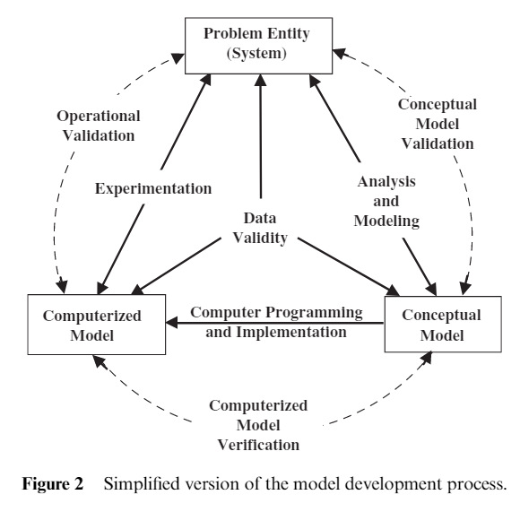
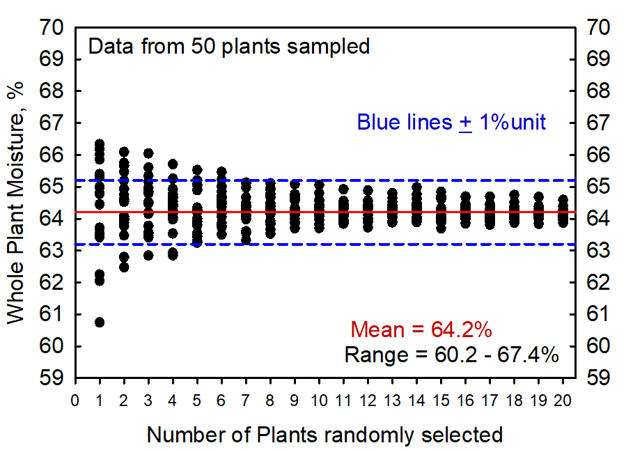

.. _variables-life-cycle-sensitivity-analysis :

=============================================================
**Variables of Interest for Life Cycle Sensitivity Analysis**
=============================================================

Verification of the animal life cycle submodel:

For simulation function and performance of the initial herd structure,
investigating the length of the system needs to reach the steady-state
under different herd size conditions:

**For herd information:**

 (1) Test initial number impact on the time of reaching the steady-state
 with Steady-state detection in each simulation

   - Depend on the herd size and initial number of each animal class

   - Threshold: a coefficient of variation below 10% for the percentage of milking / pregnant cows when the herd size = N > 500; for 50 < N < 500 the variation should be below 20% in each group.

   - Settings:

      - All animal config not changing

      - Change herd number (N) for 50, 100, 1000, 10,000 animal initial number
        of each animal class from 0 to N, with a step of N/10.

   - Goal: 

      - Test functionality of the initial herd (No errors with each setting), also test how long the steady-state last for one or two cases

      - Have a chart of the relationship between herd number and the
        simulation length, where herd number would be in each level of herd
        number and the initial number of each animal class, and simulation
        length is the number of simulated days for the system to be stable.

+-------------------+--------------------------+-----------------------+
| Herd num          | Initial animal class num | Length of simulation  |
|                   |                          | days until            |
|                   | calf, heiferI, heiferII, | steady-state (d)      |
|                   | heiferIII, cow           |                       |
+===================+==========================+=======================+
| 1                 | 0,0,0,0,1                |                       |
+-------------------+--------------------------+-----------------------+
|                   | 0,0,0,1,0                |                       |
+-------------------+--------------------------+-----------------------+
|                   | ...                      |                       |
+-------------------+--------------------------+-----------------------+
|                   | 1,1,1,1,1                |                       |
+-------------------+--------------------------+-----------------------+
| 50a               | 0,0,0,0,1                |                       |
+-------------------+--------------------------+-----------------------+
|                   | 0,0,0,0,2                |                       |
+-------------------+--------------------------+-----------------------+
|                   | ...                      |                       |
+-------------------+--------------------------+-----------------------+
|                   | 0,0,0,0,10               |                       |
+-------------------+--------------------------+-----------------------+
| 50b               | Optimize (calf, heiferI, |                       |
|                   | heiferII, heiferIII,     |                       |
|                   | cow) for shortest length |                       |
+-------------------+--------------------------+-----------------------+
|                   |                          |                       |
+-------------------+--------------------------+-----------------------+
|                   |                          |                       |
+-------------------+--------------------------+-----------------------+
| 100 repeat 50     |                          |                       |
+-------------------+--------------------------+-----------------------+
|                   |                          |                       |
+-------------------+--------------------------+-----------------------+
| 1,000             |                          |                       |
+-------------------+--------------------------+-----------------------+

 50a: we should go with 50b

 50b: record the time from the start of the simulation to the time
 percentage of milking/ pregnant (2 variables) reach below 10% variation t.

**For reaching steady-state:**

 (1) Definition for Steady (S) day and Steady-state (SS) day:
   - Rule 1: For days from day t to t+n, if for each day we have variation of p_i < x, where n = 30, i in range(t, t+n), and x = 10%, we call day t a Steady (S) day.
      
      - e.g, if at day 5 we have p_5 = 10, and for days from day 6 to day 35, each day has p_i within range of (9, 11), where 6 <= i <= 35, we call day 5 a Steady (S) day.
      - Means, for 30 days after t, the value holds 10% around the value at t

   - Rule 2: for days from day d to d+m, if all days are Steady (S) days, we call day d a Steady-state (SS) day.

      - e.g. if day 10 is a Steady (S) day, and all days from day 11 to day 365
        are all Steady (S) days, then we call day 10 a Steady-state (SS) day. if
        day 8 is a Steady (S) day, but day 9 is not, then day 8 can never be a
        Steady-state (SS) day
      - Means for 365 days after d, all the days are the steady day, and the
        value d is the time for the simulation to reach steady-state (d is what
        we want to minimize with optimal inputs)
      - Iterations (replications) are needed to confirm the detection of the SS
        consistent among replicas.

 (2) Determine the optimal number of replications required for stability
 of the result for iterations

   - Depend on the size of the herd and days simulated

   - Threshold: a coefficient of variation below 1% for $NR ( = net_return = income_over_feed_cost + total_slaughter_value + total_heifer_value + total_calf_income - total_replacement_cost - total_fixed_cost - total_repro_cost)

   - Settings:

      - All animal config not changing

      - Do replications (1 - 100) of the steady-state detection to find a
        reasonable range.

       Replications mean having the detection process replicate several times
       and calculate the average number of each output (In this case, the time
       for both variables to reach the steady-state). When the output
       distributions are not varying much as the replication number increases,
       we say we find the reliable outputs and the optimal number of
       replications. We can run 100 times and measure the variations.

         -  1. A
          - Herd_num: 100
          - cow_num range: 50 - 100 with step of 10
          - Other class num 0
          - X = 20, N = 30 , M = 365
          - Replications : 1 - 100
          - Based on the results, decide the number of replications needed (R)
          - 100*6 runs

      To determine the number of replications needed:

         1. Calculate the NR for each of the 100 replications.

         2. Randomly select *k* values of the NR and take the average 20 times
            where *k* = 1-100

         3. Plot the 20 average NR against the value of *k*

         4. Plot Horizontal lines for the (i) overall average, (ii) +/- 1% of the
            overall average

         5. The selected value for R is the smallest value of *k* when most or
            all of the NR points are within +/- 1% of the mean

Here is an example plot for illustration. In this case R was chosen to be 7:

1.B
   - Herd_num: 100
   - cow_num range: 50 - 100 with step of 10
   - calf_num range: 0 - 50 with step of 10
   - heiferI_num range: 0 - 80 with step of 10
   - heiferII_num range: 0 - 80 with step of 10
   - heiferIII_num range: 0 - 50 with step of 10
   - X = 20, N = 30 , M = 365
   - Replications: 120%R
   - Scenarios: 6*6*9*9*6

  If 1.A and 1.B shows difference in time to reach the steady state, go to
  a below, otherwise, b

  Change herd number N, from 1 to 5,000 with two sets of settings for
  initial numbers for each animal class:

    a. "calf_num": 0, "heiferI_num": 0, "heiferII_num": 0,
       "heiferIII_num": 0, "cow_num": N, "replace_num": 5N, "herd_num": N

    b. "calf_num": 0.8%N, "heiferI_num": 4%N, "heiferII_num": 4%N,
       "heiferIII_num": 0.5%N, "cow_num": N, "replace_num": 5N, "herd_num":
       N

- Goal: Determine how many replications needed for 2000, 3000, 5000 days
of simulation

3. Sensitivity analysis (SA)

    Treating the simulation model as a black box; i.e., the SA uses only the
    Input/Output (I/O) data of the simulation model (not the internal
    variables and functions).

    3.1

    Variables of interest for sensitivity analysis to evaluate the model
    with fractional factorial design (groups of interested input and
    corresponding groups of interested output)

   - Goal: Identify the key variables (most effective among each input
   group), and verify effectiveness of each input variables

      - For input:

         Which variables are responding to this input

      - For output:

         Which and how input variables are affecting this output

One set of variables at a time with fractional factorial designs

+---------------+-----+---------------------------------------+-----+
| Input         |Input| Targeted Output                       | Her |
|               |range|                                       | d_r |
|               |     |                                       | epo |
|               |     |                                       | rt. |
|               |     |                                       | csv |
|               |     |                                       | col |
|               |     |                                       | umn |
|               |     |                                       | i   |
|               |     |                                       | ndi |
|               |     |                                       | ces |
+===============+=====+=======================================+=====+
| Bodyweight    |     |                                       |     |
+---------------+-----+---------------------------------------+-----+
| birth_weight  | 4   | Cow bodyweight at culling             | 82  |
| _avg_ho       | 3.9 |                                       |     |
|               | ±   | (add a variable                       |     |
| birth_weight  | 4.4 | ‘culling_body_weight’, recording      |     |
| _std_ho       |     | bodyweight when culled (cow           |     |
|               | 1.0 | cull_update)                          |     |
|               | ±   |                                       |     |
|               | 0.2 |                                       |     |
+---------------+-----+---------------------------------------+-----+
| Mature        | 740 | Average cow body weight               | 66  |
| _body_weight  | ±   |                                       |     |
|               | 43  |                                       |     |
+---------------+-----+---------------------------------------+-----+
| target_heifer | 360 | Heifer bodyweight at culling          | 83  |
| _preg_day     | ±   |                                       |     |
|               | 18  |                                       |     |
+---------------+-----+---------------------------------------+-----+
| calving       | 400 |                                       |     |
| _interval     | ±   |                                       |     |
|               | 30  |                                       |     |
+---------------+-----+---------------------------------------+-----+
| Heifer        |     |                                       |     |
+---------------+-----+---------------------------------------+-----+
| Breeding      | 400 | Number of hormonal injection, ED, AI, | 87, |
| start day for | ±   | PC, semen                             | 88, |
| heifer        | 20  |                                       | 89, |
|               |     | Not yet in the heiferII.py. These     | 90, |
|               |     | should be added to heiferII.py the    | 91, |
|               |     | same way as in cow.py                 | 92  |
+---------------+-----+---------------------------------------+-----+
| heifer_re     | 300 | Avg breeding to preg time             | 69  |
| pro_cull_time | ±   |                                       |     |
|               | 15  |                                       |     |
+---------------+-----+---------------------------------------+-----+
| a. heifer     |     | Heifer service rate                   | 93  |
| _repro_method |     |                                       |     |
|       = ED    |     | Same here                             |     |
+---------------+-----+---------------------------------------+-----+
| estrus_d      | 0.4 | Heifer conception rate                | 94  |
| etection_rate | ±   |                                       |     |
|               | 0.1 | Same here                             |     |
+---------------+-----+---------------------------------------+-----+
| estrus        | 0.9 | Heifer pregnancy rate                 | 95  |
| _service_rate | ±   |                                       |     |
|               | 0.1 | Same here                             |     |
+---------------+-----+---------------------------------------+-----+
| ed_co         | 0.4 | Heifer repro culling num              | 14  |
| nception_rate | ±   |                                       |     |
|               | 0.2 |                                       |     |
+---------------+-----+---------------------------------------+-----+
| Avg_estrus    | 21  |                                       |     |
| _cycle_heifer | ± 4 |                                       |     |
| +             |     |                                       |     |
| std_estrus    | 3 ± |                                       |     |
| _cycle_heifer | 1   |                                       |     |
+---------------+-----+---------------------------------------+-----+
| b. heifer     |     |                                       |     |
| _repro_method |     |                                       |     |
|       = TAI   |     |                                       |     |
+---------------+-----+---------------------------------------+-----+
| m5dCG2P_co    | 0.5 |                                       |     |
| nception_rate | ±   |                                       |     |
|               | 0.2 |                                       |     |
+---------------+-----+---------------------------------------+-----+
| conception    | 0.  |                                       |     |
| _rate_decrease| 026 |                                       |     |
|               | ±   |                                       |     |
|               | 0   |                                       |     |
|               | .01 |                                       |     |
+---------------+-----+---------------------------------------+-----+
| c. heifer     |     |                                       |     |
| _repro_method |     |                                       |     |
|       = synch |     |                                       |     |
|       - ED    |     |                                       |     |
+---------------+-----+---------------------------------------+-----+
| estrus_d      | 0.4 |                                       |     |
| etection_rate | ±   |                                       |     |
|               | 0.1 |                                       |     |
+---------------+-----+---------------------------------------+-----+
| estrus        | 0.9 |                                       |     |
| _service_rate | ±   |                                       |     |
|               | 0.1 |                                       |     |
+---------------+-----+---+-----------------------------------+-----+
| ed_co         | 0.4 |                                       |     |
| nception_rate | ±   |                                       |     |
|               | 0.2 |                                       |     |
+---------------+-----+---------------------------------------+-----+
| Avg           | 278 |                                       |     |
| _gestation_len| ±   |                                       |     |
| +             | 14  |                                       |     |
|               |     |                                       |     |
| std           | 6 ± |                                       |     |
| _gestation_len| 1   |                                       |     |
+---------------+-----+---------------------------------------+-----+
| Cow repro     |     |                                       |     |
+---------------+-----+---------------------------------------+-----+
| dip_dry       | 218 | Number of hormonal injection (GnRH    | 49, |
|               | ±   | and PGF), ED time, AI, PC, semen      | 50, |
|               | 10  | number                                |     |
|               |     |                                       | 85, |
|               |     | ED_time should be ED_econ_days from   |     |
|               |     | cow.py (two line of that need to be   | 51, |
|               |     | added after line 950 the same as in   | 52, |
|               |     | line 637, thanks)                     | 86  |
|               |     |                                       |     |
|               |     | Semen number should be int semen_used |     |
|               |     | in cow, remember to change line 521   |     |
|               |     | in life_cycle.py from cow.semen_num   |     |
|               |     | to cow.semen_used please. Or probably |     |
|               |     | we need a better name for semen_used  |     |
|               |     | in cow.py)                            |     |
+---------------+-----+---------------------------------------+-----+
| semen_type    | c   | Avg calving age of each parity        | 19, |
|               | onv |                                       | 23, |
|               | ent |                                       | 27, |
|               | ion |                                       | 31  |
|               | al/ |                                       |     |
|               | se  |                                       |     |
|               | xed |                                       |     |
+---------------+-----+---------------------------------------+-----+
| do_n          | 300 | service rate                          | 46  |
| ot_breed_time | ±   |                                       |     |
|               | 30  |                                       |     |
+---------------+-----+---------------------------------------+-----+
| Avg           | 278 | conception rate                       | 47  |
| _gestation_len| ±   |                                       |     |
| +             | 14  |                                       |     |
|               |     |                                       |     |
| std           | 6 ± |                                       |     |
| _gestation_len| 1   |                                       |     |
+---------------+-----+---------------------------------------+-----+
| a. cow_repro  |     | pregnancy rate                        | 48  |
|     = ED      |     |                                       |     |
+---------------+-----+---------------------------------------+-----+
| estrus_d      | 0.4 | Do not breed num                      | 84  |
| etection_rate | ±   |                                       |     |
|               | 0.1 | Add a variable do_not_breed_num       |     |
|               |     | similarly to vwp_cow_num in           |     |
|               |     | life_cycle.py line 458 (like if       |     |
|               |     | cow.do_not_breed:                     |     |
|               |     | self.do_not_breed_num +=1)            |     |
+---------------+-----+---------------------------------------+-----+
| estrus        | 0.9 |                                       |     |
| _service_rate | ±   |                                       |     |
|               | 0.1 |                                       |     |
+---------------+-----+---------------------------------------+-----+
| ed_co         | 0.4 |                                       |     |
| nception_rate | ±   |                                       |     |
|               | 0.2 |                                       |     |
+---------------+-----+---------------------------------------+-----+
| Avg_estrus    | 19  |                                       |     |
| _cycle_return | ± 4 |                                       |     |
| +             |     |                                       |     |
| std_estrus    | 11  |                                       |     |
| _cycle_return | ± 2 |                                       |     |
+---------------+-----+---------------------------------------+-----+
| Avg_est       | 21  |                                       |     |
| rus_cycle_cow | ± 4 |                                       |     |
| +             |     |                                       |     |
| std_est       | 2.5 |                                       |     |
| rus_cycle_cow | ±   |                                       |     |
|               | 0.5 |                                       |     |
+---------------+-----+---------------------------------------+-----+
| b. cow repro  |     |                                       |     |
|       = TAI   |     |                                       |     |
+---------------+-----+---------------------------------------+-----+
| ovsynch56_co  | 0.5 |                                       |     |
| nception_rate | ±   |                                       |     |
|               | 0.2 |                                       |     |
+---------------+-----+---------------------------------------+-----+
| conception    | 0.  |                                       |     |
| _rate_decrease| 026 |                                       |     |
|               | ±   |                                       |     |
|               | 0   |                                       |     |
|               | .01 |                                       |     |
+---------------+-----+---------------------------------------+-----+
| c. cow repro  |     |                                       |     |
|       =       |     |                                       |     |
|       ED-TAI  |     |                                       |     |
+---------------+-----+---------------------------------------+-----+
| estrus_d      | 0.4 |                                       |     |
| etection_rate | ±   |                                       |     |
|               | 0.1 |                                       |     |
+---------------+-----+---------------------------------------+-----+
| estrus        | 0.9 |                                       |     |
| _service_rate | ±   |                                       |     |
|               | 0.1 |                                       |     |
+---------------+-----+---------------------------------------+-----+
| ed_co         | 0.4 |                                       |     |
| nception_rate | ±   |                                       |     |
|               | 0.2 |                                       |     |
+---------------+-----+---------------------------------------+-----+
| Avg_e         | 10  |                                       |     |
| strus_cycle_p | ± 2 |                                       |     |
| +             |     |                                       |     |
| std_e         | 2 ± |                                       |     |
| strus_cycle_p | 0.5 |                                       |     |
+---------------+-----+---------------------------------------+-----+
| voluntary_w   | 45  |                                       |     |
| aiting_period | ± 5 |                                       |     |
+---------------+-----+---------------------------------------+-----+
| Herd          |     |                                       |     |
| structure     |     |                                       |     |
| for all       |     |                                       |     |
| output        |     |                                       |     |
+---------------+-----+---------------------------------------+-----+
|               |     | $NR                                   | 77  |
+---------------+-----+---------------------------------------+-----+
|               |     | Ratio of young animals (number of     | 78  |
|               |     | young animals / number of cows)       |     |
+---------------+-----+---------------------------------------+-----+
|               |     | percentage of animals in each parity  | 17, |
|               |     | (number of animals in each parity /   | 21, |
|               |     | number of cows)                       | 25, |
|               |     |                                       | 29  |
+---------------+-----+---------------------------------------+-----+
|               |     | Ratio of sold calves (number of       | 79  |
|               |     | calves sold / number of cows)         |     |
+---------------+-----+---------------------------------------+-----+
|               |     | Ratio of bought heifers (number of    | 80  |
|               |     | heifers bought / number of cows)      |     |
+---------------+-----+---------------------------------------+-----+
|               |     | Ratio of sold heifers (number of      | 81  |
|               |     | heifers sold / number of cows)        |     |
+---------------+-----+---------------------------------------+-----+
|               |     | Culling rate                          | 96  |
|               |     |                                       |     |
|               |     | should be calculated during           |     |
|               |     | record_econ_stats as culling rate =   |     |
|               |     | total number of culled cows/average   |     |
|               |     | of cow number both total number of    |     |
|               |     | culled cows and average number of     |     |
|               |     | cows are for the last year            |     |
+---------------+-----+---------------------------------------+-----+
|               |     | conception rate                       |     |
+---------------+-----+---------------------------------------+-----+
|               |     | pregnancy rate                        |     |
+---------------+-----+---------------------------------------+-----+

- Settings:
   herd_num: 100, 500, 1000
   calf_num, heiferI_num, heiferI_num, heiferI_num, heiferI_num to be set at optimal
   herd_init: false
   breed: “HO”

   3.2
   factor screening - search for the really important factors for NR$,
   possible method: Sequential bifurcation

- Goal: control the overall probability of correctly classifying the
  individual factors as important or unimportant, the number of replicates
  need to be derived

 Do individual variable sensitivity analysis on key variables identified
 to verify

**Output variables with potential issues:**

 (the number of initial animals should be proportional to the herd size, 8% for 
 the calf, 44 % for heiferI, 38% for heiferII, 5% for heiferIII, 100% for cow, 
 could also change these in the input file)
 (all output variables should be calculated during record_econ_stats)

 Problem 0:
   -  Net return: milk income + slaughter income + heifer income + calf income
      - replacement cost - feed cost (lactating cow, dry cow, heifer, and
      calf)
      - fixed cost - repro cost (breeding, semen, AI, and preg check)

   -  young animal to cow ratio: the number of calf + heifer/number of cows (should be around 1)
   -  cow body weight at culling: bodyweight at culling of cows/ culled cow
      number (should be a little higher than average BW)
   -  heifer body weight at culling: bodyweight at culling of heifers/
      culled heifer number (should be around 80% of mature BW)

 problem 1:
   -  heifer ED time: days of heifer during heat watch, starting from the
      start day of heifer repro till preg (should be around 50 for ED
      method, 20 for synch-ED method) and GnRH should not be used
   -  heifer num AI, PC, semen used, breeding to preg time
      -  Number of AI, record at each AI
      -  Number of PC, record at each PC
      -  Number of semen used, record at each AI
      -  breeding to preg time: repro start the day until the day of conception
   -  heifer service, conception, preg rate
      -  for all: we have 15 times of 21-d period, wherein each 21-d period, 4 variables are recorded:
            -  A: the number of heifers between the repro start day and the
            day of conception
            -  B: the number of AI on heifers
            -  C: the number of conceptions (successfully pregnant) on heifers for each 21-d period,
               -  service rate = B/A
               -  conception rate = C/B
               -  pregnancy rate = service rate \* conception rate
      -  overall output: average across 15 times for each variable

 problem 2:
   -  heifer number PDF injected: number of PGF injection, accumulated
      across heifers and times for last year, count at each AI

      -  PDF should be PGF and not 0

      -  and is GnRH and PGF inj here per heifer?

   -  heifer num AI, PC, semen used, breeding to preg time  
   -  heifer service, conception, preg rate

 problem 3:
   -  heifer number PDF injected, heifer ED time   
   -  heifer num AI, PC, semen used, breeding to preg time
   -  heifer service, conception, preg rate

 problem 4:
   -  ED time: days of the cow during heat watch, starting from the end of
      VWP till preg (should be around 55 for ED method, 30 for ED-TAI
      method)

   -  and GnRH should not be used
   -  semen used
   -  average calving age for all parities: the average age of cows when
      they become preg for each parity

   -  service rate: average of "num_21_days_repro" times over the rate of
      the number of AI/ the number of animals between VWP and pregnancy
      in that 21 days period.

   -  conception rate: average of "num_21_days_repro" times over the rate
      of the number of preg/ the number of AI in that 21 days period

 problem 5:
   -  semen used
   -  average calving age for all parities
   -  service rate
   -  conception rate

 problem 6:
   -  number of injections, ED days
   -  semen used
   -  average calving age for all parities
   -  service rate
   -  conception rate
