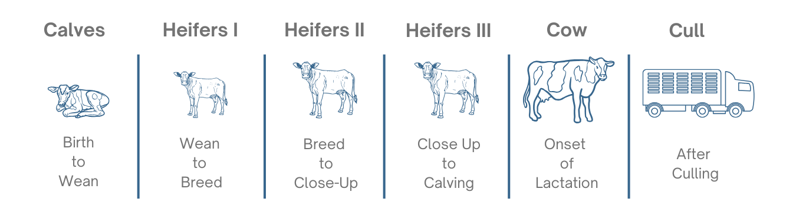
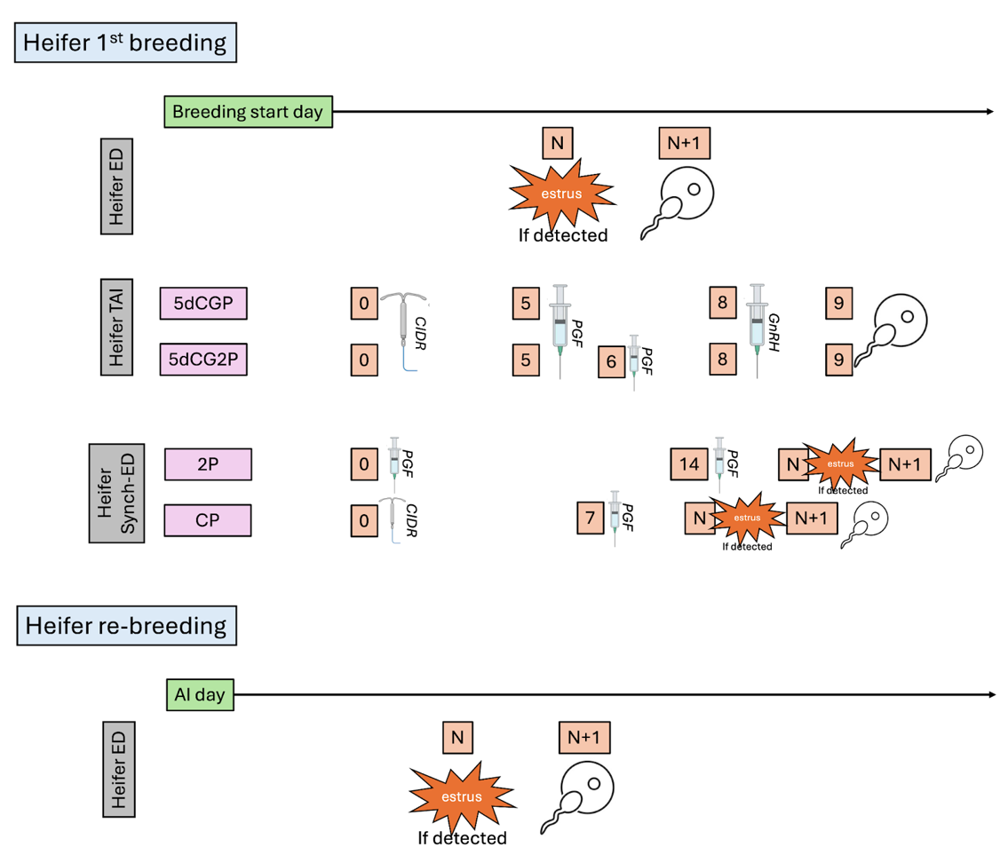
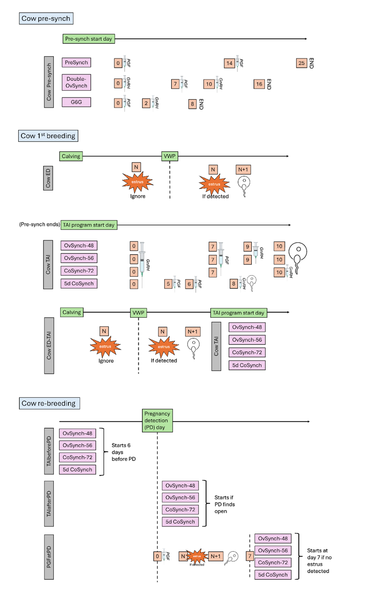
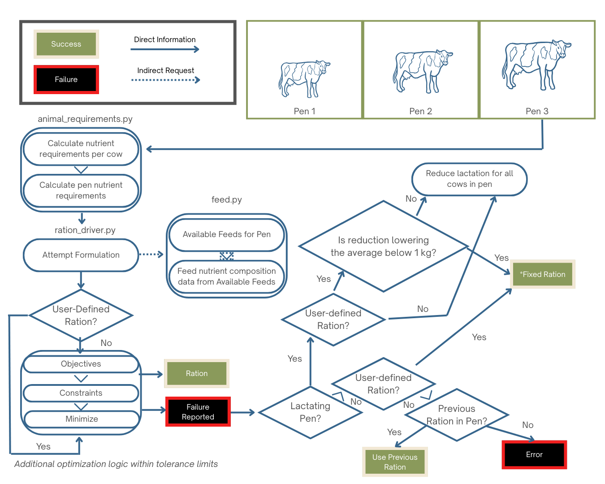

{width=25%}
# Animal Module
<!-- reuse code to import functions from "../scripts/": -->


## Introduction
The Animal Module simulates individual animals on a daily basis throughout each stage of life from birth until 
removal from the herd. In addition to the dynamic Monte-Carlo models that determine the occurrence of events 
throughout each animal’s life, the Animal Module uses process-based, dynamic models to simulate the following 
processes:

- Individual animal growth
- Gestation and milk production
- Estimation of nutrient requirements and feed intake
- Enteric emission and manure excretion 

### Animal Life Cycle
The animal life cycle is driven by Monte Carlo stochastic processes that simulate the growth, production, reproduction, 
and culling of individual dairy cattle animals and shares aggregated outcomes with the herd management sub-module to 
manage herd dynamics on a daily basis. 

The life cycle module represents the variation in animal performance through the use of Monte Carlo Simulation 
methods [@reuven_2017]. Monte Carlo simulation relies on random draws from probability distributions rather than 
assigning fixed values. In this model, two main strategies are used:

- Event-based, in which a random draw from a uniform distribution ($U(0,1)$) is compared to the probability of an 
event occurring to simulate if that event occurs, and 
- Population-based, in which a random draw from a known distribution of attribute values is assigned to an animal at
instantiation. Probability distributions used for that purpose are Normal Gaussian or Empirical. 

Each animal within the RuFaS herd progresses through five main life stages (calf, Heifer I, Heifer II, Heifer III,
and Cow) as illustrated in the figure below. 

-  Calves progress to Heifer I when their age reaches the user-defined input for weaning day.
-  Heifer I progresses to Heifer II when their age reaches the user-defined input for breeding start day. 
-  Heifer II animals that successfully conceive become Heifer III's when the number of days left in their pregnancy 
is equal to the user-defined input for prefresh days (default 21).
-  When a Heifer III calves, she becomes a Cow for the rest of her life on the RuFaS farm.
-  Cows cycle through lactating and non-lactating phases until they are removed from the herd due to a failure to 
conceive or a user-provided probability for sale or death within each parity (lactation).

When a Heifer III or Cow reaches full gestation length, they start lactating and a new calf object is created. The calf 
is assigned a birthweight according to a user-informed random distribution. All male calves are recorded and removed 
from the farm on day 1 of their life. Female calves either remain on the farm or are sold on day 1, determined by an 
event-based Monte Carlo method informed by the user-defined percent of female calves that are kept. 

## Herd-level Processes and Management

### Herd Initialization

::: {.callout-note}

In RuFaS code, the term “herd initialization” is used to refer to both the process of generating an animal population file and of selecting from that population to create a specific herd at the start of a simulation. In this doc, those two processes will be differentiated by calling them “Generation” and “Selection”, respectively. “Animal population” can refer to both groups of animals (the pool of animals generated, and the herd of animals selected). In the code, the population is sometimes referred to as `pre_animal_population` and `post_animal_population` to differentiate whether the specified group of animals exists before or after the random selection of individuals to create a herd.

:::

#### Introduction 

Every simulation begins with a herd consisting of calves, heifers, and dry and lactating cows. This herd comes to be through a two-step process: 

1. A population of animals is generated through simulation or loaded from data (`pre-animal-population`). The animals in that herd should reflect the attributes of animals in the herd to be modeled. 
2. Animals are randomly selected with replacement from the pre-animal-population to be in the initial herd, based on group numbers and characteristics that reflect the distribution of animals within the herd being modeled. Note that the animals in the herd on day one will have attributes of the pre-animal-population and may deviate from the desired herd to be modeled.  

For the rest of the simulation, animals enter the herd through birth as newborn calves or purchased replacements (`heiferIII`’s). 


```{python}
#| label: tbl-an-sim-outline
#| tbl-cap: Overview of the distinct phases by which animals are created and introduced to the herd.

import_table(
    "../resources/table_data/animal/tbl-an-sim-outline.csv",
    colalign=["left", "left", "left"]
)
```

#### Required User Inputs
```{python}
#| label: tbl-an-herd-inputs
#| tbl-cap: User inputs in the animal input file that influence the generation of the Animal Population (pre-animal-population). The inputs of this table are found in the Herd Initialization Section.
import_table(
  "../resources/table_data/animal/tbl-an-herd-inputs.csv",
  colalign = ["left", "left", "center", "center", "center"]

)
```

#### Relevant Outputs

After the animals have been selected from the animal population to create the initial herd, a summary of the Population
(pre-selection pool, aka pre-animal-population) and of the Initial herd (selected animals, aka post-animal-population) 
is provided to the output manager. 

Class and function: `AnimalModuleReporter.report_animal_population_statistics`

Output variables: 

* `.population_{...}`
* `.initial_{...}`

{...} includes: breed, number of animals of each class (calf, heiferI, heiferII, heiferIII, cow), number of cows by 
parity and lactation status, average age of animals within each class, distribution of age of animals within each 
class, average body weight of animals within each class, average cow days in milk, days in preg, parity, and calving 
interval. 


#### Methodology

When a simulation begins, the HerdFactory class generates or loads the pre-animal-population, from which it selects and 
compiles the post-animal-population with an appropriate distribution of animal ages and stages to serve as the starting 
herd for simulation. 

**Designation of an Animal Population**

*Option 1: Creating a new Animal Population*

An animal population can be generated as a stand-alone simulation task that creates and saves a pre-animal-population file  as the output based on the user Animal Module inputs. Or, the animal population can be generated as the first step of a regular simulation task which then uses that generated `pre-animal-population` to select from and create the `post-animal-population` to use for the subsequent herd simulation. See the documentation about `Task Manager` for more information about how to generate a new `pre-animal-population`. 

The `_generate_animals()` method creates the `pre_animal_population`, with the option to save those animals to file at the end of the generation process. 

Calves are created according to the number specified by the user (`initial_animal_num`), some are sold based on user inputs, and those remaining proceed through select daily updates (growth, reproduction, milk, and transition through the appropriate life stages) for the user-specified number of days (`simulation_days`). The simulation occurs similarly 
to the regular life cycle simulation process, but with an extended period and large number of animals. There are a few notable distinctions:  

* After 3000 days of simulation (specified in `animal_constants`), a copy of each heiferIII is saved to the replacement herd. The copy is made on the day when she is ready to transition to a lactating cow (ready to give birth), so that when the copy enters the herd as a purchased heiferIII during the actual simulation, she will give birth the very next day. 
* If a cow has made it to parity six without being culled, she is removed from the herd. (The maximum parity of cows kept in the generated herd is five). After the `simulation_days` number of days, the full herd contains a mixture of calves, heifers, cows, and replacements. The core status information and life history of each animal are either saved to file or passed for random sampling to create the `post-animal-population`. 

*Option 2: Point to an existing Animal Population*

Alternatively, the `pre-animal-population` will be loaded from a specified Animal Population input file consisting of calf, heifer, cow, and replacement objects. 

*Herd Selection*

The `_random_sample_with_replacement()` method selects animals from each of the following groups: calf, heiferI, heiferII, heiferIII, replacement, lactating cows by parity for parities 1-5, and dry cows by parity for parities 1-5. 

Animals are sampled randomly with replacement from the `pre-animal-population` according to the numbers, parity fractions, and milking cow fraction specified in the animal input file. The resulting list of animals is returned as the `post-animal-population` and summaries of the `pre-` and `post-animal-populations` are reported to the output manager.

### Pens and Animal Grouping

#### Introduction

All animals in RuFaS are assigned to a pen which is used to summarize nutrient requirements for diet formulation and feeding, aggregate enteric methane and manure excretions for reporting and passage to the Manure Module. Each pen tracks and updates daily a list of animals in the pen, the stocking density, the average nutrient requirement of the animals in the pen, the ration being fed to that pen, the manure excreted, and the methane emitted. In addition, constant attributes of each pen include the type of pen it is (`freestall`, `tiestall`, `open lot`, `compost bedded pack barn`), the type of animals that can be in that pen, the number stalls, the manure management practices associated with that pen, and the distance to the milking parlor for lactating cows.  Each day after the HerdManager has updated the status of each animal and determined which animals need to be bought or sold, the animals are added and removed from pens as needed. 

#### Required User Inputs
```{python}
#| label: tbl-an-grp-inputs
#| tbl-cap: User inputs in the animal input file that influence pen grouping. The user must define at least 3 pens and for each pen, key inputs are outlined here.
import_table(
  "../resources/table_data/animal/tbl-an-grp-inputs.csv",
  colalign = ["left", "left", "center", "center", "center"]

)
```

#### Relevant Outputs

- `number\_of_animals\_in\_pen\_[id]\_[AnimalCombination]` - reports the number of animals in each pen each day.

- `ration\_per\_animals\_for\_pen\_[id]\_[AnimalCombination]` - reports average dry matter intake of an animal in the pen at the time of the ration formulation.

- `ration\_per\_animals\_for\_pen\_[id]\_[AnimalCombination].[RUFAS\_feed\_id]` - reports the amount of each feed that is delivered per animal in the pen.

- `ration\_nutrient\_amount\_for\_pen\_[AnimalCombination].[nutrient]` - is reporting the amount of each of the following nutrients that is provided by the ration per animal in the pen (all reported in kilograms unless otherwise indicated).


#### Methodology

**Animal Grouping**

To translate from the `AnimalTypes` needed to track an animal’s life stages and the combinations of animals that are allowed to be grouped into a single pen, a new variable called `AnimalCombination` is created that combines some `AnimalTypes` to facilitate sorting into pens. The `AnimalCombination` class is defined in `enums.py` and includes the following mapping from `AnimalTypes` to `AnimalCombinations`:

```{python}
#| label: tbl-an-def-grp
#| tbl-cap: Summary of animal types and their grouping included in this module.
import_table(
  "../resources/table_data/animal/tbl-an-def-grp.csv",
  colalign = ["left", "left"]

)
```
Currently there are only two options for assigning AnimalCombinations to pens. 

* *Option 1:* The first and most commonly used option for grouping animals is to assign one AnimalCombination to each pen such that there is at least one pen for the 4 AnimalCombinations: `CALF`, `GROWING`, `CLOSE_UP`, and `LAC_COW`. 

* *Option 2:* In some cases, and especially in very small farms, a user might wish to represent a scenario where all growing animals, pregnant heifers, and non-lactating cows are housed together. In this case, there is an option to have a pen that houses both `GROWING` and `CLOSE_UP` animals such that the there is at least one pen with each of the 3  AnimalCombination  inputs: `CALF`, `GROWING_AND_CLOSE_UP`, and `LAC_COW`. 


**Pen Sizing**

Due to oscillations in the exact number of animals in each animal type, it is strongly recommended that the stocking density is at least 120\% of the expected number of animals in each pen. 

**Class** 

Pens are initiated from the Pen class by the HerdManager at the beginning of the simulation and, if needed, an additional pen is created to accommodate animals if the animal numbers have exceeded the max stocking density. 

::: {.callout-note}
`Remove_animals_by_ids` - This function is called when the `HerdManager` calls for: `remove_animal_from_pen_and_id_map`. 

It is pen specific and removes the animal from the pen and the animal ID from the animal ID map that tracks the animals in the pen. 

`_add_new_animals` - This function is called by `Pen.update_animals` which is in turn called by `HerdManager._add_animal_to_pen_and_id_map`. Thus, when `HerdManager` initiates addition of animals to each pen, this function executes the addition of those animals. 

:::

### Ration Formulation

#### Introduction

The diet recipes in RuFaS are either formulated through least-cost formulation [@Li_2022] or provided by the user for each of 4 animal categories 
(calves, growing heifers, dry and close-up cows, and lactating cows). The composition of the available feeds are provided by a feed library that 
was adapted from the @nrc_2021. The amount of feed required by the farm is tracked by pen and multiple pens of each animal category can be simulated; 
however, at this time, the RuFaS model can only accept one user-defined diet per animal category even if there are multiple simulated pens for that animal category.  

In practice, animal feeding on dairy farms is a constantly evolving process that responds to fluctuations in feed availability, animal requirements 
and responses, and management goals. Although the feed delivery algorithms will make small modifications to the diet recipe in response to animal 
nutrient requirements and adjust the total amount of feed delivered based on the number of animals and their requirements, the diversity and degree 
of fluctuation in the diets is less than what is expected on a commercial dairy. The RuFaS feed library can also be modified or expanded on by 
changing the compositions of the existing feeds or by adding new feeds. 

Regardless of whether or not a user chooses to provide their own ration or have RuFaS build and feed a ration optimized for least-cost, 
RuFaS needs a set of ingredients to work from. The RuFaS feed library should be consulted for the full list of ingredients and ingredients that 
are in both the NASEM and NRC libraries can be used. Users interested in feeding a ration that they define, need to provide a list of ingredients 
and their relative % dry matter intake for each animal class (pre-weaned calves, growing heifers, close-up animals, and lactating cows). 

If a user would like RuFaS to use the list of ingredients to formulate a least-cost ration, it is imperative that proper costs are inputted for each 
ingredient listed, but the % dry matter intake in the user defined ration percentages does not need to be included. Feed costs need to be entered in 
kg/DM. RuFaS will then use all the ingredients available (based on costs and inventory available if the feed is homegrown) to create a ration that 
meets the nutritional requirements of the animal class and is cost-optimized. 


::: {.callout-note}
For the time being, only one set of feeds and ration formula can be provided for each animal class. 
:::

Below are the calculations utilized based on the energy and nutrient requirements of dairy cattle as reported by @nrc_2001 and more 
recently the @nrc_2021.

Calculations are included for the following requirement categories:

* Energy (Maintenance, Activity, Growth, Pregnancy, Lactation)
* Protein (Maintenance, Growth, Pregnancy, Lactation)
* Minerals (Maintenance, Growth, Pregnancy, Lactation)
* Dry Matter Intake (DMI)
* Amino Acids (NASEM only) 

Where appropriate, requirement calculations are differentiated by animal age and reproductive status.


#### Nutrient Requirements of Dairy Cattle: NRC


##### Energy Requirements
For details about the variables included in each calculation, please refer to #tbl-energy-req for a full list.

**Maintenance** <br>
The maintenance requirement is calculated based on metabolic body weight ($\text{body weight}^{0.75}$).

* Lactating and Dry Cows

:::{#eq-an-nrc-1}
[[**AN.NRC.1**]]{.aside .content-visible when-format="html"}
$$
\text{CBW} = \text{MW} \times 0.06275
$$
:::


:::{#eq-an-nrc-2}
[[**AN.NRC.2**]]{.aside .content-visible when-format="html"}
$$
\text{CW} = (18 + (\text{DOP} - 190) \times 0.665) \times \left(\frac{\text{CBW}}{45}\right), \text{if DOP} > 190.0 
$$
:::

*Otherwise*

:::{#eq-an-nrc-3}
[[**AN.NRC.3**]]{.aside .content-visible when-format="html"}
$$
\text{NEmaint} = 0.08\times (\text{BW} - \text{CW})^{0.75} 
$$
:::

* Heifers - The maintenance requirement is calculated based on metabolic body weight (body weight^0.75), body condition score, and the previous month's temperatures.

:::{}
[See [AN.NRC.1](#eq-an-nrc-1)]{.aside .content-visible when-format="html"}
$$
\text{CBW} = \text{MW} \times 0.06275
$$
:::


:::{}
[See [AN.NRC.2](#eq-an-nrc-2)]{.aside .content-visible when-format="html"}
$$
\text{CW} = (18 + (\text{DOP} - 190) \times 0.665) \times \left(\frac{\text{CBW}}{45}\right), \text{if DOP} > 190.0 
$$
:::

*Otherwise*

:::{#eq-an-nrc-6}
[[**AN.NRC.6**]]{.aside .content-visible when-format="html"}
$$
\text{BCS9} = (\text{BCS5} - 1) \times 2 + 1 
$$
:::

:::{#eq-an-nrc-7}
[[**AN.NRC.7**]]{.aside .content-visible when-format="html"}
$$
\text{NEmaint} = (\text{BW} - \text{CW})^{0.75}\times (0.086\times (0.8 + (\text{BCS9} - 5)\times 0.05) + 0.0007 \times (20 - \text{PrevTemp})) 
$$
:::

**Activity** <br>
Activity requirement is proportional to body weight and daily walking distance. A grazing system and hilly topography will cost additional energy. 

* Lactating and Dry Cows

:::{#eq-an-nrc-8}
[[**AN.NRC.8**]]{.aside .content-visible when-format="html"}
$$
\text{NEa1} = 0.0012\times \text{BW} \qquad \text{if Housing = Grazing = 0}
$$
:::

*Otherwise*

:::{#eq-an-nrc-9}
[[**AN.NRC.9**]]{.aside .content-visible when-format="html"}
$$
\text{NEa2} = 0.006 \times \text{BW} \qquad \text{if Topography = Hilly}
$$
:::

*Otherwise*

:::{#eq-an-nrc-10}
[[**AN.NRC.10**]]{.aside .content-visible when-format="html"}
$$
\text{NEa2} = 0.00045 \times \text{Distance} \times \text{BW} + \text{NEa1} + \text{NEa2}
$$
:::

* Heifers

:::{#eq-an-nrc-11}
[[**AN.NRC.11**]]{.aside .content-visible when-format="html"}
$$
\text{NEa1} = 0.0009 \times \text{BW} + 0.0016 \times \text{BW}
\qquad \text{if Housing = Grazing}
$$
:::

*Otherwise*

:::{#eq-an-nrc-12}
[[**AN.NRC.12**]]{.aside .content-visible when-format="html"}
$$
\text{NEa2} = 0.006 \times \text{BW}
\qquad \text{if Topography = Hilly}
$$
:::

*Otherwise*

$$
\text{NEa2} = 0.00045 \times \text{Distance} \times \text{BW} + \text{NEa1} + \text{NEa2}
$$
[See [AN.NRC.10](#eq-an-nrc-10)]{.aside .content-visible when-format="html"}

**Growth** <br>
* Lactating and Dry Cows - will continue to grow toward their mature body weight until the end of their second lactation.

:::{#eq-an-nrc-13}
[[**AN.NRC.13**]]{.aside .content-visible when-format="html"}
$$
\text{MSBW} = 0.96 \times \text{MW}
$$
:::

:::{#eq-an-nrc-14}
[[**AN.NRC.14**]]{.aside .content-visible when-format="html"}
$$
\text{SBW} = 0.96 \times \text{BW}
$$
:::

:::{#eq-an-nrc-15}
[[**AN.NRC.15**]]{.aside .content-visible when-format="html"}
$$
\text{EBW} = 0.96 \times \text{SBW}
$$
:::

:::{#eq-an-nrc-16}
[[**AN.NRC.16**]]{.aside .content-visible when-format="html"}
$$
\text{EQSBW} = (\text{SBW} - \text{CW}) \times \frac{478}{\text{MSBW}} \times \text{SBW}
$$
:::

:::{#eq-an-nrc-17}
[[**AN.NRC.17**]]{.aside .content-visible when-format="html"}
$$
\text{ADG} =
\begin{cases}
\dfrac{(0.92 - 0.82)\times \text{MSBW}}{\text{CI}}, & \text{if Parity = 1} \\
\dfrac{(1 - 0.92)\times \text{MSBW}}{\text{CI}}, & \text{if Parity = 2} \\
0, & \text{if Parity > 2}
\end{cases}
$$
:::

:::{#eq-an-nrc-18}
[[**AN.NRC.18**]]{.aside .content-visible when-format="html"}
$$
\text{EQEBG} = 0.956 \times \text{ADG}
$$
:::

:::{#eq-an-nrc-19}
[[**AN.NRC.19**]]{.aside .content-visible when-format="html"}
$$
\text{EQEBW} = 0.891 \times \text{EQSBW}
$$
:::

:::{#eq-an-nrc-20}
[[**AN.NRC.20**]]{.aside .content-visible when-format="html"}
$$
\text{NEg} = 0.0635 \times \text{EQEBW}^{0.75} \times \text{EQEBG}^{1.097}
$$
:::

* Heifers

:::{#eq-an-nrc-21}
[[**AN.NRC.21**]]{.aside .content-visible when-format="html"}
$$
\text{ADG} =
\begin{cases}
\dfrac{0.55 \times \text{MSBW} - \text{SBW}}
     {(\text{Age1stBred} - \text{Age}) \times 30.4},
& \text{before breeding} \\[10pt]

\dfrac{0.82 \times \text{MSBW} - \text{SBW}}
     {(\text{Age1st} - \text{Age}) \times 30.4},
& \text{after breeding}
\end{cases}
$$
:::

:::{#eq-an-nrc-22}
[[**AN.NRC.22**]]{.aside .content-visible when-format="html"}
$$
\text{EQEBG} = 0.956 \times \text{ADG}
$$
:::

:::{#eq-an-nrc-23}
[[**AN.NRC.23**]]{.aside .content-visible when-format="html"}
$$
\text{EQEBW} = 0.891 \times \text{EQSBW}
$$
:::

:::{#eq-an-nrc-24}
[[**AN.NRC.24**]]{.aside .content-visible when-format="html"}
$$
\text{NEg} = 0.0635 \times \text{EQEBW}^{0.75} \times \text{EQEBG}^{1.097}
$$
:::

**Pregnancy** <br>

:::{#eq-an-nrc-25}
[[**AN.NRC.25**]]{.aside .content-visible when-format="html"}
$$
\text{MEpreg} =
\left(
2 \times 0.00159 \times \text{DOP} - 0.0352
\right)
\times
\frac{\text{CBW}}{45}
\times 0.14
\qquad
\text{if DOP > 190}
$$
:::

:::{#eq-an-nrc-26}
[[**AN.NRC.26**]]{.aside .content-visible when-format="html"}
$$
\text{NEpreg} = \text{MEpreg} \times 0.664
$$
:::

**Lactation** <br>

:::{#eq-an-nrc-27}
[[**AN.NRC.27**]]{.aside .content-visible when-format="html"}
$$
\text{Milk}_{\text{Energy}}
=
0.0929 \times \text{Fat\_Milk}
+
\frac{0.0563}{0.93} \times \text{TP\_Milk}
+
0.0395 \times \text{Lactose\_Milk}
$$
:::

:::{#eq-an-nrc-28}
[[**AN.NRC.28**]]{.aside .content-visible when-format="html"}
$$
\text{NElact} = \text{Milken} \times \text{Milk}
$$
:::

##### Protein Requirements

**Total Protein** <br>
Reporting of protein requirements is divided into 4 components: maintenance, growth, pregnancy, and lactation (all in metabolizable protein). For details about the variables included in each calculation, please refer to the protein requirements key.

:::{#eq-an-nrc-36}
[[**AN.NRC.36**]]{.aside .content-visible when-format="html"}
$$
\text{MPreq} = \text{MPm} + \text{MPg} + \text{MPpreg} + \text{MPlact}
$$
:::

**Maintenance** <br>

* Lactating and Dry Cows

:::{#eq-an-nrc-29}
[[**AN.NRC.29**]]{.aside .content-visible when-format="html"}
$$
\text{MPm}
=
0.3 \times (\text{BW} - \text{CW})^{0.6}
+
4.1 \times (\text{BW} - \text{CW})^{0.5}
+
\left(
\text{DMI} \times 1000 \times 0.03
-
0.5 \times
\left(
\frac{\text{MPbact}}{0.8} - \text{MPbact}
\right)
\right)
+
0.4 \times 11.8 \times \frac{\text{DMI}}{0.67}
$$
:::

**Growth** <br>

* Lactating and Dry Cows

:::{#eq-an-nrc-30}
[[**AN.NRC.30**]]{.aside .content-visible when-format="html"}
$$
\text{NPg} =
\begin{cases}
0, & \text{if ADG = 0} \\[8pt]

\text{ADG} \times
\left(
268 - 29.4 \times \frac{\text{NEg}}{\text{ADG}}
\right),
& \text{otherwise}
\end{cases}
$$
:::

:::{#eq-an-nrc-31}
[[**AN.NRC.31**]]{.aside .content-visible when-format="html"}
$$
\text{EffMP\_NPg} =
\begin{cases}
\dfrac{83.4 - 0.114 \times \text{EQSBW}}{100},
& \text{if EQSBW} \leq 478 \\[10pt]

0.28908,
& \text{otherwise}
\end{cases}
$$
:::

:::{#eq-an-nrc-32}
[[**AN.NRC.32**]]{.aside .content-visible when-format="html"}
$$
\text{MPg} = \frac{\text{NPg}}{\text{EffMP\_NPg}}
$$
:::

* Heifers

:::{#eq-an-nrc-33}
[[**AN.NRC.33**]]{.aside .content-visible when-format="html"}
$$
\text{Npg} =
\begin{cases}
0, & \text{if ADG = 0} \\[8pt]

\text{ADG} \times
\left(
268 - 29.4 \times \frac{\text{NEg}}{\text{ADG}}
\right),
& \text{otherwise}
\end{cases}
$$
:::

:::{#eq-an-nrc-34}
[[**AN.NRC.34**]]{.aside .content-visible when-format="html"}
$$
\text{EffMP\_NPg} =
\begin{cases}
\dfrac{83.4 - 0.114 \times \text{EQSBW}}{100},
& \text{if EQSBW} \leq 478 \\[10pt]

0.28908,
& \text{otherwise}
\end{cases}
$$
:::

*Otherwise*

:::{#eq-an-nrc-35}
[[**AN.NRC.35**]]{.aside .content-visible when-format="html"}
$$
\text{MPg} = \frac{\text{NPg}}{\text{EffMP\_NPg}}
$$
:::

:::{#eq-an-nrc-36}
[[**AN.NRC.36**]]{.aside .content-visible when-format="html"}
$$
\text{MPreq} = \text{MPm} + \text{MPg} + \text{MPpreg} + \text{MPlact}
$$
:::

**Pregnancy** <br>

:::{#eq-an-nrc-37}
[[**AN.NRC.37**]]{.aside .content-visible when-format="html"}
$$
\text{MPpreg}
=
\left(
0.69 \times \text{DOP} - 69.2
\right)
\times
\frac{\text{CBW}}{45 \times 0.33}
\qquad
\text{if DOP > 190}
$$
:::

**Lactation** <br>

:::{#eq-an-nrc-38}
[[**AN.NRC.38**]]{.aside .content-visible when-format="html"}
$$
\text{MPlact}
=
\text{Milk}
\times
\frac{\text{TP}_{\text{Milk}}}{100}
\times
\frac{1000}{0.67}
$$
:::

```{python}
#| label: tbl-an-prot-req-var
#| tbl-cap: Key variables used in protein requirement calculations.
import_table(
  "../resources/table_data/animal/tbl-an-prot-req-var.csv",
  colalign = ["left", "left", "left"]

)
```

##### Mineral Requirements
Only calcium (Ca) and phosphorus (P) requirements are considered currently. For details about the variables included in each calculation, please refer to the [mineral requirements key](#tbl-an-min-req-var).

**Maintenance** <br>

* Lactating and Dry Cows

*Calcium Equations*

:::{#eq-an-nrc-39}
[[**AN.NRC.39**]]{.aside .content-visible when-format="html"}
$$
\text{Ca}_{\text{main}} =
\begin{cases}
0.031 \times \text{BW}
+
0.08 \times \dfrac{\text{BW}}{100},
& \text{for lactating cows} \\[10pt]
 0.0154 \times \text{BW}
+
0.08 \times \dfrac{\text{BW}}{100},
& \text{for dry cows}
\end{cases}
$$
:::


*Phosphorus Equations*

:::{#eq-an-nrc-40}
[[**AN.NRC.40**]]{.aside .content-visible when-format="html"}
$$
\text{P}_{\text{main}} =
\begin{cases}
1 \times \text{DMI}
+
0.002 \times \text{BW},
& \text{for lactating cows} \\[10pt]
0.8 \times \text{DMI}
+
0.002 \times \text{BW},
& \text{for dry cows}
\end{cases}
$$
:::

* Heifers

*Calcium Equations*

:::{#eq-an-nrc-41}
[[**AN.NRC.41**]]{.aside .content-visible when-format="html"}
$$
\text{Ca}_{\text{main}}
=
0.0154 \times \text{BW}
+
0.08 \times \frac{\text{BW}}{100}
$$
:::

*Phosphorus Equations*
:::{#eq-an-nrc-42}
[[**AN.NRC.42**]]{.aside .content-visible when-format="html"}
$$
\text{P}_{\text{main}}
=
0.8 \times \text{DMI}
+
0.002 \times \text{BW}
$$
:::

**Growth** <br>

*Calcium Equations*

:::{#eq-an-nrc-43}
[[**AN.NRC.43**]]{.aside .content-visible when-format="html"}
$$
\text{Ca}_{\text{growth}}
=
9.83
\times
\text{MW}^{0.22}
\times
\text{BW}^{-0.22}
\times
\frac{\text{ADG}}{0.96}
$$
:::

*Phosphorus Equations*

:::{#eq-an-nrc-44}
[[**AN.NRC.44**]]{.aside .content-visible when-format="html"}
$$
\text{P}_{\text{growth}}
=
\left(
1.2
+
4.635
\times
\text{MW}^{0.22}
\times
\text{BW}^{-0.22}
\right)
\times
\frac{\text{ADG}}{0.96}
$$
:::

**Pregnancy** <br>

*Calcium Equations*

:::{#eq-an-nrc-45}
[[**AN.NRC.45**]]{.aside .content-visible when-format="html"}
$$
\text{Ca}_{\text{preg}}
=
\begin{cases}
0.02456 \times
\exp\left(
0.05581
-
0.00007 \times \text{DOP}^2
\right)
-
0.02456 \times
\exp\left(
0.05581
-
0.00007 \times (\text{DOP} - 1)^2
\right),
& \text{if DOP > 190} \\[10pt]

0,
& \text{otherwise}
\end{cases}
$$
:::

*Phosphorus Equations*

:::{#eq-an-nrc-46}
[[**AN.NRC.46**]]{.aside .content-visible when-format="html"}
$$
\text{P}_{\text{preg}}
=
\begin{cases}
0.02743 \times
\exp\left(
0.05527
-
0.000075 \times \text{DOP}^2
\right)
-
0.02743 \times
\exp\left(
0.05527
-
0.000075 \times (\text{DOP} - 1)^2
\right),
& \text{if DOP > 190} \\[10pt]

0,
& \text{otherwise}
\end{cases}
$$
:::

**Lactation** <br>

*Calcium Equations*

:::{#eq-an-nrc-47}
[[**AN.NRC.47**]]{.aside .content-visible when-format="html"}
$$
\text{Ca}_{\text{lact}} = 1.22 \times \text{Milk}
$$
:::

*Phosphorus Equations*

:::{#eq-an-nrc-48}
[[**AN.NRC.48**]]{.aside .content-visible when-format="html"}
$$
\text{P}_{\text{lact}} = 0.9 \times \text{Milk}
$$
:::

**Total Minerals** <br>

*Calcium Equations*

:::{#eq-an-nrc-49}
[[**AN.NRC.49**]]{.aside .content-visible when-format="html"}
$$
\text{Ca}_{\text{req}}
=
\text{Ca}_{\text{main}}
+
\text{Ca}_{\text{growth}}
+
\text{Ca}_{\text{preg}}
+
\text{Ca}_{\text{lact}}
$$
:::

*Phosphorus Equations*

:::{#eq-an-nrc-50}
[[**AN.NRC.50**]]{.aside .content-visible when-format="html"}
$$
\text{P}_{\text{req}}
=
\text{P}_{\text{main}}
+
\text{P}_{\text{growth}}
+
\text{P}_{\text{preg}}
+
\text{P}_{\text{lact}}
$$
:::


```{python}
#| label: tbl-an-min-req-var
#| tbl-cap: Key variables used in mineral requirement calculations.
import_table(
  "../resources/table_data/animal/tbl-an-min-req-var.csv",
  colalign = ["left", "left", "left"]

)
```


##### DMI Estimation

Estimations are different for lactating cows and dry cows. For details about the variables included in each calculation, please refer to the [DMI requirements key](#tbl-an-dmi-var). The sum of DMI of each feed is assumed to be less than the estimated DMI:

$$
\sum_{i} \text{Feed}_{i} < \text{DMIest}
$$

**Lactating Cows** <br>

:::{#eq-an-nrc-51}
[[**AN.NRC.51**]]{.aside .content-visible when-format="html"}
$$
\text{FCM}
=
(0.4 \times \text{Milk})
+
\left(
15 \times \text{Fat\_Milk} \times \frac{\text{Milk}}{100}
\right)
$$
:::


:::{#eq-an-nrc-52}
[[**AN.NRC.52**]]{.aside .content-visible when-format="html"}
$$
\text{DMIest}
=
\left(
0.372 \times \text{FCM}
+
0.0968 \times \text{BW}^{0.75}
\right)
\times
\left(
1 -
\exp\left(
-0.192 \times \text{WOL} + 3.67
\right)
\right)
$$
:::

**Dry Cows** <br>

:::{#eq-an-nrc-53}
[[**AN.NRC.53**]]{.aside .content-visible when-format="html"}
$$
\text{DMIest}
=
\left(
\frac{
1.97
-
0.75 \times
\exp\left(
0.16 \times (\text{DOP} - 280)
\right)
}{
100
}
\right)
\times \text{BW}
$$
:::

**Heifers** <br>

* If the heifer is *LESS* than 365 days old:

:::{#eq-an-nrc-54}
[[**AN.NRC.54**]]{.aside .content-visible when-format="html"}
$$
\text{DMIest}
=
\left(
\text{BW}^{0.75}
\times
\frac{
0.2435 \times \text{NEadj}
-
0.0466 \times \text{NEadj}^{2}
-
0.0869
}{
\text{NEadj}
}
\right)
-
\text{PREGadj}
$$
:::

* If the heifer is *MORE* than 365 days old:

:::{#eq-an-nrc-55}
[[**AN.NRC.55**]]{.aside .content-visible when-format="html"}
$$
\text{DMIest}
=
\left(
\text{BW}^{0.75}
\times
\frac{
0.2435 \times \text{NEadj}
-
0.0466 \times \text{NEadj}^{2}
-
0.1128
}{
\text{NEadj}
}
\right)
-
\text{PREGadj}
$$
:::


```{python}
#| label: tbl-an-dmi-var
#| tbl-cap: Key variables used in DMI calculations.
import_table(
  "../resources/table_data/animal/tbl-an-dmi-var.csv",
  colalign = ["left", "left", "left"]

)
```

#### Nutrient Requirements of Dairy Cattle: NASEM

##### Energy Requirements
The maintenance requirement is calculated based on metabolic body weight (MBW, body weight\(^{0.75}\)) adjusted for the tissues associated with pregnancy. For details about the variables included in each calculation, please refer to the NASEM energy requirements key.

**Maintenance** <br>

* Lactating and Dry Cows
For Lactating cows, the body weight is adjusted both for the gravid uterine tissues and the uterine tissues for normal activity in confinement conditions, otherwise include adjustments for activity requirements under grazing conditions. 

:::{#eq-an-nsm-1}
[[**AN.NSM.1**]]{.aside .content-visible when-format="html"}
$$
\text{NEmaint}
=
0.10
\times
(\text{MBW} - \text{GrUterW} - \text{UterW})^{0.75}
$$
:::

:::{#eq-an-nsm-2}
[[**AN.NSM.2**]]{.aside .content-visible when-format="html"}
$$
\text{GrUterW}
=
(\text{CBW} \times 1.825)
\times
\exp\left(
-
(0.0243 - (0.0000245 \times \text{DOP}))
\times
(280 - \text{DOP})
\right)
$$
:::

:::{#eq-an-nsm-3}
[[**AN.NSM.3**]]{.aside .content-visible when-format="html"}
$$
\text{UterW}
=
\left(
(\text{CBW} \times 0.2288 - 0.204)
\times
\exp(-0.2 \times \text{DyLact})
+
0.204
\right)
$$
:::

$$
\text{CW} = \text{inputvariable}
$$


*Otherwise*

:::{#eq-an-nsm-4}
[[**AN.NSM.4**]]{.aside .content-visible when-format="html"}
$$
\text{CBW} = \text{MW} \times 0.06275
$$
:::

* Heifers
For heifers, the maintenance energy requirement is only adjusted for the gravid uterine weight:

:::{#eq-an-nsm-5}
[[**AN.NSM.5**]]{.aside .content-visible when-format="html"}
$$
\text{NEmain}
=
0.10
\times
(\text{BW} - \text{GrUterW})^{0.75}
$$
:::

**Activity** <br>
Activity requirement is proportional to body weight and daily walking distance. A grazing system and hilly topography will cost additional energy.

:::{#eq-an-nsm-6}
[[**AN.NSM.6**]]{.aside .content-visible when-format="html"}
$$
\text{NEa1}
=
\begin{cases}
0,
& \text{if } \dfrac{\text{Dt\_PastIn}}{\text{DtDMIn}} < 0.005 \\[10pt]
\dfrac{\text{Dt\_PastIn}}{\text{DtDMIn}},
& \text{otherwise}
\end{cases}
$$
:::

*Otherwise*

:::{#eq-an-nsm-7}
[[**AN.NSM.7**]]{.aside .content-visible when-format="html"}
$$
\text{NEa1}
=
\begin{cases}
0.0075
\times
\text{BW}^{0.75}
\times
\left(
\dfrac{600 - 12 \times \text{DtPastSupplIn}}{600}
\right),
& \text{if } \dfrac{\text{Dt\_PastIn}}{\text{DtDMIn}} \geq 0.005 \\[14pt]
0,
& \text{otherwise}
\end{cases}
$$
:::

Energy requirements for walking to and from the milking parlor are estimated as follows:

:::{#eq-an-nsm-8}
[[**AN.NSM.8**]]{.aside .content-visible when-format="html"}
$$
\text{NEa2}
=
0.00035
\times
\frac{\text{DistParlor}}{1000}
\times
\text{TripParlor}
\times
\text{BW}
$$
:::

:::{#eq-an-nsm-9}
[[**AN.NSM.9**]]{.aside .content-visible when-format="html"}
$$
\text{NEa3}
=
0.0067
\times
\frac{\text{EnvTopoParlor}}{1000}
\times
\text{BW}
$$
:::

:::{#eq-an-nsm-10}
[[**AN.NSM.10**]]{.aside .content-visible when-format="html"}
$$
\text{NEa}
=
\text{NEa1}
+
\text{NEa2}
+
\text{NEa3}
$$
:::


**Growth** <br>
In @nrc_2021, body frame gain (fat + protein) corresponds to the true growth and it is part of the calculation which is further partitioned into body reserves or condition gain (or loss), and pregnancy-associated gain (considered a pregnancy requirement). <br>

The value shown below was calculated but was never utilized in any further calculations in the model’s current version. Thus, it has been omitted from the model and remains solely as a reference to past versions of the model.

:::{#eq-an-nsm-11}
[[**AN.NSM.11**]]{.aside .content-visible when-format="html"}
$$
\text{EBW} = 0.85 \times \text{BW}
$$
:::

:::{#eq-an-nsm-12}
[[**AN.NSM.12**]]{.aside .content-visible when-format="html"}
$$
\text{EBG} = 0.85 \times \text{ADG}
$$
:::

:::{#eq-an-nsm-13}
[[**AN.NSM.13**]]{.aside .content-visible when-format="html"}
$$
\text{FatADG}
=
\left(
0.067
+
0.375 \times \frac{\text{BW}}{\text{MW}}
\right)
\times
\frac{\text{EBG}}{\text{ADG}}
$$
:::

:::{#eq-an-nsm-14}
[[**AN.NSM.14**]]{.aside .content-visible when-format="html"}
$$
\text{ProtADG}
=
\left(
0.201
+
0.081 \times \frac{\text{BW}}{\text{MW}}
\right)
\times
\frac{\text{EBG}}{\text{ADG}}
$$
:::

:::{#eq-an-nsm-15}
[[**AN.NSM.15**]]{.aside .content-visible when-format="html"}
$$
\text{REFADG}
=
9.4 \times \text{FatADG}
+
5.55 \times \text{ProtADG}
$$
:::


:::{#eq-an-nsm-16}
[[**AN.NSM.16**]]{.aside .content-visible when-format="html"}
$$
\text{MEFrameADG}
=
\frac{\text{REFADG}}{0.4}
$$
:::

:::{#eq-an-nsm-17}
[[**AN.NSM.17**]]{.aside .content-visible when-format="html"}
$$
\text{NElFrameADG}
=
\frac{\text{REFADG}}{0.61}
$$
:::

**Pregnancy** <br>
Daily rates of wet tissue deposition (kg/d) are derived from equations [AN.NSM.2](#eq-an-nsm-2) and [AN.NSM.3](#eq-an-nsm-3) as defined above.

* During Gestation

:::{#eq-an-nsm-18}
[[**AN.NSM.18**]]{.aside .content-visible when-format="html"}
$$
\text{GrUterWGain}
=
\left(
0.0243
-
(0.0000245 \times \text{DayGest})
\right)
\times
\text{GrUterW}
$$
:::

* During Involution

:::{#eq-an-nsm-19}
[[**AN.NSM.19**]]{.aside .content-visible when-format="html"}
$$
\text{MEpreg}
=
\begin{cases}
\left(
2 \times 0.00159 \times \text{DOP}
- 0.0352
\right)
\times
\dfrac{\text{CBW}}{45}
\times
0.14,
& \text{if DOP > 190} \\[10pt]
0,
& \text{otherwise}
\end{cases}
$$
:::

*Otherwise*

:::{#eq-an-nsm-20}
[[**AN.NSM.20**]]{.aside .content-visible when-format="html"}
$$
\text{NEpreg} = \text{MEpreg} \times 0.64
$$
:::

**Lactation** <br>

:::{#eq-an-nsm-21}
[[**AN.NSM.21**]]{.aside .content-visible when-format="html"}
$$
\text{MilkEn}
=
0.0929 \times \text{Fat\_Milk}
+
0.0547 \times \text{Prot\_Milk}
+
0.0395 \times \text{Lact\_Milk}
$$
:::

If true protein, (`TP_Milk`) is measured, its energy content is adjusted to account for the energy of Non-Protein-Nitrogen (NPN), then use the following equation. 

:::{#eq-an-nsm-22}
[[**AN.NSM.22**]]{.aside .content-visible when-format="html"}
$$
\text{MilkEn}
=
0.0929 \times \text{Fat\_Milk}
+
0.0585 \times \text{TP\_Milk}
+
0.0395 \times \text{Lact\_Milk}
$$
:::

##### Protein Requirements
These are divided into 4 components: maintenance, growth, pregnancy, and lactation (all in MP). The last is defined as the sum of rumen undegraded protein (RUP + microbial protein (MICP)). Requirements for EEA are also included in @nrc_2021 but have not yet been implemented.

Each physiological function is quantified in terms of TP (true protein), instead of CP (crude protein).

To convert both net protein and net amino acid values to a metabolizable basis, net values have to be divided into the calculated efficiencies for each physiological function. Efficiencies can be either fixed or combined for lactating cows. For simplicity, requirements were included on a fixed basis. For details about the variables included in each calculation, please refer to the [protein requirements key](#tbl-an-nasem-prot-req-var).


**Maintenance** <br>
The protein requirements for non-productive functions (the quantification of protein secretion and accretion), include: scurf + endogenous urinary loss + metabolic fecal protein.

* Scurf Protein

:::{#eq-an-nsm-23}
[[**AN.NSM.23**]]{.aside .content-visible when-format="html"}
$$
\text{NPscurf}
=
0.20
\times
\text{BW}^{0.60}
\times
0.85
$$
:::

:::{#eq-an-nsm-24}
[[**AN.NSM.24**]]{.aside .content-visible when-format="html"}
$$
\text{NetAAscurf}
=
\text{NPscurf}
\times
\frac{\text{AACorrScurf}}{100}
$$
:::

* Endogenous Protein

:::{#eq-an-nsm-25}
[[**AN.NSM.25**]]{.aside .content-visible when-format="html"}
$$
\text{NPEndUrin}
=
53
\times
6.25
\times
\text{BW}
\times
0.001
$$
:::

:::{#eq-an-nsm-26}
[[**AN.NSM.26**]]{.aside .content-visible when-format="html"}
$$
\text{NetAAEndUrin}
=
0.010
\times
6.25
\times
\text{BW}
\times
\frac{\text{AACorrWhEmpBody}}{100}
$$
:::

* Metabolic Fecal Protein -The daily loss of CP as metabolic fecal protein (MFP) is estimated using the following equation.

:::{#eq-an-nsm-27}
[[**AN.NSM.27**]]{.aside .content-visible when-format="html"}
$$
\text{CPMFP}
=
(11.62 + 0.134 \times \text{NDF})
\times
\text{DMI}
$$
:::

:::{#eq-an-nsm-28}
[[**AN.NSM.28**]]{.aside .content-visible when-format="html"}
$$
\text{NPMFP}
=
\text{CPMFP}
\times
0.73
$$
:::

:::{#eq-an-nsm-29}
[[**AN.NSM.29**]]{.aside .content-visible when-format="html"}
$$
\text{NPAAMFP}
=
\text{NPMFP}
\times
\frac{\text{AACorrMFP}}{100}
$$
:::

**Growth** <br>
There are two important concepts: frame growth and BW changes related to the mobilization of body reserves.

The following are the protein requirements associated with growth associated with increased frame size:

:::{#eq-an-nsm-30}
[[**AN.NSM.30**]]{.aside .content-visible when-format="html"}
$$
\text{NPGrowth}_{\text{Frame}}
=
\text{FrameWG}
\times
0.11
\times
0.86
$$
:::

If the change in BW is not frame growth but rather a change in body reserves, then the following equation is used because the protein content is assumed to be 8.0 percent protein.

:::{#eq-an-nsm-31}
[[**AN.NSM.31**]]{.aside .content-visible when-format="html"}
$$
\text{NPGrowth}_{\text{Tissue}}
=
\text{TissueWG}
\times
0.08
\times
0.86
$$
:::

The following equation is used to translate the protein requirement into the requirement for AA:

:::{#eq-an-nsm-32}
[[**AN.NSM.32**]]{.aside .content-visible when-format="html"}
$$
\text{NetAAGrowth}
=
\text{NPGrowth}
\times
\frac{\text{AACorrWEBW}}{100}
$$
:::

**Pregnancy** <br>

:::{#eq-an-nsm-33}
[[**AN.NSM.33**]]{.aside .content-visible when-format="html"}
$$
\text{NPGest}
=
\text{GainGrUter}
\times
125
$$
:::


:::{#eq-an-nsm-34}
[[**AN.NSM.34**]]{.aside .content-visible when-format="html"}
$$
\text{NetAAGest}
=
\text{NPGest}
\times
\frac{\text{AACorrWEBW}}{100}
$$
:::

**Lactation** <br>

:::{#eq-an-nsm-35}
[[**AN.NSM.35**]]{.aside .content-visible when-format="html"}
$$
\text{NetAAMilk}
=
\text{NPMilk}
\times
\frac{\text{AAcalcMilk}}{100}
$$
:::

**Total Requirements** <br>
* Lactating Cows

:::{#eq-an-nsm-36}
[[**AN.NSM.36**]]{.aside .content-visible when-format="html"}
$$
\text{RecomMPSupply1}
=
\left[
\frac{
\text{NetAAScurf}
+
\text{NetAAMFP}
+
\text{NetAAMilk}
+
\text{NetAAGrowth}
}{
\text{TargetEffMP}
}
\right]
+
\frac{\text{NPGest}}{0.33}
+
\text{NPEndUrin}
$$
:::

:::{#eq-an-nsm-37}
[[**AN.NSM.37**]]{.aside .content-visible when-format="html"}
$$
\text{RecomMPAASupply1}
=
\frac{
\text{NPScurf}
+
\text{NPMFP}
+
\text{NPMilk}
+
\text{NPGrowth}
}{
\text{TargetEffAA}
}
+
\frac{\text{NetAAGest}}{0.33}
+
\text{NetAAEndUrin}
$$
:::

* Late Gestation Heifers and Cows

:::{#eq-an-nsm-38}
[[**AN.NSM.38**]]{.aside .content-visible when-format="html"}
$$
\text{RecomMPSupply2}
=
\frac{
\text{NPScurf}
+
\text{NPMFP}
}{
\text{TargetEffMP}
}
+
\frac{\text{NPGest}}{0.33}
+
\frac{\text{NPGrowth}}{0.4}
+
\text{NPEndUrin}
$$
:::

:::{#eq-an-nsm-39}
[[**AN.NSM.39**]]{.aside .content-visible when-format="html"}
$$
\text{RecomMPAASupply2}
=
\frac{
\text{NetAAScurf}
+
\text{NetAAMFP}
}{
\text{NetAAMFP}
}
+
\frac{\text{NetAAGest}}{0.33}
+
\frac{\text{NetAAGrowth}}{0.4}
+
\text{NPEndUrin}
$$
:::

```{python}
#| label: tbl-an-nasem-prot-req-var
#| tbl-cap: Key variables used in protein requirement calculations.
import_table(
  "../resources/table_data/animal/tbl-an-nasem-prot-req-var.csv",
  colalign = ["left", "left", "left"]

)
```
::: {.callout-note}
AA = Amino Acids; MFP= Metabolic Fecal Protein
*Fixed values are establish by NASEM and are not user defined (@nrc_2021)
:::

##### Mineral Requirements
Only calcium and phosphorus requirements are included in the code at present. For details about the variables included in each calculation, please refer to the mineral requirements key.

**Maintenance** <br>

* Calcium Equations

:::{#eq-an-nsm-40}
[[**AN.NSM.40**]]{.aside .content-visible when-format="html"}
$$
\text{Ca}_{\text{main}}
=
0.90 \times \text{DMI}
$$
:::

* Phosphorus Equations

:::{#eq-an-nsm-41}
[[**AN.NSM.41**]]{.aside .content-visible when-format="html"}
$$
\text{P}_{\text{main}}
=
1.0 \times \text{DMI}
+
0.0006 \times \text{BW}
$$
:::

**Growth** <br>

* Calcium Equations

:::{#eq-an-nsm-42}
[[**AN.NSM.42**]]{.aside .content-visible when-format="html"}
$$
\text{Ca}_{\text{growth}}
=
9.83
\times
\text{MW}^{-0.22}
\times
\text{BW}^{-0.22}
\times
\text{ADG}
$$
:::

* Phosphorus Equations

:::{#eq-an-nsm-43}
[[**AN.NSM.43**]]{.aside .content-visible when-format="html"}
$$
\text{P}_{\text{growth}}
=
\left(
1.2
+
4.635
\times
\text{MW}^{0.22}
\times
\text{BW}^{-0.22}
+
\text{ADG}
\right)
$$
:::

**Pregnancy** <br>

* Calcium Equations

:::{#eq-an-nsm-44}
[[**AN.NSM.44**]]{.aside .content-visible when-format="html"}
$$
\text{Ca}_{\text{preg}}
=
\begin{cases}
0.02456 \times \exp\left((0.05581 - 0.00007 \times \text{DOP}) \times \text{DOP}\right)
-
0.02456 \times \exp\left((0.05581 - 0.00007 \times (\text{DOP} - 1)) \times (\text{DOP} - 1)\right)
\times
\dfrac{\text{BW}}{715},
& \text{if DOP > 190} \\[10pt]
0,
& \text{otherwise}
\end{cases}
$$
:::

* Phosphorus Equations

:::{#eq-an-nsm-45}
[[**AN.NSM.45**]]{.aside .content-visible when-format="html"}
$$
\text{P}_{\text{preg}}
=
\begin{cases}
\left(
0.02743
\times
\exp\left(
(0.05527 - 0.000075 \times \text{DOP})
\times
\text{DOP}
\right)
\right.
\\[6pt]

\left.
-
0.02743
\times
\exp\left(
(0.05527 - 0.000075 \times (\text{DOP} - 1))
\times
(\text{DOP} - 1)
\right)
\times
\left(
\frac{\text{BW}}{715}
\right)
\right),
& \text{if DOP > 190} \\[12pt]

0,
& \text{otherwise}
\end{cases}
$$
:::

The denominator, 715 kg, is the average cow weight in the study by @house1993; therefore, the pregnancy (gestation) requirement is scaled to that BW. For details see Page 107 in the Minerals chapter of (@nrc_2021). IF DOP $<$ 190; then it is assumed that Ca\_Preg is equal to zero.

**Lactation** <br>

* Calcium Equations

:::{#eq-an-nsm-46}
[[**AN.NSM.46**]]{.aside .content-visible when-format="html"}
$$
\text{Ca}_{\text{lact}}
=
(0.295 + 0.239 \times \text{MilkTP})
\times
\text{Milk}
$$
:::


* Phosphorus Equations

:::{#eq-an-nsm-47}
[[**AN.NSM.47**]]{.aside .content-visible when-format="html"}
$$
\text{P}_{\text{lact}}
=
\begin{cases}
\text{Milk}
\times
(0.496 + 0.13 \times \text{TPMilk}) \\[8pt]

\text{Milk} \times 0.90
\end{cases}
$$
:::

**Total Requirements** <br>
* Calcium Equations

:::{#eq-an-nsm-48}
[[**AN.NSM.48**]]{.aside .content-visible when-format="html"}
$$
\text{Ca}_{\text{req}}
=
\text{Ca}_{\text{main}}
+
\text{Ca}_{\text{growth}}
+
\text{Ca}_{\text{preg}}
+
\text{Ca}_{\text{lact}}
$$
:::

* Phosphorus Equations

:::{#eq-an-nsm-49}
[[**AN.NSM.49**]]{.aside .content-visible when-format="html"}
$$
\text{P}_{\text{lact}}
=
\text{P}_{\text{main}}
+
\text{P}_{\text{growth}}
+
\text{P}_{\text{preg}}
+
\text{P}_{\text{lact}}
$$
:::


```{python}
#| label: tbl-an-nasem-min-req-var
#| tbl-cap: Key variables used in mineral requirement calculations.
import_table(
  "../resources/table_data/animal/tbl-an-nasem-min-req-var.csv",
  colalign = ["left", "left", "left"]

)
```


##### DMI Estimation
Dry matter intake estimation is different for lactating cows and dry cows. The sum of the dry matter intake of each feed is assumed to be less than the dry matter intake estimation For details about the variables included in each calculation, please refer to the DMI estimation key.

$$
\sum_{i} \text{Feed}_{i} < \text{DMIest}
$$

**Lactating Cows** <br>

:::{#eq-an-nsm-50}
[[**AN.NSM.50**]]{.aside .content-visible when-format="html"}
$$
\text{DMIest}
=
\left(
(3.7 + \text{Parity} \times 5.7)
+
0.305 \times \text{MilkE}
+
0.022 \times \text{BW}
+
(-0.689 - 1.87 \times \text{Parity}) \times \text{BCS}
\right)
\times
\left(
1
-
(0.212 + \text{Parity} \times 0.136)
\times
\exp(-0.053 \times \text{DIM})
\right)
$$
:::

**Dry Cows and Growing Heifers** <br>

:::{#eq-an-nsm-51}
[[**AN.NSM.51**]]{.aside .content-visible when-format="html"}
$$
\text{DMIest}
=
\left(
0.0226
\times
\text{MatBW}
\times
\left(
1
-
\exp\left(
-1.47
\times
\left(
\frac{\text{BW}}{\text{MatBW}}
\right)
\right)
\right)
\right)
-
\left(
0.082
\times
\left(
\text{NDF}
-
\left(
23.1
+
56
\times
\frac{\text{BW}}{\text{MatBW}}
-
30.6
\times
\left(
\frac{\text{BW}}{\text{MatBW}}
\right)^2
\right)
\right)
\right)
$$
:::

```{python}
#| label: tbl-an-nasem-dmi-var
#| tbl-cap: Key variables used in DMI estimation calculations.
import_table(
  "../resources/table_data/animal/tbl-an-nasem-dmi-var.csv",
  colalign = ["left", "left", "left"]

)
```

##### Amino Acid Requirements
The methods for estimating the amino acids requirements for lactating cows based on the @nrc2021, into RuFaS are described below.

* Amino acids are divided into essential (EAA) and non-essential (NEAA).
* This section will focus on calculating the requirements for the essential amino acids. The EAA and NEAA are listed in the next table.
* Find the equations in RuFaS in `amino_acid.py`

```{python}
#| label: tbl-an-nasem-eaaneaa-key
#| tbl-cap: Essential and non-essential amino acids.
import_table(
  "../resources/table_data/animal/tbl-an-nasem-eaaneaa-key.csv",
  colalign = ["left", "left", "left"]

)
```

The AA requirements for lactating cows are categorized into maintenance, growth, pregnancy, and lactation. Notice that the first variable from each equation comes from the outputs of the metabolizable protein equations that are already in the RuFaS model. The second variable corresponds to the composition of AA used or secreted for each metabolic state (maintenance, growth, pregnancy, and lactation) of the cow, we can find those values in Table 6-2 (page 79) of @nrc_2021. The subscript "i" in the equations represents each specific amino acid being calculated; for example, `TotalAArequirementsi_ii` refers to the total requirements for individual amino acids such as methionine, lysine, arginine, and others.


**Maintenance** <br>
* Scurf Protein

$$
\text{NetAAscurf}_{i}
=
\text{NPscurf}
\times
\frac{\text{AACorrScurf}_{i}}{100}
$$

* Endogenous Urinary Protein

$$
\text{NetAAEndUrine}_{i}
=
0.010
\times
6.25
\times
\text{BW}
\times
\frac{\text{AACorrWholeEmptyBody}_{i}}{100}
$$

* Metabolic Fecal Protein

$$
\text{NetAAMFP}_{i}
=
\text{NPMFP}
\times
\frac{\text{AACorrMFP}_{i}}{100}
$$

**Growth** <br>

$$
\text{NetAAGrowth}_{i}
=
\text{NPGrowth}
\times
\frac{\text{AACorrWholeEmptyBody}_{i}}{100}
$$

**Pregnancy** <br>
$$
\text{NetAAGest}_{i}
=
\text{NPGest}
\times
\frac{\text{AACorrWholeEmptyBody}_{i}}{100}
$$

**Lactation** <br>

$$
\text{NetAAMilk}_{i}
=
\text{NPMilk}
\times
\frac{\text{AAcalcMilk}_{i}}{100}
$$

**Total Requirements** <br>
Here are the equations for calculating the total \(AA_{\text{i}}\) requirements for lactating cows, late-gestation cows, and heifers. 

The variables needed to calculate these equations come from the outputs generated in the AA requirements equations for scurf, endogenous urine, metabolic fecal protein, growth, gestation, and milk production (see formulas above). 

The $\text{TargetEfficiencyAA}_{i}$ variable, refers to the target efficiency required to convert the EAA to build proteins and support body gain. It is a fixed value, and it can be found in Table 6-4 (page 88) of @nrc_2021.
  
* Lactating Cows

$$
\text{TotalAArequirements}_{i}
=
\left(
\frac{
\text{NetAAscurf}_{i}
+
\text{NetAAMFP}_{i}
+
\text{NetAAGrowth}_{i}
+
\text{NetAAMilk}_{i}
}{
\text{TargetEfficiencyAA}_{i}
}
\right)
+
\left(
\frac{
\text{NetAAGest}_{i}
}{
\text{TargetEfficiencyGest}
}
\right)
+
\text{NetAAEndUrine}_{i}
$$

* Late Gestation Cows and Heifers

$$
\text{TotalAArequirements}_{i}
=
\left(
\frac{
\text{NetAAscurf}_{i}
+
\text{NetAAMFP}_{i}
}{
\text{TargetEfficiencyAA}_{i}
}
\right)
+
\left(
\frac{
\text{NetAAGrowth}_{i}
}{
\text{TargetEfficiencyGrowth}
}
\right)
+
\left(
\frac{
\text{NetAAGest}_{i}
}{
\text{TargetEfficiencyGest}
}
\right)
+
\text{NetAAEndUrine}_{i}
$$


::: {.callout-note}
If there are any questions regarding calculations regarding calculations of maintenance AA requirements for Lactating Cows and/or Total AA requirement of Lactating or Late Gestation Cows and Heifers, please refer to Tables 6-2 and 6-4 in @nrc_2021.
:::

```{python}
#| label: tbl-an-nasem-aa-req-var
#| tbl-cap: Key variables used in calculation of AA.
import_table(
  "../resources/table_data/animal/tbl-an-nasem-aa-req-var.csv",
  colalign = ["left", "left", "left"]

)
```


#### Energy and Nutrition Supply

##### Energy Supply: NRC

<!-- TODO -->

**Total Digestible Nutrients (TDN)**

**Digestible Energy (DE)**

**Metabolizable Energy (ME)**

**Net Energy**

* Maintenance
* Lactation
* Activity


##### Energy Supply: NASEM

**Digestible Energy (DE) of a Feed**

* Neutral Detergent Fiber Digestibility (dNDF)

* Starch Digestibility (dStarch)

* Fatty Acid Digestibility (dFA)

* Protein Digestibility (RUP and dRUP)

* Residual Organic Matter (ROM)


**Digestible Energy of the Diet**


**Metabolizable Energy**

* Gaseous Energy

* Urine Energy


**Net Energy**


##### Protein Supply

**Microbial Protein Supply**

**Rumen Undegradable Protein Supply**

**Endogenous Protein Supply**


##### Mineral Supply


#### Automated Ration Formulation

##### Introduction

Automated ration formulation in RuFaS optimizes a ration for a single objective (least cost), utilizing sequential least squares quadratic programming, as described in @Li_2022. This process is carried out on an individual pen level, and uses the mean animal requirements and body weight during formulation. The ration formulation process includes information not only from the Animal Module’s inputs (@tbl-an-auto-ration-an-input), but the primary Feed input file (@tbl-an-auto-ration-feed-input), and Feed ingredient inclusion rates defined in the Feed Storage module’s input files.

##### Required User Inputs

```{python}
#| label: tbl-an-auto-ration-an-input
#| tbl-cap: Key inputs found in the animal input file.
import_table(
  "../resources/table_data/animal/tbl-an-auto-ration-an-input.csv",
  colalign = ["left", "left", "center", "center", "center"]
)
```

```{python}
#| label: tbl-an-auto-ration-feed-input
#| tbl-cap: Key inputs found in the feed input file.
import_table(
  "../resources/table_data/animal/tbl-an-auto-ration-feed-input.csv",
  colalign = ["left", "left", "left", "center", "center", "center"]
)
```

##### Relevant Outputs

Average nutrient requirements, on a per animal basis, for each pen.

* Class and function: `AnimalModuleReporter.report_ration_interval_data`
* Output variable: `avg_rqmts_pen_pen.id_pen.animal_combination.name`

Each formulation interval's mean animal ration, on a per animal basis, for each pen.

* Class and function: `AnimalModuleReporter.report_ration_interval_data`
* Output variable: `ration_per_animal_for_pen_pen.id_pen.animal_combination.name`

Nutrient and energetic composition of ration, on a per animal basis, for each pen.

* Class and function: `AnimalModuleReporter.report_ration_interval_data`
* Output variable: `ration_nutrient_amount_pen_pen.id_pen.animal_combination.name`

The total amount of Feeds, per pen.

* Class and function: `AnimalModuleReporter.report_daily_ration`
* Output variable: `ration_daily_feed_totals_for_pen_pen.id_pen.animal_combination.name`

In cases of ration formulation failure, a summary of the constraints that failed, and the attempted ration and its supply will be supplied in a report.

* Class and function: `RationOptimizer.handle_failed_constraints`
* Output variable: `failed_constraint_summary_for_pen_pen_id`


##### Methodology

Ration formulation is carried out at the pen level on a user-defined formulation interval (@tbl-an-auto-ration-an-input). The mean requirements for a given pen are 
calculated prior to first formulation, as described in [REF IV. Animal Nutrition and Feeding, A. Calculations of Animal Energy and Nutrient Requirement]{.mark}. 
This process then proceeds to utilize a series of constraints methods (@tbl-an-ration-input-constr) that compares the animal requirements against the supply of the 
optimizer’s ration attempt, as described in [REF IV. Animal Nutrition and Feeding, B. Calculations of Animal Energy and Nutrient Supply]{,mark}, all while 
abiding feed ingredient-specific inclusion rates, as defined in @nrc_2001 and @nrc_2021. If a ration cannot be formulated that meets the constraints given the pen-level 
requirements and limits to inclusion rates, then one of the following things will happen.

**For lactacting cow pens**

* Record failed constraints and formulation attempt to OutputManager.
* Milk production will be reduced.
  * If average milk production for the pen drops below the values defined in [REFERENCE TO 5. MILK PRODUCTION AND REDUCTION]{.mark}, then the simulation halts with an error.
* Recalculation of the nutritional requirements for all animals in the pen.
* Ration formulation reattempt (repeat).

**For growing and close-up pens**

* Record failed constraints and formulation attempt to OutputManager.
* IF a successful ration from a prior formulation is available, said ration will be used.
* IF no previously successful ration is available, the simulation will stop.

::: {.callout-note}
A graphical overview of this process can be found in Figure 4 in II Animal Management, C. Milk Production.
:::

The generalized equation for sequential quadratic programming is as follows and gi(x) is constraint i, which must be twice continuously differentiable with respect to all xj in x (@Li_2022).

```{python}
#| label: tbl-an-ration-input-constr
#| tbl-cap: Constraints used to formulate a ration for both automated and user-defined methods.
import_table(
  "../resources/table_data/animal/tbl-an-ration-input-constr.csv",
  colalign = ["left", "left", "center", "center", "center"]
)
```

#### User-Defined Ration Formulation

##### Introduction

The user-defined ration methodology follows the same process as described in the Automated ration formulation methodology, with the addition of the
inputs found in this section, as described in the Methodology section below.

##### Required User Inputs

```{python}
#| label: tbl-an-user-ration-feed-input
#| tbl-cap: Key inputs found in the feed input file specific to user defined ration methodology.
import_table(
  "../resources/table_data/animal/tbl-an-user-ration-feed-input.csv",
  colalign = ["left", "left", "center", "center", "center"]
)
```

##### Methodology

The key difference in the methodology for the user-defined ration methodology is that the feed inclusion rates are bounded by the 
`user_defined_ration_percentage` values defined for each feed item. Those percentage values become the minimum and maximum 
inclusion value for each feed, with +/- the tolerance value as a fraction of the percentage.

The ration formulation will proceed as described in the Automated Methodology above, but when formulation fails, different outcomes will occur.

**For lactating cow pens**

* Record failed constraints and formulation attempt to OutputManager.
* Milk production will be reduced.
  * IF average milk production for the pen drops below the values defined in [REFERENCE TO 5. Milk Production and Reduction]{.mark}, then the simulation halts with an error.
  * IF if the `milk_reduction_maximum` is exceeded, then the simulation proceeds by using the user-defined ration percentages exactly.
* Recalculation of the nutritional requirements for all animals in the pen.
* Ration formulation reattempt (repeat).

**For growing and close-up pens**

* Record failed constraints and formulation attempt to OutputManager.
* Recording of which constraints were unable to be met.
* The simulation proceeds by using the user-defined ration percentages exactly.


### Herd Size Management  

#### Introduction

If the number of close-up heifers is more than the herd needs, heifers in the Heifer III group are sold. If the number of close-up 
is less than the herd needs, a replacement is bought from the market. This is evaluated daily by comparing the number of (cows + Heifer III) 
to the herd num specified by the user. Details of this method are described in the Culling section of Animal-level processes and management. 

#### Herd Size Management: Heifer III Sales

If the number of the heifers is more than the herd needs, heifers in the Heifer III group are sold. If the number of Heifer III is less than the herd needs, 
a replacement is bought from the market. This is evaluated daily by comparing the number of (cows + Heifer III) to the `herd_num` specified by the user. 

**User Inputs and Constants**

* `herd_num`: the target number of cows (dry + lactating) to maintain
* `SELLING_THRESHOLD` = 1.03 – hard-coded value (animal constant) used to determine threshold above `herd_num` at which heiferIII’s should be sold. 
* `BUYING_THRESHOLD` = 1.01 – hard-coded value used to determine threshold below `herd_num` at which heiferIII’s should be bought

**Parameters and Equations**

* `HerdManager._check_if_heifers_need_to_be_sold()` Evaluates if the current number of Heifer III and cows exceeds a specified threshold 
(defined as 3% of the herd statistics’ target herd size). If the threshold is surpassed, Heifer IIIs are removed from the herd until herd size 
falls within acceptable range. 
  * Called by `HerdManager.daily_routines()`
  * Returns a list of animals removed 
  * Logic - While the number of (Heifer IIIs + cows) is greater than `herd_num` * `selling_threshold`: 
      * The last heifer III is removed and is added to `animals_removed`
      * Information about that heifer III is added to `sold_heiferIIIs_info`
      * The number of heifer III’s is decremented by 1
      * The number of `sold_heiferIII_oversupply_num` is incremented by 1
  * This cycle iterates until the number of (Heifer IIIs + cows) is equal to `herd_num` * `selling_threshold`

* `HerdManager._check_if_replacement_heifers_needed()` Determines whether additional Heifer IIIs need to be added to the herd based on the 
current herd size, purchase thresholds, and the availability of heifers in the replacement market.
  * Called by `HerdManager.daily_routines()`
  * Returns a list of animals purchased 
  * While the number of (Heifer IIIs + cows + bought\_heifer\_num) is less than `herd_num` * `buying_threshold`: 
    * The first animal in the `replacement_market` enters the herd, assigned a phosphorus requirement and net merit value, and added to the `animals_added` list 
    * The number of `bought_heifer_num` is incremented by 1 
  * This cycle iterates until the number of (Heifer IIIs + cows + `bought_heifer_num`) is equal to `herd_num` * `buying_threshold` 


#### Reproductive Culls: Heifer II Sales

If the heifer does not have a successful conception or pregnancy and age (days born) exceeds heifer repro cull time, this heifer is culled

**User Inputs and Constants**

* `Heifer_repro_cull_time` Days old when a heifer would be culled for failure to become pregnant (Default: 500 d)

**Parameters and Equations**

* `Animal._evaluate_heiferII_for_culling()`
   * Called by `Animal.daily_routines()` → `Animal.animal_life_stage_update()`
   * This method determines whether a heifer should be culled based on its pregnancy status and age, returning *True* if the heifer is not pregnant and has surpassed the specified culling age.


#### Calf Sales

All live male calves are sold immediately after birth. Female calves are sold/kept according to a roll of the dice evaluated against the 
user-defined rate of keeping female calves.

**User Inputs and Constants**

* `Keep_female_calf_rate` The percentage of female calves kept and raised on-farm (Default: 1)

**Parameters and Equations**

* `Animal._initialize_newborn_calf()` to `self.sold`
   * Called by `HerdManager._create_newborn_calf()` in `_perform_daily_routines_for_animals()`
      * Creates a newborn calf instance 
      * Contains logic that determines whether a calf should be sold, returning *True* if the calf is a male or if a random draw generates a number higher than the `keep_female_calf_rate`
      * If assigned to be sold, `sold_at_day` = `simulation_day` 


#### Calf Losses (Death)

**User Inputs and Constants**

* `Still_birth_rate` Rate of stillbirths (percent, 0-1) (Default: 0.065)

**Parameters and Equations**

* `Animal._initialize_newborn_calf()` 
   * Called by `HerdManager._create_newborn_calf()` in `_perform_daily_routines_for_animals()`
      * Creates a newborn calf instance 
   * If a random draw is less than the `still_birth_rate`, then `self.sold` = True and `STILL\_BIRTH` is added to `self.events`
   * If assigned to be sold, `sold_at_day` = `simulation_day`


## Animal-level Process and Management

The methods in the RuFaS model that simulate individual animals’ life events and the effects of herd management on individual animals are referred to as 
the Animal Life Cycle Sub-module. This part of the model is driven by a Monte Carlo stochastic process that simulates the growth, production, reproduction, 
and culling of individual dairy cattle animals and shares aggregated outcomes with the Herd Management Sub-Module to manage herd dynamics on a daily basis.

The life cycle module represents the variation in animal performance through the use of Monte Carlo Simulation methods [@reuven_2017]. 
Monte Carlo simulation relies on random draws from probability distributions rather than assigning fixed values. In this model, two main strategies are used: 

* **Monte Carlo Simulation (Event Based):** Comparing a random draw from $(U(0,1) \rho Uniform)$ to the probability of an event occurring to simulate if that event occurs or did not (RandomUni in this document representing a random draw from $(U(0,1) \rho Uniform)$.
* **Random Population Simulation:** Selecting a random draw from a known distribution of animal attributes and assigning that value to the instantiation of an individual animal. (Random ~ in this document representing a random draw from the following distribution) Probability distributions used are:
   * Normal Gaussian: $N(\mu, \sigma)$ here $\mu$ is the distribution mean, and $\sigma$ is the standard deviation. 
   * Empirical: $F(x)=\frac{1}{n}\sum_{i=1}^n 1_{\{x_i \leq x\}}$: where $x$ is the observations from the sample and an indicator function equal to 1 if $x_i\leq x$ and 0 otherwise.


**Flow of Information**

For each animal object, the daily updates are called according to the order described in the Day in the Life for Animal on a RuFaS Farm. This is:

DigestiveSystem → NutrientInputs → MilkProduction → BodyweightChange → Reproduction → LifeStage Change → Parturition

The processes that determine significant events in each animal’s life cycle occur in the 

1. Reproduction, 
2. LifeStage Change, and 
3. Parturition updates.

Within the Reproduction update methods, there are separate methods to simulate breeding management for heifers and cows. All of the Reproduction update methods use an event-based Monte Carlo model to stochastically simulate the probability that each animal will conceive, the date they conceive, and the success of the pregnancy. In addition to recording success and failures to conceive, the Reproduction update records hormone deliveries and number and success of pregnancy checks. All methods are based on protocols described by the CDCB and are described in more detail in the Reproduction Section. 

Each animal within the RuFaS herd will progress through the 5 main life stages from calf, to Heifer I, to Heifer II, to Heifer III, to Cow followed by a cull stage as illustrated in @fig-ani_animal_class: 

{#fig-ani_animal_class}

**Progression Between Life Stages**

Calves progress to Heifer I when their age reaches the user-defined input for weaning day. Heifer I animals progress to Heifer II animals when 
their age reaches the user-defined input for breeding start day. Heifer II animals that successfully conceive progress to the Heifer III stage 
when they are close to calving. Specifically, Heifers II become Heifers III when the number of days left in their pregnancy is equal to the 
user-defined input for the prefresh days. When a Heifer III animal calves for the first time, she becomes a Cow and will remain a cow for the 
rest of her life on the RuFaS farm. 

When a Heifer III calves for the first time and becomes a Cow, then that animal will cycle through lactating and non-lactating phases until they are removed 
from the herd due to a failure to conceive or a user-provided probability for culling within each parity. The methods that determine when a cow will leave 
the herd are described in detail in the Herd Exits section.

**Parturition and New Calves** 

When a Heifer III or Cow animal reaches the end of their pregnancy and starts lactating, a new calf animal object is created and 
assigned a birthweight according to a user-informed random distribution. All male calves are recorded and removed from the farm on day 1 
of their life. Female calves remain on the farm determined by an event-based Monte Carlo method informed by the user-defined percent of 
female calves that are kept. 


### RuFaS Bodyweight and Growth


#### Introduction

An animal’s bodyweight is initialized at birth according to a user defined normal distribution.
Depending on her life stage, her bodyweight is then updated daily by adding their daily growth (commonly referred to 
as average daily gain), conceptus weight change, and tissue accretion and depletion associated with tissue mobilization 
to support lactation. The changes associated with each life stage are:

* Calves increase bodyweight by calf specific estimate for daily growth from birth to weaning.
* Non-pregnant heifers increase bodyweight by non-pregnant heifer specific estimate for daily growth from weaning 
until conception.
* Pregnant heifers  increase their bodyweight by the pregnant heifer specific estimate for daily growth and an 
estimate for conceptus growth.
* Cows in parity 1 and 2 increase their bodyweight according to a parity and pregnancy status specific estimate for 
daily growth, an estimate for conceptus growth, and an estimate for body tissue changes that occur in lactation.
* Cows in parities 3 and above change their bodyweight according to estimates for conceptus growth and body tissue 
changes that occur in lactation.
    
These methods are further described by @Li2023.

#### Required User Inputs

```{python}
#| label: tbl-an-growth-req-inputs
#| tbl-cap: Summary of the available inputs and their definitions.
import_table(
  "../resources/table_data/animal/tbl-an-growth-req-inputs.csv",
  colalign = ["left", "left", "center", "center", "center"]
)
```

#### Expected Outputs

- `herd_statistics.avg_cow_body_weight` (kg): the daily average bodyweight of all cows in the herd 
- `Pen_[pen ID]_[pen animal combination].avg_BW` (kg): the daily average bodyweight of all animals in each pen
- `sold_weight` (kg)

#### Methodology

Most methods determining the bodyweight of animals in RuFaS are implemented in `growth.py`. 
    
The function `evaluate_body_weight_change` in `growth.py` calls the appropriate bodyweight change functions for each animal 
depending on their life stage and sums the appropriate changes into a single variable called `daily_growth.` 

After setting the daily bodyweight change in the daily_growth variable, the `evaluate_body_weight_change` function 
updates each animal's bodyweight by adding it to the current body_weight. Thus for all animals, the final updated 
`body_weight` is set as:

:::{#eq-an-bwt-5}
[[**AN.BWT.5**]]{.aside .content-visible when-format="html"}
$$
\text{body\_weight\_updated} = \text{body\_weight\_current} + \text{daily\_growth}
$$
:::

##### Calf Birth Weight

Calf birth weight is assigned in reproduction.py using a random draw from a truncated normal distribution 
based on user inputs for the breed-specific average and standard deviation of the birthweight. The distribution is 
truncated at +/- 2 SD from the mean to prevent extremely small or large calves. 

:::{#eq-an-bwt-6}
[[**AN.BWT.6**]]{.aside .content-visible when-format="html"}

$$
\text{Birth Weight} = \text{Random N} (\text{average\_birth\_weight\_by\_breed}, \text{std\_std\_birth\_by\_breed}) 
$$
:::

##### Calf Growth 

Calves are assumed to double their weight between birth and weaning based on recommendations 
of the @nrc_2001. Thus the target average daily gain is estimated as:

:::{#eq-an-bwt-7}
[[**AN.BWT.7**]]{.aside .content-visible when-format="html"}
$$
\text{target\_average\_daily\_gain} = \frac{\text{birth weight}}{\text{wean day}}
$$
:::

##### Non Pregnant Heifer Growth

The daily growth for non-pregnant heifers is estimated through an average daily 
gain to reach 55% of their manure bodyweight by the time they are pregnant. Because the actual age at pregnancy 
is not known, a user input for the `target_heifer_preg_day` is used to estimate the target average daily growth (ADG). 
A minimum daily growth rate of 0.5 kg/d is enforced so if the estimated `daily_growth` is less than 0.5 kg/d, the 
minimum value is used. 

:::{#eq-an-bwt-8}
[[**AN.BWT.8**]]{.aside .content-visible when-format="html"}

$$    
\text{target\_average\_daily\_gain} = \
  min \bigg(\frac{0.55×\text{MSBW}-\text{SBW}}{abs(\text{target heifer pregnant age}-\text{age})},0.5\bigg)
$$
:::

Where MSBW is mature shrunk bodyweight (0.96 x mature bodyweight) and SBW is shrunk bodyweight (0.96 x bodyweight)

##### Pregnant Heifer Growth

Heifers are targeted to grow to 82% of their mature body weight by the time of their 
first calving. A gestation length is set at conception. The ADG of pregnant heifers is calculated based on the target 
heifer's body weight, gestation length, and days in pregnancy. The gestation length for each animal is set at 
conception by `calculate_gestation_length` in `reproduction.py`.
 
:::{#eq-an-bwt-9}
[[**AN.BWT.9**]]{.aside .content-visible when-format="html"}
$$
\text{target\_average\_daily\_gain} = \frac{0.82 \times \text{MSBW}-\text{SBW}}{\text{gestation length} - \
  \text{days in pregnancy}}
$$
:::

##### Parity 1 and 2 Cow Growth

The daily growth of cows is calculated based on the target of reaching 92% of the 
mature body weight by the end of the 1st lactation, and full mature body weight at the end of the 2nd lactation. Before 
pregnancy, the daily growth is estimated based on the calving interval and during pregnancy the daily growth is 
calculated based on days until calving. 

**Parity 1 Animals**

If not pregnant:

:::{#eq-an-bwt-10}
[[**AN.BWT.10**]]{.aside .content-visible when-format="html"}
$$    
\text{target\_average\_daily\_gain} = \frac{(0.92-0.82) \times \text{MSBW}}{\text{calving\_interval}}
$$
:::

If pregnant:    

:::{#eq-an-bwt-11}
[[**AN.BWT.11**]]{.aside .content-visible when-format="html"}
$$    
\text{target\_average\_daily\_gain} = \frac{0.92 \times \text{MSBW} - \text{bodyweight}}{\text{gestation\_length} - \text{DIP}}
$$
:::

**Parity 2 Animals**

If not pregnant:

:::{#eq-an-bwt-12}
[[**AN.BWT.12**]]{.aside .content-visible when-format="html"}
$$    
\text{target\_average\_daily\_gain} = \frac{(1 - 0.92) \times \text{MSBW}}{\text{calving\_interval}}
$$
:::

If pregnant:

:::{#eq-an-bwt-13}
[[**AN.BWT.13**]]{.aside .content-visible when-format="html"}
$$    
\text{target\_average\_daily\_gain} = \frac{(\text{MSBW} - \text{bodyweight})}{\text{gestation\_length} - \text{DIP}}
$$
:::    
    
The gestation length for cows is estimated with the same methods that are used for heifers and the calving interval 
is set either as the average herd calving interval or the animal’s own calving interval which is calculated as the age 
at her second calving minus her age at first calving as part of the `daily_reproduction_update` in `animal.py`.


##### Conceptus Growth

Conceptus growth is estimated the same way for both heifers and cows using a non-linear model for animals that are 
greater than 50 days in pregnancy based on the methods developed by @Korver1985. 

    
If the heifer or cow days in pregnancy is greater than 50  and less than the gestation length:


First the expected total conceptus weight is estimated using an empirical equation based on the calf birth weight and the gestation length:

:::{#eq-an-bwt-14}
[[**AN.BWT.14**]]{.aside .content-visible when-format="html"}

$$     
\text{conceptus\_total\_weight} = (0.0148 \times \text{gestation\_length}) × \text{calf\_birth\_weight}
$$
:::

Then an animal specific conceptus parameter is calculated:

:::{#eq-an-bwt-15}
[[**AN.BWT.15**]]{.aside .content-visible when-format="html"}
$$     
\text{conceptus\_parameter} = \frac{\text{total\_conceptus\_weight}^\frac{1}{3}}{\text{gestation\_length} - 50}
$$
:::

Finally, the conceptus growth is estimated as:

:::{#eq-an-bwt-16}
[[**AN.BWT.16**]]{.aside .content-visible when-format="html"}
$$     
\text{conceptus\_growth} = 3 \times \text{conceptus parameter}^3 \times (\text{DIP} - 50)^2
$$
:::

When `days_in_pregnancy` = `gestation_length` and the animal calves, then conceptus growth is set to the negative value of 
the current `conceptus_weight` such that the weight of the calf and placenta are subtracted from the cow’s bodyweight 
when her bodyweight is updated.

:::{#eq-an-bwt-17}
[[**AN.BWT.17**]]{.aside .content-visible when-format="html"}
$$        
\text{conceptus\_growth} = \text{conceptus\_weight}
$$
:::

##### Tissue Change Due to Lactation

Lactation related tissue changes are estimated by a non-linear model presented by @Galvao2013 that estimates the 
daily tissue mobilized during lactation. 

:::{#eq-an-bwt-18}
[[**AN.BWT.18**]]{.aside .content-visible when-format="html"}

$$     
\text{bodyweight\_tissue\_change} = \frac{\text{P1}}{\text{P2}} \times \
  exp\bigg(1 - \frac{\text{DIM}}{\text{P2}}\bigg) + \
  \text{DIM} \times exp\bigg(1 - \frac{\text{DIM}}{\text{P2}}\bigg)
$$
:::

Where P1 and P2 are parameters with distinct values for primiparous and multiparous cows:

```{python}
#| label: tbl-an-growth-params
#| tbl-cap: Summary of the available inputs that are available and their definitions.
import_table(
  "../resources/table_data/animal/tbl-an-growth-params.csv",
  colalign = ["center", "center", "center"]
)
```

During the dry period, the net tissue change is assumed to be restored during the dry period. The net tissue change is 
estimated on the last day of lactation as: 

:::{#eq-an-bwt-19}
[[**AN.BWT.19**]]{.aside .content-visible when-format="html"}

$$
\text{tissue\_changed} = \text{P1} \times \frac{\text{DIMlast}}{\text{P2}} \times \
  exp \bigg(1 - \frac{\text{DIMlast}}{\text{P2}}\bigg) + \
  \text{DIM} \times exp \bigg(1 - \frac{\text{DIM}}{\text{P2}}\bigg)
$$

::::{.content-visible when-format="pdf"}
\begin{flushright} [\textbf{AN.BWT.19}] \end{flushright}
::::
:::
and 

:::{#eq-an-bwt-20}
[[**AN.BWT.20**]]{.aside .content-visible when-format="html"}
$$
\text{bodyweight\_tissue\_change} = \frac{\text{tissue changed}}{\text{gestation length} - \text{DIPdry}}
$$
:::

### Animal Reproduction

#### Introduction

The reproduction component of the RuFaS model is designed based on reproductive program options recommended by the @dcrc_protocols and experts in the field. 
It offers three pre-defined reproductive program options for nulliparous heifers (estrus detection [ED], timed artificial insemination [TAI], 
and synchronized estrus detection [Synch-ED]) and three options for lactating cows (ED, TAI, and a combined ED-TAI approach). Users can select appropriate reproductive 
protocols and specify reproductive performance variables for both nulliparous heifers and lactating cows.

This reproduction component simulates key reproductive events, including estrus occurrence, estrus detection, hormone administration, 
artificial insemination (AI), pregnancy checks, and pregnancy outcomes (abortion or successful delivery). Reproductive culling decisions are also modeled, 
based on an animal's inability to conceive or sustain a pregnancy. These processes are modeled using Monte Carlo simulations to represent variability in 
reproductive events.

The simulation generates and tracks detailed reproductive performance metrics at the animal level. These outputs provide insights into estrus detection, 
synchronization treatments, breeding efficiency, and pregnancy outcomes. The key recorded variables include:

* Estrus Detection (ED) Metrics: Number of days an animal participates in the ED program (`ED_days`) and the total estrous events detected (`estrus_count`)
* Hormonal Treatments: Counts of synchronization protocol injections, including GnRH (`GnRH_injections`), PGF (`PGF_injections`), and CIDR (`CIDR_injections`)
* Breeding Interventions: Number of semen straws used (`semen_number`) and total AI procedures performed (`AI_times`)
* Reproductive Efficiency: Time from first breeding attempt to pregnancy confirmation (`breeding_to_pregnancy_time`) and the interval from calving to confirmed pregnancy (`calving_to_pregnancy_time`)
* Pregnancy Monitoring: Total number of pregnancy checks performed (`pregnancy_diagnoses`)

#### Required User Inputs

```{python}
#| label: tbl-an-repro_inputs-heifer
#| tbl-cap: User inputs that determine the heifer reproductive breeding program and impact reproductive efficiency and age at first calving.
import_table(
  "../resources/table_data/animal/tbl-an-repro-inputs-heifer.csv",
  colalign = ["left", "left", "left", "center", "center", "center"]
)
```

```{python}
#| label: tbl-an-repro_inputs-cow
#| tbl-cap: User inputs that determine reproductive efficiency of cows and influence culling, calving interval, and calf output.
import_table(
  "../resources/table_data/animal/tbl-an-repro-inputs-cow.csv",
  colalign = ["left", "left", "left", "center", "center", "center"]
)
```

::: {.callout-note}
Anytime an insemination is performed after an OvSynch program, the conception rate will be changed to the `ovsynch_program_conception_rate`.
:::

```{python}
#| label: tbl-an-repro_inputs-concept-dec
#| tbl-cap: Inputs that can be used to determin if there is a decrease in the conception rate with parity and rebreeding attempts.
import_table(
  "../resources/table_data/animal/tbl-an-repro-inputs-concept-dec.csv",
  colalign = ["left", "left", "left", "center", "center", "center"]
)
```

#### Expected Outputs

Overall reporting for reproductive measures can be summarized and split into scheduled events and updates on an individual basis for heifers and cows. These include: 

* Events for Estrus (detection and scheduling)
* Hormone Administration
* Artificial Insemination (AI) (scheduling and status)
* Pregnancy Checks and Status
* Days Carry Calf
* Abortion Events
* Updates to Lactation
* Updates to Estrous
* Updates to Pregnancy
* Updates to Reproductive Status or Culling Decisions
* Updates to Protocols

#### Methodology

##### Heifer Breeding

The `heiferII_reproduction_update` represents the breeding-eligible heifer stage, beginning when the animal enters a reproductive management program 
and ending when she reaches a user-defined day in pregnancy that marks the start of the pre-fresh period (`prefresh_day`). The breeding process follows 
the assigned reproductive management program and is simulated as described below (@fig-ani-repro-method-2). Each program includes a user-defined conception 
rate (`conception_rate`), determining the probability of pregnancy initiation at the time of insemination. 

{#fig-ani-repro-method-2}

Pregnancy diagnosis and reconfirmation occur after each insemination `heifer_pregnancy_update`. If a heifer remains nonpregnant beyond a user-defined age 
threshold (`heifer_repro_cull_time`, e.g., 500 days), she is culled due to reproductive failure. At a user-defined day in pregnancy (`prefresh_day`, 
e.g., one month before calving), the animal either transitions to the Heifer III stage or is sold as a replacement heifer. 

The first-service reproductive management strategy for a heifer follows one of three strategies and are described in more detail below: ED, Synch-ED, or TAI.

* **ED (`execute_heifer_ed_protocol`):** The ED strategy simulates spontaneous estrous cycles. Estrous cycle length is determined using a random draw from a 
normal distribution [@devries2006]. On the day of estrus predicted by the model, a random draw from a uniform distribution U(0,1) 
is compared with the estrus detection rate (`estrus_detection_rate`). If the drawn value is lower than the detection rate, AI is scheduled on that day. 
If estrus is not detected, the next estrus event is scheduled based on the normal estrous cycle. On the scheduled AI day, pregnancy success is 
determined using a random draw from a uniform distribution U(0,1), which is compared against the conception rate (`conception_rate`).
* **Synch-ED (`execute_heifer_synch_ed_protocol`):** In the Synch-ED strategy, hormonal treatment dates are scheduled according to the assigned program
(`repro_sub_protocol`, 2P or CP), and estrus is simulated based on a program-specific estrous cycle following the hormonal treatment. 
Estrus detection and AI scheduling follow the same procedure as in the ED program. 
* **TAI (`execute_heifer_tai_protocol`):** The TAI strategy simulates hormonal treatments administered on scheduled days from the start of the synchronization protocol. 
The timing of treatments and AI is modeled according to the assigned specific program (5dCGP or 5dCG2P) defined as a sub-protocol in the user inputs 
(`repro_sub_protocol`). On the scheduled AI day, pregnancy success is determined using a random draw from a uniform distribution U(0,1), 
which is compared against the conception rate (`conception_rate`).

For all heifers who fail to conceive after the first insemination or experience pregnancy loss (`open_heifer`), the ED strategy is applied for subsequent 
breeding attempts.

##### Cow Breeding

The breeding process for cows begins after calving and the voluntary waiting period (VWP), following one of three reproductive management strategies 
available for cows which are similar to those described in the heifer section and are pictured in @fig-ani-repro-method. The program assigned to a cow 
determines the timing of insemination and the probability of pregnancy initiation.

{#fig-ani-repro-method}


* **ED (`execute_cow_ed_protocol`):** In the ED strategy, spontaneous estrous cycles are simulated. The first estrous cycle after calving is 
determined on the calving date using a random draw from a normal distribution with user-specified mean and standard deviation [@kalantari2015using]. 
The subsequent estrous cycles are modeled similarly. If the scheduled estrus occurs before the VWP, the estrus is ignored. If the scheduled estrus occurs 
after the VWP, estrus detection is simulated following the same procedure as in the heifer ED strategy - a random draw from a uniform distribution U(0,1) 
is compared with the estrus detection rate (`estrus_detection_rate`). If the drawn value is lower than the detection rate, AI is scheduled on that day. 
If estrus is not detected, the next estrus event is scheduled according to the estrous cycle length. On the scheduled AI day, pregnancy success is 
determined using a random draw from a uniform distribution U(0,1), which is compared against the conception rate (`ED_conception_rate`). 
* **TAI (`execute_cow_tai_protocol`):** The TAI strategy simulates hormonal treatments administered on scheduled days according to the assigned 
synchronization protocol after the start of the breeding date (`ovsynch_program_start_day`). The timing of treatments and AI follow the predefined 
protocols (`ovsynch_program`, OvSynch-48, OvSynch-56, CoSynch-72, or 5d CoSynch). These protocols can be implemented alone or in combination with 
presynchronization protocols (presynch\_program, PreSynch, Double OvSynch, or G6G). On the scheduled AI day, pregnancy success is determined using a 
random draw from a uniform distribution U(0,1), compared against the conception rate.
* **ED-TAI (`execute_cow_ed_tai_protocol`):** The ED-TAI strategy integrates ED with TAI-based synchronization programs. Estrus detection is simulated 
before TAI begins. If estrus is detected after VWP (`voluntary_waiting_period`) and before the initiation of the TAI (`ovsynch_program_start_day`), 
AI is scheduled according to the estrus detection protocol. If no estrus is detected, the cow follows the TAI protocol for insemination.

::: {.callout-note}
For rebreedings, cows can be assigned to any of the three rebreeding strategies `resynch_program`: TAIbeforePD, TAIafterPD, or PGFatPD (`open_cow`).
:::

* **TAIbeforePD:** The TAIbeforePD rebreeding strategy initiates a timed AI synchronization protocol before the first pregnancy diagnosis (PD). 
Cows that are due for pregnancy diagnosis but have not been confirmed pregnant yet start one of the predefined synchronization protocols 
(OvSynch-48, OvSynch-56, CoSynch-72, or 5-day CoSynch) six days before PD. This approach ensures that if a cow is found open (not pregnant) on PD day, 
she is already progressing through a synchronization protocol, reducing the waiting period before the next AI attempt.
* **TAIafterPD:** The TAIafterPD rebreeding strategy schedules synchronization for cows that are diagnosed as open on the PD day. If a cow is 
not pregnant, she is immediately enrolled in one of the available timed AI protocols (OvSynch-48, OvSynch-56, CoSynch-72, or 5-day CoSynch). 
This ensures timely rebreeding but does not initiate synchronization in advance of PD.
* **PGFatPD:** The PGFatPD rebreeding strategy uses prostaglandin (PGF) administration following PD for open cows to induce estrus. 
After PGF treatment (day 0), cows are monitored for natural estrus. If estrus is detected, AI is performed accordingly. If no estrus is detected 
within seven days, the cow is enrolled in a timed AI protocol (OvSynch-48, OvSynch-56, CoSynch-72, or 5-day CoSynch) to ensure insemination. 
This program balances estrus detection with timed AI, allowing for natural breeding opportunities before initiating synchronization.

##### Pregnancy Diagnosis (PD) and Pregnancy Loss

For both heifers and lactating cows (`heifer_pregnancy_update`, `cow_pregnancy_update`), pregnancy diagnoses are scheduled at three intervals 
after AI (`preg\_check\_day\_1`, `preg_check_day_2`, `preg_check_day_3`). The default settings simulate the first at 32 d after insemination, 
which, if confirmed positive for pregnancy, is followed at 60 d and then at 200 d [@wiltbank2016]; however, the number and day of 
pregnancy checks can be adjusted by the model user according to farm practices. Between AI and three pregnancy checks, pregnancy losses are 
simulated to occur according to random draws from a U (0,1) compared with thresholds according to the expected pregnancy losses in each of those 
periods (`preg_loss_rate_1`, `preg_loss_rate_2`, `preg_loss_rate_3`). The default values are 0.02, 0.096, and 0.017 [@wiltbank2016]. 
Users can adjust these numbers according to their herd performance.  

##### Reproductive Functions

```{python}
#| label: tbl-an-repro_func
#| tbl-cap: Important functions for the reproduction section.
import_table(
  "../resources/table_data/animal/tbl-an-repro-func.csv",
  colalign = ["left", "left", "left", "left", "left", ]
)
```

### Milk Production

#### Introduction 

This section describes how RuFaS determines the amount of milk and milk components produced by a particular cow on a particular day. 
    
Milk yield is largely determined by lactation curve parameters. Wood’s curve is the only lactation model implemented in RuFaS currently, 
but there is flexibility to potentially include other models as well. At the beginning of the simulation, the herd is assigned distributions 
for the Wood’s curve parameters l, m, and n for each parity of cows (see more information in the Lactation Curve section). At the beginning of each new lactation, 
each cow is assigned a set of parameters for that lactation based on the herd’s distributions for her current parity. 
    
When the cow starts lactating, she produces milk from the calving day until dry or culled according to the assigned lactation curve model. 
Each day, each cow’s milk production is calculated and recorded. Milk production is calculated from the Wood’s curve equation using the given 
lactation curve parameters and days in milk, and then adjusted by applying random variation and any milk reduction required by other parts of the model. 
Milk components (protein, fat, and lactose) are calculated based on milk production and percent of each component for each cow. 
    
Currently, the only source of milk reduction is if there is no possible ration using the feeds available that would support the baseline level of 
milk production. Ration formulation is attempted with reduced milk production levels until reaching an acceptable ration (that meets the nutrient 
requirements for the pen’s average cow) or reaching a threshold (floor) milk production defined by some combination of user inputs and pre-defined constants.   

#### Required User Inputs

```{python}
#| label: tbl-an-milk-inputs
#| tbl-cap: Inputs used to estimate customized herd-level lactation curve parameters.
import_table(
  "../resources/table_data/animal/tbl-an-milk-inputs.csv",
  colalign = ["left", "left", "left", "center", "center", "center" ]
)
```

```{python}
#| label: tbl-an-milk-fat-pro
#| tbl-cap: Inputs used to determine milk fat and protein percentages for each lactating cow.
import_table(
  "../resources/table_data/animal/tbl-an-milk-fat-pro.csv",
  colalign = ["left", "left", "left", "center", "center", "center" ]
)
```

```{python}
#| label: tbl-an-milk-red
#| tbl-cap: Inputs used to constrain how much an average cow's daily milk production will be reduced due to an inadequate ration.
import_table(
  "../resources/table_data/animal/tbl-an-milk-red.csv",
  colalign = ["left", "left", "left", "center", "center", "center" ]
)
```

::: {.callout-note}
The `tolerance` variable defaults to 0.0 and currently has no effect ude to no implementation of an automated ration optimizer. RuFaS is hard-coded to use the user defined ration at this time.
:::

#### Expected Outputs

* `report_life_cycle_manager_data`
   * Information added daily from herd statistics
   * `daily_milk_production`
   * `herd_milk_fat_percent`
   * `herd_milk_fat_kg`
   * `herd_milk_protein_percent`
   * `herd_milk_protein_kg` 

* `report_average_nutrient_requirements`
   * Reports the average ration per animal of each pen each time a new ration is formulated
   * `avg_milk_production_reduction_pen` (kg per animal)

#### Methodology 

##### Herd Level Lactation Curve Parameters

At the beginning of the simulation, the herd is assigned distributions for the lactation curve parameters l, m, and n for each parity of cows. 
It calculates Wood’s lactation curve parameter mean values by parity, adjusted based on the location, production, management practices, +/- reported 
milk production of the farm being simulated. 

**User Inputs and Constants**

The following inputs are used to generate the herd’s values for mean lactation curve parameters by parity. 

* Year: `end_date` in the input config.json. Uses 2016 if the end year is 2016 or later.  
* Region: assigns the appropriate region based on `FIPS_county_code` entered in the input `config.json`  
* Milking frequency: `cow_times_milk_per_day` in input `animal.json` 
* Parity distribution: `parity_fractions` in input `animal.json` 
* Annual milk yield (optional): `annual_milk_yield` in `animal.json` 
* `Milking_cow_fraction`: 0.8356 default value 
   * Is in `lactation_curve_adjustment_inputs.json` 
   * Fraction of lactating cows in adult cows, between 0 and 1. 
   * Used to calculate adjusted lactation curve parameters to match a herd’s reported annual milk production 

**Parameters and Equations**

These are comprehensively outlined in the Lactation Curve Parameters Determination Section.

`LactationCurve.set_lactation_parameters()` is called by:

* `HerdFactory.initialize_herd()` to `Animal.setup_lactation_curve_parameters()` 
* `HerdManager._init_()` 

##### Cow Level Lactation Curve Parameters

Each cow is assigned a set of parameters for each lactation based on the herd’s distributions of l, m, and n for her current parity. 
This occurs when a cow is initialized at the beginning of the simulation, when a heiferIII (close-up heifer) transitions into a cow, 
and each time a cow has a calf. It selects Wood’s curve parameters for the cow for each parameter for each parity from the distributions 
based on the means calculated for the herd and constant standard deviations.

**User Inputs and Constants**

No additional inputs to consider. 

**Parameters and Equations**

`LactationCurve.get_wood_parameters()` is called by

* `Animal._initialize_cow`
* `Animal.daily_reproduction_update`
* `Animal.transition_heiferIII_to_cow`

Parity groupings are as follows: 1, 2, and 3+ 

Immediately followed in each case by `self.milk_production.set_wood_parameters()` which assigns the l, m, and n values.

##### Daily Milk Production

Each day, each cow’s milk production is calculated and recorded. Milk production is calculated from the Wood’s curve equation using the given lactation 
curve parameters and days in milk. The calculated production is then adjusted by applying random variation and any milk reduction required by other parts of the model. 

**User Inputs and Constants**

No additional inputs to consider, constants are below: 

* `DAILY_MILK_VARIATION_MEAN`: 0 kg/d
* `DAILY_MILK_VARIATION_STD_DEV`: 1.0 kg/d 

**Parameters and Equations**

::: {#eq-an-mlk.9}
[[**AN.MLK.9**]]{.aside .content-visible when-format="html"}
$$
\text{Calculated milk production} = l \times t^m \times e^{-nt} 
$$
:::

* *l*, *m*, *n* = lactation curve parameters
* *t* = DIM

::: {.callout-note}
Adjusted milk production = maximum of (calculated milk production + milk production variance - milk production reduction) or 0.
:::

* `MilkProduction.calculate_daily_milk_production()`
   * Called by `HerdManager.daily_routines()` to `Animal.daily_routines()` to `MilkProduction.perform_daily_milking_update()`
   * Parameters 
      * `Days_in_milk`: Argument supplied from `MilkProductionInputs` (updated in `Animal.daily_routines`)
      * `L_param`, `m_param`, `n_param`: `Wood_l`, `wood_m`, `wood_n` supplied as arguments and assigned to individual on the day of calving via `set_wood_parameters()`
   * Returns calculated milk yield on the provided day in kg 

* `MilkProduction.daily_milk_produced()`
   * Inputs
      * `Daily_milk_produced` (calculated above) 
      * `Milk_production_variance` is generated based on the mean and standard deviation for daily milk variation (stored as constants in `AnimalModuleConstants`)
      * `Milk_production_reduction` 
   * Returns `adjusted_milk_production` (unless the milk yield calculated above was 0, in which case it returns 0)

##### Daily Components Production

Milk components (true protein, fat, and lactose) are calculated daily based on that day’s milk production and percent of each component. 

**User Inputs and Constants**

* `milk_fat_percent`: single constant value for all cows in the herd 
* `milk_protein_percent`: single constant value for all cows in the herd 
* `AnimalModuleConstants.MILK\_LACTOSE`: 4.85

**Parameters and Equations**

$$
\text{Daily nutrient amount in milk} = \text{milk production} \times \text{nutrient percentage} \times 0.01
$$

* `MilkProduction._calculate_nutrient_content()`
   * Called by `HerdManager.daily_routines()` to `Animal.daily_routines()` to `MilkProduction.perform_daily_milking_update()`
   * Parameters 
      * `Days_milk_produced` as calculated in the Daily Milk Production section above
      * `Nutrient_percentage`: cow’s percent true protein, fat, or lactose for each of the respective calculations
   * Returns: Amount of a given nutrient in milk in kg

::: {.callout-note}
True protein is the only milk protein currently used by the model.
:::

##### Milk Production and Reduction

Currently, the only source of milk reduction is if there is no possible ration using the feeds available that would support the baseline level of milk production. 
Each time the ration is formulated, the nutrition requirements of the pen are calculated and used to determine the ration given to each animal. 
The ration is checked against the nutrition requirements of the pen. If the pen contains lactating cows and the ration does not meet the average cow’s requirements, 
then each cow’s milk production is reduced until one of three conditions is met: 

* The ration meets the animal’s requirement (i.e. no additional reduction).
* The milk production of every animal is reduced by the maximum allowed (a user-defined value with default of 0.5 kg/head/d). Then the final ration and milk 
reduction values are used.
* The average milk production of the pen falls below the minimum allowable average milk production. Then the final ration and milk reduction values are used.

{#fig-ani-nutr-req-feeding}

**User Inputs and Constants**

* `Milk_reduction_maximum`: Allowable amount of milk reduction (kg) when dietary nutrient supply cannot meet animal requirements 
* Tolerance: Allowable +/- percentage variance in each of the defined ration inclusion percentage values. This variable is default to 0.0 and it currently 
has no effect due to no implementation of automatic ration optimizer. 
* `Milk_reduction_kg` is set to 0.25 kg: Milk reduction amount for each failed ration attempt, kg. 
* `Minimum_avg_pen_milk` is set to 15 kg: Minimum allowable average milk production, for a given pen, as used in ration formulation, kg/animal

**Parameters and Equations**

* `Pen.reduce_milk_production()`
   * Called by `Pen.use_user_defined_ration()` when `NutritionEvaluator` determines that the ration is inadequate to support milk production
   * Attempts to reduce the milk production of all animals in the pen; returns False if all animals have already reached their maximum 

* `Animal.reduce_milk_production()` 
   * Called by `Pen.reduce_milk_production` for each animal in the pen
   * Attempts to reduce milk production of an animal in a pen; returns True if reduction was successful and False otherwise. When reduction is successful, 
increments `milk_production_reduction` by the value 

::: {.callout-note}
Currently, all cows in a pen will have the same milk reduction amount. This function allows future flexibility if desired to have individual reductions rather 
than applying the average.
:::

##### Starting and Ending Lactation

**Starting Lactation** 

`Animal.transition_heiferIII_to_cow`: When a heifer reaches the point where her days pregnant is equal to gestation length, 
she is transitioned to a lactating cow and configuration data for a newborn calf is returned. 
    
`Reproduction.cow_give_birth` and `Animal.daily_reproduction_update`: When a cow’s days pregnant is equal to gestation length, she gives birth 
and a newborn calf is born. Her parity is incremented plus one, her days in milk is reset to 1, and she is assigned new Wood’s curve parameters for the new lactation. 

::: {.callout-note}
For more information, refer to the Reproduction section of this document.
:::

**Ending Lactation**

`MilkProduction.perform_daily_milking_update`: When a cow’s days pregnant is equal to her dry off days of pregnancy, her milk production and days in milk 
are set to 0 and remain there until completing her gestation. Cows with `days_in_milk` = 0 are considered not to be milking and do not have any milk 
production values calculated. 

::: {.callout-note}
For more details on milk changes and reductions, go to the Milk Production and Reduction portion of this section.
:::

### Lactation Curve: Parameters and Definitions

<!-- TODO -->

#### Introduction
#### Required User Inputs
#### Expected Outputs
#### Methodology

::: {.callout-note}
If there are any questions regarding calculations regarding calculations of maintenance AA requirements for Lactating Cows and/or Total AA requirement of Lactating or Late Gestation Cows and Heifers, please refer to Tables 6-2 and 6-4 in @nrc_2021.
:::

### Culling

#### Introduction

This section describes the processes of animals leaving the herd in RuFaS. Reasons for leaving the herd are death or sale. 


Sale may occur of: 
* Calves: all male calves; female calves based on `keep_female_calf_rate`
* Heifer IIs: if the heifer does not have a successful conception or pregnancy and age (days born) exceeds `heifer_repro_cull_time`
* Heifer IIIs: if cow herd does not have room for additional heifers
* Cows (through two possible mechanisms): 
   * Disease-related culling, determined by a statistical distribution of occurrence, or
   * Production-related culling, which occurs when a cow has been labeled “Do Not Breed” due to reproductive failure past a designated 
   number of days in milk and then her milk production drops below a designated threshold

Deaths that may occur: 
* Cows: determined by a statistical distribution of occurrence 
* Stillborn calves 

::: {.callout-note}
Stillborn calves are currently combined with calves sold at birth and reported as “calves sold”, 
:::

Information about death and sale events are tracked and aggregated daily, including the day of death or sale, body weight, cull reason, days in milk, and parity. 

#### Required User Inputs
#### Expected Outputs
#### Methodology
##### Cow Deaths
**User Inputs and Constants**
**Parameters and Equations**
##### Cow Sales
###### Disease Related
**User Inputs and Constants**
**Parameters and Equations**
###### Production Related
**User Inputs and Constants**
**Parameters and Equations**

::: {.callout-note}
If there are any questions regarding calculations regarding calculations of maintenance AA requirements for Lactating Cows and/or Total AA requirement of Lactating or Late Gestation Cows and Heifers, please refer to Tables 6-2 and 6-4 in @nrc_2021.
:::

## Methane Emission and Manure Excretion

### Introduction

The Manure Excretion Calculator module computes manure excretion for different animal categories, including calves, 
growing heifers, lactating cows, and dry cows. It calculates the quantities of total mass and nutrient composition in 
manure. The implementation is designed for flexibility, enabling integration with other RuFaS modules for modeling 
farm management scenarios. This module includes:

- *Classes:* ManureExcretionCalculator
- *Key Methods:*
  - calculate_calf_manure
  - calculate_heifer_manure
  - calculate_cow_manure
  - _calculate_lactating_cow_manure
  - _calculate_dry_cow_manure
  - _calculate_phosphorus_excretion_values

This module integrates with the process_digestion method in the DigestiveSystem class to calculate manure excretion on 
a daily and per-animal basis. It plays a critical role in linking animal-level digestion processes with downstream 
environmental and nutrient management models.

The module takes inputs that include general animal properties (e.g., body weight, nutrient intake, and nutrient 
compositions), milk production characteristics (e.g., fat and protein content), specific nutrient properties (e.g., 
urine phosphorus requirements), and animal categories (e.g., CALF, HEIFER, COW). The outputs from this module are 
detailed manure excretion metrics, such as total manure mass, nutrient content, and volatile solids. In addition, an
animal-class specific methane potential is assigned to manure upon excretion. These outputs are used by the Manure 
Module for downstream calculations, including manure methane (CH<sub>4</sub>) emissions and nutrient balance tracking.

#### Required User Inputs

The Manure Excretion Calculator module computes manure excretion metrics for various animal categories. Inputs are 
drawn from pen ration files and animal module constants. They are organized into the following groups:

```{python}
#| label: tbl-an-gen-manexc-inputs
#| tbl-cap: General animal and diet inputs used to calculate nutrient intake and manure production.
import_table(
  "../resources/table_data/animal/tbl-an-gen-manexc-inputs.csv",
  colalign = ["left", "left", "right", "right", "right"]

)
```


```{python}
#| label: tbl-an-cow-input-manexc
#| tbl-cap: Cow related inputs, particularly relevant for lactating animals.
import_table(
  "../resources/table_data/animal/tbl-an-cow-input-manexc.csv",
  colalign = ["left", "left", "right", "right", "right"]
)
```

```{python}
#| label: tbl-an-cow-phos-input-manexc
#| tbl-cap: Phosphorus related inputs relevant to lactating cows.
import_table(
  "../resources/table_data/animal/tbl-an-cow-phos-input-manexc.csv",
  colalign = ["left", "left", "right", "right", "right"]

)
```

#### Expected Outputs

The outputs from the Manure Excretion Calculator are organized into two main categories: manure excretion values and 
manure nutrient composition. These outputs are consistently generated across animal categories.

```{python}
#| label: tbl-an-manexc-outputs
#| tbl-cap: Expected outputs from the manure excretion calculator.
import_table(
  "../resources/table_data/animal/tbl-an-manexc-outputs.csv",
  maxcolwidths = [12, 12, 20, None],
  sep_lines_after = [5],
)
```

### Methodology


**1. Calf Manure Excretion (calculate_calf_manure)**

**Manure excretions**

Manure: amount of feces and urine excreted daily by a calf (kg/d):

:::{#eq-an-exc-1}
[[**AN.EXC.1**]]{.aside .content-visible when-format="html"}
$$
\text{total\_manure\_excreted} = 3.45 \times \text{dry\_matter\_intake}
$$
:::


Urine: amount of urine in kg, this is an assumption:

::: {#eq-an-exc-2}
[[**AN.EXC.2**]]{.aside .content-visible when-format="html"}
$$
\text{urine} = 2.0
$$
:::

Manure total solids: amount of dry material excreted by the calf (kg/d):

::: {#eq-an-exc-3}
[[**AN.EXC.3**]]{.aside .content-visible when-format="html"}
$$
\text{total\_solids} = 0.393 \times \text{dry\_matter\_intake}
$$
:::

Total volatile solids (kg/d):

::: {#eq-an-exc-4}
[[**AN.EXC.4**]]{.aside .content-visible when-format="html"}
$$
\text{total\_volatile\_solids} = 0.0023 \times \text{body\_weight}
$$
:::

Degradable volatile solids exretion (kg/d):

::: {#eq-an-exc-5}
[[**AN.EXC.5**]]{.aside .content-visible when-format="html"}
$$
\text{degradable\_volatile\_solids} = 0.9 \times \text{total\_volatile\_solids}
$$
:::

Non-degradable volatile solids excretion (kg/d):

::: {#eq-an-exc-6}
[[**AN.EXC.6**]]{.aside .content-visible when-format="html"}

$$
\text{non\_degradable\_volatile\_solids} = \text{total\_volatile\_solids} - \text{degradable\_volatile\_solids} 
$$
:::

**Manure nutrient composition**

Manure nitrogen excretion (kg/d):

::: {#eq-an-exc-7}
[[**AN.EXC.7**]]{.aside .content-visible when-format="html"}
$$
\text{manure\_nitrogen} = \frac{\left(112.55 \times \text{dry\_matter\_intake} \times \
\frac{\text{crude\_protein}}{100}\right)}{1000} 
$$
:::

Urine nitrogen excretion (kg/d):

::: {#eq-an-exc-8}
[[**AN.EXC.8**]]{.aside .content-visible when-format="html"}
$$
\text{urine\_nitrogen} = 0.45 \times \text{manure\_nitrogen} 
$$
:::

Manure total ammoniacal nitrogen (kg/d):

::: {#eq-an-exc-9}
[[**AN.EXC.9**]]{.aside .content-visible when-format="html"}
$$
\text{manure\_total\_ammoniacal\_nitrogen} = \text{urine\_nitrogen}
$$
:::

**2. Heifer Manure Excretion (calculate_heifer_manure)**

**Manure excretions**

Urine excretion (kg/d):

::: {#eq-an-exc-10}
[[**AN.EXC.10**]]{.aside .content-visible when-format="html"}
$$
\text{urine} = 9.0 
$$
:::

Total manure excretion (kg/d):

::: {#eq-an-exc-11}
[[**AN.EXC.11**]]{.aside .content-visible when-format="html"}

$$
\text{total\_manure\_excreted} = (4.158 \times \text{dry\_matter\_intake}) - (0.246 \times \text{body\_weight})
$$
:::

Because the equations that predict total manure excreted and total solids excreted rely on different inputs, in some 
extreme cases, the total mass of manure excreted can be predicted to be very close to the predicted total solids 
excreted which is unrealistically dry. For this reason, we set a maximum manure dry matter content of 20\% for heifers 
and dry cows. If the mass predicted by equation [AN.EXC.11](#eq-an-ex-11) is not greater than (total solids/minimum 
dry matter) then: 

::: {#eq-an-exc-11ALT}
[[**AN.EXC.11ALT**]]{.aside .content-visible when-format="html"}
$$
\text{total\_manure\_excreted} = \frac{\text{total\_solids}}{\text{dry\_matter\_manure}} 
$$
:::

Total solids excretion (kg/d) - this is the same equation that is used for dry cows:

::: {#eq-an-exc-12}
[[**AN.EXC.12**]]{.aside .content-visible when-format="html"}
$$
\text{total\_solids} = 0.178 \times \text{dry\_matter\_intake} + 2.733
$$
:::

Total volatile solids excretion (kg/d):

::: {#eq-an-exc-13}
[[**AN.EXC.13**]]{.aside .content-visible when-format="html"}
$$
\text{total\_volatile\_solids} = 0.0071 \times \text{body\_weight}
$$
:::

Degradable volatile solids excretion (kg/d):

$$
\text{degradable\_volatile\_solids} = 0.9 \times \text{total\_volatile\_solids}
$$
[See [AN.EXC.5](#eq-an-exc-5)]{.aside .content-visible when-format="html"}

Non-degradable volatile solids excretion (kg/d):


$$
\text{non\_degradable\_volatile\_solids} = \text{total\_volatile\_solids} - \text{degradable\_volatile\_solids} 
$$
[See [AN.EXC.6](#eq-an-exc-6)]{.aside .content-visible when-format="html"}

**Manure nutrient composition**

Manure nitrogen excretion (kg/d):

::: {#eq-an-exc-14}
[[**AN.EXC.14**]]{.aside .content-visible when-format="html"}

$$
\text{manure\_nitrogen} = 15.1 + 8.83 \times \frac{\left(\text{dry\_matter\_intake} \times 1000 \times \
\frac{\frac{\text{crude\_protein\_concentration}}{6.25}}{100}\right)}{1000}
$$
:::

Fecal nitrogen excretion (kg/d):

::: {#eq-an-exc-15}
[[**AN.EXC.15**]]{.aside .content-visible when-format="html"}

$$
\text{fecal\_nitrogen} = 0.345 + 0.317 \times \frac{\left(\text{dry\_matter\_intake} \times 1000 \times \
\frac{\frac{\text{crude\_protein\_concentration}}{6.25}}{100}\right)}{1000}
$$
:::

Urine nitrogen excretion (kg/d):

::: {#eq-an-exc-16}
[[**AN.EXC.16**]]{.aside .content-visible when-format="html"}
$$
\text{urine}_{\text{nitrogen}} = \text{manure}_{\text{nitrogen}} - \text{fecal}_{\text{nitrogen}}
$$
:::

Manure total ammoniacal nitrogen (kg/d)

$$
\text{manure\_total\_ammoniacal\_nitrogen} = \text{urine\_nitrogen} 
$$
[See [AN.EXC.9](#eq-an-exc-9)]{.aside .content-visible when-format="html"}


Manure potassium excretion (g/d):

::: {#eq-an-exc-17}
[[**AN.EXC.17**]]{.aside .content-visible when-format="html"}
$$
\text{potassium} = 1000 \times \text{dry\_matter\_intake} \times \frac{\text{potassium\_concentration}}{100}
$$
:::


**3. Lactating Cow Manure Excretion (`_calculate_lactating_cow_manure`)**

**Manure exretions**

Fecal water (kg/d): Calculate the amount of fecal water excreted (kg/d):

::: {#eq-an-exc-18"}
[[**AN.EXC.18**]]{.aside .content-visible when-format="html"}
$$
\begin{aligned}
  \text{fecal\_water} &= (1.987 \times \text{dry\_matter\_intake}) \
  &\quad + (0.348 \times \text{acid\_detergent\_fiber\_concentrations}) \\
  &\quad - (0.412 \times \text{crude\_protein\_concentration}) \\
  &\quad - (0.074 \times \text{dry\_matter\_concentration}) \\
  &\quad - (0.0057 \times \text{days\_in\_milk})
\end{aligned} 
$$
:::

Total solids/Fecal dry matter (kg/d): <br>
Calculate the amount of fecal dry matter excreted (kg/d). Fecal dry matter is 
assumed to be equivalent to total solids:

::: {#eq-an-exc-19}
[[**AN.EXC.19**]]{.aside .content-visible when-format="html"}
$$
\begin{aligned}
  \text{fecal\_solids} &= 0.576 \\
  &\quad + (0.370 \times \text{dry\_matter\_intake}) \\
  &\quad - (0.075 \times \text{crude\_protein\_concentration}) \\
  &\quad + (0.059 \times \text{acid\_detergent\_fiber\_concentrations})
\end{aligned}
$$
:::

Urine (kg/d):

::: {#eq-an-exc-20}
[[**AN.EXC.20**]]{.aside .content-visible when-format="html"}
$$
\begin{aligned}
  \text{urine} &= -7.742 \\
  &\quad + (0.388 \times \text{dry\_matter\_intake}) \\
  &\quad + (0.726 \times \text{crude\_protein\_concentration}) \\
  &\quad + (2.066 \times \text{milk\_protein})
\end{aligned}
$$
:::

Total manure exretion (kg/d):

::: {#eq-an-exc-21}
[[**AN.EXC.21**]]{.aside .content-visible when-format="html"}
$$
\text{total\_manure\_excreted} = \text{fecal\_water} + \text{fecal\_solids} + \text{urine}
$$
:::

Organic matter intake (kg/d):

::: {#eq-an-exc-22}
[[**AN.EXC.22**]]{.aside .content-visible when-format="html"}
$$
\text{organic\_matter\_intake} = \text{dry\_matter\_intake} - \text{ash\_diet\_content}
$$
:::

Degradable volatile solids (kg/d):

::: {#eq-an-exc-23}
[[**AN.EXC.23**]]{.aside .content-visible when-format="html"}
$$
\begin{aligned}
  \text{degradable\_volatile\_solids} &= -1.017 \\
  &\quad + (0.364 \times \text{organic\_matter\_intake}) \\
  &\quad + (0.029 \times \text{neutral\_detergent\_fiber\_concentration}) \\
  &\quad - (0.023 \times \text{crude\_protein\_concentration})
\end{aligned}
$$
:::

Total volatile solids exreted by a lactating cow (kg/d):

::: {#eq-an-exc-24}
[[**AN.EXC.24**]]{.aside .content-visible when-format="html"}
$$
\begin{aligned}
\text{total\_volatile\_solids} &= -1.201 \\
&\quad + (0.402 \times \text{organic\_matter\_intake}) \\
&\quad + (0.036 \times \text{neutral\_detergent\_fiber\_concentration}) \\
&\quad - (0.024 \times \text{crude\_protein\_concentration})
\end{aligned}
$$
:::

Non-degradable volatile solids excretion (kg/d):

$$
\text{non\_degradable\_volatile\_solids} = \text{total\_volatile\_solids} - \text{degradable\_volatile\_solids} 
$$
[See [AN.EXC.6](#eq-an-exc-6)]{.aside .content-visible when-format="html"}

**Manure nutrient composition**

Total manure nitrogen (kg/d):

::: {#eq-an-exc-25}
[[**AN.EXC.25**]]{.aside .content-visible when-format="html"}

$$
\text{manure\_nitrogen} = 20.3 + 0.654 \times \frac{\left(\text{dry\_matter\_intake} \times 1000 \times \frac{\frac{\text{crude\_protein\_concentration}}{6.25}}{100}\right)}{1000}
$$
:::

Fecal nitrogen (kg/d):

::: {#eq-an-exc-26}
[[**AN.EXC.26**]]{.aside .content-visible when-format="html"}
$$
\text{fecal\_nitrogen} = \frac{\left(10.1 \times \text{dry\_matter\_intake} - 18.5 \right)}{1000}
$$
:::

Urine nitrogen excretion (kg/d):

 
$$
\text{urine}_{\text{nitrogen}} = \text{manure}_{\text{nitrogen}} - \text{fecal}_{\text{nitrogen}}
$$
[See [AN.EXC.16](#eq-an-exc-16)]{.aside .content-visible when-format="html"}


Manure total ammoniacal nitrogen (kg/d):

$$
\text{manure\_total\_ammoniacal\_nitrogen} = \text{urine\_nitrogen}
$$
[See [AN.EXC.9](#eq-an-exc-9)]{.aside .content-visible when-format="html"}

Manure potassium excretion (g/d):

::: {#eq-an-exc-27}
[[**AN.EXC.27**]]{.aside .content-visible when-format="html"}

$$
\text{potassium} = \left(7.21 \times \text{dry\_matter\_intake}\right) + \left(15944 \times \frac{\text{potassium\_concentration}}{100}\right) - 164.5
$$
:::

**4. Dry Cow Manure Excretion (\_calculate\_dry\_cow\_manure)**

**Manure excretions**

Urine excretion (kg/d): Amount of urine excreted in kg with the assumption that 1.038 kg of urine is approximately 1 
L. Due to lack of information, average excretion rate from dry cows is assumed:

::: {#eq-an-exc-28}
[[**AN.EXC.28**]]{.aside .content-visible when-format="html"}
$$
\text{urine} = 15.4
$$
:::

Total manure excretion (kg/d): Amount of feces and urine excreted daily by dry cows (kg/d):

::: {#eq-an-exc-29}
[[**AN.EXC.29**]]{.aside .content-visible when-format="html"}
$$
\begin{aligned}
\text{total\_manure\_excreted} &= (0.00711 \times \text{body\_weight}) \\
&\quad + (0.324 \times \text{crude\_protein\_concentration}) \\
&\quad + (0.259 \times \text{neutral\_detergent\_fiber\_concentration})
\end{aligned}
$$
:::

Because the equations that predict total manure excreted and total solids excreted rely on different inputs, in some 
extreme cases, the total mass of manure excreted can be predicted to be very close to the predicted total solids 
excreted which is unrealistically dry. For this reason, we set a maximum manure dry content of 20% for heifers and 
dry cows. If the mass predicted by equation [AN.EXC.11](#eq-an-ex-11) is not great than (total solids/maximum manure 
dry matter content) then:

$$
\text{total\_manure\_excreted} = \frac{\text{total\_solids}}{\text{dry\_matter\_manure}}
$$
[See [AN.EXC.11ALT](#eq-an-exc-11ALT)]{.aside .content-visible when-format="html"}

Total solids excretion (kg/d) - this is the same equation used for lactating cows:

$$
\text{total\_solids} = 0.178 \times \text{dry\_matter\_intake} + 2.733
$$
[See [AN.EXC.12](#eq-an-exc-12)]{.aside .content-visible when-format="html"}

Organic matter intake (kg/d):

$$
\text{organic\_matter\_intake} = \text{dry\_matter\_intake} - \text{ash\_diet\_content}
$$
[See [AN.EXC.22](#eq-an-exc-22)]{.aside .content-visible when-format="html"}

Degradable volatile solids (kg/d):

$$
\begin{aligned}
\text{degradable\_volatile\_solids} &= -1.017 \\
&\quad + (0.364 \times \text{organic\_matter\_intake}) \\
&\quad + (0.029 \times \text{neutral\_detergent\_fiber\_concentration}) \\
&\quad - (0.023 \times \text{crude\_protein\_concentration})
\end{aligned}
$$
[See [AN.EXC.23](#eq-an-exc-23)]{.aside .content-visible when-format="html"}

Total volatile solids excreted by a dry cow (kg/d):

$$
\begin{aligned}
\text{total\_volatile\_solids} &= -1.201 \\
&\quad + (0.402 \times \text{organic\_matter\_intake}) \\
&\quad + (0.036 \times \text{neutral\_detergent\_fiber\_concentration}) \\
&\quad - (0.024 \times \text{crude\_protein\_concentration})
\end{aligned}
$$
[See [AN.EXC.24](#eq-an-exc-24)]{.aside .content-visible when-format="html"}

Non-degradable volatile solids excretion (kg/d):

:::{}
[See [AN.EXC.6](#eq-an-exc-6)]{.aside .content-visible when-format="html"}

$$
\text{non\_degradable\_volatile\_solids} = \text{total\_volatile\_solids} - \text{degradable\_volatile\_solids}
$$
:::

**5. Manure Phosporus Excretion (`_calculate_phosphorus_excretion_manure`)**

Total phosphorus fraction of feces:

::: {#eq-an-exc-30}
[[**AN.EXC.30**]]{.aside .content-visible when-format="html"}

$$
\text{manure\_phosphorus\_fraction} = \frac{\text{fecal\_phosphorus} + \text{urine\_phosphorus\_required}}{\text{total\_manure\_excreted} \times 1000 g/kg}
$$
:::

Inorganic phosphorus fraction:

::: {#eq-an-exc-31}
[[**AN.EXC.31**]]{.aside .content-visible when-format="html"}
$$
\text{inorganic\_phosphorus\_fraction} = 0.50 \times \text{manure\_phosphorus\_fraction}
$$
:::

Organic phosphorus fraction:

::: {#eq-an-exc-32}
[[**AN.EXC.32**]]{.aside .content-visible when-format="html"}
$$
\text{organic\_phosphorus\_fraction} = 0.05 \times \text{manure\_phosphorus\_fraction}
$$
:::

Milk phosphorus:

::: {#eq-an-exc-33}
[[**AN.EXC.33**]]{.aside .content-visible when-format="html"}
$$
\text{phosphorus\_in\_milk} = 0.0009 \times \text{daily\_milk\_production} \times 1000 g/kg
$$
:::

Manure phosphorus excreted by a cow (g/d):

::: {#eq-an-exc-34}
[[**AN.EXC.34**]]{.aside .content-visible when-format="html"}
$$
\text{manure\_phosphorus\_excreted} = \text{fecal\_phosphorus} + \text{urine\_phosphorus\_required}
$$
:::

Total phosphorus excrete by a cow (g/d)

::: {#eq-an-exc-35}
[[**AN.EXC.35**]]{.aside .content-visible when-format="html"}
$$
\text{total\_phosphorus\_excreted} = \text{phosphorus\_in\_milk} + \text{fecal\_phosphorus} \
  + \text{urine\_phosphorus\_required} 
$$
:::

**6. Manure Methane Potential**

The methane potential of the manure volatile solids are set by the `get_manure_streams()` method based on the 
Animal Combination of the pen. If the Animal Combination is `CALVES` or `GROWING`, the methan potential is set to 0.17. 
If the Animal Combination is `LAC_COW` or `CLOSE_UP`, the methane potential is set to 0.24 (@Hanson2024).

::: {.callout-note}
All references may be found at the end of this document or are based on expert communication with V. Sempali from 2023 
to 2024.
::: 

### Enteric Methane Emission Introduction


The Enteric Methane Calculator module calculates daily enteric methane emissions for calves, heifers, lactating cows, 
and dry cows. Methane emissions are estimated based on animal characteristics, dietary intake, and a variety of 
animal category specific methane models. The IPCC model is available for all animal classes except 
calves (@IPCC2006). The equation from @Mills2003 is also available for dry and lactating cows and the 
@Niu2018 equation is available for lactating cows. <br>

Finally, a separate equation published by @Pattanaik2003 is used for calves. Simulation of enteric methane mitigation via mitigation supplements 3-NOP or monensin are also available for lactating cows The module integrates with the DigestiveSystem class and supports methane mitigation strategies using feed additives.

- *Classes:* EntericMethaneCalculator
- *Key Methods:*
   - calculate_calf_manure
   - calculate_heifer_manure
   - calculate_cow_methane (lactating and dry cow methods are called within this method)
   - calculate_lactating_cow_manure
   - calculate_dry_cow_manure

The calculated enteric methane emissions are directly output to the Output Manager to generate the final reports.

#### Required User Inputs


```{python}
#| label: tbl-an-gen-enteric-met
#| tbl-cap: Animal and diet inputs used to calculate nutrient intake and manure production.
import_table(
  "../resources/table_data/animal/tbl-an-gen-enteric-met.csv",
  colalign = ["left", "left", "right", "right", "right"]

)

```

```{python}
#| label: tbl-an-cow-enteric-met
#| tbl-cap: Cow specific inputs, particularly relevant for lactating animals.
import_table(
  "../resources/table_data/animal/tbl-an-cow-enteric-met.csv",
  colalign = ["left", "left", "right", "right", "right"]

)

```

```{python}
#| label: tbl-an-model-methane
#| tbl-cap: Methane emissions model and mitigation strategy inputs.
import_table(
  "../resources/table_data/animal/tbl-an-model-methane.csv",
  colalign = ["left", "left", "right", "right", "right"]

)

```

#### Expected Outputs

This module predicts the daily enteric methane emissions for individual animals:


```{python}
#| label: tbl-an-output-methane
#| tbl-cap: Expected outputs of the methane model.
import_table(
  "../resources/table_data/animal/tbl-an-output-methane.csv",
  colalign = ["left", "left", "right", "right", "right"]

)

```


: Expected outputs. {#tbl-animal-enteric-methane-outputs}

### Methodology

#### Diet Composition 

Based on dry matter intake and gross energy concentration from nutrient composition:

::: {#eq-an-met-1}
[[**AN.MET.1**]]{.aside .content-visible when-format="html"}
$$
\begin{aligned}
\text{soluble\_residue} &= 100 \\
&\quad - \text{ash\_concentration} \\
&\quad - \text{neutral\_detergent\_fiber\_concentration} \\
&\quad - \text{crude\_protein\_concentration} \\
&\quad - \text{ethyl\_ester\_concentration}
\end{aligned}
$$
:::

::: {#eq-an-met-2}
[[**AN.MET.2**]]{.aside .content-visible when-format="html"}
$$
\begin{aligned}
\text{gross\_energy\_concentration} &= 0.263 \\
&\quad \times \left(\text{crude\_protein\_concentration} + 0.522\right) \\
&\quad \times \left(\text{ethyl\_ester\_concentration} + 0.198\right) \\
&\quad \times \left(\text{neutral\_detergent\_fiber\_concentration} + 0.160\right) \\
&\quad \times \text{soluble\_residue}
\end{aligned}
$$
:::

::: {#eq-an-met-3 style="font-size:80%;"}
[[**AN.MET.3**]]{.aside .content-visible when-format="html"}

$$
\text{starch\_acid\_detergent\_fiber\_concentration\_ratio} = -0.0011 \times \
  \frac{\text{starch\_concentration}}{\text{acid\_detergent\_fiber\_concentrations}}
$$
:::

#### Calf Methane Emissions (`calculate_calf_methane`)

Methance emissions are calculated using body weight. The selected methane model for other animal categories does not 
apply here. [@Pattanaik2003] reported no difference in calf methane production in crossbred calves. Methane emissions 
by calves are estimated from mean values observed in that study.

::: {#eq-an-met-4}
[[**AN.MET.1**]]{.aside .content-visible when-format="html"}
$$
\text{methane\_emission} = \frac{0.013 \times \text{body\_weight}^{0.75} \times 4.184 J/Mcal}{0.05565}
$$
:::

#### Heifer Methane Emissions (`calculate_heifer_methane`)

::: {#eq-an-met-5}
[[**AN.MET.5**]]{.aside .content-visible when-format="html"}

$$
\text{methane\_emission} = \frac{0.065 \times \text{gross\_energy\_concentrationdry\_matter\_intake}}{0.05565}
$$
:::

#### Lactating Cow Methane Emissions (`calculate_cow_methane`)

For lactating cows, the Mutian, Mills, or IPCC model is applied

::: {#sec-an-mutian-model}
**Mutian Model**
:::

::: {#eq-an-met-6}
[[**AN.MET.6**]]{.aside .content-visible when-format="html"}
$$
\begin{aligned}
\text{methane\_emission} &= -126 \\
&\quad + (11.3 \times \text{dry\_matter\_intake}) \\
&\quad + (2.30 \times \text{neutral\_detergent\_fiber\_concentration}) \\
&\quad + (28.8 \times \text{milk\_fat}) \\
&\quad + (0.148 \times \text{body\_weight})
\end{aligned}
$$
:::

[(@Niu2018)]{.aside .content-visible when-format="html"}

::: {#sec-an-mills-model}
**Mills Model** 
::: 

Parameterized Mitscherlich equations by @Mills2003 for a nonlinear model of methane 
emissions. The CNCPS and IFSM models use the Mitscherlich 3 equation.

::: {#eq-an-met-7 style="font-size:80%;"}
[[**AN.MET.7**]]{.aside .content-visible when-format="html"}

$$
\begin{aligned}
  \text{methane\_emission} = \frac{ 45.98 \times \
    e^{- \left( \text{starch\_to\_acid\_detergent\_fiber\_concentration\_ratio} + 0.0045 \right)} \
    \times \text{metabolizable\_energy\_intake} \times 4.184 }{ 0.05565 }
\end{aligned}
$$
:::

::: {#sec-an-ipcc-model}
**IPCC Model**
:::

:::{}
[See [AN.MET.5](#eq-an-met-5)]{.aside .content-visible when-format="html"}

$$
\text{methane\_emission} = \frac{0.065 \times \text{gross\_energy\_concentrationdry\_matter\_intake}}{0.05565}
$$
:::

#### Dry Cow Methane Emissions (`_calculate_dry_cow_manure`)

**Mills Model** <br>
This is previously described in the [lactating cow section](#sec-an-mills-model) but is also applied to dry cows here.

:::{style="font-size:80%;"}
[See [AN.EXC.7](#eq-an-exc-7)]{.aside .content-visible when-format="html"}

$$
\begin{aligned}
  \text{methane\_emission} = \frac{ 45.98 \times \
    e^{- \left( \text{starch\_to\_acid\_detergent\_fiber\_concentration\_ratio} + 0.0045 \right)} \
    \times \text{metabolizable\_energy\_intake} \times 4.184 }{ 0.05565 }
\end{aligned}
$$
:::

**IPCC Model** <br>
This is previously described in the [lactating cow section](#sec-an-ipcc-model) but is also applied to dry cows here.

:::{}
[See [AN.EXC.5](#eq-an-exc-5)]{.aside .content-visible when-format="html"}

$$
\text{methane\_emission} = \frac{0.065 \times \text{gross\_energy\_concentrationdry\_matter\_intake}}{0.05565} 
$$
:::

### Methane Mitigation

- Methane mitigation strategies are applied exclusively to lactating and dry cows. However, caution is advised when 
interpreting the outcomes for dry cows, as the equations used were developed based on datasets from lactating cows.
- Currently, the implemented methane mitigation feed additives include 3-NOP and monensin, with essential oils and 
seaweed planned for future integration.
- The detailed methodology for methane mitigation calculations will be provided in a separate document titled Methane 
Mitigation Calculator.

#### Introduction

The Methane Mitigation Calculator module evaluates the reduction in enteric methane yield due to the inclusion of 
specific feed additives in animal diets. This module calculates methane mitigation effects on a per-animal basis by 
considering dietary composition, feed additive dosage, and the selected mitigation strategy.
Currently, the module supports the following mitigation strategies:

- 3-NOP (3-Nitrooxypropanol)
- Monensin

Future updates will include additional strategies such as essential oils and seaweed. The mitigation effects are first
calculated as a percentage reduction in methane yield (methane production / DMI). Then this module integrates with 
the Enteric Methane Calculator to adjust the initially predicted enteric methane. 

#### Required User Inputs

The Methane Mitigation Calculator module evaluates the reduction in enteric methane yield based on dietary 
composition and the use of specific feed additives. The inputs are organized into the following groups:

```{python}
#| label: tbl-an-enter-met-diet-mitigate
#| tbl-cap: General dietary fiber and fat concentration inputs.
import_table(
  "../resources/table_data/animal/tbl-an-enter-met-diet-mitigate.csv",
  colalign = ["left", "left", "right", "right", "right"]

)

```

```{python}
#| label: tbl-an-enter-met-additive-type-dose
#| tbl-cap: Feed based mitigation strategies and dosing.
import_table(
  "../resources/table_data/animal/tbl-an-enter-met-additive-type-dose.csv",
  colalign = ["left", "left", "right", "right", "right"]

)

```
#### Expected Outputs

This module predicts the daily enteric methane emissions for individual animals: Below is the
[previous table from the Emissions section](#tbl-an-output-methane).


```{python}

#| tbl-cap: Expected outputs of the methane model.
import_table(
  "../resources/table_data/animal/tbl-an-output-methane.csv",
  colalign = ["left", "left", "right", "right", "right"]

)

```


### Methodology

**3-NOP Methane Yield Reduction** Reduction is modeled as a function of additive dosage, NDF, EE, and starch concentrations.

::: {#eq-an-met-8}
[[**AN.MET.8**]]{.aside .content-visible when-format="html"}
$$
\begin{aligned}
  \text{methane\_yield\_reduction} &= -30.8 \\
  &\quad - \left(0.226 \times \left(\text{methane\_mitigation\_additive\_amount} - 70.5 \right)\right) \\
  &\quad + \left(0.906 \times \left(\text{neutral\_detergent\_fiber\_concentration} - 32.9 \right)\right) \\
  &\quad + \left(3.871 \times \left(\text{ethyl\_ester\_concentration} - 4.2 \right)\right) \\
  &\quad - \left(0.337 \times \left(\text{starch\_concentration} - 21.1 \right)\right)
\end{aligned}
$$
:::

**Monensin Methane Yield Reduction** Reduction is based on additive dosage and starch concentration.

::: {#eq-an-met-9}
[[**AN.MET.9**]]{.aside .content-visible when-format="html"}
$$
\begin{aligned}
  \text{methane\_yield\_reduction} &= 6.35 \\
  &\quad - \left(0.277 \times \text{methane\_mitigation\_additive\_amount} \right) \\
  &\quad - \left(0.182 \times \text{starch\_concentration}\right)
\end{aligned}
$$
:::

**Default Case** If no valid mitigation method is selected, the reduction defaults to 0%.

**Adjust the Initial Predicted Enteric Methane (EntericMethaneCalculator.calculate_-cow_methane)** First, the initially predicted methane yield of the basal diet is calculated

::: {#eq-an-met-10}
[[**AN.MET.10**]]{.aside .content-visible when-format="html"}
$$
\text{methane\_yield} = \frac{\text{methane\_emission}}{\text{dry\_matter\_intake}} \times 100
$$
:::

Then the adjusted methane production is calculated based on methane yield reduction (%)

::: {#eq-an-met-11}
[[**AN.MET.11**]]{.aside .content-visible when-format="html"}
$$
\begin{aligned}
  \text{adjusted\_methane\_emission} &= \text{methane\_yield} \\
  &\quad \times \left( 1 + \frac{\text{methane\_yield\_reduction}}{100} \right) \\
  &\quad \times \text{dry\_matter\_intake}
\end{aligned}
$$
:::

## References
