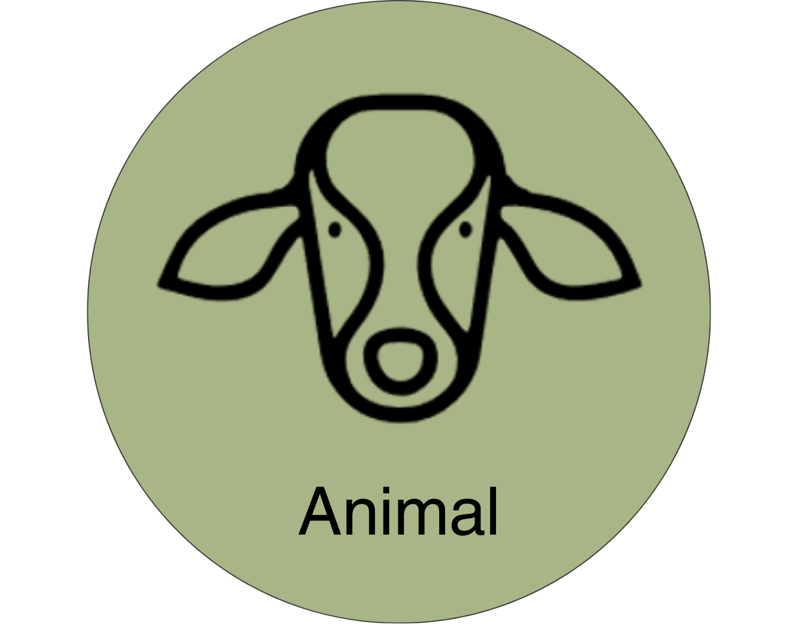

{width=35%}

# Animal Module
<!-- reuse code to import functions from "../scripts/": -->
  

## Introduction
The Animal Module simulates individual animals on a daily basis throughout each stage of life from birth until 
removal from the herd. In addition to the dynamic Monte-Carlo models that determine the occurrence of events 
throughout each animal’s life, the Animal Module uses process-based, dynamic models to simulate the following 
processes:

- Individual animal growth
- Gestation and milk production
- Estimation of nutrient requirements and feed intake
- Enteric emission and manure excretion 

### Animal Life Cycle
The animal life cycle is driven by Monte Carlo stochastic processes that simulate the growth, production, reproduction, 
and culling of individual dairy cattle animals and shares aggregated outcomes with the herd management sub-module to 
manage herd dynamics on a daily basis. 

The life cycle module represents the variation in animal performance through the use of Monte Carlo Simulation 
methods [@reuven_2017]. Monte Carlo simulation relies on random draws from probability distributions rather than 
assigning fixed values. In this model, two main strategies are used:

- Event-based, in which a random draw from a uniform distribution ($U(0,1)$) is compared to the probability of an 
event occurring to simulate if that event occurs, and 
- Population-based, in which a random draw from a known distribution of attribute values is assigned to an animal at
instantiation. Probability distributions used for that purpose are Normal Gaussian or Empirical. 

Each animal within the RuFaS herd progresses through five main life stages (calf, Heifer I, Heifer II, Heifer III,
and Cow) as illustrated in the figure below. 

-  Calves progress to Heifer I when their age reaches the user-defined input for weaning day
-  Heifer I progresses to Heifer II when their age reaches the user-defined input for breeding start day 
-  Heifer II animals that successfully conceive become Heifer III's when the number of days left in their pregnancy 
is equal to the user-defined input for prefresh days (default 21)
-  When a Heifer III calves, she becomes a Cow for the rest of her life on the RuFaS farm
-  Cows cycle through lactating and non-lactating phases until they are removed from the herd due to a failure to 
conceive or a user-provided probability for sale or death within each parity (lactation).

When a HeiferIII or Cow reaches full gestation length, they start lactating and a new calf object is created. The calf 
is assigned a birthweight according to a user-informed random distribution. All male calves are recorded and removed 
from the farm on day 1 of their life. Female calves either remain on the farm or are sold on day 1, determined by an 
event-based Monte Carlo method informed by the user-defined percent of female calves that are kept. 

## Herd-level Processes and Management

### Herd Initialization

::: {.callout-note}

In RuFaS code, the term “herd initialization” is used to refer to both the process of generating an animal population 
file and of selecting from that population to create a specific herd at the start of a simulation. In this doc, those 
two processes will be differentiated by calling them “Generation” and “Selection”, respectively. 

“Animal population” can refer to both groups of animals (the pool of animals generated, and the herd of animals 
selected). In the code, the population is sometimes referred to as “pre_animal_population” and 
“post_animal_population” to differentiate whether the specified group of animals exists before or after the random 
selection of individuals to create a herd.

:::

#### Introduction to Herd Initialization

Every simulation begins with a herd consisting of calves, heifers, and dry and lactating cows. This herd comes to be 
through a two-step process: 

- A population of animals is generated through simulation or loaded from data (pre-animal-population). The animals in 
that herd should reflect the attributes of animals in the herd to be modeled. 
- Animals are randomly selected with replacement from the pre-animal-population to be in the initial herd, based on 
group numbers and characteristics that reflect the distribution of animals within the herd being modeled. Note that 
the animals in the herd on day one will have attributes of the pre-animal-population and may deviate from the desired 
herd to be modeled.  

For the rest of the simulation, animals enter the herd through birth as newborn calves or purchased replacements 
(heiferIII’s). 


```{python}
#| label: tbl-an-sim-outline
#| tbl-cap: Overview of the distinct phases by which animals are created and introduced to the herd.
import_table(
  "../resources/table_data/tbl-an-sim-outline.csv",
  colalign = ["left", "left", "right", "right", "right"]
  maxcolwidths = [None, 20, None, None]
)
```

#### Relevant Inputs
```{python}
#| label: tbl-an-herd-inputs
#| tbl-cap: User inputs in the animal input file that influence the generation of the Animal Population (pre-animal-population). The inputs of this table are found in the Herd Initialization Section.
import_table(
  "../resources/table_data/tbl-an-herd-inputs.csv",
  colalign = ["left", "left", "right", "right", "right"]
  maxcolwidths = [None, 20, None, None]
)
```

#### Relevant Outputs

After the animals have been selected from the animal population to create the initial herd, a summary of the Population
(pre-selection pool, aka pre-animal-population) and of the Initial herd (selected animals, aka post-animal-population) 
is provided to the output manager. 

Class and function: AnimalModuleReporter.report_animal_population_statistics

Output variables: 
- .population_{...}
- .initial_{...}

{...} includes: breed, number of animals of each class (calf, heiferI, heiferII, heiferIII, cow), number of cows by 
parity and lactation status, average age of animals within each class, distribution of age of animals within each 
class, average body weight of animals within each class, average cow days in milk, days in preg, parity, and calving 
interval. 


#### Methodology

When a simulation begins, the HerdFactory class generates or loads the pre-animal-population, from which it selects and 
compiles the post-animal-population with an appropriate distribution of animal ages and stages to serve as the starting 
herd for simulation. 

**Designation of an Animal Population**

- Option 1: Creating a new Animal Population
An animal population can be generated as a stand-alone simulation task that creates and saves a pre-animal-population 
file  as the output based on the user Animal Module inputs. Or, the animal population can be generated as the first 
step of a regular simulation task which then uses that generated pre-animal-population to select from and create the
post-animal-population to use for the subsequent herd simulation. See the documentation about Task Manager for more 
information about how to generate a new pre-animal-population. 

The _generate_animals() method creates the pre_animal_population, with the option to save those animals to file at the 
end of the generation process. 

Calves are created according to the number specified by the user (initial_animal_num), some are sold based on user 
inputs, and those remaining proceed through select daily updates (growth, reproduction, milk, and transition through 
the appropriate life stages) for the user-specified number of days (simulation_days). The simulation occurs similarly 
to the regular life cycle simulation process, but with an extended period and large number of animals. There are a few 
notable distinctions:  

- After 3000 days of simulation (specified in animal_constants), a copy of each heiferIII is saved to the replacement 
herd. The copy is made on the day when she is ready to transition to a lactating cow (ready to give birth), so that 
when the copy enters the herd as a purchased heiferIII during the actual simulation, she will give birth the very 
next day. 
- If a cow has made it to parity six without being culled, she is removed from the herd. (The maximum parity of cows 
kept in the generated herd is five). 

After the simulation_days number of days, the full herd contains a mixture of calves, heifers, cows, and replacements. 
The core status information and life history of each animal are either saved to file or passed for random sampling to 
create the post-animal-population. 

- Option 2: Point to an existing Animal Population
Alternatively, the pre-animal-population will be loaded from a specified Animal Population input file consisting of 
calf, heifer, cow, and replacement objects. 

*Herd Selection*
The _random_sample_with_replacement() method selects animals from each of the following groups: calf, heiferI, 
heiferII, heiferIII, replacement, lactating cows by parity for parities 1-5, and dry cows by parity for parities 1-5. 

Animals are sampled randomly with replacement from the pre-animal-population according to the numbers, parity 
fractions, and milking cow fraction specified in the animal input file. The resulting list of animals is returned as 
the post-animal-population and summaries of the pre- and post-animal-populations are reported to the output manager.

### Pens and Animal Grouping

#### Introduction to Grouping

All animals in RuFaS are assigned to a pen which is used to summarize nutrient requirements for diet formulation and 
feeding, aggregate enteric methane and manure excretions for reporting and passage to the Manure Module. Each pen 
tracks and updates daily a list of animals in the pen, the stocking density, the average nutrient requirement of the 
animals in the pen, the ration being fed to that pen, the manure excreted, and the methane emitted. In addition, 
constant attributes of each pen include the type of pen it is (freestall, tiestall, open lot, compost bedded pack 
barn), the type of animals that can be in that pen, the number stalls, the manure management practices associated with 
that pen, and the distance to the milking parlor for lactating cows.  Each day after the HerdManager has updated the 
status of each animal and determined which animals need to be bought or sold, the animals are added and removed from 
pens as needed. 

**Relevant Inputs**
```{python}
#| label: tbl-an-grp-inputs
#| tbl-cap: User inputs in the animal input file that influence pen grouping. The user must define at least 3 pens and for
#|  each pen, key inputs are outlined here.
import_table(
  "../resources/table_data/tbl-an-grp-inputs.csv",
  colalign = ["left", "left", "right", "right", "right"]
  maxcolwidths = [None, 20, None, None]
)
```

**Relevant Outputs**

- **number\_of_animals\_in\_pen\_[id]\_[AnimalCombination]** - reports the number of animals in each pen each day.

- **ration\_per\_animals\_for\_pen\_[id]\_[AnimalCombination]** - reports average dry matter intake of an animal in the 
pen at the time of the ration formulation.

- **ration\_per\_animals\_for\_pen\_[id]\_[AnimalCombination].[RUFAS\_feed\_id]** - reports the amount of each feed 
that is delivered per animal in the pen

- **ration\_nutrient\_amount\_for\_pen\_[AnimalCombination].[nutrient]** - is reporting the amount of each of the 
following nutrients that is provided by the ration per animal in the pen (all reported in kilograms unless otherwise 
indicated)


#### Methodology

**Animal Grouping**
To translate from the AnimalTypes needed to track an animal’s life stages and the combinations of animals that are 
allowed to be grouped into a single pen, a new variable called AnimalCombination is created that combines some 
AnimalTypes to facilitate sorting into pens. The AnimalCombination class is defined in enums.py and includes the 
following mapping from AnimalTypes to AnimalCombinations:

```{python}
#| label: tbl-an-def-grp
#| tbl-cap: Summary of animal types and their grouping included in this module.
import_table(
  "../resources/table_data/tbl-an-def-grp.csv",
  colalign = ["left", "left", "right", "right", "right"]
  maxcolwidths = [None, 20, None, None]
)
```
Currently there are only two options for assigning AnimalCombinations to pens. 

- *Option 1* The first and most commonly used option for grouping animals is to assign one AnimalCombination to each 
pen such that there is at least one pen for the 4 AnimalCombinations: CALF, GROWING, CLOSE_UP, and LAC_COW. 

- *Option 2* In some cases, and especially in very small farms, a user might wish to represent a scenario where all 
growing animals, pregnant heifers, and non-lactating cows are housed together. In this case, there is an option to 
have a pen that houses both GROWING and CLOSE_UP animals such that the there is at least one pen with each of the 3
AnimalCombination inputs: CALF, GROWING_AND_CLOSE_UP, and LAC_COW. 


Pen Sizing: Due to oscillations in the exact number of animals in each animal type, it is strongly recommended that 
the stocking density is at least 120\% of the expected number of animals in each pen. 

Class: *Pens* are inare initiated from the Pen class by the HerdManager at the beginning of the simulation and, if 
needed, an additional pen is created to accommodate animals if the animal numbers have exceeded the max stocking 
density. 

::: {.callout-note}
**Remove_animals_by_ids** - This function is called when the HerdManager calls for: remove_animal_from_pen_and_id_map. 

It is pen specific and removes the animal from the pen and the animal ID from the animal ID map that tracks the 
animals in the pen. 

**_add_new_animals** - This function is called by Pen.update_animals which is in turn called by
HerdManager._add_animal_to_pen_and_id_map. Thus, when HerdManager initiates addition of animals to each pen, this 
function executes the addition of those animals _animal_nutritional_requirements

:::

### Ration Formulation

The diet recipes in RuFaS are either formulated through least-cost formulation [@Li_2022] or provided by the user for 
each of 4 animal categories (calves, growing heifers, dry and close-up cows, and lactating cows). The composition of 
the available feeds are provided by a feed library that was adapted from the [@nrc_2021]. The amount of feed required 
by the farm is tracked by pen and multiple pens of each animal category can be simulated; however, at this time, the 
RuFaS model can only accept 1 user-defined diet per animal category even if there are multiple simulated pens for that 
animal category.  

In practice, animal feeding on dairy farms is a constantly evolving process that responds to fluctuations in feed 
availability, animal requirements and responses, and management goals. Although the feed delivery algorithms will 
make small modifications to the diet recipe in response to animal nutrient requirements and adjust the total amount 
of feed delivered based on the number of animals and their requirements, the diversity and degree of fluctuation in 
the diets is less than what is expected on a commercial dairy. The RuFaS feed library can also be modified or 
expanded on by changing the compositions of the existing feeds or by adding new feeds. 

Regardless of whether or not a user chooses to provide their own ration or have RuFaS build and feed a ration 
optimized for least-cost, RuFaS needs a set of ingredients to work from. The RuFaS feed library should be consulted 
for the full list of ingredients and ingredients that are in both the NASEM and NRC libraries can be used. Users 
interested in feeding a ration that they define, need to provide a list of ingredients and their relative % dry 
matter intake for each animal class (pre-weaned calves, growing heifers, close-up animals, and lactating cows). 


If a user would like RuFaS to use the list of ingredients to formulate a least-cost ration, it is imperative that 
proper costs are inputted for each ingredient listed, but the % dry matter intake in the user defined ration 
percentages does not need to be included. Feed costs need to be entered in kg/DM. RuFaS will then use all the 
ingredients available (based on costs and inventory available if the feed is homegrown) to create a ration that 
meets the nutritional requirements of the animal class and is cost-optimized. 


::: {.callout-note}
For the time being, only one set of feeds and ration formula can be provided for each animal class. 
:::

#### Energy and Nutrition Requirements

**NRC: Calculating Nutrient Requirements of Dairy Cattle**

Below are the calculations utilized based on the energy and nutrient requirements of dairy cattle as reported by 
the NRC and more recently the NASEM @nrc_2001, @nrc_2021.

Calculations are included for the following requirement categories:

- Energy (Maintenance, Activity, Growth, Pregnancy, Lactation)
- Protein (Maintenance, Growth, Pregnancy, Lactation)
- Minerals (Maintenance, Growth, Pregnancy, Lactation)
- Dry Matter Intake
- Amino Acids (NASEM only) 

Where appropriate, requirement calculations are differentiated by animal age and reproductive status.

#### Nutrient Requirements of Dairy Cattle (NRC)

**Energy Requirements**
For details about the variables included in each calculation, please refer to tbl-energy-req for a full list.

*Maintenance* The maintenance requirement is calculated based on metabolic body weight (body weight$^{0.75}$).

* Lactating and Dry Cows

::: {#eq-an-nrc-1}
$$
\text{CBW} = \text{MW} \times 0.06275
$$
<p style="text-align: right;">[AN.NRC.1]</p>
:::


::: {#eq-an-nrc-2}
$$
\text{CW} = (18 + (\text{DOP} - 190) \times 0.665)\left(\frac{\text{CBW}}{45}\right), \text{if DOP} > 190.0 
$$
<p style="text-align: right;">[AN.NRC.2]</p>
:::

*Otherwise*

::: {#eq-an-nrc-3}
$$
\text{NEmaint} = 0.08\times (\text{BW} - \text{CW})^{0.75} 
$$
<p style="text-align: right;">[AN.NRC.3]</p>
:::

* Heifers : The maintenance requirement is calculated based on metabolic body weight (body weight^0.75), body condition score, and the previous month's temperatures.

::: {#eq-an-nrc-1}
$$
\text{CBW} = \text{MW} \times 0.06275
$$
<p style="text-align: right;">[AN.NRC.1]</p>
:::


::: {#eq-an-nrc-2}
$$
\text{CW} = (18 + (\text{DOP} - 190)\times 0.665)\left(\frac{\text{CBW}}{45}\right), \text{if DOP} > 190.0 
$$
<p style="text-align: right;">[AN.NRC.2]</p>
:::

*Otherwise*

::: {#eq-an-nrc-6}
$$
\text{BCS9} = (\text{BCS5} - 1) \times 2 + 1 
$$
<p style="text-align: right;">[AN.NRC.6]</p>
:::

::: {#eq-an-nrc-7}
$$
\text{NEmaint} = (\text{BW} - \text{CW})^{0.75}\times (0.086\times (0.8 + (\text{BCS9} - 5)\times 0.05) + 0.0007 \times (20 - \text{PrevTemp})) 
$$
<p style="text-align: right;">[AN.NRC.7]</p>
:::

*Activity* Activity requirement is proportional to body weight and daily walking distance. A grazing system and hilly topography will cost additional energy. 

* Lactating and Dry Cows

::: {#eq-an-nrc-8}
$$
\text{NEa1} = 0.0012\times \text{BW} 
$$
<p style="text-align: right;">[AN.NRC.8]</p>
:::

## Animal-level Process and Management

### RuFaS Bodyweight and Growth

#### Introduction 

An animal’s bodyweight is initialized at birth according to a user defined normal distribution.
Depending on her life stage, her bodyweight is then updated daily by adding their daily growth (commonly referred to 
as average daily gain), conceptus weight change, and tissue accretion and depletion associated with tissue mobilization 
to support lactation. The changes associated with each life stage are:

* Calves increase bodyweight by calf specific estimate for daily growth from birth to weaning.
* Non-pregnant heifers increase bodyweight by non-pregnant heifer specific estimate for daily growth from weaning 
until conception.
* Pregnant heifers  increase their bodyweight by the pregnant heifer specific estimate for daily growth and an 
estimate for conceptus growth.
* Cows in parity 1 and 2 increase their bodyweight according to a parity and pregnancy status specific estimate for 
daily growth, an estimate for conceptus growth, and an estimate for body tissue changes that occur in lactation.
* Cows in parities 3 and above change their bodyweight according to estimates for conceptus growth and body tissue 
changes that occur in lactation.
    
These methods are further described by @Li2023

#### Required User Inputs

```{python}
#| label: tbl-animal-growth-req-inputs
#| tbl-cap: Summary of the available inputs and their definitions.
import_table(
  "../resources/table_data/animal/animal-growth_required-inputs.csv",
  colalign = ["left", "left", "right", "right", "right"]
)
```

#### Expected Outputs

- `herd_statistics.avg_cow_body_weight` (kg): the daily average bodyweight of all cows in the herd 
- `Pen_[pen ID]_[pen animal combination].avg_BW` (kg): the daily average bodyweight of all animals in each pen
- `sold_weight` (kg)

#### Methodology

Most methods determining the bodyweight of animals in RuFaS are implemented in growth.py. 
    
The function evaluate_body_weight_change in growth.py calls the appropriate bodyweight change functions for each animal 
depending on their life stage and sums the appropriate changes into a single variable called `daily_growth.` 

After setting the daily bodyweight change in the daily_growth variable, the evaluate_body_weight_change function 
updates each animal's bodyweight by adding it to the current body_weight. Thus for all animals, the final updated 
body_weight is set as:

:::{#eq-an-bwt-5}
[[**AN.BWT.5**]]{.aside .content-visible when-format="html"}
$$
\text{body\_weight\_updated} = \text{body\_weight\_current} + \text{daily\_growth}
$$
:::

#### Calf Birth Weight

Calf birth weight is assigned in reproduction.py using a random draw from a truncated normal distribution 
based on user inputs for the breed-specific average and standard deviation of the birthweight. The distribution is 
truncated at +/- 2 SD from the mean to prevent extremely small or large calves. 

:::{#eq-an-bwt-6}
[[**AN.BWT.6**]]{.aside .content-visible when-format="html"}

$$
\text{Birth Weight} = \text{Random N} (\text{average\_birth\_weight\_by\_breed}, \text{std\_std\_birth\_by\_breed}) 
$$
:::

#### Calf Growth 

Calves are assumed to double their weight between birth and weaning based on recommendations 
of the @nrc_2001. Thus the target average daily gain is estimated as:

:::{#eq-an-bwt-7}
[[**AN.BWT.7**]]{.aside .content-visible when-format="html"}
$$
\text{target\_average\_daily\_gain} = \frac{\text{birth weight}}{\text{wean day}}
$$
:::

#### Non Pregnant Heifer Growth

The daily growth for non-pregnant heifers is estimated through an average daily 
gain to reach 55% of their manure bodyweight by the time they are pregnant. Because the actual age at pregnancy 
is not known, a user input for the target_heifer_preg_day is used to estimate the target average daily growth or ADG. 
A minimum daily growth rate of 0.5 kg/d is enforced so if the estimated daily_growth is less than 0.5 kg/d, the 
minimum value is used. 

:::{#eq-an-bwt-8}
[[**AN.BWT.8**]]{.aside .content-visible when-format="html"}

$$    
\text{target\_average\_daily\_gain} = \
  min \bigg(\frac{0.55×\text{MSBW}-\text{SBW}}{abs(\text{target heifer pregnant age}-\text{age})},0.5\bigg)
$$
:::

Where MSBW is mature shrunk bodyweight (0.96 x mature bodyweight) and SBW is shrunk bodyweight (0.96 x bodyweight)

#### Pregnant Heifer Growth

Heifers are targeted to grow to 82% of their mature body weight by the time of their 
first calving. A gestation length is set at conception. The ADG of pregnant heifers is calculated based on the target 
heifer's body weight, gestation length, and days in pregnancy. The gestation length for each animal is set at 
conception by calculate_gestation_length in reproduction.py.
 
:::{#eq-an-bwt-9}
[[**AN.BWT.9**]]{.aside .content-visible when-format="html"}
$$
\text{target\_average\_daily\_gain} = \frac{0.82 \times \text{MSBW}-\text{SBW}}{\text{gestation length} - \
  \text{days in pregnancy}}
$$
:::

#### Parity 1 and 2 Cow Growth

The daily growth of cows is calculated based on the target of reaching 92% of the 
mature body weight by the end of the 1st lactation, and full mature body weight at the end of the 2nd lactation. Before 
pregnancy, the daily growth is estimated based on the calving interval and during pregnancy the daily growth is 
calculated based on days until calving. 

##### Parity 1 Animals:

If not pregnant:

:::{#eq-an-bwt-10}
[[**AN.BWT.10**]]{.aside .content-visible when-format="html"}
$$    
\text{target\_average\_daily\_gain} = \frac{(0.92-0.82) \times \text{MSBW}}{\text{calving\_interval}}
$$
:::

If pregnant:    

:::{#eq-an-bwt-11}
[[**AN.BWT.11**]]{.aside .content-visible when-format="html"}
$$    
\text{target\_average\_daily\_gain} = \frac{0.92 \times \text{MSBW} - \text{bodyweight}}{\text{gestation\_length} - \text{DIP}}
$$
:::

##### Parity 2 Animals

If not pregnant:

:::{#eq-an-bwt-12}
[[**AN.BWT.12**]]{.aside .content-visible when-format="html"}
$$    
\text{target\_average\_daily\_gain} = \frac{(1 - 0.92) \times \text{MSBW}}{\text{calving\_interval}}
$$
:::

If pregnant:

:::{#eq-an-bwt-13}
[[**AN.BWT.13**]]{.aside .content-visible when-format="html"}
$$    
\text{target\_average\_daily\_gain} = \frac{(\text{MSBW} - \text{bodyweight})}{\text{gestation\_length} - \text{DIP}}
$$
:::    
    
The gestation length for cows is estimated with the same methods that are used for heifers and the calving interval 
is set either as the average herd calving interval or the animal’s own calving interval which is calculated as the age 
at her second calving minus her age at first calving as part of the daily_reproduction_update in animal.py.


#### Conceptus Growth

Conceptus growth is estimated the same way for both heifers and cows using a non-linear model for animals that are 
greater than 50 days in pregnancy based on the methods developed by @Korver1985. 

    
If the heifer or cow days in pregnancy is greater than 50  and less than the gestation length:


First the expected total conceptus weight is estimated using an empirical equation based on the calf birth weight and the gestation length:

:::{#eq-an-bwt-14}
[[**AN.BWT.14**]]{.aside .content-visible when-format="html"}

$$     
\text{conceptus\_total\_weight} = (0.0148 \times \text{gestation\_length}) × \text{calf\_birth\_weight}
$$
:::

Then an animal specific conceptus parameter is calculated:

:::{#eq-an-bwt-15}
[[**AN.BWT.15**]]{.aside .content-visible when-format="html"}
$$     
\text{conceptus\_parameter} = \frac{\text{total\_conceptus\_weight}^\frac{1}{3}}{\text{gestation\_length} - 50}
$$
:::

Finally, the conceptus growth is estimated as:

:::{#eq-an-bwt-16}
[[**AN.BWT.16**]]{.aside .content-visible when-format="html"}
$$     
\text{conceptus\_growth} = 3 \times \text{conceptus parameter}^3 \times (\text{DIP} - 50)^2
$$
:::

When days_in_pregnancy = gestation_length and the animal calves, then conceptus growth is set to the negative value of 
the current conceptus_weight such that the weight of the calf and placenta are subtracted from the cow’s bodyweight 
when her bodyweight is updated.

:::{#eq-an-bwt-17}
[[**AN.BWT.17**]]{.aside .content-visible when-format="html"}
$$        
\text{conceptus\_growth} = \text{conceptus\_weight}
$$
:::

#### Tissue Change Due to Lactation

Lactation related tissue changes are estimated by a non-linear model presented by @Galvao2013 that estimates the 
daily tissue mobilized during lactation. 

:::{#eq-an-bwt-18}
[[**AN.BWT.18**]]{.aside .content-visible when-format="html"}

$$     
\text{bodyweight\_tissue\_change} = \frac{\text{P1}}{\text{P2}} \times \
  exp\bigg(1 - \frac{\text{DIM}}{\text{P2}}\bigg) + \
  \text{DIM} \times exp\bigg(1 - \frac{\text{DIM}}{\text{P2}}\bigg)
$$
:::

Where P1 and P2 are parameters with distinct values for primiparous and multiparous cows:

```{python}
#| label: tbl-animal-growth-params
#| tbl-cap: Summary of the available inputs that are available and their definitions.
import_table(
  "../resources/table_data/animal/animal-bwt-parameters.csv"
)
```

During the dry period, the net tissue change is assumed to be restored during the dry period. The net tissue change is 
estimated on the last day of lactation as: 

:::{#eq-an-bwt-19}
[[**AN.BWT.19**]]{.aside .content-visible when-format="html"}

$$
\text{tissue\_changed} = \text{P1} \times \frac{\text{DIMlast}}{\text{P2}} \times \
  exp \bigg(1 - \frac{\text{DIMlast}}{\text{P2}}\bigg) + \
  \text{DIM} \times exp \bigg(1 - \frac{\text{DIM}}{\text{P2}}\bigg)
$$

::::{.content-visible when-format="pdf"}
\begin{flushright} [\textbf{AN.BWT.19}] \end{flushright}
::::
:::
and 

:::{#eq-an-bwt-20}
[[**AN.BWT.20**]]{.aside .content-visible when-format="html"}
$$
\text{bodyweight\_tissue\_change} = \frac{\text{tissue changed}}{\text{gestation length} - \text{DIPdry}}
$$
:::

### Animal Reproduction

<!-- TODO -->

### Milk Production

<!-- TODO -->

### Lactation Curve: Parameters and Definitions

<!-- TODO -->

### Culling

<!-- TODO -->

## Methane Emission and Manure Excretion

### Manure Excretion

**Introduction**

The Manure Excretion Calculator module computes manure excretion for different animal categories, including calves, 
growing heifers, lactating cows, and dry cows. It calculates the quantities of total mass and nutrient composition in 
manure. The implementation is designed for flexibility, enabling integration with other RuFaS modules for modeling 
farm management scenarios. This module includes:

- *Classes:* ManureExcretionCalculator
- *Key Methods:*
  - calculate_calf_manure
  - calculate_heifer_manure
  - calculate_cow_manure
  - _calculate_lactating_cow_manure
  - _calculate_dry_cow_manure
  - _calculate_phosphorus_excretion_values

This module integrates with the process_digestion method in the DigestiveSystem class to calculate manure excretion on 
a daily and per-animal basis. It plays a critical role in linking animal-level digestion processes with downstream 
environmental and nutrient management models.

The module takes inputs that include general animal properties (e.g., body weight, nutrient intake, and nutrient 
compositions), milk production characteristics (e.g., fat and protein content), specific nutrient properties (e.g., 
urine phosphorus requirements), and animal categories (e.g., CALF, HEIFER, COW). The outputs from this module are 
detailed manure excretion metrics, such as total manure mass, nutrient content, and volatile solids. In addition, an
animal-class specific methane potential is assigned to manure upon excretion. These outputs are used by the Manure 
Module for downstream calculations, including manure methane (CH<sub>4</sub>) emissions and nutrient balance tracking.

**Required User Inputs**

The Manure Excretion Calculator module computes manure excretion metrics for various animal categories. Inputs are 
drawn from pen ration files and animal module constants. They are organized into the following groups:

```{python}
#| label: tbl-an-gen-manexc-inputs
#| tbl-cap: General animal and diet inputs used to calculate nutrient intake and manure production.
import_table(
  "../resources/table_data/tbl-an-gen-manexc-inputs.csv",
  colalign = ["left", "left", "right", "right", "right"]
  maxcolwidths = [None, 20, None, None]
)
```


```{python}
#| label: tbl-an-cow-input-manexc
#| tbl-cap: Cow related inputs, particularly relevant for lactating animals.
import_table(
  "../resources/table_data/tbl-an-cow-input-manexc.csv",
  colalign = ["left", "left", "right", "right", "right"]
  maxcolwidths = [None, 20, None, None]
)
```

```{python}
#| label: tbl-an-cow-phos-input-manexc
#| tbl-cap: Phosphorus related inputs relevant to lactating cows.
import_table(
  "../resources/table_data/tbl-an-cow-phos-input-manexc.csv",
  colalign = ["left", "left", "right", "right", "right"]
  maxcolwidths = [None, 20, None, None]
)
```

**Expected Outputs**

The outputs from the Manure Excretion Calculator are organized into two main categories: manure excretion values and 
manure nutrient composition. These outputs are consistently generated across animal categories.

```{python}
#| label: tbl-an-manexc-outputs
#| tbl-cap: Expected outputs from the manure excretion calculator.
import_table(
  "../resources/table_data/tbl-an-manexc-outputs.csv",
  colalign = ["left", "left", "right", "right", "right"]
  maxcolwidths = [None, 20, None, None]
)


**Methodology**


**1. Calf Manure Excretion (calculate_calf_manure)**

**Manure excretions**

Manure: amount of feces and urine excreted daily by a calf (kg/d):

::: {#eq-an-exc-1}
[[**AN.EXC.1**]]{.aside .content-visible when-format="html"}
$$
\text{total\_manure\_excreted} = 3.45 \times \text{dry\_matter\_intake}
$$
:::

Urine: amount of urine in kg, this is an assumption:

::: {#eq-an-exc-2}
[[**AN.EXC.2**]]{.aside .content-visible when-format="html"}
$$
\text{urine} = 2.0
$$
:::

Manure total solids: amount of dry material excreted by the calf (kg/d):

::: {#eq-an-exc-3}
[[**AN.EXC.3**]]{.aside .content-visible when-format="html"}
$$
\text{total\_solids} = 0.393 \times \text{dry\_matter\_intake}
$$
:::

Total volatile solids (kg/d):

::: {#eq-an-exc-4}
[[**AN.EXC.4**]]{.aside .content-visible when-format="html"}
$$
\text{total\_volatile\_solids} = 0.0023 \times \text{body\_weight}
$$
:::

Degradable volatile solids exretion (kg/d):

::: {#eq-an-exc-5}
[[**AN.EXC.5**]]{.aside .content-visible when-format="html"}
$$
\text{degradable\_volatile\_solids} = 0.9 \times \text{total\_volatile\_solids}
$$
:::

Non-degradable volatile solids excretion (kg/d):

::: {#eq-an-exc-6}
[[**AN.EXC.6**]]{.aside .content-visible when-format="html"}

$$
\text{non\_degradable\_volatile\_solids} = \text{total\_volatile\_solids} - \text{degradable\_volatile\_solids} 
$$
:::

**Manure nutrient composition**

Manure nitrogen excretion (kg/d):

::: {#eq-an-exc-7}
[[**AN.EXC.7**]]{.aside .content-visible when-format="html"}
$$
\text{manure\_nitrogen} = \frac{\left(112.55 \times \text{dry\_matter\_intake} \times \
\frac{\text{crude\_protein}}{100}\right)}{1000} 
$$
:::

Urine nitrogen excretion (kg/d):

::: {#eq-an-exc-8}
[[**AN.EXC.8**]]{.aside .content-visible when-format="html"}
$$
\text{urine\_nitrogen} = 0.45 \times \text{manure\_nitrogen} 
$$
:::

Manure total ammoniacal nitrogen (kg/d):

::: {#eq-an-exc-9}
[[**AN.EXC.9**]]{.aside .content-visible when-format="html"}
$$
\text{manure\_total\_ammoniacal\_nitrogen} = \text{urine\_nitrogen}
$$
:::

**2. Heifer Manure Excretion (calculate_heifer_manure)**

**Manure excretions**

Urine excretion (kg/d):

::: {#eq-an-exc-10}
[[**AN.EXC.10**]]{.aside .content-visible when-format="html"}
$$
\text{urine} = 9.0 
$$
:::

Total manure excretion (kg/d):

::: {#eq-an-exc-11}
[[**AN.EXC.11**]]{.aside .content-visible when-format="html"}

$$
\text{total\_manure\_excreted} = (4.158 \times \text{dry\_matter\_intake}) - (0.246 \times \text{body\_weight})
$$
:::

Because the equations that predict total manure excreted and total solids excreted rely on different inputs, in some 
extreme cases, the total mass of manure excreted can be predicted to be very close to the predicted total solids 
excreted which is unrealistically dry. For this reason, we set a maximum manure dry matter content of 20\% for heifers 
and dry cows. If the mass predicted by equation [AN.EXC.11](#eq-an-ex-11) is not greater than (total solids/minimum 
dry matter) then: 

::: {#eq-an-exc-11ALT}
[[**AN.EXC.11ALT**]]{.aside .content-visible when-format="html"}
$$
\text{total\_manure\_excreted} = \frac{\text{total\_solids}}{\text{dry\_matter\_manure}} 
$$
:::

Total solids excretion (kg/d) - this is the same equation that is used for dry cows:

::: {#eq-an-exc-12}
[[**AN.EXC.12**]]{.aside .content-visible when-format="html"}
$$
\text{total\_solids} = 0.178 \times \text{dry\_matter\_intake} + 2.733
$$
:::

Total volatile solids excretion (kg/d):

::: {#eq-an-exc-13}
[[**AN.EXC.13**]]{.aside .content-visible when-format="html"}
$$
\text{total\_volatile\_solids} = 0.0071 \times \text{body\_weight}
$$
:::

Degradable volatile solids excretion (kg/d):

$$
\text{degradable\_volatile\_solids} = 0.9 \times \text{total\_volatile\_solids}
$$
[See [AN.EXC.5](#eq-an-exc-5)]{.aside .content-visible when-format="html"}

Non-degradable volatile solids excretion (kg/d):


$$
\text{non\_degradable\_volatile\_solids} = \text{total\_volatile\_solids} - \text{degradable\_volatile\_solids} 
$$
[See [AN.EXC.6](#eq-an-exc-6)]{.aside .content-visible when-format="html"}

**Manure nutrient composition**

Manure nitrogen excretion (kg/d):

::: {#eq-an-exc-14}
[[**AN.EXC.14**]]{.aside .content-visible when-format="html"}

$$
\text{manure\_nitrogen} = 15.1 + 8.83 \times \frac{\left(\text{dry\_matter\_intake} \times 1000 \times \
\frac{\frac{\text{crude\_protein\_concentration}}{6.25}}{100}\right)}{1000}
$$
:::

Fecal nitrogen excretion (kg/d):

::: {#eq-an-exc-15}
[[**AN.EXC.15**]]{.aside .content-visible when-format="html"}

$$
\text{fecal\_nitrogen} = 0.345 + 0.317 \times \frac{\left(\text{dry\_matter\_intake} \times 1000 \times \
\frac{\frac{\text{crude\_protein\_concentration}}{6.25}}{100}\right)}{1000}
$$
:::

Urine nitrogen excretion (kg/d):

::: {#eq-an-exc-16}
[[**AN.EXC.16**]]{.aside .content-visible when-format="html"}
$$
\text{urine}_{\text{nitrogen}} = \text{manure}_{\text{nitrogen}} - \text{fecal}_{\text{nitrogen}}
$$
:::

Manure total ammoniacal nitrogen (kg/d)

$$
\text{manure\_total\_ammoniacal\_nitrogen} = \text{urine\_nitrogen} 
$$
[See [AN.EXC.9](#eq-an-exc-9)]{.aside .content-visible when-format="html"}


Manure potassium excretion (g/d):

::: {#eq-an-exc-17}
[[**AN.EXC.17**]]{.aside .content-visible when-format="html"}
$$
\text{potassium} = 1000 \times \text{dry\_matter\_intake} \times \frac{\text{potassium\_concentration}}{100}
$$
:::


**3. Lactating Cow Manure Excretion (\_calculate\_lactating\_cow\_manure)**

**Manure exretions**

Fecal water (kg/d): Calculate the amount of fecal water excreted (kg/d):

::: {#eq-an-exc-18"}
[[**AN.EXC.18**]]{.aside .content-visible when-format="html"}
$$
\begin{aligned}
  \text{fecal\_water} &= (1.987 \times \text{dry\_matter\_intake}) \
  &\quad + (0.348 \times \text{acid\_detergent\_fiber\_concentrations}) \\
  &\quad - (0.412 \times \text{crude\_protein\_concentration}) \\
  &\quad - (0.074 \times \text{dry\_matter\_concentration}) \\
  &\quad - (0.0057 \times \text{days\_in\_milk})
\end{aligned} 
$$
:::

Total solids/Fecal dry matter (kg/d): Calculate the amount of fecal dry matter excreted (kg/d). Fecal dry matter is 
assumed to be equivalent to total solids:

::: {#eq-an-exc-19}
[[**AN.EXC.19**]]{.aside .content-visible when-format="html"}
$$
\begin{aligned}
  \text{fecal\_solids} &= 0.576 \\
  &\quad + (0.370 \times \text{dry\_matter\_intake}) \\
  &\quad - (0.075 \times \text{crude\_protein\_concentration}) \\
  &\quad + (0.059 \times \text{acid\_detergent\_fiber\_concentrations})
\end{aligned}
$$
:::

Urine (kg/d):

::: {#eq-an-exc-20}
[[**AN.EXC.20**]]{.aside .content-visible when-format="html"}
$$
\begin{aligned}
  \text{urine} &= -7.742 \\
  &\quad + (0.388 \times \text{dry\_matter\_intake}) \\
  &\quad + (0.726 \times \text{crude\_protein\_concentration}) \\
  &\quad + (2.066 \times \text{milk\_protein})
\end{aligned}
$$
:::

Total manure exretion (kg/d):

::: {#eq-an-exc-21}
[[**AN.EXC.21**]]{.aside .content-visible when-format="html"}
$$
\text{total\_manure\_excreted} = \text{fecal\_water} + \text{fecal\_solids} + \text{urine}
$$
:::

Organic matter intake (kg/d):

::: {#eq-an-exc-22}
[[**AN.EXC.22**]]{.aside .content-visible when-format="html"}
$$
\text{organic\_matter\_intake} = \text{dry\_matter\_intake} - \text{ash\_diet\_content}
$$
:::

Degradable volatile solids (kg/d):

::: {#eq-an-exc-23}
[[**AN.EXC.23**]]{.aside .content-visible when-format="html"}
$$
\begin{aligned}
  \text{degradable\_volatile\_solids} &= -1.017 \\
  &\quad + (0.364 \times \text{organic\_matter\_intake}) \\
  &\quad + (0.029 \times \text{neutral\_detergent\_fiber\_concentration}) \\
  &\quad - (0.023 \times \text{crude\_protein\_concentration})
\end{aligned}
$$
:::

Total volatile solids exreted by a lactating cow (kg/d):

::: {#eq-an-exc-24}
[[**AN.EXC.24**]]{.aside .content-visible when-format="html"}
$$
\begin{aligned}
\text{total\_volatile\_solids} &= -1.201 \\
&\quad + (0.402 \times \text{organic\_matter\_intake}) \\
&\quad + (0.036 \times \text{neutral\_detergent\_fiber\_concentration}) \\
&\quad - (0.024 \times \text{crude\_protein\_concentration})
\end{aligned}
$$
:::

Non-degradable volatile solids excretion (kg/d):

$$
\text{non\_degradable\_volatile\_solids} = \text{total\_volatile\_solids} - \text{degradable\_volatile\_solids} 
$$
[See [AN.EXC.6](#eq-an-exc-6)]{.aside .content-visible when-format="html"}

**Manure nutrient composition**

Total manure nitrogen (kg/d):

::: {#eq-an-exc-25}
[[**AN.EXC.25**]]{.aside .content-visible when-format="html"}

$$
\text{manure\_nitrogen} = 20.3 + 0.654 \times \frac{\left(\text{dry\_matter\_intake} \times 1000 \times \frac{\frac{\text{crude\_protein\_concentration}}{6.25}}{100}\right)}{1000}
$$
:::

Fecal nitrogen (kg/d):

::: {#eq-an-exc-26}
[[**AN.EXC.26**]]{.aside .content-visible when-format="html"}
$$
\text{fecal\_nitrogen} = \frac{\left(10.1 \times \text{dry\_matter\_intake} - 18.5 \right)}{1000}
$$
:::

Urine nitrogen excretion (kg/d):

 
$$
\text{urine}_{\text{nitrogen}} = \text{manure}_{\text{nitrogen}} - \text{fecal}_{\text{nitrogen}}
$$
[See [AN.EXC.16](#eq-an-exc-16)]{.aside .content-visible when-format="html"}


Manure total ammoniacal nitrogen (kg/d):

$$
\text{manure\_total\_ammoniacal\_nitrogen} = \text{urine\_nitrogen}
$$
[See [AN.EXC.9](#eq-an-exc-9)]{.aside .content-visible when-format="html"}

Manure potassium excretion (g/d):

::: {#eq-an-exc-27}
[[**AN.EXC.27**]]{.aside .content-visible when-format="html"}

$$
\text{potassium} = \left(7.21 \times \text{dry\_matter\_intake}\right) + \left(15944 \times \frac{\text{potassium\_concentration}}{100}\right) - 164.5
$$
:::

**4. Dry Cow Manure Excretion (\_calculate\_dry\_cow\_manure)**

**Manure excretions**

Urine excretion (kg/d): Amount of urine excreted in kg with the assumption that 1.038 kg of urine is approximately 1 
L. Due to lack of information, average excretion rate from dry cows is assumed:

::: {#eq-an-exc-28}
[[**AN.EXC.28**]]{.aside .content-visible when-format="html"}
$$
\text{urine} = 15.4
$$
:::

Total manure excretion (kg/d): Amount of feces and urine excreted daily by dry cows (kg/d):

::: {#eq-an-exc-29}
[[**AN.EXC.29**]]{.aside .content-visible when-format="html"}
$$
\begin{aligned}
\text{total\_manure\_excreted} &= (0.00711 \times \text{body\_weight}) \\
&\quad + (0.324 \times \text{crude\_protein\_concentration}) \\
&\quad + (0.259 \times \text{neutral\_detergent\_fiber\_concentration})
\end{aligned}
$$
:::

Because the equations that predict total manure excreted and total solids excreted rely on different inputs, in some 
extreme cases, the total mass of manure excreted can be predicted to be very close to the predicted total solids 
excreted which is unrealistically dry. For this reason, we set a maximum manure dry content of 20% for heifers and 
dry cows. If the mass predicted by equation [AN.EXC.11](#eq-an-ex-11) is not great than (total solids/maximum manure 
dry matter content) then:

$$
\text{total\_manure\_excreted} = \frac{\text{total\_solids}}{\text{dry\_matter\_manure}}
$$
[See [AN.EXC.11ALT](#eq-an-exc-11ALT)]{.aside .content-visible when-format="html"}

Total solids excretion (kg/d) - this is the same equation used for lactating cows:

$$
\text{total\_solids} = 0.178 \times \text{dry\_matter\_intake} + 2.733
$$
[See [AN.EXC.12](#eq-an-exc-12)]{.aside .content-visible when-format="html"}

Organic matter intake (kg/d):

$$
\text{organic\_matter\_intake} = \text{dry\_matter\_intake} - \text{ash\_diet\_content}
$$
[See [AN.EXC.22](#eq-an-exc-22)]{.aside .content-visible when-format="html"}

Degradable volatile solids (kg/d):

$$
\begin{aligned}
\text{degradable\_volatile\_solids} &= -1.017 \\
&\quad + (0.364 \times \text{organic\_matter\_intake}) \\
&\quad + (0.029 \times \text{neutral\_detergent\_fiber\_concentration}) \\
&\quad - (0.023 \times \text{crude\_protein\_concentration})
\end{aligned}
$$
[See [AN.EXC.23](#eq-an-exc-23)]{.aside .content-visible when-format="html"}

Total volatile solids excreted by a dry cow (kg/d):

$$
\begin{aligned}
\text{total\_volatile\_solids} &= -1.201 \\
&\quad + (0.402 \times \text{organic\_matter\_intake}) \\
&\quad + (0.036 \times \text{neutral\_detergent\_fiber\_concentration}) \\
&\quad - (0.024 \times \text{crude\_protein\_concentration})
\end{aligned}
$$
[See [AN.EXC.24](#eq-an-exc-24)]{.aside .content-visible when-format="html"}

Non-degradable volatile solids excretion (kg/d):

:::{}
[See [AN.EXC.6](#eq-an-exc-6)]{.aside .content-visible when-format="html"}

$$
\text{non\_degradable\_volatile\_solids} = \text{total\_volatile\_solids} - \text{degradable\_volatile\_solids}
$$
:::

**5. Manure Phosporus Excretion (\_calulate\_phosphorus\_excretion\_manure)**

Total phosphorus fraction of feces:

::: {#eq-an-exc-30}
[[**AN.EXC.30**]]{.aside .content-visible when-format="html"}

$$
\text{manure\_phosphorus\_fraction} = \frac{\text{fecal\_phosphorus} + \text{urine\_phosphorus\_required}}{\text{total\_manure\_excreted} \times 1000 g/kg}
$$
:::

Inorganic phosphorus fraction:

::: {#eq-an-exc-31}
[[**AN.EXC.31**]]{.aside .content-visible when-format="html"}
$$
\text{inorganic\_phosphorus\_fraction} = 0.50 \times \text{manure\_phosphorus\_fraction}
$$
:::

Organic phosphorus fraction:

::: {#eq-an-exc-32}
[[**AN.EXC.32**]]{.aside .content-visible when-format="html"}
$$
\text{organic\_phosphorus\_fraction} = 0.05 \times \text{manure\_phosphorus\_fraction}
$$
:::

Milk phosphorus:

::: {#eq-an-exc-33}
[[**AN.EXC.33**]]{.aside .content-visible when-format="html"}
$$
\text{phosphorus\_in\_milk} = 0.0009 \times \text{daily\_milk\_production} \times 1000 g/kg
$$
:::

Manure phosphorus excreted by a cow (g/d):

::: {#eq-an-exc-34}
[[**AN.EXC.34**]]{.aside .content-visible when-format="html"}
$$
\text{manure\_phosphorus\_excreted} = \text{fecal\_phosphorus} + \text{urine\_phosphorus\_required}
$$
:::

Total phosphorus excrete by a cow (g/d)

::: {#eq-an-exc-35}
[[**AN.EXC.35**]]{.aside .content-visible when-format="html"}
$$
\text{total\_phosphorus\_excreted} = \text{phosphorus\_in\_milk} + \text{fecal\_phosphorus} \
  + \text{urine\_phosphorus\_required} 
$$
:::

**6. Manure Methane Potential**

The methane potential of the manure volatile solids are set by the **get_manure_streams()** method based on the 
Animal Combination of the pen. If the Animal Combination is CALVES or GROWING, the methan potential is set to 0.17. 
If the Animal Combination is LAC_COW or CLOSE_UP, the methane potential is set to 0.24 [@Hanson2024].

::: {.callout-note}
All references may be found at the end of this document or are based on expert communication with V. Sempali from 2023 
to 2024.
::: 

### Enteric Methane Emission

**Introduction**

The Enteric Methane Calculator module calculates daily enteric methane emissions for calves, heifers, lactating cows, 
and dry cows. Methane emissions are estimated based on animal characteristics, dietary intake, and a variety of 
animal category specific methane models. The IPCC model [@IPCC2006] is available for all animal classes except 
calves. The equation from Mills et al. [@Mills2003] is also available for dry and lactating cows and the 
Niu et al. [@Niu2018] equation is available for lactating cows. Finally, a separate equation published by 
Pattanaik et al. [@Pattanaik2003] is used for calves. Simulation of enteric methane mitigation via mitigation 
supplements 3-NOP or monensin are also available for lactating cows The module integrates with the 
DigestiveSystem class and supports methane mitigation strategies using feed additives.

- *Classes:* EntericMethaneCalculator
- *Key Methods:*
   - calculate_calf_manure
   - calculate_heifer_manure
   - calculate_cow_methane (lactating and dry cow methods are called within this method)
   - calculate_lactating_cow_manure
   - calculate_dry_cow_manure

The calculated enteric methane emissions are directly output to the Output Manager to generate the final reports.

**Required User Inputs**


```{python}
#| label: tbl-an-gen-enteric-met
#| tbl-cap: Animal and diet inputs used to calculate nutrient intake and manure production.
import_table(
  "../resources/table_data/tbl-an-gen-enteric-met.csv",
  colalign = ["left", "left", "right", "right", "right"]
  maxcolwidths = [None, 20, None, None]
)

```

```{python}
#| label: tbl-an-cow-enteric-met
#| tbl-cap: Cow specific inputs, particularly relevant for lactating animals.
import_table(
  "../resources/table_data/tbl-an-cow-enteric-met.csv",
  colalign = ["left", "left", "right", "right", "right"]
  maxcolwidths = [None, 20, None, None]
)

```

```{python}
#| label: tbl-an-model-methane
#| tbl-cap: Methane emissions model and mitigation strategy inputs.
import_table(
  "../resources/table_data/tbl-an-model-methane.csv",
  colalign = ["left", "left", "right", "right", "right"]
  maxcolwidths = [None, 20, None, None]
)

```

**Expected Outputs**

This module predicts the daily enteric methane emissions for individual animals:


```{python}
#| label: tbl-an-output-methane
#| tbl-cap: Expected outputs of the methane model.
import_table(
  "../resources/table_data/tbl-an-output-methane.csv",
  colalign = ["left", "left", "right", "right", "right"]
  maxcolwidths = [None, 20, None, None]
)

```


: Expected outputs. {#tbl-animal-enteric-methane-outputs}

**Methodology**

**1. Required Diet Composition Inputs**

Based on dry matter intake and gross energy concentration from nutrient composition:

::: {#eq-an-met-1}
[[**AN.MET.1**]]{.aside .content-visible when-format="html"}
$$
\begin{aligned}
\text{soluble\_residue} &= 100 \\
&\quad - \text{ash\_concentration} \\
&\quad - \text{neutral\_detergent\_fiber\_concentration} \\
&\quad - \text{crude\_protein\_concentration} \\
&\quad - \text{ethyl\_ester\_concentration}
\end{aligned}
$$
:::

::: {#eq-an-met-2}
[[**AN.MET.2**]]{.aside .content-visible when-format="html"}
$$
\begin{aligned}
\text{gross\_energy\_concentration} &= 0.263 \\
&\quad \times \left(\text{crude\_protein\_concentration} + 0.522\right) \\
&\quad \times \left(\text{ethyl\_ester\_concentration} + 0.198\right) \\
&\quad \times \left(\text{neutral\_detergent\_fiber\_concentration} + 0.160\right) \\
&\quad \times \text{soluble\_residue}
\end{aligned}
$$
:::

::: {#eq-an-met-3 style="font-size:80%;"}
[[**AN.MET.3**]]{.aside .content-visible when-format="html"}

$$
\text{starch\_acid\_detergent\_fiber\_concentration\_ratio} = -0.0011 \times \
  \frac{\text{starch\_concentration}}{\text{acid\_detergent\_fiber\_concentrations}}
$$
:::

**2. Calf Methane Emissions (calculate_calf_methane)**

Methance emissions are calculated using body weight. The selected methane model for other animal categories does not 
apply here. [@Pattanaik2003] reported no difference in calf methane production in crossbred calves. Methane emissions 
by calves are estimated from mean values observed in that study.

::: {#eq-an-met-4}
[[**AN.MET.1**]]{.aside .content-visible when-format="html"}
$$
\text{methane\_emission} = \frac{0.013 \times \text{body\_weight}^{0.75} \times 4.184 J/Mcal}{0.05565}
$$
:::

**3. Heifer Methane Emissions (calculate_heifer_methane)**

::: {#eq-an-met-5}
[[**AN.MET.5**]]{.aside .content-visible when-format="html"}

$$
\text{methane\_emission} = \frac{0.065 \times \text{gross\_energy\_concentrationdry\_matter\_intake}}{0.05565}
$$
:::

**4. Lactating Cow Methane Emissions (calculate_cow_methane)**

For lactating cows, the Mutian, Mills, or IPCC model is applied

**Mutian Model**

::: {#eq-an-met-6}
[[**AN.MET.6**]]{.aside .content-visible when-format="html"}
$$
\begin{aligned}
\text{methane\_emission} &= -126 \\
&\quad + (11.3 \times \text{dry\_matter\_intake}) \\
&\quad + (2.30 \times \text{neutral\_detergent\_fiber\_concentration}) \\
&\quad + (28.8 \times \text{milk\_fat}) \\
&\quad + (0.148 \times \text{body\_weight})
\end{aligned}
$$
:::

**Mills Model** Mills et al. [@Mills2003] parameterized Mitscherlich equations for a nonlinear model of methan 
emissions. The CNCPS and IFSM models use the Mitscherlich 3 equation.

::: {#eq-an-met-7 style="font-size:80%;"}
[[**AN.MET.7**]]{.aside .content-visible when-format="html"}

$$
\begin{aligned}
  \text{methane\_emission} = \frac{ 45.98 \times \
    e^{- \left( \text{starch\_to\_acid\_detergent\_fiber\_concentration\_ratio} + 0.0045 \right)} \
    \times \text{metabolizable\_energy\_intake} \times 4.184 }{ 0.05565 }
\end{aligned}
$$
:::

**IPCC Model**

:::{}
[See [AN.MET.5](#eq-an-met-5)]{.aside .content-visible when-format="html"}

$$
\text{methane\_emission} = \frac{0.065 \times \text{gross\_energy\_concentrationdry\_matter\_intake}}{0.05565}
$$
:::

**5. Dry Cow Methane Emissions (\_calculate\_dry\_cow\_manure)**

**Mills Model** Mills et al. [@Mills2003] parameterized Mitscherlich equations for a nonlinear model of methane 
emissions. The CNCPS and IFSM models use the Mitscherlich 3 equation.

:::{style="font-size:80%;"}
[See [AN.EXC.7](#eq-an-exc-7)]{.aside .content-visible when-format="html"}

$$
\begin{aligned}
  \text{methane\_emission} = \frac{ 45.98 \times \
    e^{- \left( \text{starch\_to\_acid\_detergent\_fiber\_concentration\_ratio} + 0.0045 \right)} \
    \times \text{metabolizable\_energy\_intake} \times 4.184 }{ 0.05565 }
\end{aligned}
$$
:::

**IPCC Model**

:::{}
[See [AN.EXC.5](#eq-an-exc-5)]{.aside .content-visible when-format="html"}

$$
\text{methane\_emission} = \frac{0.065 \times \text{gross\_energy\_concentrationdry\_matter\_intake}}{0.05565} 
$$
:::

**6. Methane Mitigation**

- Methane mitigation strategies are applied exclusively to lactating and dry cows. However, caution is advised when 
interpreting the outcomes for dry cows, as the equations used were developed based on datasets from lactating cows.
- Currently, the implemented methane mitigation feed additives include 3-NOP and monensin, with essential oils and 
seaweed planned for future integration.
- The detailed methodology for methane mitigation calculations will be provided in a separate document titled Methane 
Mitigation Calculator.

### Enteric Methane Mitigation

**Introduction**

The Methane Mitigation Calculator module evaluates the reduction in enteric methane yield due to the inclusion of 
specific feed additives in animal diets. This module calculates methane mitigation effects on a per-animal basis by 
considering dietary composition, feed additive dosage, and the selected mitigation strategy.
Currently, the module supports the following mitigation strategies:

- 3-NOP (3-Nitrooxypropanol)
- Monensin

Future updates will include additional strategies such as essential oils and seaweed. The mitigation effects are first
calculated as a percentage reduction in methane yield (methane production / DMI). Then this module integrates with 
the Enteric Methane Calculator to adjust the initially predicted enteric methane. 

**Required User Inputs**

The Methane Mitigation Calculator module evaluates the reduction in enteric methane yield based on dietary 
composition and the use of specific feed additives. The inputs are organized into the following groups:

```{python}
#| label: tbl-an-enter-met-diet-mitigate
#| tbl-cap: General dietary fiber and fat concentration inputs.
import_table(
  "../resources/table_data/tbl-an-enter-met-diet-mitigate.csv",
  colalign = ["left", "left", "right", "right", "right"]
  maxcolwidths = [None, 20, None, None]
)

```

```{python}
#| label: tbl-an-enter-met-additive-type-dose
#| tbl-cap: Feed based mitigation strategies and dosing.
import_table(
  "../resources/table_data/tbl-an-enter-met-additive-type-dose.csv",
  colalign = ["left", "left", "right", "right", "right"]
  maxcolwidths = [None, 20, None, None]
)

```
**Expected Outputs**

This module predicts the daily enteric methane emissions for individual animals: Below is the
[previous table from the Emissions section](#tbl-an-output-methane).


```{python}
#| label: tbl-an-output-methane
#| tbl-cap: Expected outputs of the methane model.
import_table(
  "../resources/table_data/tbl-an-output-methane.csv",
  colalign = ["left", "left", "right", "right", "right"]
  maxcolwidths = [None, 20, None, None]
)

```

**Methodology**

**3-NOP Methane Yield Reduction** Reduction is modeled as a function of additive dosage, NDF, EE, and starch concentrations.

::: {#eq-an-met-8}
[[**AN.MET.8**]]{.aside .content-visible when-format="html"}
$$
\begin{aligned}
  \text{methane\_yield\_reduction} &= -30.8 \\
  &\quad - \left(0.226 \times \left(\text{methane\_mitigation\_additive\_amount} - 70.5 \right)\right) \\
  &\quad + \left(0.906 \times \left(\text{neutral\_detergent\_fiber\_concentration} - 32.9 \right)\right) \\
  &\quad + \left(3.871 \times \left(\text{ethyl\_ester\_concentration} - 4.2 \right)\right) \\
  &\quad - \left(0.337 \times \left(\text{starch\_concentration} - 21.1 \right)\right)
\end{aligned}
$$
:::

**Monensin Methane Yield Reduction** Reduction is based on additive dosage and starch concentration.

::: {#eq-an-met-9}
[[**AN.MET.9**]]{.aside .content-visible when-format="html"}
$$
\begin{aligned}
  \text{methane\_yield\_reduction} &= 6.35 \\
  &\quad - \left(0.277 \times \text{methane\_mitigation\_additive\_amount} \right) \\
  &\quad - \left(0.182 \times \text{starch\_concentration}\right)
\end{aligned}
$$
:::

**Default Case** If no valid mitigation method is selected, the reduction defaults to 0%.

**Adjust the Initial Predicted Enteric Methane (EntericMethaneCalculator.calculate_-cow_methane)** First, the initially predicted methane yield of the basal diet is calculated

::: {#eq-an-met-10}
[[**AN.MET.10**]]{.aside .content-visible when-format="html"}
$$
\text{methane\_yield} = \frac{\text{methane\_emission}}{\text{dry\_matter\_intake}} \times 100
$$
:::

Then the adjusted methane production is calculated based on methane yield reduction (%)

::: {#eq-an-met-11}
[[**AN.MET.11**]]{.aside .content-visible when-format="html"}
$$
\begin{aligned}
  \text{adjusted\_methane\_emission} &= \text{methane\_yield} \\
  &\quad \times \left( 1 + \frac{\text{methane\_yield\_reduction}}{100} \right) \\
  &\quad \times \text{dry\_matter\_intake}
\end{aligned}
$$
:::

## References
