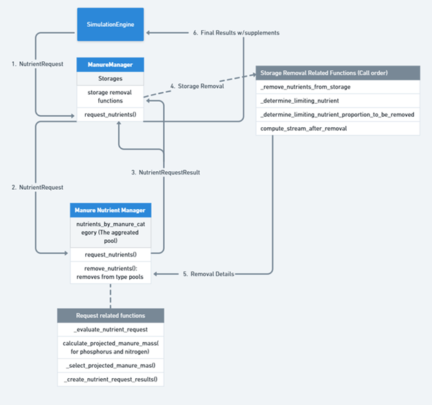

# Module Connections
<!-- reuse code to import functions from "../scripts/": -->


## Animal and Manure Module Connection

### Introduction

**Implementation in RuFaS**

**Classes**

### Required User Inputs

**Other Inputs**

### Expected Outputs

**Stream Formation**

**Bedding**

### Methodology

**Stream Formation**

**Stream Proportion Logic**

**Recommended Defaults**

## Manure Module and Soil and Crop Module Connection

### Introduction

On most dairies, the amount of manure applied to a field is determined by the amount of nitrogen (N) and phosphorus (P) needed by the crop to support production, or by the maximum amount of that nutrient that can be applied based on environmental regulations. These amounts are often established in the farm's detailed nutrient management plan and updated with crop yields and manure quantities and compositions.

Often, application of manure alone cannot fulfill all crop nutrient needs due to a mismatch between the N:P ratio required by the crop and the N:P ratio of the available manure. The manure application is therefore referred to as being **limited** by the nutrient whose requirement is met first through manure application.

In RuFaS, the user provides the desired amount of manure N and P for each manure application and specifies whether the model should supplement the application with imported manure or fertilizer if the exact amounts of both N and P are not met by the manure available on-farm. If both N and P cannot be supplied by manure in storage on the day of application, the total amount of the limiting nutrient (N or P) is used to determine the amount of the other nutrient, the total manure mass, and other accompanying nutrients (e.g., volatile solids (VS), potassium (K)) based on manure composition. This information is then passed to the Soil and Crop Module for application of nutrients to fields and to the Manure Module for removal of stored nutrients.

**Implementation in RuFaS**

In RuFaS, manure accumulates in storage until it is removed for field application, transferred to another storage, or exported off-farm. This accumulated manure represents the manure available for field application. Manure applications, referred to as *manure nutrient requests*, originate from the Crop and Soil Module and are scheduled by year and Julian day. Each request contains a specified quantity of manure N and P.

Nutrient requests may be made for either solid or liquid manure. Manure is designated as liquid or solid based on storage type: slurry storage and anaerobic lagoons contain liquid manure, while all other storage types contain solid manure.

Exchange of the information about the manure nutrient application request and the availability of manure nutrients is executed in the simulation engine to ensure independence of the Manure Module and the Soil and Crop Module (@fig-man-sc-connect).

{#fig-man-sc-connect}

Each day, the SimulationEngine calls the `generate_daily_manure_applications()` method to check with the `FieldManager` to see if there is a manure application scheduled and, when there is, pass the manure nutrient request created by the `FieldManager` to the `ManureManager`. The `ManureManager`, in turn, checks with the `ManureNutrientManager` to see if the manure nutrient request can be fulfilled via the `request_nutrients()` in the `ManureManager`, which calls the `evaluate_nutrient_request()` function from the `ManureNutrientManager` class. The `ManureNutrientManager` then evaluates the nutrient request, determines the limiting nutrient to be used, and calculates the amount of each manure nutrient and the total mass that can be provided by the manure in storage using the following logic. At this time, nutrients from all storages are pooled by `ManureNutrientManager` to determine the total quantity of nutrients available. Once the nutrient request is returned, an identical proportion (not amount) of manure is removed from all storages. In other words, the user cannot specify at this time which storage(s) should be pulled from for a manure application.

### Methodology

**Step 1: Determination of the Limiting Nutrient**

Determine the nutrient that manure storage removal will be based on using the composition of N and P in the manure nutrient pool. This step is executed by `evaluate_nutrient_request`:

$$
\text{manure\_mass\_N} = \frac{\text{mass\_N\_requested}}{\text{manure\_nitrogen\_frac}}
$$

$$
\text{manure\_mass\_P} = \frac{\text{mass\_P\_requested}}{\text{manure\_phosphorus\_frac}}
$$

The projected manure mass is then calculated as:

:::{#eq-mn-msc-1}
[[**MN.MSC.1**]]{.aside .content-visible when-format="html"}
$$
\text{projected manure mass} = \min(\text{mass\_N\_requested}, \text{mass\_P\_requested})
$$
:::

*Where*:

* `mass_N_requested` is the mass of manure (kg) required to meet the requested mass of N.
* `mass_P_requested` is the mass of manure (kg) required to meet the requested mass of P.

The limiting nutrient is the nutrient (N or P) with a smaller projected mass required to meet the nutrient request. The projected manure mass based on the limiting nutrient is used to determine the removal of manure from the manure storages.

**Step 2: Proportion of Limiting Nutrient Removed**

Using the limiting nutrient identified in Step 1 and considering the total quantity of that nutrient available in the aggregated `ManureNutrient` pool, the proportion of the limiting nutrient to be removed from each storage is calculated as:

:::{#eq-mn-msc-2}
[[**MN.MSC.2**]]{.aside .content-visible when-format="html"}
$$
\text{nutrient\_proportion\_to\_be\_removed} = \min(\frac{\text{mass\_requested\_nutrient}}{\text{manure\_nutrient\_available}},1)
$$
:::

**Step 3: Removal of Nutrients from Individual Storages**

Next, the amount of the limiting nutrient and projected mass of manure to be removed from the aggregated ManureNutrient pool are determined. If there is sufficient manure available to fulfill the nutrient request, the quantity of the limiting nutrient removed will be equal to the requested amount; otherwise, the amount removed will be lower than the requested amount.

For each nutrient and each storage, the nutrient removal is calculated as:

:::{#eq-mn-msc-3}
[[**MN.MSC.3**]]{.aside .content-visible when-format="html"}
$$
\begin{aligned}
\text{nutrient\_to\_be\_removed\_from\_storage} &= \text{nutrient\_in\_storage} \\[8pt] 
&\qquad \times \text{nutrient\_proportion\_to\_be\_removed}
\end{aligned}
$$
:::

*Where*:

* `nutrient_to_be_removed_from_storage` is the mass of the nutrient removed from a specific manure storage (kg).
* `nutrient_in_storage` is the mass of the nutrient in the storage prior to manure application (kg).

The `ManureNutrientManager` then passes the result of the manure nutrient request with the total amount of the limiting nutrient to be supplied and the `ManureManager` calculates the mass of manure and nutrients to be removed from each individual storage. The `ManureManager` returns the final results of the manure application to the `SimulationEngine`, including:

* Total nitrogen mass supplied (kg)
* Total phosphorus mass supplied (kg)
* Total manure mass supplied (kg)
* Total dry matter supplied (kg)
* Dry matter fraction of the manure (\%)
* A Boolean indicator of whether the nutrient request was fulfilled

After the nutrient request is partially or fully fulfilled, the corresponding quantities of mass and nutrients are subtracted from each individual manure storage.

## References