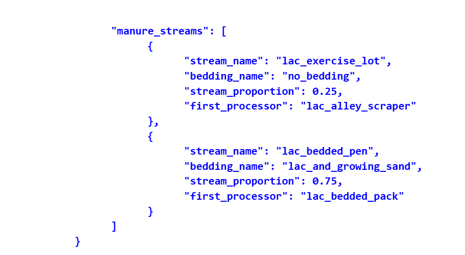
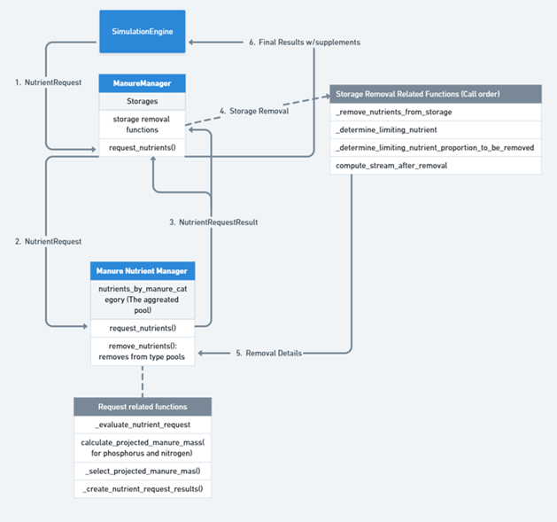

# Module Connections

<!-- reuse code to import functions from "../scripts/": -->



## Animal and Manure Module Connection

### Introduction

Though animals are typically fed and managed in groups, referred to as pens in RuFaS, manure from a single group of animals may not always remain in or be transported to the same location on the farm. For example, lactating cows who must travel to a milking parlor deposit some proportion of their manure outside of their pen. Or, in open lot systems, manure deposited in the concrete feed alley apron is often removed and managed separately from manure deposited on the lot surface. Additionally, more than one type of bedding may be used in a pen (e.g., no bedding during summer but straw provided in winter), which also eventually becomes part of manure. Considering this, RuFaS accommodates routing of manure from a single group (pen) of animals to multiple locations, which are then received by the Manure module. This document describes how a pen’s total manure excretion and bedding are allocated to one or more discrete quantities of manure, referred to as manure streams, and passed to the Manure module. How the user configures this manure routing and bedding options and addition of bedding to manure are also described here.

#### Implementation in RuFaS

The Animal module is responsible for calculating manure excretion mass and composition based on animal attributes, ration composition and intake, and other factors. The Animal module must then pass this manure on to the Manure module, where manure nutrient gains and losses are quantified through field application or export. The Animal module currently calculates manure excretion at the pen level (i.e., values representative of the total manure from animals in a single pen), and several additional steps must occur before manure information can be sent to the Manure module. These steps include:

* Splitting manure from individual pens into one or more user-defined manure streams
* Repackaging manure information into the form and units utilized by the Manure module
* Applying bedding mass or nutrients to manure streams

The direct connection between Animal module, which captures the animal lifecycle, nutrient intake and excretion, and other factors, and the Manure module is a crucial part of the nutrient cycle in RuFaS.

This document describes how the user defines the partitioning of manure from a single pen of animals into one or more manure streams, and the basic mathematical procedure for generating manure streams from excreted manure. Later it will review the options for and application of bedding to manure streams. 

#### Classes

```{python}
#| label: tbl-an-man-conxn-classes
#| tbl-cap: List of Python classes for Animal to Manure Module connection.
import_table(
    "../resources/table_data/connections/an-man-conxn-classes.csv",
    colalign=["center", "left"],
    read_opts = {"encoding": "cp1252"}
)
```

#### Required User Inputs

```{python}
#| label: tbl-manure-inputs-stream
#| tbl-cap: User inputs for the Stream Formation section.
import_table(
    "../resources/table_data/connections/mn-inputs-stream.csv",
    colalign=["left", "center", "left"],
    read_opts = {"encoding": "cp1252"}
)
```

```{python}
#| label: tbl-manure-inputs-bedding
#| tbl-cap: User inputs for the Bedding section.
import_table(
    "../resources/table_data/connections/mn-inputs-bedding.csv",
    colalign=["left", "center", "left"],
    read_opts = {"encoding": "cp1252"}
)
```

#### Other Inputs

Instances of PenManure objects that represent manure excreted by single pens of animals in the Animal module. See Animal Excretions documentation for further details.

### Expected Outputs

#### Stream Formation

Instance(s) of a ManureStream for each manure stream defined by the user that represent the attributes of the manure in the specific manure stream. ManureStream instances include the following variables (all in kg except for volume, m³ and manure methane potential, m³/kgVS):

* `water`
* `ammoniacal_nitrogen`
* `nitrogen`
* `phosphorus`
* `potassium`
* `ash`
* `manure_degradable_volatile_solids`
* `manure_non_degradable_volatile_solids`
* `bedding_non_degradable_volatile_solids`
* `total_solids`
* `mass` (equal to sum of water and total solids)
* `total_volatile_solids` (equal to sum of degradable and non degradable volatile solids)
* `volume`
* `methane_production_potential`

A PenManureData class instance for each manure stream defined by the user, that represents the attributes of the animals and pen from which the manure originated. PenManureData instances include the following variables, reported by the Animal module:

* `num_animals`: number of animals present in the pen from which the manure stream originated. Note that this variable does not correspond to the number of animals that generated the manure contained in the stream.
* `manure_deposition_surface_area`: the surface area soiled with manure, used in the determination of housing emissions. See the Manure Handler document for information on determination of this value [MN.HDL.4](#eq-mn-hdl-4).
* `animal_combination`: the type of animal contained in the pen (calf, growing, closeup, or lactating).
* `pen_type`: the type of pen (freestall, tiestall, open lot, or bedded pack barn) the manure in this stream originated from.
* `manure_urine_mass` (kg): mass of urine in the manure.
* `manure_urine_nitrogen` (kg): mass of urine N in the manure.
* `steam_type`: the type of ManureStream (parlor stream or general stream).
* `first_processor`: the name of the processor defined in the Manure module inputs that this ManureStream should enter.

#### Bedding

* `total_bedding_mass` (kg): the total mass of bedding added to this stream.
* `total_bedding_volume` (m³): the total volume of bedding added to this stream.

### Methodology

#### Stream Formation

How many discrete locations/quantities (i.e., manure streams) a single pen’s manure is split into is determined by the user. There are two types of manure streams in the model:

**Parlor**

A stream representing manure deposited in or while traveling to/from the milking parlor, along with (fresh, non-recycled) wash water.

* A parlor stream is not directly defined by the user for each pen in the way general streams are; parlor streams are created automatically for each lactating pen. The user specifies the proportion of each lactating pen’s total manure that enters the parlor stream via the minutes away for milking input. Time away from the pen for milking can vary greatly between farms but also is typically known by the farm management, as fetching and pushing cows to the parlor is an intentional daily activity. This makes time away from the pen for milking (`minutes_away_for_milking`) a simple and relatively reliable metric for determining the basic split of manure in the housing area vs. milking parlor.

* Only one parlor stream can be created per lactating cow pen. However, more than one milking parlor (destination for milking parlor manure) may be defined for a farm; the user simply assigns parlor streams to differing instances of a parlor cleaning handler, which represents the milking parlor. See Manure Handler documentation for more information.
  * No bedding can be applied to parlor streams.

**General**

A stream representing all or a portion of non-parlor manure and bedding. Manure in this stream or streams represents manure excreted outside the milking parlor or traveling to/from the parlor.

* All pens must have at least one general stream defined.
* Theoretically, an infinite number of general streams can be defined per pen, as long as stream proportions are provided for all of them. However, most practical farm simulation scenarios will require only one or two general manure streams per pen.
* The number of general streams and the proportion of non-parlor manure entering each stream is directly defined by the user. Stream proportion logic is covered below.

General-type manure streams are defined in the animal inputs, within each Pen blob. Each pen includes a `manure_streams` array input in which the user defines the one or more general manure streams generated by this specific pen. The required inputs and their definitions are described above in the Inputs section; these inputs must be provided for each manure stream as outlined in the figure below.

{#fig-man-code-streams}

If manure from a pen is routed to two different general manure streams, two sets of manure stream inputs must be defined. An example of a single pen’s manure stream inputs is above - in this example, manure from this pen is routed to two locations, one representing an exercise lot, the other representing a bedded pack area.

#### Stream Proportion Logic

The stream proportion refers to the user-defined proportion (0 to 1) of manure generated by animals in a single pen that enters a specific manure stream. The translation of user-defined stream proportions into the effective stream proportion utilized by the model is described below. This effective proportion is referred to as the *split ratio* in the model code — it is the value by which total manure excretions are multiplied to determine the quantity of any single nutrient allocated to a stream of any type (e.g., 20% (0.20) to parlor stream, 40% (0.40) to general stream 1, 40% (0.40) to general stream 2. These values are the split ratios).

**Non-lactating pens**

If more than one general stream is defined for a single pen, a stream proportion must be provided for each stream, and manure will be allocated according to these proportions. Essentially, the split ratio is equal to the user-defined stream proportion.

**Lactating pens**

*Parlor streams*

The user-defined `minutes_away_for_milking` is used to calculate the stream proportion value for the milking parlor:

::: {#eq-an-pen-1}
[[AN.PEN.1]]{.aside .content-visible when-format="html"}
$$
\text{parlor\_stream\_proportion} = \frac{\text{minutes\_away\_for\_milking}}{1440}
$$
:::

*Where*:

* `minutes_away_for_milking`: user-defined total minutes per day lactating cows spend out of the pen traveling to/from the parlor or being milked
* 1440: minutes per day

*General streams*

Each general stream proportion represents the fraction of manure—excluding that deposited in or during travel to/from the milking parlor—that enters a specific manure stream. For example, if all manure outside the parlor enters one stream, its proportion would be 1.0. If manure outside the parlor was split evenly between two general streams, each stream’s proportion would be 0.50. With this, the effective proportion of total manure entering this stream (the split ratio) must be calculated according to the parlor stream proportion.

First, we determine the proportion of manure entering any and all general streams vs. the parlor stream.

::: {#eq-an-pen-2}
[[AN.PEN.2]]{.aside .content-visible when-format="html"}
$$
\text{total\_general\_stream\_portion} = 1 - \text{parlor\_stream\_proportion}
$$
:::

*Where*:

*  `parlor_stream_proportion`: proportion of total manure allocated to the parlor stream, calculated in [AN.PEN.1](#eq-an-pen-1)

Once we have derived the proportion of manure entering any/all general streams, we multiply this proportion by the user-defined general stream proportion(s), to determine the split ratio for each general stream.

::: {#eq-an-pen-3}
[[AN.PEN.3]]{.aside .content-visible when-format="html"}
$$
\text{general\_stream\_portion} = \text{total\_general\_stream\_proportion} \times \text{stream\_proportion}
$$
:::

*Where*:

*  `total_general_stream_proportion`: proportion of total manure entering general streams, calculated in [AN.PEN.2](#eq-an-pen-2)
*  `stream_proportion`: user-defined proportion of manure deposited outside the parlor that enters this stream

To continue with our example from above, if cows spent 200 minutes per day in the milking parlor, their split ratios would be as follows:

*Parlor:*
$$
\frac{200}{1440} = 0.140
$$

*General:*
$$
\text{lac\_exercise\_lot} = (1 - 0.139) \times 0.25 = 0.215
$$

$$
\text{lac\_bedded\_pen} = (1 - 0.139) \times 0.75 = 0.645
$$

### Recommended Defaults

Although the time away from a pen is highly variable and specific to each farm’s infrastructure and management, some recommended defaults for situations where actual information is not available are provided below.

#### Minutes Away For Milking

Recommended `minutes_away_for_milking` values for lactating cows are based on cow time budgets from published literature and are not official model defaults. The purpose of these time budgets at the time of writing is strictly related to estimating manure deposition in specific locations and is not related to larger Animal module activities. The use of time budgets for this purpose relies on the assumption that cows excrete urine and feces at a constant rate throughout the day and across various locations.

```{python}
#| label: tbl-mn-min-milking
#| tbl-cap: Recommended minutes away for milking values for lactating cows in various housing systems.
import_table(
    "../resources/table_data/connections/mn-min-milking.csv",
    colalign=["left", "center", "center", "left"],
    read_opts = {"encoding": "cp1252"}
)
```

¹ @gomez2010time; @espejo2007herd
² @jewell2019prevalence
³ @meyer2019contract

#### Open Lot and Bedded Pack Systems

The management of open lot and bedded pack barn pens often results in manure from a single pen being managed in multiple ways. These types of pens often have designated resting areas (i.e. the harrowed lot or bedded pack) where manure is managed in place for an extended period, as well as a separate feeding area, such as a concrete apron along a feed alley. Manure deposited in this area may be scraped back into the resting area, or it may be flushed, vacuumed or scraped to another separate storage area. Two distinct manure management routines within a single pen indicate that two manure streams should likely be used. If this is the case, the user may reference the tables below as a starting point for defining stream proportions representing the resting vs. feeding area. Defining two separate manure streams is recommended where appropriate to ensure that manure is not over-allocated to the parlor manure stream (where it does not contribute to housing emission estimations) and bedding is allocated appropriately.

The following streams and proportions are based on literature data and are not official model defaults. They are provided for user informational purposes; they may be used as a starting point to adjust proportions specific to a farm, or can be used for theoretical modeling scenarios.

```{python}
#| label: tbl-mn-manure-props-ol-bp
#| tbl-cap: Suggested values for manure stream proportion inputs for lactating cows based on data from @meyer2019contract and the assumption that open lot pens tend to be considerably larger than indoor-housed systems (greater travel distance).

import_table(
    "../resources/table_data/connections/mn-manure-props-ol-bp.csv",
    colalign=["left", "center", "center", "center", "center", "center"],
    read_opts = {"encoding": "cp1252"}
)
```

```{python}
#| label: tbl-mn-manure-props-bp
#| tbl-cap: Suggested values for manure stream proportion inputs for lactating cows based on data from @endres2007behavior, which suggests behavior of cows in compost bedded pack barns is broadly similar to other housing systems. Freestall data from @gomez2010time was used, which reported 4.3 hours feeding, 3.33 hours away for milking, and the remainder spent in the housing area.

import_table(
    "../resources/table_data/connections/mn-manure-props-bp.csv",
    colalign=["left", "center", "center", "center", "center", "center"],
    read_opts = {"encoding": "cp1252"}
)
```


### Passing Information to the Manure Module

Once split ratios have been determined for each manure stream in each pen, Animal module manure and pen data can be translated into ManureStream objects. The variables contained in ManureStream are below; this dataclass is used both to move information from Animal to Manure module, as well as move information between processors within the Manure module.

The majority of the variables are calculated in the Animal module and translated directly into a ManureStream object. Subbullets below a variable indicate how variables not directly reported by the Animal module are calculated.

#### Bedding

Bedding is assigned and applied by manure stream, not by pen. The following calculations describe how bedding mass, nutrients, and volume are calculated, and how bedding is added to a manure stream.

**Calculate total bedding mass** `calc_total_bedding_mass`

::: {#eq-an-pen-7}
[[AN.PEN.7]]{.aside .content-visible when-format="html"}
$$
\text{total\_bedding\_mass,(kg)} = \text{bedding\_mass\_per\_day} \times \text{num\_animals} \times \text{sand\_removal\_efficiency}
$$
:::

*Where*:

* `bedding_mass_per_day` (kg/animal): Bedding mass applied per animal per day.  
* `num_animals`: Animals in the pen from which the manure stream originated.  
* `sand_removal_efficiency`: Proportion of sand bedding removed via sand recovery technology (only used when bedding type = sand).

**Calculate total bedding volume** `calc_total_bedding_volume`

::: {#eq-an-pen-8}
[[AN.PEN.8]]{.aside .content-visible when-format="html"}
$$
\text{total\_bedding\_volume} (\text{m}^3) = \frac{\text{total\_bedding\_mass}}{\text{bedding\_density}}
$$
:::

*Where*:

* `total_bedding_mass` (kg): Calculated in [AN.PEN.7](#eq-an-pen-7).  
* `bedding_density` (kg/m³): User‑defined density of the bedding.


**Calculate total bedding dry solids** `calc_total_bedding_dry_solids`

::: {#eq-an-pen-9}
[[AN.PEN.9]]{.aside .content-visible when-format="html"}
$$
\text{total\_bedding\_dry\_solids\,(kg)} = \text{total\_bedding\_mass} \times \text{bedding\_dry\_matter\_content}
$$
:::

*Where*:

* `total_bedding_mass` (kg): Calculated in [AN.PEN.7](#eq-an-pen-7).  
* `bedding_dry_matter_content`: User‑defined dry matter content.

**Calculate total bedding water** `calc_total_bedding_water`

::: {#eq-an-pen-10}
[[AN.PEN.10]]{.aside .content-visible when-format="html"}
$$
\text{total\_bedding\_water\,(kg)} = \text{total\_bedding\_mass} \times (1 - \text{bedding\_dry\_matter\_content})
$$
:::

*Where*:

* `total_bedding_mass` (kg): Calculated in [AN.PEN.7](#eq-an-pen-7).  
* `bedding_dry_matter_content`: User‑defined dry matter content.

#### Update ManureStream values to reflect bedding

```{python}
#| label: tbl-mn-calcd-characteristics
#| tbl-cap: Equations for calculatued manure and bedding characteristics

import_table(
    "../resources/table_data/connections/mn-calcd-characteristics.csv",
    colalign=["left", "center", "left", "left"],
    read_opts = {"encoding": "cp1252"}
)
```


## Manure Module and Soil and Crop Module Connection

### Introduction

On most dairies, the amount of manure applied to a field is determined by the amount of nitrogen (N) and phosphorus (P) needed by the crop to support production, or by the maximum amount of that nutrient that can be applied based on environmental regulations. These amounts are often established in the farm's detailed nutrient management plan and updated with crop yields and manure quantities and compositions.

Often, application of manure alone cannot fulfill all crop nutrient needs due to a mismatch between the N:P ratio required by the crop and the N:P ratio of the available manure. The manure application is therefore referred to as being **limited** by the nutrient whose requirement is met first through manure application.

In RuFaS, the user provides the desired amount of manure N and P for each manure application and specifies whether the model should supplement the application with imported manure or fertilizer if the exact amounts of both N and P are not met by the manure available on-farm. If both N and P cannot be supplied by manure in storage on the day of application, the total amount of the limiting nutrient (N or P) is used to determine the amount of the other nutrient, the total manure mass, and other accompanying nutrients (e.g., volatile solids (VS), potassium (K)) based on manure composition. This information is then passed to the Soil and Crop Module for application of nutrients to fields and to the Manure Module for removal of stored nutrients.

**Implementation in RuFaS**

In RuFaS, manure accumulates in storage until it is removed for field application, transferred to another storage, or exported off-farm. This accumulated manure represents the manure available for field application. Manure applications, referred to as *manure nutrient requests*, originate from the Soil and Crop Module and are scheduled by year and Julian day. Each request contains a specified quantity of manure N and P.

Nutrient requests may be made for either solid or liquid manure. Manure is designated as liquid or solid based on storage type: slurry storage and anaerobic lagoons contain liquid manure, while all other storage types contain solid manure.

Exchange of the information about the manure nutrient application request and the availability of manure nutrients is executed in the simulation engine to ensure independence of the Manure Module and the Soil and Crop Module (@fig-man-sc-connect).

{#fig-man-sc-connect}

Each day, the SimulationEngine calls the `generate_daily_manure_applications()` method to check with the `FieldManager` to see if there is a manure application scheduled and, when there is, pass the manure nutrient request created by the `FieldManager` to the `ManureManager`. The `ManureManager`, in turn, checks with the `ManureNutrientManager` to see if the manure nutrient request can be fulfilled via the `request_nutrients()` in the `ManureManager`, which calls the `evaluate_nutrient_request()` function from the `ManureNutrientManager` class. The `ManureNutrientManager` then evaluates the nutrient request, determines the limiting nutrient to be used, and calculates the amount of each manure nutrient and the total mass that can be provided by the manure in storage using the following logic. At this time, nutrients from all storages are pooled by `ManureNutrientManager` to determine the total quantity of nutrients available. Once the nutrient request is returned, an identical proportion (not amount) of manure is removed from all storages. In other words, the user cannot specify at this time which storage(s) should be pulled from for a manure application.

### Methodology

**Step 1: Determination of the Limiting Nutrient**

Determine the nutrient that manure storage removal will be based on using the composition of N and P in the manure nutrient pool. This step is executed by `evaluate_nutrient_request`:

$$
\text{manure\_mass\_N} = \frac{\text{mass\_N\_requested}}{\text{manure\_nitrogen\_frac}}
$$

$$
\text{manure\_mass\_P} = \frac{\text{mass\_P\_requested}}{\text{manure\_phosphorus\_frac}}
$$

The projected manure mass is then calculated as:

:::{#eq-mn-msc-1}
[[**MN.MSC.1**]]{.aside .content-visible when-format="html"}
$$
\text{projected manure mass} = \min(\text{mass\_N\_requested}, \text{mass\_P\_requested})
$$
:::

*Where*:

* `mass_N_requested` is the mass of manure (kg) required to meet the requested mass of N.
* `mass_P_requested` is the mass of manure (kg) required to meet the requested mass of P.

The limiting nutrient is the nutrient (N or P) with a smaller projected mass required to meet the nutrient request. The projected manure mass based on the limiting nutrient is used to determine the removal of manure from the manure storages.

**Step 2: Proportion of Limiting Nutrient Removed**

Using the limiting nutrient identified in Step 1 and considering the total quantity of that nutrient available in the aggregated `ManureNutrient` pool, the proportion of the limiting nutrient to be removed from each storage is calculated as:

:::{#eq-mn-msc-2}
[[**MN.MSC.2**]]{.aside .content-visible when-format="html"}
$$
\text{nutrient\_proportion\_to\_be\_removed} = \min(\frac{\text{mass\_requested\_nutrient}}{\text{manure\_nutrient\_available}},1)
$$
:::

**Step 3: Removal of Nutrients from Individual Storages**

Next, the amount of the limiting nutrient and projected mass of manure to be removed from the aggregated ManureNutrient pool are determined. If there is sufficient manure available to fulfill the nutrient request, the quantity of the limiting nutrient removed will be equal to the requested amount; otherwise, the amount removed will be lower than the requested amount.

For each nutrient and each storage, the nutrient removal is calculated as:

:::{#eq-mn-msc-3}
[[**MN.MSC.3**]]{.aside .content-visible when-format="html"}
$$
\begin{aligned}
\text{nutrient\_to\_be\_removed\_from\_storage} &= \text{nutrient\_in\_storage} \\[8pt] 
&\qquad \times \text{nutrient\_proportion\_to\_be\_removed}
\end{aligned}
$$
:::

*Where*:

* `nutrient_to_be_removed_from_storage` is the mass of the nutrient removed from a specific manure storage (kg).
* `nutrient_in_storage` is the mass of the nutrient in the storage prior to manure application (kg).

The `ManureNutrientManager` then passes the result of the manure nutrient request with the total amount of the limiting nutrient to be supplied and the `ManureManager` calculates the mass of manure and nutrients to be removed from each individual storage. The `ManureManager` returns the final results of the manure application to the `SimulationEngine`, including:

* Total nitrogen mass supplied (kg)
* Total phosphorus mass supplied (kg)
* Total manure mass supplied (kg)
* Total dry matter supplied (kg)
* Dry matter fraction of the manure (\%)
* A Boolean indicator of whether the nutrient request was fulfilled

After the nutrient request is partially or fully fulfilled, the corresponding quantities of mass and nutrients are subtracted from each individual manure storage.

## References