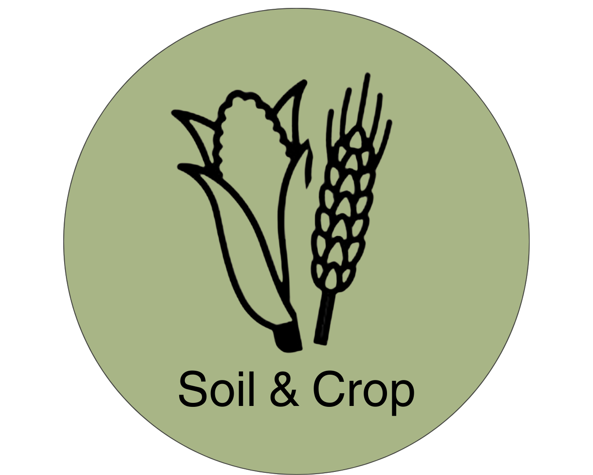

{width=25%}
# Soil and Crop Module
<!-- reuse code to import functions from "../scripts/": -->


More text
## Introduction 

## Field Management 

### Introduction 

### Methodology

#### Relevant Inputs

#### Relevant Outputs

## Soil Management 

### Introduction 

### Methodology

### Soil Erosion

### Soil Nitrogen

### Soil Phosphorus Cycling

### Soil Carbon Cycling

#### Relevant Inputs

#### Relevant Outputs

## Crop Management 

### Introduction

### Methodology

## References