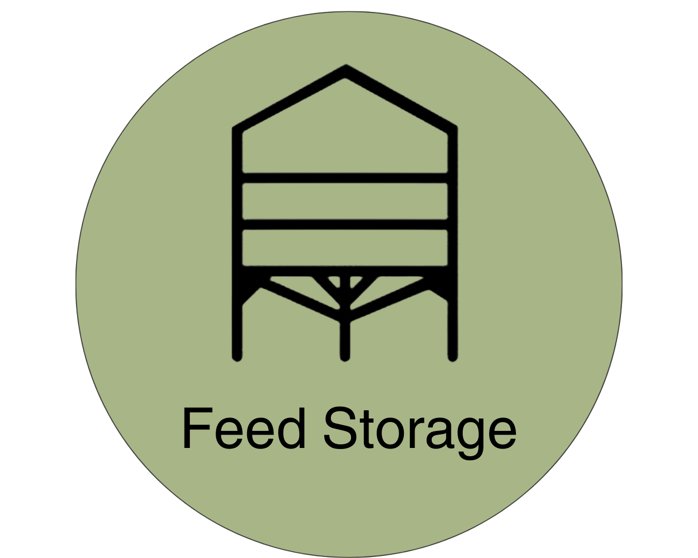
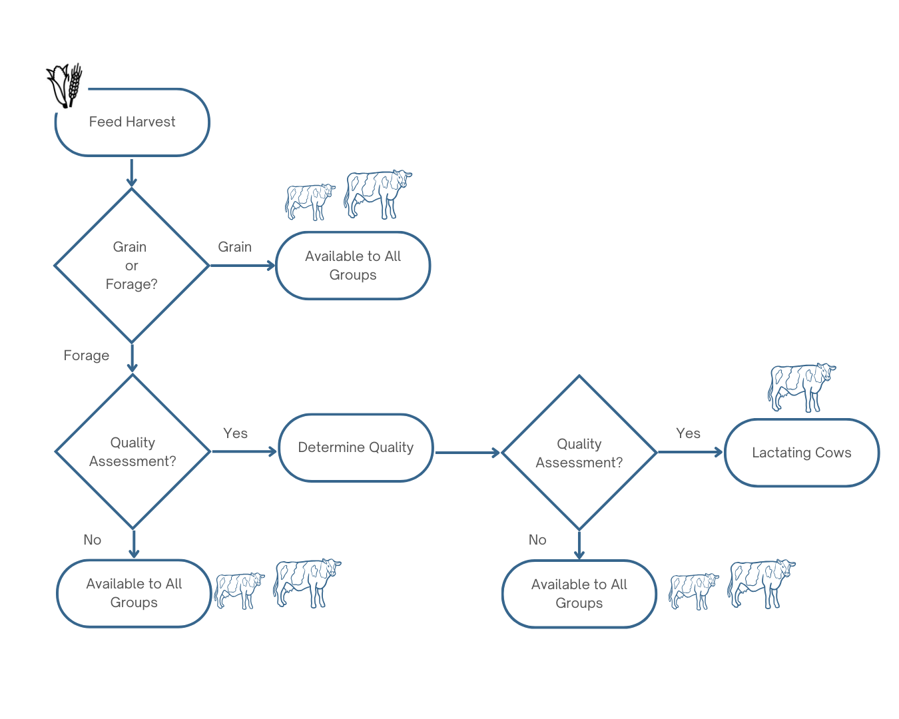

{width=25%}
# Feed Storage Module
<!-- reuse code to import functions from "../scripts/": -->



## Introduction 

The Feed Module’s primary purpose is to serve as an inventory of purchased and farm-grown feed. Feed is added via purchase (Animal Module) and from on-farm harvest (Crop and Soil Module). Feed is removed when it is fed out in the Animal Module. In addition, stored feed quantity and quality changes are simulated over the duration of storage depending on crop type, crop quality, user-specified storage conditions, and ambient climate conditions. The feed storage module currently accepts Corn (silage, dry/high-moisture grain), Alfalfa, Grass, Triticale/Cereal, and Soybean. Forage and/or feed quality can also be user-specified, offering flexibility and modularity of user needs. Feed component values, proportions, digestibility, and availability subject to change during storage are: mass, DM content, CP, NPN, nNDF, ADF,  starch, and WSC. These changes must be tracked to accurately reflect the remaining feed and its qualities. Overall stored feed quality is assessed prior to consumption in the Animal Module.

### Feed Quality Assessment

This section allocates farm grown feeds to be used for single or multiple animal classes and is illustrated in @fig-fee-allocate-feed. Priority is to reserve high-quality forage for lactating cows. Feeds are generally categorized into grains or forages. If the feed is a grain then it is available to all animal classes. The model assumes that grains can be purchased to supplement farm grown grain inventory. 

If the feed is a forage, then some farms will assess the quality of the forage and preserve the high quality forage for the lactating cows. If they do not differentiate their forages based on quality, then the forage is available to all animals. 

{#fig-fee-allocate-feed}

We currently represent the quality assessment for the feeds based on a single differentiating nutrient composition value. The differentiating nutrient and levels of the nutrient are given in the feed library.

The feed library that includes both NRC and NASEM feeds does not have feed quality embedded in the feed IDs. Instead, a quality assessment should be made independent of the feed ID number and added as an additional attribute of the stored feed. 

## Feed Storage Inputs

Farmgrown feeds have storage inputs that are described in depth below and consist of the following:

* Storage classification: `Grain`, `Hay`, `Silage`, `Baleage`.
* Name: Each storage has a unique name e.g. `alfalfa_silage_storage_1`
* `crop_name`: The name of the crop being stored
* `field_name`: The name of the field the crop was grown in
* `storage_type`: The sub-type of the storage class e.g. "Dry" for grain storage
* `dm_loss_coefficient`: An input used for grain storages that specifies a loss of DM e.g. "0.01"
* `initial_storage_dry_matter`: The dry matter content upon receipt by the feed storage module.
* `post_wilting_moisture_percentage`: The DM content of silage or baleage after wilting
* `target_dry_matter`: The final DM content of hay
* `additional_dry_matter_loss_coefficient`: An optional input to represent DM loss in excess of normal processes
* `bale_size`: An input used for baleage to specify the diameter of the bale in meters
* `rufas_id`: The RuFaS feed ID of the stored crop
* `capacity`: The maximum mass capacity of the storage

## Storage Classifications

The agricultural production of harvested animal feed is dependent on season, climate, and farm management. In most cases, this means that feed is produced in large quantities when growing conditions are suitable and must be preserved to meet daily animal feed requirements. Microbial spoilage of wet feed products rapidly degrades their nutritional quality and can harm livestock that consume spoiled feed. Viable, cost-effective methods of preservation depend on the crop type and climate, but practically are limited to drying feed beyond the ability to support microbial growth and fermenting feed in the absence of oxygen to produce acid and reduce pH to inhibit spoilage. Feed Storage functions are primarily based on those in @Rotz2023 but modified to accommodate a daily time-step and remove explicit spatial components.

### Grain

Grains (e.g., corn, rice, soybeans, and wheat) under 15\% moisture are considered dry grain. Higher moisture grains are considered high-moisture. Field harvested grains are not always sufficiently dry for safe storage (< 15% moisture) and supplemental drying is often used to achieve target moisture content. Air-drying is a lower-energy drying method for drying grain to ambient levels that consists of passing ambient air through wet grains via fan. Heated-air drying is higher-energy and faster than air-drying, but can reduce moisture below ambient levels. In practice, DM loss from grains are small and are modeled as a fixed percentage loss of dry matter; 1% for dry grain, 5% for high-moisture grain.

:::{#eq-fs-grn-1}
[[**FS.GRN.1**]]{.aside .content-visible when-format="html"}    
$$
\text{L}_\text{gaseous} = \text{M}_\text{i} \times 0.01
$$
:::

:::{#eq-fs-grn-2}
[[**FS.GRN.2**]]{.aside .content-visible when-format="html"}    
$$
\text{L}_\text{gaseous} = \text{M}_\text{i} \times 0.05
$$
:::

High-moisture grain as a feed must be managed (fed, fermented, or dried) quickly for this to be accurate, but that is a well-understood requirement and is not explicitly modeled. Nutritional quality changes are variable, but proportional to DM loss. Nutrient values of finished grain not currently tracked are referenced from @nrc_2021 for use in the Animal Module.

### Hay

Hay is forage that has been dried with a safe preservation moisture content of 12-15\%. Bale storage conditions are separated into protected and unprotected storage with a total of four storage categories in order of decreasing protection from the elements: protected-indoor, protected-wrapped, protected-tarped, and unprotected-outdoor. Less protected hay storages experience additional losses as compared to the most protected storage (indoor) due to exposure to increased airflow and weather according to [FS.HAY.1]{#eq-fs-hay-1}. Baled hay loses DM and quality as a function of storage conditions and its moisture content. Bale density plays a role, but is too complex to model directly and is instead estimated as a function of moisture content.

:::{#eq-fs-hay-1}
[[**FS.HAY.1**]]{.aside .content-visible when-format="html"}    
$$
\text{L}_\text{gaseous} = \text{L}_\text{base} + \text{L}_\text{additional}
$$
:::

Where we know that, in order to capture the differing rates of DM loss before and after the forage has reached its target DM content: 

* L<sub>base</sub> (kg): the minimum loss expected from `protected-indoor` as the sum of DM lost in the first 30 days of storage 
* L<sub>first 30 days</sub> (kg): the sum of DM lost in the first 30 days of storage 
* L<sub>post 30 days</sub> (kg): the loss after 30 days

:::{#eq-fs-hay-2}
[[**FS.HAY.2**]]{.aside .content-visible when-format="html"}    
$$
\text{L}_\text{base} = \text{L}_\text{first 30 days} + \text{L}_\text{post 30 days} 
$$
:::

:::{#eq-fs-hay-3}
[[**FS.HAY.3**]]{.aside .content-visible when-format="html"}    
$$
\text{L}_\text{first 30 days} = \frac{\text{Q} + 2433 \times \frac{\text{MF}(1-\text{moisture})}{1-\text{MF}}}{(1-\text{moisture}) \times (14206 - \frac{2433 \times \text{MF}}{1-\text{MF}})} \times \frac{min(30,d)}{30} 
$$
:::

:::{#eq-fs-hay-4}
[[**FS.HAY.4**]]{.aside .content-visible when-format="html"}    
$$
\text{Q} = 104 \times \text{moisture}^{2.81} \times {\text{b}_\text{density}}^{0.5} + 5.72 \times (\text{moisture}^{1.23} \times {\text{b}_{\text{density}}}^{0.94})
$$
:::

* Q is the sensible heat generated in the hay (kJ/kg) based on bale density.

:::{#eq-fs-hay-5}
[[**FS.HAY.5**]]{.aside .content-visible when-format="html"}    
$$
\text{b}_\text{density} = 100 + 440 \times \text{moisture}
$$
:::

* Moisture is the fraction of water mass at time of storage (unitless)
* MF is the target final moisture percent of hay (percent) as defined by the user (default: 12)
* d is the number of days the hay has been stored for 

:::{#eq-fs-hay-6}
[[**FS.HAY.6**]]{.aside .content-visible when-format="html"}    
$$
\text{L}_{post 30 days} = 0.0001 \times max(0, d-30)
$$
:::

:::{#eq-fs-hay-7}
[[**FS.HAY.7**]]{.aside .content-visible when-format="html"}    
$$
\text{L}_{additional} = 0.0001 \times max(0, d-30)
$$
:::

* d: number of days the hay has been stored for,
* i: day of storage that dry matter loss is being calculated for, 
* l: loss coefficient (unitless) from @tbl-fs-hay-type; [FS.HAY.7](#eq-fs-hay-7)
* rain<sub>i</sub>: amount of rain on day i (cm) 
* high<sub>i</sub>: high temperature on day i (^∘C)
* low<sub>i</sub>: low temperature on day (^∘C)
* b<sub>density</sub>: bale density (kg/(m^2)) [FS.HAY.5](#eq-fs-hay-5)
* b<sub>size</sub>: diameter of the hay bale (m)

```{python}
#| label: tbl-fs-hay-type
#| tbl-cap: Hay storage types and associated fractional loss coefficients.
import_table(
  "../resources/table_data/feed_storage/tbl-fs-hay-type.csv",
  colalign = ["left", "center"]
)
```

:::{#eq-fs-hay-8}
[[**FS.HAY.8**]]{.aside .content-visible when-format="html"}    
$$
\text{M} = \text{F}_\text{i} \times \frac{max(0.0, \text{moisture} - \text{MF})}{100} \times \frac{min(30,\text{d})}{30} 
$$
:::

The lowest energy method for hay drying is passive drying in the field when conditions are suitable, but, similarly to grains, hay can receive supplemental drying via ambient or heated air. DM loss from protected, baled hay is preferentially from starch and water soluble carbohydrates (60%), and CP (40%) which, over time, leads to a proportional increase in NDF and a minor increase in CP over time. Unprotected bales experience increased proportional CP loss (50% of protected bale DM loss) due to leaching and an additional 17% loss of NDF dry matter compared to protected bales.

```{python}
#| label: tbl-fs-hay-unpro-nutr
#| tbl-cap: Nutrients and associated fractional loss coefficients for unprotected hay storage.
import_table(
  "../resources/table_data/feed_storage/tbl-fs-hay-unpro-nutr.csv",
  colalign = ["left", "center"]
)
```

```{python}
#| label: tbl-fs-hay-pro-nutr
#| tbl-cap: Nutrients and associated fractional loss coefficients for protected or indoor hay storage.
import_table(
  "../resources/table_data/feed_storage/tbl-fs-hay-pro-nutr.csv",
  colalign = ["left", "center"]
)
```
                    
### Silage

Silage is the product of anaerobic acidification of non-dry forage, a process called ensiling, and has traditionally been produced as a method of animal feed preservation viable in wet, cool climates where forage production cannot sustain livestock year-round and drying hay at the required scale is challenging [@pahlow2003microbiology]. Typically, forage fermentation is the product of lactic acid bacteria (LAB) consuming WSC present in harvested forage and metabolizing it to a mix of organic products, including the desirable lactic and acetic acids, as well as CO<sub>2</sub> and ethanol. A well-preserved silage relies on a rapid fermentation for retention of optimal feed quality because insufficient or slow acidification is associated with prolonged proteolytic activity, additional dry matter loss, and increased risk of spoilage ([@pahlow2003microbiology]; [@muck2013recent]). 

Fermented forages experience DM loss and nutrient changes post-harvest, during fermentation, and during storage. Wilting losses are not currently modeled.

Alfalfa fermentation daily dry matter loss (fraction) is calculated with the equation:

:::{#eq-fs-sil-1}
[[**FS.SIL.1**]]{.aside .content-visible when-format="html"}    
$$
\text{L}_\text{fermentation} = \sum^d_{\text{i=1}} \text{drymass}_\text{i-1} \times (0.0052-0.001213 \times (\text{dryfrac}_\text{i-1} - 0.2))
$$
:::

* d: number of days the alfalfa has been ensiled for, 
* i: days since ensiling that dry matter loss is being calculated for, 
* drymass<sub>i-1</sub>: dry matter mass of ensiled alfalfa on day i-1,
* dryfrac<sub>i-1</sub>: fraction of ensiled alfalfa fresh mass that is dry matter on day i-1. 
* When i is 1:
   * drymass<sub>i-1</sub> is the initial amount of ensiled alfalfa dry mass
   * dryfrac<sub>i-1</sub> the initial dry matter fraction of the ensiled alfalfa. 
* This equation is only appropriate for use if dryfrac<sub>i-1</sub> is in the range [0.2, 0.6] and the average temperature on day and i is in the range [5, 45] (^∘C).

        
Corn, grass, and small grain daily dry matter loss (fraction) is calculated with the equation:

:::{#eq-fs-sil-2}
[[**FS.SIL.2**]]{.aside .content-visible when-format="html"}    
$$
\text{L}_\text{fermentation} = \sum^d_{\text{i=1}} \text{drymass}_\text{i-1} \times (0.000288 - 0.000643 \times (\text{dryfrac}_\text{i-1} - 0.15))
$$
:::

* d: number of days the forage has been ensiled for 
* i: days since ensiling that dry matter loss is being calculated for 
* drymass<sub>i-1</sub>: dry matter mass of ensiled forage on day i-1
* dryfrac<sub>i-1</sub>: fraction of ensiled forage fresh mass that is dry matter on day i-1.
* When i is 1, 
   * drymass<sub>i-1</sub>: initial amount of ensiled forage dry mass 
   * dryfrac<sub>i-1</sub>: initial dry matter fraction of the ensiled forage. 
* This equation is only appropriate for use if dryfrac<sub>i-1</sub>: is in the range [0.15, 0.6] and the average temperature on day i is in the range [0, 40] (^∘C).

```{python}
#| label: tbl-fs-silage-nutr
#| tbl-cap: Nutrients and associated fractional loss coefficients for silage.
import_table(
  "../resources/table_data/feed_storage/tbl-fs-silage-nutr.csv",
  colalign = ["left", "center"]
)
```

Ensiled crops may also lose dry matter through effluent efflux. Crops that are ensiled with a dry matter content less than 30\% lose both water and dry matter according to the following equations:

:::{#eq-fs-sil-4}
[[**FS.SIL.4**]]{.aside .content-visible when-format="html"}    
$$
\text{L}_\text{effluent} = \text{dryfrac}_\text{effluent} \times \text{M}_\text{effluent} \times 0.1 \times max(10,d)
$$
:::

* dryfrac<sub>effluent</sub>: fraction of dry matter in the effluent that is lost
* M<sub>effluent</sub>: estimated maximum effluent (kg)
* d: number of days the crop has been ensiled for

:::{#eq-fs-sil-5}
[[**FS.SIL.5**]]{.aside .content-visible when-format="html"}    
$$
\text{ML}_\text{effluent} = (1 - \text{dryfrac}_\text{effluent}) \times \text{M}_\text{effluent} \times 0.1 \times max(10,d)
$$
:::

* dryfrac<sub>effluent</sub>: fraction of dry matter in the effluent that is lost
* M<sub>effluent</sub>: estimated maximum effluent (kg)
* d: number of days the crop has been ensiled for

The fraction of dry matter in effluent is a constant defined as: 

:::{#eq-fs-sil-7}
[[**FS.SIL.5=7**]]{.aside .content-visible when-format="html"}    
$$
\text{dryfrac}_\text{effluent} = 0.1035 \text{tag}
$$
:::

:::{#eq-fs-sil-7}
[[**FS.SIL.7**]]{.aside .content-visible when-format="html"}    
$$
\text{M}_\text{effluent} = \text{mass}_\text{fresh} \times ((1 - \text{dryfrac}) - 0.7)
$$
:::

* mass<sub>fresh</sub>: fresh mass of the crop when it is ensiled (kg) 
* dryfrac: fraction of the crop’s fresh mass which is dry matter when it is ensiled.

Dry matter lost in effluent is preferentially from CP, water soluble carbohydrates, and non-protein nitrogen each of which is recalculated by the following equations:

Percent crude protein is calculated as:

:::{#eq-fs-sil-8}
[[**FS.SIL.8**]]{.aside .content-visible when-format="html"}    
$$
\text{CP}_\text{updated} = \frac{(\text{CP}_\text{initial} \times 0.01) - (0.3 \times \text{DL}_\text{fraction})}{1 - \text{DL}_\text{fraction}} \times 100 
$$
:::

* CP<sub>initial</sub>: percentage of dry matter mass that is crude protein in the ensiled crop before accounting for dry matter loss to effluent 
* DL<sub>initial</sub>: fraction of dry matter mass lost to effluent. 
* The percentage of crude protein is lower-bounded at 0.

The percentage of NPN is calculated with the equation:

:::{#eq-fs-sil-9}
[[**FS.SIL.9**]]{.aside .content-visible when-format="html"}    
$$
\text{NPN}_\text{updated} = \frac{(\text{NPN}_\text{initial} \times 0.01) \times (\text{CP}_\text{initial} \times 0.01) - (0.3 \times \text{DL}_\text{fraction})}{(\text{CP}_\text{initial} \times 0.01) - \text{DL}_\text{fraction}} \times 100 
$$
:::

* NPN<sub>initial</sub>: percentage of dry matter mass that is non-protein nitrogen in the ensiled crop before accounting for dry matter loss to effluent
* CP<sub>initial</sub>: percentage of dry matter mass that is crude protein before accounting for dry matter loss to effluent 
* DL<sub>initial</sub>: fraction of dry matter mass lost to effluent
* The percentage of non-protein nitrogen is lower-bounded at 0


DL<sub>fraction</sub> is calculated with the equation:

:::{#eq-fs-sil-10}
[[**FS.SIL.10**]]{.aside .content-visible when-format="html"}    
$$
\text{DL}_\text{fraction} = \frac{\text{DM}_\text{lost}}{\text{DM}_\text{initial}}
$$

* DM<sub>lost</sub>: amount of dry matter mass in the ensiled crop after accounting for dry matter lost to effluent
* DM<sub>initial</sub>: amount of dry matter mass in the ensiled crop before accounting for dry matter lost to effluent

### Baleage

Baleage is an ensiled forage with a DM content between 50-65% that is baled and wrapped to allow ensiling. The higher DM content of baleage lowers the amount of acid needed to achieve effective preservation and allows it to be consolidated into a bale. Fermentation DM losses for baleage are calculated by [FS.SIL.1]{#eq-fs-sil-1} and [FS.SIL.2]{#eq-fs-sil-2}  with fractional nutrient loss coefficients from Table 3{.mark}. Baleage does not experience effluent losses.

### Nutrient Composition

Changes in dry matter and moisture of stored feed often alter their total and fractional nutrient composition. Recalculating nutrient fractions of stored feeds uses the following equation:

:::{#eq-fs-nut-1}
[[**FS.NUT.1**]]{.aside .content-visible when-format="html"}    
$$
\text{n}_\text{updated} = \frac{max(0,\frac{\text{n}_\text{initial}}{100} - \text{C}) \times \text{DL}_\text{fraction}}{1-\text{DL}_\text{fraction}} \times 100
$$
:::

Where we know that: 

* n<sub>updated</sub> is the percentage of the target nutrient in the stored crop’s dry matter mass after accounting for dry matter loss 
* n<sub>initial</sub> is the percentage of the target nutrient in the stored crop’s dry matter mass before accounting for dry matter loss 
* C is the fractional loss coefficient specific to the nutrient and storage type
* DL<sub>fraction</sub> is the fraction of dry matter lost

:::{#eq-fs-nut-2}
[[**FS.NUT.2**]]{.aside .content-visible when-format="html"}    
$$
\text{DL}_\text{fraction} = \frac{\text{DM}_\text{updated}}{\text{DM}_\text{updated}}
$$
:::

## References
