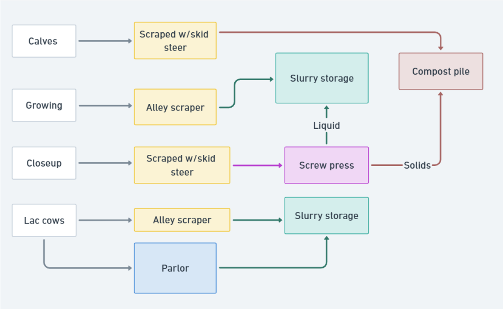
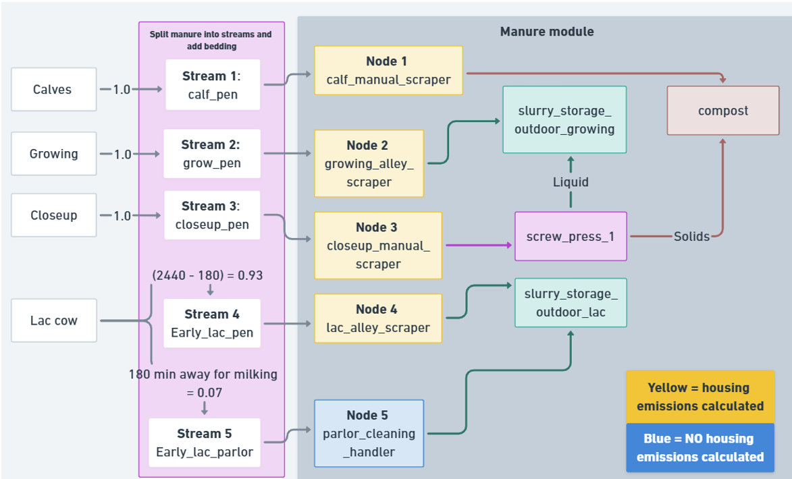

{width=25%}
# Manure Module
<!-- reuse code to import functions from "../scripts/": -->


## Introduction

The responsibility of the manure module in RuFaS is to simulate the loss and/or gain of manure mass and nutrients on a daily timestep at each step of the manure management chain on a dairy farm. On the majority of farms, manure represents an important link in the cycling of nutrients through animals, land, crops, and back to animals. Therefore, modeling both greenhouse gas (GHG) emissions as well as non-GHG nutrient and losses is crucial in capturing nutrient flows through the whole-farm system. 

The manure module accomplishes its responsibilities by tracking a critical, core set of variables called `ManureStream` variables, which include key agronomic nutrients (N, P, K), carbon (e.g. total and volatile solids), water, ash, mass, and volume. The Manure Module receives manure excretion and bedding information from the animal module, then passes manure through the manure management chain, until manure is either applied to fields or exported. The specific steps of the manure management chain are user-defined, and the individual steps/options in manure management chains are referred to as `processors`. The exact chemical, physical, or other processes that occur at each step along the management chain depend on what type of processor the manure is being held in. For example, parlor cleaning processors, which represent removing manure from the milking parlor and holding areas, principally add water to manure but do not estimate GH emissions or other nutrient losses. A slurry storage outdoor processor (a type of manure storage), however, estimates daily methane CH<sub>4</sub> and ammonia (NH<sub>3</sub>-N) losses, which are then reflected by reducing the quantity of nutrients remaining in the stored manure at the end of the day. 

### Structural setup of the Manure Module

Processors in the Manure Module fall into four basic classes, with multiple types available within each class. The processor classes are intended to represent the common, primary steps in manure management. They include manure handling (which refers to the daily activities of cleaning and removing manure from facilities or managing it in place), storage, and manure treatment, such as anaerobic digestion or mechanical solid liquid separation. 

```{python}
#| label: tbl-mn-process-type
#| tbl-cap: Examples of processor types by class.
import_table(
  "../resources/table_data/manure/tbl-mn-process-type.csv",
  colalign = ["left", "left"]
)
```

How manure moves between processors is based on defining the destination processor that any one processor should send its manure to, and the proportion(s) of manure from the originating processor that should go there. For example, if 50% of manure from a single pen is routed to storage A, and 50% to storage B, the manure handler processor assigned to that pen will have two destinations defined (storage A and storage B), with the proportion going to each defined as 0.50. By controlling destinations and proportions, the user is able to define aggregating (i.e., assigning manure from two separate processors to the same destination) and splitting (assigning manure from one processor to two or more locations) behavior. A visual example is below and illustrates the manure management chain without RuFaS-specific syntax. The next figure illustrates RuFaS-specific information (e.g. specific processor names, creation of manure streams in the animal module, etc.). Note that the splitting of manure generated from singular pens in the Animal Module is covered in the Animal to Manure Connection section. 

{#fig-man-flow-types}

{#fig-man-flow-req-inputs}

### Overview of Required Inputs

There are two general categories of input required from the user: 

1. Which processors are used and how do they work (processor-specific configurations) e.g., storage time length, use of a cover 
2. Destination and proportion(s) allocated to destination(s) of manure passed from each processor 

Information on inputs required and options available for each individual processor are outlined in the individual processor documentation. 

For defining destinations and proportions, there are very few rules and restrictions on how manure can be moved between processors. The primary rule for defining processor destinations is that users cannot define loops, i.e., manure from a processor “downstream” in a manure management chain cannot return its manure to a processor “upstream”.

::: {.callout-note}
The assignment of manure generated in the Animal Module (which also reflects the quantity of bedding used) to its destination in the Manure Module occurs in the Animal Module. See the Animal to Manure Connection section for more information. 
:::

### General Assumptions of the Manure Module

* All manure is recovered unless otherwise specifically stated. For example, all manure excreted by animals is assumed to be captured by manure handlers, all manure in a manure storage is assumed to be completely removed when the storage is emptied (unless explicitly noted in the specific processor’s documentation), etc. 
* Manure moves through the manure management chain once, and only once, per day. With this, values are reported on a daily timestep, and represent the current state at the end of the given day (e.g. CH<sub>4</sub> emissions from this day, amount of N left in storage on this day, etc.). 
   * Storage processors include a user-defined “storage time”, during which manure accumulates in the storage until reaching the end of the time interval, at which point it is passed to the next processor or exported, if the storage comes last in the manure chain.  The minimum storage time value is 1, thus manure cannot move through more than one storage per day. 
   * For processors without a storage time option, manure is assumed to move through the processor immediately. E.g., on a single day, excreted manure may move through a handler, continuous mix digester, separator, and into composting storage, with each processor reporting the quantity and composition of manure they either passed to the next processor or are holding in storage.
* The Manure Module adheres to the principle of mass balance, meaning, the quantity of manure nutrients remaining in manure is proportional to the quantity of the nutrient lost through biological or physical processes. The same is true for additions of mass/nutrients.
   * One current exception to this is N loss. N losses are not currently reflected in the total mass of manure; this exception will be addressed and corrected in the near future. 

**Manure Storage Assumptions**

* Received manure nutrients entering a storage are added to accumulated mass/nutrient quantities prior to calculating gas emissions each day.
* When the end of the storage’s user defined storage time is reached, the accumulated manure in storage is removed completely and entirely, and is passed to the next processor in the chain (e.g., a subsequent storage, field application, etc.).
* Emptying intervals (in days) are defined by the user in equal lengths at this time, e.g., manure storage can be emptied every 3 months (e.g. in April, July, October, January) but cannot be emptied in April, then 2 months later in June, and then 3 months later in September. However, timing of storage emptying (e.g. April and October emptying vs. May and November emptying) can be set according to the general simulation dates to simulate more realistic manure removal behavior.


## Manure Handler


### Introduction 

### Methodology

#### Relevant Inputs

#### Relevant Outputs

### Manure Composition Update


## Solid Liquid Separators

### Introduction

A solid-liquid separator (SLS) is a specialized piece of equipment or system designed to separate larger, solid particles from the liquid component of manure. This type of system may be implemented for a variety of reasons, such as to improve ease of handling of manure liquid, improve the nutrient concentration in manure liquid, reduce storage volume required for manure lagoons or other storage systems, prevent solid accumulation in a covered manure storage, or reclaim manure solids for use as bedding or compost. 
    
The solid fraction of manure slurry is composed of fibers originating primarily from manure, but also from feed, bedding, and other environmental sources. Once mechanically separated, the moisture content of the solid fraction ranges from 70% to 90%, depending on the specific separator system used. To further reduce moisture content of the separated solids, an additional dewatering or drying step may be incorporated. Manure solids may be directly used or sold for animal bedding (after stabilization), composted, or land applied. 
    
After the manure solids are mechanically separated, the remaining liquid fraction is composed of small particles, water, and most of the nutrients present in the manure. Because the bulk of relevant nutrients (e.g., P, N, K) are mainly associated with the small particles which remain with the liquid fraction after separation occurs, separating the larger, less nutrient-dense particles out from the slurry liquid enriches the concentration of these nutrients in the liquid fraction. Solid-liquid separation also makes the manure slurry easier to pump, transport, and apply to fields, as large particles that may clog lines and sprayers are removed.

**Implementation in RuFaS**

In RuFaS, solid liquid separators currently represent mechanical, short retention time pieces of equipment. GHG emissions and other nutrient transformations from long-retention separators such as weeping walls or settling basins are not yet represented in the model. Because of this, the impact of these longer retention separators can only be approximated via modification of the separation efficiencies of the short retention time methods.

Currently, SLS inputs are simply nutrient-specific separation efficiencies that reflect the proportion of a specific nutrient that is separated into the solids fraction. With this, essentially any type of mechanical manure separation system can be modeled, as long as effective separation efficiencies are known. Manure is assumed to be loaded, processed, and passed to the next processor within a single day. Default separation efficiencies exist for two common types of SLS - a screw press and a rotary screen. The separated manure solids and remaining liquid fraction are quantified and can be managed in separate, downstream manure management systems in RuFaS. However, separated solids cannot be directly recycled (i.e., utilized with the specific nutrient composition of those separated solids) “upstream” as bedding.  

**Classes**

```{python}
#| label: tbl-mn-SLS-classes
#| tbl-cap: Classes for solid liquid separators.
import_table(
  "../resources/table_data/manure/tbl-mn-SLS-classes.csv",
  colalign = ["center", "center"]
)
```

### Required User Inputs

```{python}
#| label: tbl-mn-SLS-inputs
#| tbl-cap: Classes for solid liquid separators.
import_table(
  "../resources/table_data/manure/tbl-mn-SLS-inputs.csv",
  colalign = ["left", "center"]
)
```

**Other Inputs**

Instance(s) of `ManureStream` for each manure stream defined by the user that represent the attributes of the manure in the specific manure stream. `ManureStream` instances include the following variables (all in kg except for volume, ($\text{m}^3$) and manure methane potential, ($\text{m}^3/\text{kgVS}$)):

* water 
* `ammoniacal_nitrogen`
* nitrogen 
* phosphorus
* potassium
* ash
* `manure_degradable_volatile_solids`
* `manure_non_degradable_volatile_solids`
* `bedding_non_degradable_volatile_solids`
* `total_solids`
* mass (equal to sum of water and total solids)
* total volatile solids (equal to sum of degradable and non-degradable volatile solids)
* volume
* `methane_production_potential`

### Expected Outputs

Two sets of `ManureStream` variables:

* Separated solids (`SeparatedSolids`) 
* Liquid fraction (`SeparatedLiquid`)

### Methodology

**Separate Nutrients**

The equations below describe the general process for separating nutrients between liquid and solid fractions. The general equation for nutrient removal is as follows:

:::{#eq-mn-sep-1}
[[**MN.SEP.1**]]{.aside .content-visible when-format="html"}
$$
\text{Separated solids nutrient content} = \text{recevied manure nutrient} \times \text{separation efficiency}
$$
:::

:::{#eq-mn-sep-2}
[[**MN.SEP.2**]]{.aside .content-visible when-format="html"}
$$
\text{Separated liquid nutrient content} = \text{recevied manure nutrient} \times (1 - \text{separation efficiency})
$$
:::

*Where*:

* Received manure nutrient (kg): quantity of the specific nutrient in manure being loaded into the separator on a single day. 

Nutrients that are separated according to this pattern are presented in the table below. The default separation efficiencies, as well as minimum and maximum allowable separation efficiencies, for the rotary screen and screw press separators are also provided [@Hegg1981; @Mukhtar1999; @Varma2021]. Note that separate removal efficiencies for manure degradable and non-degradable VS or bedding non-degradable VS are not specifiable at this time; all VS fractions are assumed to be removed at the rate of total VS removal. 

```{python}
#| label: tbl-mn-SLS-sep-eff-rotary
#| tbl-cap: Classes for solid liquid separators.
import_table(
  "../resources/table_data/manure/tbl-mn-SLS-sep-eff-rotary.csv",
  colalign = ["left", "center", "center", "center"]
)
```

```{python}
#| label: tbl-mn-SLS-sep-eff-screw
#| tbl-cap: Classes for solid liquid separators.
import_table(
  "../resources/table_data/manure/tbl-mn-SLS-sep-eff-screw.csv",
  colalign = ["left", "center", "center", "center"]
)
```
[@Jorgensen2009; @Fournel2019]

**Calculate Total Mass and Water**

*Separated solids fraction*

Total mass of the separated solids fraction is determined by dividing the mass of separated solids by the user-inputted separated solids dry matter content. 

:::{#eq-mn-sep-3}
[[**MN.SEP.3**]]{.aside .content-visible when-format="html"}
$$
\text{Separated solids mass (kg)} = \frac{\text{Separated solids TS (kg)}}{\text{Separated solids %DM}}
$$
:::

*Where*:

* Separated solids TS (kg): the mass of solids in the separated manure solids fraction
* Separated solids %DM: user-inputted separated solids dry matter content
    
The mass of water in the separated solids fraction can then be determined as follows, given the assumption that total mass is equal to the sum of solids plus water:

$$
\text{Separated solids water (kg)} = \text{Separated solids mass (kg)} - \text{Separated solids TS (kg)}
$$

*Separated liquids fraction*
The total mass of the separated liquid fraction, as well as the mass of water, are simply equal to the mass and water in manure loaded into the separator, minus the quantity of each respective value partitioned into the separated solids fraction{.mark}. 

$$
\text{Separated solids mass (kg)} = \text{Received mass (kg)} - \text{Separated solids mass (kg)}
$$

$$
\text{Separated solids water (kg)} = \text{Received water (kg)} - \text{Separated solids water (kg)}
$$

**Calculate Volume**

Volume of each separated fraction is determined by dividing the mass of each fraction by its respective density:

:::{#eq-mn-sep-4}
[[**MN.SEP.4**]]{.aside .content-visible when-format="html"}
$$
\text{Separated solids volume}(\text{m}^3) = \frac{\text{Separated solids mass}}{\text{SOLIDS\_MANURE\_DENSITY}}
$$
:::

:::{#eq-mn-sep-5}
[[**MN.SEP.5**]]{.aside .content-visible when-format="html"}
$$
\text{Separated liquid volume}(\text{m}^3) = \frac{\text{Separated liquid mass}}{\text{LIQUID\_MANURE\_DENSITY}}
$$
:::

*Where*:

* `SOLID_MANURE_DENSITY` ($\text{kg/m}^3$): The default density of solid manure, set to 700 ($\text{kg/m}^3$)
* `LIQUID_MANURE_DENSITY` ($\text{kg/m}^3$): The default density of liquid manure, set to 900 ($\text{kg/m}^3$)

### Manure Composition Update

Below is a summary of updates to `ManureStream` variables. Note that the formulas below may be a summarization of multiple steps detailed above, and are intended to provide an overview of what mass losses/gains are reflected in the value of each variable.

Equations in the table below are in the format of “Output/exiting value” = “Entering processor value” +/- XYZ. “Entering” refers to the manure entering the processor (i.e., being loaded into the digester) and output variables reflect the manure leaving the processor (i.e., digestate leaving the digester). The Calculation column describes how the variable is updated in the processor.

```{python}
#| label: tbl-mn-SLS-frac-calc
#| tbl-cap: Solids and liquid fractioni calculations for separated manure components.
import_table(
  "../resources/table_data/manure/tbl-mn-SLS-frac-calc.csv",
  colalign = ["left", "center", "left", "left"]
)
```


## Anaerobic Digestion

### Introduction

Anaerobic digestion is a process where dairy cow manure is treated in an oxygen-free (anaerobic) environment to produce biogas, containing approximately 60% CH<sub>4</sub>, 40% CO<sub>2</sub>, which can be utilized as an on-farm or exported energy source. Additional benefits of anaerobic digestion include reduced manure odor, improved stability and quality of manure for fertilization purposes, and reductions in nutrient losses via undesirable greenhouse gas emissions.

Manure can undergo anaerobic digestion in a specialized anaerobic digestion chamber/system, usually referred to simply as a ‘digester’, or can occur in other manure storage systems that create anaerobic conditions, such as anaerobic lagoons. 

**Implementation in RuFaS**

The anaerobic digestion submodule in RuFaS currently represents anaerobic digestion within an enclosed, mechanical digester system. The following assumptions are made in the RuFaS anaerobic digestion submodule:

* The digester represented is assumed to be a mesophilic, continuous stirred-tank reactor (CSTR).
* Manure is loaded into the digester and removed from the digester once daily.
* The digester is fully functional at the start of the simulation, i.e., the digester is full of substrate and the microbial population has stabilized.
* Residence time of manure in the digester is not modeled. As a result, the composition of effluent exiting the digester each day is identical to the influent composition, with the exception of nutrient losses or transformations that occur in the digester.
* At this time, CH<sub>4</sub> generation and volatile solids destruction is based strictly on the quantity of manure volatile solids loaded; other factors are not considered at this time.


The anaerobic submodule has two primary functions in RuFaS: 

* Estimate daily methane production (kg/d) based on the daily mass of manure volatile solids (VS) loaded into the digester.
    * VS loading is dependent on the number and type of animals contributing manure to the digester, the diet of the animals, quantity and type of bedding, and any upstream manure handling processes, e.g., solid liquid separation, water addition, etc.
* Update the composition of the liquid manure effluent leaving the digester, which enters the anaerobic lagoon. 
    * Reflecting VS loss in effluent exiting the digester is essential to capture the reduction in methane emissions from digestate compared to undigested, liquid manure, as well as changes in proportion of inorganic (ammoniacal) to total nitrogen.

**Classes**

```{python}
#| label: tbl-mn-AD-classes
#| tbl-cap: List of classes for anaerobic digesters.
import_table(
  "../resources/table_data/manure/tbl-mn-AD-classes.csv",
  colalign = ["left", "left"]
)
```

### Required User Inputs

```{python}
#| label: tbl-mn-AD-inputs
#| tbl-cap: Required inputs for Anaerobic Digestion.
import_table(
  "../resources/table_data/manure/tbl-mn-AD-inputs.csv",
  colalign = ["left", "left"]
)
```

**Other Inputs**

Instance(s) of `ManureStream` for each manure stream defined by the user that represent the attributes of the manure in the specific manure stream. ManureStream instances include the following variables (all in kg except for volume, $\text{m}^3$ and manure methane production potential, $\text{m}^3\text{/ kgVS}$):

* `water`
* `ammoniacal_nitrogen`
* `nitrogen`
* `phosphorus`
* `potassium`
* `ash`
* `manure_degradable_volatile_solids`
* `manure_non_degradable_volatile_solids`
* `bedding_non_degradable_volatile_solids`
* `total_solids`
* `mass` (equal to sum of water and total solids)
* `total volatile solids` (equal to sum of degradable and non-degradable volatile solids)
* `volume`
* `methane_production_potential`

### Expected Outputs

* `captured_biogas_volume` ($\text{m}^3$): Captured biogas (assumed to be composed of 40% CO<sub>2</sub>, 60% CH<sub>4</sub>) volume after accounting for leakage on the current day
* `captured_methane_volume` ($\text{m}^3$): Captured methane volume on the current day, after accounting for leakage
* `methane_leakage_mass` (kg): Mass of CH<sub>4</sub> lost to the atmosphere through unintended leakage on the current day. This variable is expressed as mass as opposed to volume as CH<sub>4</sub> emissions are reported in kg in the rest of the manure module and other RuFaS modules

### Methodology

**Calculate Daily Methane Generation**

Calculates volume of methane (CH<sub>4</sub>) generated from a CSTR digester. Methane generation is estimated from the daily loading of manure volatile solids (VS). Degradable (VSd) and non-degradable (VSnd) VS are tracked separately but the ratio of VSd : VSnd does not affect CH<sub>4</sub> estimation; only the total quantity of VS is considered. To perform this calculation, we make several assumptions/simplifications: 

* The ratio of chemical oxygen demand (COD): VS in dairy manure is assumed to be 1.2 to 1. 1 kg of COD can generate 0.4 kg of methane. Therefore, 1 kg VS reduction/degradation in the anaerobic digester = 1.2 kg COD = 480 L CH<sub>4</sub>. In other words, each kg VS of reduced is assumed to generate 480 L of CH<sub>4</sub>. 
* A CSTR reduces manure VS content by approximately 50%. This is a generalization across CSTR digesters of varying efficiencies, based on expert opinion from W. Liao (MSU) and A. Leytem (USDA-ARS). 
* Considering that 480 L of CH<sub>4</sub> are generated per kg of VS destroyed, and approximately 50% of VS loaded are anticipated to be destroyed, we estimate CH<sub>4</sub> generation by assuming 240 L CH<sub>4</sub> are generated per VS kg loaded into the digester; this is also in alignment with the @IPCC2019 Tier II manure CH<sub>4</sub> Bo value.
* Lastly, the volumetric ratio of CH<sub>4</sub> to CO<sub>2</sub> generation in the CSTR is assumed to be 6:4 (e.g. generation of 60% CH<sub>4</sub>, 40% CO<sub>2</sub>biogas) based on commonly cited digester performance metrics (e.g., EPA, @Fernandez2015). The total quantity of VS destroyed in anaerobic digestion is then assumed to be equal to the quantity of CH<sub>4</sub> and CO<sub>2</sub> generated in the digester. This assumption is made due to a lack of data on destruction of degradable vs. non-degradable VS in anaerobic digestion.

:::{#eq-mn-adg-1}
[[**MN.ADG.1**]]{.aside .content-visible when-format="html"}
$$
\text{generated\_methane\_volume}(\text{m}^3) = \text{ACHIEVABLE\_METHANE\_EMISSIONS} \times \text{total\_volatile\_solids (kg)}
$$
:::

*Where*:

* `ACHIEVABLE_METHANE_EMISSION` = achievable methane generation constant (m$^3$ CH<sub>4</sub> per kg VS loaded into digester); Constant Value: 0.24 m$^3$ CH<sub>4</sub>/kg VS
* `total_volatile_solids` = daily mass (kg) of manure total volatile solids loaded into the digester, received from `ManureStream(s)`

Lastly, we need to convert daily CH<sub>4</sub> volume (generated\_methane\_volume) to CH<sub>4</sub> mass. First we calculate CH<sub>4</sub> density according to the user-provided digestion setpoint temperature, then we apply the density value to the volume of CH<sub>4</sub> generated.

:::{#eq-mn-adg-2}
[[**MN.ADG.2**]]{.aside .content-visible when-format="html"}
$$
\text{methane\_density} = \frac{\text{METHANE\_MOLAR\_MASS}}{\text{IDEAL\_GAS\_LAW\_R} \times (\text{temperature\_set\_point} + \text{CELSIUS\_TO\_KELVIN})}
$$
:::

*Where*:

* `METHANE_MOLAR_MASS` (16.04 g/mol): molar mass of CH<sub>4</sub>
* `IDEAL_GAS_LAW_R` (0.0821 L atm/mol K): ideal gas law R value 
* `temperature_set_point` ($^\circ$C): user-provided digestion set point temperature
* `CELSIUS_TO_KELVIN` (273.15): value to convert $^\circ$C temperature values to K

:::{#eq-mn-adg-3}
[[**MN.ADG.3**]]{.aside .content-visible when-format="html"}
$$
\text{generated\_methane\_mass}(\text{kg}) = \text{generated\_methane\_volume} (\text{m}^3) \times \text{methane\_density}
$$
:::

*Where*:

* `generated_methane_volume` ($\text{m}^3$): volume of CH<sub>4</sub> generated in the digester on a single day, calculated in [MN.ADG.1]{#eq-an-adg-1}.

**Calculate Destroyed Volatile Solids `_destroy_volatile_solids`**

Microbes convert (destroy) VS during anaerobic digestion and produce biogas containing primarily CH<sub>4</sub> and CO<sub>2</sub>. Therefore, the quantity of VS is assumed to be equal to the mass of CH<sub>4</sub> and CO<sub>2</sub> generated. In this section, we calculate the total mass of CO<sub>2</sub> and CH<sub>4</sub> generated, which is used later to update the degradable and non-degradable VS values of the `ManureStream` instance passed to the next processor.

First, we calculate the density of CO<sub>2</sub> based on the user-provided digestion setpoint temperature.

:::{#eq-mn-adg-4}
[[**MN.ADG.4**]]{.aside .content-visible when-format="html"}
$$
\text{carbon\_dioxide\_density} = \frac{\text{CARBON\_DIOXIDE\_MOLAR\_MASS}}{\text{IDEAL\_GAS\_LAW\_R} \times (\text{temperature\_set\_point} + \text{CELSIUS\_TO\_KELVIN})}
$$
:::

*Where*:

* `CARBON_DIOXIDE_MOLAR_MASS` (44.01 g/mol): molar mass of CO<sub>2</sub>
* `IDEAL_GAS_LAW_R` (0.0821 L atm/mol K): ideal gas law R value 
* `temperature_set_point` ($^\circ$C): user-provided digestion set point temperature
* `CELSIUS_TO_KELVIN` (273.15): value to convert $^\circ$C temperature values to K

Second, we determine the quantity of CO<sub>2</sub> volume and mass generated, assuming digester biogas contains a 60:40 volumetric ratio of CH<sub>4</sub> to CO<sub>2</sub>. 

:::{#eq-mn-adg-5}
[[**MN.ADG.5**]]{.aside .content-visible when-format="html"}
$$
\text{generated\_carbon\_dioxide} = \text{generated\_methane\_volume} \times \text{CARBON\_DIOXIDE\_TO\_METHANE\_RATIO} \times \text{CARBON\_DIOXIDE\_DENSITY}
$$
:::

*Where*:

* `CARBON_DIOXIDE_MOLAR_MASS` (44.01 g/mol): molar mass of CO<sub>2</sub>; Constant Value: = 4/6 L/L (0.667) 
* `carbon_dioxide_density` (kg per $\text{m}^3$) = ideal gas law value to convert CO<sub>2</sub> from mass to volume

Third, we calculate the total destruction of total VS. 

:::{#eq-mn-adg-6}
[[**MN.ADG.6**]]{.aside .content-visible when-format="html"}
$$
\text{total\_volatile\_solids\_destruction} = \text{generated\_methane\_mass} + \text{generated\_carbon\_dioxide\_mass}
$$
:::

We then utilize the value of `total_volatile_solids_destruction` (kg) to update VSd, manure VSnd, and bedding VSnd. As mentioned above, the total quantity of VS destroyed is partitioned between the three VS fractions according to the proportion of each fraction in manure entering the digester. E.g., if manure entering contained 60% VSd, 10% manure VSnd, and 30% bedding VSnd, 60% of destroyed VS will be subtracted from VSd, 10% from manure VSnd, and 30% from bedding VSnd.

To do this, we calculate the ratio of VSd to VS (`degradable_volatile_solids_frac`) and manure VSd to VS and apply these fractions to the `total_volatile_solids_destruction` value to determine the updated VS fraction values.

:::{#eq-mn-adg-7}
[[**MN.ADG.7**]]{.aside .content-visible when-format="html"}
$$
\text{degradable\_VS\_frac} = \frac{\text{degradable\_VS (kg)}}{\text{total\_VS (kg)}}
$$
:::

:::{#eq-mn-adg-8}
[[**MN.ADG.8**]]{.aside .content-visible when-format="html"}
$$
\text{manure\_non\_degradable\_VS\_frac} = \frac{\text{manure\_non\_degradable\_VS (kg)}}{\text{total\_VS (kg)}}
$$
:::

:::{#eq-mn-adg-9}
[[**MN.ADG.9**]]{.aside .content-visible when-format="html"}
$$
\text{degradable\_VS} = \text{degradable\_VS (kg)} - (\text{total\_VS\_destruction (kg)} \times \text{degradable\_VS\_frac})
$$
:::

:::{#eq-mn-adg-10}
[[**MN.ADG.10**]]{.aside .content-visible when-format="html"}
$$
\text{manure\_non\_degradable\_VS} = \text{manure\_non\_degradable\_VS (kg)} - (\text{total\_VS\_destruction (kg)} \times \text{manure\_non\_degradable\_VS\_frac})
$$
:::

:::{#eq-mn-adg-11}
[[**MN.ADG.11**]]{.aside .content-visible when-format="html"}
$$
\text{bedding\_non\_degradable\_VS} = \text{bedding\_non\_degradable\_VS (kg)} - (\text{total\_VS\_destruction (kg)} \times (1 - \text{manure\_non\_degradable\_VS\_frac} + \text{degradable\_VS\_frac}))
$$
:::

**Calculate Methane Leakage `_calculate_methane_leakage`**

Calculates the volume of CH<sub>4</sub> generated that is lost to the atmosphere via leakage. The leakage fraction is currently a user input with a default value of 1\%, which represents a conservative leakage rate. Leakage is largely dependent on the age and type of digester and should ideally be provided by the user for specificity.

:::{#eq-mn-adg-12}
[[**MN.ADG.12**]]{.aside .content-visible when-format="html"}
$$
\text{methane\_leakage\_volume}(\text{m}^3) = \text{generated\_methane\_volume}(\text{m}^3) \times \text{biogas\_leakage\_fraction}
$$
:::

*Where*:

* `generated_methane_volume` ($\text{m}^3$): volume of CH<sub>4</sub> generated in the digester on a single day, calculated in [MN.ADG.1]{#eq-mn-adg-1}
* `biogas_leakage_fraction` (%): fraction of biogas generated in the anaerobic digester that escapes to the atmosphere through unintended leakage; Default Value: 0.01 (1%)

**Update Digestor Effluent Composition `_report_anaerobic_digestor_outputs`**

The calculations below are some additional prerequisites to generating anaerobic digestion-specific outputs.

The equation below is used to calculate the quantity of net, captured gas according to the quantity of biogas leakage. 

:::{#eq-mn-adg-13}
[[**MN.ADG.13**]]{.aside .content-visible when-format="html"}
$$
\text{captured\_methane\_volume}(\text{m}^3) = \text{generated\_methane\_volume}(\text{m}^3) - \text{methane\_leakage\_volume}(\text{m}^3)
$$
:::

*Where*:

* `generated_methane_volume` ($\text{m}^3$): total volume of CH<sub>4</sub> generated in the digester on a specific day
* `methane_leakage_volume` ($\text{m}^3$): the volume of CH<sub>4</sub> generated that is lost to the atmosphere via leakage
        
The equation below is used to calculate the updated volume of manure in the digester, accounting for the volume of destroyed VS.

:::{#eq-mn-adg-14}
[[**MN.ADG.14**]]{.aside .content-visible when-format="html"}
$$
\text{updated\_volume}(\text{m}^3) = \text{incoming\_volume}(\text{m}^3) - \frac{\text{total\_volatile\_solids\_destruction (kg)}}{\text{ManureConstants.SLURRY\_MANURE\_DENSITY}}
$$
:::

Microbial processes during anaerobic digestion are known to increase the proportion/mass of total ammoniacal N (TAN), though the total mass of N is generally not different pre and post-digestion [@AguirreVillegas2019]. To reflect this, the proportion of TAN in manure in the digester is multiplied by a fixed factor. The factor (`TAN_INCREASE_FACTOR`, 1.60) was chosen based on a target of ~50% loss of total N via NH<sub>3</sub>-N emissions from a subsequent digestate lagoon, as reported by the USDA GHG estimation guidelines for uncovered digestate storage [@Hanson2024].

:::{#eq-mn-adg-15}
[[**MN.ADG.15**]]{.aside .content-visible when-format="html"}
$$
\text{updated\_ammoniacal\_nitrogen (kg)} = min(\text{ammoniacal\_nitrogen(kg)} \times \text{TAN\_INCREASE\_FACTOR},\text{nitrogen (kg)})
$$
:::

*Where*:
        
* `ammoniacal_nitrogen` (kg): the mass of ammoniacal N in manure loaded into the digester on a single day
* `TAN_INCREASE_FACTOR`: factor by which total ammoniacal nitrogen content is increased by the anaerobic digestion process, set to 1.60
* Note that the “min” notation prevents manure TAN from exceeding manure total N


### Manure Composition Update

Below is a summary of updates to `ManureStream` variables. Note that the formulas below may be a summarization of multiple steps detailed above, and are intended to provide an overview of what mass losses/gains are reflected in the value of each variable.

Equations in the table below are in the format of “Output/exiting value” = “Entering processor value” +/- XYZ. “Entering” refers to the manure entering the processor (i.e., being loaded into the digester) and output variables reflect the manure leaving the processor (i.e., digestate leaving the digester). The Calculation column describes how the variable is updated in the processor.

```{python}
#| label: tbl-mn-AD-calc
#| tbl-cap: Calculated anaerobic digestion outputs.
import_table(
  "../resources/table_data/manure/tbl-mn-AD-calc.csv",
  colalign = ["left", "left"]
)
```

## Slurry Storage

### Introduction

Manure that is stored and managed at ~7 to 12% dry matter is generally considered to be “slurry” manure. Several common options exist for storing manure at this %DM range. Slurry may be stored in underfloor pits, where manure is deposited directly into the pit through slatted floors, or is moved to an underfloor storage via scrapers or other manure handling systems. Manure may also be transported to outdoor storage tanks or pits/basins, which may be covered or uncovered.

Compared to anaerobic lagoons, slurry storages are typically of a smaller capacity, and do not result in controlled treatment (e.g., reduction of odor, N content reduction, organic matter decomposition) of manure. Slurry storages are typically emptied more frequently than liquid manure storages like anaerobic lagoons and contain more concentrated manure. In general, the biological processes in slurry storages and anaerobic lagoons are similar: microbes break down manure carbohydrates and proteins, resulting in CO<sub>2</sub>, CH<sub>4</sub>, and N<sub>2</sub>O emissions, and mineralization of organic to inorganic N, and N losses occur through NH<sub>3</sub> volatilization at the manure surface. However, management of these two types of liquid manure storages differs as described above, which results in differences in emissions and nutrient losses.

**Implementation in RuFaS**

There are two options for slurry storage in RuFaS, slurry storage outdoor and slurry storage underfloor, which function almost identically. The key differences between the two methods are presented in @tbl-mn-SS-options. Because the two methods are highly similar, both are covered in this document.

```{python}
#| label: tbl-mn-SS-options
#| tbl-cap: Key differences for two options for slurry storage
import_table(
  "../resources/table_data/manure/tbl-mn-SS-options.csv",
  colalign = ["left", "left"]
)
```

In the slurry storage submodules, accumulated manure in storage is modeled on a daily timestep. Nutrient/mass gains from daily addition of manure (feces/urine, bedding, wash water) to storage, and precipitation volume entering storage, are tracked. Gas emissions are calculated daily based on the quantity of nutrients in stored manure, manure temperature, storage type, use of a cover, and storage duration. Manure composition is then updated according to net nutrient losses/gains. Manure accumulates in storage until the end of the user-defined storage interval is reached. However, quantities of manure may additionally be removed from storage according to the user-defined manure application schedule. Note that at this time, water and nutrients from surface runoff, and water evaporation from storage manure, are not captured in slurry storage submodules.

**Classes**

Note that both slurry storage methods inherit some behavior from the base class, Storage. Because the two methods are highly similar, the content below is representative of both types of slurry storage, with specific differences between the two noted explicitly (@tbl-mn-SS-options).

```{python}
#| label: tbl-mn-SS-classes
#| tbl-cap: Classes for slurry storage
import_table(
  "../resources/table_data/manure/tbl-mn-SS-classes.csv",
  colalign = ["left", "left"]
)
```

### Required User Inputs

```{python}
#| label: tbl-mn-SS-inputs
#| tbl-cap: Required inputs for the slurry storage section
import_table(
  "../resources/table_data/manure/tbl-mn-SS-inputs.csv",
  colalign = ["left", "left"]
)
```

**Other inputs**

Instance(s) of `ManureStream` for each manure stream defined by the user that represent the attributes of the manure in the specific manure stream. ManureStream instances include the following variables (all in kg except for volume, $\text{m}^3$ and manure methane production potential, ($\text{m}^3$/kgVS):

* `water` 
* `ammoniacal_nitrogen`
* `nitrogen`
* `phosphorus`
* `potassium`
* `ash`
* `manure_degradable_volatile_solids`
* `manure_non_degradable_volatile_solids`
* `bedding_non_degradable_volatile_solids`
* `total_solids`
* `mass` (equal to sum of water and total solids)
* `total volatile solids` (equal to sum of degradable and non-degradable volatile solids)
* `volume`
* `methane_production_potential`

### Expected Outputs

* `ManureStream` variables representing manure loaded (received) into storage each day, and accumulated manure after accounting for nutrient and mass gains/losses
* `storage_methane` (kg): Daily emission of CH<sub>4</sub> from accumulated manure in slurry storage
* `storage_ammonia` (kg): Daily emission of NH<sub>3</sub> from accumulated manure in slurry storage
* `storage_nitrous_oxide` (kg): Daily emission of N<sub>2</sub>O from accumulated manure in slurry storage.

### Methodology

**Calculate Manure Temperature**

*Slurry Storage Underfloor* `_determine_barn_temperature`

Temperature of stored manure is assumed to be equal throughout the entire mass of manure. In slurry storage underfloor, manure temperature is assumed to be equal to air temperature, but is bounded to 5 to 30$^\circ$C. See barn temperature determination method in Manure Handler section for more information. 

*Slurry Storage Outdoor* `_determine_outdoor_storage_temperature`

Daily temperature of manure in slurry storage outdoors is determined using a sine/cosine least squares fit to user-provided weather data, with a fixed amplitude damping and lag (phase shift) factor. For more information, see the Calculate Stored Manure Temperature{.mark} in the Anaerobic Lagoon section.

**Calculate Storage Surface Area**

Exposed surface area ($\text{m}^2$) of the manure in storage is important in determining NH<sub>3</sub>-N emissions, as well as in determining precipitation volume added to storage if the storage is not covered or indoors. Wherever possible, this value should be provided by the user if modeling a real farm. If farm-specific information is unavailable or the farm being modeled is theoretical, the surface area should be estimated using tools like the USDA's Animal Waste Management Version 2.4.1. However, RuFaS recognizes that minimizing required inputs is desirable, though a fixed storage surface area is undesirable due to the variability in storage structure size and surface area. With this, an equation was developed that estimates storage surface area based on the following assumptions:


* All manure excreted by animals on the farm enters the specified storage. At this time, the Manure module is not capable of assessing the proportion of manure excreted that is stored in the defined storages, therefore, all manure is assumed to be stored in the current storage, for the purposes of surface area estimation.
* The storage is 15 ft deep, with vertical walls.
* The storage receives 2500 mm of precipitation per year. 
* Herd composition, and thus manure excretion, is fixed, and the number of animals in each life stage class is proportional to the number of mature cows. 

A constant value was derived to calculate estimated manure excretion based on the number of mature cows housed on the farm (a user input). The average number of animals in each class was determined according to default RuFaS animal lifecycle inputs, and the total mass and volume of manure excreted by the herd was calculated. This resulted in an estimated daily herd-wide manure excretion of 168.6 kg or 0.118  ($\text{m}^3$) of manure per mature cow housed on the farm. The resulting equation is used to calculate storage surface area ($\text{m}^2$).

:::{#eq-mn-sto-1}
[[**MN.STO.1**]]{.aside .content-visible when-format="html"}
$$
\text{surface\_area}(\text{m}^2) = \frac{\text{cow\_num} \times \text{MANURE\_CONVERSION\_CONSTANT} \times \text{storage\_time} \times \text{FREEBOARD\_CONSTANT}}{\text{DEPTH\_CONSTANT} - \text{PRECIPITATION\_CONSTANT}}
$$
:::

*Where*:

* cow\_num: user-inputted number of mature cows housed on the farm
* `MANURE_CONVERSION_CONSTANT`: Factor to estimate $\text{m}^3$ of herd-wide manure produced per day per mature cow housed on the farm, set to 0.1175 $\text{m}^3$.
* `storage_time` (days): user-inputted number of days that manure is stored in this storage for before being emptied.
* `FREEBOARD_CONSTANT`: the volume allowance above the maximum volume of a slurry or liquid manure storage, set to 1.20 (20%).
* `DEPTH_CONSTANT`: value for slurry or liquid manure storage depth, set to 4.572 m (15 feet). 
* `PRECIPITATION_CONSTANT`: The annual precipitation constant value, used only in determination of storage surface area if surface area is not provided by the user, set to 0.25 m.

**Calculate Precipitation Volume**

Covers have implications for inclusion or exclusion of precipitation volume, as well as for N<sub>2</sub>O emissions. Four cover options exist for slurry storages: 

* “Cover”: An impermeable cover that does not permit precipitation to enter the storage.
* “Cover and flare”: An impermeable cover with flaring of methane produced in storage. See Cover and Flare section{.mark}. 
* “Crust”: A naturally forming crust exists on the surface of the slurry storage.
* “No cover”: Storage is not covered or indoors.

The cover type for slurry storage underfloor in the default manure management file is “uncovered”, as these storages are typically not enclosed. However, precipitation is always excluded from underfloor slurry storages, regardless of the cover type – see Precipitation below.

Precipitation volume for uncovered outdoor slurry storages is calculated as follows:

:::{#eq-mn-sto-2}
[[**MN.STO.2**]]{.aside .content-visible when-format="html"}
$$
\text{Daily\_precipitation\_volume}(\text{m}^3) = \text{storage\_surface\_area}(\text{m}^2) \times \text{precipitation}(\text{m})
$$
:::

*Where*:
* Storage surface area: the user-defined or model-estimated storage surface area ($\text{m}^2$). 
* Precipitation: the daily amount of precipitation (m).

**Calculate Methane Emissions `_calculate_methane_emissions`**

We use an adaptation of a method originally conceived by @Sommer2004 to calculate daily emissions of CH<sub>4</sub> from degradable and non-degradable VS in slurry. These equations focus on the degradation of degradable and non-degradable volatile solids (VS) present in the manure. Factors like degradable and non-degradable VS (VSd and VSnd) content in storage, temperature, and location (indoor/outdoor) affect estimated CH<sub>4</sub> emissions. We apply the original method from @Sommer2004 with updated dairy manure Arrhenius and activation energy values from @Elsgaard2016 and @Petersen2024.

Methane emissions are calculated in the same way for slurry storage outdoor and underfloor, with the exception that temperature of manure in outdoor vs. underfloor slurry storage is determined differently, as described below. The same equation is utilized to calculate CH<sub>4</sub> emissions from VSd and VSnd (from both manure and bedding sources), though the rate-correcting factor differs between the two.

First, we must calculate the value of the Arrhenius exponent (`_calculate_arrhenius_exponent`). This value directly represents the responsiveness of biological reaction speed to temperature, and in the context of this empirical equation, may also be related to the methane potential of manure in storage and activity of the microbial population:

:::{#eq-mn-met-2}
[[**MN.MET.2**]]{.aside .content-visible when-format="html"}
$$
\text{Arrh\_exp g}(\text{CH}_4\text{ kg}^{-1}\text{VS h}^{-1}) = e^{\text{Ln(A)} - \frac{\text{ACTIVATION\_ENERGY}}{\text{Gas constant} \times \text{manure temperature}}}
$$
:::

*Where*:

* Ln(A): The natural log of the Arrhenius parameter (NATURAL\_LOG\_ARRHENIUS\_CONSTANT constant), set at 30.7 based on @Petersen2024. This is an empirically-derived value determined based on observed manure CH<sub>4</sub> emission values.
* `ACTIVATION_ENERGY`: the apparent activation energy of methanogenesis in cattle slurry (J/mol), set at 81,000 J/mol, based on @Elsgaard2016. 
* Gas constant: ideal gas constant, set at 8.314 J K/mol.
* Manure temperature (K): temperature of manure in storage. 

Now we can calculate actual daily CH<sub>4</sub> emission, based on the total quantity of VSd and VSnd in stored manure. The basic equation, used to calculate CH<sub>4</sub> emissions for each VS fraction, is as follows:

:::{#eq-mn-met-3}
[[**MN.MET.3**]]{.aside .content-visible when-format="html"}
$$
\text{CH}_4 \text{ emission from VS}_{\text{d or nd}} (\text{kg d}^{-1}) = 24 \times \text{Arrh_exp} \times \text{VS}_{\text{d or nd}} \times \text{rate\_factor}
$$
:::

*Where*:

* 24: conversion factor from hours to day. 
* `Arrh_exp`: Arrhenius parameter for CH<sub>4</sub> emission rate (g CH<sub>4</sub> $\text{kg}^{-1}$ VS $\text{h}^{-1}$), calculated in [MN.MET.2]{#eq-mn-met-2}. 
* `$\text{VS}_{\text{d or nd}}`: The mass (kg) of VSd or VSnd in manure in slurry storage.
* `rate_factor`: The unitless rate-correcting factor, set to 1 for VS\textsubscript{d} and 0.01 for VS\textsubscript{nd}. 

    The total daily CH<sub>4</sub> emission is equal to the sum of emissions from the VS<sub>d</sub> and VS<sub>nd</sub> fractions.

**Calculate Cover and Flare Emissions `_calculate_cover_and_flare_emissions`**

The cover and flare option is applicable to slurry storage outdoor only (i.e., not usable with slurry storage underfloor). If the cover and flare option is selected, daily CH<sub>4</sub> emission from slurry storage is multiplied by a methane destruction efficiency value. The set value for methane destruction efficiency is 81%, based on a white paper commissioned by Dairy Management, Inc. on cover and flare efficiency [@wallaceDMI]. The updated daily CH<sub>4</sub> emission (kg) from a cover and flare slurry storage is as follows:

:::{#eq-mn-met-4}
[[**MN.MET.4**]]{.aside .content-visible when-format="html"}
$$
\text{Daily storage CH}_4 (\text{kg}) = \text{storage CH}_4 \times (1 - \text{METHANE\_DESTRUCTION\_EFFICIENCY})
$$
:::

*Where*:

* Storage CH<sub>4</sub> (kg): total daily kg of CH<sub>4</sub> emitted from stored manure, calculated in [MN.MET.3]{#eq-mn-met-3}.
* `METHANE_DESTRUCTION_EFFICIENCY`: coefficient for destruction of methane by the flare, set to 0.81.

**Calculate Volatile Solids Loss `_apply_methane_emissions`**

Daily emissions of CH<sub>4</sub> and CO<sub>2</sub> from slurry storage occur through microbial degradation of VS in slurry manure, among other processes [@Petersen2024]. Therefore, gaseous emissions from slurry storage result in a decrease in the quantity of VS in stored slurry. VS<sub>d</sub> and VS<sub>nd</sub> remaining in manure are updated separately according to their respective loss via CH<sub>4</sub> [MN.STO.4]{eq-mn-sto-4}. Here, we assume a fixed 1:3 molar ratio of CH<sub>4</sub>-C to CO<sub>2</sub>-C emissions from stored slurry from \cite{Petersen2024}. This enables calculation of the total amount of C and thus VS<sub>d</sub> and VS<sub>nd</sub> lost through CH<sub>4</sub> and CO<sub>2</sub> emissions based on the quantity of CH<sub>4</sub> emitted from each VS fraction.

Given that C is assumed to be lost via CH<sub>4</sub> and CO<sub>2</sub> emissions in a ratio of 1:3, we assume for each C lost as CH<sub>4</sub>, 3 C are lost as CO<sub>2</sub>. CH<sub>4</sub> is ~75% C by mass, thus for each kg of CH<sub>4</sub> emitted, 0.7498 C are lost via CH<sub>4</sub> and (3 x 0.7498) are lost from CO<sub>2</sub>, for a total of 2.992 kg C per kg of CH<sub>4</sub> emitted. We assume manure VS are 45% C [@Petersen2024]; therefore, 2.9992 kg C / 45% C = 6.665 kg VS are lost per kg of CH<sub>4</sub> emitted.

:::{#eq-mn-sto-3}
[[**MN.STO.3**]]{.aside .content-visible when-format="html"}
$$
\text{VS}_\text{d or nd}\text{loss (kg)} = \text{CH}_4\text{ emission from VS}_\text{d or nd}\text{(kg)} \times \text{VS\_TO\_METHANE\_LOSS\_RATIO}
$$
:::

*Where*:

* CH<sub>4</sub> emission from VS<sub>d or nd</sub> (kg): total daily kg of CH<sub>4</sub> emitted from VS<sub>d or nd</sub>, calculated in [MN.MET.3]{eq-mn-met-3}
* `VS_TO_METHANE_LOSS_RATIO`: default ratio of VS degraded per kg of CH<sub>4</sub> emitted from slurry storage, set to 6.665

**Calculate Ammonia Emissions `_calculate_ammonia_emissions`**

Emission of NH<sub>3</sub>-N from stored slurry is determined using equations from @Rotz2006, which are also utilized in the IFSM [@Rotz2023]. Ammonia emissions are influenced by the quantity of TAN accumulated in manure storage, manure temperature, and manure storage surface area. First, we must derive the various parameters utilized in the calculation.

First, we need to derive the value of the equilibrium coefficient Q for the NH<sub>3</sub> gas in the air for a given concentration of TAN in stored manure using Henry’s law. Note that the concentration of NH<sub>3</sub> in the free atmosphere is assumed to be zero. Since Q is a function of the Henry’s law coefficient K<sub>h</sub> and a dissociation of ammonium coefficient K<sub>a</sub>, we will calculate those first. 
 
*Henry’s law coefficient (K<sub>h</sub>)*:

:::{#eq-mn-amm-1}
[[**MN.AMM.1**]]{.aside .content-visible when-format="html"}
$$
\text{K}_\text{h} = 10^{\frac{1478}{\text{manure temperature}}} - 1.69
$$
:::

*Where*:

* Manure temperature (K): temperature of manure storage.

*Dissociation coefficient of ammonium (K<sub>a</sub>)*

:::{#eq-mn-amm-2}
[[**MN.AMM.2**]]{.aside .content-visible when-format="html"}
$$
\text{K}_\text{h} = 1 + 10^{(0.09018 + \frac{2729.9}{\text{manure temperature}} - \text{pH})}
$$
:::

*Where*:

* Manure temperature (K): temperature of stored manure.
* `DEFAULT_STORED_MANURE_PH`: the pH of the manure in storage, set to 7.5 by default

*Equilibrium coefficient (Q)*

:::{#eq-mn-amm-3}
[[**MN.AMM.3**]]{.aside .content-visible when-format="html"}
$$
\text{Q} = \text{K}_\text{h} \times \text{K}_\text{a}
$$
:::

*Where*:

* K<sub>h</sub>: Henry’s law coefficient, calculated in [MN.AMM.1]{#eq-mn-amm-1}.
* K<sub>a</sub>: Dissociation coefficient of ammonium, calculated in [MN.AMM.2]{#-eq-mn-amm-2}.

Next, the rate of NH<sub>3</sub>-N loss in kg N/m$^2$ from stored manure is calculated:

:::{#eq-mn-amm-5}
[[**MN.AMM.5**]]{.aside .content-visible when-format="html"}
$$
\text{NH}_3\text{N emission rate} (\text{kg N/m}^2) = \frac{\text{TAN} \times \text{c} \times{y}}{\text{STORAGE\_RESISTANCE} \times \text{M} \times \text{Q}}
$$
:::

*Where*:

* TAN (kg): Mass of ammoniacal N in stored manure
* c: time conversion constant (86400 s per d)
* y: manure density, set to 990 kg/m$^3$ 
* `STORAGE_RESISTANCE`: A constant value representing the sum of resistance of NH<sub>3</sub> transfer from solution to manure surface, and from manure surface to atmosphere, set at 23.1 s/m.
* M (kg): Total mass of stored manure
* Q: Equilibrium coefficient calculated in [MN.AMM.3]{#eq-mn-amm-3}

Lastly, we calculate total NH<sub>3</sub>-N emissions (kg), based on the emission rate we just calculated and the manure storage surface area.

:::{#eq-mn-amm-7}
[[**MN.AMM.7**]]{.aside .content-visible when-format="html"}
$$
\text{NH}_3\text{emissions (kg)} = \text{NH}_3\text{N\_rate} \times \text{surface\_area}
$$
:::

*Where*:

* `NH<sub>3</sub>N_rate` (kg N/m$^2$): Rate of NH<sub>3</sub>-N loss (kg/m$^2$) from manure, calculated in [MN.AMM.5]{#eq-m-amm-5}.
* `surface_area` (m$^2$): Total manure storage surface area.

**Calculate Nitrous Oxide Emissions `_calculate_nitrous_oxide_emissions`**

N<sub>2</sub>O emissions (kg N<sub>2</sub>O-N) are based on the daily quantity of manure N loaded into storage, whether the manure storage is covered or uncovered. This method is based on @IPCC2019; however, it should be noted that the original @IPCC2006 method is based on daily manure N excretion by animals, whereas the current method is based on manure N loading into storage, which may reflect upstream N losses from NH<sub>3</sub> emissions in housing, solid liquid separation, etc. The calculation is as follows:

:::{#eq-mn-nit-1}
[[**MN.NIT.1**]]{.aside .content-visible when-format="html"}
$$
\text{N}_2\text{O-N emissions (kg)} = \text{Received_\N} \times \text{N}_2\text{O factor}
$$
:::

*Where*:

* `Received_N` (kg): Quantity of manure total N loaded into storage on the current day
* N<sub>2</sub>O factor: kg of N<sub>2</sub>O-N emitted per kg of manure N added per day to storage, based on the following logic:
    * Cover type = crust OR cover; 0.005
    * Cover type = no cover; 0 (no N<sub>2</sub>O emissions)

### Received, stored, and emptied outputs

Manure storages in RuFaS report two types of outputs to OutputManager each day: received manure and stored manure. 

**Received Manure**

Received manure outputs represent the quantity of manure mass and nutrients added to the manure storage on a single day. No nutrient losses from gas or other emissions/losses are reflected in these output values. 

**Stored Manure**

Stored manure outputs represent the accumulated quantity of manure and nutrients present in storage on a single day. These values are the net quantity of mass/nutrients remaining each day after adding received manure values and subtracting any losses to gas emissions or other losses. In slurry storage processors, daily losses include CH<sub>4</sub>, NH<sub>3</sub>, and N<sub>2</sub>O emissions. The order of operations in updating accumulated manure values is:

* Add received manure values to stored manure values
* Calculate gas emissions and total nutrient losses based on stored manure values
* Update stored manure values based on the day’s nutrient losses. See the Manure composition update section for specific details on how nutrient gains and losses are accounted for on a daily timestep. 

For slurry storage and all other storage processor types, the stored manure values (not received manure) are passed to the next processor in the chain (e.g. another storage, field application, export, etc.) when the storage time interval is complete. 

**Emptied Manure**

Manure may be removed from storage via requests made by the Crop and Soil module. The user specifies the days and years for manure removal (i.e. application), as well as the application type (liquid or solid) and quantity of N or P required for each application date within year. Note that these actions are the responsibility of the Crop and Soil module; more information on manure application inputs and methodology can be found in the Crop and Soil module documentation. When manure is removed from storage by the Crop and Soil module, emptied manure outputs report the quantity of manure and nutrients removed on that day, and Manure Stream attributes representing stored manure are updated accordingly to reflect post-removal amounts remaining in storage.

### Manure Composition Update

**Received manure**

In slurry storage processors, the following nutrient sources are represented in received manure values:

* `ManureStream` values, as received from the previous processor(s) in the manure management chain
* Precipitation water (kg), calculated in [MN.STO.2]{#eq-mn-sto-2} (if applicable), is added to the water value in `ManureStream`

**Stored manure**

Below is a summary of updates to ManureStream variables representing the stored manure. Note that the formulas below may be a summarization of multiple steps detailed above, and are intended to provide an overview of what mass losses/gains are reflected in the value of each variable.

Equations in the table below (Calculation column) are in the format of: updated stored manure value = yesterday’s stored manure value + today’s manure value +/- XYZ. The updated stored manure values reflect the total quantity of manure/nutrients in storage on a single day after accounting for all gains/losses that occurred on that day. Received manure simply refers to the manure being loaded into the manure storage each day. 

```{python}
#| label: tbl-mn-SS-calc
#| tbl-cap: Manure storage variable calculations.
import_table(
  "../resources/table_data/manure/tbl-mn-SS-calc.csv",
  colalign = ["left", "left"]
)
```

## Anaerobic Lagoon

### Introduction

### Required User Inputs

### Expected Outputs

### Methodology

### Received, stored, and emptied outputs

### Manure Composition Update


## Bedded Pack

### Introduction

### Required User Inputs

### Expected Outputs

### Methodology

### Received, stored, and emptied outputs

### Manure Composition Update


## Open Lot

### Introduction

### Required User Inputs

### Expected Outputs

### Methodology

### Received, stored, and emptied outputs

### Manure Composition Update


## Composting

### Introduction

### Required User Inputs

### Expected Outputs

### Methodology

### Received, stored, and emptied outputs

### Manure Composition Update


## Daily Spread

### Introduction


## Key constants

## References