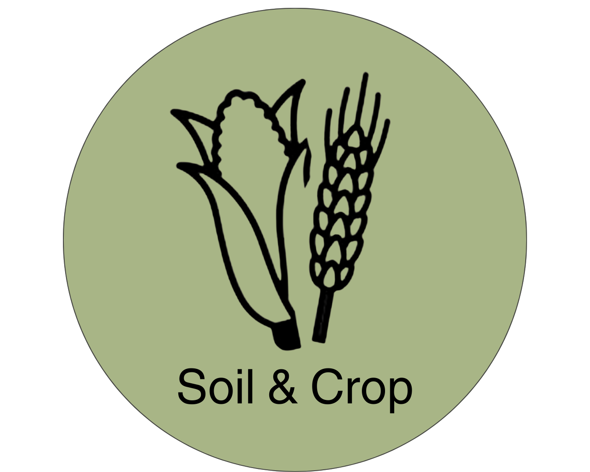

{width=25%}
# Soil and Crop Module
<!-- reuse code to import functions from "../scripts/": -->


## Introduction 

The Soil and Crop Module simulates the daily changes in soil composition and crop growth based on nutrient availability, weather and soil types. The underlying biophysical processes are drawn from existing models of soil and plant biogeochemistry including the SWAT model, Daycent, and SurPhos. The management routines execute the daily biogeochemical processes and direct simulation of the user-provided management practices including application of manure or synthetic fertilizer, tillage, planting and harvesting. As part of the whole farm biophysical simulation in RuFaS, the Soil and Crop Module receives manure from the Manure Module and sends harvested crop biomass to the Feed Storage Module.

## Field Management 

### Introduction 

The Field Manager (`FieldManager`) is analogous to the agronomist or field manager on a real dairy farm. It coordinates and manages all the different routines and processes that are executed in Soil and Crop Module across any number of fields. To start with, the field manager interprets and integrates all of the user’s inputs about field management, crops, and soils to create a set of fields that each have their specified field and soil properties as well as schedules for each of the key management operations (manure application, fertilizer application, tillage, planting, and harvesting). 

Once the fields and their schedules are set up, the `FieldManager` works through daily updates for each field. These daily updates include:

* Gathering the weather conditions for that day.
* Checking if there is a manure application needed so that it can coordinate with Manure Module to provide the manure for the application.
* Calling each field’s daily update methods.
* Recording the harvested crops and sending them to the Feed Storage Module.

The `FieldManager` is also responsible for calling functions to record and reset any annual data records or processes for each field. Thus, the `FieldManager` is responsible for receiving and generating information from the user and other parts of the model and coordinating the simulation within the Soil and Crop Module.

**Setting up Field Management**

RuFaS can simulate as many fields as the user wishes to specify and requires a unique input file for each field. However, individual fields can share soil, crop, and management schedule inputs so that the user can simulate multiple fields with, for example, the same soil configuration but different crop and management schedules or different crops with the same manure application schedules without having to replicate the inputs for fields with shared characteristics.

**Field Management Initialization**

The `FieldManager` class, implemented in `field_manager.py`, has a series of functions to help package the user-provided configuration data and management schedule information required to initialize each field. These functions all start with the prefix `set_up` and are called by the wrapper function `set_up_field()`. There is only one instance of the `FieldManager` class as it is used to set up and coordinate processes across all the fields. The following functions within the `FieldManager``class gather information and call other functions to help initialize key data classes required for initialization of each field:

* `setup_field_data`: This function sets up the field data parameters and returns an instance of the `FieldData` class populated with the values from the `field_configuration_data`.
* `setup_soil_data`: This function sets up a Soil instance that itself contains a `SoilData` instance configured to the user-provided specifications.
* `setup_soil_layer_data`: This function sets up a soil LayerData instance configured with provided data that is added to the `SoilData` instance.

See the Individual Field Management section below for more information about the `FieldData` Class and the Soil submodule documentation for information related to the soil data classes.

The next group of `set_up` functions in `FieldManager` help initialize the management schedules for each field. These functions call initialization routines for a schedule class that is used to generate an instance of a schedule with all the information that is specific to each type of management practice for each field. These schedule classes translate the user input into detailed schedules that can be read and interpreted by the `FieldManager` and instances of RuFaS Fields on a daily basis to determine the operations that need to be simulated each day. The schedule set up functions are:

* `set_up_fertilizer_events`: This function generates fertilizer application event schedules based on the user-provided fertilizer schedule and returns a fertilizer schedule as well as a dictionary with the available fertilizer mixes.
* `set_up_manure_events`: This function generates manure application event schedules based on the user-provided manure application schedules and returns a list of the planned manure applications.
* `set_up_tillage_events`: This function generates tillage event schedules based on the user-provided tillage schedules and returns a list of the planned tillage events.
* `set_up_crop_events`: This function generates all planting and harvest events based on the user-provided crop rotation schedule and returns a list of planting events and a list of the harvesting events that correspond to the planting events. 
* `set_up_crop_schedules`: This function is called by `set_up_crop_events()` and returns a single list of all the cropping schedules.

Outputs for each field can be identified by the character string used to define the field input blob in the metadata file. 

For example, in the below excerpt from a metadata input file:

{#fig-soc-metadata-input-eg}

There are 2 different fields named `field_example_1` and `field_example_2` so the outputs generated by the first field would take the form:
`Class.function.variable.field` = `field_example_1`

Where the pre-fix Class.function.variable is determined by the class, function that produced the variable, and the variable being reported. As a specific illustration, the output variable for the daily surface residue from `field_example_1` would be: 
``FieldData`Reporter.send_field_daily_variables.current_residue.field` = `field_example_1`

**Field Setup and Initialization**

When directed by the `FieldManager`, the Field class initializes a new Field object with the user-provided information that is packaged and shared by the `FieldManager`. These inputs include things like the field location, size, irrigation practices, pointers to the input files with management schedules, and options for turning crop growth stressors on and off. 

### Required User Inputs

### Expected Outputs

### Methodology

The first step to initializing an instance of a field is to initialize an instance of the `FieldData` class for each field which is called by the `setup_field_data()` function in `FieldManager`. Each instance of the `FieldData` class contains key information about the field from the user-provided configuration data that remains fixed throughout the simulation as well as other field attributes that are updated dynamically throughout the simulation such as the amount of crop residue that is on the surface of the field (`current_residue`), the amount of water being applied to a field in an irrigation interval (`watering_amount_in_mm`) and the number of days since the start of the current watering interval (`days_into_watering_interval`). 

Once the `FieldData` is initialized, the instances of the `SoilData` and `SoilLayerData` classes for that field are initialized. Following initialization of the soils for each field, the management schedules are generated. The user has some flexibility in how they provide information about the schedule for management operations so that they can either provide a list that provides information and dates for each operation individually, or if the same operation is repeated at an annual timestep or greater, they can provide information about the pattern with which that operation is repeated via the `pattern_repeat` and `pattern_skip` inputs. For example, if a user wanted to simulate an operation such as planting corn or fertilizer application that happened every year for 5 years on May 4th starting in 2021, they could specify this schedule with either of the two following combinations of inputs in a management schedule input file:

**Option 1:**

* `years`: [2021, 2022, 2023, 2024, 2025],
* `days`: [124, 124, 124, 124, 124],
* `pattern_repeat`: 0, 
* `pattern_skip`: 0

**Option 2:**

* `years`: [2021],
* `days`: [124],
* `pattern_repeat`: 5, 
* `pattern_skip`: 0

Similarly, if a user wanted to simulate something like cover crop planting or a manure application that happened every 4 years on September 5th starting in 1985, they could provide either of the following two inputs for that operation:

**Option 1:**

* `years`: [1985, 1989, 1993, 1997, 2001, 2005],
* `days`: [218],
* `pattern_repeat`: 0, 
* `pattern_skip`: 0

**Option 2:**

* `years`: [1985],
* `days`: [218],
* `pattern_repeat`: 6, 
* `pattern_skip`: 4

To translate the user-provided information about field schedules into standard data formats, RuFaS generates management schedules via operation specific schedule classes. These schedule classes (`CropSchedule`, `FertilizerSchedule`, `ManureSchedule`, and `TillageSchedule`) are built as child classes from a generic parent class (`Schedule`) that contains functions to expand the user-provided information about the timing of management operations into a list with a Julian day and year for each management operation alongside any operation specific configuration data. 

**Crop specific** management data includes specification of both the planting and harvesting schedule, and whether the harvest operation is a harvest only operation (meaning that the crop continues to grow after harvest) or if it is an event that kills the plant, with or without harvesting the crop. 

**Tillage specific** management information includes the depth of the tillage operation, the amount of surface soil that is mixed into lower parts of the soil profile (`incorporation_fractions`), and the amount of mixing that occurs between soil layers (`mixing_fractions`). 

**Fertilizer application specific** management information includes the proportions of N, P, and K in the fertilizer mixes being used, the proportion of N that is in the form of ammonium (`ammonium_fraction`), the total masses of N, P, and K applied at each application, the application depth, and the fraction of manure that remains on the surface (`surface_remainder_fraction`). 

**Manure application specific** management information includes the total masses of N, P, and K applied at each manure application, the application depth, and the fraction of fertilizer that remains on the surface (`surface_remainder_fraction`), and an indication of how the model should handle cases where there is not enough manure in storage to meet the manure application request (`supplement_manure Nutrient_Deficiencies`). 

After the user information about the management schedules are translated into complete lists where each list entry is the schedule information for each operation for the entire simulation, these multi-year schedules are then translated into lists where each entry is an individual event for each operation so that the field manager can iterate over this list. The lists of events are then combined with the field and soil data to initialize an instance of a field!

#### Daily Field Management

Each day the main simulation engine calls on the `FieldManager` routine to run its `daily_update_routine()` function which returns a list of harvested crops that can be passed to the Feed Storage Module. The `FieldManager` `daily_update_routine()` function collects the current weather conditions and manure for application to the field where appropriate and calls the Field class `manage_field()` routine which is the primary method in the Field class that steps through all the functions that execute the field management operations. The order of operations called is:

* Fertilizer Application
* Manure Application
* Tillage
* Soil Nutrient Cycling + Crop Growth
* Crop Management
    * Transition crops to dormancy
    * Plant crops
    * Harvest crops
    * Update crop and crop residue coverage

Once these daily processes have been executed for each field, the `FieldManager` `daily_update_routine()` function sends all the outputs to the `OutputManager` via the `output_gatherer.send_daily_variables()` function. 

#### Fertilizer Application

The first step in execution of a fertilizer application is to calculate the total mass of fertilizer required to meet the minimum N, P, and K application masses requested for each fertilizer given the specified nutrient composition of the fertilizer mix using the following two methods:

::: {#eq-sc-fld-1 style="font-size:90%"}
[[**SC.FLD.1**]]{.aside .content-visible when-format="html"}
$$
\begin{aligned}
&\text{fert\_mass}_\text{nitrogen} = \frac{\text{mass\_requested\_nitrogen}}{\text{fert\_nitrogen\_frac}} \\[8pt]
&\text{fert\_mass}_\text{phosphorus} = \frac{\text{mass\_requested\_phosphorus}}{\text{fert\_phosphorus\_frac}} \\[8pt]
&\text{fert\_mass}_\text{potassium} = \frac{\text{mass\_requested\_potassium}}{\text{fert\_potassium\_frac}} 
\end{aligned}
$$
:::     
    
::: {#eq-sc-fld-2 style="font-size:90%"}
[[**SC.FLD.2**]]{.aside .content-visible when-format="html"}
$$
\text{applied\_mass} = max(\text{fert\_max}_\text{nitrogen}, \text{fert\_max}_\text{phosphorus}, \text{fert\_max}_\text{potassium}) 
$$
::: 

*Where*:

* `applied_mass` (kg) is the mass of the given fertilizer required to satisfy all nutrient requests.
* fert_massnitrogen (kg) is the mass nitrogen requested.
* fert_massphosphorus (kg) is the mass of phosphorus requested.
* fert_masspotassium (kg) is the mass of potassium requested.
* `fert_nitrogen_frac` (proportion) is the fraction of nitrogen in the fertilizer mix.
* `fert_phosphorus_frac` (proportion) is the fraction of phosphorus in the fertilizer mix.
* `fert_potassium_frac` (proportion) is the fraction of potassium in the fertilizer mix.

The mass of each nutrient applied is then calculated as:
   
::: {#eq-sc-fld-3 style="font-size:90%"}
[[**SC.FLD.3**]]{.aside .content-visible when-format="html"}
$$
\begin{aligned}
&\text{applied\_nitrogen} = \text{applied\_mass} \times \text{fert\_nitrogen\_frac} \\[8pt]
&\text{applied\_phosphorus} = \text{applied\_mass} \times \text{fert\_phosphorus\_frac} \\[8pt]
&\text{applied\_potassium} = \text{applied\_mass} \times \text{fert\_potassium\_frac} 
\end{aligned}
$$
:::  

*Where*:

* `applied_nitrogen` (kg) is the mass of nitrogen applied.
* `applied_phosphorus` (kg) is the mass of phosphorus applied.
* `applied_potassium` (kg) is the mass of potassium applied.

Once the total fertilizer mass and nutrients associated with a fertilizer application are determined, the fertilizer nitrogen and phosphorus masses are added to the appropriate soil nutrient pools via the `apply_fertilizer()` function in the `FertilizerApplication` class in the `fertilizer_application.py` file. 

::: {.callout-note}
Note that RuFaS does not currently track soil potassium cycling so the application of potassium with fertilizer is recorded solely as a means of tracking resource use. In the future, we hope to add a soil potassium cycling routine at which point potassium will be added to soil nutrient pools via the `apply_fertilizer()` method in a similar manner as nitrogen and phosphorus.
:::

Nitrogen and phosphorus are first added to the surface soil layer followed by distribution to the sub-surface layers according to the depth of application. Because soil nutrient pools are tracked in units of kg/ha, the total mass of each nutrient applied to the field is first divided by the field size.

The amount of each nutrient applied to the surface is determined as:

::: {#eq-sc-fld-4 style="font-size:90%"}
[[**SC.FLD.4**]]{.aside .content-visible when-format="html"}
$$
\text{surface\_applied\_nutrient} = \frac{\text{applied\_nutrient} \times \text{surface\_remainder\_fraction}}{\text{field\_size}}
$$
::: 

*Where*:

* `surface_applied_nutrient` (kg/ha) is the mass per ha of each nutrient applied to the surface soil layer.
* `surface_remainder_fraction` (proportion) is the user-provided input defining the fraction of the fertilizer that remains on the soil surface.
* `field_size` (ha) is the size of the field.

The proportion of the subsurface fertilizer that is applied to each layer is calculated from the relationship between the bottom depth of each soil and the application depth. So, for each layer a “depth factor” is calculated as:

if layer_depth < application_depth:
::: {#eq-sc-fld-5 style="font-size:90%"}
[[**SC.FLD.5**]]{.aside .content-visible when-format="html"}
$$
\text{depth\_factor} = \frac{\text{layer\_depth}}{\text{application\_depth}} 
$$
::: 

Otherwise,

::: {#eq-sc-fld-6 style="font-size:90%"}
[[**SC.FLD.6**]]{.aside .content-visible when-format="html"}
$$
\text{depth\_factor} = 1.0 - \text{depth\_factor\_sum} 
$$
::: 

*Where*:

* `depth_factor` (proportion) is the fraction of subsurface fertilizer added to each soil layer.
* `layer_depth` (mm) is the bottom depth of each sub-surface soil layer.
* `depth_factor_sum` (proportion) is the sum of the depth factors for all layers above the deepest layer receiving fertilizer.

Thus, the amount of fertilizer added to each nutrient pool in a sub-surface soil layer is: 

::: {style="font-size:90%"}
$$
\text{sub\_surface\_applied\_nutrient} = \frac{\text{applied\_nutrient} \times (1 - \text{surface\_remainder\_fraction})}{\text{field\_size}}
$$
::: 

::: {style="font-size:90%"}
$$
\text{sub\_surface\_applied\_nutrient}_\text{layer\_i} = \text{sub\_surface\_applied\_nutrient} \times \text{depth\_factor}
$$
::: 

The soil nutrient pools that receive nitrogen are the soil nitrate and ammonium pools. The proportion of fertilizer nitrogen distributed to each of these pools is determined by the user provided `ammonium_fraction`.

Fertilizer phosphorus is intended to be added to the labile inorganic phosphorus pools to be available for plant uptake. However, phosphorus applied to the surface is not immediately available in this pool and until the first precipitation or irrigation event the phosphorus is gradually sorbed by the soil. Thus, at the time of application, 75% of surface applied fertilizer P is added to the available phosphorus pool for gradual sorption and 25% of the surface applied P is added to the recalcitrant pool which is solubilized during rainfall and either added to the labile phosphorus pool or lost through runoff and leaching.

::: {#eq-sc-fld-7 style="font-size:90%"}
[[**SC.FLD.7**]]{.aside .content-visible when-format="html"}
$$
\begin{aligned}
&\text{available\_phosphorus\_pool} = \text{surface\_applied\_phosphorus} \times 0.75 \\[8pt]
&\text{recalcitrant\_phosphorus\_pool} = \text{surface\_applied\_phosphorus} \times 0.25
\end{aligned}
$$
:::  

#### Manure Application

When the results of the manure nutrient request are passed into the `FieldManager` and then to the Field class daily update routine, the `manage_field()` function can then execute the manure application with the manure nutrients and amount provided by the `ManureModule` via the `SimulationEngine`. If there are any unmet nutrients from the initial, intended application, if the user indicated that these unmet nutrients can be met with synthetic fertilizers, these are supplied by an additional fertilizer application that is initiated by the `handle_unmet_nutrients()` function. 

Once the amount of manure to be applied is known, the `apply_and_record_manure_application()` function first adds the water associated with the manure application. The amount of water in the manure application is determined by the total mass of manure applied and the dry matter fraction of the manure:

::: {#eq-sc-fld-8 style="font-size:90%"}
[[**SC.FLD.8**]]{.aside .content-visible when-format="html"}
$$
\text{manure\_applied\_water} = \frac{\text{manure\_mass\_applied}}{\text{manure\_dry\_matter\_fraction}}
$$
::: 
            
*Where*:

* `manure_applied_water` is the amount of water applied to the field with a manure application (L)

The amount of water in liters is then converted to the amount in mm by a helper function `convert_liters_to_millimeters()`. 

After the water is applied, the phosphorus and nitrogen from manure are applied via the `apply_machine_manure()` function in the `ManureApplication` class which is implemented in `manure_application.py`. The manure application process is broken out into the surface application which follows methods described by the SurPhos model and the subsurface application [@vadas2007]. 

**Surface Manure Application**

During manure application, the amount of manure applied to the surface is assumed to stay on the surface unless it is a liquid manure with a dry matter content less than 15% in which case infiltration is assumed and the manure nutrients are assumed to be added to the sub-surface layer. Following the methods from the SurPhos model, first the manure solids remaining on the soil surface are calculated [@vadas2007]:

::: {#eq-sc-fld-9 style="font-size:90%"}
[[**SC.FLD.9**]]{.aside .content-visible when-format="html"}
$$
\text{surface\_dry\_matter\_mass} = \text{manure\_dry\_matter\_mass} \times \text{surface\_remainder\_fraction}
$$
::: 
            
*Where*:

* `surface_dry_matter_mass` (kg) is the amount of manure solids or dry matter that is applied to the soil surface at that application.
* `manure_dry_matter_mass` (kg) is the amount of manure solids or dry matter that is applied at that application.
* `surface_remainder_fraction` (kg) is the user-provided value for the amount of the manure applied that remains on the surface.

**Surface Phosphorus Application**

Phosphorus is then distributed to 4 pools (water extractable inorganic phosphorus, water extractable organic phosphorus, stable inorganic phosphorus, stable organic phosphorus) according to the following methods:

First the fractions of each type of phosphorus are calculated assuming that 55% of manure phosphorus is water extractable and 75% of the non-water extractable or stable phosphorus is inorganic: 

::: {#eq-sc-fld-10 style="font-size:90%"}
[[**SC.FLD.10**]]{.aside .content-visible when-format="html"}
$$
\begin{aligned}
&\text{water\_extractable\_inorganic\_phosphorus\_fraction} = 0.50 \\[8pt]
&\text{water\_extractable\_organic\_phosphorus\_fraction} = 0.50 \\[8pt]
&\text{stable\_phosphorus\_fraction} = 1.0 - (\text{water\_extractable\_inorganic\_phosphorus\_fraction} + \text{water\_extractable\_organic\_phosphorus\_fraction}) \\[8pt]
&\text{stable\_inorganic\_phosphorus\_fraction} = 0.75 \times \text{stable\_phosphorus\_fraction} \\[8pt]
&\text{stable\_organic\_phosphorus\_fraction} = 0.25 \times \text{stable\_phosphorus\_fraction}
\end{aligned}
$$
:::  

Then these fractions are multiplied by the total phosphorus applied as well as the product of the infiltration indicator and the surface remainder fraction to obtain the mass of each phosphorus type applied to add the surface or subsurface soil phosphorus layers:

::: {#eq-sc-fld-11 style="font-size:90%"}
[[**SC.FLD.11**]]{.aside .content-visible when-format="html"}
$$
\begin{aligned}
\text{mass\_to\_add\_to\_labile\_phos} &= \text{total\_phosphorus\_mass} \times (\text{water\_extractable\_inorganic\_phosphorus\_fraction} \\[8pt]
&\qquad + (0.95 \times \text{water\_extractable\_organic\_phosphorus\_fraction}) + (0.95 \times \text{stable\_organic\_phosphorus\_fraction})) \\[8pt]
&\qquad \times \text{soil\_infiltration} \times \text{surface\_remainder\_fraction}
\end{aligned}
$$
::: 

::: {#eq-sc-fld-12 style="font-size:90%"}
[[**SC.FLD.12**]]{.aside .content-visible when-format="html"}
$$
\begin{aligned}
\text{mass\_to\_add\_to\_active\_phos} &= \text{total\_phosphorus\_mass} \times \text{stable\_organic\_phosphorus\_fraction} \\[8pt]
&\qquad \times \text{soil\_infiltration} \times \text{surface\_remainder\_fraction}
\end{aligned}
$$
::: 

*Where*:

* `mass_to_add_to_labile_phos` (kg) is the phosphorus that will be added to the surface labile phosphorus pool during that application.
* `mass_to_add_to_active_phos` (kg) is the phosphorus that will be added to the surface active phosphorus pool during that application.
* `total_phosphorus_mass` (kg) is the total phosphorus applied during that application.
* `soil_infiltration` is equal to 0.4 if the manure applied is less than 15% dry matter, and 0 otherwise.

The SurPhos manure pool attributes for the manure dry matter mass, moisture factor and field coverage are then updated according to the new field coverage and surface dry matter mass for that application [@vadas2007].

**Surface Nitrogen Application**

The composition of manure nitrogen is provided by the manure module as the fractions that are in inorganic nitrogen, ammonium nitrogen, and organic nitrogen. These fractions are then distributed to the soil nitrate, ammonium, fresh organic nitrogen, and stable organic nitrogen pools according to the following:

::: {#eq-sc-fld-13 style="font-size:90%"}
[[**SC.FLD.13**]]{.aside .content-visible when-format="html"}
$$
\begin{aligned}
&\text{mass\_nitrates\_added} = \text{manure\_dry\_matter\_mass} \times \text{inorganic\_nitrogen\_fraction} \times \frac{1-\text{ammonium\_fraction}}{\text{field\_size}} \\[8pt]
&\text{mass\_ammonium\_added} = \text{manure\_dry\_matter\_mass} \times \text{inorganic\_nitrogen\_fraction} \times \frac{\text{ammonium\_fraction}}{\text{field\_size}} \\[8pt]
&\text{mass\_fresh\_organic\_nitrogen\_added} = \text{manure\_dry\_matter\_mass} \times \text{organic\_nitrogen\_fraction} \times \frac{\text{fresh\_fraction\_of\_organic\_nitrogen}}{\text{field\_size}} \\[8pt]
&\text{mass\_stable\_organic\_nitrogen\_added} = 
\end{aligned}
$$
:::  

*Where*:

* `mass_nitrates_added` (kg N/ha) is the mass of nitrate nitrogen applied to relevant soil layer.
* `mass_ammonium_added` (kg N/ha) is the mass of ammonium nitrogen applied to relevant soil layer.
* `mass_fresh_organic_nitrogen_added` (kg N/ha) is the mass of fresh organic nitrogen applied to relevant soil layer.
* `mass_stable_organic_nitrogen_added` (kg N/ha) is the mass of stable organic nitrogen applied to relevant soil layer.
* `manure_dry_matter_mass` (kg) is the mass of manure dry matter added to the soil layer.
* `ammonium_fraction` (proportion) is the fraction of inorganic nitrogen that is in the form of ammoniacal nitrogen and is provided by the Manure Module.
* `fresh_fraction_of_organic_nitrogen` (proportion) is the fraction of organic nitrogen that is more quickly mineralized and is set to a constant of 0.9286.

The manure mass that is applied to the surface layer is set to the 100% of the `surface_dry_matter_mass` calculated in [SC.FLD.9](#eq-sc-fld-9) if the manure dry matter content is greater than 15%. For liquid manure when the dry matter content is less than 15%, infiltration is assumed and the surface application is set to 60% of the `surface_dry_matter_mass` from [SC.FLD.9](#eq-sc-fld-9) and 40% of the `surface_dry_matter_mass` is assigned to be added to the first sub-surface layer.

**Subsurface Manure Application**

For manure applications where a fraction or all of the manure is applied below the soil surface (i.e. injection) the sub-surface manure application method is followed for the proportion of the application applied below the soil surface. 

The sub-surface fraction of manure application is calculated as:

::: {#eq-sc-fld-14 style="font-size:90%"}
[[**SC.FLD.14**]]{.aside .content-visible when-format="html"}
$$
\text{subsurface\_fraction} = 1.0 - \text{surface\_remainder\_fraction}
$$
:::     

to capture all the manure applied that is not accounted for in the surface application methods. 

This value, along with the manure nitrogen and phosphorus compositions and the total masses of manure applied in each application is passed into the `apply_subsurface_manure()` function. 

Calculation of the manure phosphorus masses to be added to different soil phosphorus pools occurs according to the equations described in [SC.FLD.9](#eq-sc-fld-9), [SC.FLD.10](#eq-sc-fld-10), and [SC.FLD.11](#eq-sc-fld-11). 

Similarly, calculation of the manure N mass to be added to the subsurface layers follows the methods described in [SC.FLD.13](#eq-sc-fld-13). 

The method for distributing the `total_phosphorus_mass` and `manure_mass_applied` to the subsurface layers multiplies the manure application masses by the `subsurface_fraction` calculated in [SC.FLD.9](#eq-sc-fld-9) and `depth_factors` calculated using the method described in [SC.FLD.5](#eq-sc-fld-5) and [SC.FLD.6](#eq-sc-fld-6) as in the generic equation below:

::: {#eq-sc-fld-15 style="font-size:90%"}
[[**SC.FLD.15**]]{.aside .content-visible when-format="html"}
$$
\text{nutrient\_mass\_added\_to\_layer} = \text{mass\_applied} \times \text{nutrient\_fraction} \times \text{subsurface\_fraction} \times \text{depth\_factor}
$$
:::    

**Tillage Application**

The tillage method mixes nutrient masses from the soil layers to the layers below them and ensures that the nutrients do not get mixed below the bottom of the soil profile.  The `till_soil()` function aggregates all the soil nutrient pools needed to be mixed through tillage including: 

* `labile_inorganic_phosphorus_content`
* `active_inorganic_phosphorus_content`
* `stable_inorganic_phosphorus_content`
* `nitrate_content`
* `ammonium_content`
* `active_organic_nitrogen_content`
* `stable_organic_nitrogen_content`
* `fresh_organic_nitrogen_content`
* `metabolic_litter_amount`
* `structural_litter_amount`
* `active_carbon_amount`
* `slow_carbon_amount`
* `passive_carbon_amount`

It then iterates through these soil nutrient pools and soil layers to redistribute nutrients between the soil pools according to the user provided tillage depth and mixing fraction.

#### Initiate Daily Biophysical Processes

An important step in the `Field classes manage_field()` routine is to initiate the updates to the biophysical processes that are managed by the Soil and Crop classes. This is achieved by the `execute_daily_processes()` method and initiates the following processes:

* Snow accumulation and melting
* Crop residue and canopy cover update
* Soil temperature update
* Soil water and nutrient cycling updates
* Crop growth updates

#### Crop Management

In managing the crop cycle, the daily updates called by the Field class first check if the crop is meant to go into a dormant stage. 

After initiating any dormancy where appropriate, the Field class then checks to see if any crops are scheduled to be planted that day. If so, it calls on the Crop class to initialize Crop and ensures that the `max_root_depth` attribute of that crop does not allow its roots to go below the bottom of the soil profile.

The last management practice the Field class checks is the harvesting event schedule. If a harvest event is scheduled for that day, it initiates the harvest method in the Crop class and updates its list of crops to remove the harvested and killed crops from its list of crops. 

## Soil Management 

### Introduction 

The soil submodule spatially and dynamically models agronomic and biogeochemical processes taking place on the surface of and within the soil profile. It tracks plant roots/residue, hydrological movement, and dissolved/undissolved carbon, nitrogen, and phosphorus cycling. Carbon and nitrogen nutrient cycling and hydrology are based on the SWAT+ model and phosphorus nutrient cycling on the SurPhos model [@vadas2007]. 

**Soil Initialization**

RuFaS can simulate soils of any combination of textures in as many layers delineated by depth as the user wishes to specify. A single soil type and profile can represent all fields in a simulation or can be specific to individual fields. Each specified soil is stored by RuFaS as a `SoilData` object consisting of a list of `LayerData` objects that in turn represent a set of variables specific to each layer of soil. At the start of the simulation the user's soil specifications generate the soil layers for each field and pools of water, carbon, nitrogen, and phosphorus are initialized in each layer.

### Required User Inputs

### Expected Outputs

### Methodology

Soil temperature and water content/flow are the main drivers of soil biogeochemical cycling.

#### Soil Temperature

Soil temperature fluctuates diurnally and seasonally and is estimated daily as a function of the previous day’s soil temperature, average annual air temperature, the current day’s soil surface temperature and depth in the soil profile for each soil layer by using the following equations from SWAT 2009 documentation.

::: {#eq-sc-tmp-1 style="font-size:90%"}
[[**SC.TMP.1**]]{.aside .content-visible when-format="html"}
$$
\text{T}_{\text{soil}\text{(z,dn)}} = (\text{L} \times \text{T}_\text{soil(z,dn-1)}) + (1 - \text{L}) \times [\text{df} \times (\text{T}_\text{aair} - \text{T}_\text{surf}) + \text{T}_\text{surf}]
$$
::: 

*Where*:
        
* Tsoil(z,dn) = soil temperature ℃ at depth z (mm) and day of the air dn
* L	= lag coefficient( ranging from 0.0 to 1.0, default: 0.8) that controls the influence of the previous day’s temperature on the current day’s temperature  
* Tsoil(z,dn-1) = soil temperature ℃ at depth z (mm) on previous day
* df = depth factor that quantifies the influence of depth below surface on soil temperature
* Taair = average annual air temperature ℃
* Tsurf = daily soil surface temperature ℃ on the day

::: {#eq-sc-tmp-2}
[[**SC.TMP.2**]]{.aside .content-visible when-format="html"}
$$
\text{df} = \frac{\text{zd}}{\text{zd} + e^{(-0.867 - 2.078 \times \text{zd})}}
$$
::: 

* `zd` = ratio of depth at the center of soil layer to damping depth

::: {#eq-sc-tmp-3}
[[**SC.TMP.3**]]{.aside .content-visible when-format="html"}
$$
\text{zd} = \frac{\text{z}}{\text{dd}}
$$
::: 

*Where*:
        
* `dd` = damping depth (mm)
* `z` = depth at the center of the soil layer (mm)

Damping depth is a function of soil water and max damping depth. ddmax is the maximum damping depth (mm) to which the temperature wave penetrates and the amplitude decreases to 1/e or 0.37 of its initial value in the soil layers. This is largely dependent on soil thermal conductivity and thermal diffusivity, and is calculated using following equations:

::: {#eq-sc-tmp-4}
[[**SC.TMP.4**]]{.aside .content-visible when-format="html"}
$$
\text{dd}_\text{max} = 1000 + \frac{2500 \times \text{BD}}{\text{BD} + 686 \times e^{(-5.63 \times \text{BD})}}
$$
::: 

::: {#eq-sc-tmp-5}
[[**SC.TMP.5**]]{.aside .content-visible when-format="html"}
$$
\text{dd} = \text{dd}_\text{max} \times e^{[ln{\frac{500}{\text{dd}_\text{max}}} \times (\frac{1 - \text{scale}}{1 + \text{scale}})^2]}
$$
::: 

*Where*:

* ddmax = maximum damping depth (mm)
* `scale` = scaling factor for soil water

::: {#eq-sc-tmp-6}
[[**SC.TMP.6**]]{.aside .content-visible when-format="html"}
$$
\text{scale} = \frac{\text{SW}}{(0.356 - 0.144 \times \text{BD}) \times \text{Ztot}}
$$
::: 

*Where*:

* `BD` = soil bulk density (g/cm$^3$)
* `SW` = total soil water in the profile (mm)
* `Ztot` = total soil profile depth (mm)
        
Soil surface temperature is a function of the previous day’s temperature, the amount of ground cover, and the temperature of a bare soil surface. The temperature of a bare soil is calculated as: 

::: {#eq-sc-tmp-7}
[[**SC.TMP.7**]]{.aside .content-visible when-format="html"}
$$
\text{T}_\text{bare} = \text{T}_\text{av} + \text{E}_\text{sr}^{\frac{\text{Tmax}-\text{Tmin}}{2}} 
$$
::: 
            
*Where*:
        
* Tbare = Temperature of a bare soil surface (℃) with no cover
* Tav = Average daily temperature (℃) on the day
* Esr = Radiation term

::: {#eq-sc-tmp-8}
[[**SC.TMP.8**]]{.aside .content-visible when-format="html"}
$$
\text{E}_\text{sr} = \frac{\text{H}_\text{day} \times (1 - \text{albedo}) - 14}{20}
$$
::: 

            
*Where*:
        
* Hday	= daily solar radiation (user input, MJ/m$^2$/d)
* `albedo` = daily fraction of incoming sunlight that is reflected by a surface
        
Albedo should be determined by soil type and is set by user input. 
		
The impact of plant and snow cover is quantified as a weighting factor, bcv, given by the maximum of the following two equations:

::: {#eq-sc-tmp-9}
[[**SC.TMP.9**]]{.aside .content-visible when-format="html"}
$$
\text{bcv} = \frac{\text{plant\_cover}}{\text{plant\_cover} + (e^{(7.563 - 0.0001297)} \times \text{plant\_cover})}
$$
::: 

::: {#eq-sc-tmp-10}
[[**SC.TMP.10**]]{.aside .content-visible when-format="html"}
$$
\text{bcv} = \frac{\text{SNOW}}{\text{SNOW} + (e^{(6.055 - 0.3002)} \times \text{SNOW})}
$$
::: 
            
*Where*:
        
* `SNOW` = snow water content on the current day (mm)	
* `plant_cover` = Total aboveground plant biomass and residue on the current day (kg per hectare)

::: {#eq-sc-tmp-11}
[[**SC.TMP.11**]]{.aside .content-visible when-format="html"}
$$
\text{Tsurf} = (\text{bcv} \times \text{T}_\text{soil,d-1}) + ((1 - \text{bcv}) \times \text{T}_\text{bare})
$$
::: 
            
*Where*:            

* `Tsurf` = surface temperature (℃)

Surface temperature is dependent on the previous day’s soil temperature and is calculated before soil temperature on any given day. On the first day of a simulation the default soil temperature is used for Tsoil,d-1.

#### Soil Hydrology

The soil hydrological processes calculated in RuFaS are limited to infiltration, the downward movement of water through the soil profile, and evapotranspiration, the movement of water from the soil profile into the atmosphere.

**Infiltration** `infiltration.py`

The Infiltration class is implemented in `infiltration.py` and calculates both infiltration and runoff. Infiltration is the movement of soil water into and through the soil profile and surface runoff results when application of water to the ground surface exceeds the infiltration rate. Infiltration is calculated as the difference between the amount of water applied to the surface and the amount of surface water run off. Surface water is thus calculated first and then used to calculate soil water infiltration. Soil texture (percentage of sand, silt, and clay), bulk density, presence of pores, pore diameter, and continuity affect the soil infiltration rate. Slow soil infiltration rate results in ponding in the level areas, surface runoff, and erosion in sloping areas. High infiltration rates can lead to nutrient leaching. Surface runoff is estimated using the NRCS curve number method.

Runoff has a minimum of 0 and is calculated as:
::: {#eq-sc-inf-1}
[[**SC.INF.1**]]{.aside .content-visible when-format="html"}
$$
\text{runoff} = 
\begin{cases}
(\text{R} - 0.2\text{S}) \times (2\text{R} + 0.8 \text{S}), & \text{if R > 0.2S} \\[8pt]
0, & \text{otherwise}
\end{cases}
$$
::: 
            
*Where*:
            
* `R` = daily rainfall (mm H2O) 
* `S` = retention parameter (mm H2O)
        
S is determined using an empirical value CN (curve number, unitless, user-defined). Three values of CN are used to determine S.

::: {#eq-sc-inf-2}
[[**SC.INF.2**]]{.aside .content-visible when-format="html"}
$$
\text{CN}_1 = \text{CN}_2 - \frac{20 \times (100 - \text{CN}_2)}{100 - \text{CN}_2 + e^{(2.533 - 0.0636 \times (100 - \text{CN}_2))}}
$$
:::  

::: {#eq-sc-inf-3}
[[**SC.INF.3**]]{.aside .content-visible when-format="html"}
$$
\text{CN}_3 = \text{CN}_2 - e^{(0.00673 \times (100 - \text{CN}_2))}
$$
:::  

*Where*:
            
* CN1, the first moisture condition, is the wilting point.
* CN2, the second moisture condition, curve number is user-defined. 
* CN3, the third moisture condition, is field capacity. 
        
S is calculated as

::: {#eq-sc-inf-4}
[[**SC.INF.4**]]{.aside .content-visible when-format="html"}
$$
\text{S} = \text{S}_\text{max} \times (1 - \frac{\text{SW}_\text{available}}{\text{SW}_\text{available} + e^{\text{w}_1 - (\text{w}_2 \times \text{SW}_\text{available})}})
$$
:::  

*Where*:

* Smax =maximum value for S on any given day (mm H2O) 
* SWavailable = available soil profile water content (SW - WP) (mm H2O)
* w1, w2 = shape coefficients
        
Smax is calculated as:

::: {#eq-sc-inf-5}
[[**SC.INF.5**]]{.aside .content-visible when-format="html"}
$$
\text{S}_{\text{max}} = 25.4 \times \left(\frac{1000}{\text{CN}_1} - 10\right)
$$
:::               
            
w1 and w2 are calculated as:

::: {#eq-sc-inf-6}
[[**SC.INF.6**]]{.aside .content-visible when-format="html"}
$$
\text{w}_1 = ln (\frac{\text{FC}}{1 - (\text{S}_3 \times \text{S}_{\text{max}}^{-1})} - \text{FC}) + (\text{w}_2 \times \text{FC})
$$
:::  

::: {#eq-sc-inf-7}
[[**SC.INF.7**]]{.aside .content-visible when-format="html"}
$$
\text{w}_2 = \frac{\ln \left(\frac{\text{FC}}{1 - (\text{S}_3 \times \text{S}_{\text{max}}^{-1})} - \text{FC}\right) - \ln \left(\frac{\text{SAT}}{1 - (2.54 \times \text{S}_{\text{max}}^{-1})} - \text{SAT}\right)}{\text{SAT} - \text{FC}}
$$
:::  
            
*Where*:
            
* `FC` = amount of water in soil profile at field capacity (mm H2O)
* `SAT` = amount of water in soil profile at saturation (mm H2O)
        
S3 is calculated as:

::: {#eq-sc-inf-8}
[[**SC.INF.8**]]{.aside .content-visible when-format="html"}
$$
\text{S}_3 = 25.4 \times (\frac{1000}{\text{CN}_3} - 10)
$$
:::  
            
When the top layer of the soil is frozen (layerTemp $\leq$ 2℃), S is modified using the following equation: 

::: {#eq-sc-inf-9}
[[**SC.INF.9**]]{.aside .content-visible when-format="html"}
$$
\text{S}_\text{frz} = \text{S}_\text{max} \times (1 - e^{(0.000862 \times \text{S})})
$$
:::                       
            
Infiltration into the soil is daily rainfall less daily runoff:

::: {#eq-sc-inf-10}
[[**SC.INF.10**]]{.aside .content-visible when-format="html"}
$$
\text{Infiltration} = \text{R} - \text{runoff}
$$
:::  

**Evapotranspiration**

Evapotranspiration (ET) is one of the most important hydrological processes of soil water balance in the soil and crop module. It is the sum of all processes by which water moves from the land surface to the atmosphere via soil evaporation, plant canopy transpiration, and sublimation. RuFaS adapts the Hargreaves method to estimate ET which only requires temperature as an input [@hargreaves1985].

Potential evapotranspiration (PET) is the maximum amount of water that could be removed due to surface evaporation and plant canopy transpiration with no limitation on water availability, while evapotranspiration (ET) is the actual amount of water lost due to evaporation and transpiration. 

*Potential Evapotranspiration* (implemented in `field.py`) is the larger of 0.001 or function of the radiation, daily temperature range, and heat of vaporization:

::: {#eq-sc-evp-1}
[[**SC.EVP.1**]]{.aside .content-visible when-format="html"}
$$
\text{ET}_\text{max} = max ({\frac{0.0023 \times \text{H}_0 \times (\text{T}_\text{max} - \text{T}_\text{min})^{0.5} \times (\text{T}_\text{avg} + 17.8)}{\text{LHV}}, 0.001})
$$
:::  
            
*Where*:
            
* `LHV` = latent heat of vaporization (MJ kg $^{-1}$)
* ETmax = potential evapotranspiration (otherwise known as PET) (mm d$^{-1}$)
* H0 = extraterrestrial radiation (MJ m $^{-2}$ d $^{-1}$), input
* Tmax = maximum air temperature for a given day (℃)
* Tmin = minimum air temperature for a given day (℃)
* Tavg = mean air temperature for a given day (℃)
        
LHV is calculated as:

::: {#eq-sc-evp-2}
[[**SC.EVP.2**]]{.aside .content-visible when-format="html"}
$$
\text{LHV} = 2.501 - 2.361 \times 10^{-3} \times \text{T}_\text{avg}
$$
:::
            
*Maximum crop transpiration* (implemented in `water_dynamics.py`) is the proportion of potential evapotranspiration that is transpired through the plant canopy. Leaf Area Index (LAI) lower than 3.0 and available water in the rooting zone limit transpiration.

::: {#eq-sc-evp-3}
[[**SC.EVP.3**]]{.aside .content-visible when-format="html"}
$$
\text{trans}_\text{max} = 
\begin{cases}
\frac{\text{ET}_\text{max} \times \text{LAI}_\text{act}}{3.0}, & \text{if } 0 \leq \text{LAI}_\text{act} \leq 3.0 \\
\text{ET}_\text{max}, & \text{if } \text{LAI}_\text{act} > 3.0
\end{cases}
$$
::: 
            
*Where*:
            
* Transmax =	maximum transpiration on a given day (mm H2O)
* LAIact	= LAI (Leaf Area Index) actual (calculated in Crop Growth)
        
*Sublimation and soil evaporation* (implemented in `field.py`) refer to the phase changes of solid and liquid water to gas which transfer water from land to atmosphere.

::: {#eq-sc-evp-4}
[[**SC.EVP.4**]]{.aside .content-visible when-format="html"}
$$
\text{evap}_\text{max} = \text{ET}_\text{max} \times \text{SoilCov}
$$
:::

*Where*:            
        
* evapmax = maximum soil evaporation/sublimation on a given day (mm H2O)
* `SoilCov` = soil cover index

::: {#eq-sc-evp-5}
[[**SC.EVP.5**]]{.aside .content-visible when-format="html"}
$$
\text{SoilCov} = e^{(-5.0 \times 10^{-5} \times \text{BioMass})}
$$
:::        
            
*Where*:
            
* `BioMass` = aboveground biomass and residue (kg ha$^{-1}$) 
        
Potential evaporation is adjusted based on trans\textsubscript{max} as: 

::: {#eq-sc-evp-6}
[[**SC.EVP.6**]]{.aside .content-visible when-format="html"}
$$
\text{evap}_\text{max} = min(\frac{\text{evap}_\text{max} \times \text{ET}_\text{max}}{\text{evap}_\text{max} + \text{trans}_\text{max}}, \text{evap}_\text{max})
$$
:::    
            
*Partition evaporation within soil profile* (implemented in `evaporation.py`) vertically subsets the maximum evaporation to calculate evaporation demand within each layer of the soil profile

::: {#eq-sc-evp-7}
[[**SC.EVP.7**]]{.aside .content-visible when-format="html"}
$$
\text{evap}_\text{z} = \text{evap}_\text{max} \times \frac{\text{z}}{\text{z} + e^{(2.374 - 0.00713 \times \text{z})}}
$$
::: 
            
*Where*:
            
* evapz = evaporation demand at depth z (mm H2O)
* `z` = depth below soil surface (mm)
        
The evaporation demand for a given soil layer is the difference between evaporation demands at the top and bottom of the layer. 

::: {#eq-sc-evp-8}
[[**SC.EVP.8**]]{.aside .content-visible when-format="html"}
$$
\text{evap}_\text{ly} = \text{evap}_\text{bottom} - \text{evap}_\text{top}
$$
:::
            
When the water content of a soil layer is below field capacity, the evaporative demand for the layer is reduced according to the following equation:

::: {#eq-sc-evp-9}
[[**SC.EVP.9**]]{.aside .content-visible when-format="html"}
$$
\text{evap}_\text{ly}\text{reduced} = \text{evap}_\text{ly} \times e^{(2.5 \times \frac{\text{SW}-\text{FC}}{\text{FC}-\text{WP}})}, \quad \text{if SW < FC}
$$
:::
            
*Where*:
                    
* evaply = evaporation demand of the layer
* `SW` = soil water content for the layer (mm H2O)
* `WP` = soil water content held at wilting point (mm H2O)
* `FC` = field capacity for soil water (mm H2O)
        
In addition, the daily amount of water removed by evaporation is limited to 80% of the plant available water (SW-WP):

::: {#eq-sc-evp-10}
[[**SC.EVP.10**]]{.aside .content-visible when-format="html"}
$$
\text{evap}_\text{ly} = min(0.8 \times (\text{SW} - \text{WP}), \text{evap}_\text{ly})
$$
:::
            
The total actual amount of water lost in evapotranspiration (ETact) is equal to the sum of evaporation from each layer

**Percolation** `percolation.py`

Percolation is the process of water movement downward through the soil profile. When the soil water content in a layer is less than or equal to field capacity no percolation occurs. Percolation is not calculated for frozen layers.  

::: {#eq-sc-per-1}
[[**SC.PER.1**]]{.aside .content-visible when-format="html"}
$$
\text{perc} = \text{SW}_\text{perc} \times (1 - e^{(-\frac{t}{TT})})
$$
:::

*Where*:
            
* SWperc = water available for percolation (mm H2O)
* `perc` = amount of water that percolates to the underlying soil layer (mm H2O)
* `t` = time step (24 h)
* `TT` = travel time for percolation (h)

::: {#eq-sc-per-2}
[[**SC.PER.2**]]{.aside .content-visible when-format="html"}
$$
\text{SW}_\text{perc} = \text{SW} - \text{FC}, \quad \text{if SW > FC}
$$
:::
            
TT for each soil layer is calculated as:

::: {#eq-sc-per-3}
[[**SC.PER.3**]]{.aside .content-visible when-format="html"}
$$
\text{TT} = \frac{\text{SAT} - \text{FC}}{\text{Ksat}}
$$
::: 
            
*Where*:
            
* `Ksat` = saturated hydraulic conductivity (mm/h)
* `SAT` = amount of water in the soil layer when completely saturated (mm H2O)
        
**Soil Erosion** `soil_erosion.py`

Soil erosion is a geological process whereby surface soil is removed by water/wind and  anthropogenically. In RuFaS, erosion is modeled from individual crop fields using the Modified Universal Soil Loss Equations (MUSLE, SWAT 2009 documentation). The MUSLE input variables include rainfall (rainfall amount and intensity), soil erodibility factor, soil cover/management, best management practices, and the topographic factor.

*Base Equation, Rainfall Intensity, and Peak Runoff*

::: {#eq-sc-ero-1}
[[**SC.ERO.1**]]{.aside .content-visible when-format="html"}
$$
\text{sed} = 11.8 \times (\text{Q}_{\text{surf}} \times \text{q}_{\text{peak}} \times \text{field\_size})^{0.56} \times \text{K} \times \text{C} \times \text{P} \times \text{LS} \times \text{CFRG}
$$
:::  
            
*Where*:
            
* `sed` = sediment yield on a given day (metric tons)
* Qsurf = surface runoff volume (m$^3$)
* qpeak = peak runoff rate (m$^3$/sec)
* field_size = Area of the cropping field (ha)
* `K` = MUSLE soil erodibility factor (Mg MJm$^{-1}$mmm$^{-1}$))
* `C` = MUSLE cover and management factor
* `P` = MUSLE support practice factor
* `LS` = MUSLE topographic factor
* `CFRG` = the coarse fragment factor
        
qpeak is calculated as:

::: {#eq-sc-ero-2}
[[**SC.ERO.2**]]{.aside .content-visible when-format="html"}
$$
\text{q}_{\text{peak}} = \frac{\text{RC} \times \text{I} \times \text{Area}}{3.6}
$$
::: 
            
*Where*:
            
* `RC` = runoff coefficient
* `I` = rainfall intensity (mm/hr)
* `Area` = field size (ha)
        
RC is the fraction of daily runoff to daily precipitation   

::: {#eq-sc-ero-3}
[[**SC.ERO.3**]]{.aside .content-visible when-format="html"}
$$
\text{RC} = \frac{\text{runoff}}{\text{R}}
$$
::: 
          
*Where*:
            
* `runoff` = runoff (mm H2O)
* `R` = rainfall (mm H2O)
        
Rainfall intensity is rainfall over time for the time of concentration

::: {#eq-sc-ero-4}
[[**SC.ERO.4**]]{.aside .content-visible when-format="html"}
$$
\text{I} = \frac{\text{Rtc}}{\text{Tconc}}
$$
::: 
            
*Where*:
            
* `Rtc` = rain amount during time of concentration (mm H2O)
* `Tconc` = time of concentration (h)

::: {#eq-sc-ero-5}
[[**SC.ERO.5**]]{.aside .content-visible when-format="html"}
$$
\text{Tconc} = \frac{\text{Length}^{0.6} \times \text{n}^{0.6}}{18 \times \text{slope}^{0.3}}
$$
::: 

*Where*:
            
* `Length` = slope length of field (m)
* `n` = manning’s roughness coefficient (Refer Table 2)
* `slope` = field slope (m/m)

::: {#eq-sc-ero-6}
[[**SC.ERO.6**]]{.aside .content-visible when-format="html"}
$$
\text{Rtc} = \text{alpha} \times \text{R}
$$
:::                     

*Where*:
            
* `alpha` = fraction of daily rain during time of concentration

::: {#eq-sc-ero-7}
[[**SC.ERO.7**]]{.aside .content-visible when-format="html"}
$$
\text{alpha} = 1 - e^{(2 \times \text{Tconc} \times ln(1 - \text{alpha}_{0.5}))}
$$
:::         

*Where*:
            
* alpha0.5 = fraction of daily rain in ½ hour of highest intensity

::: {#eq-sc-ero-8}
[[**SC.ERO.8**]]{.aside .content-visible when-format="html"}
$$
\text{alpha}_{0.5} = \frac{0.02083 + (1 - e^{(-125/(\text{R} + 5))})}{2}
$$
:::         
            
Soil erodibility factor K is calculated as:

::: {#eq-sc-ero-9}
[[**SC.ERO.9**]]{.aside .content-visible when-format="html"}
$$
\text{K} = \text{f}_\text{csand} \times \text{f}_\text{cl-si} \times \text{f}_\text{orgc} \times \text{f}_\text{sand}
$$
:::         

*Where*:
            
* Fcsand = gives low factors for soils with high sand contents and high values for soils with little sand
* Fcl-si = gives low factors for soils with high clay to silt ratios
* Forgc = reduces soil erodibility for soils with high organic carbon content
* Fsand = reduces soil erodibility for soils with high sand contents
        
Factors are calculated as: 

::: {#eq-sc-ero-10}
[[**SC.ERO.10**]]{.aside .content-visible when-format="html"}
$$
\text{f}_{\text{csand}} = 0.2 + 0.3 \times e^{-0.256 \times \text{sand} \times (1 - (\text{silt}/100))}
$$
:::         

::: {#eq-sc-ero-11}
[[**SC.ERO.11**]]{.aside .content-visible when-format="html"}
$$
\text{f}_{\text{cl-si}} = (\frac{\text{silt}}{\text{clay} + \text{silt}})^{0.3}
$$
:::         

::: {#eq-sc-ero-12}
[[**SC.ERO.12**]]{.aside .content-visible when-format="html"}
$$
\text{f}_{\text{orgc}} = 1 - \frac{0.25 \times \text{orgC}}{\text{orgC} + e^{(3.72 - 2.95 \times \text{orgC})}}
$$
:::         
            
*Where*:
            
* `orgC` = organic Carbon percentage for the first soil layer.

::: {#eq-sc-ero-13}
[[**SC.ERO.13**]]{.aside .content-visible when-format="html"}
$$
\text{f}_{\text{sand}} = 1 - \frac{0.7 \times (1 - \frac{\text{sand}}{100})}{(1 - \frac{\text{sand}}{100}) + e^{(-5.51 + 22.9 \times (\text{sand}/100)^{-1})}}
$$
:::   
            
The cover and management factor, C, is the ratio of soil loss from land cropped under specified conditions to loss from clean-tilled, continuous fallow. The equation below essentially allows C to vary between 0.8 and 0.05 as:

::: {#eq-sc-ero-14}
[[**SC.ERO.14**]]{.aside .content-visible when-format="html"}
$$
\text{C} = e^{(ln(0.8) - ln(0.05)) \times e^{-0.00115 \times \text{surface residue}} + ln(0.05)}
$$
:::         

*Where*:

* `Cover` = amount of residue and growing biomass covering the soil surface (kg/ha)
* 0.05 = the estimated minimum value for C	
        
LS is a topographic factor and is the expected ratio of soil loss per unit area from a field slope to that from a 22.1-m length of uniform 9 percent slope under identical conditions. LS is estimated as:

::: {#eq-sc-ero-15}
[[**SC.ERO.15**]]{.aside .content-visible when-format="html"}
$$
\text{LS} = (\frac{\text{Lhill}}{22.1})^m \times (65.41 \times \sin^2(\text{alphahill}) + 4.56 \times \sin(\text{alphahill}) + 0.065)
$$
:::  
            
*Where*:
            
* `Lhill` = hill slope length (user input, m)
* `Alphahill` = angle of the hill slope, defined as tan$^{-1}$(average subasin slope) (user input, m/m)
* `average subbasin slope` = average slope for the hydrological subbasin (user input, m/m)
        
The exponent m is calculated as 

::: {#eq-sc-ero-16}
[[**SC.ERO.16**]]{.aside .content-visible when-format="html"}
$$
\text{m} = 0.6 \times (1 - e^{-35.835 \times \text{average subbasin slope}})
$$
:::  
            
The P factor is a user defined support practice factor that reduces erosion. 

If there is snow on the ground, this will heavily affect sediment yield. sed is adjusted for snowfall on the range day > 350, or day < 60 as:

::: {#eq-sc-ero-17}
[[**SC.ERO.17**]]{.aside .content-visible when-format="html"}
$$
\text{sed}_\text{snow} = \frac{\text{sed}}{e^{\frac{3 \times \text{snow water content}}{25.4}}}
$$
:::  
            
*Where*:
            
* `sedsnow` = snow adjusted sediment yield.
        
Coarse Fragment factor (CFRG) is calculated as: 

::: {#eq-sc-ero-18}
[[**SC.ERO.18**]]{.aside .content-visible when-format="html"}
$$
\text{CFRG} = e^{-0.053 \times \text{rock}}
$$
:::  
            
*Where*:
            
* `rock` = percent of rock in the first soil layer
        
    
#### Soil Nitrogen Cycling

RuFaS tracks soil N as five pools based on nitrogen form and lability. 

* Three pools are organic N; fresh, active, and stable. 
* Two are inorganic N; NH$_4^+$ and NO$_3^-$. 

Nitrogen enters the cycle as synthetic fertilizer, manure, and crop residue. 

* Synthetic fertilizers are partitioned into nitrate and ammonium. 
     * NO$_3^-$ can be taken up by plants, percolate, runoff, or denitrify to NO, N$_2$O, and N$_2$ gas.
     * NH$_4^+$ can be converted into NO$_3^-$ via nitrification, taken up by plants, volatilized, percolated, or lost via runoff. 
* Manure organic N is partitioned into active and stable organic N pools by 92.86% and 7.14% respectively. 
    * Active and stable organic N can interconvert. 
    * N in the active pool can also get percolated to the second layer. 
    * Active N is converted into NH$_4^+$ after mineralization.  
    * Manure dry matter mass goes into ammonium and nitrate pools using certain equations.
* Residue biomass also gets converted into fresh and active organic N pools via mineralization. If residue is in top 2 cm it goes into the fresh organic N pool while if residue is below 2 cm it goes into the active organic N pool. 
    * 80% of fresh organic N is converted into nitrate and 20% into active pool via decomposition. 

**Intialize soil N Pools** `layer_data.py`
            
::: {#eq-sc-son-1}
[[**SC.SON.1**]]{.aside .content-visible when-format="html"}
$$
\text{initial\_soil\_nitrate\_concentration} = 7 \times e^{\frac{-\text{depth\_of\_layer\_center}}{1000}}
$$
:::            

*Where*:
            
* `initial_soil_nitrate_concentration` is the initial concentration of nitrate in the soil (mg kg$^{-1}$ or ppm) at depth
* `depth_of_layer_center` is the depth of the middle of the soil layer from the soil surface (mm)

The ammonium pool for soil N is initially set by the user in the soil input file.

Organic N values in the soil profile are set by the following equation:
            
::: {#eq-sc-son-2}
[[**SC.SON.2**]]{.aside .content-visible when-format="html"}
$$
\text{humic\_organic\_nitrogen\_concentration} = 10^{4} \times \frac{\text{organic\_carbon\_fraction} \times 100}{1000}
$$
:::             

*Where*:
            
* `humic_organic_nitrogen_concentration` is the concentration of humic organic N in the layer (mg kg$^{-1}$ or ppm)
* `organic_carbon_fraction` is the percent organic C in the layer (%, user input)

Humic organic N is partitioned between the active and stable pools for each layer using the following equations:

::: {#eq-sc-son-3}
[[**SC.SON.3**]]{.aside .content-visible when-format="html"}
$$
\begin{aligned}
&\text{activeN} = \text{humic\_organic\_nitrogen\_concentration} \times \text{FractN} \\[8pt]
&\text{stableN} = \text{humic\_organic\_nitrogen\_concentration} \times (1 - \text{FractN})
\end{aligned}
$$
:::             

*Where*:
            
* activeN, `initial_active_organic_nitrogen_concentration`, is the concentration of N in the active organic pool (mg kg$^{-1}$)
* `humic_organic_nitrogen_concentration` is the concentration of humic organic N in the layer (mg kg$^{-1}$)
* FractN, `fraction_of_humic_nitrogen_in_active_pool`, is the fraction of humic N in the active pool; General Constant - 0.02
* stableN, `initial_active_organic_nitrogen_concentration`, is the concentration of N in the stable organic pool (mg kg$^{-1}$)
        
Fresh N is initialized in the top soil layer only (user defined, usually 0-20 mm), and is 0.15% of the initial amount of residue on the soil surface.

::: {#eq-sc-son-4}
[[**SC.SON.4**]]{.aside .content-visible when-format="html"}
$$
\text{fresh\_organic\_nitrogen\_concentration} = 0.0015 \times \text{residue}
$$
:::             

*Where*:
            
* `fresh_organic_nitrogen_content` is the fresh organic pool in the top soil layer (kg N ha$^{-1}$)
* `residue` is material in the residue pool for the top soil layer (kg ha$^{-1}$)	           

While pool sizes are initialized as concentration (mg kg$^{-1}$), all calculations are done in units of mass (kg ha$^{-1}$). The conversion is:

::: {#eq-sc-son-5}
[[**SC.SON.5**]]{.aside .content-visible when-format="html"}
$$
\text{nitrogen\_mass\_kg\_ha} = \frac{\text{nitrogen\_mass\_mg\_kg} \times \text{BD} \times \text{depth} \times \text{fieldsize}}{\text{fieldsize}}
$$
:::             

::: {#eq-sc-son-6}
[[**SC.SON.6**]]{.aside .content-visible when-format="html"}
$$
\text{nitrogen\_mass\_kg\_ha} = \text{nitrogen\_mass\_mg\_kg} \times \text{BD} \times \text{depth} \times 10
$$
::: 

*Where*:
            
* `BD` is the bulk density for the given layer (g cm$^{-3}$ or mg m$^{-3}$)
* `depth` is the thickness of a given layer (mm)
* `field size` is the field area (ha)
        
All pools have a lower limit of 0. If a transfer of N from one pool to another is greater than the N in the pool of origin, the destination pool receives only the amount that depletes the pool of origin. The rest of the N cycle is in the `nitrogen_cycling` folder and run by `nitrogen_cycling.py`, which is called from the soil routine.

**Nitrification and Volatilization** `nitrification_volatilization.py`

Nitrification is the conversion of  NH$_4^+$ to NO$_3^-$ via microbial oxidation of NH$_4^+$ under suitable soil temperature and moisture conditions. Nitrification occurs only at soil temperatures greater than 5℃ and is modeled as a function of soil temperature and water factors, `temp_factor` and `water_factor`.

::: {#eq-sc-nnv-1}
[[**SC.NNV.1**]]{.aside .content-visible when-format="html"}
$$
\text{temp\_factor} = min(1.0, 0.41 \times \frac{\text{temperature} - 5}{10}), \qquad \text{if temperature > 5} 
$$
:::    
    
*Where*:
            
* `temperature` is the temperature in the soil layer (℃).
        
::: 
{.aside .content-visible when-format="html"}
$$
\text{water_factor} =
\begin{cases}
& 1, if \text{water\_content} \leq (0.25 \times \text{field\_capacity}) - (0.75 \times \text{wilting\_point}) \\[8pt]
& \frac{\text{water\_content} - {wilting\_point}}{0.25 \times (\text{field\_capacity} - \text{wilting\_point})}, otherwise 
\end{cases}
$$
:::  

*Where*:
            
* `water_content` is the water content of the soil layer on a given day (mm)
* `field_capacity` is the field capacity water content (mm)
* `wilting_point` is the wilting point water content (mm)

The volatilization of aqueous soil ammonium to ammonia gas (NH3) occurs even when nitrification does not.NH3 volatilization is influenced by temperature, moisture, fertilizer application, pH, and depth [@mu-extsoil].

The volatilization depth factor (`DepthFac`) is unitless and calculated as:

::: {#eq-sc-nnv-2}
[[**SC.NNV.2**]]{.aside .content-visible when-format="html"}
$$
\text{depth\_factor} = 1 - (\frac{\text{depth\_of\_layer\_center}}{\text{depth\_of\_layer\_center} + e^{(4.706-0.0305 * \text{depth\_of\_layer\_center})}})
$$
:::             
    
*Where*:
            
* `depth_of_layer_center` is the depth from the surface of the soil to the middle of the layer (mm)
        
The impact of environmental factors on nitrification andNH3 volatilization are estimated by nitrification and volatilization regulator equations. Nitrification and volatilization only occur if the soil temperature is greater than 5℃.

A nitrification regulator (`nitrification_regulator`) and a volatilization regulator (`volatilization_regulator`) are calculated as:

::: {#eq-sc-nnv-3}
[[**SC.NNV.3**]]{.aside .content-visible when-format="html"}
$$
\begin{aligned}
&\text{nitrification\_regulator} = \text{temp\_factor} \times \text{water\_factor} \\[8pt]
&\text{volatilization\_regulator} = \text{temp\_factor} \times \text{depth\_factor} \times \text{cation\_exchange\_factor}
\end{aligned}
$$
:::             
    
*Where*:
            
* `cation_exchange_factor` is provided by the soil input file
        
The total mass of NH4 (kg N ha$^{-1}$) converted through nitrification and volatilization is given by:

::: {#eq-sc-nnv-4}
[[**SC.NNV.2**]]{.aside .content-visible when-format="html"}
$$
\text{total\_ammonium\_lost} = \text{NH}_4 \times (1 - e^{(-1 \times \text{nitrification\_regulator} - \text{volatilization\_regulator})})
$$
:::              
              
The estimated fraction of `total_ammonium_lost` that is converted to NO3 by nitrification is:

::: {#eq-sc-nnv-5}
[[**SC.NNV.5**]]{.aside .content-visible when-format="html"}
$$
\text{nitrification\_loss\_fraction} = 1 - e^{(-1 \times \text{nitrification\_regulator})}
$$
:::                         

The estimated fraction of `total_ammonium_lost` that is lost by volatilization (`FracVolatil`) is:

::: {#eq-sc-nnv-6}
[[**SC.NNV.6**]]{.aside .content-visible when-format="html"}
$$
\text{volatilization\_loss\_fraction} = 1 - e^{(-1 \times \text{volatilization\_regulator})}
$$
:::              

            
The amount of N removed from the NH,4 pool via nitrification and converted to NO3 is (kg N ha$^{-1}$) calculated as:

::: {#eq-sc-nnv-7}
[[**SC.NNV.7**]]{.aside .content-visible when-format="html"}
$$
\text{nitrification\_loss} = \frac{\text{nitrification\_loss\_fraction}}{\text{nitrification\_loss\_fraction} + \text{volatilization\_loss\_fraction}} \times \text{total\_ammonium\_lost}
$$
:::             
    
If:
::: 
{.aside .content-visible when-format="html"}
$$
\text{nitrification\_loss\_fraction} + \text{volatiization\_loss\_fraction} \leq 0, \quad \text{nitrification\_loss is 0}
$$
::: 

**Nitrogen Loss in Leaching and Runoff** `leaching_runoff_erosion.py`

N can be transported with the movement of water through and out of the soil profile through leaching, runoff, and erosion. Leaching is the process by which N ions move down the soil profile with percolating soil water [@wangli2019]. Leaching affects inorganic and active organic pools. If percolation is 0, then percolated N is also 0. NO3, NO4 and active N lost to percolation in each layer is removed from the layer of origin and added to the layer below. The water and N percolated from the bottom layer is lost from the soil profile to the vadose layer. Runoff and erosion N is removed exclusively from the surface soil layer. Lateral flow is not taken into account.

The concentration of NO3 and NO4 (kg N mm$^{-1}$ H2O) in the mobile water fraction for a given layer (NConc1) is: 

::: {#eq-sc-nnv-8}
[[**SC.NNV.8**]]{.aside .content-visible when-format="html"}
$$
\text{mobile\_water\_nitrogen\_concentration} = \frac{\text{NO}_3 \text{ or } \text{NH}_4 \times {1 - e^{(\frac{-\text{total\_mobile\_water}}{(1 - \theta) \times \text{SAT}})}}}{\text{total\_mobile\_water}}
$$
:::              
              
*Where*:
            
* NO3 or NO4 is the amount of nitrate or ammonium in the layer (kg N ha$^{-1}$)
* total_mobile_water is the amount of mobile water in the layer (mm H2O)
* $\theta$ is the fraction of porosity from which anions are excluded
* SAT is the saturated water content of the soil layer (mm H2O).
        
The amount of mobile water in the layer (mm H2O) is the amount of water lost by surface runoff and percolation given as:   

* for top layer:

::: {#eq-sc-nnv-9}
[[**SC.NNV.9**]]{.aside .content-visible when-format="html"}
$$
\text{total\_mobile\_water} = \text{runoff\_water} + \text{percolated\_water\_amount}
$$
:::             
    
* for lower soil layers:

::: {#eq-sc-nnv-10}
[[**SC.NNV.10**]]{.aside .content-visible when-format="html"}
$$
\text{total\_mobile\_water} = \text{percolated\_water\_amount}
$$
:::        

*Where*:
            
* `runoff_water_amount` is the surface runoff generated on a given day (mm H2O)
* `percolated_water_amount` is the amount of water percolating to the underlying soil layer on a given day (mm H2O). 
        
The amount/mass (kg N ha$^{-1}$) of NO3 and NO4 lost in surface runoff  is: 

::: {#eq-sc-nnv-11}
[[**SC.NNV.11**]]{.aside .content-visible when-format="html"}
$$
\begin{aligned}
& \text{nitrates\_lost\_to\_runoff} = \text{nitrate\_conc\_in\_mobile\_h2O} \times \text{nitrate\_runoff\_coefficient} \times \text{runoff\_water\_amount} \\[8pt]
& \text{ammonium\_lost\_to\_runoff} = \text{ammonium\_conc\_in\_mobile\_h2O} \times \text{ammonium\_runoff\_coefficient} \times \text{runoff\_water\_amount}
\end{aligned}
$$
:::  

*Where*:
            
* `xxx_conc_in_mobile_h20` is the concentration of nitrate or ammonium in the surface layer mobile water (kg N mm$^{-1}$ H2O)
* `xxx_runoff_coefficient` is the nitrate or ammonium percolation coefficient (General Constants; ammonium = 0.2, nitrate = 0.2)
* `runoff_water_amount` is the surface runoff generated on a given day (mm H2O) 
        
**Nitrogen Erosion** `leaching_runoff_erosion.py`

Soil N is eroded from the organic N pools: fresh, active, and stable.

::: {#eq-sc-lch-1}
[[**SC.LCH.1**]]{.aside .content-visible when-format="html"}
$$
\text{nitrogen\_erosion\_concentration} = \frac{100 \times \text{N (kgN/ha)}}{\text{bulk\_density} \times \text{depth}}
$$
:::             

*Where*:
            
* `bulk_density` is the soil layer bulk density (Mg m$^{-3}$)
* `depth` is the thickness of the soil layer (mm)
        
Organic N mass loss in erosion (kg N ha$^{-1}$) is calculated as:

::: {#eq-sc-lch-3}
[[**SC.LCH.3**]]{.aside .content-visible when-format="html"}
$$
\text{erosion\_nitrogen\_loss} = 0.001 \times \text{nitrogen\_erosion\_concentration} \times \text{daily\_soil\_lost} \times \text{enrichment\_ratio}
$$
:::              
    
*Where*:
            
* `daily_soil_lost` is the daily soil loss per hectare (metric tons soil ha$^{-1}$)
* `nitrogen_erosion_concentration` is the concentration of organic N in the top soil layer (g N metric ton$^{-1}$ soil)
* `enrichment_ratio` is the ratio of concentration of organic N transported with the sediment to that found in the soil surface layer. 
        
::: {#eq-sc-lch-4}
[[**SC.LCH.4**]]{.aside .content-visible when-format="html"}
$$
\text{enrichment ratio} = e^{(1.21 - 0.16 \times log(\text{daily\_soil\_loss} \times 1000))}
$$
:::
            
::: {#eq-sc-lch-5}
[[**SC.LCH.5**]]{.aside .content-visible when-format="html"}
$$
\begin{aligned}
& \text{Percolated\_ammonium} = \text{ammonium\_conc\_in\_mobile\_h2O} \times \text{percolated\_water} \\[8pt]
& \text{Percolated\_nitrate} = \text{nitrate\_conc\_in\_mobile\_h2O} \times \text{percolated\_water} 
\end{aligned}
$$
:::  

*Where*:
            
* `xxx_conc_in_mobile_h20` is the concentration of nitrate or ammonium in the surface layer mobile water (kg N mm$^{-1}$ H2O) as determined in equation [SC.NNV.8](#eq-sc-nnv-8)
* `percolated_water` is the water percolated from the layer (mm)

**Denitrification** `denitrification.py`

Denitrification is the bacterial conversion of NO3 to denitrified nitrates (N$_2$, NO2, NO, N$_2$O) under anaerobic conditions. The denitrification submodule calculates total denitrified nitrates and partitions these emissions further into N$_2$O and N$_2$. Denitrification is a function of soil water content, temperature, and induced by the presence of NO3 and carbon (C). 

The amount of nitrate that is lost to denitrification (`DenitrN`) (kg N ha$^{-1}$) is calculated for each soil layer by the function `calculate_denitrification_amount` according to the following equation:

If `nutrient_cycling_soil_water_factorlayer[i]` > `soil_water_threshold`:

::: {#eq-sc-ndn-1}
[[**SC.NDN.1**]]{.aside .content-visible when-format="html"}
$$
\text{denitrified\_nitrates}_\text{layer[i]} = \text{nitrate\_content}_\text{layer[i]} \times max(min(1.0, 1 - e^{-\text{denitrification\_rate\_coefficient} \times \text{temp\_factor}_\text{layer[i]} \times \text{organic\_carbon\_percent}_\text{layer[i]})})
$$
:::    

Otherwise:

:::
{.aside .content-visible when-format="html"}          
$$
\text{denitrified\_nitrates}_\text{layer[i]} = 0
$$        
:::

*Where*:
            
* nitrate_contentlayer[i] is the amount of nitrate in layer i (kg N h$^{-1}$)
* `denitrification_rate_coefficienct` is the user defined denitrification rate coefficient which can have values between 0-3 with a default value of 1.4
* temp_factorlayer[i] is the nutrient cycling temperature factor for each layer
* organic_carbon_percentlayer[i] is the amount of organic carbon in the layer (%) calculated as organic_carbon_fractionlayer[i] x 100
* nutrient_cycling_soil_water_factorlayer[i] is the nutrient cycling water factor for the layer i
* `soil_water_threshold` is the nutrient_cycling_water_factor threshold value for the soil profile and is a user input with a default of 1.0. According to @wen2024 the value for the soil_water_threshold is typically set to 1.0 so denitrification is allowed to occur when water content is above field capacity.

The `denitrified_nitrateslayer[i]` is removed from the layer’s NO3 pool and partitioned into N$_2$O and N$_2$ which are then lost to the atmosphere. 

Partitioning factor is used to partition denitrified nitrates into N$_2$O and N$_2$:

::: {#eq-sc-ndn-2}
[[**SC.NDN.2**]]{.aside .content-visible when-format="html"}
$$
\text{Partitioning\_factor} = max((min(\text{NO3\_effect},\text{C\_effect}) \times \text{moisture\_effect} \times \text{pH\_effect}),0.0)
$$
:::    
            
::: {#eq-sc-ndn-3}
[[**SC.NDN.3**]]{.aside .content-visible when-format="html"}
$$
\text{NO3\_effect} = 1.0 - (0.5 + \text{arctan}(\pi \times 0.01 \times \frac{\text{NO3\_content} - 190}{\pi})) \times 25 
$$
:::    

::: {#eq-sc-ndn-4}
[[**SC.NDN.4**]]{.aside .content-visible when-format="html"}
$$
\text{C\_effect} = 13 + \frac{30.78 \times \text{arctan}(\pi \times 0.07 \times (\text{C}_\text{resp} \times 1000 - 13))}{\pi}
$$
:::           

::: {#eq-sc-ndn-5}
[[**SC.NDN.5**]]{.aside .content-visible when-format="html"}
$$
\begin{aligned}
& \text{moisture\_effect} = \frac{1.4}{13^{17/13^{(2.2 \times \text{WFPS})}}} \\[8pt]
& \text{if WFPS=0, moisture effect = 0}
\end{aligned}
$$
:::
   
::: {#eq-sc-ndn-6}
[[**SC.NDN.6**]]{.aside .content-visible when-format="html"}
$$
\text{pH\_effect} = \frac{1}{1470 \times e^{(-1.1 \times \text{pH})}}
$$
::: 
                   
*Where*:
            
* `NO3_effect` is the effect of nitrate on partitioning (unitless)
* `C_effect` is the effect of carbon on partitioning (unitless)
* `arctan` is the arc tangents measured in radians of x (values are between -$\pi$/2 and $\pi$/2)
* `NO3_content` is the amount of nitrate in the layer ($\mu$g N/g soil)
* Cresp is carbon respiration from the soil layer (kg ha$^{-1}$)
* `WFPS` is the water filled pore space in the soil layer (unitless). 
        
The amount of N$_2$O-N emissions (kg N ha$^{-1}$) are calculated as follows:

::: {#eq-sc-ndn-7}
[[**SC.NDN.7**]]{.aside .content-visible when-format="html"}
$$
\text{nitrous\_oxide\_nitrogen} = \frac{\text{denitrified\_nitrates}}{1 + \text{partitioning\_factor}} \times 0.001
$$
:::             
    
::: {#eq-sc-ndn-8}
[[**SC.NDN.8**]]{.aside .content-visible when-format="html"}
$$
\text{N}_2 = \frac{\text{denitrified\_nitrates}}{-1 \times \text{partitioning\_factor}} \times 0.001
$$
::: 
            
*Where*:
            
* `denitrified_nitrates` is the amount of nitrates that have been denitrified (kg ha$^{-1}$)
        
        
**Mineralization and Decomposition/Immobilization** `mineralization_decomp.py`

Mineralization is the microbial conversion of organic N to simple, soluble forms of organic N (including amino acids) and ultimately to the inorganic N that can be taken up by a plant. Decomposition is the breakdown of fresh organic residue into simpler organic components. Immobilization is the uptake or assimilation of N by microbes making them unavailable (temporarily) to plants. Soil stoichiometry (C:N) determines whether organic N will be mineralized (resulting in more plant available N) or inorganic N will be immobilized (resulting in less plant available N).

The N mineralization equations represent net mineralization which incorporate immobilization into the equations. Fresh and active N pools are subject to decomposition and mineralization respectively. Mineralization and decomposition are allowed to occur only if soil temperature is greater than 0℃. Soil temperature and water are the two factors used in the mineralization and decomposition equations to account for the impacts of temperature and moisture on these processes. 

N mineralized from the active N pool (`Nminact`) (kg N ha$^{-1}$) is calculated as:

::: {#eq-sc-nmn-1}
[[**SC.NMN.1**]]{.aside .content-visible when-format="html"}
$$
\text{N\_min\_active} = \text{Min\_rate} \times (\text{temp\_factor} \times \text{water\_factor})^{0.5} \times \text{activeN}
$$
:::             
    
*Where*:
            
* `humus_min_rate` is the rate coefficient for mineralization of the humus active organic nitrogen
* `temp_factor` is the nutrient cycling temperature factor for the layer
* `water_factor` is the nutrient cycling water factor for the layer
* `activeN` is the amount of N in the active organic pool (kg N ha$^{-1}$)
                     
N mineralized from the active pool is transferred from the active pool to the NH4 pool. Decomposition and mineralization are a function of a daily decay rate constant that is calculated with the C:N and C:P ratios of the residue, and temperature and soil water factors. The C:N and C:P ratios of the residues in the soil layer are currently fixed at:

::: {#eq-sc-nmn-2}
[[**SC.NMN.2**]]{.aside .content-visible when-format="html"}
$$
\text{C:N} = 25, \text{ C:P} = 200
$$
::: 

The decay rate constant, the same as that used to calculate residue in crop defines the fraction of residue that is decomposed as: 

::: {#eq-sc-nmn-3}
[[**SC.NMN.3**]]{.aside .content-visible when-format="html"}
$$
\text{decay\_rate\_constant} = \text{min\_coeff} \times \text{residue\_comp\_factor} \times (\text{temp\_factor} \times \text{water\_factor})^{0.5}
$$
:::             
    
*Where*:
            
* `residue_comp_factor` is the nutrient cycling residue composition factor
* `min_coeff` is the rate coefficient for mineralization of the residue fresh organic nutrients (user-defined, default - 0.05)
* `temp_factor` is temperature’s effect on nutrient cycling for the layer
* `water_factor` is water’s effect on nutrient cycling for the layer
        
Mineralization of the residue fresh organic N (kg N ha$^{-1}$) is calculated as:

::: {#eq-sc-nmn-4}
[[**SC.NMN.4**]]{.aside .content-visible when-format="html"}
$$
\text{residue\_freshN\_mineralization} = \text{decay\_rate\_constant} \times \text{freshN}
$$
::: 
            
*Where*:
            
* `decay_rate_constant` is the residue decay rate constant
* `freshN` is the N in the fresh organic pool in the layer (kg N ha$^{-1}$).
        
20% of the N decomposed from the `residue_freshN_mineralization` is then transferred to the active organic N pool, and 80% is transferred to the NO3 pool. In the top layer, 0.15% of residue is decomposed into fresh organic N pools.

**Humus Mineralization** `humus_mineralization.py`

In general, the term humus describes the transformed products formed from a wide variety of organic substrates without any intent to assign chemical composition or structure @hayes2020vindication. Humus mineralization allows N to move between the active and stable organic pools. N mineralized from the humus active organic pool is added to the NO3 pool in the layer. 

The amount of N transferred between the active and stable organic pools (`Ntrans`) (kg N h$^{-1}$) maintains an equilibrium, and is calculated as:

::: {#eq-sc-nmn-5}
[[**SC.NMN.5**]]{.aside .content-visible when-format="html"}
$$
\text{amount\_transferred} = \text{humus\_mineralization\_rate} \times \text{active\_organic\_nitrogen} \times (\frac{1}{\text{fracN}} - 1) - \text{stable\_organic\_nitrogen}
$$
:::            
    
*Where*:

* `humus_mineralization_rate` is the humus mineralization rate constant 10$^{-5}$
* `active_organic_nitrogen` is the amount of N in the active organic pool (kg N ha$^{-1}$)
* fracN is the `fraction_of_humic_nitrogen_in_the_active_ pool` (0.02)
* `stable_organic_nitrogen` is the amount of N in the stable organic pool (kg N ha$^{-1}$)  
        
When `Ntrans` is positive, N moves from the active to stable organic pool. When `Ntrans` is negative, N moves from stable to active organic pool.

#### Soil Phosphorus Cycling

Soil phosphorus cycling is based on the SurPhos model theoretical documentation, which identifies eight soil phosphorus pools; two organic and six inorganic  [@vadas2007]. Organic pools are divided into stable and water extractable and inorganic pools are divided into stable, water extractable, active, labile, recalcitrant, and available. RuFaS handles phosphorus cycling via the `PhosphorusCycling` class, which contains and manages the simulated aspects of phosphorus in a soil profile. These aspects are divided into fertilizer (implemented in `fertilizer.py`), manure (implemented in `manure.py`), mineralization (implemented in `phosphorus_mineralization.py`), and soluble phosphorus (implemented in `soluble_phosphorus.py`). The `cycle_phosphorus` method calls each of the daily routines that manage surface and subsurface phosphorus.

**Phosphorus Initialization** `layer_data.py`

The P sorption parameter (PSP) is initialized before the simulation begins. The PSP represents how much of any inorganic P added to soil remains labile P upon reaching relative equilibrium. A PSP of 0.5 means 50% of added P remains labile P and 50% becomes active P. 

PSP is initialized as:	

::: {#eq-sc-pho-1}
[[**SC.PHO.1**]]{.aside .content-visible when-format="html"}
$$
\text{PSP} = max(0.05, min(0.7, -0.045 \times log (\text{clay}) + 0.001 \times \text{labileP} - 0.035 \times \text{orgC} + 0.43))
$$
:::   
            
::: {#eq-sc-pho-2}
[[**SC.PHO.2**]]{.aside .content-visible when-format="html"}
$$
\text{adjusted\_clay\_content} = max(10^{-8}, \text{clay\_fraction} \times 100)
$$
:::  
\( adjusted\_clay\_content= max(10^{-8},\ clay\ fraction*100)\)

*Where*:
            
* `PSP` is the P sorption parameter (unitless)
* `clay` is the adjusted_clay_content 
* `clay fraction` is the fraction of the layer composed of clay
* `orgC` is the percentage of the layer composed of organic carbon, assumed to be 58% of user-defined organic matter content (%)
* labileP (`labile_inorganic_phosphorus`) is the concentration of labile inorganic phosphorus (mg kg$^{-1}$) 
        
::: {#eq-sc-pho-3}
[[**SC.PHO.3**]]{.aside .content-visible when-format="html"}
$$
\begin{aligned}
& \text{initial active inorganic Pconc} = \frac{\text{labile inorganic P} \times (1.0 - \text{PSP})}{\text{PSP}} \\[8pt]
& \text{initial stable inorganic Pconc} = 4.0 \times \text{activeP}
\end{aligned}
$$
:::          
            
After initialization soil P pools are converted from mg phosphorus kg$^{-1}$ soil to a kg ha$^{-1}$ basis.

**Soluble Phosphorus** `soluble_phosphorus.py`

The `SolublePhosphorus` class calculates the P transferred via hydrological processes in the soil based on equations from the APLE and SurPhos models [@vadas2007]. The     `daily_update_routine` alters phosphorus levels in the `SoilData` object by tracking phosphorus in runoff (if any) from the first soil layer and phosphorus percolated downward through the soil profile.

**Soluble Phosphorus Runoff**
        
::: {#eq-sc-psl-1}
[[**SC.PSL.1**]]{.aside .content-visible when-format="html"}
$$
\text{adjusted DRP}_\text{runoff} = min(\text{labileP}, \text{top\_soil\_layerP} \times \text{extraction coefficient} \times \text{runoff} \times 10^{-6})
$$
:::              
    
*Where*:
            
* `adjusted DRPrunoff` is the dissolved reactive phosphorus in runoff from the soil (kg ha$^{-1}$) surface expressed as the lesser of labileP or calculated dissolved P
* `extraction coefficient` is 0.005
* `runoff` is the amount of water lost from the surface layer (L ha$^{-1}$)
* `top_soil_layerP` is:

::: {#eq-sc-psl-2}
[[**SC.PSL.2**]]{.aside .content-visible when-format="html"}
$$
\text{top\_soil\_layerP} = \frac{\text{labileP} \times \text{field\_size} \times \text{kg-to-mg}}{\text{bulk\_density} \times \text{mg-to-kg} \times \text{soil\_volume}}
$$
:::       
        
*Where*:

* `labile_P` is the labile phosphorous content of the soil (mg/kg)
* `field_size` is the field area (hectares)
* kg-to-mg is the constant 10$^6$
* mg-to-kg is the constant 10$^3$
* `soil_volume` is the volume of soil (m$^3$)

**Soluble Phosphorus Leaching**
        
Phosphorus leaching is predicted by the clay isotherm function in the APLE documentation [@vadas2007].
        
::: {#eq-sc-psl-3}
[[**SC.PSL.3**]]{.aside .content-visible when-format="html"}
$$
\text{isotherm slope} = 173.51 \times \text{clay\_fraction} + 8.48
$$
:::        
    
*Where*:
            
* `isotherm_slope` is the slope of the isotherm curve (unitless)
* `clay_fraction` is the fractional clay content of a soil layer (unitless)
        
::: {#eq-sc-psl-4}
[[**SC.PSL.4**]]{.aside .content-visible when-format="html"}
$$
\text{isotherm\_inter} = 4.726 \times \text{isotherm\_slope} - 8.97
$$
:::        
        
*Where*:
            
* `isotherm_inter` is the intercept of P sorption isotherm (unitless)
* `isotherm_slope` is the slope of the P sorption isotherm (unitless)

::: {#eq-sc-psl-5}
[[**SC.PSL.5**]]{.aside .content-visible when-format="html"}
$$
\text{DRP}_\text{leachate} = min(20.0, e^{\frac{\text{soilP} \times 1.5 - \text{isotherm\_inter}}{\text{isotherm\_slope}}})
$$
:::        
        
*Where*:
            
* DRPleachate is the dissolved reactive phosphorus leached from the soil layer (mg L$^{-1}$)
        
The maximum leachate concentration specified in APLE is 20 (mg L$^{-1}$), and is applied here as the min term. Leached P is added to the soil layer immediately below the layer for which it is calculated.

The predicted value in (mg L$^{-1}$) is then converted to kg h$^{-1}$ and the actual dissolved reactive phosphorus is expressed as the minimum of the layer labile P or the calculated DRPleachate to prevent negative values.
        
::: {#eq-sc-psl-6}
[[**SC.PSL.6**]]{.aside .content-visible when-format="html"}
$$
\text{DRP}_\text{leachate}, \text{actual} = min(\text{labileP}, \text{DRP}_\text{leachate})
$$
:::        
    
*Where*:
            
* DRPleachate is the dissolved reactive leachate P (kg ha$^{-1}$)
* DRPleachate,actual is the actual dissolved reactive P leached (kg ha$^{-1}$)
        
Summarized leachate values are the sum of values that leave the bottom layer of the soil profile.	

**Fertilizer Leaching and Runoff** `fertilizer.py`

Simulates the leaching and runoff of phosphorus from fertilizer applied to the soil surface.

**Available Fertilizer P pool**

During rainfall events, the fraction of fertilizer P lost is greatest during the first rain event and reduced for each consecutive rainfall event. When synthetic fertilizer P is applied, 75% of it goes into an available pool, and 25% goes into a recalcitrant pool. The equation below determines the fraction of P remaining in the available P pool (unitless). 
        
::: {#eq-sc-psl-7}
[[**SC.PSL.7**]]{.aside .content-visible when-format="html"}
$$
\text{fertP}_\text{avail} = max(0, -0.16 \times log(\text{fert}_\text{CNP}) + \text{cov})
$$
:::        
    
*Where*:
            
* fertPavail is the fraction of P remaining in the available P pool
* `fertCNT` is the number of days since the fertilizer was applied
* `cov` is the cover factor, adjusted based on cover type: 
    * “BARE”: 0.5333
    * “RESIDUE COVER”: 0.6667
    * “GRASSED”: 0.8
            
::: {.callout-note}
Note: the multiplicative and additive constants differ between the SurPhos documentation and here, the ones listed here should be preferred [@vadas2007].
:::        
        
fertCNT is then iterated to account for the logarithmic curve of fertilizer sorption without rain. The availability of P for runoff or leaching decreases as it sits on the soil surface.

**Runoff and Leaching**
     
At the first rainfall event, available P is split between runoff and leachate. Subsequent rain events target the recalcitrant pool, with 40% of released P leached, and all subsequent events leaching 7.5% of available P. The partitioning of P between runoff and leachate is a function of the amount of rainfall.

::: {#eq-sc-psl-8}
[[**SC.PSL.8**]]{.aside .content-visible when-format="html"}
$$
\text{sorp \%} = \text{rain\_day\_factor}
$$
:::         
    
*Where*:
            
* `rain_day_factor` is the rain day factor calibrated as described above
        
Sorbed fertilizer P is then computed and cannot exceed that in the available P pool:
        
::: {#eq-sc-psl-9}
[[**SC.PSL.9**]]{.aside .content-visible when-format="html"}
$$
\text{fert}_\text{sorp} = min(\text{fertP}_\text{avail}, max(0.0, \text{fertP}_\text{avail} \times \text{sorp \%}))
$$
:::   

::: {#eq-sc-psl-10}
[[**SC.PSL.10**]]{.aside .content-visible when-format="html"}
$$
\text{fertP}_\text{avail} = \text{fertP}_\text{avail} - \text{fert}_\text{sorp}
$$
:::    

::: {#eq-sc-psl-11}
[[**SC.PSL.11**]]{.aside .content-visible when-format="html"}
$$
\text{sorp \%} = max(0, -0.16 \times \text{fert}_\text{sorp})
$$
:::     

*Where*:
            
* fertsorp is the fertilizer sorption
        
For the first layer, labileP is converted to kg to add adsorbed fertilizer P. labileP is then converted back to kg ha$^{-1}$. The concentration of fertilizer dissolved P in runoff (mg L$^{-1}$) (fertPdissolved in runoff) is computed:
        
::: {#eq-sc-psl-12}
[[**SC.PSL.12**]]{.aside .content-visible when-format="html"}
$$
\text{fertP}_\text{dissolved in runoff} = \frac{\text{fertP} \times \text{fraction\_P\_released} \times \text{PD}_\text{fact}}{\text{total rainfall}}
$$
:::          
    
::: {#eq-sc-psl-13}
[[**SC.PSL.13**]]{.aside .content-visible when-format="html"}
$$
\text{PD}_\text{fact} = 0.034 \times e^{\frac{\text{runoff}}{\text{rainfall}}}
$$
:::  

*Where*:
            
* `fertP` is the amount of fertilizer P in the pool that is going to be leached from (mg)
* fraction of P released is the fraction of P solubilized during the current rain event. 1 for first, 0.4 for second, and 0.075 (unitless).
* PDfact is the P distribution factor is the value that determines P distribution between runoff and infiltration (unitless)
* total rainfall is rainfall on the day (L)
        
Leached fertilizer P is added to soil labileP for each layer to yield the updated labileP as a function of depth [@vadas2007]:
        
::: {#eq-sc-psl-14}
[[**SC.PSL.14**]]{.aside .content-visible when-format="html"}
$$
\text{labileP\_updated} = \text{labileP} + (\text{fert}_\text{leach} - \text{fert}_\text{runoff}) \times \text{DF}
$$
:::          
    
*Where*:
            
* fertleach is amount of fert P to be leached from one layer to the next
* fertrunoff is the amount of fert P lost to runoff
        
Fertilizer P lost to runoff and leaching are added to their cumulative sums.

**Manure Phosphorus**

Manure is an important source of bioavailable P for crop uptake, runoff, and leaching losses. Organic and inorganic P contributions from manure applications are tracked and modeled, including decomposition of manure solids, labile P release and P sorption. Largely changes to manure P are by three main processes: leaching, decomposition, and assimilation.  

**Manure Phosphorus Leaching** `manure_pool.py`

::: {#eq-sc-psl-31}
[[**SC.PSL.31**]]{.aside .content-visible when-format="html"}
$$
\begin{aligned}
& \text{MIP}_\text{leach} = max(0.0, \text{manure}_\text{extr} \times \text{WIP}) \\[8pt]
& \text{MOP}_\text{leach} = max(0.0, \frac{\text{manure}_\text{extr} \times \text{WOP}}{0.6})
\end{aligned}
$$
:::          
    
*Where*:
            
* MIPleach is the manure inorganic P leached (kg ha$^{-1}$). 
* manureextr manure available for extraction
* MOPleach is the manure organic P leached (kg ha$^{-1}$)
* `WIP` is the water extractable inorganic P	
* `WOP` is the water extractable organic P
        
Leached P is then removed from surface pools and added to respective annual sums.
        
The concentration of dissolved P in runoff (mg/L):

::: {#eq-sc-psl-32}
[[**SC.PSL.32**]]{.aside .content-visible when-format="html"}
$$
\text{PD}_\text{fact} = (\frac{\text{runoff}}{\text{rainfall}})^{0.225}
$$
::: 
        
*Where*:
            
* PDfact is the P distribution factor
* `runoff` is the amount of runoff from rainfall on the current day (mm)
* `rainfall` is the amount of rainfall on the current day (mm)
        
The concentration of water extractable phosphorus in runoff on the current day is calculated as

::: {#eq-sc-psl-33}
[[**SC.PSL.33**]]{.aside .content-visible when-format="html"}
$$
\text{MIP}_\text{runoff} = \text{MIP}_\text{leach}\text{ in mg} \times \frac{1}{\text{rainfall}} \times \frac{1}{\text{field size in mm}^2} \times \frac{1}{\text{mm}^3 \text{ to L}} \times \text{PD}_\text{fact}
$$
:::         
    
::: {#eq-sc-psl-34}
[[**SC.PSL.34**]]{.aside .content-visible when-format="html"}
$$
\text{MP}_\text{leach}\text{ in mg} = \text{MIP}_\text{leach} \times 1,000,000
$$
:::    

::: {#eq-sc-psl-35}
[[**SC.PSL.35**]]{.aside .content-visible when-format="html"}
$$
\text{field size in mm}^2 = \text{field\_size} \times 10,000,000,000
$$
::: 

*Where*:
            
* MIPrunoff is the the concentration of water extractable P in runoff on the current day (mg L$^{-1}$)
* MIPleach in mg is the manure leached in mg
* PDfact is the Factor accounting for runoff to rainfall ratio on the current day (unitless)
        
::: {#eq-sc-psl-36}
[[**SC.PSL.36**]]{.aside .content-visible when-format="html"}
$$
\text{MOP}_\text{runoff} = \text{MOP}_\text{leach}\text{ in mg} \times \frac{1}{\text{rainfall}} \times \frac{1}{\text{field size in mm}^2} \times \frac{1}{\text{mm}^3 \text{ to L}} \times \text{PD}_\text{fact}
$$
:::          

Manure runoff P is then converted to kg and the total manure leached P can be calculated with these terms as:

::: {#eq-sc-psl-37}
[[**SC.PSL.37**]]{.aside .content-visible when-format="html"}
$$
\text{M}_\text{leach} = \text{MIP}_\text{leach} - \text{MIP}_\text{runoff} + \text{MOP}_\text{leach} - \text{MOP}_\text{runoff}
$$
:::    
      
Leached manure P is then added to `labileP` for each layer as a function of depth (implemented in `manure_application.py`):
        
::: {#eq-sc-psl-38}
[[**SC.PSL.38**]]{.aside .content-visible when-format="html"}
$$
\begin{aligned}
& \text{labileP\_updated} = \text{labileP} + \text{M}_\text{leach} \times \text{DF} \\[8pt]
& \text{labileP\_updated} = \text{labileP} + \text{M}_\text{leach} \times \text{DF (used when manure is applied in the field)} \\[8pt]
& \text{DF} = \frac{\text{ratio}}{\text{ratio} + e^{-0.867 - (2.078 \times \text{ratio})}} \\[8pt]
& \text{ratio} = \frac{\text{center depth}}{\text{damping depth}}
\end{aligned}
$$
:::         
    
*Where*:
            
* `DF` is the Depth Factor for a given layer of soil, a terminating geometric sequence modeling the decreasing fraction of manure P to be leached from one layer to the next
* `center depth` is the depth of the center of a given soil layer (mm)
* `damping depth` is the damping depth of the soil factor (mm)
        
Manure and leachate P are then added to their respective annual sums

**Manure Decomposition** `manure_pool.py`

::: {#eq-sc-psl-39}
[[**SC.PSL.39**]]{.aside .content-visible when-format="html"}
$$
\begin{aligned}
& \text{wet\_rate} = -0.3 \times \text{manure\_moisture} + 0.27 \\[8pt]
& \text{dry\_rate} = (-0.5 \times \frac{\text{manure}_\text{mass}}{\text{mass}} + 0.075 \times \text{T}_\text{frac}
\end{aligned}
$$
:::

*Where*:
            
* wet\textsubscript{rate} is the wet rate of manure decomposition (unitless)
* dry\textsubscript{rate}is the dry rate of manure decomposition (unitless)
* manure\textsubscript{mass}is the total mass of manure on the field (kg/ha)
* `mass` is the mass of applied manure (kg)
* `manure_moisture` is the manure water content (unitless)
        
The moisture content of the manure is then adjusted as follows: If rainfall on a given day is above 4 mm:
        
::: {#eq-sc-psl-40}
[[**SC.PSL.40**]]{.aside .content-visible when-format="html"}
$$
\text{moisture} = \text{moisture} + \text{wet}_\text{rate}, \text{ if rainfall > 4 mm}
$$
:::          
    
If rainfall is below 1.0 mm:
        
::: {#eq-sc-psl-41}
[[**SC.PSL.41**]]{.aside .content-visible when-format="html"}
$$
\text{moisture} = \text{moisture} - \text{dry}_\text{rate}
$$
:::          

::: {#eq-sc-psl-42}
[[**SC.PSL.42**]]{.aside .content-visible when-format="html"}
$$
\text{moisture} = min(0.9, max(0.0, \text{moisture}))
$$
::: 

::: {#eq-sc-psl-43}
[[**SC.PSL.43**]]{.aside .content-visible when-format="html"}
$$
\begin{aligned}
& \text{AWDCR} = 0.003 \times \text{TFA}^{0.5} \\[8pt]
& \text{ASIM} = 30.0 \times e^{2.5 \times \text{moisture}}
\end{aligned}
$$
:::     

::: {#eq-sc-psl-44}
[[**SC.PSL.44**]]{.aside .content-visible when-format="html"}
$$
\text{TFA} = \frac{2 \times 32^2 \times \text{T}^2 - \text{T}^4}{32^4}
$$
:::     

*Where*:
            
* `AWDCR` is the unitless decomposition factor
* `ASIM` is the unitless manure assimilation factor
* `TFA` is the unitless temperature factor
* `T` is the average daily air temperature in ℃
        
The decomposition factor, `dcom` is calculated and then adjusted by manuremass

::: {#eq-sc-psl-45}
[[**SC.PSL.45**]]{.aside .content-visible when-format="html"}
$$
\text{dcom} = min(max(0.0, \text{manure}_\text{mass} \times \text{AWDCR}), \text{ manure}_\text{mass})
$$
:::         
    
The decomposition factor is then used to calculate the cover decomposition factor:
            
::: {#eq-sc-psl-46}
[[**SC.PSL.46**]]{.aside .content-visible when-format="html"}
$$
\text{cov}_\text{dcom} = min(\text{manure}_\text{cov}, max(0.0, \frac{\text{dcom}}{\text{manure}_\text{mass}}))
$$
:::         
    
The P decomposition factor for each P pool (Pdcom) is then calculated:
            
::: {#eq-sc-psl-47}
[[**SC.PSL.47**]]{.aside .content-visible when-format="html"}
$$
\text{P}_\text{dcom} = min(\text{P}, max(0.0, \text{Ppools} \times 0.01 \times min(\text{TFA}, \text{moisture})))
$$
:::         
    
*Where*:
            
* P\textsubscript{pools} represents each of the tracked P pools: stable inorganic P (SIP), stable organic P (SOP), water-extractable organic P (WOP)
        
Manure mass and total cover also have assimilation factors calculated as: 
            
::: {#eq-sc-psl-48}
[[**SC.PSL.48**]]{.aside .content-visible when-format="html"}
$$
\text{manure}_\text{ASIM} = min(\text{manure}_\text{mass}, max(0.0, \text{ASIM} \times \text{TFA} \times \text{manure}_\text{cov}))
$$
:::         
    
::: {#eq-sc-psl-49}
[[**SC.PSL.49**]]{.aside .content-visible when-format="html"}
$$
\text{cov}_\text{ASIM} = min(\text{manure}_\text{cov}, max(0.0, \frac{\text{manure}_\text{ASIM}}{\text{manure}_\text{mass} \times \text{manure}_\text{cov}}))
$$
:::     

Each pool then also has an ASIM calculated as:
            
::: {#eq-sc-psl-50}
[[**SC.PSL.50**]]{.aside .content-visible when-format="html"}
$$
\text{P}_\text{ASIM} = min(\text{P}, max(0.0, \frac{\text{manure}_\text{ASIM}}{\text{manure}_\text{mass} \times \text{P}}))
$$
:::         
    
Each ASIM and decomposition factor are then removed from the corresponding P pool.

P from decomposition is accounted for in the inorganic pool:
            
::: {#eq-sc-psl-51}
[[**SC.PSL.51**]]{.aside .content-visible when-format="html"}
$$
\begin{aligned}
& \text{WIP} = \text{WIP} + \text{WOP}_\text{dcom} + (\text{SOP}_\text{dcom} \times 0.75) + \text{SIP}_\text{dcom} \\[8pt]
& \text{WOP} = \text{WOP} + (\text{SOP}_\text{dcom}  \times 0.25)
\end{aligned}
$$
:::         
    
The total decomposed P is then:

::: {#eq-sc-psl-52}
[[**SC.PSL.52**]]{.aside .content-visible when-format="html"}
$$
\text{decomposedP} = \text{SIP}_\text{ASIM} + \text{WOP}_\text{ASIM} + \text{SOP}_\text{ASIM} + \text{WIP}_\text{ASIM}
$$
:::             
        
*Where*:

* `SIP` is stable inorganic P
* `SOP` is stable organic P
* `WOP` is water-extractable organic P
* `WIP` is water-extractable inorganic P
        
Manure mass and cover are updated to reflect decomposition and assimilation:
            
::: {#eq-sc-psl-53}
[[**SC.PSL.53**]]{.aside .content-visible when-format="html"}
$$
\begin{aligned}
& \text{manure}_\text{mass} = max(0.0, \text{manure}_\text{mass} - \text{dcom} - \text{man}_\text{ASIM}) \\[8pt]
& \text{manure}_\text{cov} = max(0.0, \text{manure}_\text{cov} - \text{cov}_\text{dcom} - \text{cov}_\text{ASIM})
\end{aligned}
$$
:::

Decomposed P is then added to the labile pool for each layer as a function of depth:
            
::: {#eq-sc-psl-54}
[[**SC.PSL.54**]]{.aside .content-visible when-format="html"}
$$
\text{labileP} = \text{labileP} + (\text{decomposedP} \times \text{depth}_\text{factor})
$$
:::         
    
*Where*:
            
* `depth_factor` is a terminating geometric sequence modeling the decreasing fraction of decomposed P to be leached from one layer to the next

**Manure Runoff** `manure_pool.py`

Manure and soil P in the first layer are susceptible to runoff and the manure dissolved reactive phosphorus is 0.5\% of the top layer P concentration:

::: {#eq-sc-psl-55}
[[**SC.PSL.55**]]{.aside .content-visible when-format="html"}
$$
\text{MDRP}_\text{runoff} = \text{top\_layer\_manureP} \times 0.005
$$
:::             
        
    
*Where*:
            
* MDRP\textsubscript{runoff} is the manure dissolved reactive P transported in runoff (mg/L)
* `manureP` is the amount of manure phosphorus
        
The total inorganic phosphorus in runoff is calculated as the sum of manure inorganic, dissolved reactive, and fertilizer P:

::: {#eq-sc-psl-56}
[[**SC.PSL.56**]]{.aside .content-visible when-format="html"}
$$
\text{TIP}_\text{runoff} = \text{MIP}_\text{runoff} + \text{MDRP}_\text{runoff} + \text{fertP}_\text{runoff}
$$
:::     

*Where*:
            
* TIP\textsubscript{runoff} is the total inorganic P runoff
* MIP\textsubscript{runoff} is the manure inorganic P runoff
* MDRP\textsubscript{runoff} is the manure dissolved reactive P runoff [SC.PSL.55](eq-sc-psl-55)
* fertP\textsubscript{runoff} is the fertilizer P runoff
        
**Phosphorus Mineralization** `phosphorus_mineralization.py`

Phosphorus mineralization is the transfer of P from organic to inorganic pools and between labile and active inorganic pools.

The amount of P that mineralizes into water-extractable inorganic P on the current day from the given pool is a function of the sorption dynamics of the type of P being mineralized, soil temperature, and soil moisture. The maximum P sorption parameter (PSP) is calculated for each layer then adjusted to be between 0.05 and 0.7 and limited based on the average value of PSP.
            
::: {#eq-sc-pmn-1}
[[**SC.PMN.1**]]{.aside .content-visible when-format="html"}
$$
\text{PSP}_\text{act} = max(0.05, min(0.7,(\frac{(\text{meanPSP} \times 364) + \text{currentPSP}}{365}))
$$
::: 
    
*Where*:
            
* PSP\textsubscript{actual} is the actual P sorption parameter (unitless)
* meanPSP is the mean sorption parameter (unitless)
* currentPSP is the current sorption parameter (unitless)
        
The following variables are used to define the empirical sorption and desorption curves.

The current balance of P between labile and active inorganic pools is calculated as pbal. A negative value returned indicates that there is more active phosphorus than there should be, a positive value indicates that there is more labile phosphorus than there should be, and a return value of zero indicates that the two pools are balanced
            
::: {#eq-sc-pmn-2}
[[**SC.PMN.2**]]{.aside .content-visible when-format="html"}
$$
\text{pbal} = \text{labileP} - \text{activeP} \times \frac{\text{PSP}_\text{act}}{1.0 - \text{PSPact}}
$$
:::
    
*Where*:
            
* `pbal` is the current balance of P between labile and active inorganic pools
* `labileP` is the labile inorganic P content of the soil layer (kg/ha)
* `activeP` is the active inorganic P content of the soil layer (kg/ha)
* PSP\textsubscript{act} is the The actual P sorption parameter of the layer adjusted from the maximum (unitless)
        
The P desorption factor (`PDfac`) calculates how much P should be desorped in the given soil layer and given as:

::: {#eq-sc-pmn-3}
[[**SC.PMN.3**]]{.aside .content-visible when-format="html"}
$$
\text{PD}_\text{fac} = \text{base} \times (\text{day}_\text{count}^{-0.32})
$$
:::            

::: {#eq-sc-pmn-4}
[[**SC.PMN.4**]]{.aside .content-visible when-format="html"}
$$
\text{base} = (-1.0 \times \text{PSP}_\text{act}) + 0.8
$$
:::

The amount of P that should be removed from the active inorganic P pool to put it in equilibrium with the labile inorganic P pool (kg ha$^{-1}$) is given as `labilepflow` 

::: {#eq-sc-pmn-5}
[[**SC.PMN.5**]]{.aside .content-visible when-format="html"}
$$
\text{labile}_\text{pflow} = \text{PD}_\text{fac} \times \text{pbal} \times -1.0
$$
:::           

*Where*:
            
* PD\textsubscript{fac} is the P desorption factor
* day\textsubscript{count} is the number of days that the active inorganic P pool has been greater than it would be when in equilibrium with the labile inorganic P pool. 
* labile\textsubscript{pflow} is the amount of P moved from the active to labile inorganic P pool to maintain equilibrium (kg/ha).
* `base` is a value used to determine how much P is transferred from the active P pool to the labile inorganic P pool (unitless). 
* PSP\textsubscript{act}	is the actual P sorption parameter of the layer adjusted from the maximum (unitless)
        
P sorption factor (`PDfac`) calculates how much P should be sorped in the given soil layer:
            
::: {#eq-sc-pmn-6}
[[**SC.PMN.6**]]{.aside .content-visible when-format="html"}
$$
\text{PS}_\text{fac} = 0.918 \times e^{-4.603 \times \text{PSP}_\text{act}} \times \text{day}_\text{count}^{-0.238 \times log(0.918 \times exp(-4.603 \times \text{PSP}_\text{act}))-1.126}
$$
:::
    
*Where*:
            
* PS\textsubscript{fac} is the P sorption factor
* scalar is the scalar used to calculate sorption factor. The scalar is used in determining how much phosphorus is removed from the labile inorganic phosphorus pool and transferred to the active inorganic phosphorus pool (unitless).
* exponent is a value used as an exponential term when determining the phosphorus sorption rate (unitless).
        
The amount of phosphorus that should be removed from the labile inorganic phosphorus pool to put it in equilibrium with the active inorganic phosphorus pool (kg / ha) (`activepflow`) is given as:
            
::: {#eq-sc-pmn-7}
[[**SC.PMN.7**]]{.aside .content-visible when-format="html"}
$$
\text{active}_\text{pflow} = \text{PS}_\text{fac} \times \text{pbal}
$$
:::
    
P also transfers from stable pool to the active pool and given as `stablepflow` :
            
::: {#eq-sc-pmn-8}
[[**SC.PMN.8**]]{.aside .content-visible when-format="html"}
$$
\text{stable}_\text{pflow} = 
\begin{cases}
& 0.0006 \times (\text{stableP} - (4.0 \times \text{activeP})) \\[8pt]
& min(\text{stableP}, \text{stable}_\text{pflow}), \qquad \text{if stable}_\text{pflow} > 0 \\[8pt]
& (-1 \times \text{stable}_\text{pflow}), \qquad \text{if stable}_\text{pflow} > \text{activeP}
\end{cases}
$$
:::
    
*Where*:
            
* Stable\textsubscript{pflow} is the P transferred from the stable to the active inorganic P pool (kg ha$^{-1}$)
* `stableP` is the stable inorganic P content of the soil layer (kg ha$^{-1}$)
* `activeP` is the active inorganic P content of the soil layer (kg ha$^{-1}$)

#### Soil Carbon Cycling

The `CarbonCycling` class (implemented in `carbon_cycle.py`) manages carbon cycling processes within the `SoilData` object. Carbon cycling processes include decomposition of organic matter, processing of crop residue, and partitioning of carbon between soil pools and the atmosphere and are based on the DAYCENT model. There are five carbon pools in the soil:

* Plant Structural - Slowly decomposing plant mass with higher lignin content
* Plant Metabolic - Rapidly decomposing plant mass with low lignin content
* Active - Microbially active carbon yielded by decomposition
* Slow - Soil organic matter that turns over every 20-40 years
* Passive - Stable, recalcitrant soil organic matter with a turn over time between 200 and 1500 years
    
Decomposition occurs within the soil C pools resulting in the transfer of C between pools. In addition, crop residues, above and below ground, decompose into the soil C pools. Each decomposition event generates some CO2 that enters the atmosphere.

**Soil Carbon Partitioning** `carbon_cycle.py`

The mass and proportion of C in the soil C pools are set by the following equations:
        
::: {#eq-sc-car-1}
[[**SC.CAR.1**]]{.aside .content-visible when-format="html"}
$$
\begin{aligned}
& \text{C}_\text{active \%} = \frac{\text{C}_\text{active}}{\text{soil mass}} \\[8pt]
& \text{C}_\text{slow \%} = \frac{\text{C}_\text{slow}}{\text{soil mass}} \\[8pt]
&\text{C}_\text{passive \%} = \frac{\text{C}_\text{passive}}{\text{soil mass}}
\end{aligned}
$$
:::
    
*Where*:
            
* C\textsubscript{active}% = active C composition of the soil (%)
* C\textsubscript{slow}% = slow C composition of the soil (%)
* C\textsubscript{passive}% = passive C composition of the soil (%)
* `soil mass` = the mass of soil (kg ha$^{-1}$)
        
::: {#eq-sc-car-2}
[[**SC.CAR.2**]]{.aside .content-visible when-format="html"}
$$
\text{C}_\text{\%} = \text{C}_\text{active\%} + \text{C}_\text{slow\%} + \text{C}_\text{passive\%}
$$
:::        

*Where*:
            
* `C%` = carbon composition of the soil (%)
        
::: {#eq-sc-car-3}
[[**SC.CAR.3**]]{.aside .content-visible when-format="html"}
$$
\text{C} = \text{C}_\text{active} + \text{C}_\text{slow} + \text{C}_\text{passive}
$$
:::          

*Where*:
            
* `C` = soil carbon (kg ha$^{-1}$)

        
**Decomposition** `decomposition.py`

Carbon decomposition is the process of complex carbon molecules breaking down into simpler molecules and leaving behind more recalcitrant C species, represented here as a transfer of C between C pools. Decomposition is a function of temperature and moisture. The following factors are parameterized and calculated with the assumption of coarse soil:
            
::: {#eq-sc-car-4}
[[**SC.CAR.4**]]{.aside .content-visible when-format="html"}
$$
\text{T}_\text{d} = \frac{\text{teff}_2 + (\frac{\text{teff}_3}{\pi}) \times \text{tan}^{-1} (\pi \times \text{teff}_4 \times (\text{T}_\text{avg} - \text{teff}_1))}{\text{normalizer}}
$$
:::  
    
*Where*:
            
* T\textsubscript{d} = unitless temperature effect on decomposition factor (empirically determined based on average soil temperature)
* teff\textsubscript{1} = x-value at inflection point (empirical factor set at 15.4)
* teff\textsubscript{2} = y location of inflection point (before normalization) (empirical factor set to 11.75)
* teff\textsubscript{3} = distance from maximum point to the minimum point (empirical factor set at 29.7)
* teff\textsubscript{4} = slope of line at inflection point (empirical factor set at 0.031)
* `normalizer` = empirical factor set at 20.80546
        
::: {#eq-sc-car-5}
[[**SC.CAR.5**]]{.aside .content-visible when-format="html"}
$$
\text{M}_\text{d} = (\frac{\text{water}_\text{fac} - \text{b}}{\text{a} - \text{b}})^{\text{e}_1} \times (\frac{\text{water}_\text{fac} - \text{c}}{\text{a} - \text{c}})^{\text{e}_2}
$$
:::          

*Where*:
            
* M\textsubscript{d} = unitless moisture effect on decomposition factor (empirically determined based on soil water levels)
* water\textsubscript{fac} = relative water saturation (%)
* `a` = dimensionless empirical factor (0.55)
* `b` = dimensionless empirical factor (1.7)
* `c` = dimensionless empirical factor (-0.007)
* e\textsubscript{1} = dimensionless empirical factor (6.648115)
* e\textsubscript{2} = dimensionless empirical factor (3.22)
        
Decomposition proceeds at differing rates between the active, slow, and passive pools.

::: {#eq-sc-car-6}
[[**SC.CAR.6**]]{.aside .content-visible when-format="html"}
$$
\text{C}_\text{active decomp rate} = \text{K}5 \times (1 - 0.75 \times \text{silt:clay}_\%)
$$
:::         

*Where*:
            
* C\textsubscript{active decomp rate} = rate at which active C is decomposed into slow C, passive C and CO2 (%) (kg year$^{-1}$)
* K5 = maximum rate of C decomposition (0.14, [@parton1987analysis]) 
* silt:clay\textsubscript{%} = ratio of percent silt to clay content in the soil
        
::: {#eq-sc-car-7}
[[**SC.CAR.7**]]{.aside .content-visible when-format="html"}
$$
\text{C}_\text{active decomp} = \text{C}_\text{active decomp rate} \times \text{M}_\text{d} \times \text{T}_\text{d} \times \text{C}_\text{active}
$$
:::         

*Where*:
            
* C\textsubscript{active decomp} = active C decomposed into slow or passive C and CO2 (kg ha$^{-1}$)
* C\textsubscript{active} = active C stored in the soil (kg ha$^{-1}$)
        
::: {#eq-sc-car-8}
[[**SC.CAR.8**]]{.aside .content-visible when-format="html"}
$$
\text{C}_\text{slow decomp} = \text{K}6 \times \text{M}_\text{d} \times \text{T}_\text{d} \times \text{C}_\text{slow}
$$
:::        

*Where*:
            
* C\textsubscript{slow decomp} = slow C decomposed into active or passive carbon and CO2 (kg ha$^{-1}$)
* `K6` = slow C decomposition factor (set at 0.0038, [@parton1987analysis])
* C\textsubscript{slow} = slow C stored in the soil (kg ha$^{-1}$)
        
::: {#eq-sc-car-9}
[[**SC.CAR.9**]]{.aside .content-visible when-format="html"}
$$
\text{C}_\text{passive decomp} = \text{K}7 \times \text{M}_\text{d} \times \text{T}_\text{d} \times \text{C}_\text{passive}
$$
::: 

*Where*:

* C\textsubscript{passive decomp} = passive C decomposed into active or passive carbon and CO2 (kg ha$^{-1}$)
* `K7` = passive C decomposition factor (set at 0.0038, [@parton1987analysis])
* C\textsubscript{passive} = passive C stored in the soil (kg ha$^{-1}$)

CO2 produced during soil C pool decomposition:

::: {#eq-sc-car-10}
[[**SC.CAR.10**]]{.aside .content-visible when-format="html"}
$$
\text{Es} = 0.85 - 0.68 \times \text{silt:clay}_\%
$$
:::         
   
*Where*:
            
* `Es` = adjusted factor of CO2 loss from the decomposition of active C [@parton1987analysis]
        
::: {#eq-sc-car-11}
[[**SC.CAR.11**]]{.aside .content-visible when-format="html"}
$$
\begin{aligned}
& \text{C}_\text{active\_to\_slow} = \text{C}_\text{active decomp} \times (1 - \text{Es} - 0.004) \\[8pt]
& \text{C}_{\text{active\_to\_CO}_2} = \text{C}_\text{active decomp} \times \text{Es}
\end{aligned}
$$
:::          

*Where*:
            
* C\textsubscript{active:slow} = active C decomposed into slow C (kg ha$^{-1}$)
* C\textsubscript{active loss} = active C lost as CO2 during decomposition into slow C (kg ha$^{-1}$)
        
::: {#eq-sc-car-12}
[[**SC.CAR.12**]]{.aside .content-visible when-format="html"}
$$
{\text{C}_\text{active}\text{_to\_C}_\text{passive}} = \text{C}_\text{active decomp} \times 0.004
$$
:::         

*Where*:
            
* C\textsubscript{active}:C\textsubscript{passive} = active C decomposed into passive carbon (kg ha$^{-1}$)
        
::: {#eq-sc-car-13}
[[**SC.CAR.13**]]{.aside .content-visible when-format="html"}
$$
\begin{aligned}
& \text{C}_\text{slow\_to\_active} = \text{C}_\text{slow decomp} \times (1 - \text{CO2}_\text{slow loss} - \text{C}_\text{slow\_to\_passive}) \\[8pt]
& \text{C}_{\text{slow\_to\_CO}_2} = \text{C}_\text{slow decomp} \times \text{CO2\_to\_C}_\text{slow loss} \\[8pt]
& \text{C}_\text{slow\_to\_passive} = \text{C}_\text{slow decomp} \times \text{frac\_C}_\text{slow passive}
\end{aligned}
$$
:::          

*Where*:
            
* C\textsubscript{slow\_to\_active} = slow C decomposed into active C (kg ha$^{-1}$)
* CO2\_to\_C\textsubscript{slow loss} = slow C lost as CO2 during decomposition (fraction)
* frac\_C\textsubscript{slow\_to\_passive} = slow C decomposed into passive C (fraction)
* C\textsubscript{slow\_to\_passive} = slow C decomposed into passive C (kg ha$^{-1}$)
* C\textsubscript{slow\_to\_CO$_2$} = slow C lost as CO2 during decomposition (kg ha$^{-1}$)

::: {#eq-sc-car-14}
[[**SC.CAR.14**]]{.aside .content-visible when-format="html"}        
$$
\text{C}_{\text{passive\_to\_CO}_2} = \text{C}_\text{passive decomp} \times \text{frac\_CO2}_\text{passive loss} 
$$
:::         

*Where*:

* C\textsubscript{passive:active} = passive C decomposed into active carbon (kg ha$^{-1}$)
* frac\_CO2\textsubscript{passive loss} = passive C lost as CO2 during decomposition (fraction)
* C\textsubscript{passive loss} =passive C lost as CO2 during decomposition (kg ha$^{-1}$)

::: {#eq-sc-car-15}
[[**SC.CAR.15**]]{.aside .content-visible when-format="html"}        
$$
\text{C}_\text{CO2 loss decomp} = \text{C}_\text{active loss} + \text{C}_\text{slow loss} + \text{C}_{passive loss} 
$$
:::         
        
*Where*:

* C\textsubscript{CO2 loss decomp} =C lost as CO2 during decomposition (kg ha$^{-1}$)
        
        
**Residue Partitioning** `residue_partitioning.py`

Crop residues are partitioned into above and below ground biomass representing stalks and roots left after harvest, respectively. Additionally, some above ground residue is incorporated into the soil profile in the case of tillage.

**Above Ground: Lignin, Metabolic C, Structural C**

Above ground residue is further partitioned into metabolic and structural components based on the lignin composition of the residue.
        
::: {#eq-sc-car-16}
[[**SC.CAR.16**]]{.aside .content-visible when-format="html"}        
$$
\text{AG}_\text{lignin res frac} = 0.12 \times \text{rainfall} \times 0.1 
$$
:::  

*Where*:
            
* AG\textsubscript{lignin res frac} = fraction of lignin composition of above ground plant residue (unitless)
* `rainfall` = amount of rainfall on the current day (mm)
        
::: {#eq-sc-car-17}
[[**SC.CAR.17**]]{.aside .content-visible when-format="html"}        
$$
\text{AG}_\text{L:N} = 
\begin{cases}
& \frac{\frac{\text{AG}_\text{lignin res frac}}{100}}{\text{fr}_\text{N}}, \qquad \text{if fr}_\text{N} > 0 \\[8pt]
& 0.4, \qquad \text{otherwise}
\end{cases}
$$
:::          

*Where*:
            
* G\textsubscript{L:N} = above ground plant lignin to nitrogen (N) ratio when nitrogen in plant residue at harvest is greater than 0 (unitless)
* fr\textsubscript{N} = fraction of N in plant residue at harvest (unitless)
        
The ratio of lignin to N in residue determines the percentage of above ground residue in the metabolic pool, with a maximum of 85%.
        
::: {#eq-sc-car-18}
[[**SC.CAR.18**]]{.aside .content-visible when-format="html"}        
$$
\text{AG}_\text{met frac} = 0.85 - 0.18 \times \text{AG}_\text{L:N} 
$$
:::  
    
*Where*:
            
* AG\textsubscript{met frac} = above ground residue that is metabolic (unitless)
        
The component of residue dry matter at harvest consisting of above ground metabolic carbon (C) is added to the above ground metabolic C pool.
                
::: {#eq-sc-car-18}
[[**SC.CAR.18**]]{.aside .content-visible when-format="html"}        
$$
\text{AG}_\text{met}\text{_updated} = \text{AG}_\text{met} + \text{AG}_\text{DM res} \times \text{AG}_\text{met frac} 
$$
::: 
    
*Where*:
            
* AG\textsubscript{met} = above ground metabolic carbon (kg ha$^{-1}$)
* AG\textsubscript{met frac} = fraction of above ground residue that is metabolic (unitless)
* AG\textsubscript{DM res} = dry matter residue at harvest (kg ha$^{-1}$)
        
Above ground metabolic C follows two paths into the soil. It is either incorporated below ground pool via tillage or decomposed into the active C. The calculated values are subtracted from the above ground metabolic pool and added to the relevant pool.
                
::: {#eq-sc-car-20}
[[**SC.CAR.20**]]{.aside .content-visible when-format="html"}
$$
\text{AG}_\text{met} \text{_to\_C}_\text{active} = \text{AG}_\text{met active decomp} \times \text{M}_\text{d} \times \text{T}_\text{d} \times \text{AG}_\text{met}
$$
::: 
    
Where*:
            
* AG\textsubscript{met}\_to\_C\textsubscript{active}	= above ground metabolic C decomposed to active carbon (kg ha$^{-1}$)
* AG\textsubscript{met active decomp} = rate of decomposition from metabolic to active C (set at 0.28, \cite{parton1987analysis})
        
Below ground metabolic C decomposes into active C.
        
::: {#eq-sc-car-21}
[[**SC.CAR.21**]]{.aside .content-visible when-format="html"}
$$
\text{AG}_\text{met} \text{_to\_BG}_\text{met} = \text{AG}_\text{met} \times \text{tillage}_\text{frac}
$$
::: 
    
*Where*:
            
* AG\textsubscript{met}:BG\textsubscript{met} = above ground metabolic C decomposed to below ground metabolic C (kg ha$^{-1}$)
* tillagefrac = fraction metabolic C incorporated into soil during tillage (unitless)
        
Any dry matter residue at harvest that is not added to the above ground metabolic C pool is added to the above ground structural C pool:

::: {#eq-sc-car-22}
[[**SC.CAR.22**]]{.aside .content-visible when-format="html"}
$$
\text{AG}_\text{DM res} \text{_to\_AG}_\text{struct} = \text{AG}_\text{DM res} \times (1 - \text{AG}_\text{met frac})
$$
:::         

*Where*:

* AG\textsubscript{struct} = above ground structural C (kg ha$^{-1}$)
        
Similarly to above ground metabolic C, above ground structural C is incorporated into the belowground structural C pool via tillage or decomposed, in this case, equally into active and slow C pools. The calculated values are subtracted from the above ground structural pool and added to the relevant pool.
        
::: {#eq-sc-car-23}
[[**SC.CAR.23**]]{.aside .content-visible when-format="html"}
$$
\text{AG}_\text{struct decomp} = \text{K1} \times e^{-3} \times (1 - \text{AG}_\text{met frac}
$$
::: 
    
*Where*:

* AG\textsubscript{struct\ decomp} = rate at which above ground structural C decomposes into slow or active C
* `K1` = structural decomposition factor, set at 0.076 [@parton1987analysis]
        
::: {#eq-sc-car-24}
[[**SC.CAR.24**]]{.aside .content-visible when-format="html"}
$$
\begin{aligned}
& \text{AG}_\text{struct} \text{_to\_C}_\text{active} = \text{AG}_\text{struct decomp} \times \text{M}_\text{d} \times \text{T}_\text{d} \times \text{AG}_\text{struct} \\[8pt]
& \text{AG}_\text{struct} \text{_to\_C}_\text{slow} = \text{AG}_\text{struct decomp} \times \text{M}_\text{d} \times \text{T}_\text{d} \times \text{AG}_\text{struct}
\end{aligned}
$$
:::         

*Where*:
            
* AG\textsubscript{struct}:C\textsubscript{active} = above ground structural C decomposed into active C (kg ha$^{-1}$)
* AG\textsubscript{struct}:C\textsubscript{slow} = above ground structural C decomposed into slow C (kg ha$^{-1}$)
        
::: {#eq-sc-car-25}
[[**SC.CAR.25**]]{.aside .content-visible when-format="html"}
$$
\text{AG}_\text{struct} \text{_to\_BG}_\text{struct} = \text{AG}_\text{struct} \times \text{tillage}_\text{frac}
$$
:::         

*Where*:

* AG\textsubscript{struct}:BG\textsubscript{struct} = transfer of structural carbon during tillage (kg ha$^{-1}$)
        
**Below Ground: Lignin, Metabolic C, Structural C**

As above ground, the residue below ground is partitioned into metabolic and structural C pools based on the lignin content of the residue. In the case of tillage, some residue is incorporated from the above ground pool. In the case of tillage, below ground residue will be a combination of below ground and incorporated biomass.
        
::: {#eq-sc-car-26}
[[**SC.CAR.26**]]{.aside .content-visible when-format="html"}
$$
\text{BG}_\text{DM res} = \text{AG}_\text{DM res} \times \text{tillage}_\text{frac}
$$
:::    
    
::: {#eq-sc-car-27}
[[**SC.CAR.27**]]{.aside .content-visible when-format="html"}
$$
\text{BG}_\text{lignin res fac} = \frac{\text{BG}_\text{DM res}}{\text{BG}_\text{DM res} + \text{BG}_\text{bio}} - 0.15 \times \text{rainfall} \times 0.01
$$
:::    

*Where*:
            
BG\textsubscript{lignin res}=	below ground residue comprised of lignin (fraction)
BG\textsubscript{DM res} is the below ground residue mass (kg ha$^{-1}$)
BG\textsubscript{bio} = below ground biomass (kg ha$^{-1}$)
        
The below ground ratio of lignin to N will then be a weighted sum of the lignin to N ratio in the below ground and the incorporated biomass.
        
::: {#eq-sc-car-28}
[[**SC.CAR.28**]]{.aside .content-visible when-format="html"}
$$
\text{BG}_\text{L:N} = \text{AG}_\text{L:N} \times \frac{\text{BG}_\text{DM res}}{\text{BG}_\text{DM res} + \text{BG}_\text{bio}} + \frac{\text{BG}_\text{lignin res frac}}{\text{fr}_\text{N} \times 100} \times (1 - \frac{\text{BG}_\text{DM res}}{\text{BG}_\text{DM res} + \text{BG}_\text{bio}})  
$$
::: 
    
*Where*:
            
* BG\textsubscript{L:N}=	below ground lignin to N ratio
        
The component of below ground residue that is metabolic is determined by the below ground lignin to N ratio, with a maximum composition of 85%.
        
::: {#eq-sc-car-29}
[[**SC.CAR.29**]]{.aside .content-visible when-format="html"}
$$
\text{BG}_\text{met frac} = 0.85 - 0.18 \times \text{BG}_\text{L:N}
$$
::: 
    
*Where*:
            
* BG\textsubscript{met frac} = below ground residue that is metabolic (fraction)

Incorporated metabolic C and the component of below ground biomass consisting of metabolic C are added to the below ground metabolic C pool.
        
::: {#eq-sc-car-30}
[[**SC.CAR.30**]]{.aside .content-visible when-format="html"}        
$$
\text{BG}_\text{met}\text{_updated} = \text{BG}_\text{met} + \text{AG}_\text{met}\text{_to\_BG}_\text{met} + (\text{BG}_\text{bio} \times \text{BG}_\text{met frac}) 
$$
:::   
    
*Where*:
            
* BG\textsubscript{met}=below ground metabolic C (kg ha$^{-1}$)
        
Below ground metabolic C decomposes and the calculated mass is removed from below ground metabolic C and added to below ground active C.
        

    
\(BG_{met}\_to\_C_{active}=BG_{met_{active\ decomp}} * M_d * T_d * BG_{met}\)
    
         
    
            {\raggedleft \textbf{[SC.CAR.31]}\par}
            

        *Where*:
            
        
             BG\textsubscript{met}\_to\_C\textsubscript{active} = below ground metabolic C decomposed into active C (kg ha$^{-1}$)
             BG\textsubscript{met active decomp} =	rate at which below ground metabolic C decomposes into	active C (set at 0.35, \cite{parton1987analysis})
        
        

Incorporated structural and the component of below ground biomass consisting of structural C are added to the below ground structural C pool.
        

    
\(BG_{struct}\_updated=BG_{struct} + AG_{struct}\_to\_BG_{struct}+BG_{bio} * (1-BG_{met\ frac})\)
    
         
    
            {\raggedleft \textbf{[SC.CAR.32]}\par}
            

Decomposition then reduces below ground structural C  by the sum of the calculated values and equal amounts of mass are added to the below ground active and slow C pools.
        

    
\(BG_{struct}\_to\_C_{active}=BG_{struct\ decomp} * M_d * T_d * BG_{struct}\)
\vspace{0.1cm}

\(BG_{struct}\_to\_C_{slow}=BG_{struct_{decomp}} * M_d * T_d * BG_{struct}\)

    
         
    
            {\raggedleft \textbf{[SC.CAR.33]}\par}
            

        *Where*:
            
        
             BG\textsubscript{struct}\_to\_C\textsubscript{active} = below ground structural C decomposed into active C (kg ha$^{-1}$)
             BG\textsubscript{struct}\_to\_C\textsubscript{slow} = below ground structural C decomposed into slow C (kg ha$^{-1}$)
             BG\textsubscript{struct decomp} = rate at which below ground structural C decomposes into slow or active C (set at 0.094, \cite{parton1987analysis})
             BG\textsubscript{struct} = below ground structural C (kg ha$^{-1}$)
        
        

\paragraph{Pool and Gas Partitioning (implemented in pool\_gas\_partition.py)}

Following the residue biomass transfers detailed above, C pools are then updated to account for the imperfect transfer of decomposition between the metabolic and structural C pools to the active and slow C pools. The amount of C lost to the atmosphere as CO2 during decomposition processes are detailed below. Calculated CO2 losses are subtracted from their source pool and added to the relevant atmospheric pool.
        

    
\(AG_{met}\_to\_C_{active\ loss}=AG_{met}\_to\_C_{active} * frac\_CO2_{met\_to\_active}\)
\vspace{0.1cm}

\(AG_{met}\_to\_C_{active\ act}=AG_{met}\_to\_C_{active} * (1-frac\_ CO2_{met\_to\_active})\)

    
         
    
            {\raggedleft \textbf{[SC.CAR.34]}\par}
            

        *Where*:
            
        
             frac\_CO2\textsubscript{met\_to\_active} = rate of C dioxide loss during transformation of metabolic to active C (0.55, \cite{parton1987analysis})
             AG\textsubscript{met}\_to\_C\textsubscript{active loss} = above ground metabolic C being lost as carbon dioxide during decomposition into active C (kg ha$^{-1}$)
             AG\textsubscript{met}\_to\_C\textsubscript{active act} 	=above ground metabolic C decomposed to active carbon after accounting for C dioxide loss (kg ha$^{-1}$)
        
        

    
\(AG_{struct}\_to\_C_{active\ loss}=AG_{struct}\_to\_C_{active} * frac\_CO2_{struct\_to\_active} \)
\vspace{0.1cm}

\(AG_{struct}\_to\_C_{active\ act}=AG_{struct}\_to\_C_{active} * (1-frac\_CO2_{struct\_to\_active})\)

    
         
    
            {\raggedleft \textbf{[SC.CAR.35]}\par}
            

        *Where*:
            
        
             frac\_CO2\textsubscript{struct active} = rate of CO2 loss during transformation of structural to	active C (0.45, \parencite{parton1987analysis})

             AG\textsubscript{struct}\_to\_C\textsubscript{active act} = above ground structural C decomposed to active C after accounting for CO2 loss C (kg ha$^{-1}$)
             AG\textsubscript{struct}\_to\_C\textsubscript{active loss} = above ground structural C being lost as CO2 during decomposition into active C (kg ha$^{-1}$)
        
        

    
\(AG_{struct}\_to\_C_{slow\ loss}=AG_{struct}\_to\_C_{slow} * frac\_CO2_{struct\_to\_slow}\)
\vspace{0.1cm}

\(AG_{struct}\_to\_C_{slow\ act}=AG_{struct}\_to\_C_{slow} * (1-frac\_CO2_{struct\_to\_slow})\)

    
         
    
            {\raggedleft \textbf{[SC.CAR.36]}\par}
            

        *Where*:
            
        
             AG\textsubscript{struct}\_to\_C\textsubscript{slow loss} = decomposing above ground structural C being lost as CO2 during decomposition into slow C (kg ha$^{-1}$)
             AG\textsubscript{struct}\_to\_C\textsubscript{slow act}  = above ground structural C decomposed to slow C after accounting for CO2 loss (kg ha$^{-1}$)
             frac\_CO2\textsubscript{struct\_to\_slow} = rate of CO2 loss during transformation of structural to slow C (0.3, Partonet al. 1987)
        
        

    
\(BG_{met}\_to\_C_{active\ loss}=BG_{met}\_to\_C_{active} * frac\_CO2_{met\_to\_active}\)
\vspace{0.1cm}

\(BG_{met}\_to\_C_{active\ act}=BG_{met}\_to\_C_{active} * (1-frac\_CO2_{met\_to\_active})\)

    
         
    
            {\raggedleft \textbf{[SC.CAR.37]}\par}
            

        *Where*:
            
        
             BG\textsubscript{met}\_to\_C\textsubscript{active loss} = below ground metabolic C being lost as CO2 during decomposition into active C (kg ha$^{-1}$)
             BG\textsubscript{met}\_to\_C\textsubscript{active act} = below ground metabolic C decomposed to active C after accounting for CO2 loss (kg ha$^{-1}$)
        
        

    
\(BG_{struct}\_to\_C_{active\ loss}=BG_{struct}\_to\_C_{active} * (frac\_CO2_{struct\_to\_active})\)
\vspace{0.1cm}

\(BG_{struct}\_to\_C_{active\ act}=BG_{struct}\_to\_C_{active} * (1-frac\_CO2_{struct\_to\_active})\)

    
         
    
            {\raggedleft \textbf{[SC.CAR.38]}\par}
            

        *Where*:
            
        
             BG\textsubscript{struct}\_to\_C\textsubscript{active loss} = below ground structural C being lost as CO2 during  decomposition into active C (kg ha$^{-1}$)
             BG\textsubscript{struct}\_to\_C\textsubscript{active act} = below ground structural C decomposed to active C after accounting for CO2 loss (kg ha$^{-1}$)
        
        

    
\(BG_{struct}\_to\_C_{slow\ loss}=BG_{struct}\_to\_C_{slow} * (frac\_CO2_{struct\_to\_slow})\)
\vspace{0.1cm}

\(BG_{struct}\_to\_C_{slow\ act}=BG_{struct}\_to\_C_{slow} * (1-frac\_CO2_{struct\_to\_slow})\)

    
         
    
            {\raggedleft \textbf{[SC.CAR.39]}\par}
            

        *Where*:
            
        
             BG\textsubscript{struct}\_to\_C\textsubscript{slow loss} = below ground structural C being lost as CO2 during  decomposition into active C (kg ha$^{-1}$)
             BG\textsubscript{struct}\_to\_C\textsubscript{slow act} = below ground structural C decomposed to active C after accounting for CO2 loss (kg ha$^{-1}$)
        
        

Decomposition losses, mass transfers between pools, and totals are updated following pooling and gas partitioning:
          
\(AG\_to\_C_{active}=AG_{met}\_to\_C_{active\ act} + AG_{struct}\_to\_C_{active\ act}\)
\vspace{0.1cm}

\(BG\_to\_C_{active}=BG_{met}\_to\_C_{active\ act} + BG_{struct}\_to\_C_{active\ act}\)
\vspace{0.1cm}

\(C_{active} = AG\_to\_C_{active} + BG\_to\_C_{active} + C_{passive}\_to\_C_{active}+C_{slow}\_to\_C_{active}-C_{active\ decomp}\)
    
         
    
            {\raggedleft \textbf{[SC.CAR.40]}\par}
            

        *Where*:
            
        
             AG\_to\_C\textsubscript{active} = above ground C decomposed into the active carbon pool (kg ha$^{-1}$)
             BG\_to\_C\textsubscript{active} = below ground C decomposed into the active carbon pool (kg ha$^{-1}$)
        
        

    
\(C_{slow}=AG_{struct}\_to\_C_{slow\ act}+BG_{struct}\_to\_C_{slow\ act}+C_{active\_to\_slow}-C_{slow\ decomp}\)
\vspace{0.1cm}

\(C_{passive}=C_{slow\_to\_passive}+C_{active\_to\_passive}-C_{passive\ decomp}\)
    
         
    
            {\raggedleft \textbf{[SC.CAR.41]}\par}
            

    
\(AG_{CO2\ loss}=AG_{met}\_to\_C_{active\ loss}+AG_{struct}\_to\_C_{active\ loss}+AG_{struct}\_to\_C_{slow\ loss}\)
\vspace{0.1cm}

\(BG_{CO2\ loss}=BG_{met}\_to\_C_{active\ loss}+BG_{struct}\_to\_C_{active\ loss}+BG_{struct}\_to\_C_{slow\ loss}\)

    
         
    
            {\raggedleft \textbf{[SC.CAR.42]}\par}
            

\textit{Soil Carbon Aggregation (implemented in carbon\_cycling.py)}
        

    
\(soil\ volume=depth * 10 * area	\)
\vspace{0.1cm}

\(soil\ mass=\frac{BD}{0.001} / soil\ volume\)
    
         
    
            {\raggedleft \textbf{[SC.CAR.43]}\par}
            

    
\(C_{active\ \%}=(\frac{C_{active}}{soil\ mass})\)
\vspace{0.1cm}

\(C_{slow\ \%}=(\frac{C_{slow}}{soil\ mass})\)
\vspace{0.1cm}

\(C_{passive\ \%}=(\frac{C_{passive}}{soil\ mass})\)

    
         
    
            {\raggedleft \textbf{[SC.CAR.44]}\par}
            

        *Where*:
            
        
             C\textsubscript{active} \%	=	active C composition of the soil (\%)
             C\textsubscript{slow}  \%	=	slow C composition of the soil (\%)
             C\textsubscript{passive}  \% = 	passive C composition of the soil (\%)
        
        

    
\(C_\%=C_{active\%}+C_{slow\%}+C_{passive\%}	\)

    
         
    
            {\raggedleft \textbf{[SC.CAR.45]}\par}
            

        *Where*:
            
        
             C\% = carbon composition of the soil (\%)
        
        

    
\(C=C_{active}+C_{slow}+C_{passive}\)
\vspace{0.1cm}

\(C_{mg}=C * 1000000\)
\vspace{0.1cm}

\(C_{g}=C * 1000\)

    
         
    
            {\raggedleft \textbf{[SC.CAR.46]}\par}
            

        *Where*:
            
        
             C = soil carbon (kg ha$^{-1}$)
             C\textsubscript{mg} = soil carbon (mg ha$^{-1}$)
             C\textsubscript{g} = soil carbon (g ha$^{-1}$)
        
        

    
\(AG_{CO2\ loss}=AG_{met}:C_{active\ loss}+AG_{struct}:C_{active\ loss}+AG_{struct}:C_{slow\ loss}\)
\vspace{0.1cm}

\(BG_{CO2\ loss}=BG_{met}:C_{active\ loss}+BG_{struct}:C_{active\ loss}+BG_{struct}:C_{slow\ loss}\)

    
         
    
            {\raggedleft \textbf{[SC.CAR.47]}\par}
            

        *Where*:
            
        
             AG\textsubscript{CO2 loss} = above ground C lost as CO2 (kg ha$^{-1}$)
             BG\textsubscript{CO2 loss} = below ground C lost as CO2 (kg ha$^{-1}$)
        
        

    
\(C_{CO2\ loss}=AG_{CO2\ loss}+BG_{CO2\ loss}+C_{CO2\ loss\ decomp}\)

    
         
    
            {\raggedleft \textbf{[SC.CAR.43]}\par}
            

        *Where*:
            
        
             C\textsubscript{CO2 loss} = total C lost as CO2 (kg ha$^{-1}$)

## Crop Management 

### Introduction

rop growth and development in RuFaS is based on the SWAT model and is driven by biomass accumulation based on the available heat units adsorbed by the plant/plant parts, and available nutrient and water uptake from the soil by the crop roots. Absorbed heat units and leaf area index drive potential biomass accumulation and the availability of soil nutrients and water modulate the potential crop growth via stress functions. 

We simulate three organic N pools (fresh, active, and stable) and two inorganic pools (NO$_3^-$ and NH$_4^+$).

Initial NO3 levels (mg kg$^{-1}$) in the soil are set by user input. If user input is null, initial nitrate concentrations are generated as: 

### Required User Inputs**

When the Field class plants a new crop, it calls the create\_crop() method of the Crop class to initialize a new crop with the appropriate crop configuration inputs. The crop configurations and the default input values for each of the default crop options are provided in the table below. The key inputs to ensure that the crop that is grown will be harvested, stored by the Feed Module, and fed to animals by the Animal Module as intended are:

     Crop category
     Crop type
     RuFaS feed IDs associated with this feed
     Storage type

All other inputs drive the biological processes and ultimately determine the rate and extent of biomass accumulation in response to weather and nutrient availability.

**Daily Biophysical Processes**

The daily crop processes are called by the Field class and are executed in two methods. First the water cycling is executed by the Field class cycle\_water() method in which the crop’s water cycle is called last. Then the daily crop updates are called for each crop using the Crop class’s perform\_daily\_crop\_update() method.

**Harvest**

At the end of the Field class’s manage\_field() routine, it checks for both user scheduled and optimal harvest events and initiates the Crop routine’s harvest if it is a harvest day.

### Methodology

**Crop Water Cycle Daily Updates**

The water cycle within a crop is executed by methods in the WaterUptake class and the WaterDynamics and are mostly called by the Crop class method cycle\_water\_for\_crop(). First, water is taken up from the soil into the crop by water\_uptake.uptake() method and then water is distributed through the crop water cycle by the water\_dynamics.cycle\_water() method. 

The maximum potential water evaporation and transpiration from the crop, however, are called directly from the Field class’s cycle\_water() method because these values are needed to calculate the field water balance and soil evaporation. 

**Crop Evaporation**

The maximum potential crop canopy evaporation and transpiration are calculated as a function of the total potential evapotranspiration for the field on that day (see the Soil documentation). 

After the total potential evapotranspiration (mm H2O) is calculated in the Field class, evaporation from the crop canopy is estimated as: 

    
        \(crop\_evaporation = min(crop\_canopy\_water,\ max\_potential\_evapotranspiration) \)
    
        
    
            {\raggedleft \textbf{[SC.CRP.1]}\par}

**Crop Canopy Water**

The amount of water in the crop’s canopy is calculated by the Crop class’s handle\_water\_in\_canopy() method. Each crop has a crop-specific maximum water capacity (mm) when the crop is fully matured and this value informs the current day’s maximum water storage capacity (mm) based on the ratio of the current leaf area index (LAI) and the maximum LAI:  

    
        \(water\_canopy\_storage\_capacity\ =\ max\_water\_capacity * \frac{leaf\_area\_index}{LAImax}\)
    
        
    
            {\raggedleft \textbf{[SC.CRP.2]}\par}
            

The potential excess storage capacity is calculated using the maximum water storage capacity and the actual amount of water in the canopy on that day:

    
        \(canopy\_water\_excess\_capacity\ =\ water\_canopy\_storage\_capacity\ - canopy\_water \)
    
        
    
            {\raggedleft \textbf{[SC.CRP.3]}\par}
            

The amount of additional water stored in the canopy is then calculated as:

    
        \(water\_taken\_to\_be\_stored\ =\ min(canopy\_water\_excess\_capacity,\ precipitation) \)
    
        
    
            {\raggedleft \textbf{[SC.CRP.4]}\par}
            

And added to the current canopy water:
    

    
        \(canopy\_water = canopy\_water\_previous +water\_taken\_to\_be\_stored\)
    
        
    
            {\raggedleft \textbf{[SC.CRP.5]}\par}
            

Finally, the remaining precipitation is passed by the Field class to the Soil as the precipitation that reaches the soil: 
    

    
        \(precipitation\_reaching\_soil\ = precipitation - water\_taken\_to\_be\_stored\)
    
        
    
            {\raggedleft \textbf{[SC.CRP.6]}\par}
            

**Crop Potential Transpiration**

The Field’s cycle\_water method then subtracts the amount of water evaporated from the crop to calculate the remaining evapotranspiration demand (mm H2O) and that value is passed to the Crop class’s method to calculate the maximum crop transpiration (mm H2O):
    

    
        \(max\_transpiration=remaining\_evapotranspiration\_demand *leaf\_area\_inde * 3.0\	if\ 0\ \leq LAI_{act} \leq 3.0\) \\
        \(max\_transpiration=remaining\_evapotranspiration\_demand\ if\ LAI_{act} >3.0\)
    
        
    
            {\raggedleft \textbf{[SC.CRP.6]}\par}
            

**Potential Water Uptake**

The potential water uptake from the soil surface to any specified depth in the root zone can be calculated as:
    

    
        \(max\_water\_uptake_{depth}=\frac{max\_transpiration}{[1-exp(-water\_dist\_param)]} * [1-exp(-water\_dist\_param * \frac{depth}{root\_depth})]\)
    
        
    
            {\raggedleft \textbf{[SC.CRP.7]}\par}
            

where max\_transpiration is the maximum plant transpiration on a given day (mm H2O), water\_dist\_param is the water-use distribution parameter, depth is the depth from the soil surface (mm), and root\_depth is the depth of root development in the soil (mm). 

The potential maximum water uptake from any soil layer, then, can be calculated by taking the difference in uptake between the top and bottom of the soil layer
    

    
        \(max\_water\_uptakelayer=max\_water\_uptakebottom\_depth-max\_water\_uptaketop\_depth\)
    
        
    
            {\raggedleft \textbf{[SC.CRP.8]}\par}
            

where \(max\_water\_uptake_{bottom\_depth}\) is the potential water uptake for the lower boundary of the soil layer (mm H2O) and \(max\_water\_uptake_{top\_depth}\) is the potential water uptake for the upper boundary of the soil layer (mm H2O).

Potential water uptakes from each layer are then calculated sequentially from the soil surface to the maximum depth by layer to allow for compensation for unmet demand set by the maximum water uptake by the available water in lower layers. 

The unmet demands for water are calculated as sum of the unmet demands for that layer and all layers above it:
    

    
        \(unmet\_demand_{layer\_i}=\displaystyle \sum_{x=1}^{i} 
max\_water\_uptakex-soil\_water\)
    
        
    
            {\raggedleft \textbf{[SC.CRP.9]}\par}
            

The unmet demands are then used to calculate the potential water uptakes for each layer from the maximum water uptake and the unmet demands from each layer for every layer below the surface:
    

    
        \(potential\_water\_uptakelayer=max\_water\_uptake_{layer}+unmet\_demand_{layer} * uptake\_compensation\_factor\)
    
        
    
            {\raggedleft \textbf{[SC.CRP.10]}\par}
            

where potential\_water\_uptake\_{layer} is the adjusted potential water uptake for layer (mm H2O), uptake\_compensation\_factor is the plant uptake compensation factor which is a user-defined input for each crop that ranges between 0.01 and 1.00. When the uptake\_compensation\_factor approaches 1.00 the model allows more of the water uptake demand to be met by lower layers in the soil; when it approaches 0.00, the model allows less variation from the original depth distribution to take place. 

As the water content of the soil decreases, the soil holds remaining water more tightly, resulting in a decrease in the efficiency of plant water uptake. Thus, the potential water uptakes are adjusted one more time if the initial soil water content is below a threshold:
    

    
        \(if soil\_water_{layer}<0.25\ * available\_water\_capcity_{ayer}:\) \\ \(adjusted\_potential\_water\_uptake_{layer}=potential\_water\_uptake_{layer} * exp[5* (\frac{soil\_water_{layer}}{0.25 * available\_water\_capcity_{layer}}-1)]\)
    
        
    
            {\raggedleft \textbf{[SC.CRP.11]}\par}
            

where \(available\_water\_capcity_{layer}\) is the point at which plant available water in the soil layer begins to limit efficiency of plant uptake,  \(soil\_water_{layer}\) is the soil water in a given layer (mm H2O)

**Actural Water Uptake**

\paragraph{Actual water uptake}
\vspace{-0.25cm}

The actual water uptake for each layer  are then calculated as the minimum of the adjusted potential water uptakes and the difference between the available soil water in that layer and the wilting point soil water. 
    

    
        \(actual\_water\_uptake\_layer = min[adjusted\_potential\_water\_uptake_{layer}, (soil\_water_{layer} - wilting\_point_{layer})] \)
    
        
    
            {\raggedleft \textbf{[SC.CRP.12]}\par}
            

where \(actual\_water\_uptake\_layer\) is the actual water for the layer (mm H2O), \(wilting\_point_{layer}\) is the water content of the layer at wilting point (mm H2O). 

The total plant uptake for the entire profile for the day (mm H2O) is calculated as the sum of these values for each layer in the profile.
    

    
        \(total\_water\_uptake =\displaystyle \sum_{x=1}^{n} 
actual\_water\_uptake\_later_i\)
    
        
    
            {\raggedleft \textbf{[SC.CRP.13]}\par}
            

Where \(actual\_water\_uptake\_later_i\) is the actual water for layer (mm H2O) and n is the number of layers in the soil profile. 

The total plant water uptake is passed to WaterDynamics \(cycle\_water()\) method as the actual amount of transpiration on the day (mm H2O).
    

    
        \(actual\_transpiration =total\_water\_uptake\)
    
        
    
            {\raggedleft \textbf{[SC.CRP.14]}\par}
            

#### Crop Growth and Nutrient Cycle Daily Updates

The second set of daily process updates is called by the execute\_daily\_processes() method in the Field class which in turn calls perform\_daily\_crop\_update() in the Crop class. Similar to other daily update functions, this method steps through a number of functions to initiate simulation of the biophysical processes that drive crop growth and development. These processes are:

     Check if the crop is mature or is dormant
     Absorb solar radiation in the form of heat units and determine the max potential growth for that day
     Develop roots
     Uptake nitrogen from the soil
     Uptake phosphorus from the soil
     Calculate and set physical constraints to growth
     Grow the canopy of the crop by increasing the leaf area index
     Increase and allocate total crop biomass

**Maturity**

A crop’s advance towards maturity is tracked through the accumulation of heat units which are a theoretical unit developed to estimate the amount of solar radiation absorbed by the plant. Each crop has a crop specific value for the potential heat units (PHU) required to reach maturity. The accumulated fraction of potential heat units (FrPHU) on a given day is calculated as:
    

    
        \(fr_{PHU} = \frac{HU_{sum}}{PHU}	\)
    
        
    
            {\raggedleft \textbf{[SC.CRP.15]}\par}
            

where \(HU_{sum}\) is the heat units accumulated up to the current day and PHU is the crop-specific total heat units required for maturity. \(HU_{sum}\) is calculated from day 1 (planting day) to the day until the plant reaches maturity. 

**Dormancy**

Perennial crops like alfalfa enter a period of dormancy in which the plants do not grow as the day length nears the shortest or minimum day length for the year. The beginning and end of dormancy are defined by a day length threshold (hrs) which can be calculated as:
    

    
        \(daylength\_threshold=daylength\_min+dormancy\_threshold\)
    
        
    
            {\raggedleft \textbf{[SC.CRP.16]}\par}
            

where \(daylength\_min\) is the minimum day length for the location during the year (hrs), \(dormancy\_threshold\) is the dormancy threshold (hrs). Plants enter dormancy when the day length falls below the threshold and exit dormancy when day length exceeds the threshold again in the next year.

The dormancy threshold varies with latitude and is calculated as: 
    

    
        \(t_{dorm} = 1.0;\ if\ latitude\ >\ 40^\circ\ N\ or\ S\)\\
        \(t_{dorm} = \frac{(latitude - 20)}{20};\ if\ 20^\circ\ N\ or\ S\leq\ latitude \leq 40^\circ\ N\ or\ S\)\\
        \(t_{dorm} = 0.0;\ if\ latitude\ <\ 20^\circ\ N\ or\ S\)\\    
    
        
    
            {\raggedleft \textbf{[SC.CRP.17]}\par}
            

where the latitude is expressed as a positive value regardless of cardinality (degrees).

The total daylight hours (daylength, hrs) for each day is calculated by the Weather class each day and passed to the FieldManager: 
    

    
        \(daylength=\frac{2cos^{-1}[-tan(solar\_declination\_radians)tan(latitude)]}{earth\_angular\_velocity}\)    
    
        
    
            {\raggedleft \textbf{[SC.CRP.18]}\par}
            

where the solar declination in radians is the earth’s latitude at which incoming solar rays are normal to the earth’s surface and the angular velocity of the earth’s rotation is a constant equal to 0.2618 rad \(h^{-1}\) or \(15^\circ\ h^{-1}\).
    

    
        \(solar\_declination\_radians=sin^{-1} \{0.4 * sin[\frac{2\pi
}{year\ length}(day-82)]\}\)    
    
        
    
            {\raggedleft \textbf{[SC.CRP.19]}\par}
            

where year length is the number of days in a given year, and the day is Julian day.

At the beginning of the dormant period for perennials (like alfalfa), 10\% of the biomass is converted to residue and the LAI for the species is set to the minimum value allowed for the species (default 0.75). For cool season annuals like winter cereal grain species (rye, triticale, wheat, etc), their biomass is not converted to residue.
When the day length first drops below the dormancy threshold, the dormancy routine is run once on the first day of the dormancy period.

If it is a perennial crop, the model checks whether the perennial should be cut:
    

    
        \(if\ (fr_{PHU} \geq fr_{PHU,harvest,min}): yield	\)    
    
        
    
            {\raggedleft \textbf{[SC.CRP.20]}\par}
            

*Where*:
    
         fr\textsubscript{PHU} is the fraction of potential heat units.
         fr\textsubscript{PHU,harvest,min} is the minimum fraction of potential heat units acquired to warrant  harvest (user input).
      

The parameters that drive growth (fr\textsubscript{PHU}, HU\textsubscript{sum}, fr\textsubscript{LAI,max}) are reset to 0 and crop biomass, nitrogen, and phosphorus are reduced by 10\% of their value at the time of harvest. Biomass lost when entering dormancy is added to residue.

**Accumulation of Heat Units**

The available heat units on a given day are calculated by the determine\_new\_heat\_units() method in the HeatUnits class:
    

    
        \(HU = T_{HU} - T_{min};\ when\ T_{HU}>T_{base,min}\)\\
        \(tHU = O;\ if\ T_{HU} - T_{min}<0\)
    
        
    
            {\raggedleft \textbf{[SC.CRP.21]}\par}
            

where \(T_{HU}\) is either the mean daily temperature ℃ or the temperature used to define the maximum heat units for the day; \(T_{min}\) is the base or minimum temperature required for the plant growth ℃.

By default, \(T_{HU}\) is  set to the mean daily ambient temperature. If the attribute, use\_heat\_unit\_temperature is set to True, then  THU is defined by the equation below:
    

    
        \(T_{HU}= \frac{T_{HU,max} + T_{HU,min}}{2}\)
    
        
    
            {\raggedleft \textbf{[SC.CRP.22]}\par}
            

where \(T_{HU,max}\) is the maximum heat unit temperature on a given day ℃, \(T_{HU,min}\) is the minimum heat unit temperature on a given day ℃
    

    
        \(T_{HU,min} = T_{crop,min}\)\\
        \(T_{HU,min} = T_{ambient,min};\ if\ T_{ambient,min} > T_{crop,min}\)
    
        
    
            {\raggedleft \textbf{[SC.CRP.23]}\par}
            

    
        \(T_{HU,max} = T_{crop,max}\)\\
        \(T_{HU,max} = T_{ambient,max};\ if\ T_{ambient,max} > T_{crop,max}\)
    
        
    
            {\raggedleft \textbf{[SC.CRP.24]}\par}
            

where \(T_{crop,max}\)and \(T_{crop,min}\)	 are the crop-specific maximum and minimum temperatures required to sustain growth ℃ and \(T_{ambient,max}\)and \(T_{ambient,min}\) are the maximum and minimum ambient temperatures that day.

The effect of using the alternative method on heat unit accumulation varies depending on the relationship between the air temperature range and the crop's growth temperature range:
\begin{enumerate}
     If both min and max air temperatures are higher than the crop's min and max growth temperatures, accumulation is greater than the main method.
     If both min and max air temperatures are lower than the crop's min and max temperatures, accumulation is greater than the main method.
      If the air temperature range is entirely within the crop's temperature range, accumulation equals the middle of the crop temperature window.
     If the crop's temperature range is entirely within the air temperature range, accumulation equals the middle of the air temperature range.

\end{enumerate}
Once the heat units for that day have been calculated, they are added to the previously accumulated heat units by the \(add\_heat\_units()\) method. 

**Root Development**

The depth of the roots on a given day is estimated based on the fraction of accumulated heat units \(fr_{PHU}\) and the maximum rooting depth. First a root specific fraction is calculated:
    

    
        \(root\c = 0.40 - 0.20 * fr_{PHU} ; if\ 2 \geq fr_{PHU} \geq 0\)\\
        \(root\_fraction = 0; if\ 2 < fr_{PHU} < 0\)
    
        
    
            {\raggedleft \textbf{[SC.CRP.25]}\par}
            

where \(root\_depth_{max}\) is the maximum depth of root development in the soil (mm). 
    

    
        \(root\_depth = root\_depth_{max}\)
    
        
    
            {\raggedleft \textbf{[SC.CRP.26]}\par}
            

If the crop type is perennial, and it is not the establishment/planting year then the rooting depth of the given plant (root\_depth) (mm) is defined as the depth of root development in the soil on a given day and calculated as:
    

    
        \(root\_depth = root\_depth_{max}; if\ fr_{PHU} > 0.40\)\\
        \(root\_depth = 2.5 * fr_{PHU} * root\_depth_{max}; if\ fr_{PHU} \leq 0.40\)
    
        
    
            {\raggedleft \textbf{[SC.CRP.27]}\par}
            

where root\_depthmax is the maximum depth of root development in the soil (mm). 
\vspace{0.25cm}

**Nitrogen Uptake**

Each crop’s nitrogen uptake routines are managed by the uptake() method in the NitrogenUptake class. This function executes all nitrogen incorporation routines. It calculates the amount of nitrogen the plant desires based on its current growth stage and the available nitrogen in the soil. Then, it extracts nitrogen from the accessible soil profile. If there's any unmet nitrogen demand, the plant may attempt to fix atmospheric nitrogen. The nitrogen from both extraction and fixation is then added to the plant's biomass, contributing to its growth.

**Potential Nitrogen Uptake**

A crop’s demand for nitrogen (and phosphorus), also known as the potential nitrogen uptake, at different stages of development is driven by the optimal composition or fraction of that nutrient in the plant’s biomass at that stage of development, the total biomass, and the amount of that nutrient in the plant on the previous day. 

The optimal composition of a crop for both nitrogen and phosphorus is predicted based on a curve between the crop-specific, user-provided compositions at emergence (\(fr_{N,1}\)) and maturity (\(fr_{N,3}\)). 

Following this logic, the function for determining the optimal fraction of N in the plant biomass on a given day (\(fr_{n}\)) is:
    

    
        \(fr_{n}=(fr_{N,1}-fr_{N,3}) * [1-\frac{fr_{PHU}}{fr_{PHU}+exp(n_{1}+n_{2} * fr_{PHU})}] + fr_{N,3}\)
    
        
    
            {\raggedleft \textbf{[SC.CRP.28]}\par}
            

where \(fr_{N,1}\) is the fraction of N in the plant biomass at emergence, \(fr_{N,3}\) is the fraction of N in the plant biomass at maturity, \(fr_{PHU}\) is the fraction of potential heat units accumulated for the plant on a given day in the growing season (described in \textbf{[SC.CRP.15])}, and \(n_1\) and \(n_2\) are known as the shape coefficients. 

The shape coefficients are calculated by solving the below equations using the composition of the plant at two known points in crop development: half maturity (\(fr_{PHU,50\%}\)) and maturity (\(fr_{PHU,100\%}\)). The second shape coefficient is needed to calculate the first shape coefficient and is calculated as:

\(
n_2 = \frac{
\ln\left( \frac{fr_{PHU,50\%}}{1 - \left( \frac{fr_{N,2} - fr_{N,3}}{fr_{N,1} - fr_{N,3}} - fr_{PHU,50\%} \right)} \right)
- 
\ln\left( \frac{fr_{PHU,100\%}}{1 - \left( \frac{fr_{N,3} - fr_{N,3}}{fr_{N,1} - fr_{N,3}} - fr_{PHU,100\%} \right)} \right)
}{
fr_{PHU,100\%} - fr_{PHU,50\%}
}
\)

    
            {\raggedleft \textbf{[SC.CRP.29]}\par}
            

The first shape coefficient is then calculated as:
    

    
        \(n_{1}=\ln \left [\frac{fr_{PHU,50\%}}{1-(\frac{fr_{N,2}-fr_{N,3}}{fr_{N,1}-fr_{N,3}})}-fr_{PHU,50\%}\right ] + n_2 * fr_{PHU,50\%}\)
    
        
    
            {\raggedleft \textbf{[SC.CRP.30]}\par}
            
            
where \(n_1\) is the first shape coefficient, \(n_2\) is the second shape coefficient, \(fr_{N,1}\) is the fraction of N in plant biomass at emergence, \(fr_{N,2}\) is the the fraction of N in the plant biomass at 50\% maturity, \(fr_{N,~3}\) is the fraction of N in the plant biomass near maturity, \(fr_{N,3}\) the normal fraction of N in plant biomass at maturity, \(fr_{PHU,50\%}\) is the fraction of potential heat units accumulated for the plant at 50\% maturity and \(fr_{PHU,100\%}\) is the fraction of potential heat units accumulated for the plant at 100\% maturity.

We follow the SWAT model assumption that the difference between the nutrient fraction near maturity and the nutrient fraction at maturity in the crop is equal to 0.00001 and the near mature nutrient fraction is calculated from the mature nutrient fraction according to this assumption.

Using the optimal fraction of N in the crop biomass calculated in \textbf{[SC.CRP.28]} the optimal mass of N stored in the plant biomass on a given day (kg N ha$^{-1}$) is given as:
    

    
        \(optimal\_nitrogen\_mass=optimal\_nitrogen\_fractionplant\_biomass\)
    
        
    
            {\raggedleft \textbf{[SC.CRP.31]}\par}
            

Where optimal\_nitrogen\_fraction is the optimal fraction of N in the plant biomass for the current growth stage, and plant\_biomass is the total plant biomass on a given day (kg ha$^{-1}$).

Plant N demand (potential N uptake) on a given day ( kg N ha$^{-1}$) is then calculated as:
    

    
        \(optimal\_nitrogen\_mass=optimal\_nitrogen\_fractionplant\_biomass\)
    
        
    
            {\raggedleft \textbf{[SC.CRP.32]}\par}
            

Where optimal\_nitrogen\_mass\_previous is the actual mass of N stored in the plant material at the end of the previous day (kg N ha$^{-1}$), and biomass\_growth\_max is the potential increase in total plant biomass on a given day (kg N ha$^{-1}$), and is constrained by the condition that nitrogen\_uptake \(\geq 0\)

**Actual Nitrogen Uptake**

Once the potential nitrogen uptake has been calculated, the request for nutrients from the crops is distributed through the soil layers, starting from the top down. First the soil layers accessible to the roots based on the depth of the roots on that day is determined by the method find\_deepest\_accessible\_soil\_layer() which updates each crop’s accessible\_soil\_layers attribute - an integer that indicates the number of soil layers from the surface down to which the crop roots have access. 

The number of accessible soil layers is then used to calculate the bottom depths of each layer and the amount of nitrates in each layer that are accessible to the plant by the methods access\_layers in the NonWaterUptake class.

The potential N uptake from the surface to any given depth z (\(N_{up,z}\); kg N ha$^{-1}$) is calculated as:
    

    
        \(nitrogen\_uptake_{depth}= \frac{nitrogen\_uptake}{[1-exp(-\beta_{n})]} * 1-exp(-\beta_{n} * \frac{depth}{root\_depth})\)
    
        
    
            {\raggedleft \textbf{[SC.CRP.33]}\par}
            

where nitrogen\_uptake\_depth is the potential N uptake from the soil surface to the lower boundary of a given depth, nitrogen\_uptake is the total potential N uptake (kg N ha$^{-1}$), \(\beta_n\) is the nutrient uptake distribution parameter, "depth" is the depth from soil surface (mm), and root\_depth is the depth of root development in the soil on a given day (mm).

The \(\beta_n\) parameter does not significantly affect N uptake by plants, but it has a significant impact on the maximum amount of NO3 removed from the upper 10 cm via surface runoff. Higher \(\beta_n\) values allow plants to extract a greater percentage of N\textsubscript{3}up from the upper soil layers, which results in less NO3 loss to runoff. We set this parameter to a default value of 10.

Potential N uptake for each layer is then calculated as the difference in the potential uptake to the bottom depth of the layer and the potential uptake to the top depth of each layer. For the surface layer, where the top depth or upper boundary of the soil layer is at 0 mm depth:
    

    
        \(potential\_nitrogen\_uptake_{layer}=nitrogen\_uptake_{depth}\)
    
        
    
            {\raggedleft \textbf{[SC.CRP.34]}\par}
            

where \(nitrogen\_uptake_{layer}\) is the potential N uptake from the surface soil layer (kg N ha$^{-1}$)

For every other layer, the potential N uptake is calculated for the upper and lower boundaries of the layer and \(N_{up,ly}\) is taken as the difference between the two:
    

    
        \(potential\_nitrogen\_uptake_{layer}=nitrogen\_uptake_{depth,bottom}-nitrogen\_uptake_{depth,upper}\)
    
        
    
            {\raggedleft \textbf{[SC.CRP.35]}\par}
            

where potential\_nitrogen\_uptake\textsubscript{depth,bottom} is the potential N uptake from the soil surface to the lower boundary of the soil layer (kg N ha$^{-1}$) and nitrogen\_uptake\textsubscript{depth,upper} is the potential N uptake from the soil surface to the upper boundary of the soil layer (kg N ha$^{-1}$). 

The actual N uptake from a given soil layer (kg N ha$^{-1}$) is calculated as the minimum of potential N uptake plus demand, and available NO3 in the layer and given as:
    

    
        \(actual\_nitrogen\_uptake_{layer}=min\{nitrogen\_uptake_{layer}+unmet\_nitrogen\_demand,\ soil\_nitrate_{layer}\}\)
    
        
    
            {\raggedleft \textbf{[SC.CRP.36]}\par}
            

where unmet\_nitrogen\_demand is the potential N uptake from the overlying soil layers (kg N ha$^{-1}$) that was not met by the nutrients in those layers. For the first soil layer where there are no overlying layers, unmet\_nitrogen\_demand is 0. nitrogen\_uptake\textsubscript{layer} is the potential N uptake for the soil layer (kg N ha$^{-1}$), and soil\_nitrate is the nitrate content of the soil layer (kg N ha$^{-1}$). 

For every other soil layer the unmet nitrogen demand is calculated as:
   

    
        \(unmet\_nitrogen\_demand=max(sum\_potential\_nitrogen\_uptake_{above}-sum\_soil\_nitrate_{above} , 0)\)
    
        
    
            {\raggedleft \textbf{[SC.CRP.37]}\par}
            

where N\textsubscript{up},over is the sum of potential N uptake for each layer overlying the given layer (kg N ha$^{-1}$) and NO$^3$\textsubscript{over} is the sum of nitrate content of each soil layer overlying the given layer (kg N ha$^{-1}$).
   

    
        \(sum\_potential\_nitrogen\_uptake_{above}=\displaystyle \sum_{layer-1}^{surface}potential\_nitrogen\_uptake_{layer}\) \\
        \(sum\_soil\_nitrate_{above}=\displaystyle \sum_{layer-1}^{surface}soil\_nitrate_{layer}\)
    
        
    
            {\raggedleft \textbf{[SC.CRP.38]}\par}
            

where layer -1 is the soil layer above the current layer, S is the surface layer, potential\_nitrogen\_uptake\textsubscript{layer} is the potential uptake for the given soil layer (kg N ha$^{-1}$),soil\_nitrate\textsubscript{layer} is the nitrate content of the given soil layer (kg NO3-N ha$^{-1}$)

actual\_nitrogen\_uptake\textsubscript{total} for the entire profile on a given day is the sum of N\textsubscript{actualup} for each layer.
   

    
        \(actual\_nitrogen\_uptake_{total}=\displaystyle \sum_{z}^{s}actual\_nitrogen\_uptake_{layer}\) 
    
        
    
            {\raggedleft \textbf{[SC.CRP.39]}\par}
            

**Nitrogen Fixation**

The N fixation module amends the routine and equations described in the SWAT 2009 documentation by limiting calculations of f\textsubscript{NO3}, f\textsubscript{SW}, N\textsubscript{demand}, and N\textsubscript{fix} to the portion of the soil profile that is accessible to root biomass. This module also only applies to those crops that have been designated/defined as capable of forming symbiotic N fixation associations (e.g. legumes).

After the amount of N available in the soil to meet the crop’s nitrogen demands has been determined, the amount of N added to the plant biomass by fixation ( kg N ha$^{-1}$)  is calculated using the unmet demands from the soil:
   

    
        \(nitrogen\_fixation=unmet\_demand * stage\_factor * min\{water\_factor,\ nitrate\_factor,\ 1\} \) 
    
        
    
            {\raggedleft \textbf{[SC.CRP.40]}\par}
            

where unmet\_demand is the plant N demand not met by uptake from the soil (kg N ha$^{-1}$) and is also the maximum amount of N that can be fixed by the plant on a given day, stage\_factor is the growth stage factor (0.0-1.0), \(water\_factor\) is the soil water factor (0.0-1.0), and nitrate\_factor) the soil nitrate factor (0.0-1.0).

The growth stage factor is dependent on the fraction of accumulated potential heat units (PHU) for the plant on a given day in the growing season and can be expressed as: 
   

    
        \(stage\_factor=0;\ \ \ \ \ \ \ \ \ \ \ \ \ \ \ \ \ if\ fr_{PHU} \leq 0.15 \) \\
        \(stage\_factor=6.67 * fr_{PHU} - 1;\ \ \ \ \ \ \ \ \ \ \ \ \ \ \ \ \ if\ 0.15 < fr_{PHU} \leq 0.30 \) \\
        \(stage\_factor=1;\ \ \ \ \ \ \ \ \ \ \ \ \ \ \ \ \ if\ 0.30 < fr_{PHU} \leq 0.55 \) \\
        \(stage\_factor=3.75 - 5* * fr_{PHU};\ \ \ \ \ \ \ \ \ \ \ \ \ \ \ \ \ if\ 0.55< fr_{PHU} \leq 0.75 \) \\
        \(stage\_factor=0;\ \ \ \ \ \ \ \ \ \ \ \ \ \ \ \ \ if\ fr_{PHU} > 0.75 \) 
    
        
    
            {\raggedleft \textbf{[SC.CRP.41]}\par}
            

stage\_factor reflects the growth and decline of N fixing bacteria in the plant roots during the growing season.

The soil nitrate factor is dependent on the sum of  nitrate available in the soil layers accessible to root biomass (kg NO3-N ha$^{-1}$) and calculated as:
   

    
        \(accessible\_nitrates=\displaystyle \sum_{i=1}^{root\_layer}soil\_nitrates_{layer,i}\) 
    
        
    
            {\raggedleft \textbf{[SC.CRP.42]}\par}
            
            
where root\_layer is the soil layer of lowest depth that is accessible to the root biomass, and soil\_nitrates\textsubscript{layer},i is the nitrate content in the given soil layer (kg N ha$^{-1}$).

The soil nitrate factor is then determined along the continuum:
   

    
        \(nitrate\_factor=1;\ \ \ \ \ \ \ \ \ \ \ \ \ \ \ \ \ if\ accessible\_nitrates \leq 100 \) \\
        \(nitrate\_factor=1.5-0.0005 * NO3_{root};\ \ \ \ \ \ \ \ \ \ \ \ \ \ \ \ \ if\ 100 < accessible\_nitrates \leq 300 \) \\
        \(nitrate\_factor=0;\ \ \ \ \ \ \ \ \ \ \ \ \ \ \ \ \ if\ accessible\_nitrates > 300 \) 
    
        
    
            {\raggedleft \textbf{[SC.CRP.43]}\par}
            

The soil water factor controls N fixation as the soil dries out and is calculated in the SoilData class: 
   

    
        \(water\_factor= \frac{root\_accessible\_soil\_water}{0.85 * root\_accessible\_field\_capacity} \) 
    
        
    
            {\raggedleft \textbf{[SC.CRP.44]}\par}
            

where root\_accessible\_soil\_water is the soil water content in the soil profile accessible to plant root biomass (mm H2O) and root\_accessible\_field\_capacity is the soil water content accessible to root biomass at field capacity (mm H2O).

root\_accessible\_soil\_water and \(0.85 * root\_accessible\_field\_capacity\_t\) are calculated as the sum of total soil water and soil water field capacity in each layer for the soil layers accessible to the root biomass.

**Store Nitrogen in Plant**

The actual nitrogen stored in plant biomass on a given day (kg N ha$^{-1}$) is calculated as:
   

    
        \(crop\_nitrogen=previous\_crop\_nitrogen+N_{actualup}+N_{fix} \) 
    
        
    
            {\raggedleft \textbf{[SC.CRP.45]}\par}
            

where \(previous\_crop\_nitrogen\) is the N stored in plant biomass on the previous day (kg N ha$^{-1}$), \(N_{actualup}\) is the actual N uptake for the entire soil profile (kg N ha$^{-1}$), and\(N_{fix}\) is the amount of N added to the plant biomass by fixation (kg N ha$^{-1}$) for perennial crops. 

#### Phosphorus Uptake

The methods for estimating crop phosphorus uptake and addition to the plant’s stored phosphorus are analogous to the methods for crop nitrogen uptake and both the PhosphorusUptake class and the NitrogenUptake class use the same generic methods that are inherited from the NonWaterUptake class to implement these calculations. The pool of phosphorus available for uptake by the crop is labile inorganic phosphorus.

To summarize:

     First the potential phosphorus uptake is estimated based on the demand from the crop given its current biomass, stage of development, and estimated phosphorus composition at that stage of development. These methods are described in \textbf{[SC.CRP.28] - [SC.CRP.32]} substituting phosphorus for nitrogen. 
     Then the actual phosphorus uptake is calculated based on the number of soil layers that the roots have access to and the amount of labile inorganic phosphorus in each soil layer. These methods are described in \textbf{[SC.CRP.33] - [SC.CRP.44]} again, substituting phosphorus for nitrogen. 
     Finally the phosphorus taken up by the roots are added to the amount of phosphorus stored in the plant as described in \textbf{[SC.CRP.45]} with the obvious exception that there is never any fixed phosphorus.

#### Growth Constraints

The GrowthConstraints class includes all of the methods that estimate the potential limitations on plant growth that a crop faces due to environmental conditions. Specifically, these methods calculate a stress factor for each of the following:

     Insufficient or excess water
     Inadequate nitrogen 
     Inadequate phosphorus
     Extreme temperature

The stress factors have values between [0,1] and represent the proportional reduction in total potential biomass that is accumulated that day as a result of that environmental stressor. After calculating the stress factor for each condition separately, the largest stressor is used to define the growth factor for that day:
   

    
        \(growth\_factor=1 - max(water\_stress,\ temp\_stress,\ nitrogen\_stress,\ phosphorus\_stress) \) 
    
        
    
            {\raggedleft \textbf{[SC.CRP.46]}\par}
            

If the user wishes to run a simulation in which crop growth ignores these environmental stressors, they can do so through the user inputs “simulate\_water\_stress”, “simulate\_temp\_stress”, “simulate\_nitrogen\_stress”, and “simulate\_phosphorus\_stress” in each field. The default values for these are set to true, indicating that crop growth should take environmental stressors into account but setting any of these input values to false will “turn off” that stressor and return a value of 0 for the associated stress factor.

**Water Stress**

Water stress is the stress caused by the soil water conditions on a given day. 

The water stress for a given day is calculated as:
   

    
        \(water\_stress=1-\frac{w_{actualup}}{E_t} \) 
    
        
    
            {\raggedleft \textbf{[SC.CRP.47]}\par}
            

where \(w_{actualup}\)	is the daily total plant water uptake (mm H2O) and E\textsubscript{t} is the actual amount of transpiration on a given day (mm H2O).

**Temperature Stress**

Temperature stress is experienced by the crops when the mean air temperature on a given day diverges from the optimal temperature for the plant growth.  If the average temperature is less than or equal to the minimum temperature required for crop growth, also called the base temperature, then the temperature stress for that day will be 1 and the crop will not accumulate any biomass.
   

    
        \(temp\_stress=1;\ \ \ \ \ \ \ \ \ \ \ \ \ \ \ \ \ if\ \bar{T}_{ave} \leq T_{base} \) 
    
        
    
            {\raggedleft \textbf{[SC.CRP.48]}\par}
            

where \( \bar{T}_{ave}\) is the mean air temperature ℃ and \(T_{base}\)  is the plant-specific minimum temperature for growth ℃.

If the base temperature is less than the average temperature and the average temperature is less than or equal to the optimal temperature, then temperature stress is calculated as:
   

    
        \(temp\_stress=1-exp[\frac{-0.1054(T_{opt}- \bar{T}_{ave})^2}{ (\bar{T}_{ave}-T_{base})^2}];\ \ \ \ if\  T_{base} < \bar{T}_{ave} \leq T_{opt}\) 
    
        
    
            {\raggedleft \textbf{[SC.CRP.49]}\par}
            

where \(T_{opt}\) is the plant-specific optimal temperature for growth ℃
If the optimal temperature is less than the average temperature and the average temperature is less than or equal to two times the optimal temperature minus the base temperature, then temperature stress for a given day is calculated as:
   

    
        \(temp\_stress=1-exp[\frac{-0.1054(T_{opt}- \bar{T}_{ave})^2}{ (2 * T_{opt} -\bar{T}_{ave}-T_{base})^2}];\ \ \ \ if\  T_{opt} < \bar{T}_{ave} \leq 2 * T_{opt} - T_{base}\) 
    
        
    
            {\raggedleft \textbf{[SC.CRP.50]}\par}
            

If the average temperature is greater than two times the optimal temperature minus the base temperature, then temperature stress is set to 1 and results in no biomass accumulation, 
   

    
        \(temp\_stress=1;\ \ \ \ \ \ \ \ \ \ \ if\  \bar{T}_{ave} > 2 * T_{opt} - T_{base}\) 
    
        
    
            {\raggedleft \textbf{[SC.CRP.51]}\par}
            

**Nitrogen and Phosphorus Stress**

Nitrogen and phosphorus stress are calculated using the same functions based on a non-linear relationship between the current nitrogen content of the plant and the optimal content of the plant on that day. Nitrogen stress, however, is not calculated only for legumes. Both nitrogen and phosphorus stress are 0.0 at optimal nutrient content and 1.0 when the nutrient content of the plant is 50\% or less of the optimal value. 

First a scaling factor is calculate that relates the current plant nutrient content to the optimal nutrient content:
   

    
        \(scaling\_factor=200(\frac{stored\_nutrient\_content}{optimal\_nutrient\_content} -0.5);\ \ \ \ \ \ \ \ \ \ \ if\  optimal\_nutrient\_content \neq 0\) 
    
        
    
            {\raggedleft \textbf{[SC.CRP.52]}\par}
            

The nutrient stress for a given day is then calculated as:
   

    
        \(nutrient\_stress=1(\frac{scaling\_factor}{scaling\_factor+exp[3.535-0.02597*scaling\_facotr]'};\ \ \ \ \ \ \ \ \ \ \ if\  optimal\_nutrient\_content \neq 0\) \\
        \(nutrient\_stress=0;\ \ \ \ \ \ \ \ \ \ \ if\  optimal\_nutrient\_content = 0\)
    
        
    
            {\raggedleft \textbf{[SC.CRP.53]}\par}
            

where stored\_nutrient\_content is the actual mass of nitrogen or phosphorus stored in plant material on the current day (kg N or P ha$^{-1}$) and optimal\_nutrient\_content is the optimal mass of nitrogen or phosphorus stored in plant material for the current growth stage (kg N or P ha$^{-1}$). 

**Grow Canopy**

The amount of canopy cover is expressed as the leaf area index (LAI). LAI is defined as the area of green leaf per unit area of land. Each crop species has a maximum LAI and once that maximum is reached, the LAI will remain constant until leaf senescence begins to exceed leaf growth. 
	
LAI is calculated using equations that relate the current fraction of accumulated heat units and crop-specific heat unit fractions associated with different stages of development. The methods for calculating the LAI are found in the LeafAreaIndex class.

First, two unitless shape coefficients, shape\_1 and shape\_2, are calculated by the method determine\_lai\_shapes():
   

    
        \(shape\_1=\ln[\frac{fr_{PHU,1}}{fr_{LAI,1}}-fr_{PHU,1}]+shape\_2 * fr_{PHU,1}\) 
    
        
    
            {\raggedleft \textbf{[SC.CRP.54]}\par}
            

    
        \(shape\_2=\frac{[\ln(\frac{fr_{PHU,1}}{fr_{LAI,1}}-fr_{PHU,1})-\ln(\frac{fr_{PHU,2}}{fr_{LAI,2}}-fr_{PHU,2})]}{fr\_{PHU,2} - fr_{PHU,1}}\) 
    
        
    
            {\raggedleft \textbf{[SC.CRP.55]}\par}
            

where \(fr_{PHU,1}\), \(fr_{PHU,2}\), \(fr_{LAI,1}\), and \(fr_{LAI,2}\) are the crop-specific curve points. Specifically, \(fr_{PHU,1}\) and \(fr_{PHU,2}\) are the fractions of total potential heat units of the growing season corresponding to the 1st point and 2nd point on the optimal leaf area development curve and \(fr_{LAI,1}\) and \(fr_{LAI,2}\) are the fractions of the maximum plant LAI corresponding to the 1st and 2nd point on the optimal leaf area development curve. 
 
Next, the optimal LAI fraction for a given day is calculated by the method determine\_optimal\_leaf\_area\_fraction() as:
   

    
        \(fr_{LAI,opt}=\frac{fr_{PHU}}{fr_{PHU}+exp(shape\_1-shape\_2 * fr_{PHU})}\) 
    
        
    
            {\raggedleft \textbf{[SC.CRP.56]}\par}
            

where \(fr_{LAI,opt}\) is the fraction of the plant’s maximum potential LAI corresponding to a given fraction of potential heat units (PHU) the plant has accumulated on that day.

The optimal LAI fraction ( \(fr_{LAI,opt}\)) is then used by the method determine\_canopy\_height() to set the canopy height for that day according to the following equation:
   

    
        \(canopy\_height= min(canopy\_height_{max},\ canopy\_height_{max} * \sqrt{fr_{LAI,opt}})\) 
    
        
    
            {\raggedleft \textbf{[SC.CRP.57]}\par}
            

The optimal increase in LAI for annuals and perennials that are not in senescence is calculated by the method determine\_max\_leaf\_area\_change()  using the following equation:
   

    
        \(optimal\_leaf\_area\_index\_change =(fr_{LAI,opt,d}-fr_{LAI,opt,d-1}) * LAI_{max} * (1-exp(5 * (LAI_{act,d-1}-LAI_{max})))\) 
    
        
    
            {\raggedleft \textbf{[SC.CRP.58]}\par}
            

where LAImax is the crop-specific maximum LAI, \(fr_{LAI,max,d}\) and \(fr_{LAI,max,d-1}\)are the fraction of the plant’s maximum LAI accumulated on the given day d and the previous day respectively, and  \(LAI_{act,d-1}\)LAIact,d-1 is the actual LAI on the previous day.

The actual LAI added is then calculated as: 
   

    
        \(actual\_leaf\_area\_index\_change=optimal\_leaf\_area\_index\_change * \sqrt{growth\_factor}\) 
    
        
    
            {\raggedleft \textbf{[SC.CRP.59]}\par}
            

where actual\_leaf\_area\_index\_change is the change in the LAI the given day and growth\_factor is the plant’s growth factor (0.0 - 1.0) calculated in \textbf{[SC.CRP.46]}.

The total LAI for the plant that day is then updated according to the following:
   

    
        \(leaf\_area\_index=previous\_leaf\_area\_index+actual\_leaf\_area\_index\_change\) 
    
        

If the plant is in a stage of senescence, the LAI for annuals is calculated as:
   

    
        \(leaf\_area\_index=LAI_{max} * (\frac{1-fr_{PHU}}{1-fr_{PHU,sen}})\) 
    
        
    
            {\raggedleft \textbf{[SC.CRP.60]}\par}
            

where \(LAI_{max}\) is the maximum LAI, \(fr_{PHU,sen}\) is the crop-specific fraction of PHU at which senescence becomes the dominant growth process, and \(fr_{PHU}\) is the fraction of PHU accumulated for the plant on a given day in the growing season. 

**Biomass Accumulation**

Plant biomass is produced when intercepted solar radiation is converted into plant biomass via photosynthesis assuming a plant species-specific radiation use efficiency. The methods that estimate the conversion of solar radiation into plant biomass are collected in the BiomassAllocation class.

The amount of photosynthetically active radiation ( MJ \(m^{-2}\)) that is intercepted by the leaf area is calculated by the method intercept\_radiation using the following function:
   

    
        \(intercepted\_radiation=0.5 * radiation * (1-exp(-extinction\_coef * LAI_{act}))\) 
    
        
    
            {\raggedleft \textbf{[SC.CRP.61]}\par}
            

where radiation is the incident total solar radiation (MJ \(m^{-2}\)), 0.5 X \(H_{day}\), extinction\_coef  is the light extinction coefficient, and \(LAI_{act}\) is the leaf area index. 
 
Using this value, the maximum potential biomass increase for that day is calculated as:
   

    
        \(biomass\_growth\_max=light\_use\_efficiency * intercepted\_radiation\) 
    
        
    
            {\raggedleft \textbf{[SC.CRP.62]}\par}
            

where biomass\_growth\_max is the potential increase in total plant biomass on a given day (kg ha$^{-1}$), light\_use\_efficiency is the crop-specific radiation use efficiency (\(10^{-1}\) g \(MJ^{-1}\) or kg ha$^{-1}$ x MJ \(m^{-2}\)), and intercepted\_radiation is the amount of intercepted photosynthetically active radiation on a given day (MJ \(m^{-2}\)). 	

The actual increase in biomass (kg/ha) on a given day) is calculated as:
   

    
        \(biomass\_growth=biomass\_growth\_max * growth\_factor\) 
    
        
    
            {\raggedleft \textbf{[SC.CRP.63]}\par}
            

Where growth\_factor is the plant growth factor (0.0 - 1.0) calculated in \textbf{[SC.CRP.46]}.

**Biomass Allocation**

Once the total biomass growth for a given day has been calculated, the total accumulated biomass can be partitioned into above and below ground biomass depending on the development stage of the crop. The aboveground biomass (kg hha$^{-1}$) is calculated as:
   

    
        \(aboveground\_biomass\_growth=(1-root\_fraction) * biomass\_growth\) 
    
        
    
            {\raggedleft \textbf{[SC.CRP.64]}\par}
            

where root\_fraction is the fraction of total biomass in the roots calculated in \textbf{[SC.CRP.25]} and \(biomass\_growth\) is the actual plant biomass added that day (kg hha$^{-1}$).
   

    
        \(belowground\_biomass\_growth=root\_fraction * biomass\_growth\) 
    
        
    
            {\raggedleft \textbf{[SC.CRP.65]}\par}
            

#### Crop Harvest

When the Field class initiates a harvest event via the manage\_harvest() function of the Crop class, the CropManagement class method for harvesting is called which:

     Determines the harvest index for that crop which accounts for the type of feed and storage of that crop
     Cuts and collects the crop’s harvested biomass according to the harvest index and harvest efficiency
     Kills the crop if it is an annual or the last harvest of a perennial crop
     Records the yield
     Transfers the residue to the soil

**Harvest Index**

If a custom harvest index is provided by the user (harvest index override), that value is used. Otherwise, the harvest index is calculated based on the crop's accumulated heat fraction and the crop-specific optimal harvest index. The method also adjusts the harvest index based on the crop's water deficiency. Harvest index is defined as the fraction of the above ground dry biomass of plant that is removed as dry yield. The potential harvest index (\(HI_{max}\)) for the plant for a given day is calculated as:
   

    
        \(potential\_harvest\_index=optimal\_harvest\_index * \frac{ 100 * fr_{PHU}}{[100 * fr_{PHU} + exp(11.1-10 * fr_{PHU})]}\) 
    
        
    
            {\raggedleft \textbf{[SC.CRP.66]}\par}
            

where \(optimal\_harvest\_index\) is the optimal harvest index for the plant at maturity, given ideal growing conditions and \(fr_{PHU}\) is the fraction of potential heat units accumulated for the plant on a given day in the growing season. 

The actual harvest index is then adjusted for water deficiency: 
   

    
        \(actual\_harvest\_index=(potential\_harvest\_index-minimum\_harvest\_index) * \frac{water\_deficiency}{ water\_deficiency +exp(6.13-0.883 * water\_deficiency)}+HI_{min}\) 
    
        
    
            {\raggedleft \textbf{[SC.CRP.67]}\par}
            

where potential\_harvest\_index is the potential harvest index, minimum\_harvest\_index  is the harvest index for the plant in drought conditions and represents the minimum harvest index allowed for the plant, water\_deficiency is the water deficiency factor. 

As the water deficiency factor increases, the actual harvest index will decrease. The water deficiency factor is calculated in the WaterDynamics class during the cycle\_water() method:
   

    
        \(water\_deficiency= * \frac{\displaystyle \sum_{p}^{m} actual\_evapotranspiration}{\displaystyle \sum_{p}^{m} potential\_evapotranspiration}\) 
    
        
    
            {\raggedleft \textbf{[SC.CRP.68]}\par}
            

where p is the day of planting, m is the day of harvest if the plant is harvested before it reaches maturity or the last day of the growing season if the plant is harvested after it reaches maturity, actual\_evaoptranspiration is the actual evapotranspiration on a given day (mm H2O), and potential\_evaoptranspiration is the potential evapotranspiration on a given day (mm H2O).

**Crop Cutting**

After the harvest index has been set, the manage\_harvest method calls the cup\_crop() method that determines how much biomass is cut from the growing crop. The proportion of a crop that is cut is determined by the harvest index. A harvest index \(<\) 1 indicates that a proportion of aboveground biomass equal to the harvest index will be removed from the aboveground biomass of the plant. A harvest index \(>\) 1 will remove below ground biomass as well.

The cut biomass is removed from the plant's total biomass and the amount collected as yield is determined by the collected fraction. The remaining portion is left in the field as the crop residue created during harvest. Cut operations without a harvest, as in the case of cover cropping systems, are conducted by setting collected\_fraction = 0 (the default).

If the harvest index is less than one, the cut biomass (kg ha$^{-1}$) is calculated as:
   

    
        \(cut\_biomass=aboveground\_biomass * actual\_harvest\_index\) 
    
        
    
            {\raggedleft \textbf{[SC.CRP.69]}\par}
            

The actual harvested yield (kg DM ha$^{-1}$) and cut crop residue (kg DM ha$^{-1}$) left on the field are then calculated using the harvest efficiency which is defined as the fraction of cut biomass removed by the harvesting equipment. 
   

    
        \(dry\_yield\_collected=cut\_biomass * harvest\_efficiency\) \\ 
        \(yield\_yield\_collected=cut\_biomass * (1- harvest\_efficiency)\) \\ 
        \(biomass_{update}=biomass_{previous} - cut\_biomass\) 
    
        
    
            {\raggedleft \textbf{[SC.CRP.70]}\par}
            

After the total biomass and yields have been updated, the above and belowground biomass in the plant material that remains in the field are updated along with the plant’s root fraction via the recalculate\_biomass\_distribution() method. 

If no roots are harvested:
   

    
        \(aboveground\_biomass_{update}=aboveground\_biomass_{previous}- cut\_biomass\)\\ 
        \(root\_fraction=\frac{root\_biomass}{biomass_{update}}\)
    
        

If roots are harvested:
   

    
        \(root\_biomass\_removed= cut\_biomass- aboveground\_biomass_{previous}\)\\ 
        \(root\_biomass_{update}= root\_biomass_{previous}- root\_biomass\_removed\)\\        \(aboveground\_biomass_{update}= 0\)\\
        \(root\_fraction= 0\)
    
        
    
            {\raggedleft \textbf{[SC.CRP.71]}\par}
            

In addition to total biomass, the nutrient content for both the collected and uncollected portions are updated. If the simulation is using the internally-derived harvest index for cutting, then nutrients are determined with the crop-specific yield nutrient fractions. Otherwise, (harvest index override), the optimal nutrient values are used.

The amount of nitrogen and phosphorus removed with the collected biomass, or the nitrogen and phosphorus yields ( kg N or P ha$^{-1}$) are calculated as:
   

    
        \(nitrogen\_yield=nitrogen\_fraction * dry\_yield\_collected\)\\ 
        \(phosphorus\_yield=phosphorus\_fraction * dry\_yield\_collected\)        
    
        
    
            {\raggedleft \textbf{[SC.CRP.72]}\par}
            

where \(nitrogen\_fraction\) is the fraction of nitrogen in the harvested biomass, and \(phosphorus\_fraction\)  fraction of phosphorus in the harvested biomass.

The cut\_crop() method updates the crops leaf area index and accumulated heat units. This is especially important for perennial crops that will continue growing either the following day or after the end of their dormancy. 

The plant’s leaf area index and accumulated heat units are set back by the fraction of biomass removed in yield.
   

    
        \(fraction\_cut=\frac{cut\_biomass}{aboveground\_biomass}\)       
    
        
    
            {\raggedleft \textbf{[SC.CRP.73]}\par}
            

    
        \(leaf\_area\_index_{update}=leaf\_area\_index_{previous} * (1-fraction\_cut)\)       
    
        
    
            {\raggedleft \textbf{[SC.CRP.74]}\par}
            

    
        \(accumulated\_heat\_unit_{update}=accumulated\_heat\_unit_{previous} * (1-fraction\_cut)\)       
    
        
    
            {\raggedleft \textbf{[SC.CRP.75]}\par}
            

Reducing the number of accumulated heat units shifts the plant’s development to an earlier period in which growth is usually occurring at a faster rate.

**Crop Kill**

If the plant is killed at harvest, the plant biomass that was not removed by harvest and the nutrients in that biomass are added to the residue pools (kg DM, N or P ha$^{-1}$). So after the cut\_crop() methods calculates the yield and the residue produced by the harvest practice, the kill() method, updates the status of the crop plant to indicate that it is no longer living and adds the remaining plant biomass and nutrients to the yield residue pools.
   

    
        \(yield\_residue_{update}=yield\_residue_{previous} + biomass\)\\ 
        \(yield\_nitrogen\_residue_{update}=yield\_residue_{update} * nitrogen\_fraction\) \\
        \(yield\_phosphate\_residue_{update}=yield\_residue_{update} * phosphorus\_fraction\)
    
        
    
            {\raggedleft \textbf{[SC.CRP.76]}\par}
            

**Record Harvest and Transfer Residue**

The last steps in the CropManagement method for managing the crop harvest is to record the harvested crop information in a data structure that can be passed to the OutputManager and the Feed Storage Module and then to add the crop residue to the soil residue pools. The latter is accomplished by the transfer\_residue method. 

If the crop is not killed and there is only surface residue and the soil pools in the surface layer are updated as follows:
   

    
        \(soil\_plant\_residue=yield\_residue \)\\ 
    \(fresh\_organic\_nitrogen\_content_{update}=fresh\_organic\_nitrogen\_content_{previous} +yield\_nitrogen\_residue\) \\
    \(labile\_inorganic\_phosphorus\_content_{update}=labile\_inorganic\_phosphorus\_content_{previous} +yield\_phosphorus\_residue\)
    
        
    
            {\raggedleft \textbf{[SC.CRP.77]}\par}
            

If the crop is killed and there is both surface and belowground crop residue to add to the soil pools, the residue is distributed between the soil layers by the distribute\_residue\_nutrients() method. 

First, the fraction of the residue that remains on the surface is calculated as:
   

    
        \(surface\_residue\_fraction= \frac{yield\_residue - root\_biomass}{yield\_residue}\)
    
        

The surface residue, nitrogen residue, and phosphorus residues are then calculated by multiplying the total residue masses by the surface residue fractions and that mass is added to the soil pools as described above in \textbf{[SC.CRP.77]}. 

Then the residue masses added to the subsurface soil layers calculated as the masses multiplied by (1-surface\_residue\_fraction). The subsurface residue masses are distributed to different soil layers by calculating the distribution of root biomass between the soil layers following a method described by \cite{fan2016root}. The work by \cite{fan2016root} propose a logistic dose response curve for the cumulative distribution of the root biomass up to a specific depth in the soil profile. We adapt the methods they proposed to estimate the proportion of biomass in each soil layer, rather than the cumulative proportion at a given soil depth.

Heuristically, the method is executed as follows:

Starting with the top layer:
\begin{enumerate}
     Estimate the proportion of the root biomass distributed to the depth that is equal to the bottom of the soil layer using Equation 2 in \cite{fan2016root} reproduced in \textbf{[SC.CRP.78]} below.
     Multiply the proportion of the root biomass distributed up to the depth of the current soil layer from step 1 by remaining yield residue masses (total mass, nitrogen mass, and phosphorus mass). 
     Subtract the sum of the yield residue mass for all layers above the current layer from the total yield residue mass from the surface to the bottom of the soil layer to get the root biomass in that latter alone. (note, for the first sub-surface layer, this sum will be zero).

\end{enumerate}
Repeat for each layer going down. 
The equation from \cite{fan2016root} that determines the fraction of the root biomass up to a given depth is described below and broken up into 3 parts for clarity:
   

    
        \(root\_biomass\_layer\_fraction=first\_term + (second\_term * third\_term) \)\\ 
    \(first\_term= \frac{1}{1+(\frac{root\_depth}{root\_dist\_param\_da})^{root\_dist\_param\_c}}\) \\
    \(second\_term= 1 - \frac{1}{1+(\frac{root\_depth}{root\_dist\_param\_da})^{root\_dist\_param\_c}}\) \\
    \(third\_term= 1 - \frac{root\_depth}{root\_depth\_max}\) \\
    
        
    
            {\raggedleft \textbf{[SC.CRP.78]}\par}
            

This method relies on two crop-specific, empirically fitted parameters estimated by \cite{fan2016root}: root\_dist\_param\_c and root\_dist\_param\_c. The default values for these parameters are those reported in the original manuscript but they are available for adjustment as user inputs. 

## References