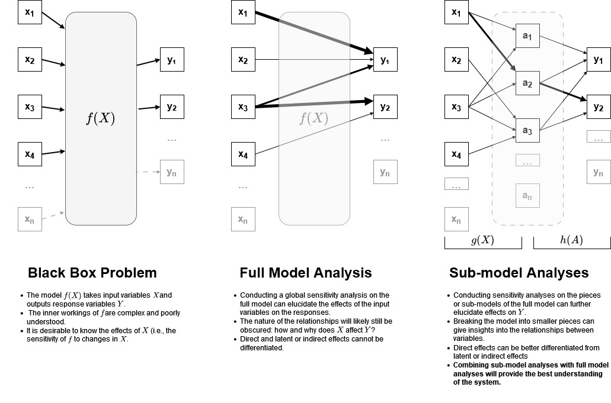

# Sensitivity Analyses for RuFaS

Authors: Clay J. Morrow, Joseph Waddell <!-- TODO: Joe, Varma, and others, please add your name here when you make changes/additions -->   
Date Created: 17 Mar 2023   
Last Updated: 31 Mar 2023 <!-- NOTE: please remember to change this date when editing this file --> 

__Contents:__
1. [Overview](#overview)
2. [Context](#context)  
3. [Requirements](#requirements)
4. [Milestones](#milestones)
5. [Existing Solutions](#existing-solution)
6. [Proposed Solution](#proposed-solution)
7. [Additional Discussion of RuFaS SA](#additional-discussion-of-rufas-sa)
8. [Summary of SA Module](#summary-of-sa-module)  
   a. [Parallelization](#parallelization)  
   b. [Types of SA](#types-of-sa)  
   c. [References and Links](#references-and-links)  

---

##  Overview

The purpose of this document is to guide the RuFaS team in conducting sensitivity analyses (SA) for the model and to
describe the `SensitivityAnalysis` module. This document is a combination of a design document for the SA module 
and a plan for conducting SA across the RuFaS model. 

---

## Context

The RuFaS simulation model is highly complex, it simulates an entire farm from many equations, functions,
and sub-models. There are thousands of variables that the model tracks and calculates throughout the simulation. Users
provide dozens of these variables, many variables of interest are calculated and returned to users, and many more
are internal intermediate variables. Because of this complexity, RuFaS is somewhat of a black box and model 
validation like SA will be a challenging endeavor. Our team will need to conduct multiple SAs, on different parts of the
model (e.g., sub-modules), across different time periods (single day to multiple years), under various environmental
conditions (weather), and with different suites of variables (input, output, and intermediary). The framework laid
out here and the `SensitivityAnalysis` module aim to help with this process. 

---

## Requirements

In the context of validating the RuFaS model, global sensitivity analyses will help us to better understand our system.
Successful analyses will:
* Identify variables that the model is most affected by, with respect to a particular output, for all response 
variables of interest. This includes variables that the users have direct agency over and intermediary variables
(or hyper-parameters) that can be used to fine-tune behavior of the model.
* Improve our understanding of the relationships between variables, especially across modules.
* 

---

## Milestones

At the time of this writing, this project is in the earliest stages and does not have tangible goals or estimates for
a timeline. 

---

## Existing Solution

There is no existing solution to SA in RuFaS. However, the existing `SALib` does provide tools for conducting SA. This
project will utilize those tools.

---

## Proposed Solution

To improve our understanding of the RuFas module, the authors propose that a series of global sensitivity analyses be
conducted:
1. A (possibly series of) truly global sensitivity analysis of the entire module: determine the effect of
*user-specified inputs* on *user-desired outputs*. 
2. SA conducted on all the individual modules: determine the effect of a module's inputs on its outputs
3. Perhaps SA should even be run for some sub-modules to further clarify.
4. Perhaps SA should be run on multiple modules together, but not the entire RuFaS.

The value of conducting SA at multiple scales is represented in Figure 1.

*Figure 1* Sensitivity analyses at different scales. 

Some (or all) of these analyses should be conducted on multiple time scales, for example:
* Over a full, typical simulation: This will clarify how parameters can affect the entire result **given a particular
set of environmental conditions (i.e., weather)**. The results of these analyses will be entirely dependent upon the
conditions over which the users do not have control. The main example is weather. To truly see how sensitive the model
is to different conditions, weather also needs to be varied. One solution would be to simulate weather over time (using
a narrow set of weather parameters), and include weather parameters in the SA, but this is not a simple endeavor. 
* For individual time steps: How does variable `x` affect variable `y` in one day? This allows us to get the best
understanding for drivers of patterns in the model. For temporal variables that depend on a previous value 
($x_t = f(x_{t-1})$), simply including the previous value as one of the parameters for SA would work. 

See [Additional Discussion of RuFaS SA](#additional-discussion-of-rufas-sa) for further details.

---

## Alternative Solutions

An alternative solution would be to simply conduct the global SA of the entire RuFaS module, but this would lead to a 
relatively poor understanding of the whole system 
(see [Additional Discussion of RuFaS SA](#additional-discussion-of-rufas-sa) below). 

---

## Testability, Monitoring, and Alerting

I am unsure how to test the `SensitivityAnalysis` module, and I am unsure if it even needs to be tested. Perhaps
some aspects should have formal tests, but because it is a stochastic process, it will be difficult.

---

## Cross-Team Impact

All RuFaS teams should benefit from this addition, since they should all conduct SA to see how their module performs, 
and what the key variables are. 

---

## Open Questions

* As mentioned in [Proposed Solution](#proposed-solution), the scope of the SA will determine the extent to which we
understand the model.
* Another question is how critical it is to quantify **specific** interactions among variables. This is discussed 
further in the conversation about the [Sobol method](#types-of-sa).

---

## Scoping and Timeline

* As stated previously, no timeline can be estimated at this point. 
* For the details of the `SensitivityAnalysis` module, see [Summary of the SA Module](#summary-of-sa-module) below.
* For the discussion on how to conduct SA on RuFaS see [Proposed Solution](#proposed-solution) and proceed to 
[Additional Discussion of RuFaS SA](#additional-discussion-of-rufas-sa)

---

## Additional Discussion of RuFaS SA

This section is currently a placeholder for additional discussions about SA in the context of RuFaS. 

---

## Summary of SA Module

The methods discussed and outlined in this section can be applied to either 1) The entire RuFaS model or 2) any 
submodule, with minimal work on the user's part. 
Joe Waddell began this process, by finding the relevant packages and writing some scripts to implement SA for the full 
RuFaS module. My goal is to build on his work to write a module that generalises the SA methods and allows them to be 
applied to any python function/module. 

The [References and Links](#references-and-links) section provides both the primary and secondary sources that we used
to create these methods. 

Broadly speaking, a global sensitivity analysis (SA) simply aims to answer the question, "which parameters have the 
largest impact on the results of a model".

Within the [generalized_sensitivity.py](generalized_sensitivity.py) file, is the class `SensitivityAnalysis`. This 
class executes a standardized procedure for conducting SA. The user needs to provide an objective function, names of
parameters of that function to be analyzed, upper and lower bounds for each parameter, and some additional 
specifications about how the SA should be conducted. 

Currently, this class supports 3 methods for conducting SA. These methods (Sobol, FAST, and Morris' method) are
further discussed below in [Types of SA](#types-of-sa). 

### Parallelization

Because RuFaS takes a long time to run and will need to be executed many times (thousands), it will be important to
parallelize its execution. Luckily the package that we are using to perform SA 
[SALib](https://salib.readthedocs.io/en/latest/) (additional links and description provided in the 
[SALib Section](#salib) below) already utilizes parallel processing. We leverage that functionality in our SA class.

### Types of SA

In this document, we'll consider 3 methods of global sensitivity analysis: 1) Morris' method, 2) the extended FAST
method, and 3) the Sobol method. They each have their advantages and disadvantages. Generally speaking, Sobol is
the most accurate but is the slowest by far. The other methods are fast and accurate but can't quantify
interactive effects (Sobol can quantify 2nd order). See 
[SALib's supported methods](https://salib.readthedocs.io/en/latest/#supported-methods) for more details about different
SA methods and their implementation.

A solid review/summary/critique that covers different approaches in more detail:
[Paleari et al, 2021](https://www.sciencedirect.com/science/article/pii/S0304380021002088?casa_token=xTPqc6Gp5w4AAAAA:HUJUaa__fELazAdkJrfCtK5DyILPrRqUdvHBKN_8t6ikjLYsb7UpdpmR_KYgiqpRf9tcgdmGcZI) 

They outline some drawbacks of different methods, and may serve as a good citation when publishing results. 
Particularly, when we are able to demonstrate concordance between the different metrics. Part of the overall workflow 
can/should include various techniques, with the fastest methods being used as a first pass, allowing us to have both 
preliminary results and detailed second-order effects calculated - when appropriate - using the computationally 
intensive Sobol method. 

###### Morris' method

Based on Morris (1991), it appears that this method (perhaps all SA?) assume that, given a set of input, the output is
always the same (i.e., deterministic and non-stochastic): "... a computational model is viewed as a representation of a 
function that produces unique values of outputs when executed for specific values of inputs" and "... Since model 
outputs do not contain random error, the well-known inefficiencies of estimation based on linear-models analyses of
noisy data from one-factor-at-a-time plans are not an issue here". This indicates that any stochastic output will 
need additional consideration. One idea would be to use statistical methods (e.g., regression), but Pang et al (2019)
demonstrates that statistical SA tools may not perform well.

There is no explicit test of interactions in this method but a large variance "indicates an input whose influence is 
highly dependent on the values of the inputs - that is, one involved in interactions or whose effect is nonlinear."

See [SALib's method of Morris implementation](https://salib.readthedocs.io/en/latest/api.html#method-of-morris).

###### FAST (Extended)
<!-- TODO: add summary of FAST method -->

See [SALib's FAST implementation](
https://salib.readthedocs.io/en/latest/api.html#fast-fourier-amplitude-sensitivity-test).

###### Sobol method
<!-- TODO: add summary of Sobol Method -->

See [SALib's Sobol implementation](https://salib.readthedocs.io/en/latest/api.html#sobol-sensitivity-analysis).

---

### References and Links

This section contains primary and secondary sources used to evaluate SA methods.

#### Primary sources

These are the primary sources used for researching the best methods and practices for conducting SA: 

* [*Sensitivity Analyses in Practice* book (Saltelli 2004)](
  http://www.andreasaltelli.eu/file/repository/SALTELLI_2004_Sensitivity_Analysis_in_Practice.pdf
  )
* [Original article on Morris' method (Morris 1991)](
  https://citeseerx.ist.psu.edu/document?repid=rep1&type=pdf&doi=150efe8feb764de271a01dc261f7a74b3ccb9187
  )
* [Study comparing SA methods (Pang et al. 2019)](http://www.ibpsa.org/proceedings/BS2019/BS2019_210209.pdf)
* [Extended FAST method (Saltelli et  al. 2012)](
  https://www.researchgate.net/profile/Andrea-Saltelli-2/publication/243587760_A_Quantitative_Model-Independent_Method_for_Global_Sensitivity_Analysis_of_Model_Output/links/00b49536889b064f12000000/A-Quantitative-Model-Independent-Method-for-Global-Sensitivity-Analysis-of-Model-Output.pdf
  )
 
#### SALib

SALib is the python package that we will use for conducting sensitivity analyses. It is well-supported and implemented.
Here are some relevant links to help get started with this package:

* [GitHub page](https://github.com/SALib)
* [Python doc page](https://salib.readthedocs.io/en/latest/index.html)
* [Author blog](https://waterprogramming.wordpress.com/2013/08/05/running-sobol-sensitivity-analysis-using-salib/)
* [Author post about package extension](
  https://waterprogramming.wordpress.com/2014/02/11/extensions-of-salib-for-more-complex-sensitivity-analyses/
  )
* [Applied example 1](http://keyboardscientist.weebly.com/blog/sensitivity-analysis-with-salib)
* [Applied example 2](https://notebook.community/locie/locie_notebook/misc/Sensitivity_analysis)
* [Package example using a variable and parameters](https://salib.readthedocs.io/en/latest/basics.html#another-example)
* [Categorical data GitHub Issue](https://github.com/SALib/SALib/issues/195)
* [Negative sobol index GitHub Issues](https://github.com/SALib/SALib/issues/102)
* [How to wrap existing models](https://salib.readthedocs.io/en/latest/user_guide/wrappers.html)

The documentation for the package pretty good, and the two blogs are helpful at seeing how others have used it. 

NOTE: SALIb has parallel and distributed processing available out of box. It DOES NOT work in pycharm, but DOES work
with all other methods of running python code. It is a known issue that the python interactive console cannot execute
code from the `multiprocessing` package (it has been 4 years, so I doubt it will ever get patched): [Link](
https://youtrack.jetbrains.com/issue/PY-36151?_ga=2.6010288.221937295.1679330535-2071016451.1670387953&_gl=1*1qr3jl1*_ga*MjA3MTAxNjQ1MS4xNjcwMzg3OTUz*_ga_9J976DJZ68*MTY3OTMzMDUzNC4xMS4wLjE2NzkzMzA1NDMuMC4wLjA.
)
